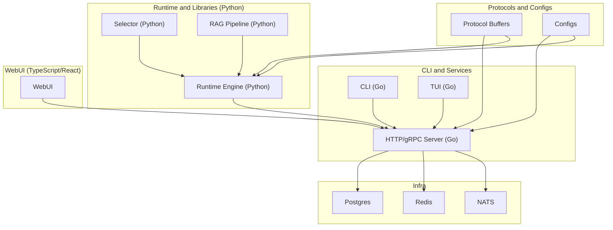
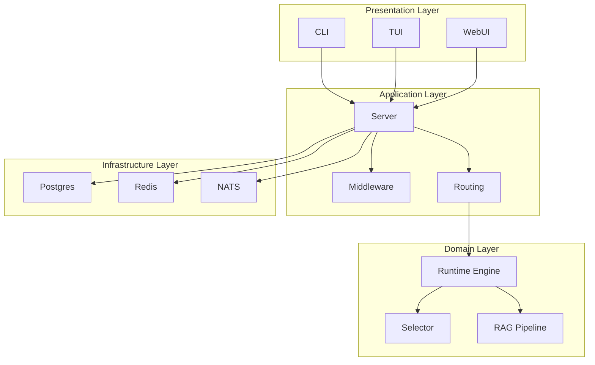
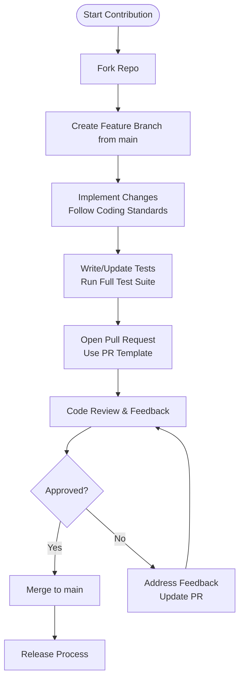
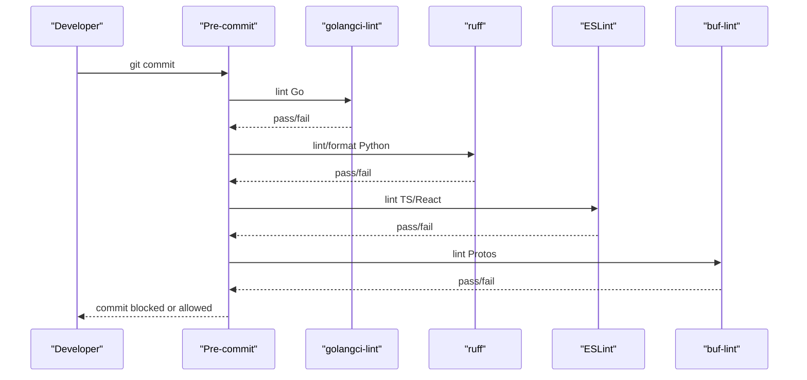
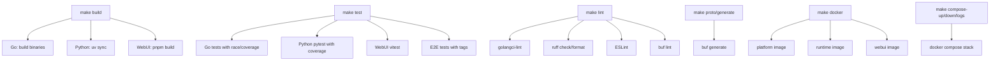
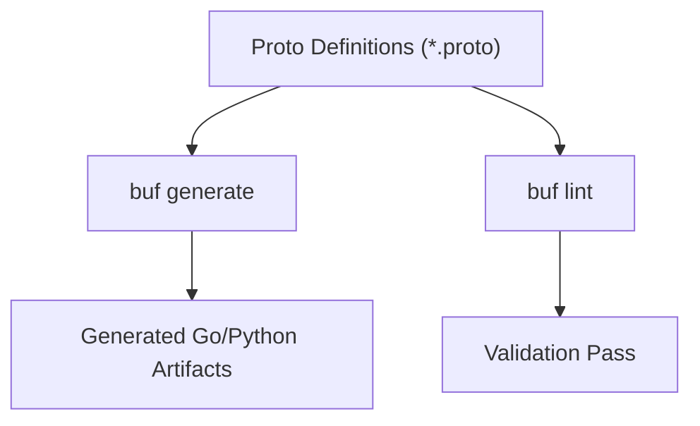
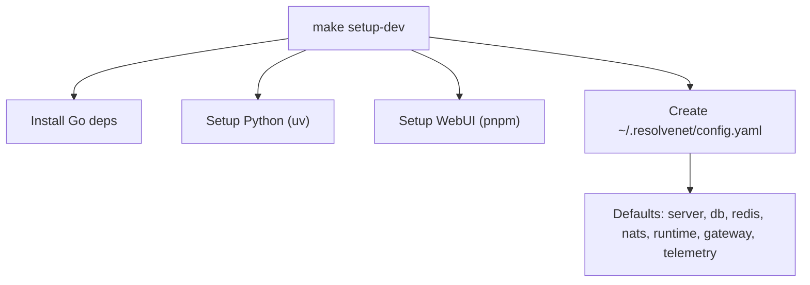
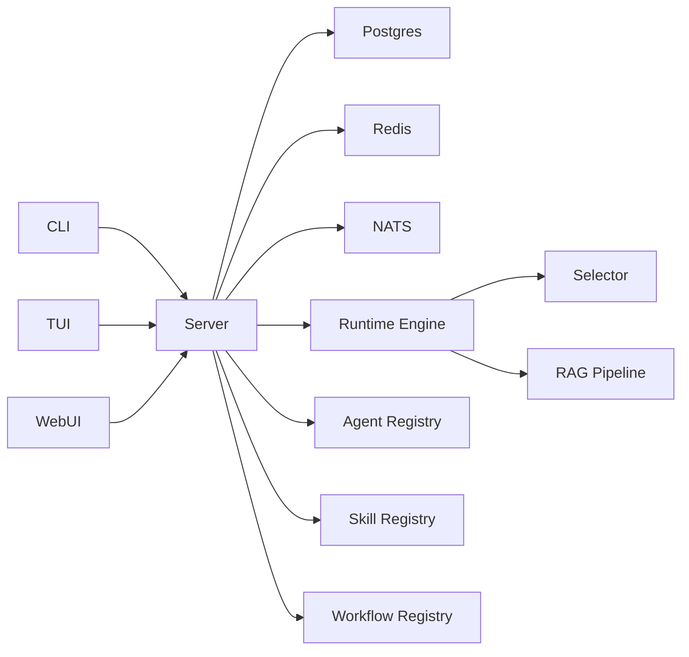

# Development Guidelines

<cite>
**Referenced Files in This Document**
- [CONTRIBUTING.md](file://CONTRIBUTING.md)
- [GOVERNANCE.md](file://GOVERNANCE.md)
- [MAINTAINERS.md](file://MAINTAINERS.md)
- [CODE_OF_CONDUCT.md](file://CODE_OF_CONDUCT.md)
- [Makefile](file://Makefile)
- [hack/setup-dev.sh](file://hack/setup-dev.sh)
- [hack/lint.sh](file://hack/lint.sh)
- [hack/generate-proto.sh](file://hack/generate-proto.sh)
- [.golangci.yml](file://.golangci.yml)
- [.pre-commit-config.yaml](file://.pre-commit-config.yaml)
- [.github/workflows/ci.yaml](file://.github/workflows/ci.yaml)
- [.github/workflows/docker-publish.yaml](file://.github/workflows/docker-publish.yaml)
- [configs/resolvenet.yaml](file://configs/resolvenet.yaml)
- [configs/models.yaml](file://configs/models.yaml)
- [python/pyproject.toml](file://python/pyproject.toml)
- [web/package.json](file://web/package.json)
- [tools/buf/buf.yaml](file://tools/buf/buf.yaml)
- [tools/buf/buf.gen.yaml](file://tools/buf/buf.gen.yaml)
- [api/proto/resolvenet/v1/*.proto](file://api/proto/resolvenet/v1/agent.proto)
- [internal/cli/root.go](file://internal/cli/root.go)
- [internal/tui/app.go](file://internal/tui/app.go)
- [pkg/server/server.go](file://pkg/server/server.go)
- [pkg/store/postgres/postgres.go](file://pkg/store/postgres/postgres.go)
- [pkg/store/redis/redis.go](file://pkg/store/redis/redis.go)
- [pkg/event/nats.go](file://pkg/event/nats.go)
- [pkg/registry/agent.go](file://pkg/registry/agent.go)
- [pkg/registry/skill.go](file://pkg/registry/skill.go)
- [pkg/registry/workflow.go](file://pkg/registry/workflow.go)
- [python/src/resolvenet/runtime/engine.py](file://python/src/resolvenet/runtime/engine.py)
- [python/src/resolvenet/selector/router.py](file://python/src/resolvenet/selector/router.py)
- [python/src/resolvenet/rag/pipeline.py](file://python/src/resolvenet/rag/pipeline.py)
- [test/e2e/agent_lifecycle_test.go](file://test/e2e/agent_lifecycle_test.go)
- [test/e2e/workflow_execution_test.go](file://test/e2e/workflow_execution_test.go)
</cite>

## Table of Contents
1. [Introduction](#introduction)
2. [Project Structure](#project-structure)
3. [Core Components](#core-components)
4. [Architecture Overview](#architecture-overview)
5. [Detailed Component Analysis](#detailed-component-analysis)
6. [Dependency Analysis](#dependency-analysis)
7. [Performance Considerations](#performance-considerations)
8. [Troubleshooting Guide](#troubleshooting-guide)
9. [Conclusion](#conclusion)
10. [Appendices](#appendices)

## Introduction
This document defines ResolveNet’s development guidelines and contribution processes. It covers the development workflow, code organization, branching and PR procedures, quality standards, pre-commit hooks, automated checks, the Makefile-based build system, Protocol Buffer generation, contribution and RFC processes, code review expectations, testing requirements, release procedures, development environment setup, debugging, performance optimization, and governance and community participation.

## Project Structure
ResolveNet is a multi-language, multi-component platform:
- Go backend services and CLI/TUI
- Python runtime and libraries
- TypeScript/React WebUI
- Protocol Buffer APIs
- Docker/Kubernetes deployment assets
- CI/CD workflows

**Diagram sources**
- [Makefile:54-58](file://Makefile#L54-L58)
- [pkg/server/server.go:1-50](file://pkg/server/server.go#L1-L50)
- [pkg/store/postgres/postgres.go:1-50](file://pkg/store/postgres/postgres.go#L1-L50)
- [pkg/store/redis/redis.go:1-50](file://pkg/store/redis/redis.go#L1-L50)
- [pkg/event/nats.go:1-50](file://pkg/event/nats.go#L1-L50)
- [python/src/resolvenet/runtime/engine.py:1-50](file://python/src/resolvenet/runtime/engine.py#L1-L50)
- [python/src/resolvenet/selector/router.py:1-50](file://python/src/resolvenet/selector/router.py#L1-L50)
- [python/src/resolvenet/rag/pipeline.py:1-50](file://python/src/resolvenet/rag/pipeline.py#L1-L50)
- [web/package.json:6-14](file://web/package.json#L6-L14)

**Section sources**
- [Makefile:1-220](file://Makefile#L1-L220)
- [configs/resolvenet.yaml:1-34](file://configs/resolvenet.yaml#L1-L34)

## Core Components
- CLI and TUI: Command-line and terminal UI built in Go, exposing commands for agents, skills, workflows, and server operations.
- HTTP/gRPC Server: Central service handling requests, routing, middleware, and inter-component communication.
- Python Runtime and Libraries: Runtime engine, selector, and RAG pipeline powering agent behaviors.
- WebUI: React-based interface for designing, monitoring, and interacting with agents and workflows.
- Protobuf APIs: Strongly typed contracts for service communication and schema evolution.
- Infrastructure: PostgreSQL, Redis, NATS for persistence, caching, and messaging.

**Section sources**
- [internal/cli/root.go:1-100](file://internal/cli/root.go#L1-L100)
- [internal/tui/app.go:1-100](file://internal/tui/app.go#L1-L100)
- [pkg/server/server.go:1-100](file://pkg/server/server.go#L1-L100)
- [python/src/resolvenet/runtime/engine.py:1-100](file://python/src/resolvenet/runtime/engine.py#L1-L100)
- [python/src/resolvenet/selector/router.py:1-100](file://python/src/resolvenet/selector/router.py#L1-L100)
- [python/src/resolvenet/rag/pipeline.py:1-100](file://python/src/resolvenet/rag/pipeline.py#L1-L100)
- [api/proto/resolvenet/v1/agent.proto:1-50](file://api/proto/resolvenet/v1/agent.proto#L1-L50)

## Architecture Overview
ResolveNet follows a modular, layered architecture:
- Presentation: CLI, TUI, WebUI
- Application: HTTP/gRPC server, middleware, routing
- Domain: Runtime engine, selector, RAG
- Persistence: Postgres, Redis
- Messaging: NATS
- Contracts: Protocol Buffers

**Diagram sources**
- [pkg/server/server.go:1-100](file://pkg/server/server.go#L1-L100)
- [pkg/server/middleware/auth.go:1-50](file://pkg/server/middleware/auth.go#L1-L50)
- [pkg/server/middleware/logging.go:1-50](file://pkg/server/middleware/logging.go#L1-L50)
- [pkg/server/middleware/tracing.go:1-50](file://pkg/server/middleware/tracing.go#L1-L50)
- [python/src/resolvenet/runtime/engine.py:1-100](file://python/src/resolvenet/runtime/engine.py#L1-L100)
- [python/src/resolvenet/selector/router.py:1-100](file://python/src/resolvenet/selector/router.py#L1-L100)
- [python/src/resolvenet/rag/pipeline.py:1-100](file://python/src/resolvenet/rag/pipeline.py#L1-L100)
- [pkg/store/postgres/postgres.go:1-100](file://pkg/store/postgres/postgres.go#L1-L100)
- [pkg/store/redis/redis.go:1-100](file://pkg/store/redis/redis.go#L1-L100)
- [pkg/event/nats.go:1-100](file://pkg/event/nats.go#L1-L100)

## Detailed Component Analysis

### Development Workflow and Branching
- Fork the repository and create a feature branch from main.
- Make changes following project coding standards.
- Add or update tests; ensure all tests pass.
- Submit a pull request using the provided template.

**Section sources**
- [CONTRIBUTING.md:17-24](file://CONTRIBUTING.md#L17-L24)

### Pull Request Procedures
- Use the provided PR template.
- Ensure CI passes and reviews are approved.
- Keep PRs focused and small for faster reviews.

**Section sources**
- [CONTRIBUTING.md:23](file://CONTRIBUTING.md#L23)

### Code Quality Standards
- Go
  - Effective Go guidelines.
  - Formatting with gofumpt.
  - Exported functions must have documentation.
  - Structured logging with slog.
  - Propagate context through function signatures.
- Python
  - PEP 8 enforced by ruff.
  - Type hints on public functions.
  - Pydantic models for data structures.
  - Format with ruff format.
- TypeScript/React
  - Strict TypeScript configuration.
  - Hooks conventions.
  - Functional components.
- Protocol Buffers
  - Buf style guide.
  - Validate with buf lint.

**Section sources**
- [CONTRIBUTING.md:53-80](file://CONTRIBUTING.md#L53-L80)
- [.golangci.yml:5-69](file://.golangci.yml#L5-L69)
- [python/pyproject.toml:51-66](file://python/pyproject.toml#L51-L66)
- [web/package.json:24-42](file://web/package.json#L24-L42)
- [tools/buf/buf.yaml:1-50](file://tools/buf/buf.yaml#L1-L50)

### Pre-commit Hooks and Automated Checks
- Pre-commit enforces:
  - Trailing whitespace, EOF fixer, YAML/JSON checks, large files, merge conflict detection, private key detection.
  - golangci-lint for Go.
  - ruff and ruff-format for Python.
  - ESLint for TypeScript/React.
  - buf-lint for Protocol Buffers.
- Local lint runner script executes the same checks.

**Diagram sources**
- [.pre-commit-config.yaml:1-44](file://.pre-commit-config.yaml#L1-L44)
- [hack/lint.sh:1-21](file://hack/lint.sh#L1-L21)

**Section sources**
- [.pre-commit-config.yaml:1-44](file://.pre-commit-config.yaml#L1-L44)
- [hack/lint.sh:1-21](file://hack/lint.sh#L1-L21)

### Build System with Makefile
Key targets:
- build: builds Go binaries, Python package, and WebUI.
- test: runs Go, Python, WebUI, and E2E tests.
- lint: runs all linters for Go, Python, WebUI, and Protos.
- proto/generate: generates code from Protocol Buffers.
- docker: builds platform, runtime, and WebUI images.
- compose-*: starts/stops dependencies and full stack.
- helm-*: installs/upgrades/uninstalls charts.
- setup-dev: sets up dev environment.
- clean: cleans build artifacts.
- fmt: formats all code.

**Diagram sources**
- [Makefile:50-220](file://Makefile#L50-L220)

**Section sources**
- [Makefile:50-220](file://Makefile#L50-L220)

### Code Generation for Protocol Buffers
- Use buf generate with configured module and template.
- Generated code is validated by buf lint.
- Keep proto definitions under api/proto and update buf configs when changing schemas.

**Diagram sources**
- [hack/generate-proto.sh:1-17](file://hack/generate-proto.sh#L1-L17)
- [tools/buf/buf.gen.yaml:1-50](file://tools/buf/buf.gen.yaml#L1-L50)
- [tools/buf/buf.yaml:1-50](file://tools/buf/buf.yaml#L1-L50)

**Section sources**
- [hack/generate-proto.sh:1-17](file://hack/generate-proto.sh#L1-L17)
- [tools/buf/buf.gen.yaml:1-50](file://tools/buf/buf.gen.yaml#L1-L50)
- [tools/buf/buf.yaml:1-50](file://tools/buf/buf.yaml#L1-L50)

### Contributing New Features, Bug Fixes, and Docs
- New features: implement in appropriate layer (Go/Python/TS), add tests, update docs, and open PR.
- Bug fixes: reproduce with tests, fix root cause, add regression tests.
- Documentation: keep docs/rfcs/quickstart/user-guide aligned with changes.

**Section sources**
- [CONTRIBUTING.md:9-24](file://CONTRIBUTING.md#L9-L24)

### Code Review Processes
- PRs require at least one maintainer review.
- RFCs are required for significant architectural changes.
- Reviews focus on correctness, performance, security, and adherence to standards.

**Section sources**
- [GOVERNANCE.md:23-28](file://GOVERNANCE.md#L23-L28)
- [CONTRIBUTING.md:81-88](file://CONTRIBUTING.md#L81-L88)

### Testing Requirements
- Unit tests for Go, Python, and WebUI.
- E2E tests tagged for end-to-end scenarios.
- Coverage reporting via Go and Python test runners.
- CI validates all tests and linters.

**Section sources**
- [Makefile:72-91](file://Makefile#L72-L91)
- [test/e2e/agent_lifecycle_test.go:1-50](file://test/e2e/agent_lifecycle_test.go#L1-L50)
- [test/e2e/workflow_execution_test.go:1-50](file://test/e2e/workflow_execution_test.go#L1-L50)

### Release Procedures
- Releases are managed by maintainers per governance.
- CI handles publishing artifacts and container images.
- Version metadata embedded at build time.

**Section sources**
- [GOVERNANCE.md:11](file://GOVERNANCE.md#L11)
- [Makefile:23-26](file://Makefile#L23-L26)
- [.github/workflows/docker-publish.yaml:1-50](file://.github/workflows/docker-publish.yaml#L1-L50)

### Development Environment Setup
- Prerequisites: Go >= 1.22, Python >= 3.11 with uv, Node.js >= 20 with pnpm, Buf CLI, Docker/Docker Compose.
- One-command setup: make setup-dev or hack script.
- Local defaults: PostgreSQL, Redis, NATS via docker-compose; optional telemetry/admin gateway.

**Diagram sources**
- [Makefile:200-202](file://Makefile#L200-L202)
- [hack/setup-dev.sh:1-61](file://hack/setup-dev.sh#L1-L61)
- [configs/resolvenet.yaml:1-34](file://configs/resolvenet.yaml#L1-L34)

**Section sources**
- [CONTRIBUTING.md:45-52](file://CONTRIBUTING.md#L45-L52)
- [Makefile:200-202](file://Makefile#L200-L202)
- [hack/setup-dev.sh:1-61](file://hack/setup-dev.sh#L1-L61)
- [configs/resolvenet.yaml:1-34](file://configs/resolvenet.yaml#L1-L34)

### Debugging Techniques
- Use verbose logging and structured logs.
- Enable tracing/metrics for distributed flows.
- Inspect NATS streams/channels for async events.
- Use TUI and WebUI dashboards for operational visibility.

**Section sources**
- [pkg/telemetry/logger.go:1-50](file://pkg/telemetry/logger.go#L1-L50)
- [pkg/telemetry/tracer.go:1-50](file://pkg/telemetry/tracer.go#L1-L50)
- [pkg/event/nats.go:1-100](file://pkg/event/nats.go#L1-L100)
- [internal/tui/views/dashboard.go:1-50](file://internal/tui/views/dashboard.go#L1-L50)

### Performance Optimization
- Prefer efficient data structures and algorithms.
- Use Redis for caching hot paths.
- Tune Postgres indexes and queries.
- Minimize network round-trips; leverage streaming where applicable.
- Monitor latency and throughput via telemetry.

**Section sources**
- [pkg/store/redis/redis.go:1-100](file://pkg/store/redis/redis.go#L1-L100)
- [pkg/store/postgres/postgres.go:1-100](file://pkg/store/postgres/postgres.go#L1-L100)
- [pkg/telemetry/metrics.go:1-50](file://pkg/telemetry/metrics.go#L1-L50)

### Project Governance and Community Participation
- Roles: Maintainers (merge rights, releases), Contributors (all contributions), Reviewers (trusted reviewers).
- Decision-making: Consensus among maintainers; RFCs for major changes; voting if consensus fails.
- Becoming a maintainer: sustained contributions, understanding of architecture, nomination, approval.
- Code of Conduct applies to all participants.

**Section sources**
- [GOVERNANCE.md:1-40](file://GOVERNANCE.md#L1-L40)
- [MAINTAINERS.md:1-16](file://MAINTAINERS.md#L1-L16)
- [CODE_OF_CONDUCT.md:1-52](file://CODE_OF_CONDUCT.md#L1-L52)

## Dependency Analysis
Internal component relationships and external dependencies:

**Diagram sources**
- [internal/cli/root.go:1-100](file://internal/cli/root.go#L1-L100)
- [internal/tui/app.go:1-100](file://internal/tui/app.go#L1-L100)
- [pkg/server/server.go:1-100](file://pkg/server/server.go#L1-L100)
- [pkg/store/postgres/postgres.go:1-100](file://pkg/store/postgres/postgres.go#L1-L100)
- [pkg/store/redis/redis.go:1-100](file://pkg/store/redis/redis.go#L1-L100)
- [pkg/event/nats.go:1-100](file://pkg/event/nats.go#L1-L100)
- [python/src/resolvenet/runtime/engine.py:1-100](file://python/src/resolvenet/runtime/engine.py#L1-L100)
- [python/src/resolvenet/selector/router.py:1-100](file://python/src/resolvenet/selector/router.py#L1-L100)
- [python/src/resolvenet/rag/pipeline.py:1-100](file://python/src/resolvenet/rag/pipeline.py#L1-L100)
- [pkg/registry/agent.go:1-100](file://pkg/registry/agent.go#L1-L100)
- [pkg/registry/skill.go:1-100](file://pkg/registry/skill.go#L1-L100)
- [pkg/registry/workflow.go:1-100](file://pkg/registry/workflow.go#L1-L100)

**Section sources**
- [pkg/registry/agent.go:1-100](file://pkg/registry/agent.go#L1-L100)
- [pkg/registry/skill.go:1-100](file://pkg/registry/skill.go#L1-L100)
- [pkg/registry/workflow.go:1-100](file://pkg/registry/workflow.go#L1-L100)

## Performance Considerations
- Use Redis for caching frequently accessed agent/workflow metadata.
- Optimize database queries; add indexes for hot keys.
- Minimize protobuf serialization overhead; reuse connections.
- Enable compression for large payloads.
- Monitor NATS queue lag and adjust consumer concurrency.

[No sources needed since this section provides general guidance]

## Troubleshooting Guide
- Pre-commit failures: run local lint script to reproduce and fix issues.
- Build/test failures: use make clean, then rebuild; verify prerequisites.
- Docker stack issues: check compose logs target; ensure ports are free.
- Python dependency issues: re-run uv sync; check pyproject configuration.
- Go lint errors: apply gofumpt; address golangci-lint suggestions.
- Proto generation issues: ensure buf installed; verify buf configs.

**Section sources**
- [hack/lint.sh:1-21](file://hack/lint.sh#L1-L21)
- [Makefile:204-212](file://Makefile#L204-L212)
- [hack/generate-proto.sh:1-17](file://hack/generate-proto.sh#L1-L17)
- [python/pyproject.toml:36-42](file://python/pyproject.toml#L36-L42)
- [.golangci.yml:5-69](file://.golangci.yml#L5-L69)

## Conclusion
ResolveNet’s development guidelines emphasize strong quality practices, automated checks, and a clear contribution process. By following the Makefile targets, pre-commit hooks, and coding standards across languages, contributors can efficiently deliver reliable features and improvements while maintaining a healthy, scalable codebase.

## Appendices

### CI/CD Overview
- Continuous integration validates Go, Python, WebUI, Protobuf, and E2E tests.
- Container images are published on version tags.

**Section sources**
- [.github/workflows/ci.yaml:1-50](file://.github/workflows/ci.yaml#L1-L50)
- [.github/workflows/docker-publish.yaml:1-50](file://.github/workflows/docker-publish.yaml#L1-L50)

### Configuration Reference
- Platform defaults: server addresses, database, Redis, NATS, runtime, gateway, telemetry.
- Model registry: providers and model configurations.

**Section sources**
- [configs/resolvenet.yaml:1-34](file://configs/resolvenet.yaml#L1-L34)
- [configs/models.yaml:1-31](file://configs/models.yaml#L1-L31)