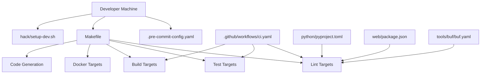
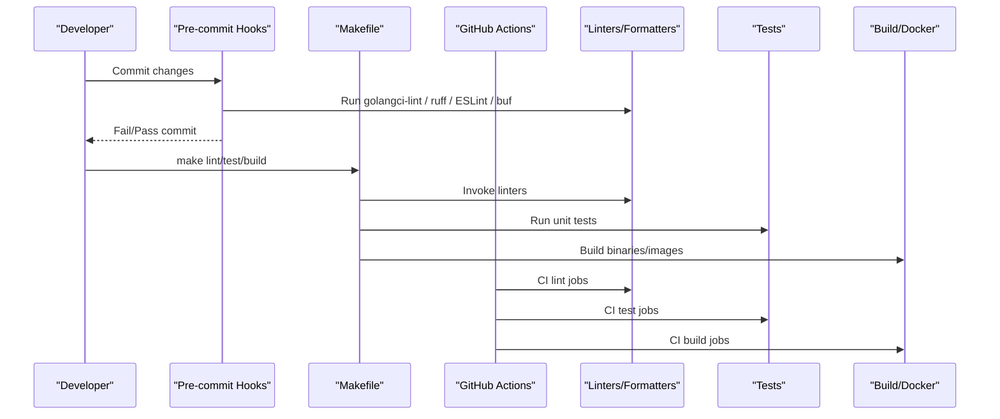
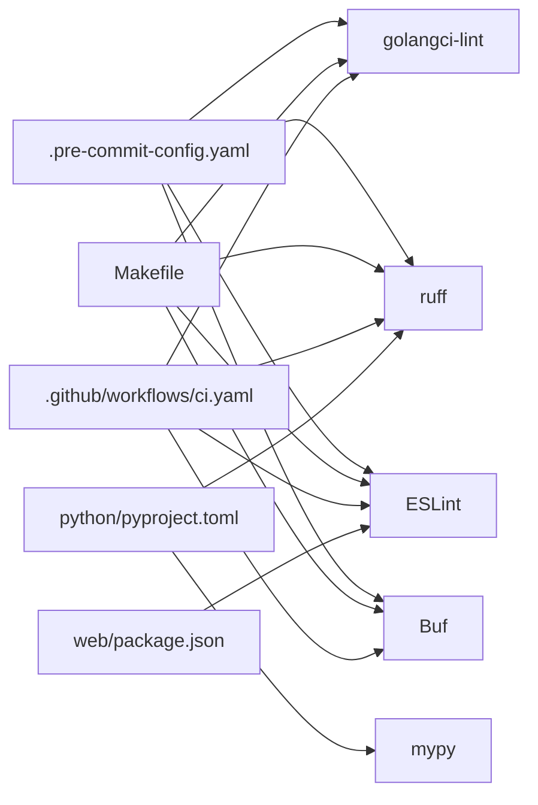

# Development Tools

<cite>
**Referenced Files in This Document**
- [.pre-commit-config.yaml](file://.pre-commit-config.yaml)
- [.golangci.yml](file://.golangci.yml)
- [hack/lint.sh](file://hack/lint.sh)
- [hack/setup-dev.sh](file://hack/setup-dev.sh)
- [Makefile](file://Makefile)
- [.github/workflows/ci.yaml](file://.github/workflows/ci.yaml)
- [python/pyproject.toml](file://python/pyproject.toml)
- [web/package.json](file://web/package.json)
- [tools/buf/buf.yaml](file://tools/buf/buf.yaml)
- [tools/buf/buf.gen.yaml](file://tools/buf/buf.gen.yaml)
- [.editorconfig](file://.editorconfig)
</cite>

## Table of Contents
1. [Introduction](#introduction)
2. [Project Structure](#project-structure)
3. [Core Components](#core-components)
4. [Architecture Overview](#architecture-overview)
5. [Detailed Component Analysis](#detailed-component-analysis)
6. [Dependency Analysis](#dependency-analysis)
7. [Performance Considerations](#performance-considerations)
8. [Troubleshooting Guide](#troubleshooting-guide)
9. [Conclusion](#conclusion)
10. [Appendices](#appendices)

## Introduction
This document describes ResolveNet’s development tooling and automation systems. It covers pre-commit hooks, linting and formatting for Go, Python, and TypeScript/React, CI/CD integration, code generation, and developer environment setup. It also provides guidance on debugging, profiling, IDE setup, and toolchain maintenance.

## Project Structure
ResolveNet organizes tooling across multiple layers:
- Pre-commit hooks define local quality gates for all supported languages and Protobuf.
- Make targets orchestrate builds, tests, linters, code generation, Docker builds, and development helpers.
- GitHub Actions implement CI jobs for linting, testing, and building.
- Language-specific configuration files define lint rules, formatting, and type checking.
- Buf is used for Protobuf linting and generation.

**Diagram sources**
- [.pre-commit-config.yaml:1-44](file://.pre-commit-config.yaml#L1-L44)
- [Makefile:92-129](file://Makefile#L92-L129)
- [.github/workflows/ci.yaml:1-89](file://.github/workflows/ci.yaml#L1-L89)
- [python/pyproject.toml:51-66](file://python/pyproject.toml#L51-L66)
- [web/package.json:10-14](file://web/package.json#L10-L14)
- [tools/buf/buf.yaml](file://tools/buf/buf.yaml)

**Section sources**
- [.pre-commit-config.yaml:1-44](file://.pre-commit-config.yaml#L1-L44)
- [Makefile:92-129](file://Makefile#L92-L129)
- [.github/workflows/ci.yaml:1-89](file://.github/workflows/ci.yaml#L1-L89)

## Core Components
- Pre-commit hooks: enforce formatting, linting, and safety checks for Go, Python, TypeScript/React, and Protobuf.
- Linters and formatters:
  - Go: golangci-lint configured via .golangci.yml.
  - Python: ruff for linting/formatting; mypy for type checking.
  - TypeScript/React: ESLint via pre-commit mirror; Prettier via web package scripts.
- CI/CD: GitHub Actions jobs for linting, testing, and building across platforms.
- Code generation: Buf for Protobuf, plus a dedicated script and Make target.
- Developer environment: One-command setup script and Make helpers.

**Section sources**
- [.pre-commit-config.yaml:1-44](file://.pre-commit-config.yaml#L1-L44)
- [.golangci.yml:1-69](file://.golangci.yml#L1-L69)
- [python/pyproject.toml:51-66](file://python/pyproject.toml#L51-L66)
- [web/package.json:10-14](file://web/package.json#L10-L14)
- [.github/workflows/ci.yaml:13-89](file://.github/workflows/ci.yaml#L13-L89)
- [tools/buf/buf.yaml](file://tools/buf/buf.yaml)
- [hack/setup-dev.sh:1-61](file://hack/setup-dev.sh#L1-L61)
- [Makefile:92-129](file://Makefile#L92-L129)

## Architecture Overview
The development toolchain integrates local and CI automation:

**Diagram sources**
- [.pre-commit-config.yaml:1-44](file://.pre-commit-config.yaml#L1-L44)
- [Makefile:92-129](file://Makefile#L92-L129)
- [.github/workflows/ci.yaml:13-89](file://.github/workflows/ci.yaml#L13-L89)

## Detailed Component Analysis

### Pre-commit Hooks Configuration
Pre-commit enforces:
- General file hygiene: trailing-whitespace, end-of-file-fixer, merge conflict detection, private key detection.
- YAML/JSON checks and large-file detection.
- Go linting via golangci-lint.
- Python lint/format via ruff with auto-fix.
- TypeScript/React linting via ESLint mirror with TypeScript support.
- Protobuf linting via Buf with a project-specific config.

Key behaviors:
- Hook revisions pinned for reproducibility.
- Python and TypeScript hooks declare additional dependencies for consistent environments.
- Buf hook uses a dedicated config path.

**Section sources**
- [.pre-commit-config.yaml:1-44](file://.pre-commit-config.yaml#L1-L44)

### Go Linting Setup (.golangci.yml)
The Go linter configuration enables a comprehensive set of analyzers and sets strict options:
- Enabled linters include errcheck, govet, staticcheck, gocritic, revive, gosec, and others.
- Specific settings for govet, errcheck, gocritic, revive, and gosec are tuned for stricter code quality.
- Issue reporting is configured to surface all findings.

Local and CI usage:
- Pre-commit invokes golangci-lint.
- Makefile provides a dedicated lint-go target.
- CI job runs golangci-lint via golangci/golangci-lint-action.

**Section sources**
- [.golangci.yml:1-69](file://.golangci.yml#L1-L69)
- [.pre-commit-config.yaml:15-18](file://.pre-commit-config.yaml#L15-L18)
- [Makefile:100-102](file://Makefile#L100-L102)
- [.github/workflows/ci.yaml:13-24](file://.github/workflows/ci.yaml#L13-L24)

### Python Linting and Type Checking (ruff + mypy)
Python tooling is configured in pyproject.toml:
- ruff lint rules and line length are defined.
- mypy is enabled with strict mode and return-any warnings.
- Optional dev dependencies include pytest, pytest-asyncio, pytest-cov, ruff, and mypy.

Pre-commit integration:
- ruff check and ruff format are invoked with auto-fix for check.
- Additional dependencies are declared for the pre-commit hook.

CI and Make:
- CI installs uv, syncs dev dependencies, and runs ruff check/format.
- Makefile lint-python target runs ruff and mypy.

**Section sources**
- [python/pyproject.toml:51-66](file://python/pyproject.toml#L51-L66)
- [.pre-commit-config.yaml:20-26](file://.pre-commit-config.yaml#L20-L26)
- [.github/workflows/ci.yaml:25-37](file://.github/workflows/ci.yaml#L25-L37)
- [Makefile:104-108](file://Makefile#L104-L108)

### TypeScript/React Linting (ESLint via pre-commit)
TypeScript/React linting is integrated through a pre-commit mirror:
- ESLint is configured with TypeScript parser and plugin.
- Pre-commit hook filters TypeScript/JavaScript files and declares required dependencies.
- The web package.json defines lint and format scripts for manual runs.

CI and Make:
- CI uses pnpm action and Node.js setup for the WebUI build job.
- Makefile provides a lint-web target invoking pnpm lint.

**Section sources**
- [.pre-commit-config.yaml:27-38](file://.pre-commit-config.yaml#L27-L38)
- [web/package.json:10-14](file://web/package.json#L10-L14)
- [Makefile:110-112](file://Makefile#L110-L112)
- [.github/workflows/ci.yaml:74-89](file://.github/workflows/ci.yaml#L74-L89)

### Protobuf Linting and Generation (Buf)
Protobuf linting and generation are centralized:
- Buf lint uses a project-specific configuration file.
- A dedicated script generates code from Protobuf definitions.
- Makefile provides a proto target that invokes the script.

Pre-commit integration:
- Buf lint is included as a pre-commit hook with the same config path.

**Section sources**
- [tools/buf/buf.yaml](file://tools/buf/buf.yaml)
- [tools/buf/buf.gen.yaml](file://tools/buf/buf.gen.yaml)
- [hack/lint.sh:17-18](file://hack/lint.sh#L17-L18)
- [Makefile:124-126](file://Makefile#L124-L126)
- [.pre-commit-config.yaml:39-44](file://.pre-commit-config.yaml#L39-L44)

### Automated Quality Assurance and CI/CD
CI workflow stages:
- Lint jobs for Go and Python run on Ubuntu with pinned versions.
- Test jobs for Go and Python run with coverage reporting.
- Build jobs for Go and WebUI run after prerequisite checks.

Quality gates:
- Linters and formatters are enforced locally via pre-commit and in CI.
- Tests produce coverage artifacts for upload.

**Section sources**
- [.github/workflows/ci.yaml:1-89](file://.github/workflows/ci.yaml#L1-L89)

### Code Formatting Automation
Formatting is automated per language:
- Go: gofumpt via the fmt Make target.
- Python: ruff format via the fmt Make target.
- WebUI: pnpm format via the web package scripts.

Pre-commit mirrors these rules to prevent committing unformatted code.

**Section sources**
- [Makefile:213-219](file://Makefile#L213-L219)
- [.pre-commit-config.yaml:25-26](file://.pre-commit-config.yaml#L25-L26)
- [web/package.json:11](file://web/package.json#L11)

### Developer Environment Setup
The setup script automates:
- Prerequisite checks for Go, Python, and Node.js.
- Installing Go modules.
- Creating a Python virtual environment via uv and syncing dev dependencies.
- Installing WebUI dependencies via pnpm.
- Creating a default user config in the home directory.

Makefile helpers complement this:
- setup-dev target invokes the script.
- fmt target applies formatting across languages.
- clean target removes build artifacts.

**Section sources**
- [hack/setup-dev.sh:1-61](file://hack/setup-dev.sh#L1-L61)
- [Makefile:198-219](file://Makefile#L198-L219)

### Debugging, Profiling, and Development Utilities
- Go:
  - Tests include race detection and coverage profile generation.
  - Coverage artifacts are produced for upload to coverage services.
- Python:
  - pytest with coverage and async modes configured.
- WebUI:
  - Vite dev server and Vitest for interactive testing.
- Protobuf:
  - Buf lint supports structured linting for schema hygiene.

**Section sources**
- [Makefile:76-90](file://Makefile#L76-L90)
- [python/pyproject.toml:63-66](file://python/pyproject.toml#L63-L66)
- [web/package.json:7-14](file://web/package.json#L7-L14)
- [tools/buf/buf.yaml](file://tools/buf/buf.yaml)

### IDE Setup Recommendations
- EditorConfig: Ensures consistent editor behavior across contributors.
- Go: Configure gopls with gofmt/gofumpt and vet settings aligned with golangci-lint.
- Python: Enable ruff and mypy in your editor; configure line length to match pyproject.toml.
- TypeScript/React: Configure ESLint and Prettier integrations; ensure TypeScript parser is available.
- Buf: Use Buf plugins for editors that support Protobuf linting and navigation.

**Section sources**
- [.editorconfig](file://.editorconfig)
- [.golangci.yml:1-69](file://.golangci.yml#L1-L69)
- [python/pyproject.toml:51-66](file://python/pyproject.toml#L51-L66)
- [web/package.json:24-42](file://web/package.json#L24-L42)
- [tools/buf/buf.yaml](file://tools/buf/buf.yaml)

### Tool Version Management and Maintenance
- Pre-commit hooks pin versions for deterministic runs.
- CI uses explicit versions for Go, Python, Node.js, and tool versions.
- Makefile centralizes tool invocations and flags.
- Dependabot configuration exists at the repository root for automated dependency updates.

Maintenance tips:
- Periodically update pre-commit hook revisions.
- Align CI tool versions with local tool versions.
- Keep Buf configuration in sync with proto changes.
- Review and update optional Python dev dependencies regularly.

**Section sources**
- [.pre-commit-config.yaml:1-44](file://.pre-commit-config.yaml#L1-L44)
- [.github/workflows/ci.yaml:18-20](file://.github/workflows/ci.yaml#L18-L20)
- [.github/workflows/ci.yaml:30-32](file://.github/workflows/ci.yaml#L30-L32)
- [.github/workflows/ci.yaml:79-86](file://.github/workflows/ci.yaml#L79-L86)
- [Makefile:23-27](file://Makefile#L23-L27)

## Dependency Analysis
The tooling ecosystem connects local and CI automation:

**Diagram sources**
- [.pre-commit-config.yaml:1-44](file://.pre-commit-config.yaml#L1-L44)
- [Makefile:92-129](file://Makefile#L92-L129)
- [.github/workflows/ci.yaml:13-89](file://.github/workflows/ci.yaml#L13-L89)
- [python/pyproject.toml:51-66](file://python/pyproject.toml#L51-L66)
- [web/package.json:10-14](file://web/package.json#L10-L14)

**Section sources**
- [.pre-commit-config.yaml:1-44](file://.pre-commit-config.yaml#L1-L44)
- [Makefile:92-129](file://Makefile#L92-L129)
- [.github/workflows/ci.yaml:13-89](file://.github/workflows/ci.yaml#L13-L89)

## Performance Considerations
- Pre-commit hooks run quickly; keep hook revisions current to avoid regressions.
- Use Make targets to batch operations (e.g., make lint) rather than invoking tools individually.
- In CI, reuse caches for pnpm, Go modules, and uv environments to reduce job times.
- Limit linter scopes to changed files when appropriate (e.g., pre-push hooks).

## Troubleshooting Guide
Common issues and resolutions:
- Pre-commit fails due to missing tool versions:
  - Ensure Go, Python, and Node versions meet minimum requirements.
  - Re-run the setup script to align environments.
- Python lint/format failures:
  - Verify ruff and mypy versions match pyproject configuration.
  - Run the Makefile lint-python target to reproduce CI behavior.
- TypeScript/React lint failures:
  - Confirm ESLint and TypeScript parser are installed.
  - Use pnpm lint to validate locally.
- Protobuf lint errors:
  - Align buf.yaml with proto changes.
  - Run buf lint locally before committing.
- CI vs local mismatch:
  - Align tool versions with CI configuration.
  - Use the same Makefile targets to reproduce CI steps.

**Section sources**
- [hack/setup-dev.sh:8-18](file://hack/setup-dev.sh#L8-L18)
- [Makefile:98-116](file://Makefile#L98-L116)
- [.github/workflows/ci.yaml:13-89](file://.github/workflows/ci.yaml#L13-L89)

## Conclusion
ResolveNet’s tooling provides a robust, reproducible, and efficient development experience. Pre-commit hooks, Makefile orchestration, and GitHub Actions collectively enforce quality, speed up iteration, and ensure consistent outputs across Go, Python, TypeScript/React, and Protobuf codebases.

## Appendices

### Quick Reference: Local Commands
- Setup: make setup-dev
- Lint: make lint
- Test: make test
- Build: make build
- Format: make fmt
- Clean: make clean
- Protobuf: make proto

**Section sources**
- [Makefile:198-219](file://Makefile#L198-L219)