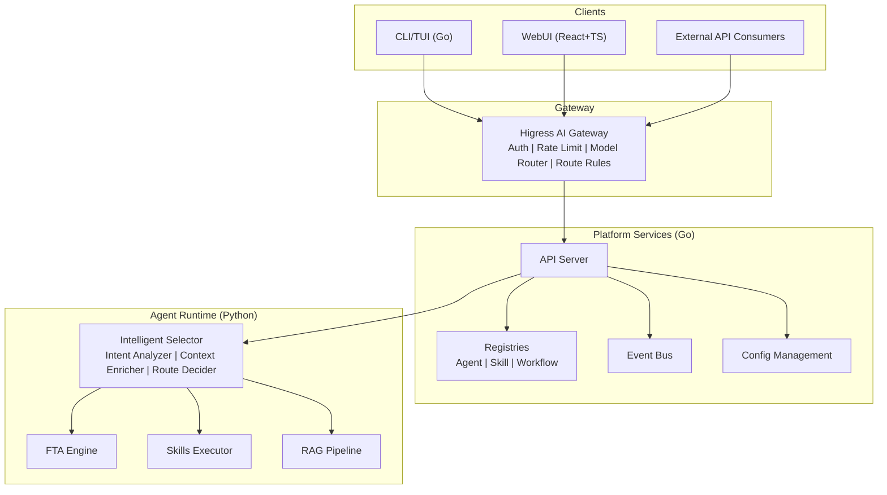
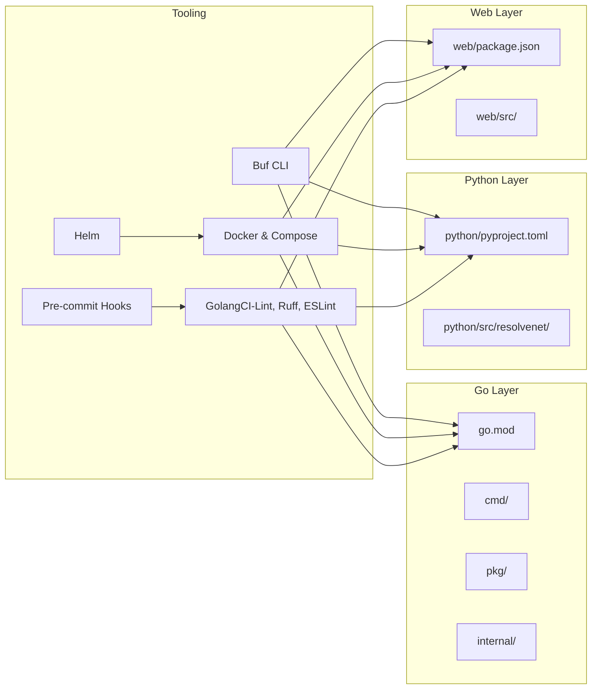

# Getting Started

<cite>
**Referenced Files in This Document**
- [README.md](file://README.md)
- [CONTRIBUTING.md](file://CONTRIBUTING.md)
- [docs/user-guide/quickstart.md](file://docs/user-guide/quickstart.md)
- [Makefile](file://Makefile)
- [hack/setup-dev.sh](file://hack/setup-dev.sh)
- [hack/generate-proto.sh](file://hack/generate-proto.sh)
- [tools/buf/buf.yaml](file://tools/buf/buf.yaml)
- [go.mod](file://go.mod)
- [python/pyproject.toml](file://python/pyproject.toml)
- [web/package.json](file://web/package.json)
- [configs/resolvenet.yaml](file://configs/resolvenet.yaml)
- [deploy/docker-compose/docker-compose.deps.yaml](file://deploy/docker-compose/docker-compose.deps.yaml)
- [deploy/docker-compose/docker-compose.dev.yaml](file://deploy/docker-compose/docker-compose.dev.yaml)
- [.golangci.yml](file://.golangci.yml)
- [.pre-commit-config.yaml](file://.pre-commit-config.yaml)
</cite>

## Table of Contents
1. [Introduction](#introduction)
2. [Prerequisites](#prerequisites)
3. [Installation Steps](#installation-steps)
4. [Environment Setup](#environment-setup)
5. [Project Structure Walkthrough](#project-structure-walkthrough)
6. [Daily Development Workflow](#daily-development-workflow)
7. [Architecture Overview](#architecture-overview)
8. [Dependency Analysis](#dependency-analysis)
9. [Performance Considerations](#performance-considerations)
10. [Troubleshooting Guide](#troubleshooting-guide)
11. [Conclusion](#conclusion)

## Introduction
ResolveNet is a CNCF-grade open-source Mega Agent platform that unifies Agent Skills, Fault Tree Analysis (FTA) Workflows, and Retrieval-Augmented Generation (RAG) under a single intelligent routing layer. It supports Chinese LLM providers (Qwen, Wenxin, Zhipu) and offers a cloud-native architecture with Kubernetes/Helm deployments, Docker Compose for development, and comprehensive tooling for CLI, TUI, and WebUI.

## Prerequisites
Before starting, ensure your system meets the following requirements:
- Go >= 1.22
- Python >= 3.11 with uv
- Node.js >= 20 with pnpm
- Buf CLI for Protocol Buffer management
- Docker and Docker Compose
- Operating system: Linux, macOS, or Windows (WSL recommended for Windows)

These prerequisites are validated during development setup and enforced by the project's tooling.

**Section sources**
- [README.md:61-67](file://README.md#L61-L67)
- [CONTRIBUTING.md:45-51](file://CONTRIBUTING.md#L45-L51)
- [hack/setup-dev.sh:11-17](file://hack/setup-dev.sh#L11-L17)

## Installation Steps
Follow these steps to set up the development environment:

1. Clone the repository
   ```bash
   git clone https://github.com/ai-guru-global/resolve-net.git
   cd resolve-net
   ```

2. Set up the development environment
   ```bash
   make setup-dev
   ```
   This script installs Go dependencies, sets up Python with uv, installs Node.js dependencies with pnpm, and creates a default configuration file at ~/.resolvenet/config.yaml.

3. Start dependencies (PostgreSQL, Redis, NATS, Milvus)
   ```bash
   make compose-deps
   ```

4. Build all components
   ```bash
   make build
   ```

5. Run tests
   ```bash
   make test
   ```

6. Optional: Run linters
   ```bash
   make lint
   ```

**Section sources**
- [README.md:68-86](file://README.md#L68-L86)
- [docs/user-guide/quickstart.md:10-28](file://docs/user-guide/quickstart.md#L10-L28)
- [CONTRIBUTING.md:27-43](file://CONTRIBUTING.md#L27-L43)
- [Makefile:200-202](file://Makefile#L200-L202)
- [Makefile:167-169](file://Makefile#L167-L169)
- [Makefile:52-58](file://Makefile#L52-L58)
- [Makefile:74-90](file://Makefile#L74-L90)
- [Makefile:98-117](file://Makefile#L98-L117)

## Environment Setup
ResolveNet provides OS-agnostic setup through Make targets and shell scripts. The development environment is configured as follows:

- Go toolchain and modules
  - Version requirement: Go 1.22+
  - Module configuration validates the Go version
- Python environment
  - Requires Python >= 3.11
  - Uses uv for dependency management and virtual environments
- Node.js and WebUI
  - Requires Node.js >= 20
  - Uses pnpm for package management and Vite for building the React/TypeScript frontend
- Buf CLI
  - Required for Protocol Buffer code generation and linting
- Docker and Docker Compose
  - Used for local dependency containers and development stack orchestration

Configuration files:
- Default configuration is copied to ~/.resolvenet/config.yaml during setup
- Example configurations are available in configs/

**Section sources**
- [go.mod:3](file://go.mod#L3)
- [python/pyproject.toml:7](file://python/pyproject.toml#L7)
- [web/package.json:38](file://web/package.json#L38)
- [tools/buf/buf.yaml:1-13](file://tools/buf/buf.yaml#L1-L13)
- [hack/setup-dev.sh:25-44](file://hack/setup-dev.sh#L25-L44)
- [configs/resolvenet.yaml:1-34](file://configs/resolvenet.yaml#L1-L34)

## Project Structure Walkthrough
ResolveNet is organized into multiple layers and languages:

- api/proto: Protocol Buffer definitions for gRPC APIs
- cmd/: Go entry points for CLI and server applications
- pkg/: Go shared libraries (public API)
- internal/: Go internal packages (CLI, TUI)
- python/src/resolvenet/: Python agent runtime with modules for agent orchestration, selector, FTA, skills, RAG, and LLM providers
- web/: React + TypeScript WebUI with pages for agents, workflows, skills, RAG, and settings
- deploy/: Dockerfiles, Docker Compose, Helm charts, and Kubernetes manifests
- configs/: Default configuration files
- skills/: Community skill registry and manifests
- docs/: Documentation including architecture, demos, and user guides
- hack/: Development scripts for setup and code generation
- test/: End-to-end tests

This structure enables clear separation of concerns across platform services (Go), runtime (Python), and user interfaces (CLI/TUI/WebUI).

**Section sources**
- [README.md:116-139](file://README.md#L116-L139)

## Daily Development Workflow
Use the following Make targets for common tasks:

- Build components
  - make build: Builds Go binaries, Python package, and WebUI
  - make build-go: Builds Go binaries only
  - make build-python: Syncs Python dependencies and builds package
  - make build-web: Installs Node dependencies and builds WebUI

- Run tests
  - make test: Runs Go, Python, and WebUI tests
  - make test-go: Runs Go tests with race detection and coverage
  - make test-python: Runs Python tests with coverage
  - make test-web: Runs WebUI tests
  - make test-e2e: Runs end-to-end tests tagged with e2e

- Lint and format
  - make lint: Runs all linters (Go, Python, WebUI, Proto)
  - make fmt: Formats code across all languages

- Docker and Compose
  - make docker: Builds platform, runtime, and WebUI Docker images
  - make compose-up: Starts the full stack with Docker Compose
  - make compose-down: Stops the Docker Compose stack
  - make compose-deps: Starts only dependencies (PostgreSQL, Redis, NATS, Milvus)
  - make compose-logs: Tails Docker Compose logs

- Development helpers
  - make setup-dev: Sets up the development environment (installs prerequisites, syncs dependencies, copies config)
  - make clean: Cleans build artifacts and caches

**Section sources**
- [Makefile:50-90](file://Makefile#L50-L90)
- [Makefile:96-117](file://Makefile#L96-L117)
- [Makefile:134-173](file://Makefile#L134-L173)
- [Makefile:198-220](file://Makefile#L198-L220)

## Architecture Overview
ResolveNet follows a cloud-native, microservice-style architecture with clear boundaries between platform services, agent runtime, and user interfaces.



**Diagram sources**
- [README.md:12-46](file://README.md#L12-L46)

## Dependency Analysis
ResolveNet integrates multiple external tools and services:

- Go dependencies
  - Cobra for CLI, Viper for configuration, Charm libraries for TUI, gRPC for service communication
- Python dependencies
  - AgentScope for agent orchestration, gRPC libraries, Pydantic for data models, OpenTelemetry for telemetry
- Node.js dependencies
  - React ecosystem, TanStack Query for data fetching, XYFlow for graph editing, Vite for build tooling
- Infrastructure
  - PostgreSQL, Redis, NATS for messaging, Milvus for vector storage
- Tooling
  - Buf for Protocol Buffer management, Docker and Docker Compose for containerization, Helm for Kubernetes



**Diagram sources**
- [go.mod:1-52](file://go.mod#L1-L52)
- [python/pyproject.toml:1-66](file://python/pyproject.toml#L1-L66)
- [web/package.json:1-44](file://web/package.json#L1-L44)
- [tools/buf/buf.yaml:1-13](file://tools/buf/buf.yaml#L1-L13)
- [.pre-commit-config.yaml:1-44](file://.pre-commit-config.yaml#L1-L44)
- [.golangci.yml:1-69](file://.golangci.yml#L1-L69)

**Section sources**
- [go.mod:5-11](file://go.mod#L5-L11)
- [python/pyproject.toml:19-29](file://python/pyproject.toml#L19-L29)
- [web/package.json:15-42](file://web/package.json#L15-L42)
- [tools/buf/buf.yaml:1-13](file://tools/buf/buf.yaml#L1-L13)
- [.pre-commit-config.yaml:15-44](file://.pre-commit-config.yaml#L15-L44)
- [.golangci.yml:5-30](file://.golangci.yml#L5-L30)

## Performance Considerations
- Use Docker Compose for local development to minimize resource contention and ensure consistent environments.
- Enable telemetry selectively for development to avoid overhead in local runs.
- Keep dependencies updated to leverage performance improvements in gRPC, OpenTelemetry, and Python/Node ecosystems.
- Use pre-commit hooks to catch performance regressions early through linting and formatting.

## Troubleshooting Guide
Common setup issues and resolutions:

- Missing Buf CLI
  - Symptom: Proto generation fails with a command not found error.
  - Resolution: Install Buf CLI and re-run proto generation.
  - Reference: [hack/generate-proto.sh:7-10](file://hack/generate-proto.sh#L7-L10)

- Python version mismatch
  - Symptom: uv sync fails due to Python version requirements.
  - Resolution: Ensure Python >= 3.11 is installed and available as python3.
  - Reference: [python/pyproject.toml:7](file://python/pyproject.toml#L7)

- Node.js version mismatch
  - Symptom: pnpm install fails due to Node.js version requirements.
  - Resolution: Ensure Node.js >= 20 is installed and available as node.
  - Reference: [web/package.json:38](file://web/package.json#L38)

- Docker daemon not running
  - Symptom: make compose-deps or make docker fails with connection errors.
  - Resolution: Start Docker Desktop or Docker Engine and retry.
  - References: [Makefile:167-169](file://Makefile#L167-L169), [Makefile:138-151](file://Makefile#L138-L151)

- Port conflicts
  - Symptom: Services fail to start due to port binding conflicts.
  - Resolution: Adjust ports in docker-compose files or stop conflicting services.
  - Reference: [deploy/docker-compose/docker-compose.deps.yaml:10-25](file://deploy/docker-compose/docker-compose.deps.yaml#L10-L25)

- Go module download failures
  - Symptom: go mod download fails behind corporate firewalls.
  - Resolution: Configure proxy settings or use a VPN; retry setup.
  - Reference: [hack/setup-dev.sh:21](file://hack/setup-dev.sh#L21)

- Linting/formatting errors
  - Symptom: make lint or make fmt reports issues.
  - Resolution: Apply suggested fixes or run make fmt to auto-format.
  - References: [.golangci.yml:5-30](file://.golangci.yml#L5-L30), [Makefile:213-219](file://Makefile#L213-L219)

- Pre-commit hook failures
  - Symptom: Commit blocked by pre-commit hooks.
  - Resolution: Fix lint/format issues reported by hooks and retry commit.
  - Reference: [.pre-commit-config.yaml:15-44](file://.pre-commit-config.yaml#L15-L44)

- Configuration file location
  - Symptom: Application cannot find configuration.
  - Resolution: Ensure ~/.resolvenet/config.yaml exists or copy from configs/.
  - Reference: [hack/setup-dev.sh:47-51](file://hack/setup-dev.sh#L47-L51)

**Section sources**
- [hack/generate-proto.sh:7-10](file://hack/generate-proto.sh#L7-L10)
- [python/pyproject.toml:7](file://python/pyproject.toml#L7)
- [web/package.json:38](file://web/package.json#L38)
- [Makefile:167-169](file://Makefile#L167-L169)
- [Makefile:138-151](file://Makefile#L138-L151)
- [deploy/docker-compose/docker-compose.deps.yaml:10-25](file://deploy/docker-compose/docker-compose.deps.yaml#L10-L25)
- [hack/setup-dev.sh:21](file://hack/setup-dev.sh#L21)
- [.golangci.yml:5-30](file://.golangci.yml#L5-L30)
- [Makefile:213-219](file://Makefile#L213-L219)
- [.pre-commit-config.yaml:15-44](file://.pre-commit-config.yaml#L15-L44)
- [hack/setup-dev.sh:47-51](file://hack/setup-dev.sh#L47-L51)

## Conclusion
You now have the essential information to set up and develop with ResolveNet. Use the Make targets for streamlined workflows, rely on Docker Compose for consistent environments, and follow the troubleshooting guide for common issues. Explore the CLI, TUI, and WebUI to manage agents, workflows, skills, and RAG pipelines effectively.