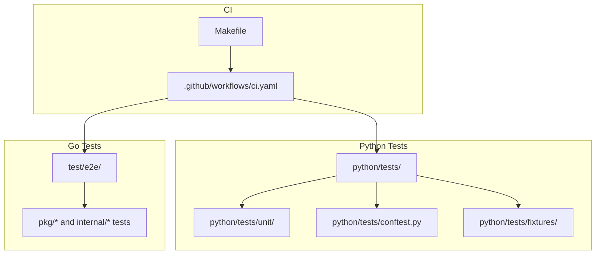
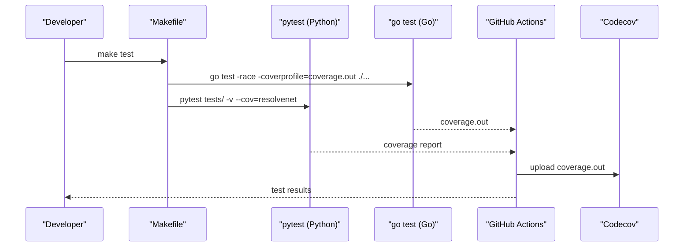
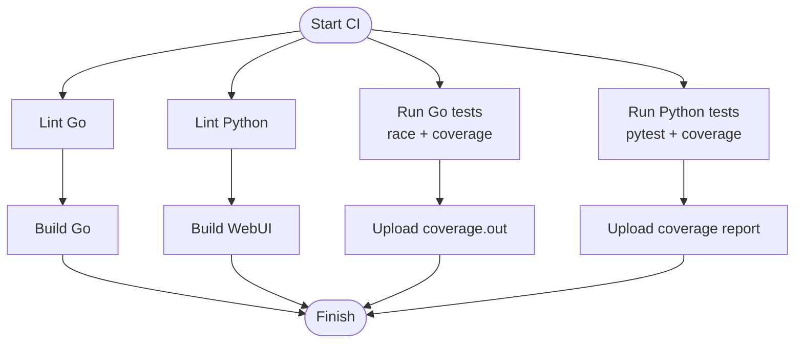
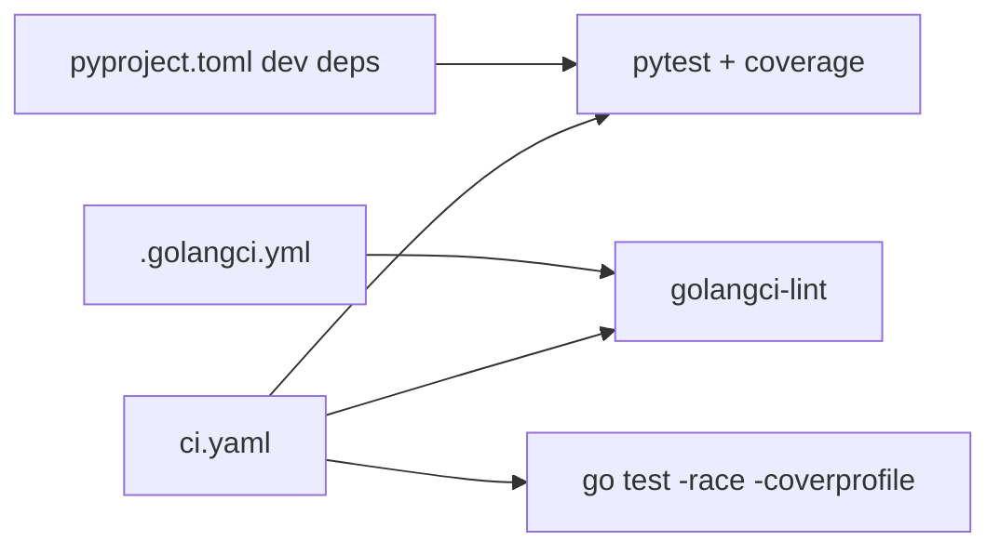

# Testing Workflow

<cite>
**Referenced Files in This Document**
- [ci.yaml](file://.github/workflows/ci.yaml)
- [Makefile](file://Makefile)
- [pyproject.toml](file://python/pyproject.toml)
- [conftest.py](file://python/tests/conftest.py)
- [test_fta_engine.py](file://python/tests/unit/test_fta_engine.py)
- [test_rag_pipeline.py](file://python/tests/unit/test_rag_pipeline.py)
- [test_selector.py](file://python/tests/unit/test_selector.py)
- [test_skill_loader.py](file://python/tests/unit/test_skill_loader.py)
- [sample_fta_tree.yaml](file://python/tests/fixtures/sample_fta_tree.yaml)
- [agent_lifecycle_test.go](file://test/e2e/agent_lifecycle_test.go)
- [workflow_execution_test.go](file://test/e2e/workflow_execution_test.go)
- [.golangci.yml](file://.golangci.yml)
- [agent.go](file://pkg/registry/agent.go)
- [test.go](file://internal/cli/skill/test.go)
</cite>

## Table of Contents
1. [Introduction](#introduction)
2. [Project Structure](#project-structure)
3. [Core Components](#core-components)
4. [Architecture Overview](#architecture-overview)
5. [Detailed Component Analysis](#detailed-component-analysis)
6. [Dependency Analysis](#dependency-analysis)
7. [Performance Considerations](#performance-considerations)
8. [Troubleshooting Guide](#troubleshooting-guide)
9. [Conclusion](#conclusion)
10. [Appendices](#appendices)

## Introduction
This document describes ResolveNet’s multi-layered testing approach across Python (unit), Go (integration and end-to-end), and provides guidance for continuous testing, coverage reporting, and automated execution. It explains the current test organization, fixtures, and environment setup, and outlines best practices for writing effective tests, mocking strategies, performance/load/regression testing, debugging, flaky test handling, and maintenance.

## Project Structure
The repository organizes tests by language and scope:
- Python tests live under python/tests/, grouped into unit tests and shared fixtures.
- Go tests are primarily located under test/e2e/ for end-to-end scenarios, with broader Go integration tests elsewhere in the codebase.
- Continuous integration is defined in .github/workflows/ci.yaml, and local automation is provided via Makefile targets.

**Diagram sources**
- [ci.yaml:1-89](file://.github/workflows/ci.yaml#L1-L89)
- [Makefile:72-91](file://Makefile#L72-L91)
- [conftest.py:1-44](file://python/tests/conftest.py#L1-L44)

**Section sources**
- [ci.yaml:1-89](file://.github/workflows/ci.yaml#L1-L89)
- [Makefile:72-91](file://Makefile#L72-L91)

## Core Components
- Python unit tests use pytest with asyncio support and coverage reporting for the resolvenet package.
- Go tests use the standard testing package with race detection and coverage profile generation.
- End-to-end tests are tagged and skipped until infrastructure is available.
- Shared fixtures provide reusable test data for Python components.

Key capabilities:
- Python: pytest discovery, async fixtures, coverage via pytest-cov.
- Go: race detector, coverage profiles, linters via golangci-lint.
- CI: orchestrated jobs for linting, testing, and builds.

**Section sources**
- [pyproject.toml:36-42](file://python/pyproject.toml#L36-L42)
- [pyproject.toml:63-66](file://python/pyproject.toml#L63-L66)
- [ci.yaml:38-61](file://.github/workflows/ci.yaml#L38-L61)
- [.golangci.yml:1-68](file://.golangci.yml#L1-L68)

## Architecture Overview
The testing architecture integrates local and CI-driven workflows:
- Local developers run Makefile targets to execute tests and linters.
- GitHub Actions orchestrates linting, unit testing, and builds across languages.
- Coverage reports are generated and optionally uploaded to Codecov.

**Diagram sources**
- [Makefile:72-91](file://Makefile#L72-L91)
- [ci.yaml:38-61](file://.github/workflows/ci.yaml#L38-L61)

## Detailed Component Analysis

### Python Unit Testing
- Test organization: python/tests/unit/ contains focused unit tests for modules like FTA engine, RAG pipeline, selector, and skill loader.
- Fixtures: python/tests/conftest.py defines a reusable FaultTree fixture for FTA-related tests.
- Async tests: test_selector.py demonstrates async test patterns using pytest-asyncio.
- Coverage: configured via pyproject.toml to target the resolvenet package.

Recommended patterns:
- Use fixtures for expensive or shared setup (e.g., FaultTree).
- Prefer small, isolated assertions per test function.
- For async code, mark tests with pytest.mark.asyncio and await where appropriate.
- Keep tests deterministic; avoid external network calls without mocking.

**Section sources**
- [test_fta_engine.py:1-40](file://python/tests/unit/test_fta_engine.py#L1-L40)
- [test_rag_pipeline.py:1-19](file://python/tests/unit/test_rag_pipeline.py#L1-L19)
- [test_selector.py:1-30](file://python/tests/unit/test_selector.py#L1-L30)
- [test_skill_loader.py:1-24](file://python/tests/unit/test_skill_loader.py#L1-L24)
- [conftest.py:1-44](file://python/tests/conftest.py#L1-L44)
- [pyproject.toml:36-42](file://python/pyproject.toml#L36-L42)
- [pyproject.toml:63-66](file://python/pyproject.toml#L63-L66)

### Go Integration and End-to-End Testing
- Integration tests: Located across Go packages (e.g., registry, server, store). These exercise real logic and often use in-memory implementations for determinism.
- End-to-end tests: Under test/e2e/, currently marked as skipped pending infrastructure. They are intended to validate agent lifecycle and workflow execution in realistic environments.
- Tagging: E2E tests are gated by a build tag and executed via go test -tags=e2e.

Guidelines:
- Use table-driven tests for deterministic inputs and expected outputs.
- Mock external dependencies (e.g., databases, caches) with interfaces and stubs.
- For E2E, define clear preconditions and teardown steps; keep tests hermetic.

**Section sources**
- [agent_lifecycle_test.go:1-13](file://test/e2e/agent_lifecycle_test.go#L1-L13)
- [workflow_execution_test.go:1-13](file://test/e2e/workflow_execution_test.go#L1-L13)
- [Makefile:88-90](file://Makefile#L88-L90)

### Test Data Setup and Fixtures
- Python fixtures: A FaultTree fixture is defined in conftest.py and consumed by FTA tests to ensure consistent, repeatable scenarios.
- YAML fixtures: sample_fta_tree.yaml provides structured data for FTA-related tests.

Best practices:
- Centralize fixture creation in conftest.py.
- Keep fixture data minimal and explicit.
- Serialize complex structures to YAML for readability and maintainability.

**Section sources**
- [conftest.py:8-43](file://python/tests/conftest.py#L8-L43)
- [sample_fta_tree.yaml:1-23](file://python/tests/fixtures/sample_fta_tree.yaml#L1-L23)

### Continuous Testing Workflow and Coverage Reporting
- CI orchestration: GitHub Actions runs linters, Go tests with race detection and coverage, Python tests with coverage, and builds.
- Local automation: Makefile provides convenient targets for running tests and linters across all components.
- Coverage: Go generates coverage.out; Python coverage is reported via pytest-cov. CI uploads coverage to Codecov.

**Diagram sources**
- [ci.yaml:13-89](file://.github/workflows/ci.yaml#L13-L89)
- [Makefile:72-91](file://Makefile#L72-L91)

**Section sources**
- [ci.yaml:13-89](file://.github/workflows/ci.yaml#L13-L89)
- [Makefile:72-91](file://Makefile#L72-L91)

### Mocking Strategies
- Python: Use pytest fixtures and monkeypatch to replace external dependencies. For async calls, mock coroutines with unittest.mock or pytest-asyncio-compatible mocks.
- Go: Define interfaces for external systems (e.g., storage, messaging) and inject mock implementations in tests. Use table-driven tests to vary behavior.

[No sources needed since this section provides general guidance]

### Test Environment Setup
- Python: Install development extras (pytest, pytest-asyncio, pytest-cov) via uv sync with the dev extra.
- Go: Use actions/setup-go to provision the Go toolchain and run go test with race detection.
- E2E: E2E tests are tagged and skipped until infrastructure is available; configure environment variables and service dependencies accordingly when enabling.

**Section sources**
- [pyproject.toml:36-42](file://python/pyproject.toml#L36-L42)
- [ci.yaml:54-61](file://.github/workflows/ci.yaml#L54-L61)
- [agent_lifecycle_test.go:10-12](file://test/e2e/agent_lifecycle_test.go#L10-L12)

### Performance, Load, and Regression Testing
- Performance: Add benchmarks using pytest-benchmark for Python and go test -bench for Go. Focus on hot paths in selector, FTA evaluation, and RAG ingestion.
- Load: Use go test -race with synthetic workloads and external load generators for end-to-end scenarios.
- Regression: Maintain a suite of representative unit and integration tests; treat breaking changes as regressions and add targeted regression tests.

[No sources needed since this section provides general guidance]

### Debugging Techniques and Flaky Test Handling
- Python: Increase verbosity with pytest -vv, use pytest.set_trace() sparingly, and isolate flaky tests with xdist or retries.
- Go: Enable race detection (-race), add logging around flaky sections, and reduce concurrency in tests.
- General: Capture logs, reproduce locally with minimal environment, and add timeouts to prevent indefinite hangs.

**Section sources**
- [ci.yaml:46-49](file://.github/workflows/ci.yaml#L46-L49)
- [Makefile:76-82](file://Makefile#L76-L82)

### Test Maintenance Best Practices
- Keep tests readable: short functions, descriptive names, and clear assertions.
- Maintain fixtures: centralize and reuse; version YAML fixtures alongside tests.
- Refactor frequently: consolidate duplicated setup logic into fixtures or helper functions.
- Review diffs: ensure test additions accompany feature changes.

[No sources needed since this section provides general guidance]

## Dependency Analysis
- Python test dependencies are declared in pyproject.toml under dev extras.
- Go linting is configured via .golangci.yml with a curated set of linters.
- CI depends on GitHub-hosted runners and public actions for setup and reporting.

**Diagram sources**
- [pyproject.toml:36-42](file://python/pyproject.toml#L36-L42)
- [.golangci.yml:5-29](file://.golangci.yml#L5-L29)
- [ci.yaml:13-61](file://.github/workflows/ci.yaml#L13-L61)

**Section sources**
- [pyproject.toml:36-42](file://python/pyproject.toml#L36-L42)
- [.golangci.yml:1-68](file://.golangci.yml#L1-L68)
- [ci.yaml:13-61](file://.github/workflows/ci.yaml#L13-L61)

## Performance Considerations
- Favor deterministic fixtures and in-memory implementations to reduce test runtime variability.
- Use targeted coverage to focus on critical paths; avoid over-testing trivial code.
- Parallelize independent tests where safe; avoid shared mutable state.

[No sources needed since this section provides general guidance]

## Troubleshooting Guide
Common issues and remedies:
- Python coverage missing: ensure pytest-cov is installed and coverage target matches package name.
- Go race failures: inspect reported races, fix data races in concurrent code paths.
- E2E tests skipped: enable infrastructure or remove skip to run tests.

**Section sources**
- [ci.yaml:46-49](file://.github/workflows/ci.yaml#L46-L49)
- [agent_lifecycle_test.go:10-12](file://test/e2e/agent_lifecycle_test.go#L10-L12)

## Conclusion
ResolveNet’s testing framework combines pytest-based unit tests for Python, race-detected Go tests, and E2E suites ready for infrastructure. CI automates linting, testing, and builds, while local Makefile targets streamline developer workflows. By leveraging fixtures, mocking strategies, and robust CI, the project maintains quality across its multi-language stack.

[No sources needed since this section summarizes without analyzing specific files]

## Appendices

### Appendix A: Python Test Organization
- Unit tests: python/tests/unit/
- Shared fixtures: python/tests/conftest.py
- Test data: python/tests/fixtures/

**Section sources**
- [test_fta_engine.py:1-40](file://python/tests/unit/test_fta_engine.py#L1-L40)
- [test_rag_pipeline.py:1-19](file://python/tests/unit/test_rag_pipeline.py#L1-L19)
- [test_selector.py:1-30](file://python/tests/unit/test_selector.py#L1-L30)
- [test_skill_loader.py:1-24](file://python/tests/unit/test_skill_loader.py#L1-L24)
- [conftest.py:1-44](file://python/tests/conftest.py#L1-L44)
- [sample_fta_tree.yaml:1-23](file://python/tests/fixtures/sample_fta_tree.yaml#L1-L23)

### Appendix B: Go Test Organization
- Integration tests: pkg/* and internal/* packages
- E2E tests: test/e2e/ with build tag gating

**Section sources**
- [agent_lifecycle_test.go:1-13](file://test/e2e/agent_lifecycle_test.go#L1-L13)
- [workflow_execution_test.go:1-13](file://test/e2e/workflow_execution_test.go#L1-L13)

### Appendix C: CLI Skill Testing
- CLI command exists for skill testing; current implementation is a placeholder for future API-based execution.

**Section sources**
- [test.go:1-22](file://internal/cli/skill/test.go#L1-L22)