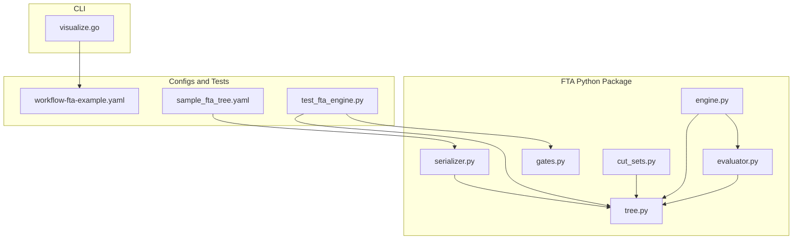
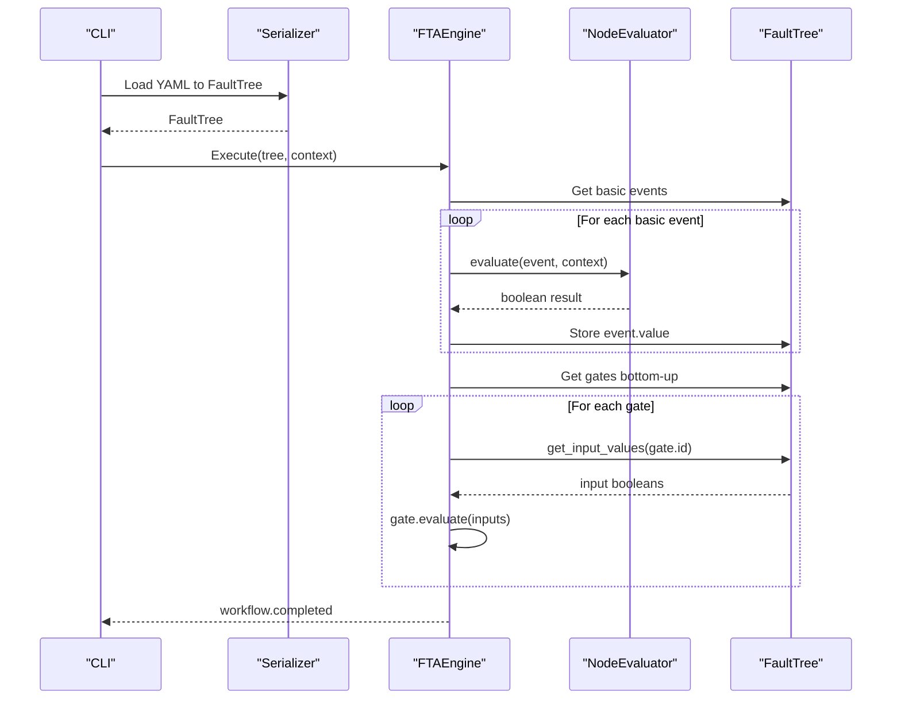
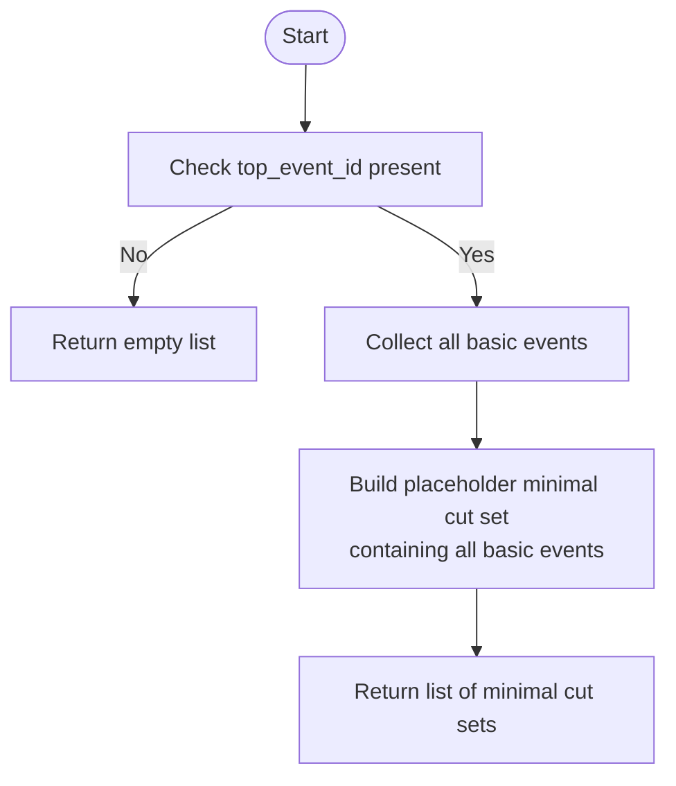
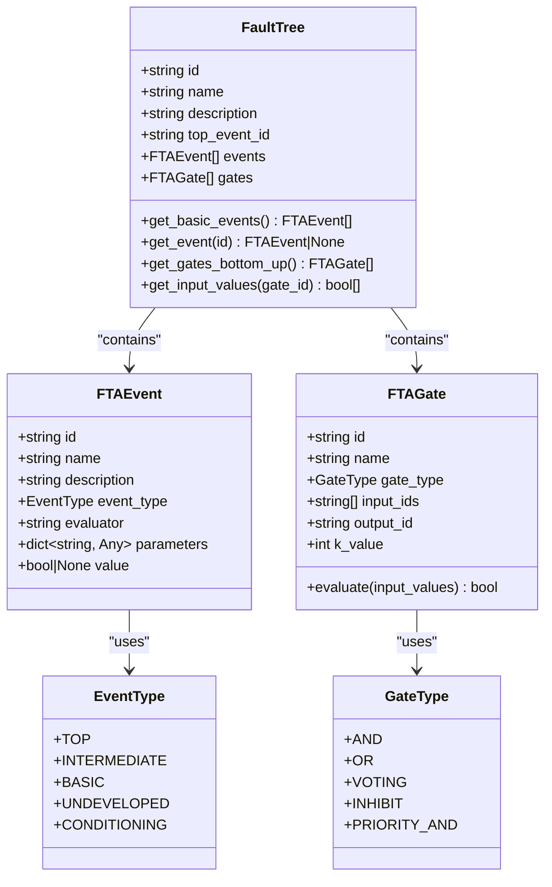
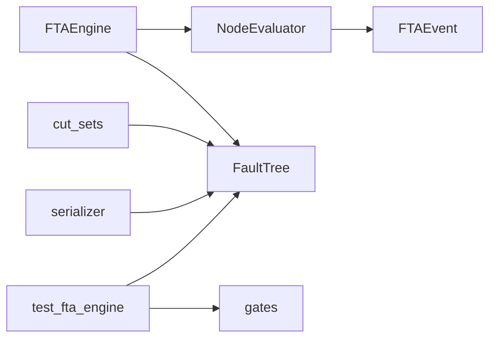

# Cut Set Analysis and Minimal Fault Identification

<cite>
**Referenced Files in This Document**
- [cut_sets.py](file://python/src/resolvenet/fta/cut_sets.py)
- [engine.py](file://python/src/resolvenet/fta/engine.py)
- [evaluator.py](file://python/src/resolvenet/fta/evaluator.py)
- [tree.py](file://python/src/resolvenet/fta/tree.py)
- [gates.py](file://python/src/resolvenet/fta/gates.py)
- [serializer.py](file://python/src/resolvenet/fta/serializer.py)
- [fta-engine.md](file://docs/architecture/fta-engine.md)
- [sample_fta_tree.yaml](file://python/tests/fixtures/sample_fta_tree.yaml)
- [workflow-fta-example.yaml](file://configs/examples/workflow-fta-example.yaml)
- [test_fta_engine.py](file://python/tests/unit/test_fta_engine.py)
- [visualize.go](file://internal/cli/workflow/visualize.go)
</cite>

## Table of Contents
1. [Introduction](#introduction)
2. [Project Structure](#project-structure)
3. [Core Components](#core-components)
4. [Architecture Overview](#architecture-overview)
5. [Detailed Component Analysis](#detailed-component-analysis)
6. [Dependency Analysis](#dependency-analysis)
7. [Performance Considerations](#performance-considerations)
8. [Troubleshooting Guide](#troubleshooting-guide)
9. [Conclusion](#conclusion)
10. [Appendices](#appendices)

## Introduction
This document explains cut set analysis and minimal fault identification in Fault Tree Analysis (FTA) within the ResolveNet FTA subsystem. It covers the concept of cut sets as minimal combinations of basic events leading to the top event, outlines current implementation status, and proposes algorithms and evaluation criteria aligned with system reliability and safety analysis. It also documents visualization and reporting capabilities, computational complexity considerations, and practical guidance for interpreting results.

## Project Structure
The FTA subsystem resides under the Python package resolvenet.fta and includes modules for tree representation, gate logic, evaluation, serialization, and a placeholder for cut set computation. The CLI workflow module provides a visualize command that currently prints a placeholder ASCII tree.

**Diagram sources**
- [tree.py:1-120](file://python/src/resolvenet/fta/tree.py#L1-L120)
- [gates.py:1-29](file://python/src/resolvenet/fta/gates.py#L1-L29)
- [evaluator.py:1-74](file://python/src/resolvenet/fta/evaluator.py#L1-L74)
- [engine.py:1-83](file://python/src/resolvenet/fta/engine.py#L1-L83)
- [serializer.py:1-113](file://python/src/resolvenet/fta/serializer.py#L1-L113)
- [cut_sets.py:1-49](file://python/src/resolvenet/fta/cut_sets.py#L1-L49)
- [visualize.go:1-27](file://internal/cli/workflow/visualize.go#L1-L27)
- [workflow-fta-example.yaml:1-50](file://configs/examples/workflow-fta-example.yaml#L1-L50)
- [sample_fta_tree.yaml:1-23](file://python/tests/fixtures/sample_fta_tree.yaml#L1-L23)
- [test_fta_engine.py:1-40](file://python/tests/unit/test_fta_engine.py#L1-L40)

**Section sources**
- [fta-engine.md:1-19](file://docs/architecture/fta-engine.md#L1-L19)
- [visualize.go:1-27](file://internal/cli/workflow/visualize.go#L1-L27)

## Core Components
- FaultTree: Represents the tree structure with events and gates, and provides traversal helpers.
- FTAGate and GateType: Define gate semantics (AND, OR, VOTING, INHIBIT, PRIORITY_AND).
- FTAEvent and EventType: Represent nodes (basic, intermediate, top, undeveloped, conditioning).
- NodeEvaluator: Evaluates basic events via skills, RAG, LLM, or defaults to static values.
- FTAEngine: Executes the FTA workflow by evaluating basic events and propagating through gates.
- Serializer: Loads and dumps fault trees from/to YAML.
- Cut Sets Module: Placeholder for minimal cut set computation and explanations.

Key responsibilities:
- FaultTree: Provides basic event enumeration, gate ordering, and input value retrieval.
- NodeEvaluator: Implements pluggable evaluation strategies for basic events.
- FTAEngine: Orchestrates execution and yields progress events.
- Cut Sets: Intended to compute minimal cut sets and produce human-readable explanations.

**Section sources**
- [tree.py:81-120](file://python/src/resolvenet/fta/tree.py#L81-L120)
- [gates.py:6-29](file://python/src/resolvenet/fta/gates.py#L6-L29)
- [evaluator.py:13-74](file://python/src/resolvenet/fta/evaluator.py#L13-L74)
- [engine.py:14-83](file://python/src/resolvenet/fta/engine.py#L14-L83)
- [serializer.py:12-113](file://python/src/resolvenet/fta/serializer.py#L12-L113)
- [cut_sets.py:8-49](file://python/src/resolvenet/fta/cut_sets.py#L8-L49)

## Architecture Overview
The FTA workflow proceeds from parsing a YAML tree definition to evaluating basic events and propagating through gates bottom-up to compute the top event. Cut set computation is currently a placeholder and intended to integrate after successful evaluation.

**Diagram sources**
- [serializer.py:12-71](file://python/src/resolvenet/fta/serializer.py#L12-L71)
- [engine.py:24-83](file://python/src/resolvenet/fta/engine.py#L24-L83)
- [evaluator.py:23-49](file://python/src/resolvenet/fta/evaluator.py#L23-L49)
- [tree.py:92-120](file://python/src/resolvenet/fta/tree.py#L92-L120)

## Detailed Component Analysis

### Cut Set Computation and Explanations
Current implementation:
- compute_minimal_cut_sets returns a placeholder containing all basic events as a single minimal cut set.
- explain_cut_sets converts event IDs to human-readable names and composes English sentences.

Proposed algorithms:
- MOCUS (MOdeling and Computing of Cut Sets): Systematic search enumerating minimal cut sets by traversing the tree and applying closure properties.
- Binary Decision Diagram (BDD) based methods: Efficiently represent and manipulate the logical function of the fault tree to extract minimal cut sets.
- Implication-based pruning: Use gate semantics to prune search space early when partial assignments cannot lead to the top event.

Evaluation criteria:
- Minimal cut sets quantify the smallest combinations of basic events causing the top event.
- They inform system reliability by identifying critical basic events and safety by highlighting initiating conditions.
- Risk assessment: Prioritize mitigations targeting least-cost cut sets with highest contribution to top event probability.

**Diagram sources**
- [cut_sets.py:8-26](file://python/src/resolvenet/fta/cut_sets.py#L8-L26)

**Section sources**
- [cut_sets.py:8-49](file://python/src/resolvenet/fta/cut_sets.py#L8-L49)

### Fault Tree Data Structures
- EventType and GateType enumerate supported node and gate types.
- FTAEvent captures identifiers, names, descriptions, types, evaluators, parameters, and computed values.
- FTAGate encapsulates inputs, outputs, gate type, and k-value for voting gates, with an evaluate method implementing gate logic.
- FaultTree aggregates nodes and gates, provides helpers to enumerate basic events, locate events, and retrieve input values for propagation.

**Diagram sources**
- [tree.py:10-120](file://python/src/resolvenet/fta/tree.py#L10-L120)

**Section sources**
- [tree.py:10-120](file://python/src/resolvenet/fta/tree.py#L10-L120)

### Gate Logic Implementations
- and_gate, or_gate, voting_gate, inhibit_gate, priority_and_gate implement the corresponding Boolean logic.
- These functions mirror the behavior of FTAGate.evaluate for isolated logic checks.

**Section sources**
- [gates.py:6-29](file://python/src/resolvenet/fta/gates.py#L6-L29)

### Basic Event Evaluation
- NodeEvaluator routes evaluation based on the evaluator type prefix (skill:, rag:, llm:).
- Unknown types default to True for robustness during placeholder phases.
- Asynchronous evaluation supports integration with external systems.

**Section sources**
- [evaluator.py:13-74](file://python/src/resolvenet/fta/evaluator.py#L13-L74)

### FTA Execution Engine
- FTAEngine orchestrates evaluation of basic events and propagation through gates.
- Emits structured workflow events for progress monitoring.
- Bottom-up gate evaluation uses FaultTree.get_input_values to assemble inputs.

**Section sources**
- [engine.py:14-83](file://python/src/resolvenet/fta/engine.py#L14-L83)
- [tree.py:103-120](file://python/src/resolvenet/fta/tree.py#L103-L120)

### Serialization and Deserialization
- load_tree_from_yaml and load_tree_from_dict parse YAML or dictionaries into FaultTree instances.
- dump_tree_to_yaml serializes FaultTree back to YAML for persistence and sharing.

**Section sources**
- [serializer.py:12-113](file://python/src/resolvenet/fta/serializer.py#L12-L113)

### Practical Examples of Cut Set Calculation
- Example 1: Simple OR tree with two basic events.
  - Current placeholder returns one minimal cut set containing both basic events.
  - Expected: Two minimal cut sets, each consisting of a single basic event.
- Example 2: Voting gate (k-of-n) tree.
  - Current placeholder returns one minimal cut set containing all basic events.
  - Expected: Multiple minimal cut sets depending on k and number of inputs.

These examples illustrate the gap between current placeholder behavior and desired precise cut set enumeration.

**Section sources**
- [sample_fta_tree.yaml:1-23](file://python/tests/fixtures/sample_fta_tree.yaml#L1-L23)
- [workflow-fta-example.yaml:1-50](file://configs/examples/workflow-fta-example.yaml#L1-L50)
- [cut_sets.py:8-26](file://python/src/resolvenet/fta/cut_sets.py#L8-L26)

### Visualization and Reporting
- CLI visualize command currently prints a placeholder ASCII tree diagram.
- Reporting for cut sets is handled by explain_cut_sets, which produces human-readable sentences from minimal cut sets.

**Section sources**
- [visualize.go:9-25](file://internal/cli/workflow/visualize.go#L9-L25)
- [cut_sets.py:29-49](file://python/src/resolvenet/fta/cut_sets.py#L29-L49)

## Dependency Analysis
- FTAEngine depends on FaultTree and NodeEvaluator.
- NodeEvaluator depends on FTAEvent and external integrations (placeholder).
- Cut Sets module depends on FaultTree.
- Serializer depends on FaultTree and YAML.
- Tests validate gate logic and FaultTree helpers.

**Diagram sources**
- [engine.py:14-22](file://python/src/resolvenet/fta/engine.py#L14-L22)
- [evaluator.py:23-49](file://python/src/resolvenet/fta/evaluator.py#L23-L49)
- [cut_sets.py:5](file://python/src/resolvenet/fta/cut_sets.py#L5)
- [serializer.py:9](file://python/src/resolvenet/fta/serializer.py#L9)
- [test_fta_engine.py:3-4](file://python/tests/unit/test_fta_engine.py#L3-L4)

**Section sources**
- [engine.py:14-22](file://python/src/resolvenet/fta/engine.py#L14-L22)
- [evaluator.py:23-49](file://python/src/resolvenet/fta/evaluator.py#L23-L49)
- [cut_sets.py:5](file://python/src/resolvenet/fta/cut_sets.py#L5)
- [serializer.py:9](file://python/src/resolvenet/fta/serializer.py#L9)
- [test_fta_engine.py:3-4](file://python/tests/unit/test_fta_engine.py#L3-L4)

## Performance Considerations
- Computational complexity:
  - Naive enumeration of all combinations of basic events is exponential in the number of basic events.
  - MOCUS and BDD-based methods can reduce complexity by pruning unreachable combinations and exploiting Boolean structure.
- Approximation methods:
  - Sampling-based approaches (e.g., importance sampling) can estimate cut set contributions for very large trees.
  - Threshold-based approximations (e.g., focusing on cut sets below a size threshold) can trade accuracy for speed.
- Current placeholder:
  - The placeholder computes a single minimal cut set containing all basic events, which is computationally trivial but not representative for most trees.

[No sources needed since this section provides general guidance]

## Troubleshooting Guide
- Empty or incorrect cut sets:
  - Verify top_event_id is set in the FaultTree.
  - Confirm basic events are present and properly typed.
- Incorrect gate ordering:
  - FaultTree.get_gates_bottom_up is a placeholder; ensure gates are ordered consistently with dependencies.
- Evaluation failures:
  - Unknown evaluator types default to True; confirm evaluator prefixes and targets.
- Visualization issues:
  - CLI visualize prints placeholder ASCII trees; integrate with a rendering backend for dynamic trees.

**Section sources**
- [cut_sets.py:20-26](file://python/src/resolvenet/fta/cut_sets.py#L20-L26)
- [tree.py:103-106](file://python/src/resolvenet/fta/tree.py#L103-L106)
- [evaluator.py:46-49](file://python/src/resolvenet/fta/evaluator.py#L46-L49)
- [visualize.go:17-23](file://internal/cli/workflow/visualize.go#L17-L23)

## Conclusion
The FTA subsystem provides a solid foundation for fault tree representation, evaluation, and serialization. Cut set computation is currently a placeholder and requires implementation of MOCUS or BDD-based algorithms. Once implemented, it will enable precise minimal cut set enumeration, robust evaluation criteria, and actionable safety and reliability insights. Visualization and reporting can be extended to support interactive tree rendering and detailed cut set explanations.

[No sources needed since this section summarizes without analyzing specific files]

## Appendices

### Appendix A: Example YAML Trees
- Sample Fault Tree: Demonstrates a simple OR gate connecting two basic events to the top event.
- Workflow FTA Example: A more complex tree with intermediate and basic events, showcasing evaluator configuration.

**Section sources**
- [sample_fta_tree.yaml:1-23](file://python/tests/fixtures/sample_fta_tree.yaml#L1-L23)
- [workflow-fta-example.yaml:1-50](file://configs/examples/workflow-fta-example.yaml#L1-L50)

### Appendix B: Test Coverage
- Gate logic tests validate AND, OR, and VOTING gates.
- FaultTree helper tests validate basic event enumeration and event lookup.

**Section sources**
- [test_fta_engine.py:7-25](file://python/tests/unit/test_fta_engine.py#L7-L25)
- [test_fta_engine.py:27-39](file://python/tests/unit/test_fta_engine.py#L27-L39)