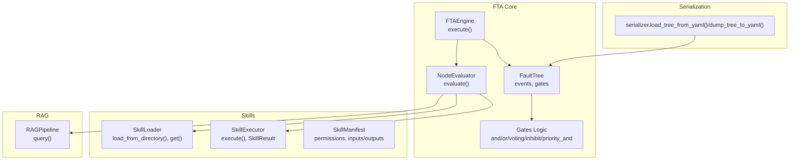
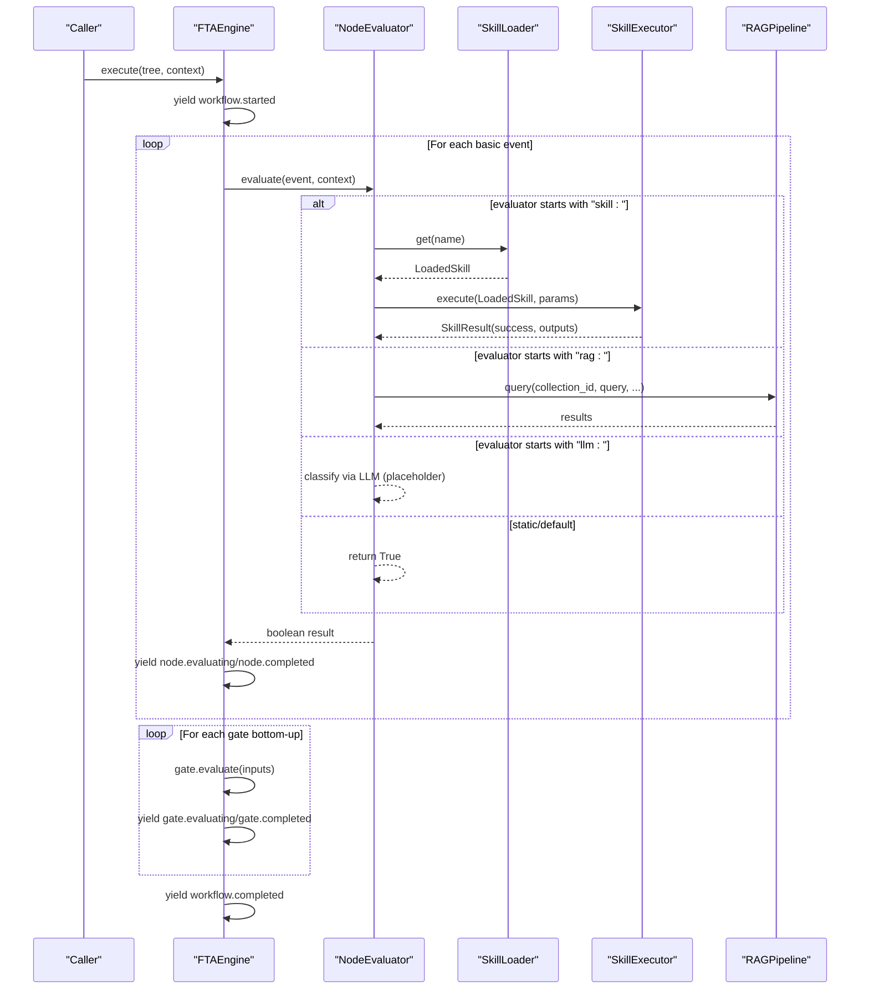
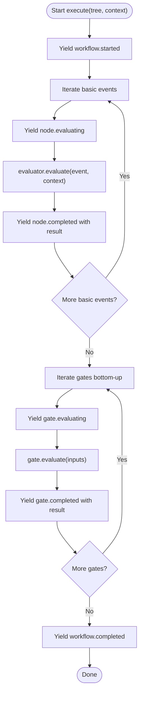
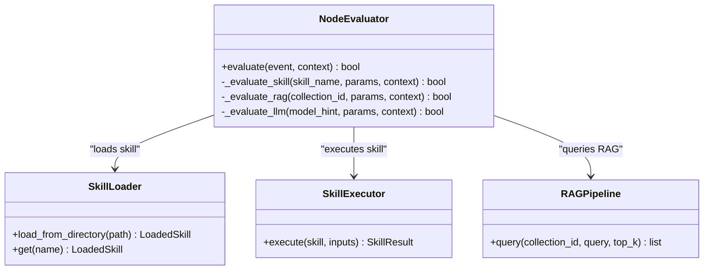
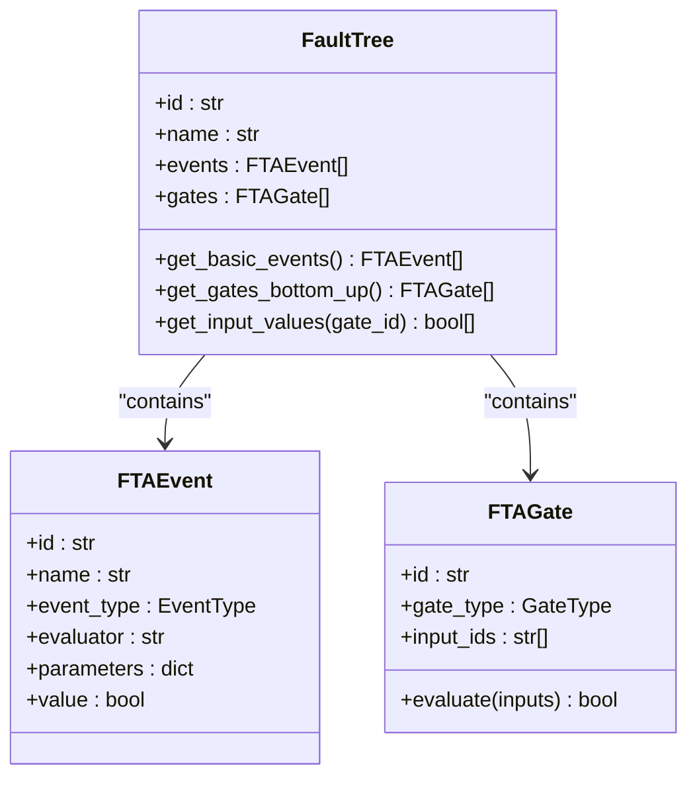
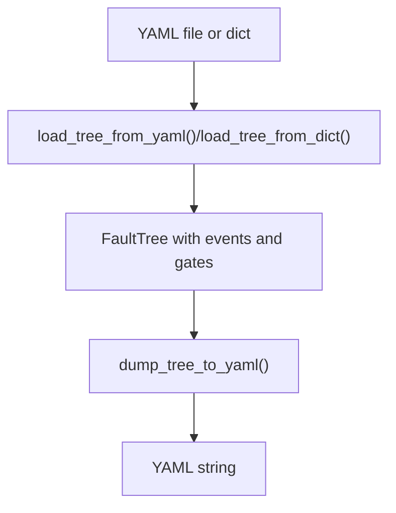
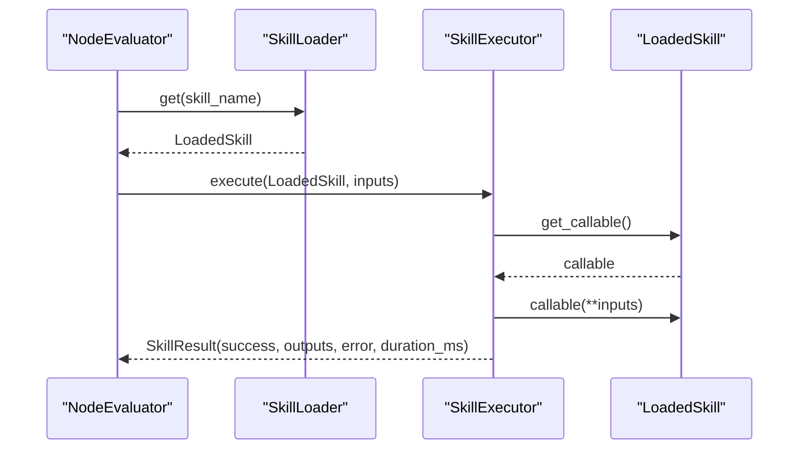
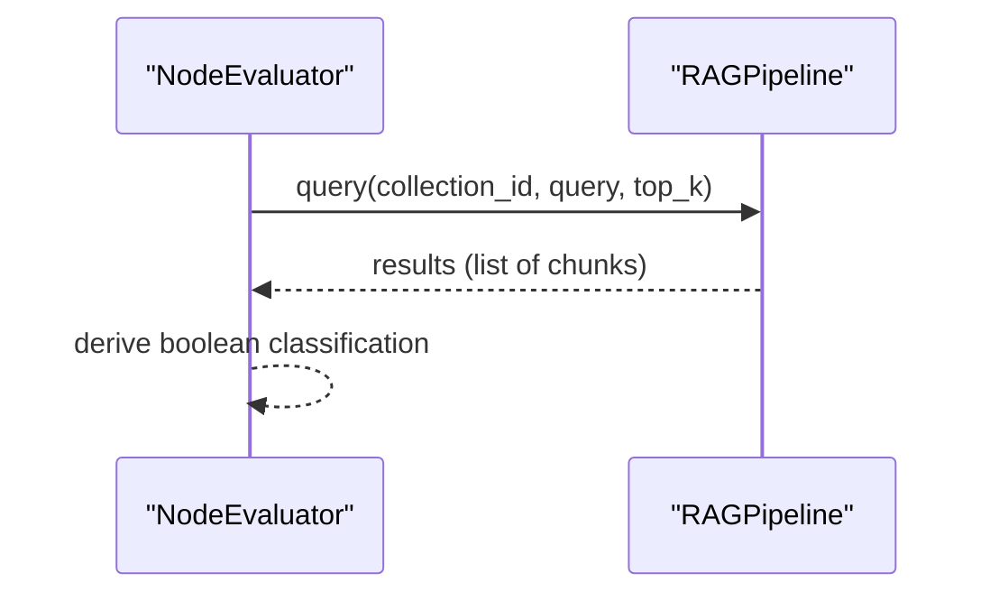
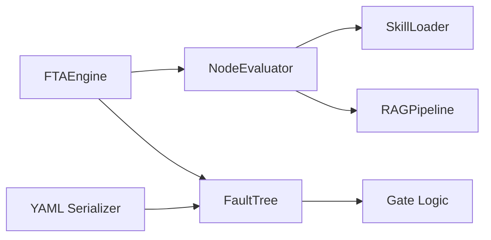

# Event Evaluation and Leaf Node Processing

<cite>
**Referenced Files in This Document**
- [engine.py](file://python/src/resolvenet/fta/engine.py)
- [evaluator.py](file://python/src/resolvenet/fta/evaluator.py)
- [tree.py](file://python/src/resolvenet/fta/tree.py)
- [gates.py](file://python/src/resolvenet/fta/gates.py)
- [serializer.py](file://python/src/resolvenet/fta/serializer.py)
- [executor.py](file://python/src/resolvenet/skills/executor.py)
- [loader.py](file://python/src/resolvenet/skills/loader.py)
- [manifest.py](file://python/src/resolvenet/skills/manifest.py)
- [pipeline.py](file://python/src/resolvenet/rag/pipeline.py)
- [workflow-fta-example.yaml](file://configs/examples/workflow-fta-example.yaml)
- [sample_fta_tree.yaml](file://python/tests/fixtures/sample_fta_tree.yaml)
- [context.py](file://python/src/resolvenet/runtime/context.py)
</cite>

## Table of Contents
1. [Introduction](#introduction)
2. [Project Structure](#project-structure)
3. [Core Components](#core-components)
4. [Architecture Overview](#architecture-overview)
5. [Detailed Component Analysis](#detailed-component-analysis)
6. [Dependency Analysis](#dependency-analysis)
7. [Performance Considerations](#performance-considerations)
8. [Troubleshooting Guide](#troubleshooting-guide)
9. [Conclusion](#conclusion)
10. [Appendices](#appendices)

## Introduction
This document explains how basic events in fault trees are evaluated and how leaf nodes are processed asynchronously. It covers the evaluation strategies supported for basic events (skills, RAG pipelines, LLMs, and static values), the evaluation context and parameter passing mechanisms, the asynchronous execution workflow and progress reporting, integrations with external systems (skill execution, document retrieval, and model inference), evaluation result formatting, performance optimization for concurrent evaluations, and error handling strategies. Examples of evaluation strategies and their appropriate use cases are included to guide practical deployment.

## Project Structure
The fault tree analysis (FTA) capability resides in the Python package under python/src/resolvenet/fta. The core execution engine orchestrates evaluation of basic events and propagation through gates. Supporting modules handle skills, RAG pipelines, and YAML serialization/deserialization. Example configurations demonstrate how to define fault trees with evaluators and parameters.

**Diagram sources**
- [engine.py:14-82](file://python/src/resolvenet/fta/engine.py#L14-L82)
- [evaluator.py:13-73](file://python/src/resolvenet/fta/evaluator.py#L13-L73)
- [tree.py:30-119](file://python/src/resolvenet/fta/tree.py#L30-L119)
- [gates.py:6-28](file://python/src/resolvenet/fta/gates.py#L6-L28)
- [serializer.py:12-112](file://python/src/resolvenet/fta/serializer.py#L12-L112)
- [loader.py:15-90](file://python/src/resolvenet/skills/loader.py#L15-L90)
- [executor.py:14-84](file://python/src/resolvenet/skills/executor.py#L14-L84)
- [manifest.py:33-58](file://python/src/resolvenet/skills/manifest.py#L33-L58)
- [pipeline.py:11-74](file://python/src/resolvenet/rag/pipeline.py#L11-L74)

**Section sources**
- [engine.py:14-82](file://python/src/resolvenet/fta/engine.py#L14-L82)
- [evaluator.py:13-73](file://python/src/resolvenet/fta/evaluator.py#L13-L73)
- [tree.py:30-119](file://python/src/resolvenet/fta/tree.py#L30-L119)
- [serializer.py:12-112](file://python/src/resolvenet/fta/serializer.py#L12-L112)

## Core Components
- FTAEngine: Orchestrates asynchronous execution, emits progress events, evaluates leaf nodes, and propagates results through gates.
- NodeEvaluator: Selects and invokes the appropriate evaluation strategy for basic events (skill, RAG, LLM, or static).
- FaultTree and Gate logic: Define event types, gate types, and evaluation semantics for combining inputs.
- Skill system: Loads manifests, resolves callable entry points, executes in a controlled environment, and reports structured results.
- RAG pipeline: Provides a query interface for retrieving relevant context from collections.
- Serialization: Converts YAML to FaultTree objects and vice versa.

Key evaluation strategies:
- skill:<name>: Executes a pre-loaded skill with parameters and returns a boolean classification.
- rag:<collection_id>: Queries a collection for relevant documents and returns a boolean classification.
- llm:<model_hint>: Calls an LLM for classification based on provided parameters.
- static: Defaults to True when evaluator type is unrecognized.

Evaluation context and parameters:
- context: A dictionary passed into FTAEngine.execute and forwarded to NodeEvaluator.evaluate.
- event.parameters: A dictionary attached to each FTAEvent used by evaluators to configure their behavior.
- ExecutionContext: A broader runtime context structure for agent-style executions (used elsewhere in the system).

Progress reporting:
- Streamed events include workflow.started, node.evaluating/completed, gate.evaluating/completed, and workflow.completed.

**Section sources**
- [engine.py:24-82](file://python/src/resolvenet/fta/engine.py#L24-L82)
- [evaluator.py:23-73](file://python/src/resolvenet/fta/evaluator.py#L23-L73)
- [tree.py:30-119](file://python/src/resolvenet/fta/tree.py#L30-L119)
- [gates.py:6-28](file://python/src/resolvenet/fta/gates.py#L6-L28)
- [serializer.py:12-112](file://python/src/resolvenet/fta/serializer.py#L12-L112)
- [executor.py:20-84](file://python/src/resolvenet/skills/executor.py#L20-L84)
- [loader.py:27-90](file://python/src/resolvenet/skills/loader.py#L27-L90)
- [manifest.py:33-58](file://python/src/resolvenet/skills/manifest.py#L33-L58)
- [pipeline.py:53-74](file://python/src/resolvenet/rag/pipeline.py#L53-L74)
- [context.py:9-34](file://python/src/resolvenet/runtime/context.py#L9-L34)

## Architecture Overview
The asynchronous FTA workflow proceeds as follows:
1. Load a fault tree from YAML or dictionary.
2. Iterate over basic events and emit node.evaluating events.
3. Delegate evaluation to NodeEvaluator, which selects the evaluator type and passes context and parameters.
4. For skills, resolve the skill via SkillLoader and execute via SkillExecutor.
5. For RAG, query the RAGPipeline with configured parameters.
6. For LLM, construct a classification prompt using parameters and obtain a boolean result.
7. Store results on events and propagate through gates bottom-up.
8. Emit node.completed and gate.completed events with results.
9. Emit workflow.completed when finished.

**Diagram sources**
- [engine.py:24-82](file://python/src/resolvenet/fta/engine.py#L24-L82)
- [evaluator.py:23-73](file://python/src/resolvenet/fta/evaluator.py#L23-L73)
- [loader.py:59-61](file://python/src/resolvenet/skills/loader.py#L59-L61)
- [executor.py:20-66](file://python/src/resolvenet/skills/executor.py#L20-L66)
- [pipeline.py:53-74](file://python/src/resolvenet/rag/pipeline.py#L53-L74)

## Detailed Component Analysis

### FTAEngine: Asynchronous Execution and Progress Reporting
- Traverses the tree from leaves upward.
- Emits typed events for workflow lifecycle and node/gate evaluation progress.
- Passes execution context to evaluators and stores boolean results on events.
- Bottom-up gate evaluation uses input values collected from previously evaluated events.

**Diagram sources**
- [engine.py:24-82](file://python/src/resolvenet/fta/engine.py#L24-L82)

**Section sources**
- [engine.py:24-82](file://python/src/resolvenet/fta/engine.py#L24-L82)

### NodeEvaluator: Strategy Selection and Parameter Passing
- Parses evaluator string to select strategy: skill:, rag:, llm:, or default static.
- For skills: resolves LoadedSkill and executes via SkillExecutor, returning a boolean classification derived from outputs.
- For RAG: queries a collection with parameters and returns a boolean classification derived from results.
- For LLM: constructs a classification prompt using parameters and returns a boolean classification.
- Default behavior returns True for unknown types.

**Diagram sources**
- [evaluator.py:23-73](file://python/src/resolvenet/fta/evaluator.py#L23-L73)
- [loader.py:27-61](file://python/src/resolvenet/skills/loader.py#L27-L61)
- [executor.py:20-66](file://python/src/resolvenet/skills/executor.py#L20-L66)
- [pipeline.py:53-74](file://python/src/resolvenet/rag/pipeline.py#L53-L74)

**Section sources**
- [evaluator.py:23-73](file://python/src/resolvenet/fta/evaluator.py#L23-L73)

### FaultTree and Gate Logic: Data Structures and Semantics
- FTAEvent: Holds id, name, description, type, evaluator string, parameters, and computed value.
- FTAGate: Holds id, name, gate_type, input_ids, output_id, and k_value for voting gates.
- Gate evaluation functions implement AND, OR, VOTING (k-of-n), INHIBIT, and PRIORITY_AND semantics.

**Diagram sources**
- [tree.py:30-119](file://python/src/resolvenet/fta/tree.py#L30-L119)
- [gates.py:6-28](file://python/src/resolvenet/fta/gates.py#L6-L28)

**Section sources**
- [tree.py:30-119](file://python/src/resolvenet/fta/tree.py#L30-L119)
- [gates.py:6-28](file://python/src/resolvenet/fta/gates.py#L6-L28)

### YAML Serialization and Deserialization
- load_tree_from_yaml/load_tree_from_dict parse YAML or dictionaries into FaultTree instances.
- dump_tree_to_yaml serializes FaultTree back to YAML for persistence or transport.

**Diagram sources**
- [serializer.py:12-112](file://python/src/resolvenet/fta/serializer.py#L12-L112)

**Section sources**
- [serializer.py:12-112](file://python/src/resolvenet/fta/serializer.py#L12-L112)

### Skill System: Loading, Execution, and Results
- SkillLoader discovers and loads skills from directories, caching LoadedSkill instances.
- LoadedSkill resolves the callable entry point lazily.
- SkillExecutor executes the callable with validated inputs, captures outputs, and returns a structured SkillResult with success/error and timing.

**Diagram sources**
- [evaluator.py:51-57](file://python/src/resolvenet/fta/evaluator.py#L51-L57)
- [loader.py:59-90](file://python/src/resolvenet/skills/loader.py#L59-L90)
- [executor.py:20-84](file://python/src/resolvenet/skills/executor.py#L20-L84)

**Section sources**
- [loader.py:27-90](file://python/src/resolvenet/skills/loader.py#L27-L90)
- [executor.py:20-84](file://python/src/resolvenet/skills/executor.py#L20-L84)
- [manifest.py:33-58](file://python/src/resolvenet/skills/manifest.py#L33-L58)

### RAG Pipeline: Retrieval-Based Evaluation
- RAGPipeline.query accepts a collection_id, query text, and top_k, returning a list of retrieved chunks.
- NodeEvaluator delegates RAG evaluation to this pipeline and converts results into a boolean classification.

**Diagram sources**
- [evaluator.py:59-65](file://python/src/resolvenet/fta/evaluator.py#L59-L65)
- [pipeline.py:53-74](file://python/src/resolvenet/rag/pipeline.py#L53-L74)

**Section sources**
- [pipeline.py:53-74](file://python/src/resolvenet/rag/pipeline.py#L53-L74)

### Evaluation Strategies and Use Cases
- skill:<name>:
  - Use when the evaluation requires deterministic, sandboxed actions (e.g., log analysis, metrics checks).
  - Parameters are passed to the skill’s entry point; outputs are normalized to a boolean classification.
- rag:<collection_id>:
  - Use when contextual evidence is needed from a curated knowledge base or runbooks.
  - Parameters include a query string; results inform a boolean classification.
- llm:<model_hint>:
  - Use when nuanced reasoning or classification from unstructured text is required.
  - Parameters drive prompt construction; the LLM returns a boolean classification.
- static:
  - Use as a fallback or placeholder when an evaluator type is missing or invalid.

Examples in configuration:
- Sample FTA tree with two basic events using skill evaluators and an OR gate.
- Full FTA workflow example with skill, RAG, and LLM evaluators.

**Section sources**
- [workflow-fta-example.yaml:1-50](file://configs/examples/workflow-fta-example.yaml#L1-L50)
- [sample_fta_tree.yaml:1-23](file://python/tests/fixtures/sample_fta_tree.yaml#L1-L23)

### Evaluation Result Formatting and Data Structures
- NodeEvaluator.evaluate returns a boolean result.
- SkillExecutor.execute returns a SkillResult with outputs, success flag, optional error, and duration_ms.
- FTAEngine yields structured events with type, node_id, message, and optional data containing the result.
- Gate evaluation returns a boolean propagated upward to parent gates or the top event.

**Section sources**
- [evaluator.py:23-73](file://python/src/resolvenet/fta/evaluator.py#L23-L73)
- [executor.py:69-84](file://python/src/resolvenet/skills/executor.py#L69-L84)
- [engine.py:40-82](file://python/src/resolvenet/fta/engine.py#L40-L82)
- [tree.py:54-78](file://python/src/resolvenet/fta/tree.py#L54-L78)

## Dependency Analysis
The FTA subsystem depends on:
- FaultTree and gate logic for event and gate definitions.
- NodeEvaluator for strategy selection and delegation.
- SkillLoader and SkillExecutor for skill-based evaluation.
- RAGPipeline for retrieval-based evaluation.
- YAML serializer for tree persistence and transport.

**Diagram sources**
- [engine.py:14-82](file://python/src/resolvenet/fta/engine.py#L14-L82)
- [evaluator.py:13-73](file://python/src/resolvenet/fta/evaluator.py#L13-L73)
- [tree.py:81-119](file://python/src/resolvenet/fta/tree.py#L81-L119)
- [serializer.py:12-112](file://python/src/resolvenet/fta/serializer.py#L12-L112)

**Section sources**
- [engine.py:14-82](file://python/src/resolvenet/fta/engine.py#L14-L82)
- [evaluator.py:13-73](file://python/src/resolvenet/fta/evaluator.py#L13-L73)
- [tree.py:81-119](file://python/src/resolvenet/fta/tree.py#L81-L119)
- [serializer.py:12-112](file://python/src/resolvenet/fta/serializer.py#L12-L112)

## Performance Considerations
- Concurrent evaluation of independent basic events:
  - Current implementation iterates sequentially. To improve throughput, process multiple basic events concurrently using asynchronous loops and gather results.
  - Ensure per-skill timeouts and resource limits to prevent saturation.
- Gate evaluation:
  - Gates are currently evaluated in a fixed bottom-up order. Implement topological sorting for correctness and potential parallelization across independent subtrees.
- I/O-bound steps:
  - Skills and RAG queries are asynchronous; leverage async concurrency for independent nodes.
  - Batch RAG queries where feasible to reduce overhead.
- Memory and CPU limits:
  - Respect skill manifest permissions (timeout, memory, CPU seconds) to avoid overload.
- Progress reporting:
  - Maintain ordered progress events while enabling parallel work to keep UIs responsive.

[No sources needed since this section provides general guidance]

## Troubleshooting Guide
Common issues and resolutions:
- Unknown evaluator type:
  - Symptom: Basic event defaults to True.
  - Resolution: Ensure evaluator string starts with skill:, rag:, or llm:. Otherwise, update the fault tree definition.
- Skill execution failures:
  - Symptom: node.completed with error details in SkillResult.
  - Resolution: Inspect skill manifest permissions, validate inputs, and confirm the entry point exists.
- RAG query returns empty results:
  - Symptom: Classification based on empty context.
  - Resolution: Verify collection_id and query parameters; ensure indexing and retrieval are functional.
- LLM classification errors:
  - Symptom: LLM evaluation path not implemented yet.
  - Resolution: Implement LLM classification logic or switch to skill/rag evaluators.
- Timeout and resource exhaustion:
  - Symptom: Slow or hanging evaluations.
  - Resolution: Enforce per-skill timeouts and resource quotas; consider reducing concurrency.

**Section sources**
- [evaluator.py:46-49](file://python/src/resolvenet/fta/evaluator.py#L46-L49)
- [executor.py:57-66](file://python/src/resolvenet/skills/executor.py#L57-L66)
- [manifest.py:11-20](file://python/src/resolvenet/skills/manifest.py#L11-L20)

## Conclusion
The FTA subsystem provides a modular, extensible framework for evaluating basic events using skills, RAG pipelines, and LLMs, with robust progress reporting and structured result formatting. By leveraging asynchronous execution, enforcing resource limits, and implementing topological gate evaluation, the system can scale to larger fault trees while maintaining reliability and observability.

[No sources needed since this section summarizes without analyzing specific files]

## Appendices

### Example Fault Trees
- Minimal sample with two basic events using skills and an OR gate.
- Full workflow example with skill, RAG, and LLM evaluators.

**Section sources**
- [sample_fta_tree.yaml:1-23](file://python/tests/fixtures/sample_fta_tree.yaml#L1-L23)
- [workflow-fta-example.yaml:1-50](file://configs/examples/workflow-fta-example.yaml#L1-L50)