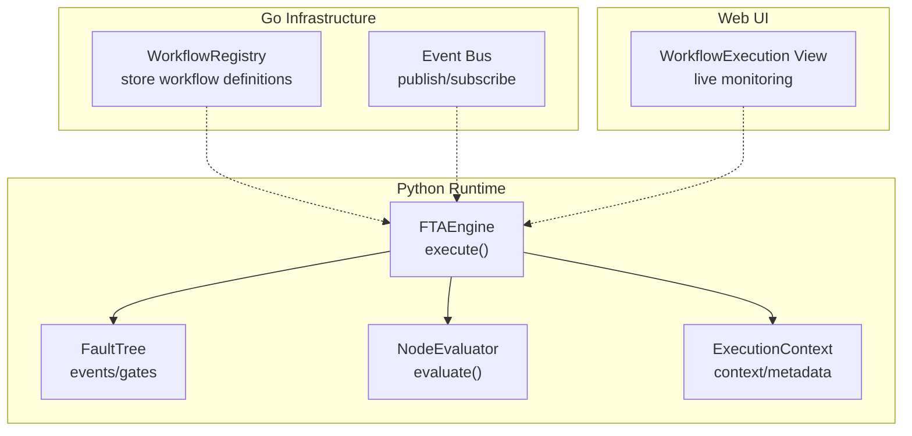
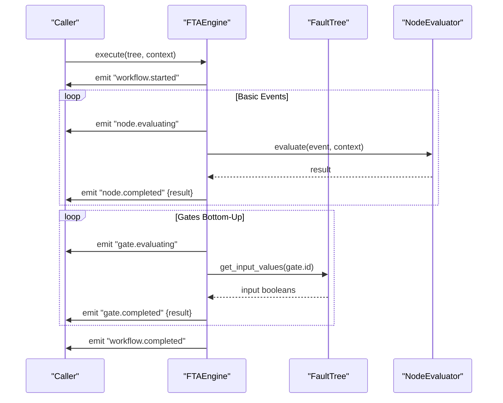
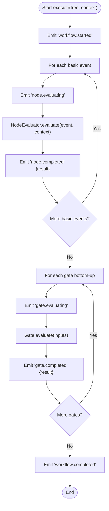
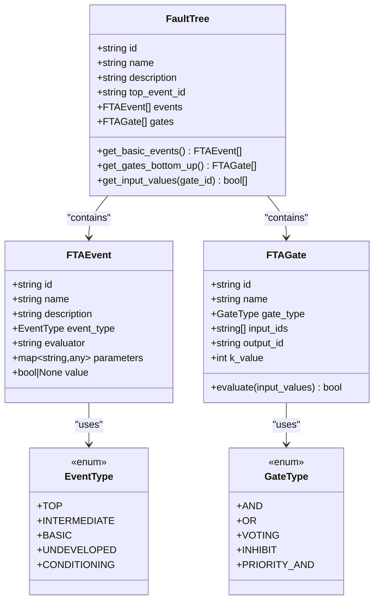
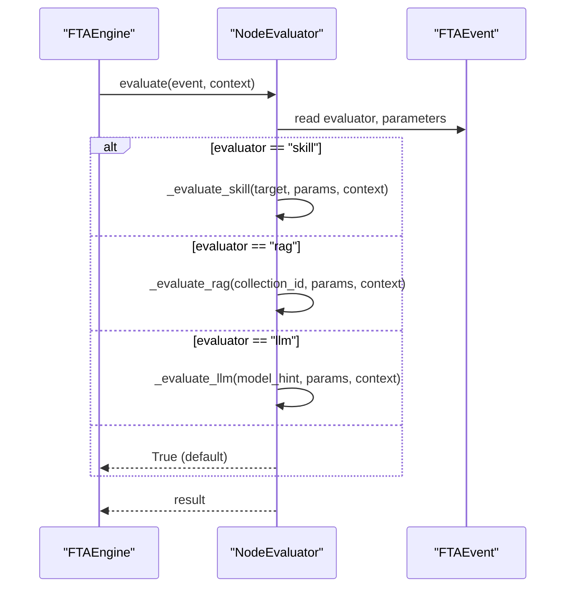
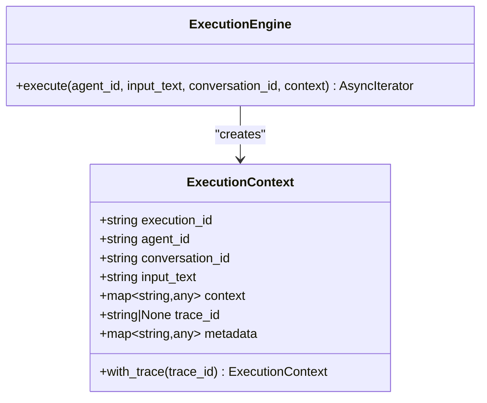
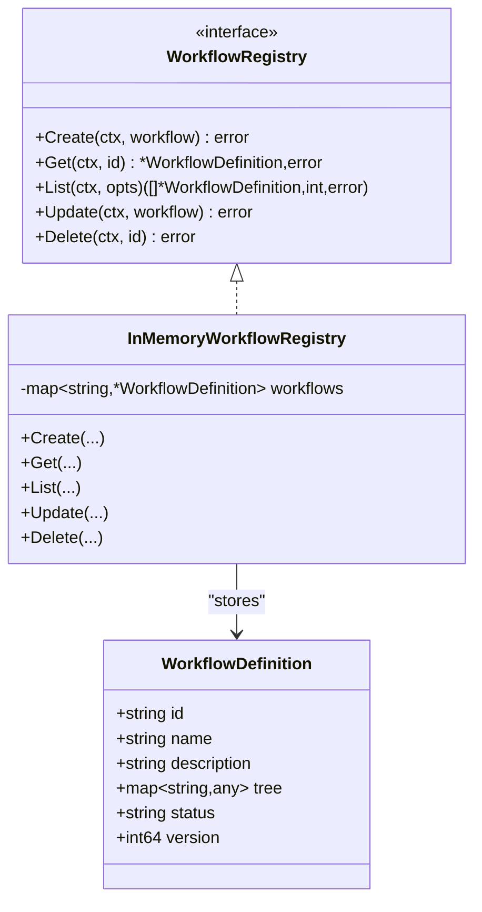
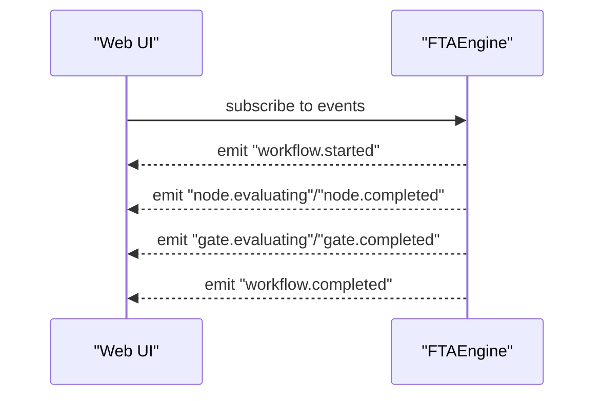
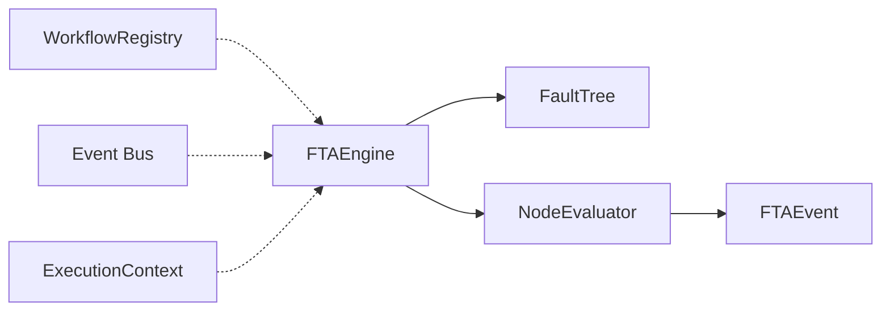

# Execution Workflow and Progress Tracking

<cite>
**Referenced Files in This Document**
- [engine.py](file://python/src/resolvenet/fta/engine.py)
- [tree.py](file://python/src/resolvenet/fta/tree.py)
- [evaluator.py](file://python/src/resolvenet/fta/evaluator.py)
- [gates.py](file://python/src/resolvenet/fta/gates.py)
- [context.py](file://python/src/resolvenet/runtime/context.py)
- [engine.py](file://python/src/resolvenet/runtime/engine.py)
- [workflow.go](file://pkg/registry/workflow.go)
- [event.go](file://pkg/event/event.go)
- [workflow-fta-example.yaml](file://configs/examples/workflow-fta-example.yaml)
- [WorkflowExecution.tsx](file://web/src/pages/Workflows/WorkflowExecution.tsx)
- [metrics.go](file://pkg/telemetry/metrics.go)
</cite>

## Table of Contents
1. [Introduction](#introduction)
2. [Project Structure](#project-structure)
3. [Core Components](#core-components)
4. [Architecture Overview](#architecture-overview)
5. [Detailed Component Analysis](#detailed-component-analysis)
6. [Dependency Analysis](#dependency-analysis)
7. [Performance Considerations](#performance-considerations)
8. [Troubleshooting Guide](#troubleshooting-guide)
9. [Conclusion](#conclusion)
10. [Appendices](#appendices)

## Introduction
This document explains the Fault Tree Analysis (FTA) execution workflow and progress tracking system. It covers the execution lifecycle from initialization through completion, the asynchronous event stream for real-time progress updates, execution context management, and parameter passing. It also documents workflow event types (node.evaluating, node.completed, gate.evaluating, gate.completed), error handling and recovery mechanisms, performance monitoring, and troubleshooting guidance for timeouts, resource exhaustion, and interruptions.

## Project Structure
The FTA execution stack spans Python runtime modules and Go-based infrastructure:
- Python FTA engine and data structures define the execution model and event types.
- Go-based registry and event bus provide persistence and eventing abstractions.
- Web UI surfaces live execution monitoring.
- Telemetry hooks enable metrics collection.



**Diagram sources**
- [engine.py:24-82](file://python/src/resolvenet/fta/engine.py#L24-L82)
- [tree.py:81-120](file://python/src/resolvenet/fta/tree.py#L81-L120)
- [evaluator.py:23-74](file://python/src/resolvenet/fta/evaluator.py#L23-L74)
- [context.py:9-35](file://python/src/resolvenet/runtime/context.py#L9-L35)
- [workflow.go:9-26](file://pkg/registry/workflow.go#L9-L26)
- [event.go:7-22](file://pkg/event/event.go#L7-L22)
- [WorkflowExecution.tsx:1-16](file://web/src/pages/Workflows/WorkflowExecution.tsx#L1-L16)

**Section sources**
- [engine.py:14-82](file://python/src/resolvenet/fta/engine.py#L14-L82)
- [tree.py:10-120](file://python/src/resolvenet/fta/tree.py#L10-L120)
- [evaluator.py:13-74](file://python/src/resolvenet/fta/evaluator.py#L13-L74)
- [context.py:9-35](file://python/src/resolvenet/runtime/context.py#L9-L35)
- [workflow.go:9-93](file://pkg/registry/workflow.go#L9-L93)
- [event.go:7-22](file://pkg/event/event.go#L7-L22)
- [WorkflowExecution.tsx:1-16](file://web/src/pages/Workflows/WorkflowExecution.tsx#L1-L16)

## Core Components
- FTAEngine: Orchestrates execution, emits workflow events, and coordinates evaluation of basic events and gates.
- FaultTree: Holds the tree structure, identifies basic events, and provides bottom-up gate traversal and input value retrieval.
- NodeEvaluator: Evaluates basic events using skill, RAG, or LLM evaluators and passes execution context.
- ExecutionContext: Carries execution_id, agent_id, conversation_id, input_text, context, trace_id, and metadata.
- WorkflowRegistry: Stores workflow definitions (id, name, tree, status, version).
- Event Bus: Defines publish/subscribe semantics for system events.
- Web UI: Provides live execution monitoring for workflow runs.

Key event types emitted by the engine:
- workflow.started
- node.evaluating
- node.completed
- gate.evaluating
- gate.completed
- workflow.completed

**Section sources**
- [engine.py:24-82](file://python/src/resolvenet/fta/engine.py#L24-L82)
- [tree.py:81-120](file://python/src/resolvenet/fta/tree.py#L81-L120)
- [evaluator.py:23-74](file://python/src/resolvenet/fta/evaluator.py#L23-L74)
- [context.py:9-35](file://python/src/resolvenet/runtime/context.py#L9-L35)
- [workflow.go:9-26](file://pkg/registry/workflow.go#L9-L26)
- [event.go:7-22](file://pkg/event/event.go#L7-L22)

## Architecture Overview
The FTA execution follows an asynchronous, event-driven model:
- Initialization: An execution context is created and a workflow started event is emitted.
- Basic event evaluation: For each basic event, a node.evaluating event is emitted, followed by asynchronous evaluation, and finally a node.completed event with the result.
- Gate evaluation: Gates are evaluated in bottom-up order; for each gate, a gate.evaluating event is emitted, then the gate’s logic computes a result, and a gate.completed event is emitted.
- Completion: A workflow.completed event signals termination.



**Diagram sources**
- [engine.py:24-82](file://python/src/resolvenet/fta/engine.py#L24-L82)
- [tree.py:103-119](file://python/src/resolvenet/fta/tree.py#L103-L119)
- [evaluator.py:23-74](file://python/src/resolvenet/fta/evaluator.py#L23-L74)

## Detailed Component Analysis

### FTAEngine Execution Lifecycle
- Initializes NodeEvaluator.
- Emits workflow.started when execution begins.
- Iterates over basic events, emitting node.evaluating and node.completed with the evaluation result.
- Iterates over gates in bottom-up order, emitting gate.evaluating and gate.completed with computed results.
- Emits workflow.completed when finished.



**Diagram sources**
- [engine.py:24-82](file://python/src/resolvenet/fta/engine.py#L24-L82)
- [tree.py:103-119](file://python/src/resolvenet/fta/tree.py#L103-L119)
- [evaluator.py:23-74](file://python/src/resolvenet/fta/evaluator.py#L23-L74)

**Section sources**
- [engine.py:24-82](file://python/src/resolvenet/fta/engine.py#L24-L82)

### FaultTree Data Model and Gate Evaluation
- EventType and GateType enumerate supported node and gate types.
- FTAEvent carries id, name, description, type, evaluator, parameters, and value.
- FTAGate encapsulates gate_type, input_ids, output_id, and k_value, with evaluate() implementing AND, OR, VOTING, INHIBIT, and PRIORITY_AND semantics.
- FaultTree provides:
  - get_basic_events(): selects leaf/basic events.
  - get_gates_bottom_up(): returns gates in bottom-up order (placeholder ordering).
  - get_input_values(gate_id): collects boolean values from input events.



**Diagram sources**
- [tree.py:10-120](file://python/src/resolvenet/fta/tree.py#L10-L120)

**Section sources**
- [tree.py:10-120](file://python/src/resolvenet/fta/tree.py#L10-L120)
- [gates.py:6-28](file://python/src/resolvenet/fta/gates.py#L6-L28)

### NodeEvaluator and Parameter Passing
- NodeEvaluator.evaluate(event, context) dispatches to:
  - _evaluate_skill(target, params, context)
  - _evaluate_rag(collection_id, params, context)
  - _evaluate_llm(model_hint, params, context)
- Unknown evaluator types default to True with a warning.
- Parameters from FTAEvent.parameters are passed to the underlying evaluator implementations.



**Diagram sources**
- [evaluator.py:23-74](file://python/src/resolvenet/fta/evaluator.py#L23-L74)
- [engine.py:53-53](file://python/src/resolvenet/fta/engine.py#L53-L53)

**Section sources**
- [evaluator.py:23-74](file://python/src/resolvenet/fta/evaluator.py#L23-L74)

### Execution Context Management
- ExecutionContext holds execution_id, agent_id, conversation_id, input_text, context, trace_id, and metadata.
- with_trace(trace_id) attaches tracing identifiers to the context.
- The runtime ExecutionEngine constructs an ExecutionContext and streams execution.started and execution.completed events.



**Diagram sources**
- [context.py:9-35](file://python/src/resolvenet/runtime/context.py#L9-L35)
- [engine.py:25-89](file://python/src/resolvenet/runtime/engine.py#L25-L89)

**Section sources**
- [context.py:9-35](file://python/src/resolvenet/runtime/context.py#L9-L35)
- [engine.py:25-89](file://python/src/resolvenet/runtime/engine.py#L25-L89)

### Workflow Definition Registry
- WorkflowDefinition stores id, name, description, tree, status, and version.
- InMemoryWorkflowRegistry supports create, get, list, update, and delete operations.



**Diagram sources**
- [workflow.go:9-93](file://pkg/registry/workflow.go#L9-L93)

**Section sources**
- [workflow.go:9-93](file://pkg/registry/workflow.go#L9-L93)

### Event Streaming and Monitoring
- The FTAEngine yields structured events with type, node_id, message, and optional data.
- The web UI WorkflowExecution page indicates live monitoring with tree node highlighting.



**Diagram sources**
- [engine.py:40-82](file://python/src/resolvenet/fta/engine.py#L40-L82)
- [WorkflowExecution.tsx:1-16](file://web/src/pages/Workflows/WorkflowExecution.tsx#L1-L16)

**Section sources**
- [engine.py:40-82](file://python/src/resolvenet/fta/engine.py#L40-L82)
- [WorkflowExecution.tsx:1-16](file://web/src/pages/Workflows/WorkflowExecution.tsx#L1-L16)

### Example: Workflow Definition
The example YAML demonstrates a typical FTA workflow with top-level event, basic events, and an OR gate aggregating evidence.

```mermaid
graph TB
Root["Root Cause Identified (TOP)"]
ORGate["Any Evidence Found (OR)"]
Log["Check Error Logs (BASIC)"]
Metrics["Check System Metrics (BASIC)"]
Runbook["Consult Runbook (BASIC)"]
ORGate --> Log
ORGate --> Metrics
ORGate --> Runbook
Root <-- ORGate
```

**Diagram sources**
- [workflow-fta-example.yaml:3-50](file://configs/examples/workflow-fta-example.yaml#L3-L50)

**Section sources**
- [workflow-fta-example.yaml:1-50](file://configs/examples/workflow-fta-example.yaml#L1-L50)

## Dependency Analysis
- FTAEngine depends on FaultTree and NodeEvaluator.
- NodeEvaluator depends on FTAEvent and delegates to skill, RAG, or LLM evaluators.
- ExecutionContext is used by the runtime ExecutionEngine and can be extended for FTA execution contexts.
- WorkflowRegistry persists workflow definitions consumed by the engine.
- Event Bus provides a generic mechanism for event distribution.



**Diagram sources**
- [engine.py:21-22](file://python/src/resolvenet/fta/engine.py#L21-L22)
- [tree.py:81-91](file://python/src/resolvenet/fta/tree.py#L81-L91)
- [evaluator.py:23-49](file://python/src/resolvenet/fta/evaluator.py#L23-L49)
- [workflow.go:9-26](file://pkg/registry/workflow.go#L9-L26)
- [event.go:14-22](file://pkg/event/event.go#L14-L22)
- [context.py:9-35](file://python/src/resolvenet/runtime/context.py#L9-L35)

**Section sources**
- [engine.py:21-22](file://python/src/resolvenet/fta/engine.py#L21-L22)
- [tree.py:81-91](file://python/src/resolvenet/fta/tree.py#L81-L91)
- [evaluator.py:23-49](file://python/src/resolvenet/fta/evaluator.py#L23-L49)
- [workflow.go:9-26](file://pkg/registry/workflow.go#L9-L26)
- [event.go:14-22](file://pkg/event/event.go#L14-L22)
- [context.py:9-35](file://python/src/resolvenet/runtime/context.py#L9-L35)

## Performance Considerations
- Asynchronous evaluation: Basic events are evaluated asynchronously via NodeEvaluator, enabling concurrency where applicable.
- Bottom-up propagation: Gates are processed after basic events, minimizing redundant recomputation.
- Metrics initialization: OpenTelemetry metrics initialization is available for capturing execution statistics and latency.
- Recommendations:
  - Instrument event emission timestamps to measure per-node and per-gate durations.
  - Track queue sizes and concurrency limits for evaluator invocations.
  - Add circuit breakers for external skill/RAG/LLM calls to prevent cascading failures.
  - Use bounded concurrency for basic event evaluation to avoid resource exhaustion.

**Section sources**
- [engine.py:24-82](file://python/src/resolvenet/fta/engine.py#L24-L82)
- [metrics.go:7-12](file://pkg/telemetry/metrics.go#L7-L12)

## Troubleshooting Guide
Common issues and remedies:
- Execution timeouts
  - Symptom: workflow hangs or events stall.
  - Actions: Set timeout boundaries around basic event evaluation; emit periodic progress events; abort on timeout and emit a failure event.
- Resource exhaustion
  - Symptom: Out-of-memory or thread starvation.
  - Actions: Limit concurrent evaluations; apply backpressure; monitor memory and CPU; terminate long-running tasks.
- Workflow interruptions
  - Symptom: Unexpected cancellation mid-execution.
  - Actions: Capture interruption signals; persist partial results; emit workflow.completed with interruption metadata; support resume from last checkpoint.
- Unknown evaluator type
  - Symptom: Basic event defaults to True.
  - Actions: Validate event.evaluator format; log warnings; fail fast on invalid types.
- Missing input values for gates
  - Symptom: Gate evaluates to False when inputs are None.
  - Actions: Ensure all input events are evaluated before gate propagation; handle missing values explicitly.

**Section sources**
- [evaluator.py:46-49](file://python/src/resolvenet/fta/evaluator.py#L46-L49)
- [tree.py:108-119](file://python/src/resolvenet/fta/tree.py#L108-L119)
- [engine.py:62-77](file://python/src/resolvenet/fta/engine.py#L62-L77)

## Conclusion
The FTA execution workflow is designed as an asynchronous, event-driven process that streams progress updates and aggregates results through logical gates. The system provides clear lifecycle events, extensible evaluators, and a robust execution context for parameter passing. With proper instrumentation and safeguards, it supports reliable, observable, and scalable fault tree analysis.

## Appendices

### Event Type Reference
- workflow.started: Emitted at the beginning of execution.
- node.evaluating: Emitted before evaluating a basic event.
- node.completed: Emitted after evaluation with the result.
- gate.evaluating: Emitted before evaluating a gate.
- gate.completed: Emitted after gate evaluation with the result.
- workflow.completed: Emitted upon successful completion.

**Section sources**
- [engine.py:40-82](file://python/src/resolvenet/fta/engine.py#L40-L82)