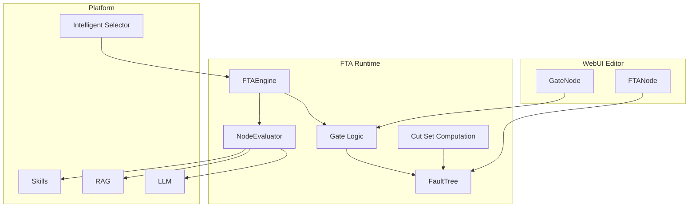
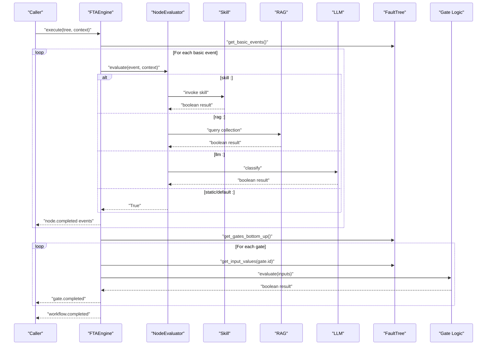
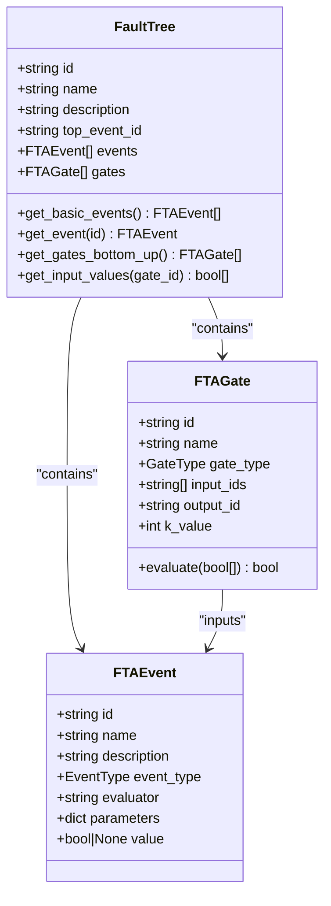
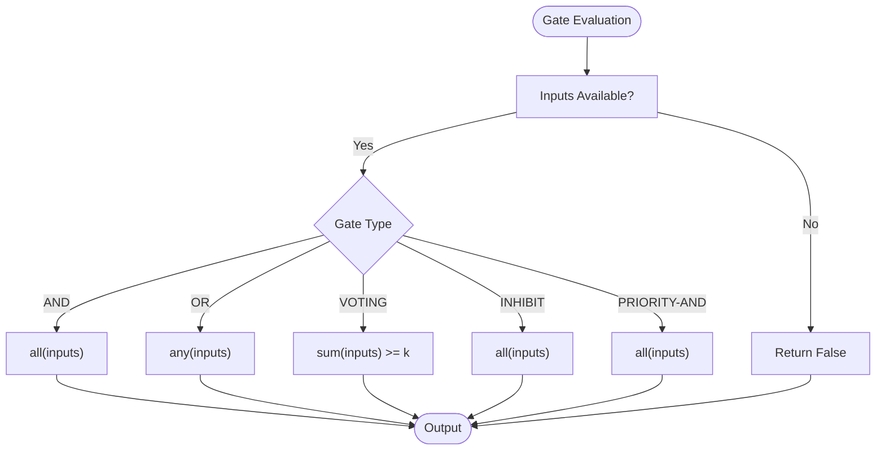
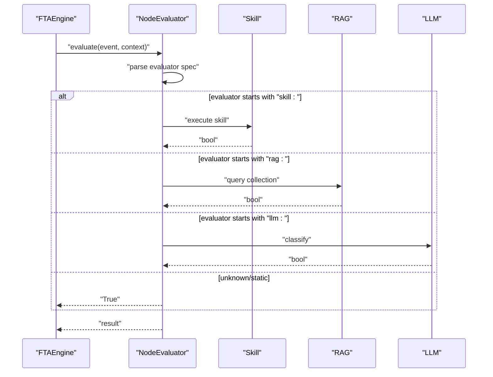
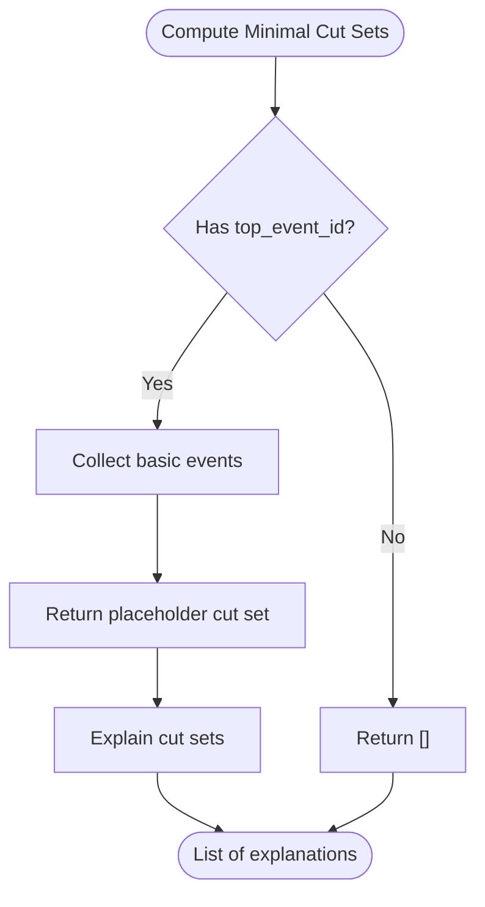
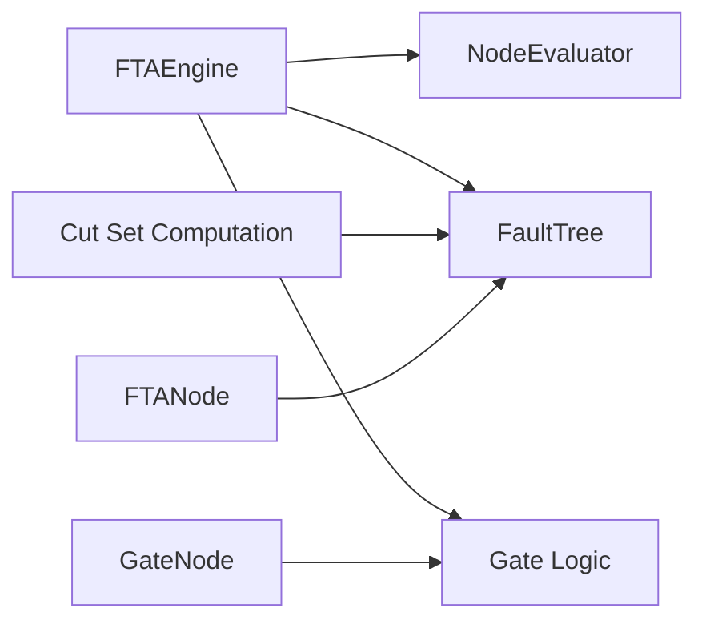

# FTA Fundamentals and Concepts

<cite>
**Referenced Files in This Document**
- [README.md](file://README.md)
- [docs/architecture/fta-engine.md](file://docs/architecture/fta-engine.md)
- [python/src/resolvenet/fta/__init__.py](file://python/src/resolvenet/fta/__init__.py)
- [python/src/resolvenet/fta/engine.py](file://python/src/resolvenet/fta/engine.py)
- [python/src/resolvenet/fta/tree.py](file://python/src/resolvenet/fta/tree.py)
- [python/src/resolvenet/fta/gates.py](file://python/src/resolvenet/fta/gates.py)
- [python/src/resolvenet/fta/evaluator.py](file://python/src/resolvenet/fta/evaluator.py)
- [python/src/resolvenet/fta/cut_sets.py](file://python/src/resolvenet/fta/cut_sets.py)
- [configs/examples/workflow-fta-example.yaml](file://configs/examples/workflow-fta-example.yaml)
- [python/tests/fixtures/sample_fta_tree.yaml](file://python/tests/fixtures/sample_fta_tree.yaml)
- [python/tests/unit/test_fta_engine.py](file://python/tests/unit/test_fta_engine.py)
- [web/src/components/TreeEditor/FTANode.tsx](file://web/src/components/TreeEditor/FTANode.tsx)
- [web/src/components/TreeEditor/GateNode.tsx](file://web/src/components/TreeEditor/GateNode.tsx)
</cite>

## Table of Contents
1. [Introduction](#introduction)
2. [Project Structure](#project-structure)
3. [Core Components](#core-components)
4. [Architecture Overview](#architecture-overview)
5. [Detailed Component Analysis](#detailed-component-analysis)
6. [Dependency Analysis](#dependency-analysis)
7. [Performance Considerations](#performance-considerations)
8. [Troubleshooting Guide](#troubleshooting-guide)
9. [Conclusion](#conclusion)
10. [Appendices](#appendices)

## Introduction
This document explains Fault Tree Analysis (FTA) fundamentals and the core concepts implemented in the repository’s FTA Workflow Engine. It covers theoretical foundations such as fault tree construction, event modeling, and propagation semantics; describes the hierarchical structure of fault trees; and outlines how the system evaluates basic events via skills, RAG, or LLM, and how gates combine outcomes bottom-up to produce a top event result. Practical examples demonstrate system reliability analysis, safety assessment, and risk evaluation. Guidance is included on when to use FTA versus other analytical methods.

## Project Structure
The FTA engine resides in the Python runtime and integrates with the broader platform that includes an Intelligent Selector, Skills, RAG, and a WebUI editor. The engine defines fault tree data structures, gate logic, and an execution workflow that evaluates basic events and propagates results through gates to the top event.

**Diagram sources**
- [README.md:10-46](file://README.md#L10-L46)
- [python/src/resolvenet/fta/engine.py:14-83](file://python/src/resolvenet/fta/engine.py#L14-L83)
- [python/src/resolvenet/fta/evaluator.py:13-74](file://python/src/resolvenet/fta/evaluator.py#L13-L74)
- [python/src/resolvenet/fta/tree.py:81-120](file://python/src/resolvenet/fta/tree.py#L81-L120)
- [python/src/resolvenet/fta/gates.py:1-29](file://python/src/resolvenet/fta/gates.py#L1-L29)
- [python/src/resolvenet/fta/cut_sets.py:8-49](file://python/src/resolvenet/fta/cut_sets.py#L8-L49)
- [web/src/components/TreeEditor/FTANode.tsx:11-37](file://web/src/components/TreeEditor/FTANode.tsx#L11-L37)
- [web/src/components/TreeEditor/GateNode.tsx:11-27](file://web/src/components/TreeEditor/GateNode.tsx#L11-L27)

**Section sources**
- [README.md:10-57](file://README.md#L10-L57)
- [docs/architecture/fta-engine.md:1-19](file://docs/architecture/fta-engine.md#L1-L19)

## Core Components
- FaultTree: Holds the tree structure, including events and gates, and exposes traversal helpers for basic events and bottom-up gate evaluation.
- FTAEvent: Represents an event node with type (top, intermediate, basic, undeveloped, conditioning), evaluator specification, and optional parameters.
- FTAGate: Represents logical gates (AND, OR, VOTING, INHIBIT, PRIORITY-AND) with inputs and outputs.
- FTAEngine: Orchestrates evaluation by first evaluating basic events and then propagating results through gates bottom-up.
- NodeEvaluator: Evaluates basic events using skills, RAG, LLM, or defaults to a static value.
- Gate logic: Provides implementations for AND, OR, VOTING, INHIBIT, and PRIORITY-AND gates.
- Cut set computation: Computes minimal cut sets and generates human-readable explanations.

**Section sources**
- [python/src/resolvenet/fta/tree.py:30-120](file://python/src/resolvenet/fta/tree.py#L30-L120)
- [python/src/resolvenet/fta/engine.py:14-83](file://python/src/resolvenet/fta/engine.py#L14-L83)
- [python/src/resolvenet/fta/evaluator.py:13-74](file://python/src/resolvenet/fta/evaluator.py#L13-L74)
- [python/src/resolvenet/fta/gates.py:1-29](file://python/src/resolvenet/fta/gates.py#L1-L29)
- [python/src/resolvenet/fta/cut_sets.py:8-49](file://python/src/resolvenet/fta/cut_sets.py#L8-L49)

## Architecture Overview
The FTA engine executes a structured decision process:
1. Parse the tree definition.
2. Identify leaf (basic) events.
3. Evaluate leaves (skills/RAG/LLM) and record outcomes.
4. Propagate outcomes bottom-up through gates.
5. Compute the top event result.

**Diagram sources**
- [python/src/resolvenet/fta/engine.py:24-83](file://python/src/resolvenet/fta/engine.py#L24-L83)
- [python/src/resolvenet/fta/evaluator.py:23-74](file://python/src/resolvenet/fta/evaluator.py#L23-L74)
- [python/src/resolvenet/fta/tree.py:103-120](file://python/src/resolvenet/fta/tree.py#L103-L120)
- [python/src/resolvenet/fta/gates.py:6-29](file://python/src/resolvenet/fta/gates.py#L6-L29)

## Detailed Component Analysis

### Fault Tree Data Model
The fault tree model defines three primary event types and five gate types. Events carry metadata and an evaluator specification. Gates connect inputs to outputs and compute boolean results.

**Diagram sources**
- [python/src/resolvenet/fta/tree.py:30-120](file://python/src/resolvenet/fta/tree.py#L30-L120)

**Section sources**
- [python/src/resolvenet/fta/tree.py:10-18](file://python/src/resolvenet/fta/tree.py#L10-L18)
- [python/src/resolvenet/fta/tree.py:20-28](file://python/src/resolvenet/fta/tree.py#L20-L28)
- [python/src/resolvenet/fta/tree.py:30-53](file://python/src/resolvenet/fta/tree.py#L30-L53)
- [python/src/resolvenet/fta/tree.py:81-120](file://python/src/resolvenet/fta/tree.py#L81-L120)

### Gate Semantics and Boolean Algebra
Gate logic implements standard Boolean operations:
- AND: All inputs true.
- OR: At least one input true.
- VOTING (k-of-n): At least k inputs true.
- INHIBIT: AND with conditioning (placeholder behavior).
- PRIORITY-AND: AND respecting order (placeholder behavior).

**Diagram sources**
- [python/src/resolvenet/fta/tree.py:54-78](file://python/src/resolvenet/fta/tree.py#L54-L78)
- [python/src/resolvenet/fta/gates.py:6-29](file://python/src/resolvenet/fta/gates.py#L6-L29)

**Section sources**
- [python/src/resolvenet/fta/tree.py:54-78](file://python/src/resolvenet/fta/tree.py#L54-L78)
- [python/src/resolvenet/fta/gates.py:6-29](file://python/src/resolvenet/fta/gates.py#L6-L29)

### Basic Event Evaluation and Conditional Dependencies
Basic events can be evaluated via:
- skill:invocation
- rag:collection query
- llm:model classification
- static/default (default True)

Conditional dependencies are modeled via gates and event types. Conditioning events influence gate behavior (e.g., INHIBIT), while event types distinguish top, intermediate, and basic nodes.

**Diagram sources**
- [python/src/resolvenet/fta/evaluator.py:23-74](file://python/src/resolvenet/fta/evaluator.py#L23-L74)

**Section sources**
- [python/src/resolvenet/fta/evaluator.py:13-74](file://python/src/resolvenet/fta/evaluator.py#L13-L74)
- [python/src/resolvenet/fta/tree.py:30-41](file://python/src/resolvenet/fta/tree.py#L30-L41)

### Top Events vs Failure Events
- Top event: The system-level failure or undesired outcome being analyzed (e.g., “Root Cause Identified”).
- Intermediate events: Logical combinations of lower-level events.
- Basic events: Primitive failure causes evaluated by skills, RAG, or LLM (e.g., “Check Error Logs”, “Check System Metrics”).

Examples in configuration files illustrate top-level diagnosis trees and sample system failure trees.

**Section sources**
- [configs/examples/workflow-fta-example.yaml:3-50](file://configs/examples/workflow-fta-example.yaml#L3-L50)
- [python/tests/fixtures/sample_fta_tree.yaml:1-23](file://python/tests/fixtures/sample_fta_tree.yaml#L1-L23)

### Cut Sets and Minimal Cut Set Computation
Minimal cut sets represent the smallest combinations of basic events that cause the top event. The current implementation provides placeholders and a helper to explain cut sets in natural language.

**Diagram sources**
- [python/src/resolvenet/fta/cut_sets.py:8-49](file://python/src/resolvenet/fta/cut_sets.py#L8-L49)

**Section sources**
- [python/src/resolvenet/fta/cut_sets.py:8-49](file://python/src/resolvenet/fta/cut_sets.py#L8-L49)

### Practical Examples
- System Reliability Analysis: A simple OR gate combining two basic failure events leads to system failure.
- Safety Assessment: An incident diagnosis tree aggregates evidence from logs, metrics, and runbooks to identify root cause.
- Risk Evaluation: Cut sets reveal minimal combinations of contributing factors enabling the top event.

These scenarios are illustrated by example configurations and tests.

**Section sources**
- [python/tests/fixtures/sample_fta_tree.yaml:1-23](file://python/tests/fixtures/sample_fta_tree.yaml#L1-L23)
- [configs/examples/workflow-fta-example.yaml:3-50](file://configs/examples/workflow-fta-example.yaml#L3-L50)
- [python/tests/unit/test_fta_engine.py:27-40](file://python/tests/unit/test_fta_engine.py#L27-L40)

## Dependency Analysis
The FTA engine depends on the tree model and gate logic, while the execution workflow coordinates evaluation and propagation. The WebUI editor renders nodes and gates for visualization.

**Diagram sources**
- [python/src/resolvenet/fta/engine.py:14-83](file://python/src/resolvenet/fta/engine.py#L14-L83)
- [python/src/resolvenet/fta/evaluator.py:13-74](file://python/src/resolvenet/fta/evaluator.py#L13-L74)
- [python/src/resolvenet/fta/tree.py:81-120](file://python/src/resolvenet/fta/tree.py#L81-L120)
- [python/src/resolvenet/fta/gates.py:1-29](file://python/src/resolvenet/fta/gates.py#L1-L29)
- [python/src/resolvenet/fta/cut_sets.py:8-49](file://python/src/resolvenet/fta/cut_sets.py#L8-L49)
- [web/src/components/TreeEditor/FTANode.tsx:11-37](file://web/src/components/TreeEditor/FTANode.tsx#L11-L37)
- [web/src/components/TreeEditor/GateNode.tsx:11-27](file://web/src/components/TreeEditor/GateNode.tsx#L11-L27)

**Section sources**
- [python/src/resolvenet/fta/engine.py:14-83](file://python/src/resolvenet/fta/engine.py#L14-L83)
- [python/src/resolvenet/fta/tree.py:81-120](file://python/src/resolvenet/fta/tree.py#L81-L120)
- [web/src/components/TreeEditor/FTANode.tsx:11-37](file://web/src/components/TreeEditor/FTANode.tsx#L11-L37)
- [web/src/components/TreeEditor/GateNode.tsx:11-27](file://web/src/components/TreeEditor/GateNode.tsx#L11-L27)

## Performance Considerations
- Bottom-up evaluation order ensures deterministic propagation; the current implementation uses a reverse of gates for ordering (with a noted TODO for topological sorting).
- Gate evaluation is O(n) per gate with n inputs; overall complexity scales linearly with total inputs across gates.
- Asynchronous evaluation allows concurrent basic event evaluation when supported by underlying evaluators.
- Cut set computation is currently a placeholder; for large trees, consider BDD-based or MOCUS-based algorithms for scalability.

[No sources needed since this section provides general guidance]

## Troubleshooting Guide
- Unknown evaluator type: Defaults to True and logs a warning; verify evaluator prefixes (skill:, rag:, llm:).
- Missing top_event_id: Cut set computation returns empty; ensure the tree specifies a top event.
- Empty input lists: Gate evaluation returns False; confirm gate inputs are properly wired.
- Bottom-up ordering: Current ordering is a reverse of gates; expect correct results but consider implementing topological sorting for complex trees.

**Section sources**
- [python/src/resolvenet/fta/evaluator.py:46-49](file://python/src/resolvenet/fta/evaluator.py#L46-L49)
- [python/src/resolvenet/fta/cut_sets.py:20-21](file://python/src/resolvenet/fta/cut_sets.py#L20-L21)
- [python/src/resolvenet/fta/tree.py:63-64](file://python/src/resolvenet/fta/tree.py#L63-L64)
- [python/src/resolvenet/fta/tree.py:105-106](file://python/src/resolvenet/fta/tree.py#L105-L106)

## Conclusion
The FTA engine provides a modular, extensible framework for constructing and evaluating fault trees. It supports diverse basic event evaluators and standard Boolean gates, with pathways for advanced analyses like minimal cut sets. The WebUI editor complements the runtime by offering visual authoring and status feedback. Use FTA when you need structured, logical decomposition of system failures and when combining multiple diagnostic sources into a coherent assessment.

[No sources needed since this section summarizes without analyzing specific files]

## Appendices

### Mathematical Foundations
- Boolean Algebra: Gates implement AND, OR, and generalized k-of-n voting; these correspond to conjunction, disjunction, and threshold logic.
- Fault Tree Semantics: Events are nodes; gates are Boolean operators; top event is the root; intermediate and basic events form a directed acyclic graph.
- Cut Sets: Minimal cut sets are minimal hitting sets for the top event; they identify essential combinations of basic events.

[No sources needed since this section provides general guidance]

### When to Use FTA vs Other Methods
- Use FTA when:
  - You need explicit logical composition of failure modes.
  - You want to identify minimal combinations of causes leading to a top event.
  - You benefit from structured, visual modeling and explainable reasoning.
- Consider alternatives when:
  - Probabilistic dependencies require detailed quantitative models (e.g., Bayesian networks).
  - Dynamic temporal behavior matters (e.g., dynamic fault trees).
  - Simulation-based risk assessment is preferred (e.g., Monte Carlo).

[No sources needed since this section provides general guidance]