# FTA Workflow Engine

<cite>
**Referenced Files in This Document**
- [engine.py](file://python/src/resolvenet/fta/engine.py)
- [tree.py](file://python/src/resolvenet/fta/tree.py)
- [gates.py](file://python/src/resolvenet/fta/gates.py)
- [evaluator.py](file://python/src/resolvenet/fta/evaluator.py)
- [cut_sets.py](file://python/src/resolvenet/fta/cut_sets.py)
- [serializer.py](file://python/src/resolvenet/fta/serializer.py)
- [workflow-fta-example.yaml](file://configs/examples/workflow-fta-example.yaml)
- [sample_fta_tree.yaml](file://python/tests/fixtures/sample_fta_tree.yaml)
- [fta-engine.md](file://docs/architecture/fta-engine.md)
- [WorkflowDesigner.tsx](file://web/src/pages/Workflows/WorkflowDesigner.tsx)
- [GateNode.tsx](file://web/src/components/TreeEditor/GateNode.tsx)
- [FTANode.tsx](file://web/src/components/TreeEditor/FTANode.tsx)
- [run.go](file://internal/cli/workflow/run.go)
- [create.go](file://internal/cli/workflow/create.go)
- [visualize.go](file://internal/cli/workflow/visualize.go)
</cite>

## Table of Contents
1. [Introduction](#introduction)
2. [Project Structure](#project-structure)
3. [Core Components](#core-components)
4. [Architecture Overview](#architecture-overview)
5. [Detailed Component Analysis](#detailed-component-analysis)
6. [Dependency Analysis](#dependency-analysis)
7. [Performance Considerations](#performance-considerations)
8. [Troubleshooting Guide](#troubleshooting-guide)
9. [Conclusion](#conclusion)
10. [Appendices](#appendices)

## Introduction
This document describes the Fault Tree Analysis (FTA) Workflow Engine, focusing on how fault trees are represented, evaluated, and analyzed. It explains the construction of fault trees with events and gates, how leaf events are evaluated using skills, Retrieval-Augmented Generation (RAG), or Large Language Model (LLM) responses, and how the engine computes top-event outcomes. It also documents the cut set analysis for minimal fault combinations, execution progress tracking and visualization capabilities, and the serialization system for saving and loading FTA workflows. Practical examples and guidance for performance and troubleshooting are included.

## Project Structure
The FTA engine is implemented primarily in the Python package under python/src/resolvenet/fta. Supporting frontend components for visualization live in web/src/components/TreeEditor and web/src/pages/Workflows. Example configurations are provided under configs/examples and python/tests/fixtures. Documentation for the engine’s conceptual model is under docs/architecture.

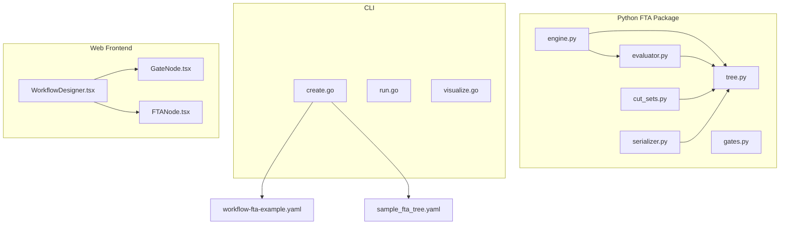

**Diagram sources**
- [engine.py:14-83](file://python/src/resolvenet/fta/engine.py#L14-L83)
- [tree.py:30-120](file://python/src/resolvenet/fta/tree.py#L30-L120)
- [evaluator.py:13-74](file://python/src/resolvenet/fta/evaluator.py#L13-L74)
- [gates.py:6-29](file://python/src/resolvenet/fta/gates.py#L6-L29)
- [cut_sets.py:8-49](file://python/src/resolvenet/fta/cut_sets.py#L8-L49)
- [serializer.py:12-113](file://python/src/resolvenet/fta/serializer.py#L12-L113)
- [create.go:26-45](file://internal/cli/workflow/create.go#L26-L45)
- [run.go:9-22](file://internal/cli/workflow/run.go#L9-L22)
- [visualize.go:9-27](file://internal/cli/workflow/visualize.go#L9-L27)
- [WorkflowDesigner.tsx:3-25](file://web/src/pages/Workflows/WorkflowDesigner.tsx#L3-L25)
- [GateNode.tsx:11-27](file://web/src/components/TreeEditor/GateNode.tsx#L11-L27)
- [FTANode.tsx:11-37](file://web/src/components/TreeEditor/FTANode.tsx#L11-L37)
- [workflow-fta-example.yaml:1-50](file://configs/examples/workflow-fta-example.yaml#L1-L50)
- [sample_fta_tree.yaml:1-23](file://python/tests/fixtures/sample_fta_tree.yaml#L1-L23)

**Section sources**
- [engine.py:14-83](file://python/src/resolvenet/fta/engine.py#L14-L83)
- [tree.py:30-120](file://python/src/resolvenet/fta/tree.py#L30-L120)
- [serializer.py:12-113](file://python/src/resolvenet/fta/serializer.py#L12-L113)
- [fta-engine.md:1-19](file://docs/architecture/fta-engine.md#L1-L19)
- [WorkflowDesigner.tsx:3-25](file://web/src/pages/Workflows/WorkflowDesigner.tsx#L3-L25)

## Core Components
- FaultTree: Holds the tree metadata and collections of events and gates. Provides helpers to retrieve basic events, gates in bottom-up order, and input values for gates.
- FTAEvent: Represents an event node with type (top, intermediate, basic, undeveloped, conditioning), evaluator specification, parameters, and computed value.
- FTAGate: Represents a logical gate with type (AND, OR, VOTING, INHIBIT, PRIORITY_AND), input/output IDs, and optional k-value for voting gates.
- FTAEngine: Orchestrates execution by yielding progress events, evaluating leaf events via NodeEvaluator, and propagating results through gates bottom-up.
- NodeEvaluator: Evaluates basic events using skills, RAG, or LLM based on the evaluator string prefix; defaults to True for unknown types.
- Gate logic: Standalone functions for AND, OR, VOTING, INHIBIT, and PRIORITY_AND gates.
- CutSet computation: Placeholder minimal cut set computation and human-readable explanations.
- Serialization: YAML loader/dumper for FaultTree definitions.

**Section sources**
- [tree.py:30-120](file://python/src/resolvenet/fta/tree.py#L30-L120)
- [engine.py:14-83](file://python/src/resolvenet/fta/engine.py#L14-L83)
- [evaluator.py:13-74](file://python/src/resolvenet/fta/evaluator.py#L13-L74)
- [gates.py:6-29](file://python/src/resolvenet/fta/gates.py#L6-L29)
- [cut_sets.py:8-49](file://python/src/resolvenet/fta/cut_sets.py#L8-L49)
- [serializer.py:12-113](file://python/src/resolvenet/fta/serializer.py#L12-L113)

## Architecture Overview
The FTA engine follows a streaming execution model that yields structured progress events. The process:
- Loads a FaultTree from YAML or dict
- Identifies basic events and evaluates them using skills, RAG, or LLM
- Propagates results bottom-up through gates
- Produces a final top-event result and completion event

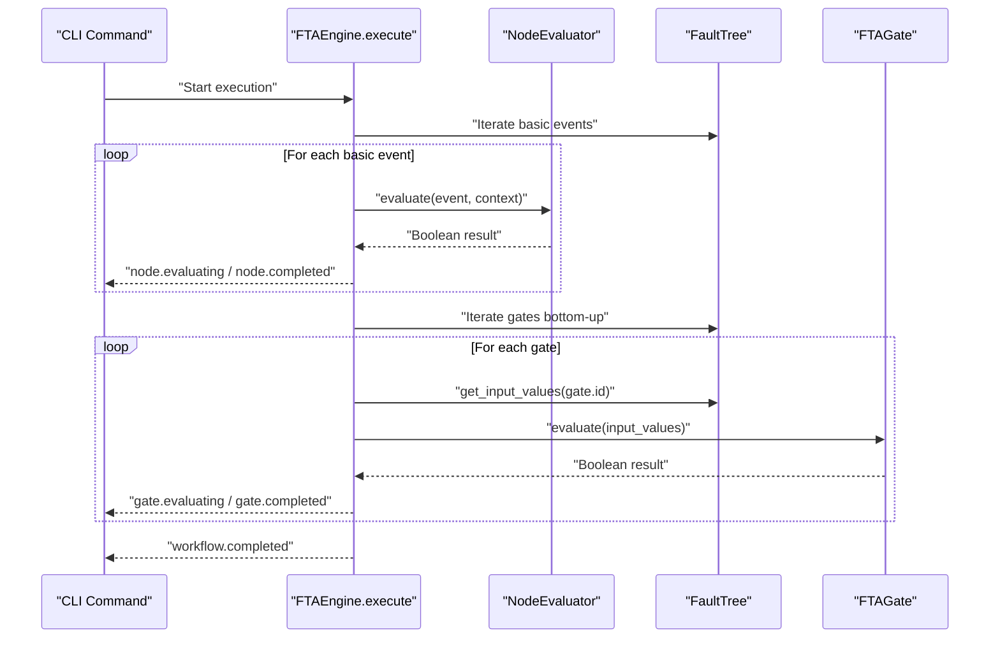

**Diagram sources**
- [engine.py:24-83](file://python/src/resolvenet/fta/engine.py#L24-L83)
- [evaluator.py:23-74](file://python/src/resolvenet/fta/evaluator.py#L23-L74)
- [tree.py:103-120](file://python/src/resolvenet/fta/tree.py#L103-L120)
- [tree.py:54-78](file://python/src/resolvenet/fta/tree.py#L54-L78)

## Detailed Component Analysis

### Fault Tree Construction and Representation
- Event types: Top, Intermediate, Basic, Undeveloped, Conditioning.
- Gate types: AND, OR, VOTING (with k-of-n), INHIBIT, PRIORITY_AND.
- Bottom-up traversal: Gates are visited in reverse order; a future enhancement suggests topological sorting for correctness.
- Input resolution: For each gate, the engine fetches the boolean values of its input events.

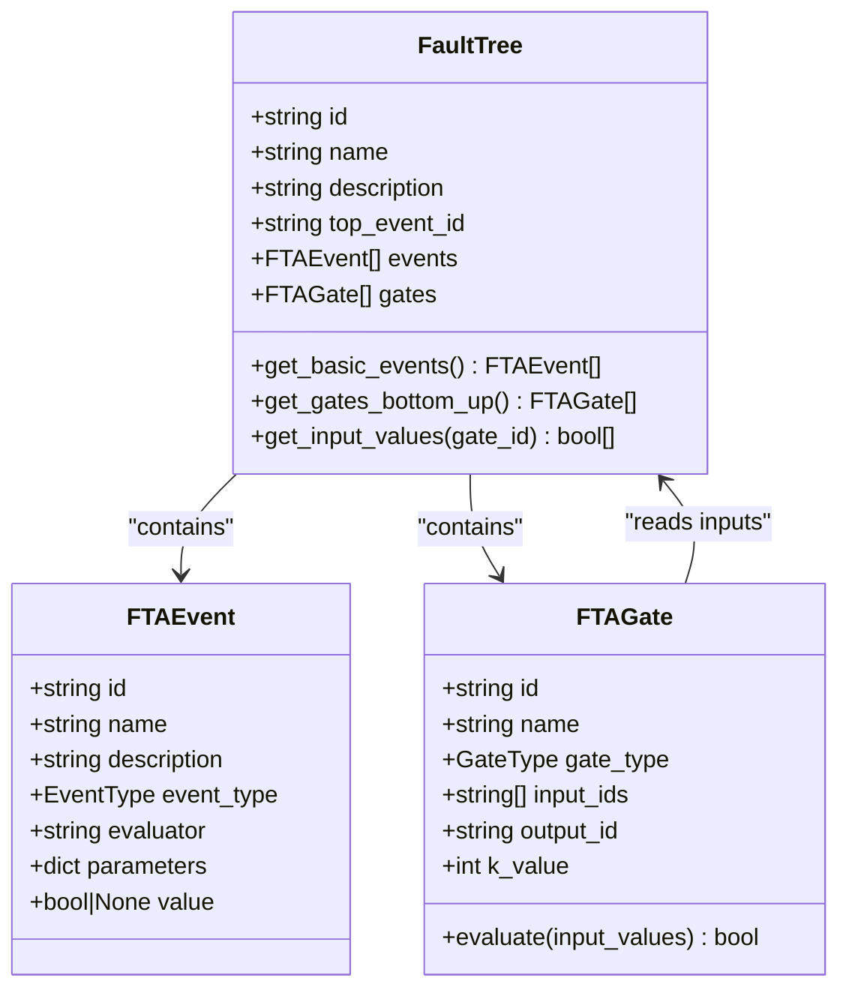

**Diagram sources**
- [tree.py:81-120](file://python/src/resolvenet/fta/tree.py#L81-L120)
- [tree.py:30-80](file://python/src/resolvenet/fta/tree.py#L30-L80)

**Section sources**
- [tree.py:10-28](file://python/src/resolvenet/fta/tree.py#L10-L28)
- [tree.py:81-120](file://python/src/resolvenet/fta/tree.py#L81-L120)

### Gate Types and Evaluation Logic
- AND gate: True if all inputs are True.
- OR gate: True if any input is True.
- VOTING gate: True if at least k inputs are True.
- INHIBIT gate: Implemented as AND; intended to model inhibition with conditioning.
- PRIORITY_AND gate: Implemented as AND; intended to model ordered dependencies.

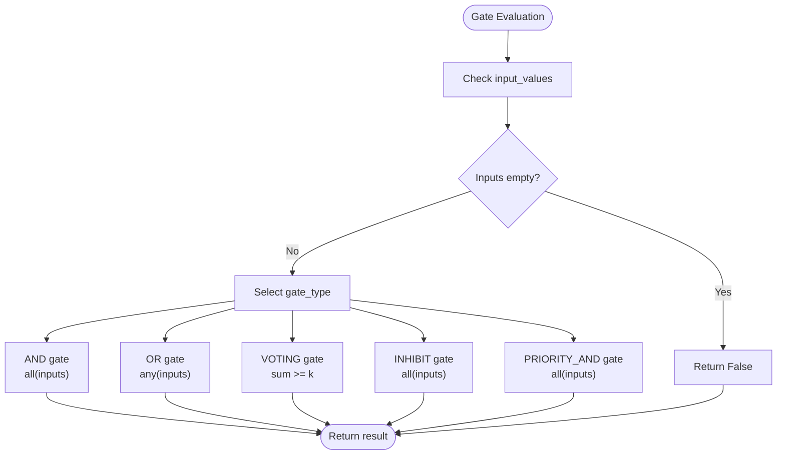

**Diagram sources**
- [tree.py:54-78](file://python/src/resolvenet/fta/tree.py#L54-L78)
- [gates.py:6-29](file://python/src/resolvenet/fta/gates.py#L6-L29)

**Section sources**
- [tree.py:54-78](file://python/src/resolvenet/fta/tree.py#L54-L78)
- [gates.py:6-29](file://python/src/resolvenet/fta/gates.py#L6-L29)

### Event Evaluation Strategies
Leaf events are evaluated using a strategy indicated by the evaluator string:
- skill:<name>: Evaluate via a skill executor.
- rag:<collection_id>: Evaluate via RAG retrieval.
- llm:<model_hint>: Evaluate via an LLM call.
- Unknown/default: Returns True.

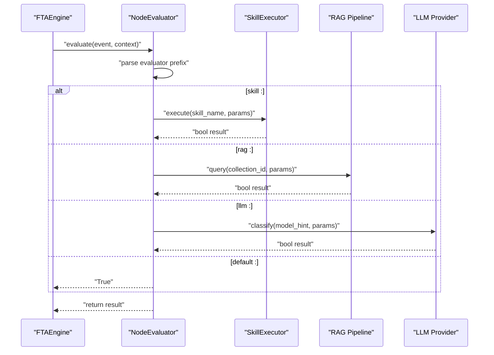

**Diagram sources**
- [evaluator.py:23-74](file://python/src/resolvenet/fta/evaluator.py#L23-L74)

**Section sources**
- [evaluator.py:13-74](file://python/src/resolvenet/fta/evaluator.py#L13-L74)

### Cut Set Analysis
Minimal cut sets represent the smallest combinations of basic events that lead to the top event. The current implementation returns a placeholder containing all basic events. Human-readable explanations are generated by joining event names per cut set.

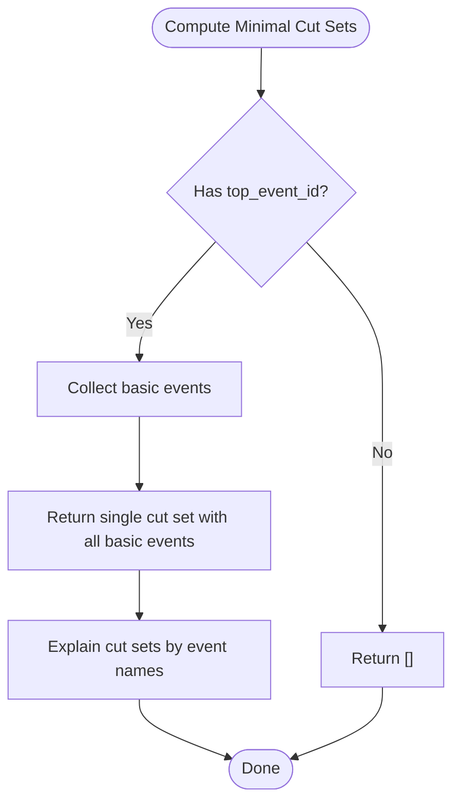

**Diagram sources**
- [cut_sets.py:8-49](file://python/src/resolvenet/fta/cut_sets.py#L8-L49)
- [tree.py:92-94](file://python/src/resolvenet/fta/tree.py#L92-L94)

**Section sources**
- [cut_sets.py:8-49](file://python/src/resolvenet/fta/cut_sets.py#L8-L49)

### Execution Progress Tracking and Visualization
- Streaming events: The engine yields structured events for workflow started/completed, node evaluating/completed, and gate evaluating/completed.
- Frontend visualization: React components render FTA nodes and gates with status and type styling, and a designer page indicates drag-and-drop editing with a graph library.

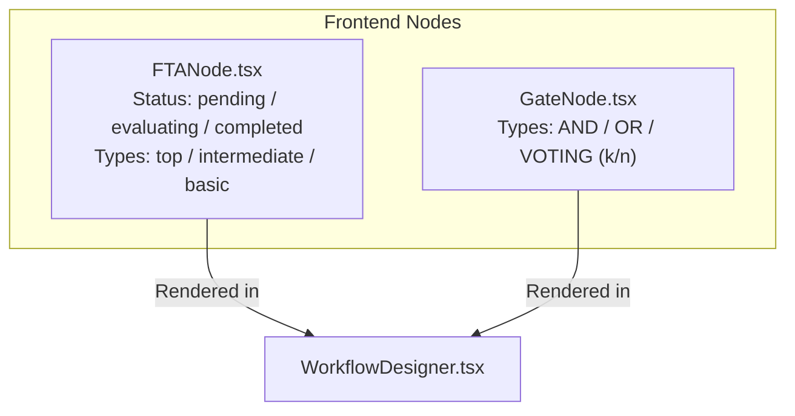

**Diagram sources**
- [FTANode.tsx:11-37](file://web/src/components/TreeEditor/FTANode.tsx#L11-L37)
- [GateNode.tsx:11-27](file://web/src/components/TreeEditor/GateNode.tsx#L11-L27)
- [WorkflowDesigner.tsx:3-25](file://web/src/pages/Workflows/WorkflowDesigner.tsx#L3-L25)

**Section sources**
- [engine.py:40-82](file://python/src/resolvenet/fta/engine.py#L40-L82)
- [FTANode.tsx:11-37](file://web/src/components/TreeEditor/FTANode.tsx#L11-L37)
- [GateNode.tsx:11-27](file://web/src/components/TreeEditor/GateNode.tsx#L11-L27)
- [WorkflowDesigner.tsx:3-25](file://web/src/pages/Workflows/WorkflowDesigner.tsx#L3-L25)

### Serialization System
- Load from YAML: Reads a YAML file and converts it to a FaultTree.
- Load from dict: Converts a dictionary representation to a FaultTree.
- Dump to YAML: Serializes a FaultTree to a YAML string suitable for storage or exchange.

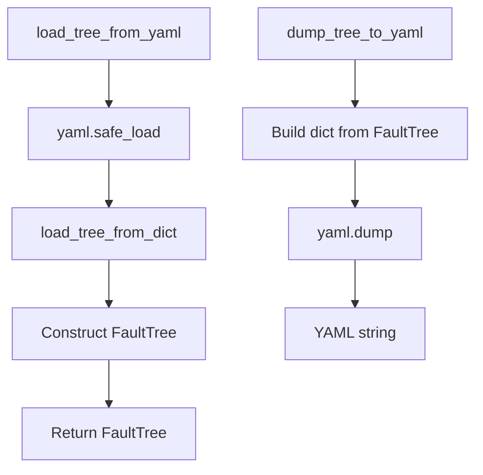

**Diagram sources**
- [serializer.py:12-113](file://python/src/resolvenet/fta/serializer.py#L12-L113)

**Section sources**
- [serializer.py:12-113](file://python/src/resolvenet/fta/serializer.py#L12-L113)

### Examples of FTA Workflow Design
- Example configuration demonstrates a top-level event, intermediate event, and three basic events evaluated via skills and RAG, feeding an OR gate that drives the top event.
- Sample fixture shows a minimal tree with two basic events and an OR gate leading to a top event.

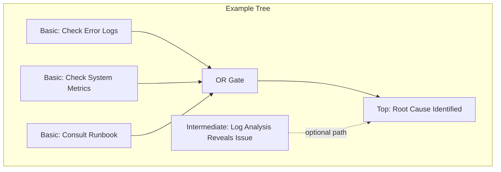

**Diagram sources**
- [workflow-fta-example.yaml:1-50](file://configs/examples/workflow-fta-example.yaml#L1-L50)
- [sample_fta_tree.yaml:1-23](file://python/tests/fixtures/sample_fta_tree.yaml#L1-L23)

**Section sources**
- [workflow-fta-example.yaml:1-50](file://configs/examples/workflow-fta-example.yaml#L1-L50)
- [sample_fta_tree.yaml:1-23](file://python/tests/fixtures/sample_fta_tree.yaml#L1-L23)

## Dependency Analysis
The engine composes several modules with clear responsibilities:
- FTAEngine depends on FaultTree and NodeEvaluator.
- NodeEvaluator depends on FTAEvent and external integrations (skills, RAG, LLM).
- FaultTree encapsulates data and provides traversal helpers.
- CutSet computation depends on FaultTree structure.
- Serialization depends on FaultTree and YAML.

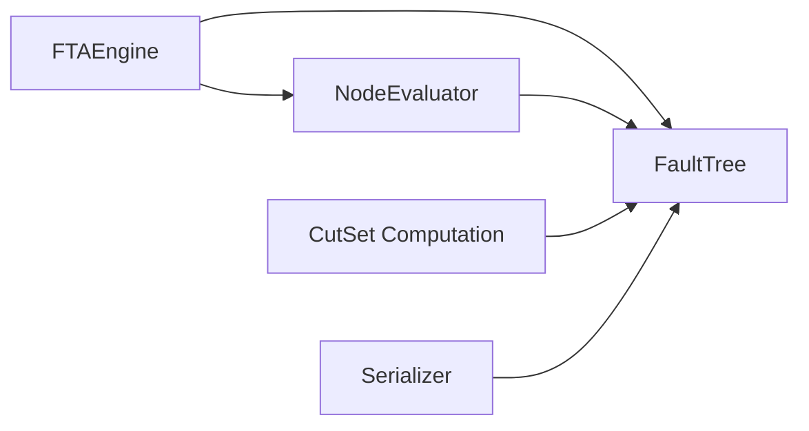

**Diagram sources**
- [engine.py:14-83](file://python/src/resolvenet/fta/engine.py#L14-L83)
- [evaluator.py:13-74](file://python/src/resolvenet/fta/evaluator.py#L13-L74)
- [cut_sets.py:8-49](file://python/src/resolvenet/fta/cut_sets.py#L8-L49)
- [serializer.py:12-113](file://python/src/resolvenet/fta/serializer.py#L12-L113)
- [tree.py:81-120](file://python/src/resolvenet/fta/tree.py#L81-L120)

**Section sources**
- [engine.py:14-83](file://python/src/resolvenet/fta/engine.py#L14-L83)
- [evaluator.py:13-74](file://python/src/resolvenet/fta/evaluator.py#L13-L74)
- [cut_sets.py:8-49](file://python/src/resolvenet/fta/cut_sets.py#L8-L49)
- [serializer.py:12-113](file://python/src/resolvenet/fta/serializer.py#L12-L113)
- [tree.py:81-120](file://python/src/resolvenet/fta/tree.py#L81-L120)

## Performance Considerations
- Bottom-up traversal: The current traversal iterates gates in reverse order; consider implementing topological sorting for correctness and predictable performance on large trees.
- Asynchronous evaluation: NodeEvaluator uses async methods; ensure upstream skill/RAG/LLM calls are non-blocking to maintain throughput.
- Gate evaluation: Keep gate logic constant-time; avoid expensive preprocessing per evaluation.
- Cut set computation: Placeholder returns a single large cut set; replace with efficient algorithms (e.g., MOCUS or Binary Decision Diagrams) for scalability.
- Memory footprint: Avoid retaining intermediate results unnecessarily; stream progress events and release references promptly.

[No sources needed since this section provides general guidance]

## Troubleshooting Guide
Common modeling and execution issues:
- Missing top_event_id: Cut set computation returns empty; ensure the FaultTree defines a top-level event ID.
- Unknown evaluator type: Default behavior returns True; verify evaluator prefixes (skill:, rag:, llm:).
- Empty input lists: Gates default to False when no inputs are resolved; confirm event values are set before gate evaluation.
- Gate ordering: Bottom-up traversal relies on gate order; ensure gates are defined after their inputs.
- Frontend rendering: Status and type indicators help visualize execution; verify node and gate props match expected values.

**Section sources**
- [cut_sets.py:20-26](file://python/src/resolvenet/fta/cut_sets.py#L20-L26)
- [evaluator.py:46-49](file://python/src/resolvenet/fta/evaluator.py#L46-L49)
- [tree.py:63-64](file://python/src/resolvenet/fta/tree.py#L63-L64)
- [tree.py:103-106](file://python/src/resolvenet/fta/tree.py#L103-L106)
- [FTANode.tsx:11-37](file://web/src/components/TreeEditor/FTANode.tsx#L11-L37)
- [GateNode.tsx:11-27](file://web/src/components/TreeEditor/GateNode.tsx#L11-L27)

## Conclusion
The FTA Workflow Engine provides a modular foundation for building, evaluating, and analyzing fault trees. It supports flexible leaf evaluation strategies, extensible gate logic, and a streaming execution model with progress reporting. Serialization enables persistence and exchange, while the frontend offers visualization scaffolding. Future enhancements should focus on robust traversal ordering, scalable cut set computation, and improved integration with skills, RAG, and LLM providers.

[No sources needed since this section summarizes without analyzing specific files]

## Appendices

### CLI Commands for FTA Workflows
- Create: Creates an FTA workflow from a YAML definition file.
- Run: Executes a workflow by ID (streaming execution to be implemented).
- Visualize: Renders a tree visualization in the terminal (ASCII-style example provided).

**Section sources**
- [create.go:26-45](file://internal/cli/workflow/create.go#L26-L45)
- [run.go:9-22](file://internal/cli/workflow/run.go#L9-L22)
- [visualize.go:9-27](file://internal/cli/workflow/visualize.go#L9-L27)

### Conceptual Overview
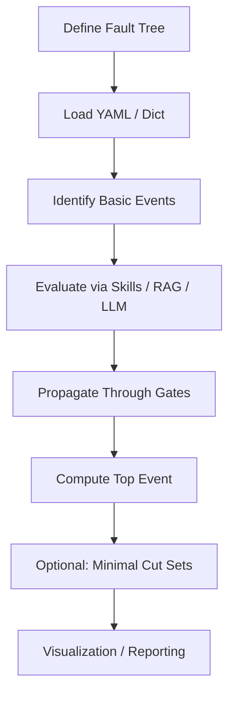

[No sources needed since this diagram shows conceptual workflow, not actual code structure]