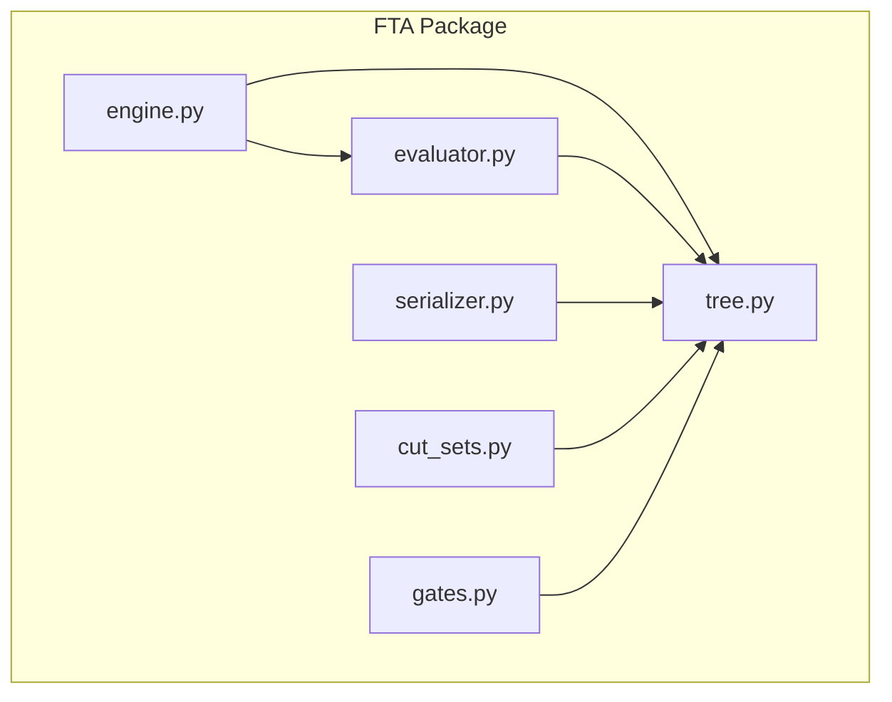
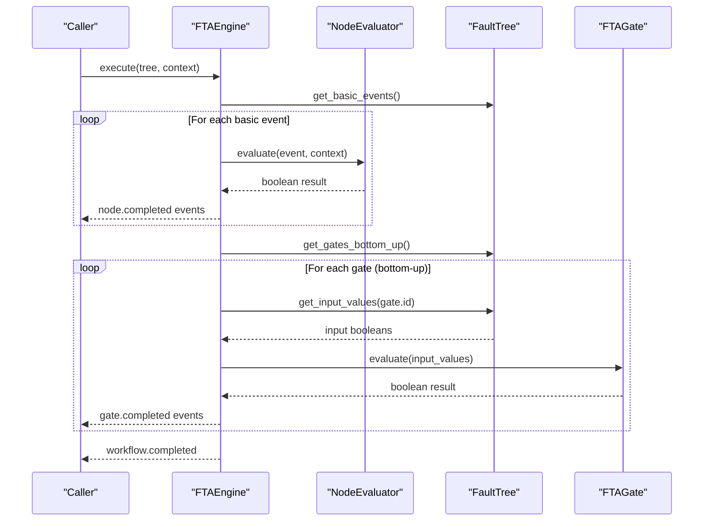
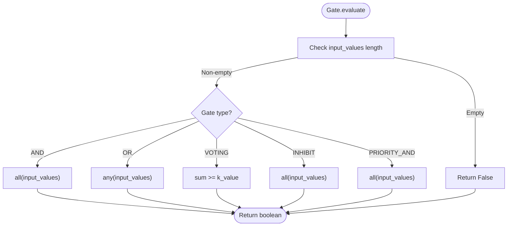
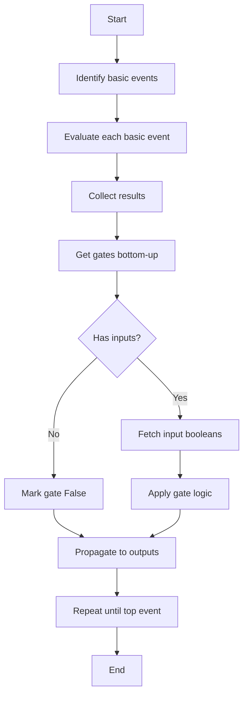
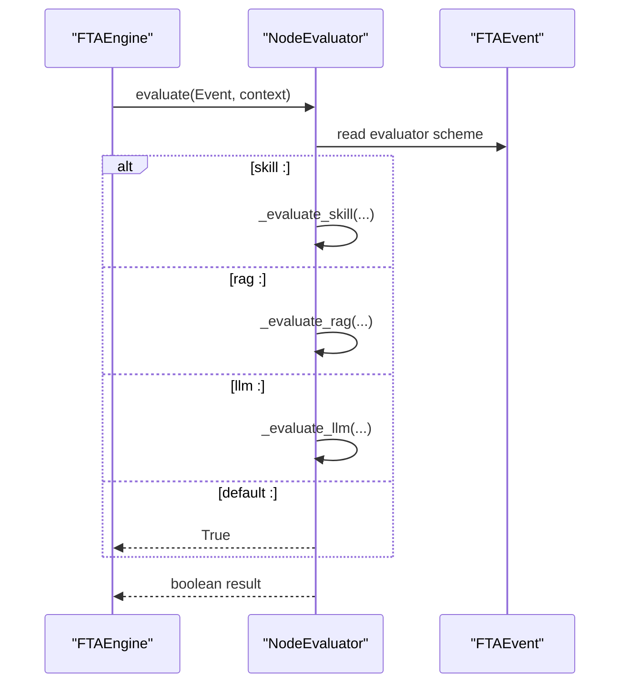
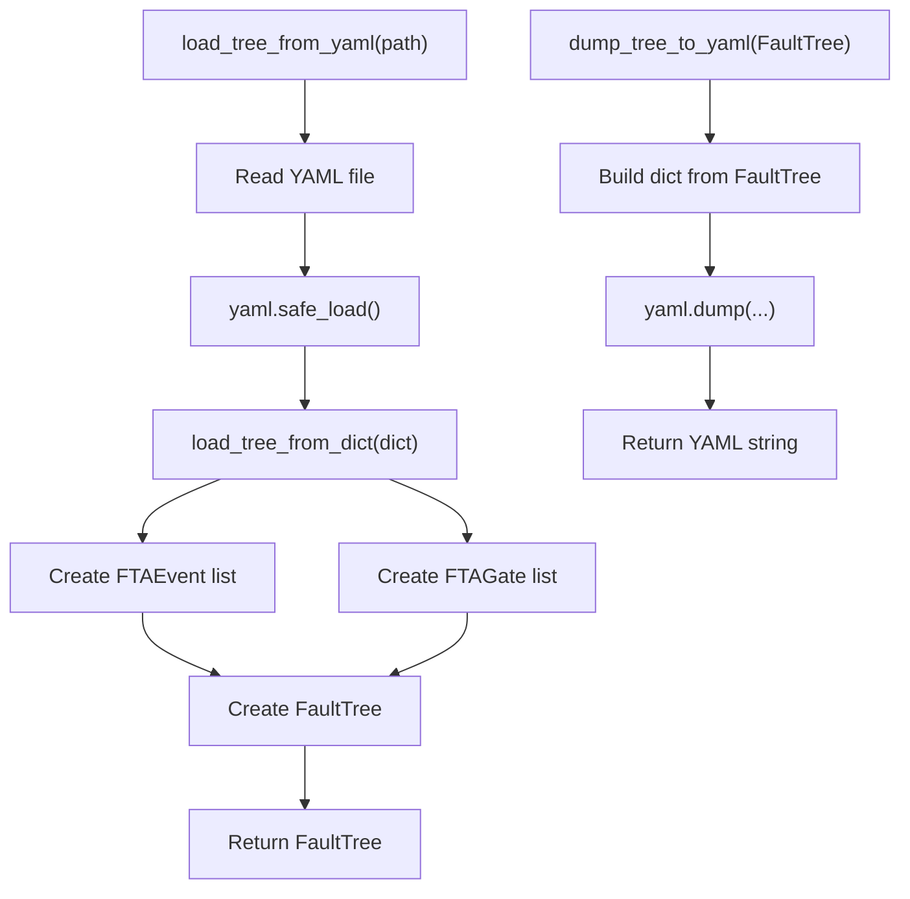
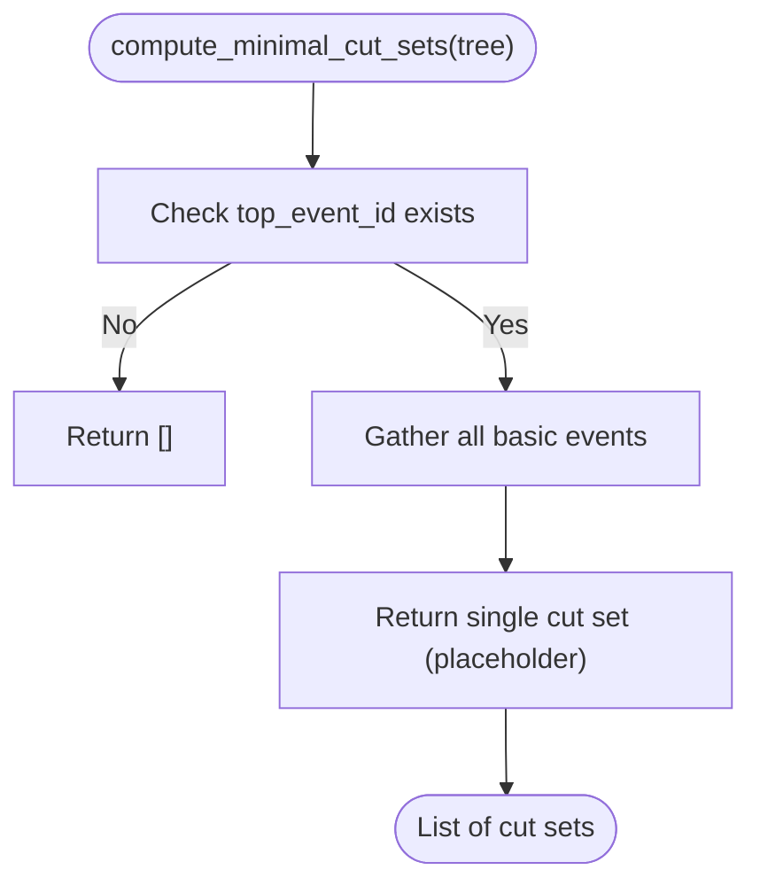
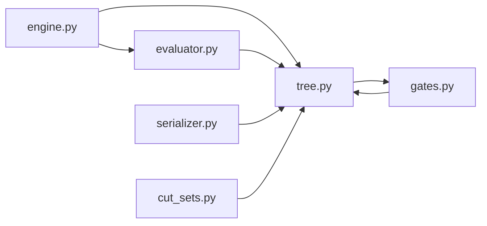

# Fault Tree Structure and Representation

<cite>
**Referenced Files in This Document**
- [tree.py](file://python/src/resolvenet/fta/tree.py)
- [gates.py](file://python/src/resolvenet/fta/gates.py)
- [engine.py](file://python/src/resolvenet/fta/engine.py)
- [evaluator.py](file://python/src/resolvenet/fta/evaluator.py)
- [serializer.py](file://python/src/resolvenet/fta/serializer.py)
- [cut_sets.py](file://python/src/resolvenet/fta/cut_sets.py)
- [sample_fta_tree.yaml](file://python/tests/fixtures/sample_fta_tree.yaml)
- [workflow-fta-example.yaml](file://configs/examples/workflow-fta-example.yaml)
- [fta-engine.md](file://docs/architecture/fta-engine.md)
- [test_fta_engine.py](file://python/tests/unit/test_fta_engine.py)
- [conftest.py](file://python/tests/conftest.py)
</cite>

## Table of Contents
1. [Introduction](#introduction)
2. [Project Structure](#project-structure)
3. [Core Components](#core-components)
4. [Architecture Overview](#architecture-overview)
5. [Detailed Component Analysis](#detailed-component-analysis)
6. [Dependency Analysis](#dependency-analysis)
7. [Performance Considerations](#performance-considerations)
8. [Troubleshooting Guide](#troubleshooting-guide)
9. [Conclusion](#conclusion)
10. [Appendices](#appendices)

## Introduction
This document describes the fault tree structure and representation used in the system. It covers the data model for events and gates, traversal algorithms for evaluation, serialization formats, explainability via minimal cut sets, and practical guidance for building, validating, and operating fault trees. The implementation focuses on a directed acyclic graph (DAG) of events connected by logical gates, with support for basic events evaluated by external systems and intermediate/top-level events forming the analysis target.

## Project Structure
The fault tree functionality is implemented in the Python package under python/src/resolvenet/fta. Key modules include the data model (events and gates), evaluation engine, gate logic helpers, serialization utilities, and cut-set computation for explainability. Example configurations demonstrate YAML-based tree definitions.

**Diagram sources**
- [tree.py:1-120](file://python/src/resolvenet/fta/tree.py#L1-L120)
- [gates.py:1-29](file://python/src/resolvenet/fta/gates.py#L1-L29)
- [engine.py:1-83](file://python/src/resolvenet/fta/engine.py#L1-L83)
- [evaluator.py:1-74](file://python/src/resolvenet/fta/evaluator.py#L1-L74)
- [serializer.py:1-113](file://python/src/resolvenet/fta/serializer.py#L1-L113)
- [cut_sets.py:1-49](file://python/src/resolvenet/fta/cut_sets.py#L1-L49)

**Section sources**
- [tree.py:1-120](file://python/src/resolvenet/fta/tree.py#L1-L120)
- [gates.py:1-29](file://python/src/resolvenet/fta/gates.py#L1-L29)
- [engine.py:1-83](file://python/src/resolvenet/fta/engine.py#L1-L83)
- [evaluator.py:1-74](file://python/src/resolvenet/fta/evaluator.py#L1-L74)
- [serializer.py:1-113](file://python/src/resolvenet/fta/serializer.py#L1-L113)
- [cut_sets.py:1-49](file://python/src/resolvenet/fta/cut_sets.py#L1-L49)

## Core Components
- Event types: Top, Intermediate, Basic, Undeveloped, Conditioning.
- Gate types: AND, OR, VOTING (k-of-n), INHIBIT, PRIORITY_AND.
- FaultTree: Container holding tree metadata, events, and gates.
- NodeEvaluator: Evaluates basic events using skill, RAG, or LLM targets.
- FTAEngine: Orchestrates bottom-up evaluation of gates after basic events are assessed.
- Serializer: Loads from and dumps to YAML/JSON-like dictionaries.
- Cut sets: Computes minimal cut sets and generates explanations.

**Section sources**
- [tree.py:10-120](file://python/src/resolvenet/fta/tree.py#L10-L120)
- [gates.py:6-29](file://python/src/resolvenet/fta/gates.py#L6-L29)
- [engine.py:14-83](file://python/src/resolvenet/fta/engine.py#L14-L83)
- [evaluator.py:13-74](file://python/src/resolvenet/fta/evaluator.py#L13-L74)
- [serializer.py:12-113](file://python/src/resolvenet/fta/serializer.py#L12-L113)
- [cut_sets.py:8-49](file://python/src/resolvenet/fta/cut_sets.py#L8-L49)

## Architecture Overview
The system evaluates a fault tree by first assessing basic events (leaf nodes) and then propagating results bottom-up through gates until reaching the top event. Serialization supports loading and saving tree definitions in YAML format.

**Diagram sources**
- [engine.py:24-83](file://python/src/resolvenet/fta/engine.py#L24-L83)
- [evaluator.py:23-74](file://python/src/resolvenet/fta/evaluator.py#L23-L74)
- [tree.py:96-120](file://python/src/resolvenet/fta/tree.py#L96-L120)
- [gates.py:6-29](file://python/src/resolvenet/fta/gates.py#L6-L29)

## Detailed Component Analysis

### Data Model: Events, Gates, and Trees
The data model defines three primary constructs:
- EventType: enumeration of supported event categories.
- GateType: enumeration of logical operators.
- FTAEvent: leaf/basic nodes with identifiers, names, descriptions, type, evaluator target, parameters, and computed value.
- FTAGate: logical connectors with inputs, output, type, and optional k-value for voting gates.
- FaultTree: container with metadata and lists of events and gates.

```mermaid
classDiagram
class EventType {
<<enum>>
+TOP
+INTERMEDIATE
+BASIC
+UNDEVELOPED
+CONDITIONING
}
class GateType {
<<enum>>
+AND
+OR
+VOTING
+INHIBIT
+PRIORITY_AND
}
class FTAEvent {
+string id
+string name
+string description
+EventType event_type
+string evaluator
+map~string,any~ parameters
+bool|None value
}
class FTAGate {
+string id
+string name
+GateType gate_type
+string[] input_ids
+string output_id
+int k_value
+evaluate(input_values) bool
}
class FaultTree {
+string id
+string name
+string description
+string top_event_id
+FTAEvent[] events
+FTAGate[] gates
+get_basic_events() FTAEvent[]
+get_event(id) FTAEvent|None
+get_gates_bottom_up() FTAGate[]
+get_input_values(gate_id) bool[]
}
FaultTree --> FTAEvent : "contains"
FaultTree --> FTAGate : "contains"
FTAGate --> GateType : "uses"
FTAEvent --> EventType : "uses"
```

**Diagram sources**
- [tree.py:10-120](file://python/src/resolvenet/fta/tree.py#L10-L120)

**Section sources**
- [tree.py:10-120](file://python/src/resolvenet/fta/tree.py#L10-L120)

### Gate Logic Implementation
Gate logic is implemented both as a method on FTAGate and as standalone functions for reuse. Supported behaviors:
- AND: all inputs true.
- OR: any input true.
- VOTING (k-of-n): at least k inputs true.
- INHIBIT: treated as AND with conditioning semantics.
- PRIORITY_AND: ordered AND semantics.

**Diagram sources**
- [tree.py:54-78](file://python/src/resolvenet/fta/tree.py#L54-L78)
- [gates.py:6-29](file://python/src/resolvenet/fta/gates.py#L6-L29)

**Section sources**
- [tree.py:54-78](file://python/src/resolvenet/fta/tree.py#L54-L78)
- [gates.py:6-29](file://python/src/resolvenet/fta/gates.py#L6-L29)

### Tree Traversal and Evaluation Order
- Basic events are identified and evaluated first.
- Gates are evaluated in a bottom-up order; the current implementation returns a reversed gate list as a placeholder for topological sorting.
- Input values for gates are collected from the tree’s events.

**Diagram sources**
- [engine.py:24-83](file://python/src/resolvenet/fta/engine.py#L24-L83)
- [tree.py:96-120](file://python/src/resolvenet/fta/tree.py#L96-L120)

**Section sources**
- [engine.py:24-83](file://python/src/resolvenet/fta/engine.py#L24-L83)
- [tree.py:96-120](file://python/src/resolvenet/fta/tree.py#L96-L120)

### Node Evaluation Mechanism
Basic events are evaluated using a target scheme:
- skill:<target>: invoke a skill-based evaluator.
- rag:<collection_id>: query a retrieval system.
- llm:<model_hint>: classify or evaluate via LLM.
- Unknown or empty: defaults to True.

**Diagram sources**
- [evaluator.py:23-74](file://python/src/resolvenet/fta/evaluator.py#L23-L74)
- [engine.py:53-60](file://python/src/resolvenet/fta/engine.py#L53-L60)

**Section sources**
- [evaluator.py:13-74](file://python/src/resolvenet/fta/evaluator.py#L13-L74)
- [engine.py:24-83](file://python/src/resolvenet/fta/engine.py#L24-L83)

### Serialization System (YAML and Dictionary)
Trees can be loaded from YAML files or dictionaries and dumped back to YAML strings. The serializer maps tree metadata, events, and gates into a structured dictionary and vice versa.

**Diagram sources**
- [serializer.py:12-113](file://python/src/resolvenet/fta/serializer.py#L12-L113)

**Section sources**
- [serializer.py:12-113](file://python/src/resolvenet/fta/serializer.py#L12-L113)
- [sample_fta_tree.yaml:1-23](file://python/tests/fixtures/sample_fta_tree.yaml#L1-L23)
- [workflow-fta-example.yaml:1-50](file://configs/examples/workflow-fta-example.yaml#L1-L50)

### Tree Validation and Integrity Checks
Current validation is minimal:
- Basic event discovery and retrieval helpers are present.
- Gate evaluation handles empty inputs by returning False.
- YAML loader accepts optional fields and infers defaults.

Recommended validations to implement:
- Presence of a single top event.
- Acyclicity and DAG structure enforcement.
- Consistent IDs linking gates’ inputs/outputs to existing events.
- Non-empty input lists for gates (except trivial cases).
- Correct evaluator scheme parsing and target existence.

**Section sources**
- [tree.py:92-120](file://python/src/resolvenet/fta/tree.py#L92-L120)
- [serializer.py:26-70](file://python/src/resolvenet/fta/serializer.py#L26-L70)

### Explainability: Minimal Cut Sets
Minimal cut sets represent the smallest combinations of basic events that lead to the top event. The current implementation provides a placeholder that returns a single cut set containing all basic events. A production implementation would compute true minimal cut sets (e.g., using MOCUS or Binary Decision Diagrams).

**Diagram sources**
- [cut_sets.py:8-27](file://python/src/resolvenet/fta/cut_sets.py#L8-L27)

**Section sources**
- [cut_sets.py:8-49](file://python/src/resolvenet/fta/cut_sets.py#L8-L49)

### Examples: Construction, Manipulation, and Transformation
- Constructing a FaultTree programmatically is demonstrated in test fixtures.
- Loading from YAML is shown in the test fixture and configuration example.
- Transformations can include adding/removing events/gates, changing evaluator targets, and adjusting gate logic.

Practical example references:
- Programmatic construction: [conftest.py:8-43](file://python/tests/conftest.py#L8-L43)
- YAML fixture: [sample_fta_tree.yaml:1-23](file://python/tests/fixtures/sample_fta_tree.yaml#L1-L23)
- Extended YAML example: [workflow-fta-example.yaml:1-50](file://configs/examples/workflow-fta-example.yaml#L1-L50)
- Gate logic tests: [test_fta_engine.py:7-25](file://python/tests/unit/test_fta_engine.py#L7-L25)

**Section sources**
- [conftest.py:8-43](file://python/tests/conftest.py#L8-L43)
- [sample_fta_tree.yaml:1-23](file://python/tests/fixtures/sample_fta_tree.yaml#L1-L23)
- [workflow-fta-example.yaml:1-50](file://configs/examples/workflow-fta-example.yaml#L1-L50)
- [test_fta_engine.py:1-39](file://python/tests/unit/test_fta_engine.py#L1-L39)

## Dependency Analysis
The modules exhibit clear separation of concerns:
- engine depends on tree and evaluator.
- evaluator depends on tree for event metadata.
- serializer depends on tree for conversion.
- gates provides reusable logic used by FTAGate.evaluate.

**Diagram sources**
- [engine.py:8-9](file://python/src/resolvenet/fta/engine.py#L8-L9)
- [evaluator.py:8-8](file://python/src/resolvenet/fta/evaluator.py#L8-L8)
- [serializer.py:9-9](file://python/src/resolvenet/fta/serializer.py#L9-L9)
- [cut_sets.py:5-5](file://python/src/resolvenet/fta/cut_sets.py#L5-L5)
- [gates.py:3-3](file://python/src/resolvenet/fta/gates.py#L3-L3)
- [tree.py:54-78](file://python/src/resolvenet/fta/tree.py#L54-L78)

**Section sources**
- [engine.py:8-9](file://python/src/resolvenet/fta/engine.py#L8-L9)
- [evaluator.py:8-8](file://python/src/resolvenet/fta/evaluator.py#L8-L8)
- [serializer.py:9-9](file://python/src/resolvenet/fta/serializer.py#L9-L9)
- [cut_sets.py:5-5](file://python/src/resolvenet/fta/cut_sets.py#L5-L5)
- [gates.py:3-3](file://python/src/resolvenet/fta/gates.py#L3-L3)
- [tree.py:54-78](file://python/src/resolvenet/fta/tree.py#L54-L78)

## Performance Considerations
- Bottom-up ordering: The current bottom-up gate traversal uses a reversed list; implementing a proper topological sort ensures minimal recomputation and avoids redundant evaluations.
- Input caching: Cache boolean results per event during evaluation to avoid repeated IO-bound evaluations.
- Asynchronous evaluation: NodeEvaluator already uses async; ensure backend evaluators (skills, RAG, LLM) are asynchronous to maximize throughput.
- Memory optimization: Prefer streaming evaluation and incremental updates; avoid materializing large intermediate results.
- Large trees: Partition trees for distributed evaluation; batch basic event evaluations when safe.

[No sources needed since this section provides general guidance]

## Troubleshooting Guide
Common issues and resolutions:
- Missing top event: Ensure top_event_id is set; otherwise minimal cut set computation returns empty.
- Empty gate inputs: Gate.evaluate returns False for empty inputs; verify gate input IDs link to existing events.
- Unknown evaluator type: Defaults to True; confirm evaluator scheme is correct (skill:, rag:, llm:).
- YAML parsing errors: Validate YAML structure against the expected schema (tree, events, gates).
- Incorrect IDs: Verify event IDs referenced by gates exist and match event IDs.

Diagnostic references:
- YAML example structure: [sample_fta_tree.yaml:1-23](file://python/tests/fixtures/sample_fta_tree.yaml#L1-L23)
- Extended example: [workflow-fta-example.yaml:1-50](file://configs/examples/workflow-fta-example.yaml#L1-L50)
- Gate logic tests: [test_fta_engine.py:7-25](file://python/tests/unit/test_fta_engine.py#L7-L25)

**Section sources**
- [sample_fta_tree.yaml:1-23](file://python/tests/fixtures/sample_fta_tree.yaml#L1-L23)
- [workflow-fta-example.yaml:1-50](file://configs/examples/workflow-fta-example.yaml#L1-L50)
- [test_fta_engine.py:1-39](file://python/tests/unit/test_fta_engine.py#L1-L39)
- [tree.py:63-64](file://python/src/resolvenet/fta/tree.py#L63-L64)

## Conclusion
The fault tree module provides a solid foundation for representing and evaluating structured diagnostic workflows. The data model cleanly separates events and gates, the engine orchestrates bottom-up evaluation, and the serializer enables easy persistence. Enhancements such as topological sorting, robust validation, and production-grade minimal cut set computation will further strengthen reliability and scalability for large trees.

[No sources needed since this section summarizes without analyzing specific files]

## Appendices

### A. YAML Schema Reference
- tree: container for tree metadata and components.
  - id, name, description, top_event_id: strings.
  - events: list of event objects with id, name, description, type, evaluator, parameters.
  - gates: list of gate objects with id, name, type, inputs, output, k_value.

References:
- [sample_fta_tree.yaml:1-23](file://python/tests/fixtures/sample_fta_tree.yaml#L1-L23)
- [workflow-fta-example.yaml:1-50](file://configs/examples/workflow-fta-example.yaml#L1-L50)

**Section sources**
- [sample_fta_tree.yaml:1-23](file://python/tests/fixtures/sample_fta_tree.yaml#L1-L23)
- [workflow-fta-example.yaml:1-50](file://configs/examples/workflow-fta-example.yaml#L1-L50)

### B. Event and Gate Type Definitions
- Event types: top, intermediate, basic, undeveloped, conditioning.
- Gate types: and, or, voting, inhibit, priority_and.

References:
- [tree.py:10-28](file://python/src/resolvenet/fta/tree.py#L10-L28)

**Section sources**
- [tree.py:10-28](file://python/src/resolvenet/fta/tree.py#L10-L28)

### C. Evaluation Workflow Overview
- Parse tree definition.
- Identify leaf events.
- Evaluate leaves (may invoke skills/RAG/LLM).
- Propagate through gates bottom-up.
- Compute top event result.

Reference:
- [fta-engine.md:12-18](file://docs/architecture/fta-engine.md#L12-L18)

**Section sources**
- [fta-engine.md:1-19](file://docs/architecture/fta-engine.md#L1-L19)