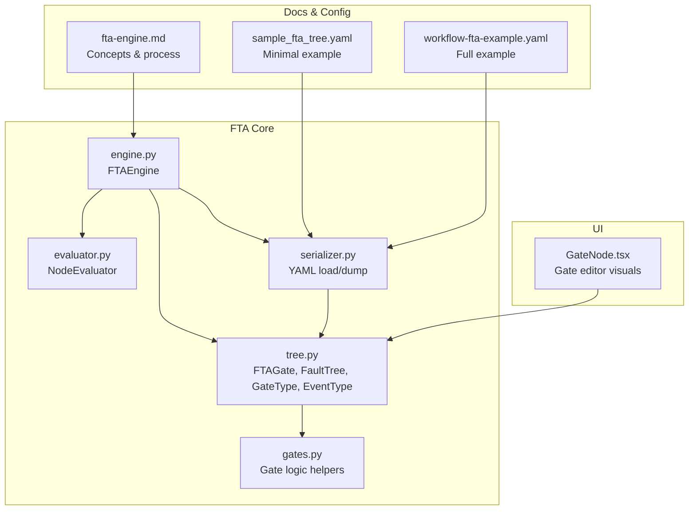
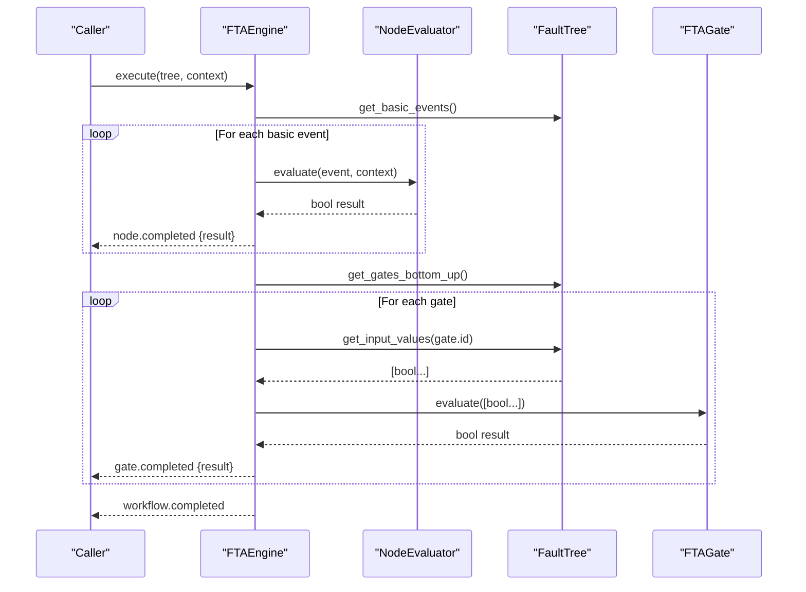
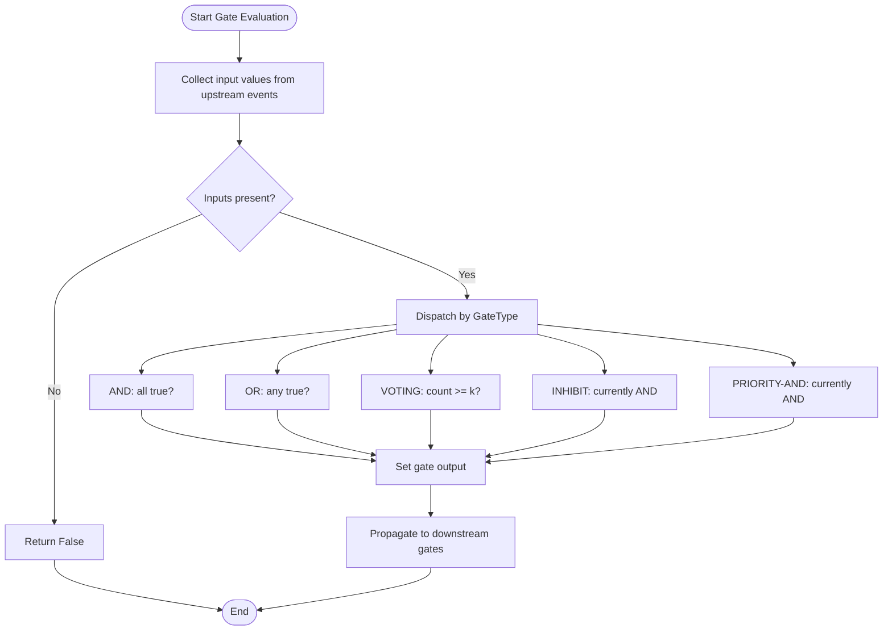
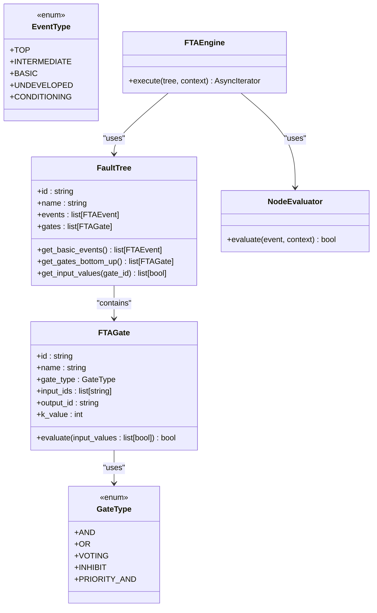

# Gate Types and Evaluation Logic

<cite>
**Referenced Files in This Document**
- [gates.py](file://python/src/resolvenet/fta/gates.py)
- [evaluator.py](file://python/src/resolvenet/fta/evaluator.py)
- [engine.py](file://python/src/resolvenet/fta/engine.py)
- [tree.py](file://python/src/resolvenet/fta/tree.py)
- [serializer.py](file://python/src/resolvenet/fta/serializer.py)
- [fta-engine.md](file://docs/architecture/fta-engine.md)
- [sample_fta_tree.yaml](file://python/tests/fixtures/sample_fta_tree.yaml)
- [workflow-fta-example.yaml](file://configs/examples/workflow-fta-example.yaml)
- [test_fta_engine.py](file://python/tests/unit/test_fta_engine.py)
- [GateNode.tsx](file://web/src/components/TreeEditor/GateNode.tsx)
</cite>

## Table of Contents
1. [Introduction](#introduction)
2. [Project Structure](#project-structure)
3. [Core Components](#core-components)
4. [Architecture Overview](#architecture-overview)
5. [Detailed Component Analysis](#detailed-component-analysis)
6. [Dependency Analysis](#dependency-analysis)
7. [Performance Considerations](#performance-considerations)
8. [Troubleshooting Guide](#troubleshooting-guide)
9. [Conclusion](#conclusion)
10. [Appendices](#appendices)

## Introduction
This document explains the supported fault tree gate types and their evaluation logic in the FTA subsystem. It covers:
- Supported gate types: AND, OR, VOTING (k-of-n), INHIBIT, and PRIORITY-AND
- Truth table semantics and mathematical evaluation
- Input/output relationships and propagation through the tree
- Implementation specifics for gate parameters and conditional logic
- Examples of gate configuration and usage patterns
- Performance characteristics and optimization techniques
- Edge cases and special scenarios
- Troubleshooting guidance for gate logic errors

## Project Structure
The FTA subsystem is implemented in Python under the resolvenet package. Key modules include:
- Gates and evaluation logic
- Tree data structures and gate evaluation
- Engine orchestration and streaming events
- Serialization/deserialization of fault trees
- Example configurations and tests

**Diagram sources**
- [engine.py:14-83](file://python/src/resolvenet/fta/engine.py#L14-L83)
- [tree.py:30-120](file://python/src/resolvenet/fta/tree.py#L30-L120)
- [gates.py:1-29](file://python/src/resolvenet/fta/gates.py#L1-L29)
- [evaluator.py:13-74](file://python/src/resolvenet/fta/evaluator.py#L13-L74)
- [serializer.py:12-113](file://python/src/resolvenet/fta/serializer.py#L12-L113)
- [fta-engine.md:1-19](file://docs/architecture/fta-engine.md#L1-L19)
- [sample_fta_tree.yaml:1-23](file://python/tests/fixtures/sample_fta_tree.yaml#L1-L23)
- [workflow-fta-example.yaml:1-50](file://configs/examples/workflow-fta-example.yaml#L1-L50)
- [GateNode.tsx:1-26](file://web/src/components/TreeEditor/GateNode.tsx#L1-L26)

**Section sources**
- [engine.py:14-83](file://python/src/resolvenet/fta/engine.py#L14-L83)
- [tree.py:30-120](file://python/src/resolvenet/fta/tree.py#L30-L120)
- [gates.py:1-29](file://python/src/resolvenet/fta/gates.py#L1-L29)
- [evaluator.py:13-74](file://python/src/resolvenet/fta/evaluator.py#L13-L74)
- [serializer.py:12-113](file://python/src/resolvenet/fta/serializer.py#L12-L113)
- [fta-engine.md:1-19](file://docs/architecture/fta-engine.md#L1-L19)
- [sample_fta_tree.yaml:1-23](file://python/tests/fixtures/sample_fta_tree.yaml#L1-L23)
- [workflow-fta-example.yaml:1-50](file://configs/examples/workflow-fta-example.yaml#L1-L50)
- [GateNode.tsx:1-26](file://web/src/components/TreeEditor/GateNode.tsx#L1-L26)

## Core Components
- GateType and FTAGate define supported gate types and evaluation logic.
- NodeEvaluator evaluates basic events (skills, RAG, LLM, or static).
- FTAEngine orchestrates traversal, basic event evaluation, and gate propagation.
- Serializer loads and dumps fault trees from YAML, including gate parameters.

Key responsibilities:
- Gate evaluation: bottom-up propagation from basic events to top event.
- Parameter handling: gate-specific parameters (e.g., k-value for VOTING).
- Conditional logic: placeholder for future extensions (INHIBIT/PRIORITY-AND).

**Section sources**
- [tree.py:20-79](file://python/src/resolvenet/fta/tree.py#L20-L79)
- [evaluator.py:13-74](file://python/src/resolvenet/fta/evaluator.py#L13-L74)
- [engine.py:24-83](file://python/src/resolvenet/fta/engine.py#L24-L83)
- [serializer.py:26-70](file://python/src/resolvenet/fta/serializer.py#L26-L70)

## Architecture Overview
The FTA engine executes a fault tree by:
1. Loading the tree from YAML (or dict).
2. Evaluating basic events (leaf nodes) via NodeEvaluator.
3. Propagating results bottom-up through gates using FTAGate.evaluate.
4. Yielding streaming events for observability.

**Diagram sources**
- [engine.py:24-83](file://python/src/resolvenet/fta/engine.py#L24-L83)
- [evaluator.py:23-49](file://python/src/resolvenet/fta/evaluator.py#L23-L49)
- [tree.py:103-119](file://python/src/resolvenet/fta/tree.py#L103-L119)
- [tree.py:54-78](file://python/src/resolvenet/fta/tree.py#L54-L78)

## Detailed Component Analysis

### Gate Types and Evaluation Logic

#### AND Gate
- Purpose: All inputs must be true for the output to be true.
- Mathematical evaluation: logical conjunction over input list.
- Input/output relationship: n inputs → single boolean output.
- Edge cases: empty input list yields false; short-circuit-like behavior via built-in logic.

Truth table (conceptual):
- Inputs all true → output true
- Any false input → output false

Implementation note: Uses built-in reduction over input values.

**Section sources**
- [tree.py:66](file://python/src/resolvenet/fta/tree.py#L66)
- [gates.py:6-8](file://python/src/resolvenet/fta/gates.py#L6-L8)

#### OR Gate
- Purpose: At least one input must be true for the output to be true.
- Mathematical evaluation: logical disjunction over input list.
- Input/output relationship: n inputs → single boolean output.
- Edge cases: empty input list yields false.

Truth table (conceptual):
- Any true input → output true
- All false inputs → output false

Implementation note: Uses built-in reduction over input values.

**Section sources**
- [tree.py:68](file://python/src/resolvenet/fta/tree.py#L68)
- [gates.py:11-13](file://python/src/resolvenet/fta/gates.py#L11-L13)

#### VOTING Gate (k-of-n)
- Purpose: At least k out of n inputs must be true.
- Parameter: k_value (integer threshold).
- Mathematical evaluation: count of true inputs ≥ k.
- Input/output relationship: n inputs with k threshold → single boolean output.
- Edge cases: empty input list yields false; k > n yields false unless overridden by configuration.

Configuration example:
- YAML gate with type "voting", inputs array, output id, and k_value.

**Section sources**
- [tree.py:52](file://python/src/resolvenet/fta/tree.py#L52)
- [tree.py:70](file://python/src/resolvenet/fta/tree.py#L70)
- [serializer.py:56-59](file://python/src/resolvenet/fta/serializer.py#L56-L59)
- [workflow-fta-example.yaml:41-49](file://configs/examples/workflow-fta-example.yaml#L41-L49)

#### INHIBIT Gate
- Purpose: Intended to represent conditional inhibition influenced by a conditioning event.
- Current implementation: Equivalent to AND gate in evaluation logic.
- Future extension: Could incorporate conditioning event semantics when implemented.
- Edge cases: Same as AND gate for current logic.

**Section sources**
- [tree.py:72-74](file://python/src/resolvenet/fta/tree.py#L72-L74)
- [gates.py:21-23](file://python/src/resolvenet/fta/gates.py#L21-L23)

#### PRIORITY-AND Gate
- Purpose: AND gate with order dependency among inputs.
- Current implementation: Equivalent to AND gate in evaluation logic.
- Future extension: Could enforce ordering semantics when implemented.
- Edge cases: Same as AND gate for current logic.

**Section sources**
- [tree.py:75-77](file://python/src/resolvenet/fta/tree.py#L75-L77)
- [gates.py:26-28](file://python/src/resolvenet/fta/gates.py#L26-L28)

### Gate Parameter Handling and Conditional Logic
- Gate parameters are parsed from YAML during deserialization:
  - type: selects GateType variant
  - inputs: list of event ids feeding into the gate
  - output: target event id receiving the gate’s result
  - k_value: threshold for VOTING gates
- Conditional logic placeholders exist in the gate evaluation method for INHIBIT and PRIORITY-AND, awaiting implementation.

**Section sources**
- [serializer.py:50-70](file://python/src/resolvenet/fta/serializer.py#L50-L70)
- [tree.py:54-78](file://python/src/resolvenet/fta/tree.py#L54-L78)

### Input/Output Relationships and Propagation
- Input values are collected from upstream events whose values are known.
- The FaultTree gathers input booleans for a gate by resolving input_ids against evaluated events.
- Gates propagate results bottom-up until reaching the top event.

**Diagram sources**
- [tree.py:108-119](file://python/src/resolvenet/fta/tree.py#L108-L119)
- [tree.py:54-78](file://python/src/resolvenet/fta/tree.py#L54-L78)

**Section sources**
- [tree.py:108-119](file://python/src/resolvenet/fta/tree.py#L108-L119)
- [engine.py:62-77](file://python/src/resolvenet/fta/engine.py#L62-L77)

### Examples of Gate Configuration and Usage Patterns
- Minimal example: OR gate connecting two basic events to a top event.
- Full example: OR gate combining multiple basic events (including skill/RAG evaluators) into a top-level root cause.

Configuration highlights:
- events: define ids, names, types, evaluators, and parameters
- gates: define id, name, type, inputs, output, and k_value for VOTING

**Section sources**
- [sample_fta_tree.yaml:17-23](file://python/tests/fixtures/sample_fta_tree.yaml#L17-L23)
- [workflow-fta-example.yaml:9-50](file://configs/examples/workflow-fta-example.yaml#L9-L50)

### Mathematical Evaluation and Truth Tables
- AND: true only if all inputs are true.
- OR: true if any input is true.
- VOTING(k): true if at least k inputs are true.
- INHIBIT/PRIORITY-AND: currently identical to AND in evaluation.

Truth table references (conceptual):
- AND/OR truth tables are straightforward reductions over inputs.
- VOTING truth table depends on k; for each row, count true inputs and compare to k.

**Section sources**
- [gates.py:6-28](file://python/src/resolvenet/fta/gates.py#L6-L28)
- [tree.py:66-77](file://python/src/resolvenet/fta/tree.py#L66-L77)

## Dependency Analysis
- FTAEngine depends on FaultTree for traversal and input resolution, and on NodeEvaluator for basic event outcomes.
- FaultTree depends on GateType and FTAGate for evaluation semantics.
- Serializer depends on GateType and EventType to parse YAML into typed structures.
- UI component GateNode renders gate types and k-values for visualization.

**Diagram sources**
- [tree.py:20-79](file://python/src/resolvenet/fta/tree.py#L20-L79)
- [engine.py:14-23](file://python/src/resolvenet/fta/engine.py#L14-L23)
- [evaluator.py:13-49](file://python/src/resolvenet/fta/evaluator.py#L13-L49)

**Section sources**
- [tree.py:20-79](file://python/src/resolvenet/fta/tree.py#L20-L79)
- [engine.py:14-23](file://python/src/resolvenet/fta/engine.py#L14-L23)
- [evaluator.py:13-49](file://python/src/resolvenet/fta/evaluator.py#L13-L49)

## Performance Considerations
- Gate evaluation complexity:
  - AND/OR: O(n) per gate where n is the number of inputs.
  - VOTING: O(n) for counting true inputs plus comparison against k.
  - INHIBIT/PRIORITY-AND: O(n) in current implementation.
- Early termination:
  - AND gate: short-circuit-like behavior via reduction; stops when encountering a false input.
  - OR gate: short-circuit-like behavior via reduction; stops when encountering a true input.
- Memory:
  - Input collection is linear in the number of inputs.
  - Event/value caching occurs at the FaultTree level via event.value assignments.
- Throughput:
  - Streaming events enable incremental feedback without buffering full results.
- Optimization suggestions:
  - Pre-validate YAML to avoid repeated parsing errors.
  - Cache gate input resolutions if the tree topology is reused.
  - Parallelize independent basic event evaluations (subject to external evaluator constraints).

[No sources needed since this section provides general guidance]

## Troubleshooting Guide
Common issues and resolutions:
- Empty input list to a gate:
  - Symptom: Gate returns false.
  - Cause: No resolved upstream values.
  - Resolution: Ensure upstream events are basic events with evaluators or pre-assigned values.
- Unknown gate type:
  - Symptom: Gate evaluation falls back to default logic.
  - Cause: YAML specifies unsupported type.
  - Resolution: Use supported types: and, or, voting, inhibit, priority_and.
- Missing k_value for VOTING:
  - Symptom: Unexpected false results.
  - Cause: Default k_value is 1; mismatch with intended threshold.
  - Resolution: Set k_value explicitly in gate configuration.
- INHIBIT/PRIORITY-AND behavior:
  - Symptom: Acts like AND gate.
  - Cause: Not yet extended with conditioning/order semantics.
  - Resolution: Implement desired behavior in gate.evaluate when needed.
- YAML parsing errors:
  - Symptom: Deserialization failures.
  - Resolution: Validate YAML structure and types; confirm presence of required fields (id, type, inputs, output).
- Streaming event expectations:
  - Symptom: Missing intermediate events.
  - Resolution: Consume the AsyncIterator emitted by FTAEngine.execute to observe node and gate evaluation progress.

**Section sources**
- [engine.py:62-77](file://python/src/resolvenet/fta/engine.py#L62-L77)
- [tree.py:63-64](file://python/src/resolvenet/fta/tree.py#L63-L64)
- [serializer.py:56-59](file://python/src/resolvenet/fta/serializer.py#L56-L59)

## Conclusion
The FTA subsystem provides a clean, extensible foundation for fault tree evaluation:
- Supported gates: AND, OR, VOTING, INHIBIT, PRIORITY-AND
- Clear input/output propagation and bottom-up evaluation
- YAML-driven configuration with parameter support (notably k_value for VOTING)
- Streaming execution events for observability
- Room for future enhancements to INHIBIT and PRIORITY-AND semantics

[No sources needed since this section summarizes without analyzing specific files]

## Appendices

### Gate Type Reference
- AND: logical conjunction over inputs
- OR: logical disjunction over inputs
- VOTING(k): at least k inputs true
- INHIBIT: placeholder for conditioning-based inhibition
- PRIORITY-AND: placeholder for ordered-AND semantics

**Section sources**
- [tree.py:20-28](file://python/src/resolvenet/fta/tree.py#L20-L28)
- [gates.py:6-28](file://python/src/resolvenet/fta/gates.py#L6-L28)

### UI Integration Notes
- GateNode renders gate types and k-values for visualization in the tree editor.
- Supports AND, OR, and VOTING with k/n display.

**Section sources**
- [GateNode.tsx:1-26](file://web/src/components/TreeEditor/GateNode.tsx#L1-L26)