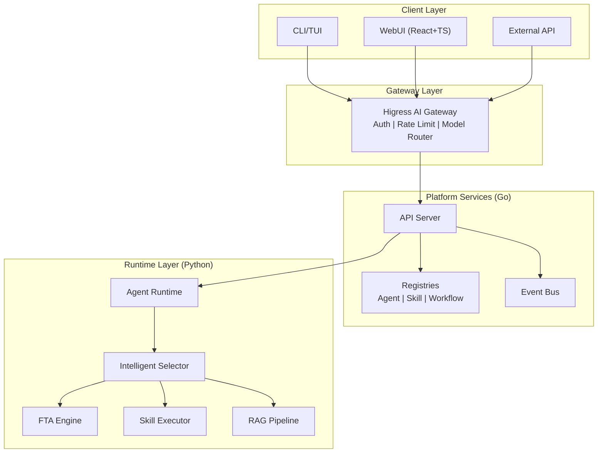
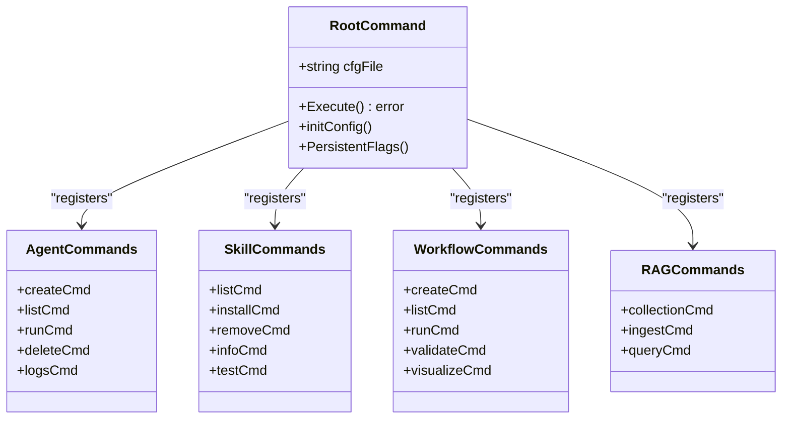
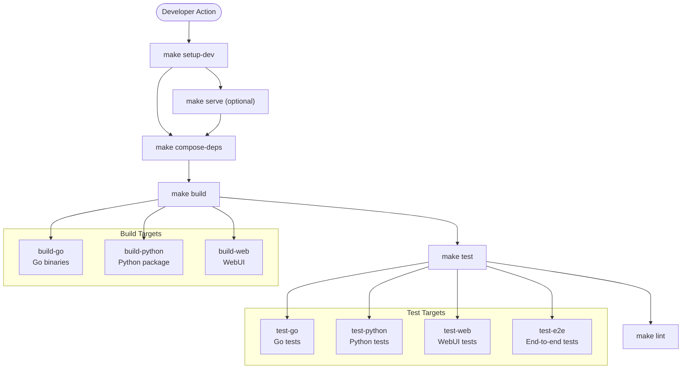
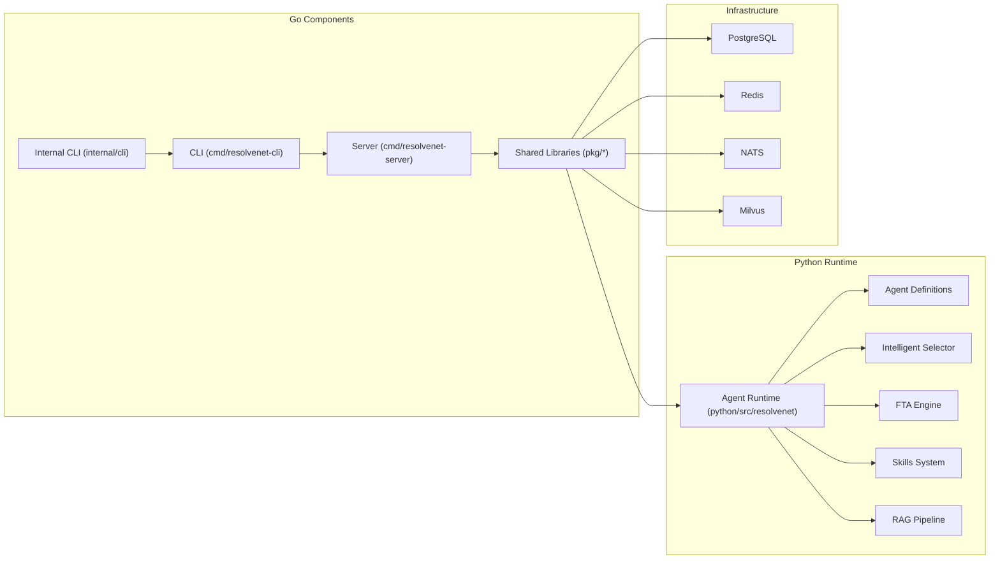

# Getting Started

<cite>
**Referenced Files in This Document**
- [README.md](file://README.md)
- [Makefile](file://Makefile)
- [hack/setup-dev.sh](file://hack/setup-dev.sh)
- [configs/resolvenet.yaml](file://configs/resolvenet.yaml)
- [python/pyproject.toml](file://python/pyproject.toml)
- [cmd/resolvenet-cli/main.go](file://cmd/resolvenet-cli/main.go)
- [internal/cli/root.go](file://internal/cli/root.go)
- [internal/cli/agent/create.go](file://internal/cli/agent/create.go)
- [internal/cli/workflow/create.go](file://internal/cli/workflow/create.go)
- [internal/cli/rag/collection.go](file://internal/cli/rag/collection.go)
- [deploy/docker-compose/docker-compose.deps.yaml](file://deploy/docker-compose/docker-compose.deps.yaml)
- [deploy/docker-compose/docker-compose.dev.yaml](file://deploy/docker-compose/docker-compose.dev.yaml)
- [configs/examples/agent-example.yaml](file://configs/examples/agent-example.yaml)
- [configs/examples/workflow-fta-example.yaml](file://configs/examples/workflow-fta-example.yaml)
- [configs/examples/skill-example.yaml](file://configs/examples/skill-example.yaml)
</cite>

## Table of Contents
1. [Introduction](#introduction)
2. [Prerequisites](#prerequisites)
3. [Installation](#installation)
4. [Development Environment Setup](#development-environment-setup)
5. [Quick Start CLI Examples](#quick-start-cli-examples)
6. [Configuration and Environment Variables](#configuration-and-environment-variables)
7. [Architecture Overview](#architecture-overview)
8. [Detailed Component Analysis](#detailed-component-analysis)
9. [Dependency Analysis](#dependency-analysis)
10. [Performance Considerations](#performance-considerations)
11. [Troubleshooting Guide](#troubleshooting-guide)
12. [Verification Checklist](#verification-checklist)
13. [Conclusion](#conclusion)

## Introduction
ResolveNet is a CNCF-grade Mega Agent platform that unifies Agent Skills, Fault Tree Analysis (FTA) Workflows, and Retrieval-Augmented Generation (RAG) under an intelligent routing layer. It provides a complete developer experience with CLI, TUI, and WebUI, plus cloud-native deployment options.

## Prerequisites
Before installing ResolveNet, ensure your system meets these requirements:
- Go >= 1.22
- Python >= 3.11 with uv
- Node.js >= 20 with pnpm
- Docker and Docker Compose

These prerequisites are validated during development setup and enforced by the project configuration.

**Section sources**
- [README.md:61-66](file://README.md#L61-L66)
- [hack/setup-dev.sh:11-17](file://hack/setup-dev.sh#L11-L17)
- [python/pyproject.toml:7](file://python/pyproject.toml#L7)

## Installation
Choose one of the following installation approaches:

### Option A: Automated Development Setup (Recommended)
Use the provided Makefile target to set up everything automatically:
- Clone the repository
- Run make setup-dev to install dependencies and configure the environment
- Start dependencies with make compose-deps
- Build components with make build
- Run tests with make test

This streamlined approach handles Go, Python (uv), and WebUI (pnpm) setup automatically.

### Option B: Manual Setup
If you prefer manual control:
1. Install prerequisites individually
2. Set up Go dependencies with go mod download
3. Configure Python environment with uv sync --extra dev
4. Set up WebUI with pnpm install
5. Create local configuration at ~/.resolvenet/config.yaml

**Section sources**
- [README.md:68-86](file://README.md#L68-L86)
- [Makefile:200-202](file://Makefile#L200-L202)
- [hack/setup-dev.sh:19-44](file://hack/setup-dev.sh#L19-L44)

## Development Environment Setup
Complete the development environment with these steps:

### Step 1: Initialize Development Environment
Run the automated setup script:
```bash
make setup-dev
```

This command:
- Validates Go, Python, and Node.js versions
- Installs Go module dependencies
- Sets up Python virtual environment with uv
- Installs WebUI dependencies with pnpm
- Creates default configuration in ~/.resolvenet/

### Step 2: Start Dependencies
Launch required infrastructure services:
```bash
make compose-deps
```

This starts PostgreSQL, Redis, NATS, and Milvus for development.

### Step 3: Build Components
Compile all platform components:
```bash
make build
```

This builds:
- Go binaries (resolvenet-server, resolvenet CLI)
- Python package with uv
- WebUI with pnpm

### Step 4: Run Tests
Execute the complete test suite:
```bash
make test
```

Tests cover Go, Python, and WebUI components with coverage reporting.

**Section sources**
- [Makefile:50-91](file://Makefile#L50-L91)
- [hack/setup-dev.sh:56-61](file://hack/setup-dev.sh#L56-L61)
- [deploy/docker-compose/docker-compose.deps.yaml:1-37](file://deploy/docker-compose/docker-compose.deps.yaml#L1-L37)

## Quick Start CLI Examples
The CLI provides comprehensive management capabilities for agents, skills, workflows, and RAG operations.

### Agent Management
Create and manage agents:
```bash
# Create a new agent
resolvenet agent create my-agent --type mega --model qwen-plus

# List existing agents
resolvenet agent list

# Run an agent interactively
resolvenet agent run my-agent
```

### Skill Operations
Manage agent skills:
```bash
# List available skills
resolvenet skill list

# Install a custom skill
resolvenet skill install ./my-skill
```

### FTA Workflow Management
Create and execute Fault Tree Analysis workflows:
```bash
# Create workflow from YAML
resolvenet workflow create my-workflow -f workflow.yaml

# Run the workflow
resolvenet workflow run my-workflow
```

### RAG Pipeline Operations
Set up and use Retrieval-Augmented Generation:
```bash
# Create a document collection
resolvenet rag collection create my-docs --embedding-model bge-large-zh

# Ingest documents into collection
resolvenet rag ingest --collection my-docs --path ./documents/
```

### Launch Dashboard
Access the interactive terminal dashboard:
```bash
resolvenet dashboard
```

**Section sources**
- [README.md:88-114](file://README.md#L88-L114)
- [internal/cli/agent/create.go:9-31](file://internal/cli/agent/create.go#L9-L31)
- [internal/cli/workflow/create.go:26-44](file://internal/cli/workflow/create.go#L26-L44)
- [internal/cli/rag/collection.go:33-50](file://internal/cli/rag/collection.go#L33-L50)

## Configuration and Environment Variables
ResolveNet uses a layered configuration system with YAML files and environment variables.

### Configuration File Locations
Configuration is loaded from files in this priority order:
1. Current working directory: ./resolvenet.yaml
2. User home directory: $HOME/.resolvenet/config.yaml
3. System-wide: /etc/resolvenet/resolvenet.yaml

### Default Configuration
The default configuration includes:
- Server addresses (HTTP and gRPC)
- Database connection (PostgreSQL)
- Redis cache settings
- NATS message broker
- Runtime service address
- Gateway and telemetry settings

### Environment Variable Override Pattern
Use RESOLVENET_ prefix for environment variable overrides:
- RESOLVENET_SERVER_HTTP_ADDR
- RESOLVENET_DATABASE_HOST
- RESOLVENET_RUNTIME_GRPC_ADDR

The CLI supports a persistent --config flag to specify custom configuration files.

**Section sources**
- [README.md:151-167](file://README.md#L151-L167)
- [configs/resolvenet.yaml:1-34](file://configs/resolvenet.yaml#L1-L34)
- [internal/cli/root.go:36-41](file://internal/cli/root.go#L36-L41)
- [internal/cli/root.go:54-71](file://internal/cli/root.go#L54-L71)

## Architecture Overview
ResolveNet follows a distributed microservices architecture with clear separation of concerns:



**Diagram sources**
- [README.md:10-46](file://README.md#L10-L46)
- [internal/cli/root.go:19-52](file://internal/cli/root.go#L19-L52)

## Detailed Component Analysis

### CLI Architecture
The CLI uses Cobra for command structure and Viper for configuration management:



**Diagram sources**
- [internal/cli/root.go:19-52](file://internal/cli/root.go#L19-L52)
- [internal/cli/agent/create.go:34-48](file://internal/cli/agent/create.go#L34-L48)
- [internal/cli/workflow/create.go:9-24](file://internal/cli/workflow/create.go#L9-L24)
- [internal/cli/rag/collection.go:9-31](file://internal/cli/rag/collection.go#L9-L31)

### Development Workflow
The Makefile orchestrates the complete development lifecycle:



**Diagram sources**
- [Makefile:50-91](file://Makefile#L50-L91)
- [Makefile:198-220](file://Makefile#L198-L220)

**Section sources**
- [Makefile:1-220](file://Makefile#L1-L220)
- [cmd/resolvenet-cli/main.go:9-13](file://cmd/resolvenet-cli/main.go#L9-L13)

## Dependency Analysis
ResolveNet maintains clear dependency boundaries between components:



**Diagram sources**
- [README.md:116-139](file://README.md#L116-L139)
- [deploy/docker-compose/docker-compose.deps.yaml:4-34](file://deploy/docker-compose/docker-compose.deps.yaml#L4-L34)

**Section sources**
- [README.md:116-139](file://README.md#L116-L139)
- [deploy/docker-compose/docker-compose.deps.yaml:1-37](file://deploy/docker-compose/docker-compose.deps.yaml#L1-L37)

## Performance Considerations
- Use Docker Compose for consistent dependency versions
- Enable telemetry for production deployments
- Configure appropriate embedding models for RAG workloads
- Monitor resource usage for Milvus and PostgreSQL
- Use connection pooling for database operations

## Troubleshooting Guide

### Common Setup Issues

**Problem: Port conflicts when starting dependencies**
- Solution: Stop conflicting services or modify port mappings in docker-compose files

**Problem: Python dependency installation failures**
- Solution: Ensure uv is installed and up to date, then run uv sync --extra dev

**Problem: Go build errors**
- Solution: Verify Go 1.22+ is installed and run go mod tidy

**Problem: CLI command not found**
- Solution: Ensure the binary was built successfully and is in PATH

**Problem: Configuration file not loading**
- Solution: Verify ~/.resolvenet/config.yaml exists and is properly formatted

### Verification Steps
After installation, verify your setup:

1. **Check prerequisites**: Confirm all tool versions meet minimum requirements
2. **Test dependencies**: Verify PostgreSQL, Redis, and NATS are running
3. **Build components**: Ensure make build completes successfully
4. **Run tests**: Execute make test to validate all components
5. **Start services**: Launch make compose-deps and verify container health
6. **Test CLI**: Run resolvenet --help to confirm CLI availability

**Section sources**
- [hack/setup-dev.sh:11-17](file://hack/setup-dev.sh#L11-L17)
- [Makefile:76-90](file://Makefile#L76-L90)

## Verification Checklist
Complete this checklist to ensure proper installation:

- [ ] Go >= 1.22 installed
- [ ] Python >= 3.11 with uv available
- [ ] Node.js >= 20 with pnpm available
- [ ] Docker and Docker Compose functional
- [ ] make setup-dev executed successfully
- [ ] Dependencies started with make compose-deps
- [ ] Components built with make build
- [ ] Tests pass with make test
- [ ] Configuration file created at ~/.resolvenet/config.yaml
- [ ] CLI commands available and responsive

## Conclusion
ResolveNet provides a comprehensive platform for building intelligent agent systems with integrated FTA workflows and RAG capabilities. The automated setup process ensures developers can quickly get started, while the modular architecture supports both development and production deployments. Use the CLI examples as a foundation for exploring the platform's capabilities, and refer to the configuration system for environment-specific customization.