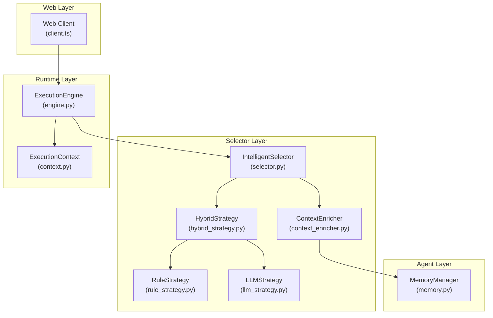
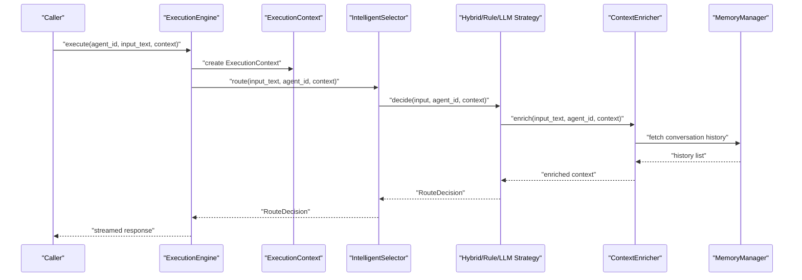
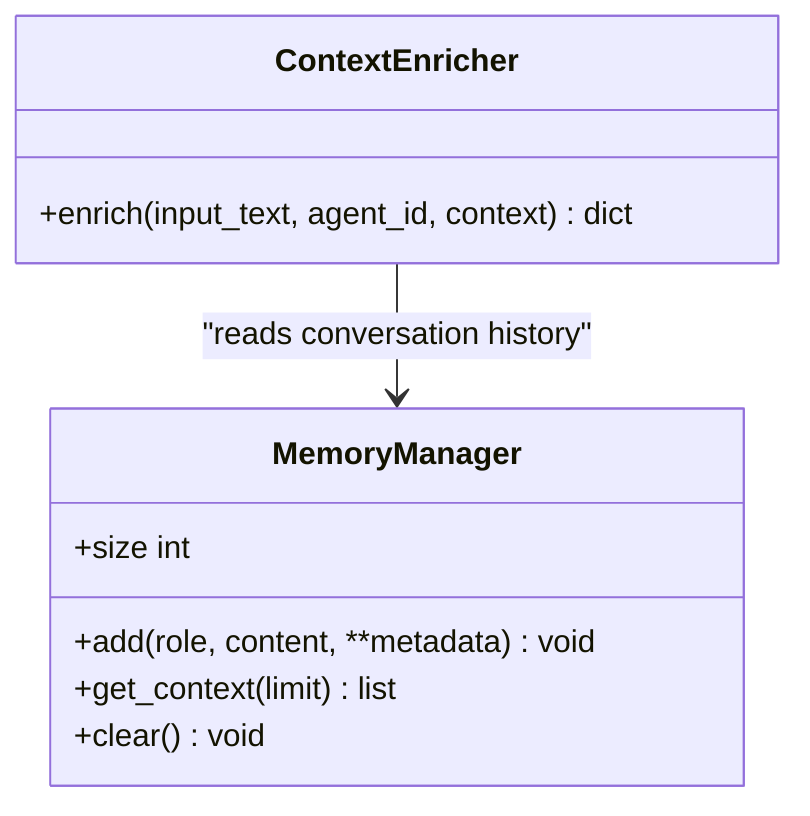
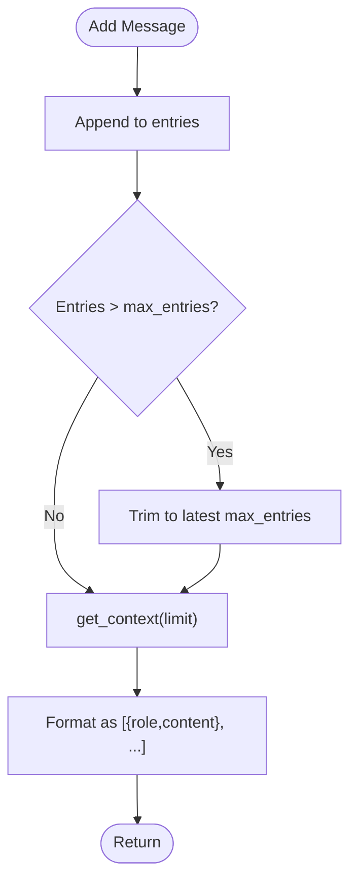
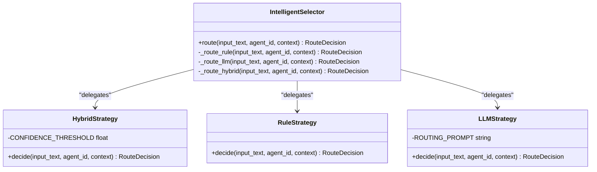
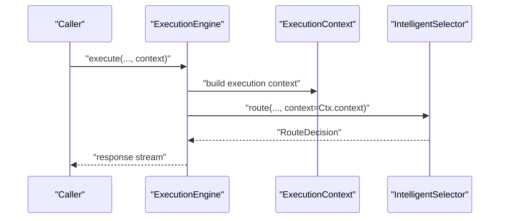
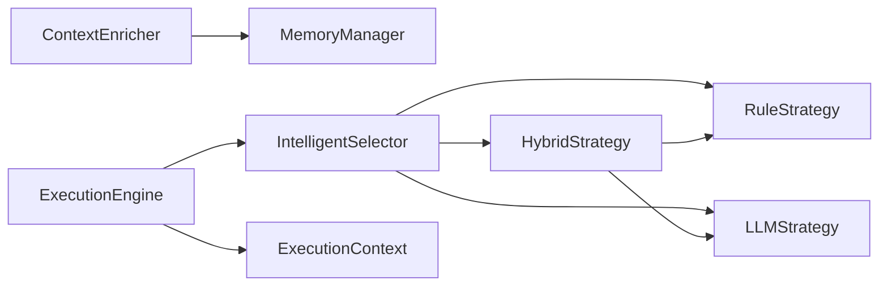
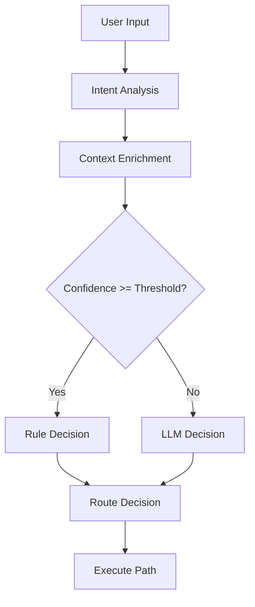

# Context Enrichment

<cite>
**Referenced Files in This Document**
- [context_enricher.py](file://python/src/resolvenet/selector/context_enricher.py)
- [memory.py](file://python/src/resolvenet/agent/memory.py)
- [engine.py](file://python/src/resolvenet/runtime/engine.py)
- [context.py](file://python/src/resolvenet/runtime/context.py)
- [selector.py](file://python/src/resolvenet/selector/selector.py)
- [hybrid_strategy.py](file://python/src/resolvenet/selector/strategies/hybrid_strategy.py)
- [llm_strategy.py](file://python/src/resolvenet/selector/strategies/llm_strategy.py)
- [rule_strategy.py](file://python/src/resolvenet/selector/strategies/rule_strategy.py)
- [intelligent-selector.md](file://docs/zh/intelligent-selector.md)
- [client.ts](file://web/src/api/client.ts)
</cite>

## Table of Contents
1. [Introduction](#introduction)
2. [Project Structure](#project-structure)
3. [Core Components](#core-components)
4. [Architecture Overview](#architecture-overview)
5. [Detailed Component Analysis](#detailed-component-analysis)
6. [Dependency Analysis](#dependency-analysis)
7. [Performance Considerations](#performance-considerations)
8. [Troubleshooting Guide](#troubleshooting-guide)
9. [Conclusion](#conclusion)
10. [Appendices](#appendices)

## Introduction
This document describes the context enrichment system that augments user requests with relevant background information to improve routing decisions. It explains memory integration, capability discovery, and historical context analysis, documents data sources and enrichment algorithms, details transformation and formatting requirements, and provides examples, caching strategies, configuration options, and troubleshooting guidance for context-related routing issues.

## Project Structure
The context enrichment system spans several modules:
- Selector orchestrator and strategies
- Runtime execution context
- Agent memory management
- Web API client for system resources

**Diagram sources**
- [selector.py:24-100](file://python/src/resolvenet/selector/selector.py#L24-L100)
- [hybrid_strategy.py:12-42](file://python/src/resolvenet/selector/strategies/hybrid_strategy.py#L12-L42)
- [rule_strategy.py:11-77](file://python/src/resolvenet/selector/strategies/rule_strategy.py#L11-L77)
- [llm_strategy.py:10-44](file://python/src/resolvenet/selector/strategies/llm_strategy.py#L10-L44)
- [context_enricher.py:8-47](file://python/src/resolvenet/selector/context_enricher.py#L8-L47)
- [engine.py:14-50](file://python/src/resolvenet/runtime/engine.py#L14-L50)
- [context.py:9-35](file://python/src/resolvenet/runtime/context.py#L9-L35)
- [memory.py:19-52](file://python/src/resolvenet/agent/memory.py#L19-L52)
- [client.ts:1-48](file://web/src/api/client.ts#L1-L48)

**Section sources**
- [selector.py:24-100](file://python/src/resolvenet/selector/selector.py#L24-L100)
- [engine.py:14-50](file://python/src/resolvenet/runtime/engine.py#L14-L50)
- [context.py:9-35](file://python/src/resolvenet/runtime/context.py#L9-L35)
- [memory.py:19-52](file://python/src/resolvenet/agent/memory.py#L19-L52)
- [context_enricher.py:8-47](file://python/src/resolvenet/selector/context_enricher.py#L8-L47)
- [client.ts:1-48](file://web/src/api/client.ts#L1-L48)

## Core Components
- ContextEnricher: Aggregates available skills, active workflows, RAG collections, and conversation history into the routing context.
- MemoryManager: Provides sliding-window memory entries suitable for LLM context.
- IntelligentSelector: Orchestrates intent analysis, context enrichment, and route decision via pluggable strategies.
- ExecutionEngine and ExecutionContext: Provide execution state and context propagation for routing.
- Strategies: RuleStrategy, HybridStrategy, and LLMStrategy implement different routing approaches.

Key responsibilities:
- Memory integration: Expose recent conversation messages for downstream routing.
- Capability discovery: Provide lists of available skills, workflows, and RAG collections.
- Historical context analysis: Supply conversation history and user preferences.

**Section sources**
- [context_enricher.py:8-47](file://python/src/resolvenet/selector/context_enricher.py#L8-L47)
- [memory.py:19-52](file://python/src/resolvenet/agent/memory.py#L19-L52)
- [selector.py:24-100](file://python/src/resolvenet/selector/selector.py#L24-L100)
- [engine.py:14-50](file://python/src/resolvenet/runtime/engine.py#L14-L50)
- [context.py:9-35](file://python/src/resolvenet/runtime/context.py#L9-L35)
- [hybrid_strategy.py:12-42](file://python/src/resolvenet/selector/strategies/hybrid_strategy.py#L12-L42)
- [rule_strategy.py:11-77](file://python/src/resolvenet/selector/strategies/rule_strategy.py#L11-L77)
- [llm_strategy.py:10-44](file://python/src/resolvenet/selector/strategies/llm_strategy.py#L10-L44)

## Architecture Overview
The context enrichment pipeline integrates memory, capabilities, and history into a unified context dictionary passed to the selector’s strategies.

**Diagram sources**
- [engine.py:25-50](file://python/src/resolvenet/runtime/engine.py#L25-L50)
- [selector.py:43-100](file://python/src/resolvenet/selector/selector.py#L43-L100)
- [hybrid_strategy.py:27-42](file://python/src/resolvenet/selector/strategies/hybrid_strategy.py#L27-L42)
- [rule_strategy.py:35-77](file://python/src/resolvenet/selector/strategies/rule_strategy.py#L35-L77)
- [llm_strategy.py:33-44](file://python/src/resolvenet/selector/strategies/llm_strategy.py#L33-L44)
- [context_enricher.py:16-47](file://python/src/resolvenet/selector/context_enricher.py#L16-L47)
- [memory.py:39-42](file://python/src/resolvenet/agent/memory.py#L39-L42)

## Detailed Component Analysis

### ContextEnricher
Purpose:
- Augment routing context with available skills, active workflows, RAG collections, and conversation history.

Current behavior:
- Copies existing context and sets placeholder lists for skills, workflows, RAG collections, and conversation history.

Future enhancements:
- Integrate with registry for skills and workflows.
- Integrate with RAG service for collection summaries.
- Retrieve conversation history from persistent storage or in-memory manager.

**Diagram sources**
- [context_enricher.py:8-47](file://python/src/resolvenet/selector/context_enricher.py#L8-L47)
- [memory.py:19-52](file://python/src/resolvenet/agent/memory.py#L19-L52)

**Section sources**
- [context_enricher.py:8-47](file://python/src/resolvenet/selector/context_enricher.py#L8-L47)

### MemoryManager
Purpose:
- Manage agent memory with windowing and provide context-formatted messages for LLM consumption.

Key features:
- Fixed-size sliding window eviction.
- Message conversion to role/content pairs.
- Clear and size inspection.

**Diagram sources**
- [memory.py:30-42](file://python/src/resolvenet/agent/memory.py#L30-L42)

**Section sources**
- [memory.py:19-52](file://python/src/resolvenet/agent/memory.py#L19-L52)

### IntelligentSelector and Strategies
Selector orchestrates routing across three stages:
- Intent Analysis
- Context Enrichment
- Route Decision

Strategies:
- RuleStrategy: Pattern-based matching with predefined confidence.
- HybridStrategy: Prefer rules above a threshold; otherwise fallback to LLM.
- LLMStrategy: Uses a routing prompt with skills/workflows/collections placeholders.

**Diagram sources**
- [selector.py:24-100](file://python/src/resolvenet/selector/selector.py#L24-L100)
- [hybrid_strategy.py:12-42](file://python/src/resolvenet/selector/strategies/hybrid_strategy.py#L12-L42)
- [rule_strategy.py:11-77](file://python/src/resolvenet/selector/strategies/rule_strategy.py#L11-L77)
- [llm_strategy.py:10-44](file://python/src/resolvenet/selector/strategies/llm_strategy.py#L10-L44)

**Section sources**
- [selector.py:24-100](file://python/src/resolvenet/selector/selector.py#L24-L100)
- [hybrid_strategy.py:12-42](file://python/src/resolvenet/selector/strategies/hybrid_strategy.py#L12-L42)
- [rule_strategy.py:11-77](file://python/src/resolvenet/selector/strategies/rule_strategy.py#L11-L77)
- [llm_strategy.py:10-44](file://python/src/resolvenet/selector/strategies/llm_strategy.py#L10-L44)

### Execution Context and Runtime
ExecutionEngine constructs an ExecutionContext and passes it to the selector. The context can carry arbitrary data and is extended by ContextEnricher.

**Diagram sources**
- [engine.py:25-50](file://python/src/resolvenet/runtime/engine.py#L25-L50)
- [context.py:9-35](file://python/src/resolvenet/runtime/context.py#L9-L35)
- [selector.py:43-72](file://python/src/resolvenet/selector/selector.py#L43-L72)

**Section sources**
- [engine.py:14-50](file://python/src/resolvenet/runtime/engine.py#L14-L50)
- [context.py:9-35](file://python/src/resolvenet/runtime/context.py#L9-L35)

## Dependency Analysis
- Selector depends on strategies for decision-making.
- HybridStrategy composes RuleStrategy and LLMStrategy.
- ContextEnricher relies on MemoryManager for conversation history.
- ExecutionEngine builds and passes ExecutionContext to the selector.

**Diagram sources**
- [context_enricher.py:8-47](file://python/src/resolvenet/selector/context_enricher.py#L8-L47)
- [memory.py:19-52](file://python/src/resolvenet/agent/memory.py#L19-L52)
- [selector.py:24-100](file://python/src/resolvenet/selector/selector.py#L24-L100)
- [hybrid_strategy.py:12-42](file://python/src/resolvenet/selector/strategies/hybrid_strategy.py#L12-L42)
- [rule_strategy.py:11-77](file://python/src/resolvenet/selector/strategies/rule_strategy.py#L11-L77)
- [llm_strategy.py:10-44](file://python/src/resolvenet/selector/strategies/llm_strategy.py#L10-L44)
- [engine.py:14-50](file://python/src/resolvenet/runtime/engine.py#L14-L50)
- [context.py:9-35](file://python/src/resolvenet/runtime/context.py#L9-L35)

**Section sources**
- [selector.py:24-100](file://python/src/resolvenet/selector/selector.py#L24-L100)
- [hybrid_strategy.py:12-42](file://python/src/resolvenet/selector/strategies/hybrid_strategy.py#L12-L42)
- [rule_strategy.py:11-77](file://python/src/resolvenet/selector/strategies/rule_strategy.py#L11-L77)
- [llm_strategy.py:10-44](file://python/src/resolvenet/selector/strategies/llm_strategy.py#L10-L44)
- [context_enricher.py:8-47](file://python/src/resolvenet/selector/context_enricher.py#L8-L47)
- [memory.py:19-52](file://python/src/resolvenet/agent/memory.py#L19-L52)
- [engine.py:14-50](file://python/src/resolvenet/runtime/engine.py#L14-L50)
- [context.py:9-35](file://python/src/resolvenet/runtime/context.py#L9-L35)

## Performance Considerations
- Strategy selection:
  - RuleStrategy is fast and deterministic but requires maintenance of patterns.
  - HybridStrategy balances speed and flexibility with a confidence threshold.
  - LLMStrategy offers adaptivity but adds latency; tune model and timeout.
- Context size:
  - Limit conversation history length and token budget to keep prompts concise.
  - Use MemoryManager’s windowing to cap entries.
- Caching:
  - Enable caching for repeated computations (as suggested in documentation) to reduce redundant work.
- Model selection:
  - Prefer faster models for routing decisions; reserve heavier models for complex tasks.

[No sources needed since this section provides general guidance]

## Troubleshooting Guide
Common issues and remedies:
- Low routing accuracy:
  - Adjust rule patterns or increase confidence thresholds.
  - Switch to LLMStrategy for ambiguous cases; verify prompt quality.
- Missing capabilities in context:
  - Implement capability discovery by integrating with the registry and RAG service in ContextEnricher.
- Excessive context length:
  - Reduce conversation history window and prune older entries.
- Debugging:
  - Enable debug mode to inspect decision logs and confidence scores.
  - Inspect ExecutionContext for propagated context and metadata.

Configuration references:
- Selector strategy and cache settings are documented in the selector guide.
- Debug environment variable and logging format are described in the selector guide.

**Section sources**
- [intelligent-selector.md:518-548](file://docs/zh/intelligent-selector.md#L518-L548)
- [intelligent-selector.md:584-598](file://docs/zh/intelligent-selector.md#L584-L598)

## Conclusion
The context enrichment system integrates memory, capabilities, and historical context to improve routing decisions. While current implementations provide placeholders for capability discovery and RAG integration, the architecture supports extension to a registry-backed system. By tuning strategies, controlling context size, and leveraging caching, the system achieves robust, efficient routing for diverse user intents.

## Appendices

### Context Data Sources and Enrichment Algorithms
- Data sources:
  - Agent memory: Recent conversation entries.
  - Capabilities: Skills, workflows, and RAG collections.
  - History: Conversation history and user preferences.
- Enrichment algorithms:
  - Sliding window memory retrieval.
  - Placeholder insertion for skills, workflows, and collections.
  - History truncation to recent N turns.

**Section sources**
- [context_enricher.py:8-47](file://python/src/resolvenet/selector/context_enricher.py#L8-L47)
- [memory.py:39-42](file://python/src/resolvenet/agent/memory.py#L39-L42)
- [intelligent-selector.md:331-392](file://docs/zh/intelligent-selector.md#L331-L392)

### Context Transformation and Formatting
- Memory format: List of message dictionaries with role and content.
- Context dictionary: Extends existing context with capability lists and history.
- Strategy prompts: Expect skills, workflows, and collections in the context.

**Section sources**
- [memory.py:39-42](file://python/src/resolvenet/agent/memory.py#L39-L42)
- [context_enricher.py:32-46](file://python/src/resolvenet/selector/context_enricher.py#L32-L46)
- [llm_strategy.py:17-31](file://python/src/resolvenet/selector/strategies/llm_strategy.py#L17-L31)

### Examples of Context Enrichment Scenarios
- Troubleshooting scenario:
  - Intent: Diagnose system failure.
  - Enriched context includes available skills/workflows for diagnostics, recent troubleshooting history, and user preferences.
- Information retrieval scenario:
  - Intent: Find documentation.
  - Enriched context includes available RAG collections and recent search history.

**Section sources**
- [intelligent-selector.md:331-392](file://docs/zh/intelligent-selector.md#L331-L392)

### Configuration Options for Context Enrichment
- Selector strategy: rule, llm, hybrid.
- Cache settings: enable and TTL.
- Model selection and timeouts for LLM-based routing.
- Debug mode for verbose decision logs.

**Section sources**
- [intelligent-selector.md:584-598](file://docs/zh/intelligent-selector.md#L584-L598)
- [intelligent-selector.md:518-548](file://docs/zh/intelligent-selector.md#L518-L548)

### Context Routing Flow

**Diagram sources**
- [selector.py:43-100](file://python/src/resolvenet/selector/selector.py#L43-L100)
- [hybrid_strategy.py:27-42](file://python/src/resolvenet/selector/strategies/hybrid_strategy.py#L27-L42)
- [rule_strategy.py:35-77](file://python/src/resolvenet/selector/strategies/rule_strategy.py#L35-L77)
- [llm_strategy.py:33-44](file://python/src/resolvenet/selector/strategies/llm_strategy.py#L33-L44)