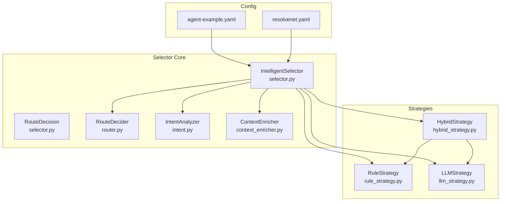
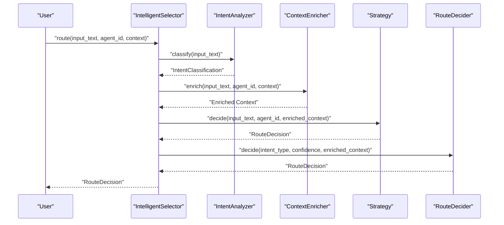
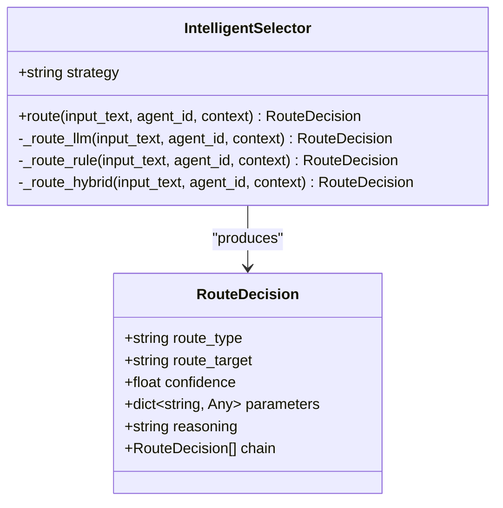
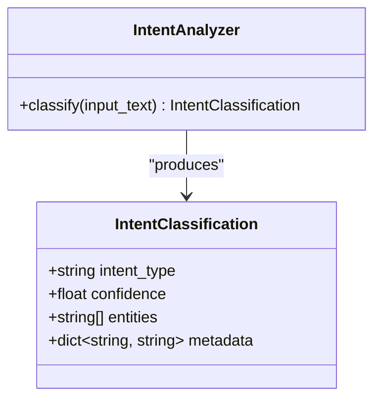
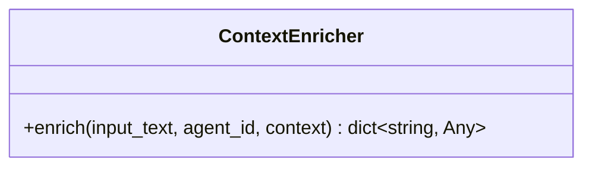
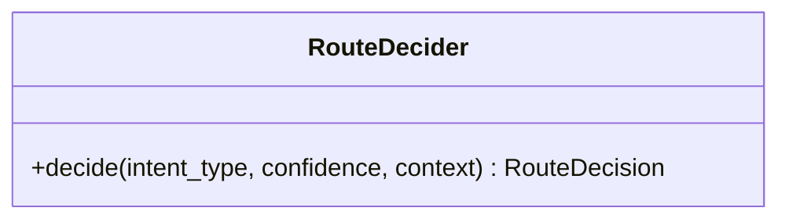
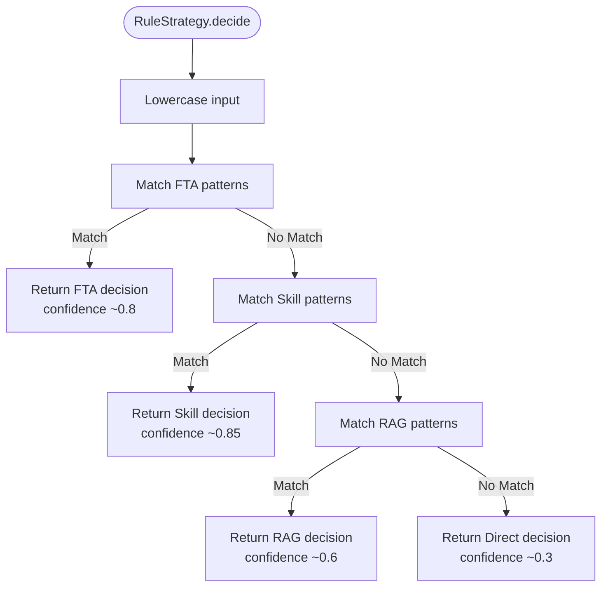
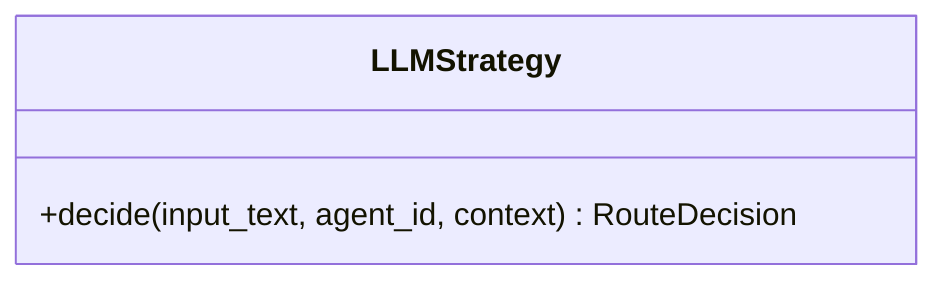
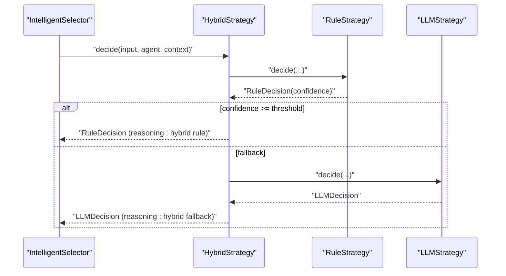
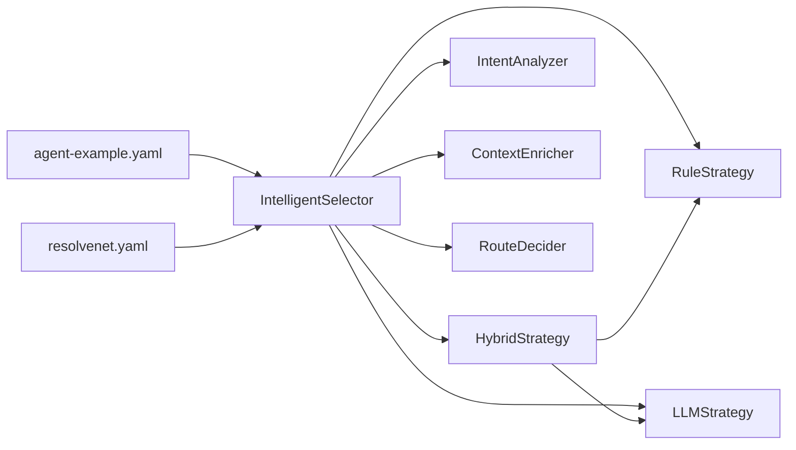

# Intelligent Selector System

<cite>
**Referenced Files in This Document**
- [intelligent-selector.md](file://docs/architecture/intelligent-selector.md)
- [selector.py](file://python/src/resolvenet/selector/selector.py)
- [router.py](file://python/src/resolvenet/selector/router.py)
- [intent.py](file://python/src/resolvenet/selector/intent.py)
- [context_enricher.py](file://python/src/resolvenet/selector/context_enricher.py)
- [rule_strategy.py](file://python/src/resolvenet/selector/strategies/rule_strategy.py)
- [llm_strategy.py](file://python/src/resolvenet/selector/strategies/llm_strategy.py)
- [hybrid_strategy.py](file://python/src/resolvenet/selector/strategies/hybrid_strategy.py)
- [test_selector.py](file://python/tests/unit/test_selector.py)
- [agent-example.yaml](file://configs/examples/agent-example.yaml)
- [resolvenet.yaml](file://configs/resolvenet.yaml)
</cite>

## Table of Contents
1. [Introduction](#introduction)
2. [Project Structure](#project-structure)
3. [Core Components](#core-components)
4. [Architecture Overview](#architecture-overview)
5. [Detailed Component Analysis](#detailed-component-analysis)
6. [Dependency Analysis](#dependency-analysis)
7. [Performance Considerations](#performance-considerations)
8. [Troubleshooting Guide](#troubleshooting-guide)
9. [Conclusion](#conclusion)
10. [Appendices](#appendices)

## Introduction
The Intelligent Selector is the LLM-powered meta-router at the heart of ResolveNet. It orchestrates dynamic routing of user requests across subsystems such as Fault Tree Analysis (FTA), Agent Skills, Retrieval-Augmented Generation (RAG), multi-step chained workflows, and direct LLM responses. The system implements three routing strategies:
- Rule-based: deterministic pattern matching for known request types
- LLM-based: intelligent classification for ambiguous requests
- Hybrid: rules-first with LLM fallback

It performs three stages of processing:
- Intent Analysis: classifies user intent and extracts entities/metadata
- Context Enrichment: augments requests with agent capabilities, history, and available resources
- Route Decision: selects the optimal execution path based on intent, confidence, and context

**Section sources**
- [intelligent-selector.md:1-18](file://docs/architecture/intelligent-selector.md#L1-L18)

## Project Structure
The selector system is implemented in Python under the resolvenet.selector package, with strategy implementations under resolvenet.selector.strategies. Supporting configuration is provided via YAML files.

**Diagram sources**
- [selector.py:24-100](file://python/src/resolvenet/selector/selector.py#L24-L100)
- [router.py:10-40](file://python/src/resolvenet/selector/router.py#L10-L40)
- [intent.py:17-39](file://python/src/resolvenet/selector/intent.py#L17-L39)
- [context_enricher.py:8-47](file://python/src/resolvenet/selector/context_enricher.py#L8-L47)
- [rule_strategy.py:11-77](file://python/src/resolvenet/selector/strategies/rule_strategy.py#L11-L77)
- [llm_strategy.py:10-44](file://python/src/resolvenet/selector/strategies/llm_strategy.py#L10-L44)
- [hybrid_strategy.py:12-42](file://python/src/resolvenet/selector/strategies/hybrid_strategy.py#L12-L42)
- [agent-example.yaml:15-17](file://configs/examples/agent-example.yaml#L15-L17)
- [resolvenet.yaml:1-34](file://configs/resolvenet.yaml#L1-L34)

**Section sources**
- [selector.py:1-100](file://python/src/resolvenet/selector/selector.py#L1-L100)
- [rule_strategy.py:1-77](file://python/src/resolvenet/selector/strategies/rule_strategy.py#L1-L77)
- [llm_strategy.py:1-44](file://python/src/resolvenet/selector/strategies/llm_strategy.py#L1-L44)
- [hybrid_strategy.py:1-42](file://python/src/resolvenet/selector/strategies/hybrid_strategy.py#L1-L42)
- [intent.py:1-39](file://python/src/resolvenet/selector/intent.py#L1-L39)
- [context_enricher.py:1-47](file://python/src/resolvenet/selector/context_enricher.py#L1-L47)
- [router.py:1-40](file://python/src/resolvenet/selector/router.py#L1-L40)
- [agent-example.yaml:1-18](file://configs/examples/agent-example.yaml#L1-L18)
- [resolvenet.yaml:1-34](file://configs/resolvenet.yaml#L1-L34)

## Core Components
- IntelligentSelector: Orchestrates intent analysis, context enrichment, and route decision-making. Supports pluggable strategies and logs routing outcomes.
- RouteDecision: Standardized output model containing route_type, route_target, confidence, parameters, reasoning, and optional chaining for multi-step routes.
- IntentAnalyzer: Extracts intent type, confidence, entities, and metadata from user input.
- ContextEnricher: Augments context with available skills, active workflows, RAG collections, and conversation history.
- RouteDecider: Makes the final routing decision given intent and enriched context.
- Strategies: RuleStrategy, LLMStrategy, HybridStrategy implement different routing approaches.

**Section sources**
- [selector.py:13-100](file://python/src/resolvenet/selector/selector.py#L13-L100)
- [intent.py:8-39](file://python/src/resolvenet/selector/intent.py#L8-L39)
- [context_enricher.py:8-47](file://python/src/resolvenet/selector/context_enricher.py#L8-L47)
- [router.py:10-40](file://python/src/resolvenet/selector/router.py#L10-L40)
- [rule_strategy.py:11-77](file://python/src/resolvenet/selector/strategies/rule_strategy.py#L11-L77)
- [llm_strategy.py:10-44](file://python/src/resolvenet/selector/strategies/llm_strategy.py#L10-L44)
- [hybrid_strategy.py:12-42](file://python/src/resolvenet/selector/strategies/hybrid_strategy.py#L12-L42)

## Architecture Overview
The selector follows a staged pipeline: intent classification, context enrichment, and route decision. Strategies encapsulate the decision logic and are invoked by the selector based on configuration.

**Diagram sources**
- [selector.py:43-100](file://python/src/resolvenet/selector/selector.py#L43-L100)
- [intent.py:24-39](file://python/src/resolvenet/selector/intent.py#L24-L39)
- [context_enricher.py:16-47](file://python/src/resolvenet/selector/context_enricher.py#L16-L47)
- [router.py:17-40](file://python/src/resolvenet/selector/router.py#L17-L40)
- [rule_strategy.py:35-77](file://python/src/resolvenet/selector/strategies/rule_strategy.py#L35-L77)
- [llm_strategy.py:33-44](file://python/src/resolvenet/selector/strategies/llm_strategy.py#L33-L44)
- [hybrid_strategy.py:27-42](file://python/src/resolvenet/selector/strategies/hybrid_strategy.py#L27-L42)

## Detailed Component Analysis

### IntelligentSelector
- Responsibilities:
  - Selects and invokes the configured strategy
  - Logs routing decisions with strategy, route_type, target, and confidence
- Strategy mapping:
  - "llm" → LLMStrategy.decide
  - "rule" → RuleStrategy.decide
  - "hybrid" → HybridStrategy.decide (default)
- Inputs: input_text, agent_id, context
- Output: RouteDecision

**Diagram sources**
- [selector.py:24-100](file://python/src/resolvenet/selector/selector.py#L24-L100)

**Section sources**
- [selector.py:24-100](file://python/src/resolvenet/selector/selector.py#L24-L100)

### Intent Analyzer
- Purpose: Classify intent type, confidence, entities, and metadata
- Current behavior: Placeholder returning a default classification
- Future: Integrate with LLM-based classification

**Diagram sources**
- [intent.py:17-39](file://python/src/resolvenet/selector/intent.py#L17-L39)

**Section sources**
- [intent.py:17-39](file://python/src/resolvenet/selector/intent.py#L17-L39)

### Context Enricher
- Purpose: Augment context with available skills, active workflows, RAG collections, and conversation history
- Current behavior: Placeholder populating empty lists
- Future: Integrate with registry and storage systems

**Diagram sources**
- [context_enricher.py:8-47](file://python/src/resolvenet/selector/context_enricher.py#L8-L47)

**Section sources**
- [context_enricher.py:8-47](file://python/src/resolvenet/selector/context_enricher.py#L8-L47)

### Route Decider
- Purpose: Final decision maker based on intent and enriched context
- Current behavior: Defaults to direct response
- Future: Implement sophisticated routing logic considering intent, confidence, and context

**Diagram sources**
- [router.py:10-40](file://python/src/resolvenet/selector/router.py#L10-L40)

**Section sources**
- [router.py:10-40](file://python/src/resolvenet/selector/router.py#L10-L40)

### Rule-Based Strategy
- Purpose: Deterministic routing using pattern matching
- Patterns:
  - Skill patterns: web search, code execution, file operations
  - RAG patterns: informational queries, documentation
  - FTA patterns: diagnostics, root cause analysis
- Confidence: High for strong matches, lower default for no match

**Diagram sources**
- [rule_strategy.py:18-77](file://python/src/resolvenet/selector/strategies/rule_strategy.py#L18-L77)

**Section sources**
- [rule_strategy.py:11-77](file://python/src/resolvenet/selector/strategies/rule_strategy.py#L11-L77)

### LLM-Based Strategy
- Purpose: Intelligent routing for ambiguous requests
- Mechanism: Uses a structured prompt to classify route_type, route_target, and confidence
- Current behavior: Placeholder returning a default decision

**Diagram sources**
- [llm_strategy.py:10-44](file://python/src/resolvenet/selector/strategies/llm_strategy.py#L10-L44)

**Section sources**
- [llm_strategy.py:10-44](file://python/src/resolvenet/selector/strategies/llm_strategy.py#L10-L44)

### Hybrid Strategy
- Purpose: Combine speed of rules with intelligence of LLM
- Logic:
  - Try RuleStrategy first
  - If confidence ≥ threshold (~0.7), return rule decision
  - Else, use LLMStrategy and return its decision
- Threshold: Configurable constant

**Diagram sources**
- [hybrid_strategy.py:27-42](file://python/src/resolvenet/selector/strategies/hybrid_strategy.py#L27-L42)
- [rule_strategy.py:35-77](file://python/src/resolvenet/selector/strategies/rule_strategy.py#L35-L77)
- [llm_strategy.py:33-44](file://python/src/resolvenet/selector/strategies/llm_strategy.py#L33-L44)

**Section sources**
- [hybrid_strategy.py:12-42](file://python/src/resolvenet/selector/strategies/hybrid_strategy.py#L12-L42)

## Dependency Analysis
- Strategy selection is centralized in IntelligentSelector, which delegates to strategy modules.
- HybridStrategy composes RuleStrategy and LLMStrategy.
- RouteDecider is currently a stub awaiting implementation.
- Configuration is externalized via agent-example.yaml and resolvenet.yaml.

**Diagram sources**
- [selector.py:35-100](file://python/src/resolvenet/selector/selector.py#L35-L100)
- [hybrid_strategy.py:23-25](file://python/src/resolvenet/selector/strategies/hybrid_strategy.py#L23-L25)
- [agent-example.yaml:15-17](file://configs/examples/agent-example.yaml#L15-L17)
- [resolvenet.yaml:1-34](file://configs/resolvenet.yaml#L1-L34)

**Section sources**
- [selector.py:35-100](file://python/src/resolvenet/selector/selector.py#L35-L100)
- [hybrid_strategy.py:23-25](file://python/src/resolvenet/selector/strategies/hybrid_strategy.py#L23-L25)
- [agent-example.yaml:15-17](file://configs/examples/agent-example.yaml#L15-L17)
- [resolvenet.yaml:1-34](file://configs/resolvenet.yaml#L1-L34)

## Performance Considerations
- Rule-based strategy is fastest and deterministic, suitable for known patterns.
- LLM-based strategy offers flexibility but introduces latency; use judiciously for ambiguous cases.
- Hybrid strategy optimizes throughput by leveraging rules for confident decisions and falling back to LLM only when needed.
- Confidence thresholds should be tuned per deployment to balance accuracy and latency.
- Context enrichment should be cached or lazily loaded to minimize overhead.

[No sources needed since this section provides general guidance]

## Troubleshooting Guide
Common issues and debugging steps:
- Unexpected route_type:
  - Verify strategy configuration in agent-example.yaml and ensure the selector is initialized with the intended strategy.
  - Inspect logs emitted by IntelligentSelector for strategy and decision details.
- Low confidence decisions:
  - Adjust confidence threshold in HybridStrategy or expand pattern coverage in RuleStrategy.
  - Enhance IntentAnalyzer and ContextEnricher to improve signal quality.
- Misclassification of intent:
  - Extend RuleStrategy patterns or refine LLMStrategy prompt and examples.
  - Add entity extraction and metadata to IntentClassification to aid downstream deciders.
- Missing context:
  - Confirm ContextEnricher population of available_skills, active_workflows, rag_collections, and conversation_history.
- Testing:
  - Use unit tests to validate strategy behavior and defaults.

**Section sources**
- [test_selector.py:8-30](file://python/tests/unit/test_selector.py#L8-L30)
- [agent-example.yaml:15-17](file://configs/examples/agent-example.yaml#L15-L17)
- [selector.py:62-72](file://python/src/resolvenet/selector/selector.py#L62-L72)

## Conclusion
The Intelligent Selector provides a modular, extensible framework for LLM-powered meta-routing. By separating intent analysis, context enrichment, and route decision-making, it supports deterministic rule-based routing, flexible LLM-based classification, and a balanced hybrid approach. As components mature—particularly RouteDecider, IntentAnalyzer, and ContextEnricher—the system will deliver robust, accurate, and efficient routing across FTA, Skills, RAG, multi-step workflows, and direct responses.

[No sources needed since this section summarizes without analyzing specific files]

## Appendices

### Selector Configuration Examples
- Agent configuration demonstrates selector_config with strategy and confidence_threshold.
- Platform configuration defines service endpoints and telemetry settings.

**Section sources**
- [agent-example.yaml:15-17](file://configs/examples/agent-example.yaml#L15-L17)
- [resolvenet.yaml:1-34](file://configs/resolvenet.yaml#L1-L34)

### Strategy Customization Checklist
- Define or refine patterns in RuleStrategy for domain-specific intents.
- Customize LLMStrategy prompt and examples for nuanced classification.
- Tune HybridStrategy confidence threshold to your accuracy/latency goals.
- Implement IntentAnalyzer and ContextEnricher integrations for richer signals.
- Replace RouteDecider stub with decision logic that considers intent, confidence, and context.

[No sources needed since this section provides general guidance]