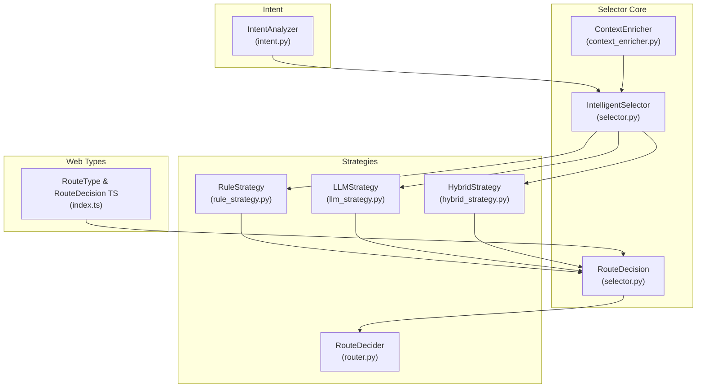
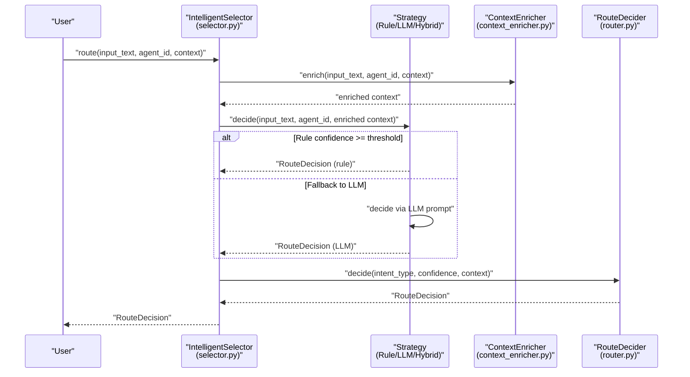
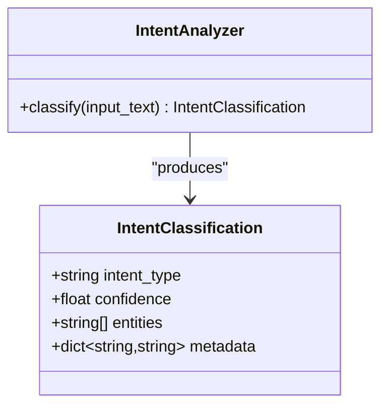
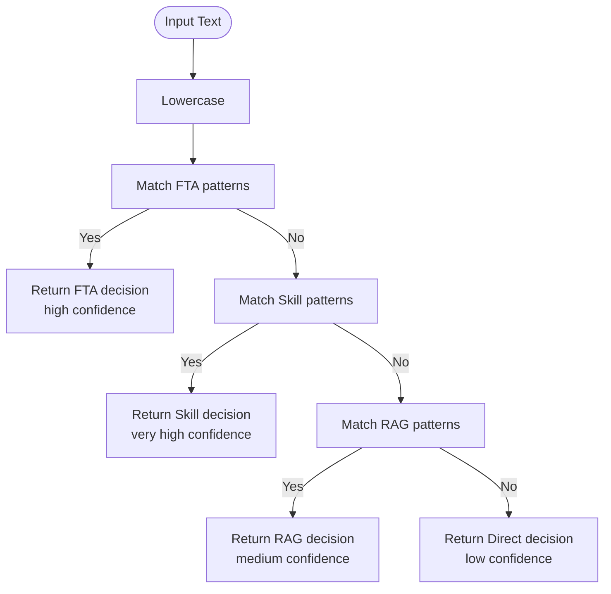
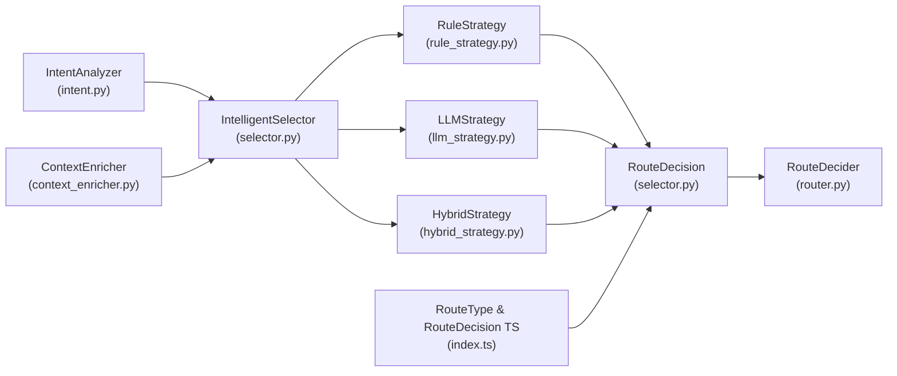

# Intent Analysis

<cite>
**Referenced Files in This Document**
- [intent.py](file://python/src/resolvenet/selector/intent.py)
- [selector.py](file://python/src/resolvenet/selector/selector.py)
- [router.py](file://python/src/resolvenet/selector/router.py)
- [rule_strategy.py](file://python/src/resolvenet/selector/strategies/rule_strategy.py)
- [llm_strategy.py](file://python/src/resolvenet/selector/strategies/llm_strategy.py)
- [hybrid_strategy.py](file://python/src/resolvenet/selector/strategies/hybrid_strategy.py)
- [context_enricher.py](file://python/src/resolvenet/selector/context_enricher.py)
- [test_selector.py](file://python/tests/unit/test_selector.py)
- [index.ts](file://web/src/types/index.ts)
- [intelligent-selector.md](file://docs/zh/intelligent-selector.md)
</cite>

## Table of Contents
1. [Introduction](#introduction)
2. [Project Structure](#project-structure)
3. [Core Components](#core-components)
4. [Architecture Overview](#architecture-overview)
5. [Detailed Component Analysis](#detailed-component-analysis)
6. [Dependency Analysis](#dependency-analysis)
7. [Performance Considerations](#performance-considerations)
8. [Troubleshooting Guide](#troubleshooting-guide)
9. [Conclusion](#conclusion)
10. [Appendices](#appendices)

## Introduction
This document describes the intent analysis component that classifies user requests and extracts semantic meaning for routing decisions. It explains the intent classification algorithms and natural language processing techniques used, documents intent detection patterns for different request types (FTA queries, skill requests, RAG questions, and direct LLM interactions), details the intent scoring mechanism and confidence thresholds, and outlines examples, edge cases, ambiguity resolution, and configuration options for intent detection and performance optimization.

## Project Structure
The intent analysis and routing pipeline resides in the Python selector module and integrates with frontend types and documentation.

**Diagram sources**
- [selector.py:24-100](file://python/src/resolvenet/selector/selector.py#L24-L100)
- [intent.py:17-38](file://python/src/resolvenet/selector/intent.py#L17-L38)
- [rule_strategy.py:11-77](file://python/src/resolvenet/selector/strategies/rule_strategy.py#L11-L77)
- [llm_strategy.py:10-44](file://python/src/resolvenet/selector/strategies/llm_strategy.py#L10-L44)
- [hybrid_strategy.py:12-42](file://python/src/resolvenet/selector/strategies/hybrid_strategy.py#L12-L42)
- [router.py:10-40](file://python/src/resolvenet/selector/router.py#L10-L40)
- [context_enricher.py:8-47](file://python/src/resolvenet/selector/context_enricher.py#L8-L47)
- [index.ts:6-15](file://web/src/types/index.ts#L6-L15)

**Section sources**
- [selector.py:24-100](file://python/src/resolvenet/selector/selector.py#L24-L100)
- [intent.py:17-38](file://python/src/resolvenet/selector/intent.py#L17-L38)
- [rule_strategy.py:11-77](file://python/src/resolvenet/selector/strategies/rule_strategy.py#L11-L77)
- [llm_strategy.py:10-44](file://python/src/resolvenet/selector/strategies/llm_strategy.py#L10-L44)
- [hybrid_strategy.py:12-42](file://python/src/resolvenet/selector/strategies/hybrid_strategy.py#L12-L42)
- [router.py:10-40](file://python/src/resolvenet/selector/router.py#L10-L40)
- [context_enricher.py:8-47](file://python/src/resolvenet/selector/context_enricher.py#L8-L47)
- [index.ts:6-15](file://web/src/types/index.ts#L6-L15)

## Core Components
- IntentClassification: Lightweight Pydantic model capturing intent_type, confidence, extracted entities, and metadata.
- IntentAnalyzer: Async analyzer interface for intent classification; currently a placeholder returning a default classification.
- IntelligentSelector: Orchestrator implementing three routing strategies (rule, LLM, hybrid) and emitting RouteDecision.
- Strategy implementations:
  - RuleStrategy: Pattern-matching rules for FTA, skill, and RAG with explicit confidence scores.
  - LLMStrategy: Prompt-driven routing with placeholders for skills/workflows/collections.
  - HybridStrategy: Applies RuleStrategy first; if confidence is below threshold, falls back to LLMStrategy.
- ContextEnricher: Placeholder for enriching context with available skills, workflows, RAG collections, and conversation history.
- RouteDecider: Final decision maker that maps intent and confidence to a RouteDecision.

Key behaviors:
- Confidence thresholds and routing targets are strategy-specific.
- RouteDecision carries route_type, route_target, confidence, parameters, reasoning, and optional chain for multi-step routing.

**Section sources**
- [intent.py:8-38](file://python/src/resolvenet/selector/intent.py#L8-L38)
- [selector.py:13-100](file://python/src/resolvenet/selector/selector.py#L13-L100)
- [rule_strategy.py:11-77](file://python/src/resolvenet/selector/strategies/rule_strategy.py#L11-L77)
- [llm_strategy.py:10-44](file://python/src/resolvenet/selector/strategies/llm_strategy.py#L10-L44)
- [hybrid_strategy.py:12-42](file://python/src/resolvenet/selector/strategies/hybrid_strategy.py#L12-L42)
- [context_enricher.py:8-47](file://python/src/resolvenet/selector/context_enricher.py#L8-L47)
- [router.py:10-40](file://python/src/resolvenet/selector/router.py#L10-L40)

## Architecture Overview
The Intelligent Selector follows a staged pipeline:
1. Intent Analysis: Extract intent type and entities from user input.
2. Context Enrichment: Augment with agent capabilities and history.
3. Route Decision: Choose among FTA, skill, RAG, multi-step, or direct.

**Diagram sources**
- [selector.py:43-100](file://python/src/resolvenet/selector/selector.py#L43-L100)
- [rule_strategy.py:35-77](file://python/src/resolvenet/selector/strategies/rule_strategy.py#L35-L77)
- [llm_strategy.py:33-44](file://python/src/resolvenet/selector/strategies/llm_strategy.py#L33-L44)
- [hybrid_strategy.py:27-42](file://python/src/resolvenet/selector/strategies/hybrid_strategy.py#L27-L42)
- [context_enricher.py:16-47](file://python/src/resolvenet/selector/context_enricher.py#L16-L47)
- [router.py:17-40](file://python/src/resolvenet/selector/router.py#L17-L40)

## Detailed Component Analysis

### Intent Classification Model
IntentClassification captures:
- intent_type: String label for the detected intent category.
- confidence: Float score in [0, 1].
- entities: List of extracted semantic entities.
- metadata: Arbitrary key-value pairs for auxiliary information.

IntentAnalyzer is currently a placeholder that returns a default classification. Future implementations may integrate NLP preprocessing, entity extraction, and LLM-based classification.

**Diagram sources**
- [intent.py:8-38](file://python/src/resolvenet/selector/intent.py#L8-L38)

**Section sources**
- [intent.py:8-38](file://python/src/resolvenet/selector/intent.py#L8-L38)

### Rule-Based Strategy (RuleStrategy)
Pattern-based classification with explicit confidence values:
- FTA patterns: High confidence (e.g., diagnostic/root-cause terms).
- Skill patterns: Very high confidence (e.g., code execution, file operations, web search).
- RAG patterns: Medium confidence (e.g., explanatory queries, knowledge references).
- Default: Low confidence direct route when no patterns match.

Confidence thresholds:
- HybridStrategy uses a configurable threshold to decide between rule and LLM fallback.

**Diagram sources**
- [rule_strategy.py:35-77](file://python/src/resolvenet/selector/strategies/rule_strategy.py#L35-L77)

**Section sources**
- [rule_strategy.py:11-77](file://python/src/resolvenet/selector/strategies/rule_strategy.py#L11-L77)
- [hybrid_strategy.py:21](file://python/src/resolvenet/selector/strategies/hybrid_strategy.py#L21)

### LLM-Based Strategy (LLMStrategy)
Prompt-driven classification that considers available skills, workflows, and RAG collections. Currently a placeholder that returns a default decision until the LLM call is implemented.

Routing categories supported by the prompt:
- fta: Structured decision trees, root cause analysis, multi-step diagnostics.
- skill: Specific tool execution (web search, code execution, file operations).
- rag: Knowledge retrieval, document Q&A, information lookup.
- direct: General conversation, simple questions, creative tasks.

**Section sources**
- [llm_strategy.py:10-44](file://python/src/resolvenet/selector/strategies/llm_strategy.py#L10-L44)

### Hybrid Strategy (HybridStrategy)
Combination of rule-first and LLM fallback:
- Executes RuleStrategy first.
- If confidence meets or exceeds threshold, returns rule decision.
- Otherwise, executes LLMStrategy and returns its decision.

Threshold value is defined in the hybrid strategy.

**Section sources**
- [hybrid_strategy.py:12-42](file://python/src/resolvenet/selector/strategies/hybrid_strategy.py#L12-L42)

### Context Enrichment (ContextEnricher)
Placeholder for enriching the routing context with:
- Available skills
- Active workflows
- RAG collections
- Conversation history

Future implementations will fetch these from registries and storage.

**Section sources**
- [context_enricher.py:8-47](file://python/src/resolvenet/selector/context_enricher.py#L8-L47)

### Route Decision and Final Routing (RouteDecider)
RouteDecider consumes intent_type and confidence along with context to produce a RouteDecision. The current implementation defaults to direct routing but can be extended to incorporate intent analysis results.

RouteDecision fields:
- route_type: One of fta, skill, rag, multi, direct.
- route_target: Optional target identifier (e.g., skill name, workflow ID).
- confidence: Score associated with the decision.
- parameters: Optional arguments for the chosen route.
- reasoning: Human-readable explanation.
- chain: Optional ordered list of decisions for multi-step routing.

Frontend types align with these semantics.

**Section sources**
- [selector.py:13-22](file://python/src/resolvenet/selector/selector.py#L13-L22)
- [router.py:10-40](file://python/src/resolvenet/selector/router.py#L10-L40)
- [index.ts:6-15](file://web/src/types/index.ts#L6-L15)

## Dependency Analysis
High-level dependencies among selector components:

**Diagram sources**
- [selector.py:24-100](file://python/src/resolvenet/selector/selector.py#L24-L100)
- [intent.py:17-38](file://python/src/resolvenet/selector/intent.py#L17-L38)
- [rule_strategy.py:11-77](file://python/src/resolvenet/selector/strategies/rule_strategy.py#L11-L77)
- [llm_strategy.py:10-44](file://python/src/resolvenet/selector/strategies/llm_strategy.py#L10-L44)
- [hybrid_strategy.py:12-42](file://python/src/resolvenet/selector/strategies/hybrid_strategy.py#L12-L42)
- [router.py:10-40](file://python/src/resolvenet/selector/router.py#L10-L40)
- [context_enricher.py:8-47](file://python/src/resolvenet/selector/context_enricher.py#L8-L47)
- [index.ts:6-15](file://web/src/types/index.ts#L6-L15)

**Section sources**
- [selector.py:24-100](file://python/src/resolvenet/selector/selector.py#L24-L100)
- [intent.py:17-38](file://python/src/resolvenet/selector/intent.py#L17-L38)
- [rule_strategy.py:11-77](file://python/src/resolvenet/selector/strategies/rule_strategy.py#L11-L77)
- [llm_strategy.py:10-44](file://python/src/resolvenet/selector/strategies/llm_strategy.py#L10-L44)
- [hybrid_strategy.py:12-42](file://python/src/resolvenet/selector/strategies/hybrid_strategy.py#L12-L42)
- [router.py:10-40](file://python/src/resolvenet/selector/router.py#L10-L40)
- [context_enricher.py:8-47](file://python/src/resolvenet/selector/context_enricher.py#L8-L47)
- [index.ts:6-15](file://web/src/types/index.ts#L6-L15)

## Performance Considerations
- Strategy selection:
  - RuleStrategy is fast and deterministic; use for high-confidence, known patterns.
  - LLMStrategy offers flexibility but adds latency; reserve for ambiguous cases.
  - HybridStrategy optimizes throughput by preferring rules and falling back only when needed.
- Confidence threshold tuning:
  - Adjust HybridStrategy’s threshold to balance speed vs accuracy.
- Context enrichment:
  - Defer heavy operations; cache frequently accessed metadata.
- Logging and observability:
  - Use built-in logging and metrics to monitor decision latency and fallback frequency.

[No sources needed since this section provides general guidance]

## Troubleshooting Guide
Common issues and resolutions:
- Low confidence decisions:
  - Verify pattern coverage in RuleStrategy; expand patterns for domain-specific terminology.
  - Consider raising the HybridStrategy threshold to force LLM fallback for borderline cases.
- Ambiguous intent:
  - Add explicit patterns for edge cases (e.g., mixed intent signals).
  - Enable debug mode to inspect decision traces and adjust thresholds.
- Incorrect routing:
  - Review RouteDecision reasoning and confidence values.
  - Ensure context enrichment supplies accurate capability lists.
- Testing:
  - Use unit tests to validate strategy behavior under various inputs.

**Section sources**
- [test_selector.py:8-30](file://python/tests/unit/test_selector.py#L8-L30)
- [intelligent-selector.md:518-551](file://docs/zh/intelligent-selector.md#L518-L551)

## Conclusion
The intent analysis and routing system provides a modular, extensible framework. Current implementations focus on rule-based classification and placeholder LLM routing. The design supports future enhancements such as advanced NLP preprocessing, entity extraction, and robust LLM prompts. By tuning confidence thresholds and expanding pattern coverage, teams can achieve accurate, performant routing across FTA, skills, RAG, and direct interactions.

[No sources needed since this section summarizes without analyzing specific files]

## Appendices

### Intent Detection Patterns and Categories
- FTA queries: Root cause analysis, diagnostics, structured troubleshooting.
- Skill requests: Tool execution (web search, code execution, file operations).
- RAG questions: Information retrieval, document Q&A, explanatory queries.
- Direct LLM interactions: General conversation, simple questions, creative tasks.

**Section sources**
- [rule_strategy.py:18-33](file://python/src/resolvenet/selector/strategies/rule_strategy.py#L18-L33)
- [llm_strategy.py:17-31](file://python/src/resolvenet/selector/strategies/llm_strategy.py#L17-L31)

### Intent Scoring and Confidence Thresholds
- RuleStrategy assigns explicit confidence scores per category.
- HybridStrategy applies a configurable threshold to select rule vs LLM fallback.
- RouteDecision carries confidence and reasoning for downstream consumers.

**Section sources**
- [rule_strategy.py:41-76](file://python/src/resolvenet/selector/strategies/rule_strategy.py#L41-L76)
- [hybrid_strategy.py:21](file://python/src/resolvenet/selector/strategies/hybrid_strategy.py#L21)
- [selector.py:13-22](file://python/src/resolvenet/selector/selector.py#L13-L22)

### Examples of Intent Analysis in Action
- Rule-based routing examples and expected RouteDecision structures are documented in the selector guide.
- Multi-step routing demonstrates chaining decisions for composite tasks.

**Section sources**
- [intelligent-selector.md:234-286](file://docs/zh/intelligent-selector.md#L234-L286)
- [intelligent-selector.md:246-270](file://docs/zh/intelligent-selector.md#L246-L270)

### Edge Case Handling and Fallback Strategies
- No-match fallback to direct routing with low confidence.
- HybridStrategy fallback to LLM for ambiguous cases.
- RouteDecider can be extended to incorporate intent analysis results.

**Section sources**
- [rule_strategy.py:71-76](file://python/src/resolvenet/selector/strategies/rule_strategy.py#L71-L76)
- [hybrid_strategy.py:34-41](file://python/src/resolvenet/selector/strategies/hybrid_strategy.py#L34-L41)
- [router.py:33-39](file://python/src/resolvenet/selector/router.py#L33-L39)

### Configuration Options for Intent Detection
- Strategy selection: rule, llm, hybrid (default).
- Hybrid threshold tuning for balancing speed and accuracy.
- Context enrichment sources: skills, workflows, RAG collections, conversation history.

**Section sources**
- [selector.py:35-41](file://python/src/resolvenet/selector/selector.py#L35-L41)
- [hybrid_strategy.py:21](file://python/src/resolvenet/selector/strategies/hybrid_strategy.py#L21)
- [context_enricher.py:32-46](file://python/src/resolvenet/selector/context_enricher.py#L32-L46)