# Route Decision Algorithm

<cite>
**Referenced Files in This Document**
- [router.py](file://python/src/resolvenet/selector/router.py)
- [selector.py](file://python/src/resolvenet/selector/selector.py)
- [intent.py](file://python/src/resolvenet/selector/intent.py)
- [context_enricher.py](file://python/src/resolvenet/selector/context_enricher.py)
- [hybrid_strategy.py](file://python/src/resolvenet/selector/strategies/hybrid_strategy.py)
- [llm_strategy.py](file://python/src/resolvenet/selector/strategies/llm_strategy.py)
- [rule_strategy.py](file://python/src/resolvenet/selector/strategies/rule_strategy.py)
- [engine.py](file://python/src/resolvenet/fta/engine.py)
- [tree.py](file://python/src/resolvenet/fta/tree.py)
- [model_router.go](file://pkg/gateway/model_router.go)
- [client.go](file://pkg/gateway/client.go)
- [route_sync.go](file://pkg/gateway/route_sync.go)
</cite>

## Table of Contents
1. [Introduction](#introduction)
2. [Project Structure](#project-structure)
3. [Core Components](#core-components)
4. [Architecture Overview](#architecture-overview)
5. [Detailed Component Analysis](#detailed-component-analysis)
6. [Dependency Analysis](#dependency-analysis)
7. [Performance Considerations](#performance-considerations)
8. [Troubleshooting Guide](#troubleshooting-guide)
9. [Conclusion](#conclusion)
10. [Appendices](#appendices)

## Introduction
This document describes the route decision algorithm that selects the optimal execution path for user requests. The system performs three-stage processing:
- Intent analysis: classifies the user’s goal and associated confidence
- Context enrichment: augments the request with agent capabilities, history, and available resources
- Route decision: chooses among FTA, Skills, RAG, Direct, or Multi-path execution

The decision logic supports pluggable strategies (rule-based, LLM-based, and hybrid), confidence thresholds, and multi-route chaining for complex scenarios. It also outlines how the gateway integrates with upstream providers and how the FTA engine executes structured workflows.

## Project Structure
The routing pipeline is primarily implemented in Python under the selector package, with supporting FTA execution and gateway integration in Go.

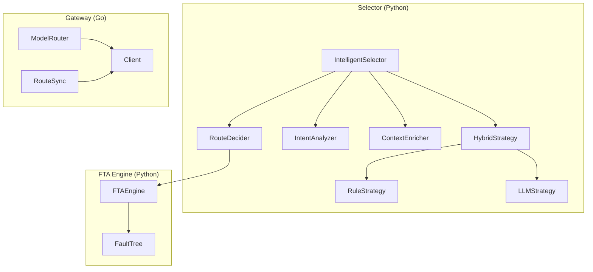

**Diagram sources**
- [selector.py:24-100](file://python/src/resolvenet/selector/selector.py#L24-L100)
- [router.py:10-40](file://python/src/resolvenet/selector/router.py#L10-L40)
- [intent.py:17-39](file://python/src/resolvenet/selector/intent.py#L17-L39)
- [context_enricher.py:8-47](file://python/src/resolvenet/selector/context_enricher.py#L8-L47)
- [hybrid_strategy.py:12-42](file://python/src/resolvenet/selector/strategies/hybrid_strategy.py#L12-L42)
- [rule_strategy.py:11-77](file://python/src/resolvenet/selector/strategies/rule_strategy.py#L11-L77)
- [llm_strategy.py:10-44](file://python/src/resolvenet/selector/strategies/llm_strategy.py#L10-L44)
- [engine.py:14-83](file://python/src/resolvenet/fta/engine.py#L14-L83)
- [tree.py:81-120](file://python/src/resolvenet/fta/tree.py#L81-L120)
- [model_router.go:19-39](file://pkg/gateway/model_router.go#L19-L39)
- [client.go:9-31](file://pkg/gateway/client.go#L9-L31)
- [route_sync.go:8-28](file://pkg/gateway/route_sync.go#L8-L28)

**Section sources**
- [selector.py:24-100](file://python/src/resolvenet/selector/selector.py#L24-L100)
- [engine.py:14-83](file://python/src/resolvenet/fta/engine.py#L14-L83)
- [model_router.go:19-39](file://pkg/gateway/model_router.go#L19-L39)

## Core Components
- IntelligentSelector orchestrates the three-stage pipeline and delegates to selected strategies.
- RouteDecision encapsulates the chosen path, target, confidence, reasoning, and optional chain of decisions.
- IntentAnalyzer classifies intent and confidence; currently defaults to a placeholder.
- ContextEnricher augments context with available skills, workflows, RAG collections, and conversation history.
- Strategies:
  - RuleStrategy: fast pattern-matching rules with fixed confidence targets
  - LLMStrategy: prompts an LLM to classify route type and confidence
  - HybridStrategy: tries rules first; falls back to LLM above a threshold
- RouteDecider finalizes the decision and can construct multi-route chains.
- FTAEngine executes structured fault trees and yields progress events.
- Gateway components (ModelRouter, RouteSync, Client) manage upstream provider routing and synchronization.

**Section sources**
- [selector.py:13-100](file://python/src/resolvenet/selector/selector.py#L13-L100)
- [router.py:10-40](file://python/src/resolvenet/selector/router.py#L10-L40)
- [intent.py:8-39](file://python/src/resolvenet/selector/intent.py#L8-L39)
- [context_enricher.py:8-47](file://python/src/resolvenet/selector/context_enricher.py#L8-L47)
- [rule_strategy.py:11-77](file://python/src/resolvenet/selector/strategies/rule_strategy.py#L11-L77)
- [llm_strategy.py:10-44](file://python/src/resolvenet/selector/strategies/llm_strategy.py#L10-L44)
- [hybrid_strategy.py:12-42](file://python/src/resolvenet/selector/strategies/hybrid_strategy.py#L12-L42)
- [engine.py:14-83](file://python/src/resolvenet/fta/engine.py#L14-L83)
- [tree.py:30-120](file://python/src/resolvenet/fta/tree.py#L30-L120)
- [model_router.go:8-39](file://pkg/gateway/model_router.go#L8-L39)
- [route_sync.go:8-28](file://pkg/gateway/route_sync.go#L8-L28)
- [client.go:9-31](file://pkg/gateway/client.go#L9-L31)

## Architecture Overview
The route decision algorithm follows a staged pipeline with pluggable strategies and optional multi-path chaining.

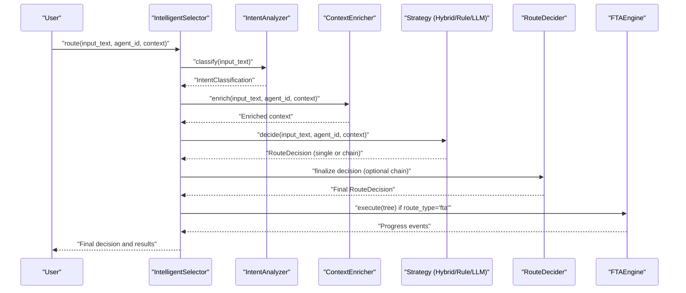

**Diagram sources**
- [selector.py:43-100](file://python/src/resolvenet/selector/selector.py#L43-L100)
- [intent.py:24-39](file://python/src/resolvenet/selector/intent.py#L24-L39)
- [context_enricher.py:16-47](file://python/src/resolvenet/selector/context_enricher.py#L16-L47)
- [hybrid_strategy.py:27-42](file://python/src/resolvenet/selector/strategies/hybrid_strategy.py#L27-L42)
- [rule_strategy.py:35-77](file://python/src/resolvenet/selector/strategies/rule_strategy.py#L35-L77)
- [llm_strategy.py:33-44](file://python/src/resolvenet/selector/strategies/llm_strategy.py#L33-L44)
- [router.py:17-40](file://python/src/resolvenet/selector/router.py#L17-L40)
- [engine.py:24-83](file://python/src/resolvenet/fta/engine.py#L24-L83)

## Detailed Component Analysis

### RouteDecision Model and Multi-Path Chaining
RouteDecision carries:
- route_type: "fta", "skill", "rag", "direct", or "multi"
- route_target: optional identifier for the specific target (e.g., skill/workflow/collection)
- confidence: numeric score representing certainty
- parameters: optional payload for downstream execution
- reasoning: human-readable explanation of the decision
- chain: ordered list of RouteDecision for multi-step workflows

Multi-path chaining enables complex scenarios where a single decision spawns sub-decisions, each with its own confidence and target.

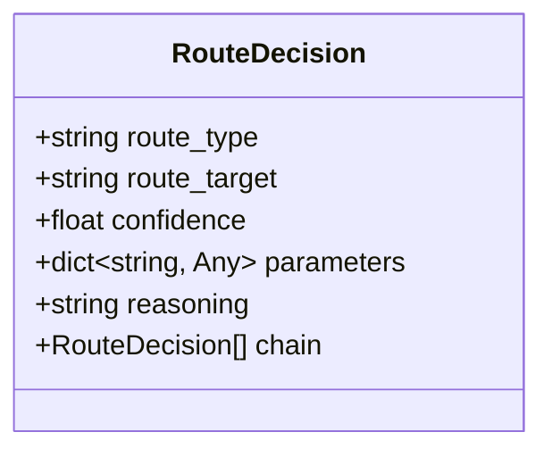

**Diagram sources**
- [selector.py:13-22](file://python/src/resolvenet/selector/selector.py#L13-L22)

**Section sources**
- [selector.py:13-22](file://python/src/resolvenet/selector/selector.py#L13-L22)

### Intent Analysis
IntentAnalyzer produces intent_type and confidence. Current implementation returns a default classification; future versions will integrate LLM-based classification.

Decision criteria:
- intent_type: categorized action (e.g., general, diagnostic, informational)
- confidence: normalized score indicating classification certainty

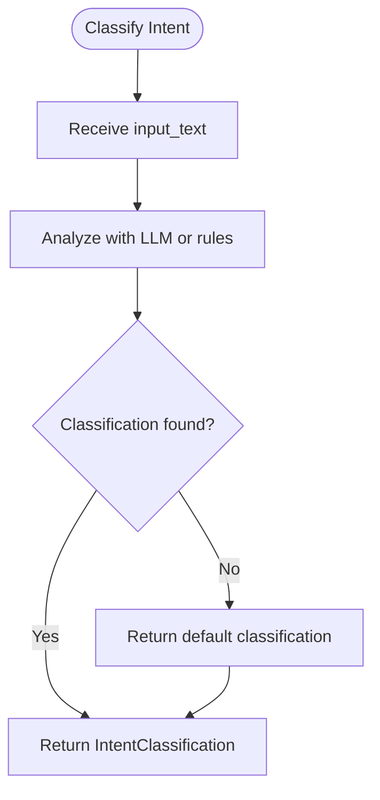

**Diagram sources**
- [intent.py:24-39](file://python/src/resolvenet/selector/intent.py#L24-L39)

**Section sources**
- [intent.py:8-39](file://python/src/resolvenet/selector/intent.py#L8-L39)

### Context Enrichment
ContextEnricher augments the request with:
- available_skills: list of installed skills
- active_workflows: active workflow identifiers
- rag_collections: available RAG collection summaries
- conversation_history: recent exchanges for grounding

This context informs downstream strategies and improves decision quality.

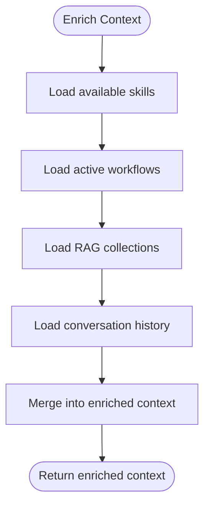

**Diagram sources**
- [context_enricher.py:16-47](file://python/src/resolvenet/selector/context_enricher.py#L16-L47)

**Section sources**
- [context_enricher.py:8-47](file://python/src/resolvenet/selector/context_enricher.py#L8-L47)

### Strategy Layer: Rule-Based Routing
RuleStrategy applies pattern matching to detect intent categories:
- FTA patterns: structured diagnostics and root cause analysis
- Skill patterns: tool execution (web search, code execution, file operations)
- RAG patterns: knowledge-intensive queries

Confidence scores are fixed per category to reflect high certainty for strong matches.

Decision criteria:
- Match any FTA pattern → route_type="fta", confidence=0.8
- Match any skill pattern → route_type="skill", confidence=0.85
- Match any RAG pattern → route_type="rag", confidence=0.6
- No match → route_type="direct", confidence=0.3

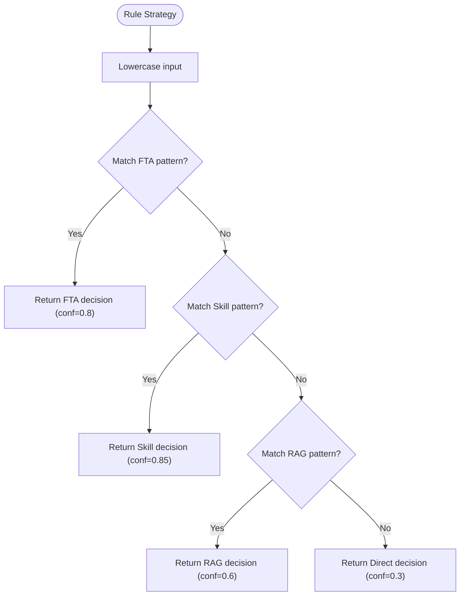

**Diagram sources**
- [rule_strategy.py:35-77](file://python/src/resolvenet/selector/strategies/rule_strategy.py#L35-L77)

**Section sources**
- [rule_strategy.py:11-77](file://python/src/resolvenet/selector/strategies/rule_strategy.py#L11-L77)

### Strategy Layer: LLM-Based Routing
LLMStrategy uses a structured prompt to classify route_type, route_target, confidence, and reasoning. It is suitable for ambiguous or open-ended requests.

Decision criteria:
- route_type: constrained to supported categories
- route_target: optional identifier for the chosen target
- confidence: numeric score from LLM
- reasoning: textual explanation

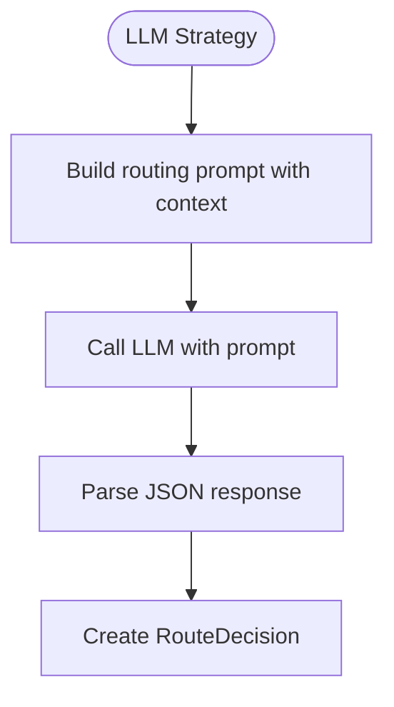

**Diagram sources**
- [llm_strategy.py:17-44](file://python/src/resolvenet/selector/strategies/llm_strategy.py#L17-L44)

**Section sources**
- [llm_strategy.py:10-44](file://python/src/resolvenet/selector/strategies/llm_strategy.py#L10-L44)

### Strategy Layer: Hybrid Routing
HybridStrategy combines rule-based speed with LLM-based flexibility:
- Try RuleStrategy first
- If confidence ≥ threshold (0.7), accept rule decision
- Else, call LLMStrategy and return its decision

Decision criteria:
- Threshold: 0.7
- Fast path: rule-based decisions
- Fallback path: LLM-based decisions

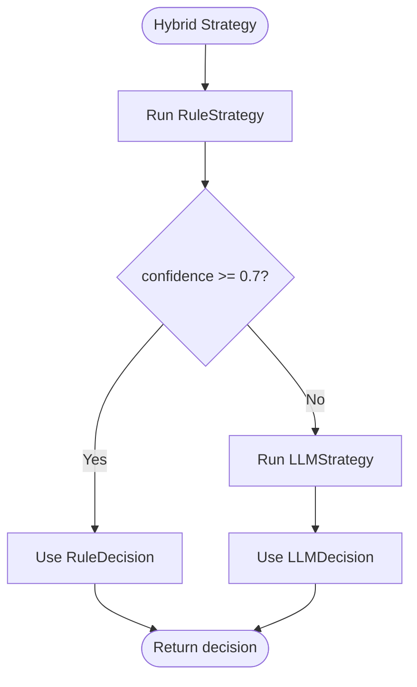

**Diagram sources**
- [hybrid_strategy.py:27-42](file://python/src/resolvenet/selector/strategies/hybrid_strategy.py#L27-L42)

**Section sources**
- [hybrid_strategy.py:12-42](file://python/src/resolvenet/selector/strategies/hybrid_strategy.py#L12-L42)

### RouteDecider: Final Decision and Chain Construction
RouteDecider consumes intent_type, confidence, and enriched context to finalize the route. It currently defaults to direct responses but is designed to support sophisticated logic and multi-route chaining.

Decision criteria:
- intent_type and confidence from IntentAnalyzer
- enriched context from ContextEnricher
- route_type, route_target, confidence, reasoning, chain from strategies
- optional construction of a chain of RouteDecision for multi-step workflows

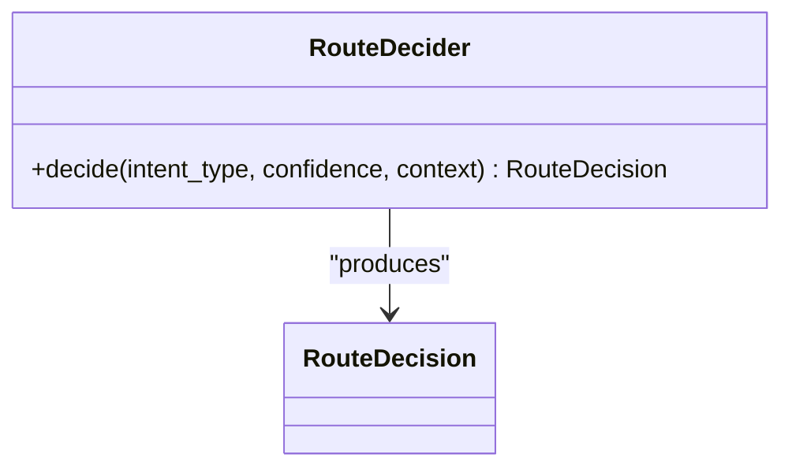

**Diagram sources**
- [router.py:10-40](file://python/src/resolvenet/selector/router.py#L10-L40)

**Section sources**
- [router.py:10-40](file://python/src/resolvenet/selector/router.py#L10-L40)

### FTA Engine: Structured Workflow Execution
FTAEngine executes structured fault trees:
- Evaluates basic events (leaves)
- Propagates through gates bottom-up
- Emits progress events during execution

Decision criteria:
- Event types: top, intermediate, basic, undeveloped, conditioning
- Gate types: and, or, voting, inhibit, priority_and
- Bottom-up evaluation order for gates

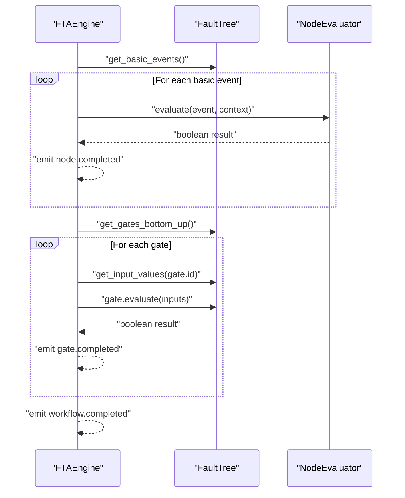

**Diagram sources**
- [engine.py:24-83](file://python/src/resolvenet/fta/engine.py#L24-L83)
- [tree.py:92-120](file://python/src/resolvenet/fta/tree.py#L92-L120)

**Section sources**
- [engine.py:14-83](file://python/src/resolvenet/fta/engine.py#L14-L83)
- [tree.py:30-120](file://python/src/resolvenet/fta/tree.py#L30-L120)

### Gateway Integration: Provider Routing and Synchronization
Gateway components manage upstream provider routing:
- ModelRouter: defines routes to providers and syncs with Higress
- Client: health checks and admin API communication
- RouteSync: ensures API routes are registered in Higress

Decision criteria:
- Provider selection by name and priority
- Enabled/disabled toggles
- Upstream URL and API key configuration

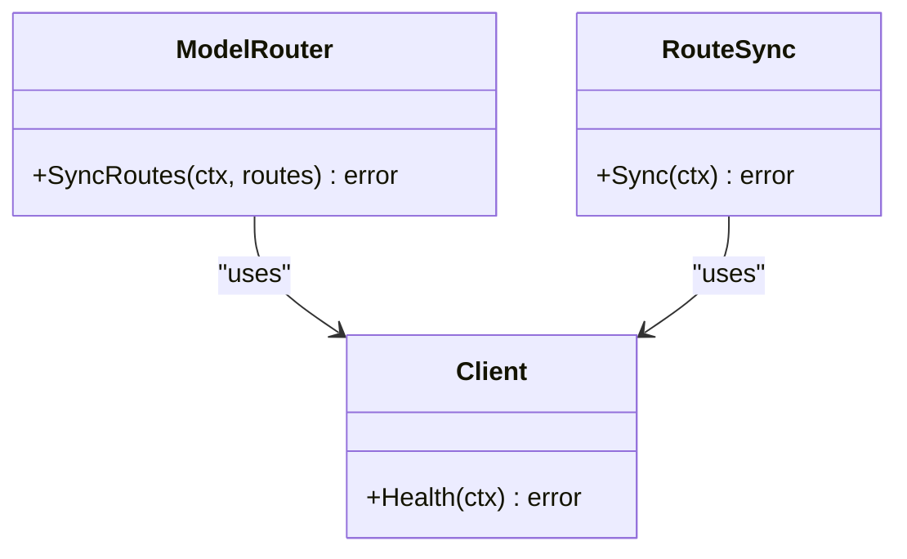

**Diagram sources**
- [model_router.go:19-39](file://pkg/gateway/model_router.go#L19-L39)
- [client.go:25-31](file://pkg/gateway/client.go#L25-L31)
- [route_sync.go:22-28](file://pkg/gateway/route_sync.go#L22-L28)

**Section sources**
- [model_router.go:8-39](file://pkg/gateway/model_router.go#L8-L39)
- [client.go:9-31](file://pkg/gateway/client.go#L9-L31)
- [route_sync.go:8-28](file://pkg/gateway/route_sync.go#L8-L28)

## Dependency Analysis
The selector pipeline composes multiple strategies and models, while the gateway integrates with external systems.

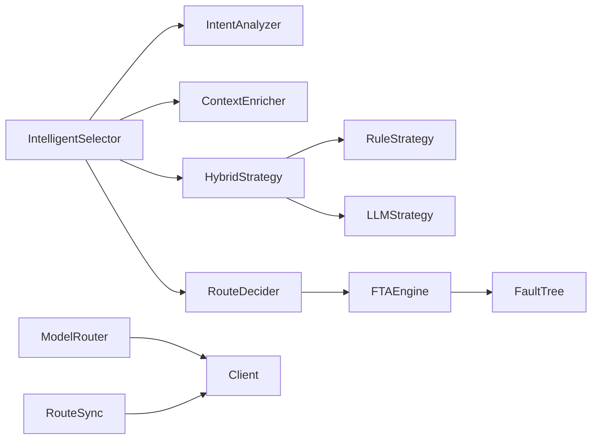

**Diagram sources**
- [selector.py:43-100](file://python/src/resolvenet/selector/selector.py#L43-L100)
- [hybrid_strategy.py:23-26](file://python/src/resolvenet/selector/strategies/hybrid_strategy.py#L23-L26)
- [rule_strategy.py:35-77](file://python/src/resolvenet/selector/strategies/rule_strategy.py#L35-L77)
- [llm_strategy.py:33-44](file://python/src/resolvenet/selector/strategies/llm_strategy.py#L33-L44)
- [router.py:17-40](file://python/src/resolvenet/selector/router.py#L17-L40)
- [engine.py:24-83](file://python/src/resolvenet/fta/engine.py#L24-L83)
- [tree.py:81-120](file://python/src/resolvenet/fta/tree.py#L81-L120)
- [model_router.go:19-39](file://pkg/gateway/model_router.go#L19-L39)
- [route_sync.go:22-28](file://pkg/gateway/route_sync.go#L22-L28)
- [client.go:25-31](file://pkg/gateway/client.go#L25-L31)

**Section sources**
- [selector.py:43-100](file://python/src/resolvenet/selector/selector.py#L43-L100)
- [engine.py:14-83](file://python/src/resolvenet/fta/engine.py#L14-L83)
- [model_router.go:19-39](file://pkg/gateway/model_router.go#L19-L39)

## Performance Considerations
- Strategy selection:
  - RuleStrategy is fastest and deterministic; use for high-confidence patterns
  - LLMStrategy offers flexibility but adds latency; reserve for ambiguous cases
  - HybridStrategy balances speed and accuracy via a confidence threshold
- Confidence thresholds:
  - Tune threshold (currently 0.7) to trade off latency vs. correctness
- Context enrichment:
  - Minimize expensive lookups; cache frequently accessed data
- FTA execution:
  - Stream progress events to reduce perceived latency
  - Optimize gate evaluation order and input aggregation
- Gateway integration:
  - Batch route updates and avoid redundant sync calls
  - Use health checks to prevent failed upstream calls

[No sources needed since this section provides general guidance]

## Troubleshooting Guide
Common issues and resolutions:
- Low confidence decisions:
  - Increase threshold or expand rule patterns
  - Improve context enrichment to provide more relevant signals
- Ambiguous intent:
  - Enable LLMStrategy fallback in HybridStrategy
  - Enhance intent classification prompt and examples
- Multi-path chains:
  - Validate chain order and dependencies
  - Ensure each decision includes route_target and parameters when needed
- FTA execution stalls:
  - Verify bottom-up gate ordering and input values
  - Confirm evaluator availability for basic events
- Gateway failures:
  - Check Client health and admin URL connectivity
  - Ensure ModelRouter routes are enabled and properly configured

**Section sources**
- [hybrid_strategy.py:21](file://python/src/resolvenet/selector/strategies/hybrid_strategy.py#L21)
- [rule_strategy.py:18-33](file://python/src/resolvenet/selector/strategies/rule_strategy.py#L18-L33)
- [engine.py:62-78](file://python/src/resolvenet/fta/engine.py#L62-L78)
- [client.go:25-31](file://pkg/gateway/client.go#L25-L31)

## Conclusion
The route decision algorithm provides a flexible, extensible framework for selecting execution paths. By combining rule-based determinism, LLM-based adaptability, and multi-path chaining, it supports both simple and complex scenarios. Integrating with the FTA engine and gateway components enables structured workflows and provider routing. Future enhancements should focus on refining intent classification, expanding rule coverage, and optimizing performance through caching and batching.

[No sources needed since this section summarizes without analyzing specific files]

## Appendices

### Decision Criteria and Weighting Mechanisms
- RuleStrategy weights:
  - FTA: high confidence (0.8)
  - Skill: highest confidence (0.85)
  - RAG: moderate confidence (0.6)
  - Default: low confidence (0.3)
- HybridStrategy threshold: 0.7
- LLMStrategy confidence: derived from model output
- RouteDecider chain: optional composition of multiple decisions

**Section sources**
- [rule_strategy.py:44-76](file://python/src/resolvenet/selector/strategies/rule_strategy.py#L44-L76)
- [hybrid_strategy.py:21](file://python/src/resolvenet/selector/strategies/hybrid_strategy.py#L21)
- [llm_strategy.py:39-43](file://python/src/resolvenet/selector/strategies/llm_strategy.py#L39-L43)

### Decision Boundary Handling and Ambiguous Case Resolution
- Decision boundaries:
  - Below threshold: fallback to LLMStrategy
  - No rule match: default to direct response with low confidence
- Ambiguous cases:
  - Use LLMStrategy with explicit routing prompt
  - Include available skills/workflows/collections in prompt context

**Section sources**
- [hybrid_strategy.py:34-41](file://python/src/resolvenet/selector/strategies/hybrid_strategy.py#L34-L41)
- [rule_strategy.py:71-76](file://python/src/resolvenet/selector/strategies/rule_strategy.py#L71-L76)
- [llm_strategy.py:17-31](file://python/src/resolvenet/selector/strategies/llm_strategy.py#L17-L31)

### Examples of Complex Routing Scenarios
- Multi-step diagnosis:
  - Route to FTA with structured tree; chain decisions for each basic event
- Tool-assisted investigation:
  - Route to Skill (e.g., web search) then RAG for verification
- Creative task with constraints:
  - Route to Direct with high confidence; optionally chain to Skill for data retrieval

[No sources needed since this section provides conceptual examples]

### Performance Metrics and Quality Assessment
- Metrics:
  - Decision latency (strategy selection, LLM calls, FTA execution)
  - Confidence distribution across categories
  - Chain length and success rate
  - Gateway sync frequency and errors
- Assessment:
  - A/B test strategy variants
  - Monitor confidence drift and adjust thresholds
  - Track FTA completion rates and gate evaluation times

[No sources needed since this section provides general guidance]