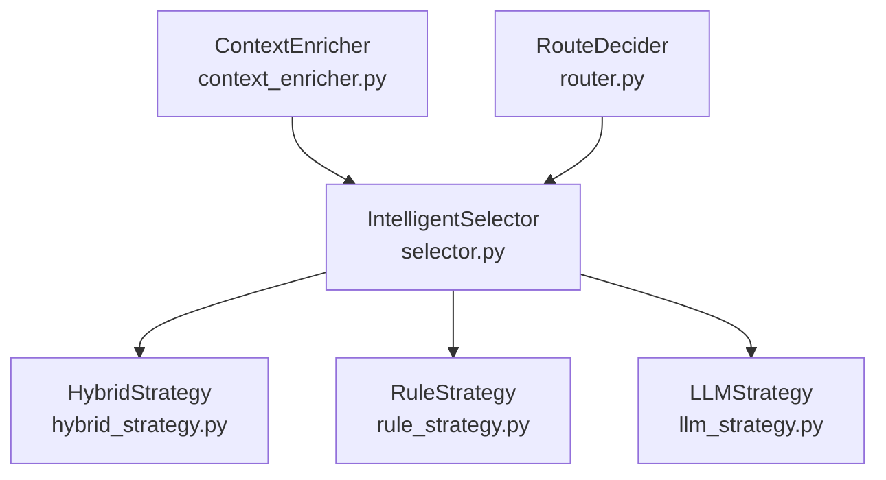
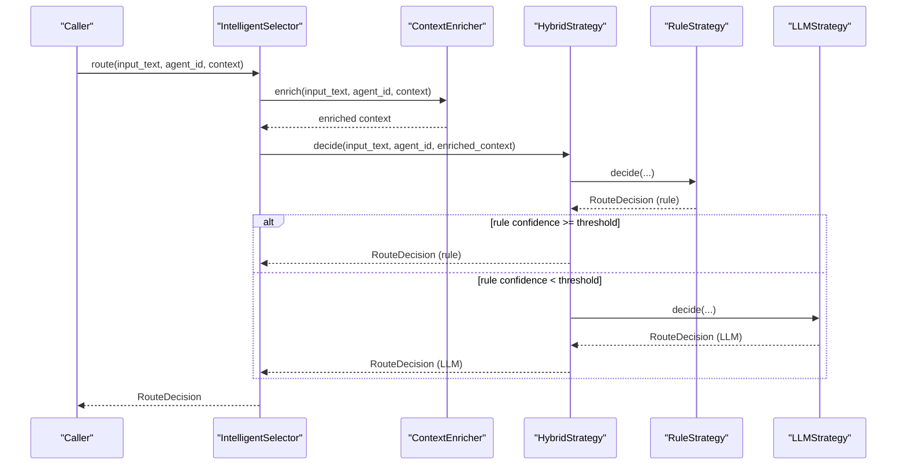
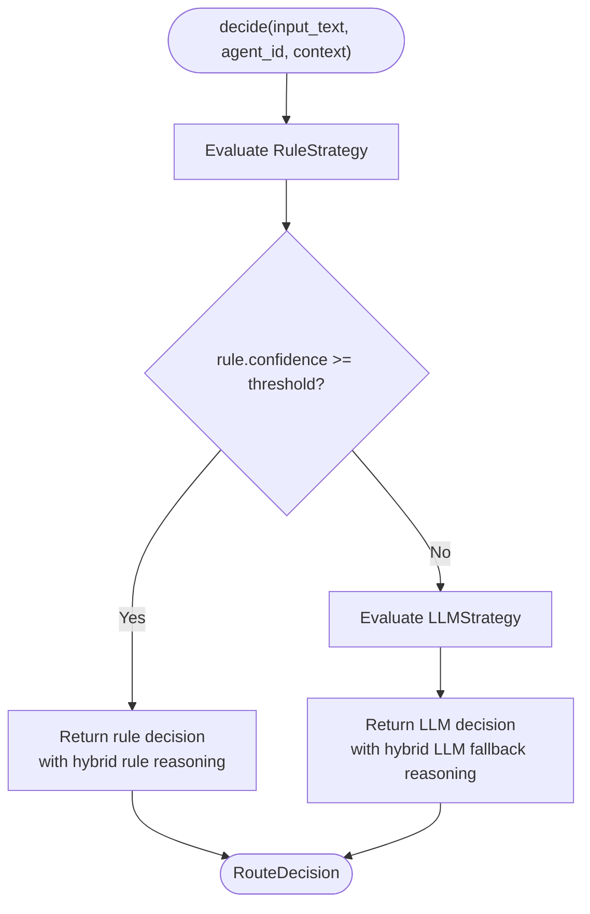
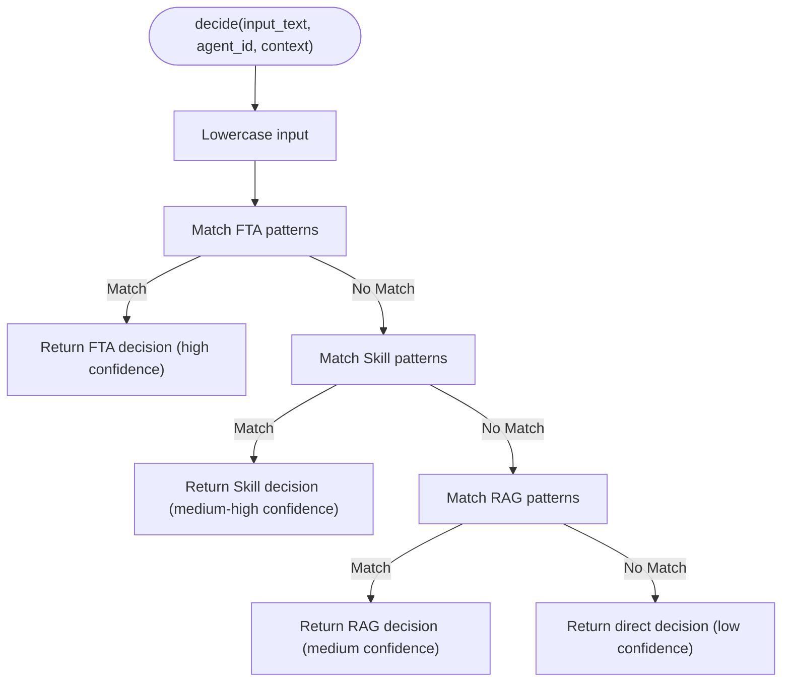
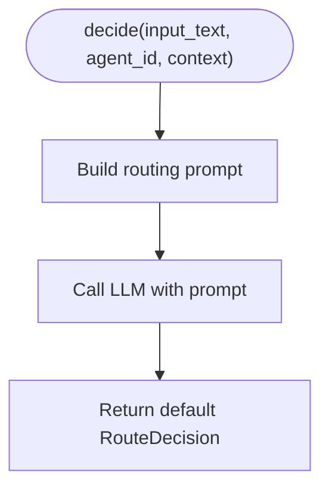
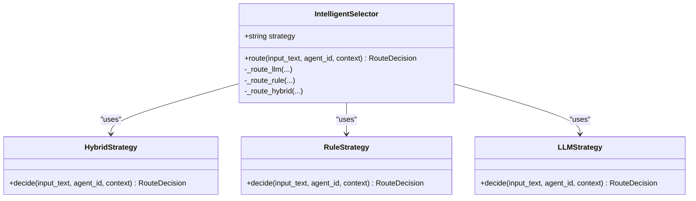
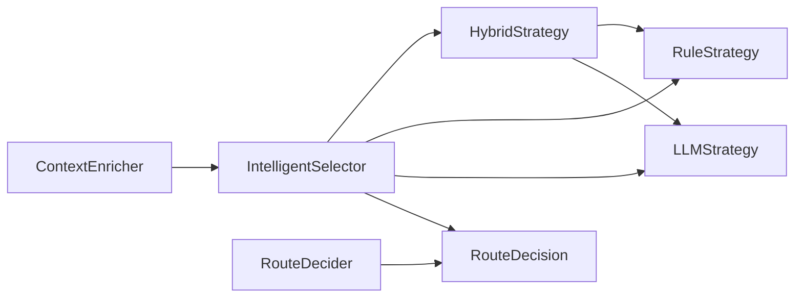

# Hybrid Strategy

<cite>
**Referenced Files in This Document**
- [hybrid_strategy.py](file://python/src/resolvenet/selector/strategies/hybrid_strategy.py)
- [rule_strategy.py](file://python/src/resolvenet/selector/strategies/rule_strategy.py)
- [llm_strategy.py](file://python/src/resolvenet/selector/strategies/llm_strategy.py)
- [selector.py](file://python/src/resolvenet/selector/selector.py)
- [router.py](file://python/src/resolvenet/selector/router.py)
- [context_enricher.py](file://python/src/resolvenet/selector/context_enricher.py)
- [runtime.yaml](file://configs/runtime.yaml)
- [agent-example.yaml](file://configs/examples/agent-example.yaml)
- [intelligent-selector.md](file://docs/zh/intelligent-selector.md)
</cite>

## Table of Contents
1. [Introduction](#introduction)
2. [Project Structure](#project-structure)
3. [Core Components](#core-components)
4. [Architecture Overview](#architecture-overview)
5. [Detailed Component Analysis](#detailed-component-analysis)
6. [Dependency Analysis](#dependency-analysis)
7. [Performance Considerations](#performance-considerations)
8. [Troubleshooting Guide](#troubleshooting-guide)
9. [Conclusion](#conclusion)
10. [Appendices](#appendices)

## Introduction
This document explains the Hybrid routing strategy that combines rule-based and LLM-based approaches. It covers the HybridStrategy class architecture, decision fusion methodology, strategy selection logic, configuration parameters, and operational guidance. The hybrid approach prioritizes fast, deterministic rule-based routing and falls back to LLM classification when rule confidence is insufficient.

## Project Structure
The hybrid routing capability resides in the Python selector module under the strategies package. The IntelligentSelector orchestrates strategy selection and delegates routing decisions to the selected strategy implementation.

**Diagram sources**
- [selector.py:24-100](file://python/src/resolvenet/selector/selector.py#L24-L100)
- [hybrid_strategy.py:12-42](file://python/src/resolvenet/selector/strategies/hybrid_strategy.py#L12-L42)
- [rule_strategy.py:11-77](file://python/src/resolvenet/selector/strategies/rule_strategy.py#L11-L77)
- [llm_strategy.py:10-44](file://python/src/resolvenet/selector/strategies/llm_strategy.py#L10-L44)
- [context_enricher.py:8-47](file://python/src/resolvenet/selector/context_enricher.py#L8-L47)
- [router.py:10-40](file://python/src/resolvenet/selector/router.py#L10-L40)

**Section sources**
- [selector.py:24-100](file://python/src/resolvenet/selector/selector.py#L24-L100)

## Core Components
- HybridStrategy: Implements the hybrid decision flow, invoking RuleStrategy first and LLMStrategy as a fallback when rule confidence is below a threshold.
- RuleStrategy: Provides fast, deterministic routing via pattern matching with predefined confidence scores.
- LLMStrategy: Provides flexible routing via an LLM prompt; currently returns a default decision for demonstration.
- IntelligentSelector: Orchestrates strategy selection and routes the request to the chosen strategy.
- RouteDecision: Shared data model representing routing decisions across strategies.
- RouteDecider: Final decision maker that validates and returns a routing decision.
- ContextEnricher: Supplies additional context (skills, workflows, collections, history) to aid routing.

**Section sources**
- [hybrid_strategy.py:12-42](file://python/src/resolvenet/selector/strategies/hybrid_strategy.py#L12-L42)
- [rule_strategy.py:11-77](file://python/src/resolvenet/selector/strategies/rule_strategy.py#L11-L77)
- [llm_strategy.py:10-44](file://python/src/resolvenet/selector/strategies/llm_strategy.py#L10-L44)
- [selector.py:13-22](file://python/src/resolvenet/selector/selector.py#L13-L22)
- [router.py:10-40](file://python/src/resolvenet/selector/router.py#L10-L40)
- [context_enricher.py:8-47](file://python/src/resolvenet/selector/context_enricher.py#L8-L47)

## Architecture Overview
The hybrid routing architecture follows a staged flow: rule evaluation first, followed by LLM evaluation if rule confidence is insufficient. The IntelligentSelector selects the strategy and coordinates context enrichment and final decision-making.

**Diagram sources**
- [selector.py:43-100](file://python/src/resolvenet/selector/selector.py#L43-L100)
- [context_enricher.py:16-47](file://python/src/resolvenet/selector/context_enricher.py#L16-L47)
- [hybrid_strategy.py:27-42](file://python/src/resolvenet/selector/strategies/hybrid_strategy.py#L27-L42)
- [rule_strategy.py:35-77](file://python/src/resolvenet/selector/strategies/rule_strategy.py#L35-L77)
- [llm_strategy.py:33-44](file://python/src/resolvenet/selector/strategies/llm_strategy.py#L33-L44)

## Detailed Component Analysis

### HybridStrategy
- Purpose: Combine rule-based speed and LLM flexibility.
- Decision logic:
  - Evaluate RuleStrategy.
  - If rule confidence meets or exceeds CONFIDENCE_THRESHOLD, return rule decision.
  - Else evaluate LLMStrategy and return its decision.
- Confidence threshold: Fixed constant in the class.
- Reasoning enhancement: Prepend strategy label to the returned reasoning for traceability.

**Diagram sources**
- [hybrid_strategy.py:27-42](file://python/src/resolvenet/selector/strategies/hybrid_strategy.py#L27-L42)

**Section sources**
- [hybrid_strategy.py:12-42](file://python/src/resolvenet/selector/strategies/hybrid_strategy.py#L12-L42)

### RuleStrategy
- Purpose: Fast, deterministic routing using regex patterns.
- Patterns:
  - FTA patterns: high confidence for fault-tree-analytic intents.
  - Skill patterns: medium-high confidence for tool-execution intents.
  - RAG patterns: lower confidence for knowledge-seeking intents.
- Default fallback: low confidence direct route when no pattern matches.

**Diagram sources**
- [rule_strategy.py:35-77](file://python/src/resolvenet/selector/strategies/rule_strategy.py#L35-L77)

**Section sources**
- [rule_strategy.py:11-77](file://python/src/resolvenet/selector/strategies/rule_strategy.py#L11-L77)

### LLMStrategy
- Purpose: Flexible routing for ambiguous or novel requests.
- Implementation note: Currently returns a default decision; production systems should integrate a real LLM call using the provided prompt template.

**Diagram sources**
- [llm_strategy.py:17-31](file://python/src/resolvenet/selector/strategies/llm_strategy.py#L17-L31)
- [llm_strategy.py:33-44](file://python/src/resolvenet/selector/strategies/llm_strategy.py#L33-L44)

**Section sources**
- [llm_strategy.py:10-44](file://python/src/resolvenet/selector/strategies/llm_strategy.py#L10-L44)

### IntelligentSelector and Strategy Selection
- Strategy registry maps strategy names to internal route handlers.
- Supported strategies: "llm", "rule", "hybrid".
- Default strategy: "hybrid".

**Diagram sources**
- [selector.py:35-100](file://python/src/resolvenet/selector/selector.py#L35-L100)
- [hybrid_strategy.py:23-25](file://python/src/resolvenet/selector/strategies/hybrid_strategy.py#L23-L25)
- [rule_strategy.py:35-37](file://python/src/resolvenet/selector/strategies/rule_strategy.py#L35-L37)
- [llm_strategy.py:33-35](file://python/src/resolvenet/selector/strategies/llm_strategy.py#L33-L35)

**Section sources**
- [selector.py:24-100](file://python/src/resolvenet/selector/selector.py#L24-L100)

### RouteDecision Model
- Fields: route_type, route_target, confidence, parameters, reasoning, chain.
- Used consistently across strategies and deciders.

**Section sources**
- [selector.py:13-22](file://python/src/resolvenet/selector/selector.py#L13-L22)

### RouteDecider and ContextEnricher
- RouteDecider: Validates and finalizes routing decisions (placeholder implementation).
- ContextEnricher: Augments context with available skills, workflows, RAG collections, and conversation history.

**Section sources**
- [router.py:10-40](file://python/src/resolvenet/selector/router.py#L10-L40)
- [context_enricher.py:8-47](file://python/src/resolvenet/selector/context_enricher.py#L8-L47)

## Dependency Analysis
- HybridStrategy depends on RuleStrategy and LLMStrategy.
- IntelligentSelector depends on strategy implementations and orchestrates context enrichment and final decision-making.
- RouteDecision is a shared dependency across all components.

**Diagram sources**
- [hybrid_strategy.py:7-9](file://python/src/resolvenet/selector/strategies/hybrid_strategy.py#L7-L9)
- [selector.py:78-96](file://python/src/resolvenet/selector/selector.py#L78-L96)

**Section sources**
- [hybrid_strategy.py:7-9](file://python/src/resolvenet/selector/strategies/hybrid_strategy.py#L7-L9)
- [selector.py:78-96](file://python/src/resolvenet/selector/selector.py#L78-L96)

## Performance Considerations
- Prefer hybrid strategy in production for balanced latency and accuracy.
- Tune CONFIDENCE_THRESHOLD to reduce LLM fallback frequency while maintaining accuracy.
- Use lightweight models for routing decisions to minimize latency.
- Enable caching for repeated routing queries.
- Monitor strategy-specific confidence distributions to detect drift.

## Troubleshooting Guide
- Debugging hybrid decisions:
  - Inspect reasoning fields appended by HybridStrategy to distinguish rule vs LLM outcomes.
  - Verify rule pattern coverage and confidence assignments.
  - Confirm LLM prompt integration and response parsing when implementing real LLM calls.
- Strategy selection:
  - Ensure strategy name is set to "hybrid" in agent configuration.
  - Validate global defaults in runtime configuration.
- Configuration validation:
  - Check agent-level selector_config.strategy and confidence_threshold.
  - Review runtime defaults for selector.default_strategy and selector.confidence_threshold.

**Section sources**
- [hybrid_strategy.py:34-41](file://python/src/resolvenet/selector/strategies/hybrid_strategy.py#L34-L41)
- [agent-example.yaml:15-18](file://configs/examples/agent-example.yaml#L15-L18)
- [runtime.yaml:11-13](file://configs/runtime.yaml#L11-L13)

## Conclusion
The HybridStrategy provides a robust, configurable routing mechanism that leverages deterministic rules for speed and LLM classification for flexibility. By tuning confidence thresholds and ensuring proper context enrichment, teams can achieve reliable, high-performance routing in production environments.

## Appendices

### Configuration Parameters
- Global defaults (runtime.yaml):
  - selector.default_strategy: "hybrid"
  - selector.confidence_threshold: 0.7
- Agent-level overrides (agent-example.yaml):
  - selector_config.strategy: "hybrid"
  - selector_config.confidence_threshold: 0.7

**Section sources**
- [runtime.yaml:11-13](file://configs/runtime.yaml#L11-L13)
- [agent-example.yaml:15-18](file://configs/examples/agent-example.yaml#L15-L18)

### Strategy Selection Logic
- Hybrid: Try rules; if confidence >= threshold, return rule; else return LLM.
- Rule-only: Always return rule decision.
- LLM-only: Always return LLM decision.

**Section sources**
- [hybrid_strategy.py:27-42](file://python/src/resolvenet/selector/strategies/hybrid_strategy.py#L27-L42)
- [rule_strategy.py:35-77](file://python/src/resolvenet/selector/strategies/rule_strategy.py#L35-L77)
- [llm_strategy.py:33-44](file://python/src/resolvenet/selector/strategies/llm_strategy.py#L33-L44)

### Weighted Scoring Clarification
- Current implementation does not implement a weighted scoring system across strategies.
- Decision fusion is based on a confidence threshold and fallback behavior rather than weighted aggregation.

**Section sources**
- [hybrid_strategy.py:21-41](file://python/src/resolvenet/selector/strategies/hybrid_strategy.py#L21-L41)

### Examples of Hybrid Decision Scenarios
- High-confidence rule match: RuleStrategy returns confidence above threshold → HybridStrategy returns rule decision.
- Low-confidence rule match: RuleStrategy returns confidence below threshold → HybridStrategy invokes LLMStrategy and returns LLM decision.

**Section sources**
- [rule_strategy.py:44-76](file://python/src/resolvenet/selector/strategies/rule_strategy.py#L44-L76)
- [hybrid_strategy.py:34-41](file://python/src/resolvenet/selector/strategies/hybrid_strategy.py#L34-L41)

### Strategy Combination Best Practices
- Keep rule patterns specific and unambiguous.
- Set confidence_threshold to balance speed and accuracy.
- Use caching and lightweight models for routing prompts.
- Continuously monitor decision quality and adjust thresholds and patterns.

**Section sources**
- [intelligent-selector.md:552-598](file://docs/zh/intelligent-selector.md#L552-L598)

### Monitoring Hybrid System Effectiveness
- Track route_type distribution, confidence distributions, and fallback rates.
- Observe reasoning labels to differentiate rule vs LLM decisions.
- Adjust thresholds and patterns based on observed performance.

**Section sources**
- [selector.py:62-70](file://python/src/resolvenet/selector/selector.py#L62-L70)
- [hybrid_strategy.py:35-41](file://python/src/resolvenet/selector/strategies/hybrid_strategy.py#L35-L41)