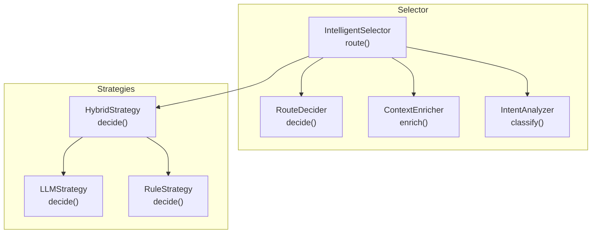
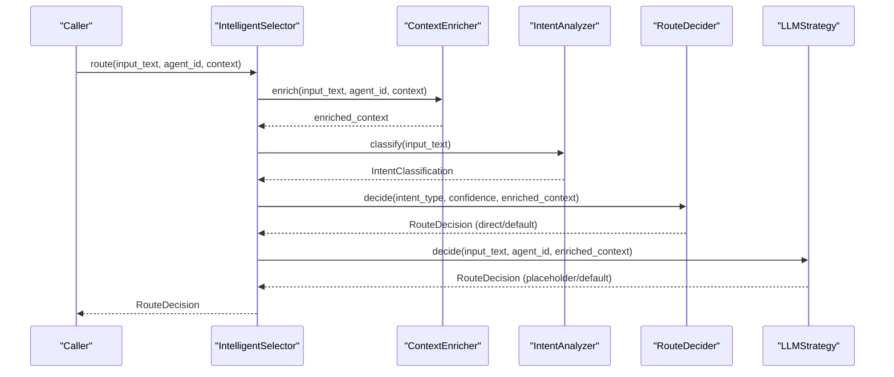
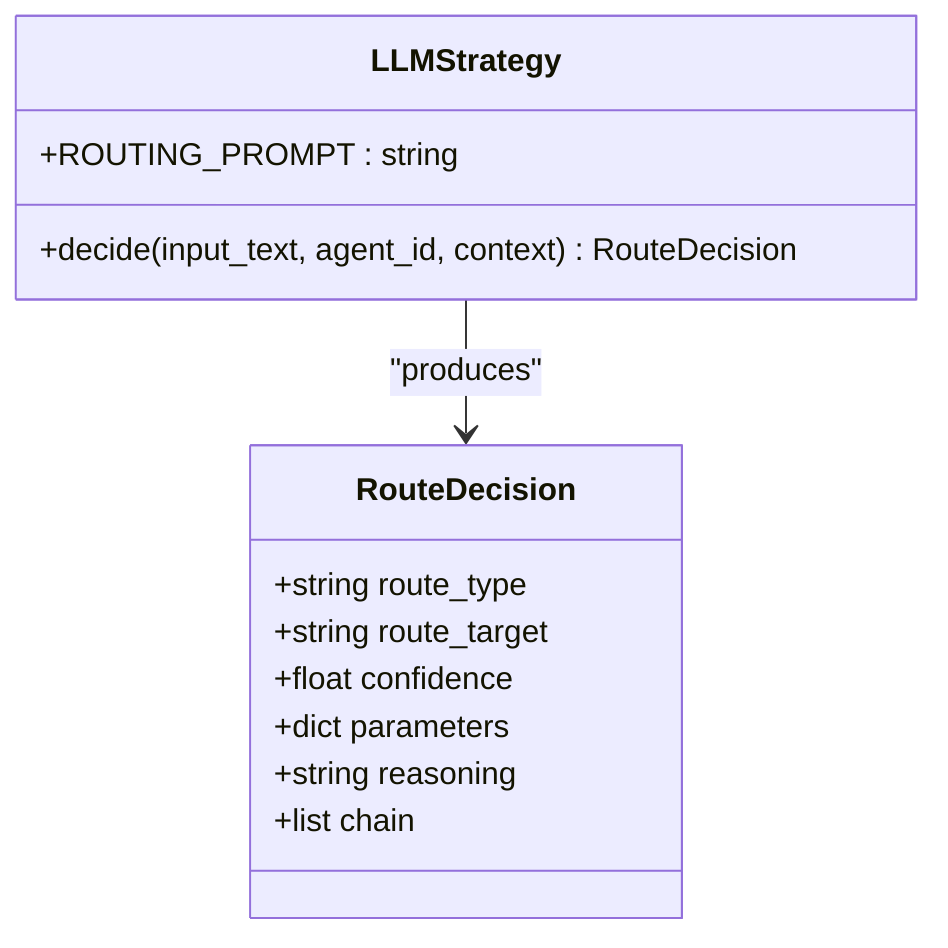
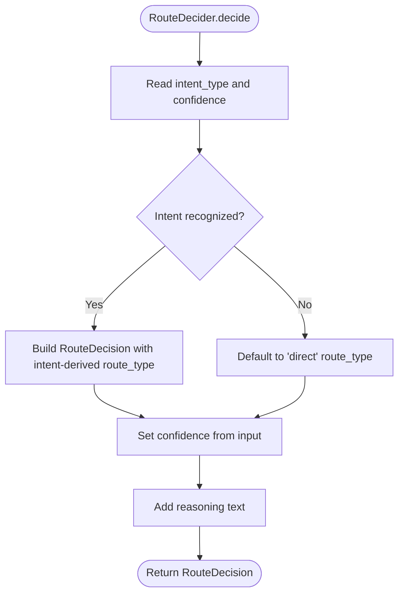
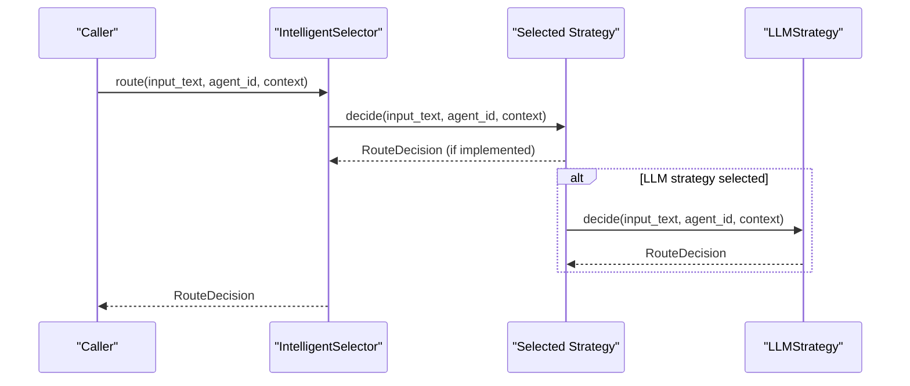
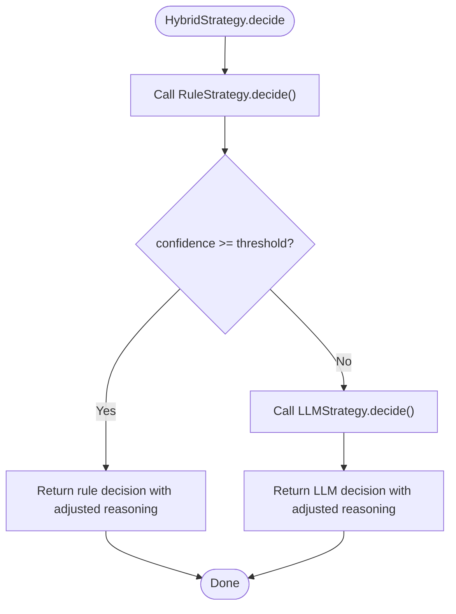
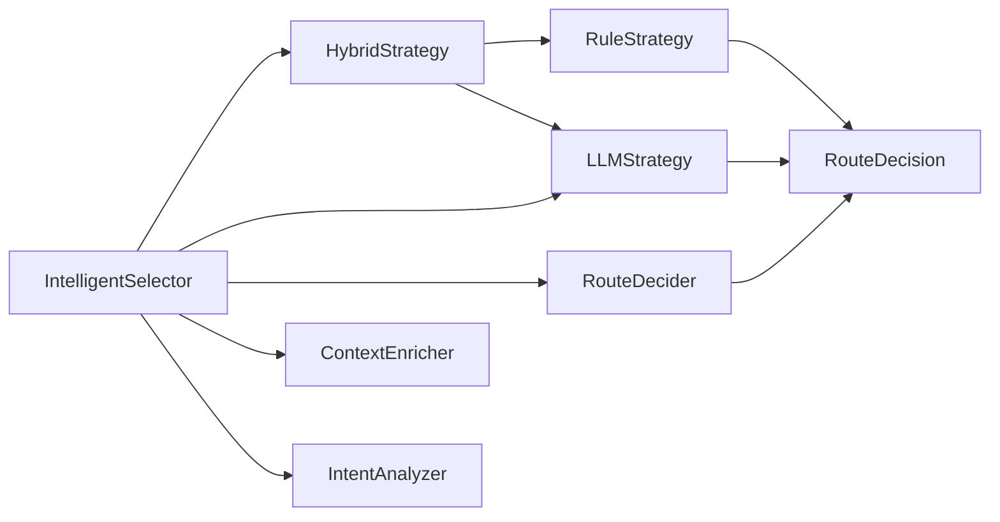

# LLM Strategy

<cite>
**Referenced Files in This Document**
- [llm_strategy.py](file://python/src/resolvenet/selector/strategies/llm_strategy.py)
- [router.py](file://python/src/resolvenet/selector/router.py)
- [context_enricher.py](file://python/src/resolvenet/selector/context_enricher.py)
- [intent.py](file://python/src/resolvenet/selector/intent.py)
- [selector.py](file://python/src/resolvenet/selector/selector.py)
- [hybrid_strategy.py](file://python/src/resolvenet/selector/strategies/hybrid_strategy.py)
- [rule_strategy.py](file://python/src/resolvenet/selector/strategies/rule_strategy.py)
</cite>

## Table of Contents
1. [Introduction](#introduction)
2. [Project Structure](#project-structure)
3. [Core Components](#core-components)
4. [Architecture Overview](#architecture-overview)
5. [Detailed Component Analysis](#detailed-component-analysis)
6. [Dependency Analysis](#dependency-analysis)
7. [Performance Considerations](#performance-considerations)
8. [Troubleshooting Guide](#troubleshooting-guide)
9. [Conclusion](#conclusion)
10. [Appendices](#appendices)

## Introduction
This document describes the LLM-based routing strategy implementation used by the Intelligent Selector. It focuses on the LLMStrategy class, the routing prompt template that guides LLM classification, the decide() method interface, and the end-to-end routing pipeline. It also covers confidence scoring, reasoning generation, configuration options, prompt customization, performance tuning, debugging techniques, and integration with different LLM backends.

## Project Structure
The routing system is implemented in the Python selector package. The LLM strategy resides under strategies and integrates with the broader selector orchestration, intent analysis, context enrichment, and route decision components.

**Diagram sources**
- [selector.py:43-100](file://python/src/resolvenet/selector/selector.py#L43-L100)
- [hybrid_strategy.py:27-42](file://python/src/resolvenet/selector/strategies/hybrid_strategy.py#L27-L42)
- [llm_strategy.py:33-44](file://python/src/resolvenet/selector/strategies/llm_strategy.py#L33-L44)
- [rule_strategy.py:35-77](file://python/src/resolvenet/selector/strategies/rule_strategy.py#L35-L77)
- [context_enricher.py:16-47](file://python/src/resolvenet/selector/context_enricher.py#L16-L47)
- [intent.py:24-39](file://python/src/resolvenet/selector/intent.py#L24-L39)
- [router.py:17-40](file://python/src/resolvenet/selector/router.py#L17-L40)

**Section sources**
- [selector.py:24-100](file://python/src/resolvenet/selector/selector.py#L24-L100)
- [llm_strategy.py:10-44](file://python/src/resolvenet/selector/strategies/llm_strategy.py#L10-L44)

## Core Components
- LLMStrategy: Implements the LLM-based classification and routing decision. Provides the routing prompt template and the decide() method interface.
- RouteDecision: Data model representing the routing decision with fields for route_type, route_target, confidence, parameters, reasoning, and chain.
- RouteDecider: Final decision-maker that consumes intent_type, confidence, and context to produce a RouteDecision.
- ContextEnricher: Supplies additional context (skills, workflows, RAG collections, conversation history) to aid routing.
- IntentAnalyzer: Classifies user intent into intent_type and confidence.
- IntelligentSelector: Orchestrates the three-stage pipeline and supports pluggable strategies (llm, rule, hybrid).

Key responsibilities:
- LLMStrategy: Build and submit the routing prompt to an LLM backend and parse the structured response into RouteDecision.
- HybridStrategy: Applies RuleStrategy first, falling back to LLMStrategy when confidence is below a threshold.
- RouteDecider: Translates intent classification into a final routing decision.
- ContextEnricher: Augments context with available capabilities and history.
- IntentAnalyzer: Provides intent classification for optional use in higher-level routing.

**Section sources**
- [llm_strategy.py:10-44](file://python/src/resolvenet/selector/strategies/llm_strategy.py#L10-L44)
- [selector.py:13-22](file://python/src/resolvenet/selector/selector.py#L13-L22)
- [router.py:10-40](file://python/src/resolvenet/selector/router.py#L10-L40)
- [context_enricher.py:8-47](file://python/src/resolvenet/selector/context_enricher.py#L8-L47)
- [intent.py:8-39](file://python/src/resolvenet/selector/intent.py#L8-L39)

## Architecture Overview
The Intelligent Selector routes requests through a three-stage pipeline:
1. Intent Analysis: Determines the user’s intent and associated confidence.
2. Context Enrichment: Gathers available skills, workflows, RAG collections, and conversation history.
3. Route Decision: Chooses among fta, skill, rag, or direct paths, optionally chaining multiple decisions.

The LLMStrategy participates in stage 3 by generating a structured decision via an LLM. The hybrid strategy provides a fast-path rule-based decision and falls back to LLM when confidence is insufficient.

**Diagram sources**
- [selector.py:43-100](file://python/src/resolvenet/selector/selector.py#L43-L100)
- [context_enricher.py:16-47](file://python/src/resolvenet/selector/context_enricher.py#L16-L47)
- [intent.py:24-39](file://python/src/resolvenet/selector/intent.py#L24-L39)
- [router.py:17-40](file://python/src/resolvenet/selector/router.py#L17-L40)
- [llm_strategy.py:33-44](file://python/src/resolvenet/selector/strategies/llm_strategy.py#L33-L44)

## Detailed Component Analysis

### LLMStrategy
The LLMStrategy class encapsulates the LLM-based routing decision. It defines:
- Routing prompt template: Guides the LLM to classify requests into four categories and return a structured JSON response containing route_type, route_target, confidence, and reasoning.
- decide() method: Accepts input_text, agent_id, and context, and returns a RouteDecision. Currently returns a placeholder decision until the LLM call is implemented.

Routing prompt categories:
- fta: Structured decision trees, root cause analysis, multi-step diagnostics.
- skill: Specific tool execution (web search, code execution, file operations).
- rag: Knowledge retrieval, document Q&A, information lookup.
- direct: General conversation, simple questions, creative tasks.

Confidence scoring and reasoning:
- Confidence is a numeric score between 0.0 and 1.0.
- Reasoning provides a textual explanation for the decision.
- route_target holds the specific target identifier (e.g., a skill name or workflow ID) when applicable.

Integration with LLM backends:
- The prompt is designed to return JSON with explicit keys for parsing.
- The decide() method is async to accommodate network latency and streaming responses.

Configuration options:
- Prompt customization: Modify the ROUTING_PROMPT template to adjust instructions, examples, or output schema.
- Provider selection: Integrate with OpenAI-compatible APIs, Qwen, Wenxin, Zhipu, or other providers by plugging in an LLM client that conforms to the expected interface.
- Performance tuning: Tune confidence thresholds, prompt length, and context size to balance accuracy and latency.

**Diagram sources**
- [llm_strategy.py:10-44](file://python/src/resolvenet/selector/strategies/llm_strategy.py#L10-L44)
- [selector.py:13-22](file://python/src/resolvenet/selector/selector.py#L13-L22)

**Section sources**
- [llm_strategy.py:17-31](file://python/src/resolvenet/selector/strategies/llm_strategy.py#L17-L31)
- [llm_strategy.py:33-44](file://python/src/resolvenet/selector/strategies/llm_strategy.py#L33-L44)

### RouteDecision Model
RouteDecision is a Pydantic model that standardizes the routing decision output. It includes:
- route_type: One of fta, skill, rag, direct, or multi.
- route_target: Optional identifier for the specific target (e.g., a skill or workflow).
- confidence: Numeric confidence score.
- parameters: Optional key-value parameters for downstream execution.
- reasoning: Human-readable explanation of the decision.
- chain: Optional list of chained RouteDecision steps for multi-stage routing.

Usage:
- Populate from LLMStrategy or RouteDecider outputs.
- Pass downstream to FTA engine, skill executor, RAG pipeline, or direct handler.

**Section sources**
- [selector.py:13-22](file://python/src/resolvenet/selector/selector.py#L13-L22)

### RouteDecider
The RouteDecider consumes intent_type, confidence, and context to produce a final RouteDecision. It currently defaults to direct routing but can be extended to incorporate intent and context for smarter routing.

**Diagram sources**
- [router.py:17-40](file://python/src/resolvenet/selector/router.py#L17-L40)

**Section sources**
- [router.py:10-40](file://python/src/resolvenet/selector/router.py#L10-L40)

### ContextEnricher
ContextEnricher augments the routing context with:
- available_skills
- active_workflows
- rag_collections
- conversation_history

These fields are intended to be populated from the registry and storage systems and passed into LLMStrategy to improve classification accuracy.

**Section sources**
- [context_enricher.py:8-47](file://python/src/resolvenet/selector/context_enricher.py#L8-L47)

### IntentAnalyzer
IntentAnalyzer classifies user input into intent_type and confidence. It currently returns a default classification and can be extended to use LLM-based or rule-based classification.

**Section sources**
- [intent.py:8-39](file://python/src/resolvenet/selector/intent.py#L8-L39)

### IntelligentSelector Orchestration
IntelligentSelector coordinates the routing pipeline:
- route(): Public entry point accepting input_text, agent_id, and context.
- Strategy dispatch: Supports llm, rule, and hybrid strategies.
- Logging: Emits structured logs with strategy, route_type, target, and confidence.

**Diagram sources**
- [selector.py:43-100](file://python/src/resolvenet/selector/selector.py#L43-L100)
- [llm_strategy.py:78-81](file://python/src/resolvenet/selector/strategies/llm_strategy.py#L78-L81)

**Section sources**
- [selector.py:24-100](file://python/src/resolvenet/selector/selector.py#L24-L100)

### HybridStrategy Integration
HybridStrategy applies RuleStrategy first and falls back to LLMStrategy when rule confidence is below a threshold. This balances speed and accuracy.

**Diagram sources**
- [hybrid_strategy.py:27-42](file://python/src/resolvenet/selector/strategies/hybrid_strategy.py#L27-L42)
- [rule_strategy.py:35-77](file://python/src/resolvenet/selector/strategies/rule_strategy.py#L35-L77)
- [llm_strategy.py:33-44](file://python/src/resolvenet/selector/strategies/llm_strategy.py#L33-L44)

**Section sources**
- [hybrid_strategy.py:12-42](file://python/src/resolvenet/selector/strategies/hybrid_strategy.py#L12-L42)

## Dependency Analysis
- LLMStrategy depends on RouteDecision for output.
- IntelligentSelector composes strategies and delegates routing decisions.
- HybridStrategy composes RuleStrategy and LLMStrategy.
- RouteDecider consumes intent and context to finalize routing.
- ContextEnricher supplies context to strategies.

**Diagram sources**
- [selector.py:43-100](file://python/src/resolvenet/selector/selector.py#L43-L100)
- [hybrid_strategy.py:23-25](file://python/src/resolvenet/selector/strategies/hybrid_strategy.py#L23-L25)
- [llm_strategy.py:78-81](file://python/src/resolvenet/selector/strategies/llm_strategy.py#L78-L81)
- [router.py:17-40](file://python/src/resolvenet/selector/router.py#L17-L40)
- [context_enricher.py:16-47](file://python/src/resolvenet/selector/context_enricher.py#L16-L47)
- [intent.py:24-39](file://python/src/resolvenet/selector/intent.py#L24-L39)

**Section sources**
- [selector.py:35-41](file://python/src/resolvenet/selector/selector.py#L35-L41)
- [hybrid_strategy.py:23-25](file://python/src/resolvenet/selector/strategies/hybrid_strategy.py#L23-L25)

## Performance Considerations
- Prompt size: Keep the routing prompt concise while including sufficient context (skills, workflows, collections) to improve accuracy.
- Confidence threshold: Tune HybridStrategy.CONFIDENCE_THRESHOLD to balance speed vs. correctness.
- Caching: Cache repeated context enrichments and LLM responses where safe.
- Streaming: If integrating with streaming-capable LLMs, buffer and parse the final structured response.
- Latency: Place LLMStrategy behind a circuit breaker and timeout to prevent cascading delays.

## Troubleshooting Guide
Common issues and resolutions:
- Low confidence decisions: Increase threshold or refine prompt examples; ensure context enrichment includes relevant capabilities.
- Misclassification of intent: Adjust prompt instructions and add few-shot examples; consider intent analyzer improvements.
- JSON parsing errors: Ensure the LLM response strictly follows the expected JSON schema; add post-processing validation.
- Missing targets: Verify that available_skills, active_workflows, and rag_collections are populated by ContextEnricher.
- Debugging techniques:
  - Log input_text, agent_id, and enriched context before calling LLMStrategy.decide().
  - Capture raw LLM output and validate against the expected JSON schema.
  - Compare RouteDecision.route_type and route_target with the intended targets.
  - Use lower confidence thresholds temporarily to force LLM fallback during testing.

**Section sources**
- [llm_strategy.py:33-44](file://python/src/resolvenet/selector/strategies/llm_strategy.py#L33-L44)
- [context_enricher.py:32-46](file://python/src/resolvenet/selector/context_enricher.py#L32-L46)
- [hybrid_strategy.py:21](file://python/src/resolvenet/selector/strategies/hybrid_strategy.py#L21)

## Conclusion
The LLMStrategy provides a structured, extensible foundation for LLM-based routing. By combining a clear routing prompt, a standardized RouteDecision model, and integration points for context enrichment and intent analysis, it enables accurate and explainable routing across fta, skill, rag, and direct paths. The hybrid strategy offers a practical balance between speed and accuracy, while the overall selector orchestrates the pipeline with logging and flexibility for future enhancements.

## Appendices

### Routing Prompt Template Reference
- Purpose: Classify user input into fta, skill, rag, or direct.
- Inputs embedded in the prompt: input_text, available skills, workflows, and RAG collections.
- Output format: JSON with keys for route_type, route_target, confidence, and reasoning.

**Section sources**
- [llm_strategy.py:17-31](file://python/src/resolvenet/selector/strategies/llm_strategy.py#L17-L31)

### decide() Method Interface
- Input parameters:
  - input_text: User input string.
  - agent_id: Identifier of the agent processing the request.
  - context: Dictionary containing initial context and any enriched fields.
- Return value: RouteDecision with route_type, route_target, confidence, reasoning, and optional chain.

**Section sources**
- [llm_strategy.py:33-35](file://python/src/resolvenet/selector/strategies/llm_strategy.py#L33-L35)
- [selector.py:13-22](file://python/src/resolvenet/selector/selector.py#L13-L22)

### Prompt Customization Examples
- Add domain-specific examples for each category (fta, skill, rag, direct).
- Include explicit instructions for handling ambiguous queries.
- Define acceptable route_target formats for skills and workflows.

**Section sources**
- [llm_strategy.py:17-31](file://python/src/resolvenet/selector/strategies/llm_strategy.py#L17-L31)

### Integration with LLM Backends
- OpenAI-compatible APIs: Use the OpenAI-compatible client module to send the routing prompt and parse the JSON response.
- Provider-specific clients: Integrate Qwen, Wenxin, Zhipu, or other providers by adapting the LLM call within decide().
- Schema compliance: Ensure the LLM response adheres to the expected JSON schema before constructing RouteDecision.

**Section sources**
- [llm_strategy.py:37](file://python/src/resolvenet/selector/strategies/llm_strategy.py#L37)