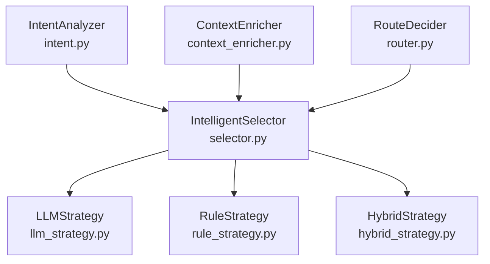
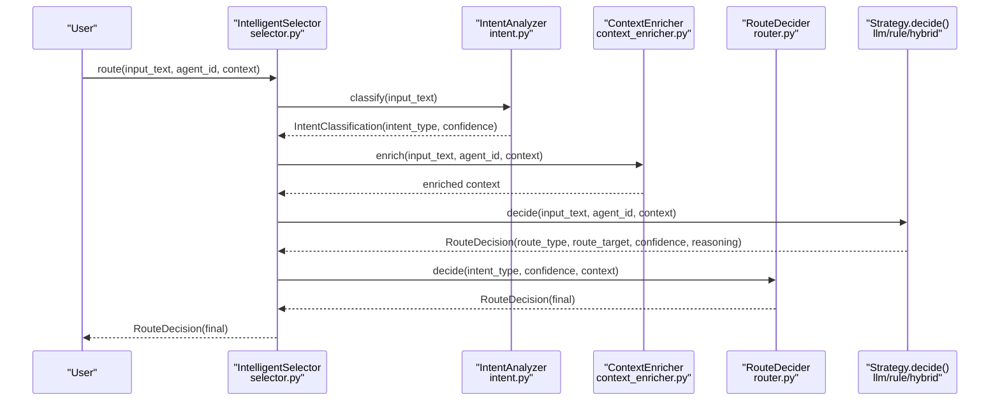
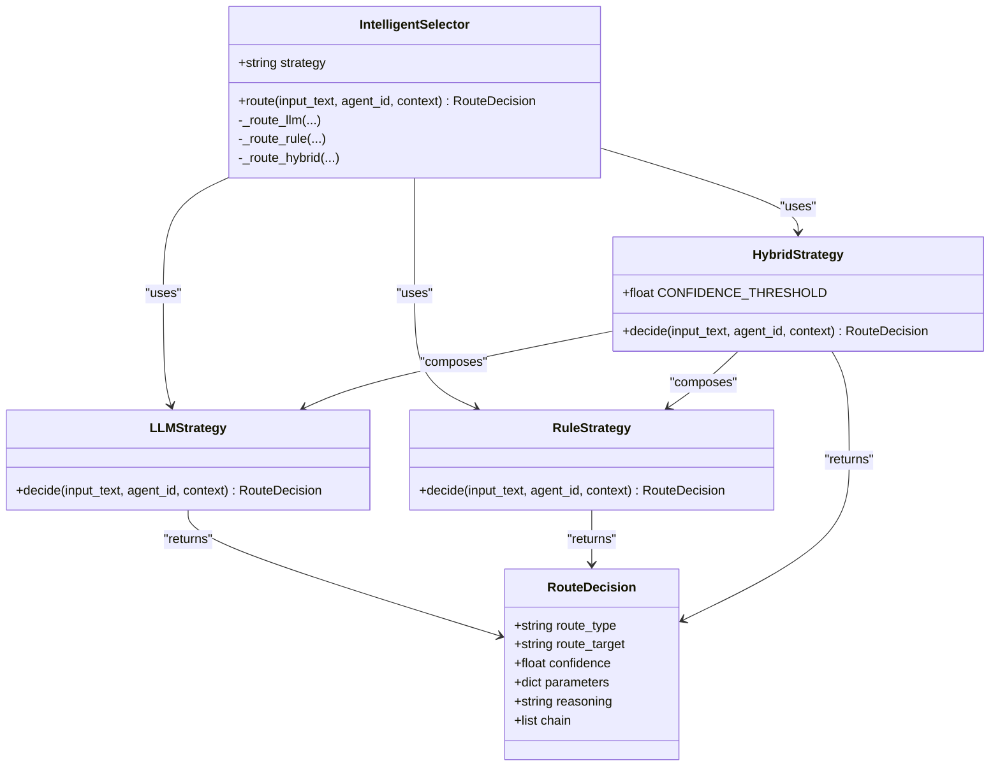

# Routing Strategies

<cite>
**Referenced Files in This Document**
- [llm_strategy.py](file://python/src/resolvenet/selector/strategies/llm_strategy.py)
- [rule_strategy.py](file://python/src/resolvenet/selector/strategies/rule_strategy.py)
- [hybrid_strategy.py](file://python/src/resolvenet/selector/strategies/hybrid_strategy.py)
- [selector.py](file://python/src/resolvenet/selector/selector.py)
- [router.py](file://python/src/resolvenet/selector/router.py)
- [context_enricher.py](file://python/src/resolvenet/selector/context_enricher.py)
- [intent.py](file://python/src/resolvenet/selector/intent.py)
- [test_selector.py](file://python/tests/unit/test_selector.py)
- [intelligent-selector.md](file://docs/architecture/intelligent-selector.md)
- [runtime.yaml](file://configs/runtime.yaml)
</cite>

## Table of Contents
1. [Introduction](#introduction)
2. [Project Structure](#project-structure)
3. [Core Components](#core-components)
4. [Architecture Overview](#architecture-overview)
5. [Detailed Component Analysis](#detailed-component-analysis)
6. [Dependency Analysis](#dependency-analysis)
7. [Performance Considerations](#performance-considerations)
8. [Troubleshooting Guide](#troubleshooting-guide)
9. [Conclusion](#conclusion)
10. [Appendices](#appendices)

## Introduction
This document explains the routing strategies that power the Intelligent Selector’s decision-making. It covers three strategy types:
- LLMStrategy: AI-powered decision-making via a classification prompt.
- RuleStrategy: Deterministic pattern matching for known request types.
- HybridStrategy: A two-stage approach that tries rules first and falls back to LLM.

It documents the decide() method interface and implementation details, the confidence scoring mechanism, and how decision rationale is generated. It also describes configuration options, performance characteristics, use case recommendations, examples of strategy selection, guidance for implementing custom strategies, and evaluation and debugging techniques.

## Project Structure
The routing strategy implementations live under the selector module in the Python package. The selector orchestrates strategy selection and integrates with intent analysis, context enrichment, and a route decider.

**Diagram sources**
- [selector.py:24-100](file://python/src/resolvenet/selector/selector.py#L24-L100)
- [llm_strategy.py:10-44](file://python/src/resolvenet/selector/strategies/llm_strategy.py#L10-L44)
- [rule_strategy.py:11-77](file://python/src/resolvenet/selector/strategies/rule_strategy.py#L11-L77)
- [hybrid_strategy.py:12-42](file://python/src/resolvenet/selector/strategies/hybrid_strategy.py#L12-L42)
- [intent.py:17-39](file://python/src/resolvenet/selector/intent.py#L17-L39)
- [context_enricher.py:8-47](file://python/src/resolvenet/selector/context_enricher.py#L8-L47)
- [router.py:10-40](file://python/src/resolvenet/selector/router.py#L10-L40)

**Section sources**
- [selector.py:24-100](file://python/src/resolvenet/selector/selector.py#L24-L100)
- [intelligent-selector.md:1-18](file://docs/architecture/intelligent-selector.md#L1-L18)

## Core Components
- RouteDecision: The output model containing route_type, route_target, confidence, parameters, reasoning, and optional chain of decisions.
- IntelligentSelector: Orchestrator that selects a strategy by name and routes the request, logging the outcome.
- Strategy classes: LLMStrategy, RuleStrategy, HybridStrategy, each exposing an async decide() method returning a RouteDecision.
- RouteDecider: Final decision stage that consumes intent and context to produce a RouteDecision.
- IntentAnalyzer: Provides intent classification and confidence.
- ContextEnricher: Augments context with available skills, workflows, RAG collections, and conversation history.

Key configuration:
- Default strategy and confidence threshold are set in runtime configuration.

**Section sources**
- [selector.py:13-22](file://python/src/resolvenet/selector/selector.py#L13-L22)
- [selector.py:24-100](file://python/src/resolvenet/selector/selector.py#L24-L100)
- [router.py:10-40](file://python/src/resolvenet/selector/router.py#L10-L40)
- [intent.py:8-39](file://python/src/resolvenet/selector/intent.py#L8-L39)
- [context_enricher.py:8-47](file://python/src/resolvenet/selector/context_enricher.py#L8-L47)
- [runtime.yaml:11-14](file://configs/runtime.yaml#L11-L14)

## Architecture Overview
The Intelligent Selector follows a staged pipeline:
1. Intent Analysis: Classify the user intent and confidence.
2. Context Enrichment: Add agent capabilities, memories, and available resources.
3. Strategy Selection: Choose among “llm”, “rule”, or “hybrid”.
4. Strategy Execution: Each strategy produces a RouteDecision with confidence and reasoning.
5. Route Decision: The RouteDecider finalizes the routing decision.

**Diagram sources**
- [selector.py:43-72](file://python/src/resolvenet/selector/selector.py#L43-L72)
- [intent.py:24-38](file://python/src/resolvenet/selector/intent.py#L24-L38)
- [context_enricher.py:16-46](file://python/src/resolvenet/selector/context_enricher.py#L16-L46)
- [router.py:17-39](file://python/src/resolvenet/selector/router.py#L17-L39)
- [llm_strategy.py:33-43](file://python/src/resolvenet/selector/strategies/llm_strategy.py#L33-L43)
- [rule_strategy.py:35-76](file://python/src/resolvenet/selector/strategies/rule_strategy.py#L35-L76)
- [hybrid_strategy.py:27-41](file://python/src/resolvenet/selector/strategies/hybrid_strategy.py#L27-L41)

## Detailed Component Analysis

### LLMStrategy
Purpose:
- Classify ambiguous or open-ended requests using a classification prompt that enumerates route types and targets.

decide() method:
- Signature: async decide(input_text: str, agent_id: str, context: dict[str, Any]) -> RouteDecision
- Behavior: Currently returns a default RouteDecision with route_type "direct", fixed confidence, and a reasoning note. In a production implementation, this would call an LLM with the routing prompt and parse the result into a RouteDecision.

Confidence scoring:
- Confidence is a float in [0.0, 1.0]. The current implementation uses a fixed value suitable for defaults.

Reasoning generation:
- The reasoning field documents the strategy’s rationale for the decision.

Configuration options:
- Strategy name: "llm".
- No per-instance configuration exposed by this class; configuration is managed by the orchestrator.

Performance characteristics:
- Latency dominated by LLM inference; higher variability due to model calls.
- Recommended for ambiguous or novel intents where deterministic rules are insufficient.

Use case recommendations:
- Requests requiring nuanced interpretation.
- When the system needs to adapt to new patterns without explicit rule updates.

Custom strategy implementation:
- Implement async decide() returning a RouteDecision with route_type, route_target, confidence, and reasoning.
- Integrate via IntelligentSelector by registering a new strategy name and mapping it to a route function.

**Section sources**
- [llm_strategy.py:10-44](file://python/src/resolvenet/selector/strategies/llm_strategy.py#L10-L44)
- [selector.py:74-81](file://python/src/resolvenet/selector/selector.py#L74-L81)
- [intelligent-selector.md:7-8](file://docs/architecture/intelligent-selector.md#L7-L8)

### RuleStrategy
Purpose:
- Provide fast, deterministic routing using predefined regular expressions for known patterns.

decide() method:
- Signature: async decide(input_text: str, agent_id: str, context: dict[str, Any]) -> RouteDecision
- Behavior: Converts input to lowercase and checks patterns in order:
  - FTA patterns: fault diagnosis and decision tree keywords.
  - Skill patterns: tool execution verbs and nouns.
  - RAG patterns: knowledge-seeking and explanatory keywords.
- Returns a RouteDecision with route_type and confidence based on the matched category.

Confidence scoring:
- FTA matches: high confidence.
- Skill matches: highest confidence.
- RAG matches: moderate confidence.
- No match: low confidence default.

Reasoning generation:
- The reasoning indicates which pattern matched.

Configuration options:
- Patterns are defined as class-level lists of (regex, target) tuples. They can be extended or overridden by subclassing.

Performance characteristics:
- O(P) pattern matching over a small number of patterns; extremely fast and deterministic.

Use case recommendations:
- Known command-like intents with clear triggers.
- High-confidence routing for common tasks.

Custom strategy implementation:
- Extend RuleStrategy and override decide() or inject new pattern lists.

**Section sources**
- [rule_strategy.py:11-77](file://python/src/resolvenet/selector/strategies/rule_strategy.py#L11-L77)
- [selector.py:83-90](file://python/src/resolvenet/selector/selector.py#L83-L90)
- [intelligent-selector.md:7](file://docs/architecture/intelligent-selector.md#L7)

### HybridStrategy
Purpose:
- Combine the speed of RuleStrategy with the adaptability of LLMStrategy by using rules as a fast path and falling back to LLM for ambiguous cases.

decide() method:
- Signature: async decide(input_text: str, agent_id: str, context: dict[str, Any]) -> RouteDecision
- Behavior:
  - Calls RuleStrategy.decide() first.
  - If confidence meets or exceeds a threshold, returns the rule decision with adjusted reasoning.
  - Otherwise, calls LLMStrategy.decide() and returns its decision with adjusted reasoning.

Confidence threshold:
- Defined as a class constant controlling when to fall back to LLM.

Reasoning generation:
- Prefixes the returned reasoning to indicate whether the decision came from rules or LLM.

Configuration options:
- Strategy name: "hybrid".
- Threshold configurable via class constant; can be adapted by subclassing.

Performance characteristics:
- Best of both worlds: fast for confident rule matches, adaptive for ambiguity.

Use case recommendations:
- General-purpose routing where deterministic rules cover most cases but some ambiguity requires LLM classification.

Custom strategy implementation:
- Subclass HybridStrategy to adjust thresholds or strategy composition.

**Section sources**
- [hybrid_strategy.py:12-42](file://python/src/resolvenet/selector/strategies/hybrid_strategy.py#L12-L42)
- [selector.py:92-99](file://python/src/resolvenet/selector/selector.py#L92-L99)
- [runtime.yaml:12-13](file://configs/runtime.yaml#L12-L13)

### RouteDecision Model
Fields:
- route_type: One of "fta", "skill", "rag", "direct", or "multi".
- route_target: Optional target identifier (e.g., skill name).
- confidence: Float in [0.0, 1.0].
- parameters: Optional arbitrary payload for downstream execution.
- reasoning: Human-readable explanation of the decision.
- chain: Optional list of chained decisions for multi-step routing.

Usage:
- Strategies return RouteDecision instances; the orchestrator logs and forwards them.

**Section sources**
- [selector.py:13-22](file://python/src/resolvenet/selector/selector.py#L13-L22)

### RouteDecider
Purpose:
- Final decision stage consuming intent classification and context to produce a RouteDecision.

decide() method:
- Signature: async decide(intent_type: str, confidence: float, context: dict[str, Any]) -> RouteDecision
- Behavior: Currently returns a default RouteDecision with the provided confidence and a generic reasoning message. In a future implementation, this will incorporate intent and context to select the appropriate subsystem.

**Section sources**
- [router.py:10-40](file://python/src/resolvenet/selector/router.py#L10-L40)

### IntentAnalyzer and ContextEnricher
IntentAnalyzer:
- classify(): Returns an IntentClassification with intent_type and confidence.

ContextEnricher:
- enrich(): Augments context with available skills, workflows, RAG collections, and conversation history placeholders.

Note: These components are currently placeholders and will be wired into the selector pipeline in future iterations.

**Section sources**
- [intent.py:17-39](file://python/src/resolvenet/selector/intent.py#L17-L39)
- [context_enricher.py:8-47](file://python/src/resolvenet/selector/context_enricher.py#L8-L47)

## Dependency Analysis
The selector orchestrator delegates to strategies based on a strategy name mapping. HybridStrategy composes RuleStrategy and LLMStrategy internally. RouteDecider is part of the conceptual pipeline and is invoked conceptually in the overall flow.

**Diagram sources**
- [selector.py:24-100](file://python/src/resolvenet/selector/selector.py#L24-L100)
- [llm_strategy.py:10-44](file://python/src/resolvenet/selector/strategies/llm_strategy.py#L10-L44)
- [rule_strategy.py:11-77](file://python/src/resolvenet/selector/strategies/rule_strategy.py#L11-L77)
- [hybrid_strategy.py:12-42](file://python/src/resolvenet/selector/strategies/hybrid_strategy.py#L12-L42)
- [selector.py:13-22](file://python/src/resolvenet/selector/selector.py#L13-L22)

**Section sources**
- [selector.py:35-41](file://python/src/resolvenet/selector/selector.py#L35-L41)
- [hybrid_strategy.py:23-25](file://python/src/resolvenet/selector/strategies/hybrid_strategy.py#L23-L25)

## Performance Considerations
- RuleStrategy:
  - Fast and deterministic; suitable for high-throughput scenarios.
  - Keep pattern sets minimal and ordered by specificity to reduce average match cost.
- LLMStrategy:
  - Slower due to model latency; batching or caching may help.
  - Use concise prompts and limit tokens to improve throughput.
- HybridStrategy:
  - Balances speed and accuracy; tune CONFIDENCE_THRESHOLD to minimize LLM calls while maintaining accuracy.
  - Consider precomputing or caching frequent rule outcomes to further reduce latency.
- Logging and telemetry:
  - The orchestrator logs route decisions; enable runtime telemetry for observability.

[No sources needed since this section provides general guidance]

## Troubleshooting Guide
Common issues and remedies:
- Low confidence decisions:
  - Verify pattern coverage in RuleStrategy or increase HybridStrategy threshold.
  - Ensure context enrichment provides accurate capabilities and collections.
- Misrouted requests:
  - Inspect the reasoning field in RouteDecision to understand the decision origin.
  - Adjust patterns or add new ones in RuleStrategy.
- Ambiguity in LLMStrategy:
  - Refine the routing prompt to clarify route types and targets.
  - Consider adding examples or constraints to improve classification stability.
- Strategy selection:
  - Confirm the selected strategy name is supported by the orchestrator.
  - Validate runtime configuration for default strategy and threshold.

Debugging techniques:
- Enable logging to inspect strategy, route_type, target, and confidence.
- Use unit tests to validate strategy behavior against representative inputs.
- Instrument context enrichment to confirm availability of skills, workflows, and RAG collections.

**Section sources**
- [selector.py:62-70](file://python/src/resolvenet/selector/selector.py#L62-L70)
- [test_selector.py:8-29](file://python/tests/unit/test_selector.py#L8-L29)
- [runtime.yaml:12-13](file://configs/runtime.yaml#L12-L13)

## Conclusion
The routing strategies provide a flexible, extensible foundation for the Intelligent Selector. RuleStrategy offers speed and determinism, LLMStrategy adds adaptability for ambiguity, and HybridStrategy balances both. With clear confidence scoring, reasoning, and configuration hooks, teams can tailor routing to their workload while maintaining observability and maintainability.

[No sources needed since this section summarizes without analyzing specific files]

## Appendices

### Strategy Selection Examples
- Select rule-based routing for predictable, command-like inputs.
- Select LLM-based routing for open-ended or novel queries.
- Select hybrid routing as the default for most workloads.

Validation via tests:
- Tests demonstrate strategy invocation and basic assertions on route_type and confidence ranges.

**Section sources**
- [test_selector.py:8-29](file://python/tests/unit/test_selector.py#L8-L29)
- [intelligent-selector.md:5-9](file://docs/architecture/intelligent-selector.md#L5-L9)

### Configuration Options
- Default strategy: "hybrid".
- Confidence threshold: 0.7 (used by HybridStrategy).

**Section sources**
- [runtime.yaml:12-13](file://configs/runtime.yaml#L12-L13)

### Implementation Notes for Custom Strategies
- Implement async decide() returning a RouteDecision.
- Register strategy name in the orchestrator’s strategy mapping.
- Provide meaningful confidence scores and reasoning for observability.

**Section sources**
- [selector.py:35-41](file://python/src/resolvenet/selector/selector.py#L35-L41)
- [selector.py:74-99](file://python/src/resolvenet/selector/selector.py#L74-L99)