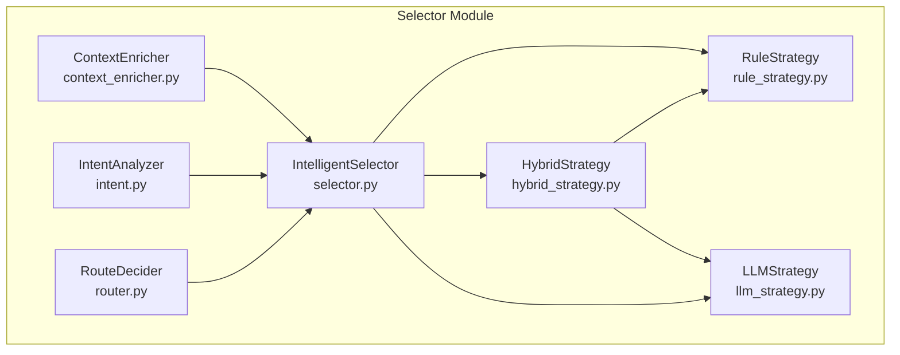
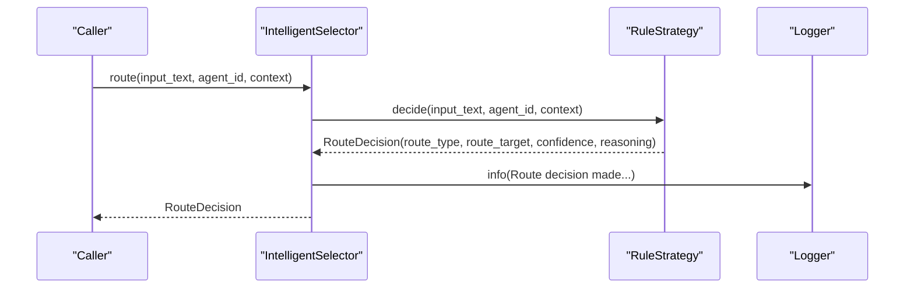
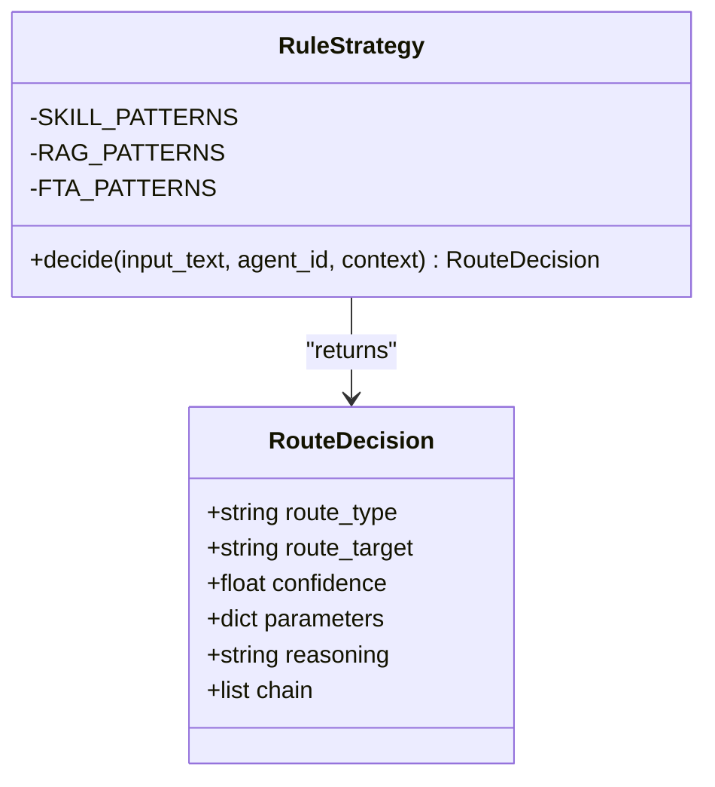
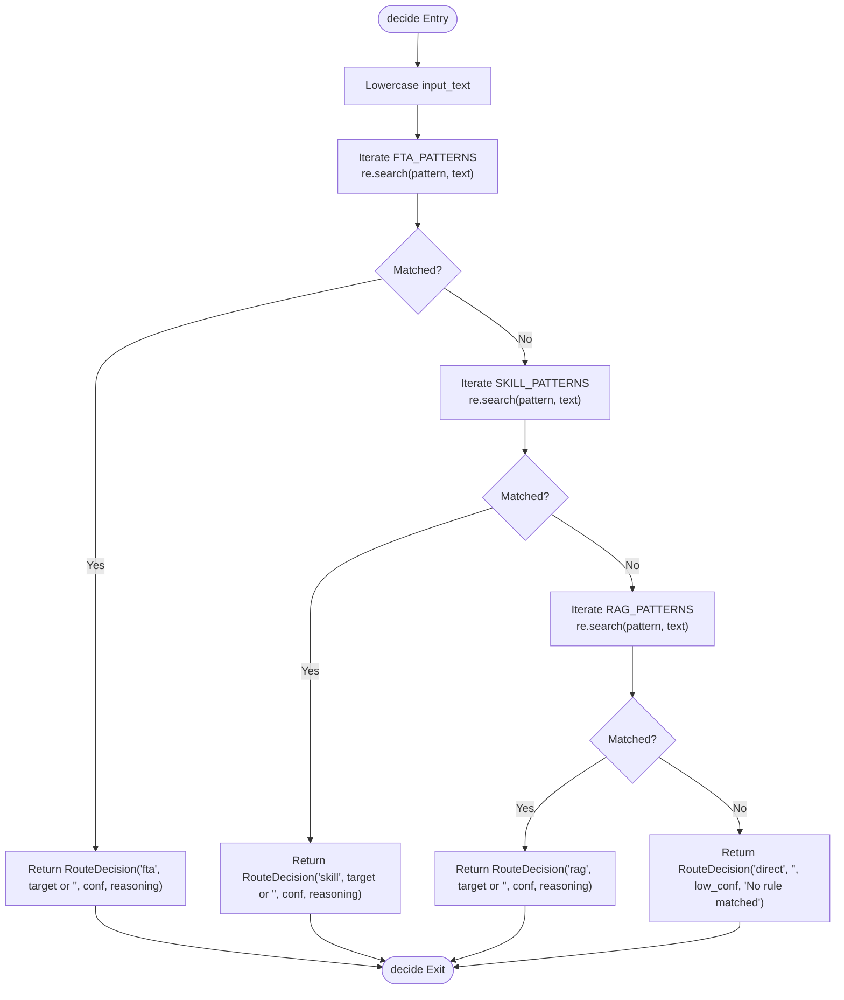
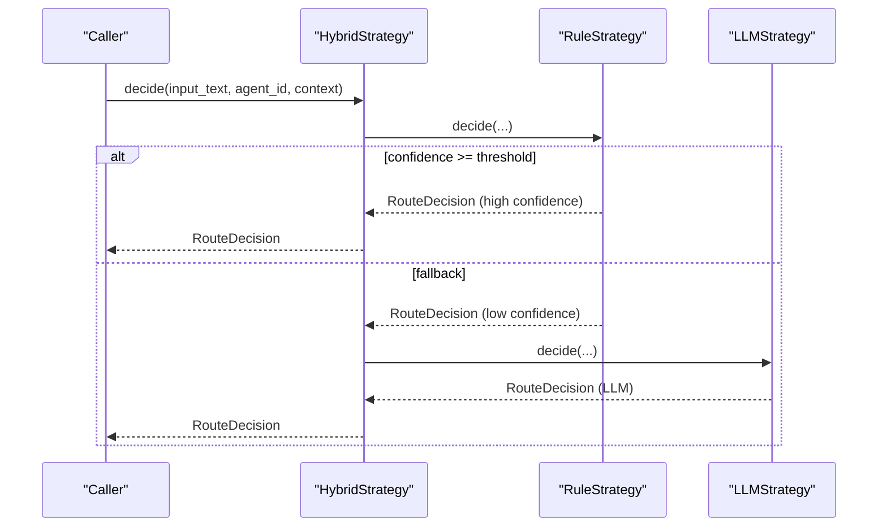
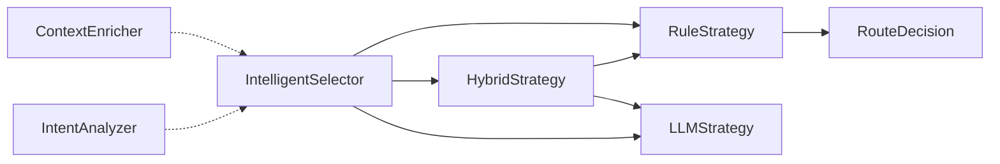

# Rule Strategy

<cite>
**Referenced Files in This Document**
- [rule_strategy.py](file://python/src/resolvenet/selector/strategies/rule_strategy.py)
- [selector.py](file://python/src/resolvenet/selector/selector.py)
- [router.py](file://python/src/resolvenet/selector/router.py)
- [context_enricher.py](file://python/src/resolvenet/selector/context_enricher.py)
- [intent.py](file://python/src/resolvenet/selector/intent.py)
- [hybrid_strategy.py](file://python/src/resolvenet/selector/strategies/hybrid_strategy.py)
- [llm_strategy.py](file://python/src/resolvenet/selector/strategies/llm_strategy.py)
- [resolvenet.yaml](file://configs/resolvenet.yaml)
- [runtime.yaml](file://configs/runtime.yaml)
</cite>

## Table of Contents
1. [Introduction](#introduction)
2. [Project Structure](#project-structure)
3. [Core Components](#core-components)
4. [Architecture Overview](#architecture-overview)
5. [Detailed Component Analysis](#detailed-component-analysis)
6. [Dependency Analysis](#dependency-analysis)
7. [Performance Considerations](#performance-considerations)
8. [Troubleshooting Guide](#troubleshooting-guide)
9. [Conclusion](#conclusion)
10. [Appendices](#appendices)

## Introduction
This document describes the Rule-based routing strategy implementation used by the Intelligent Selector. It explains the RuleStrategy class architecture, the deterministic decision-making algorithm, rule matching and pattern recognition, priority-based routing, and the decide() method behavior. It also covers rule configuration options, performance characteristics, optimization techniques, examples of rule patterns, precedence handling, debugging, maintenance, and best practices for designing effective rules. Guidance is included on combining rule strategies with other routing approaches such as LLM-based and hybrid strategies.

## Project Structure
The rule strategy resides in the Python selector module under strategies and integrates with the broader Intelligent Selector orchestration. Supporting components include the selector orchestrator, intent analyzer, context enricher, and router decider. Configuration files define default strategy and confidence thresholds.

**Diagram sources**
- [selector.py:24-100](file://python/src/resolvenet/selector/selector.py#L24-L100)
- [rule_strategy.py:11-77](file://python/src/resolvenet/selector/strategies/rule_strategy.py#L11-L77)
- [hybrid_strategy.py:12-42](file://python/src/resolvenet/selector/strategies/hybrid_strategy.py#L12-L42)
- [llm_strategy.py:10-44](file://python/src/resolvenet/selector/strategies/llm_strategy.py#L10-L44)
- [router.py:10-40](file://python/src/resolvenet/selector/router.py#L10-L40)
- [context_enricher.py:8-47](file://python/src/resolvenet/selector/context_enricher.py#L8-L47)
- [intent.py:17-39](file://python/src/resolvenet/selector/intent.py#L17-L39)

**Section sources**
- [selector.py:24-100](file://python/src/resolvenet/selector/selector.py#L24-L100)
- [rule_strategy.py:11-77](file://python/src/resolvenet/selector/strategies/rule_strategy.py#L11-L77)
- [hybrid_strategy.py:12-42](file://python/src/resolvenet/selector/strategies/hybrid_strategy.py#L12-L42)
- [llm_strategy.py:10-44](file://python/src/resolvenet/selector/strategies/llm_strategy.py#L10-L44)
- [router.py:10-40](file://python/src/resolvenet/selector/router.py#L10-L40)
- [context_enricher.py:8-47](file://python/src/resolvenet/selector/context_enricher.py#L8-L47)
- [intent.py:17-39](file://python/src/resolvenet/selector/intent.py#L17-L39)

## Core Components
- RuleStrategy: Implements fast, deterministic rule-based routing using regular expressions against predefined categories (FTA, Skills, RAG). It returns a RouteDecision with route_type, route_target, confidence, and reasoning.
- IntelligentSelector: Orchestrates routing by delegating to selected strategies ("llm", "rule", "hybrid"). It logs the final decision outcome.
- HybridStrategy: Applies RuleStrategy first, then falls back to LLMStrategy when rule confidence is below a threshold.
- LLMStrategy: Provides an LLM-based classification and routing path with a structured prompt and placeholder decision.
- RouteDecision: Pydantic model representing the routing decision with fields for route_type, route_target, confidence, parameters, reasoning, and chain.
- RouteDecider: Makes the final routing decision given intent and context (placeholder implementation).
- ContextEnricher: Enriches context with available skills, workflows, RAG collections, and conversation history (placeholder implementation).
- IntentAnalyzer: Classifies intent and confidence (placeholder implementation).

**Section sources**
- [rule_strategy.py:11-77](file://python/src/resolvenet/selector/strategies/rule_strategy.py#L11-L77)
- [selector.py:24-100](file://python/src/resolvenet/selector/selector.py#L24-L100)
- [hybrid_strategy.py:12-42](file://python/src/resolvenet/selector/strategies/hybrid_strategy.py#L12-L42)
- [llm_strategy.py:10-44](file://python/src/resolvenet/selector/strategies/llm_strategy.py#L10-L44)
- [selector.py:13-22](file://python/src/resolvenet/selector/selector.py#L13-L22)
- [router.py:10-40](file://python/src/resolvenet/selector/router.py#L10-L40)
- [context_enricher.py:8-47](file://python/src/resolvenet/selector/context_enricher.py#L8-L47)
- [intent.py:8-39](file://python/src/resolvenet/selector/intent.py#L8-L39)

## Architecture Overview
The RuleStrategy participates in the Intelligent Selector’s routing pipeline. The selector chooses a strategy at runtime, executes it, and logs the decision. HybridStrategy can wrap RuleStrategy to improve robustness by falling back to LLM-based routing when rule confidence is low.

**Diagram sources**
- [selector.py:43-72](file://python/src/resolvenet/selector/selector.py#L43-L72)
- [rule_strategy.py:35-76](file://python/src/resolvenet/selector/strategies/rule_strategy.py#L35-L76)

## Detailed Component Analysis

### RuleStrategy
- Purpose: Provide fast, deterministic routing decisions using regular expression patterns categorized into FTA, Skills, and RAG.
- Pattern Recognition: Uses compiled regular expressions against lowercased input text. Patterns are tuples of (regex_pattern, optional_target).
- Priority-Based Routing: Evaluates patterns in order: FTA first, then Skills, then RAG. The first match returns immediately.
- Confidence Values: Assigns confidence scores per category to reflect certainty.
- Fallback: If no patterns match, returns a direct route with a low confidence value and explanatory reasoning.
- RouteDecision Fields: route_type, route_target, confidence, reasoning.

**Diagram sources**
- [rule_strategy.py:11-77](file://python/src/resolvenet/selector/strategies/rule_strategy.py#L11-L77)
- [selector.py:13-22](file://python/src/resolvenet/selector/selector.py#L13-L22)

**Section sources**
- [rule_strategy.py:11-77](file://python/src/resolvenet/selector/strategies/rule_strategy.py#L11-L77)

### decide() Method Implementation
- Input Processing: Converts input_text to lowercase to normalize matching.
- Rule Evaluation Order:
  - FTA patterns: Highest priority; returns immediately upon first match.
  - Skill patterns: Medium priority; returns immediately upon first match.
  - RAG patterns: Lowest priority; returns immediately upon first match.
- Matching Criteria: Uses regular expression search on the normalized text. Optional target values are used when present; otherwise empty string is used.
- Confidence Assignment: Different categories receive distinct confidence values to reflect expected reliability.
- Fallback Mechanism: If none of the patterns match, returns a direct route with a low confidence and a clear reasoning message.

**Diagram sources**
- [rule_strategy.py:35-76](file://python/src/resolvenet/selector/strategies/rule_strategy.py#L35-L76)

**Section sources**
- [rule_strategy.py:35-76](file://python/src/resolvenet/selector/strategies/rule_strategy.py#L35-L76)

### Rule Definition Format and Pattern Syntax
- Format: List of tuples (regex_pattern, optional_target).
- Pattern Syntax: Standard regular expressions. The implementation lowercases input before matching, so patterns should be case-insensitive.
- Matching Criteria:
  - Exact regex match via search on the normalized text.
  - Optional target allows routing to a specific skill/workflow identifier when present.
- Categories:
  - FTA_PATTERNS: Structured diagnostic or workflow-related intents.
  - SKILL_PATTERNS: Tool execution intents (e.g., web search, code execution, file operations).
  - RAG_PATTERNS: Knowledge-intensive or informational intents.

**Section sources**
- [rule_strategy.py:18-33](file://python/src/resolvenet/selector/strategies/rule_strategy.py#L18-L33)

### Priority-Based Routing Logic
- Evaluation Order: FTA > Skills > RAG.
- Deterministic Outcome: First match wins; subsequent patterns are not evaluated after a match.
- Target Resolution: If a pattern tuple includes a target, it is used as route_target; otherwise an empty string is used.

**Section sources**
- [rule_strategy.py:41-69](file://python/src/resolvenet/selector/strategies/rule_strategy.py#L41-L69)

### Combining Rule Strategies with Other Approaches
- HybridStrategy: Executes RuleStrategy first; if confidence meets or exceeds a threshold, returns the rule decision; otherwise delegates to LLMStrategy for classification.
- LLMStrategy: Provides a structured prompt-based classification path and returns a default decision in the current implementation.
- RouteDecider: Placeholder for final decision-making given intent and context.
- IntelligentSelector: Exposes strategy selection ("llm", "rule", "hybrid") and logs outcomes.

**Diagram sources**
- [hybrid_strategy.py:27-41](file://python/src/resolvenet/selector/strategies/hybrid_strategy.py#L27-L41)
- [rule_strategy.py:35-76](file://python/src/resolvenet/selector/strategies/rule_strategy.py#L35-L76)
- [llm_strategy.py:33-43](file://python/src/resolvenet/selector/strategies/llm_strategy.py#L33-L43)

**Section sources**
- [hybrid_strategy.py:12-42](file://python/src/resolvenet/selector/strategies/hybrid_strategy.py#L12-L42)
- [llm_strategy.py:10-44](file://python/src/resolvenet/selector/strategies/llm_strategy.py#L10-L44)
- [selector.py:74-100](file://python/src/resolvenet/selector/selector.py#L74-L100)

## Dependency Analysis
- RuleStrategy depends on:
  - Regular expressions for pattern matching.
  - RouteDecision model for output representation.
- IntelligentSelector depends on:
  - Strategy modules (RuleStrategy, LLMStrategy, HybridStrategy).
  - Logging for decision reporting.
- HybridStrategy composes RuleStrategy and LLMStrategy and uses a confidence threshold.
- ContextEnricher and IntentAnalyzer are placeholders in the current implementation but integrate conceptually into the selector pipeline.

**Diagram sources**
- [rule_strategy.py:11-77](file://python/src/resolvenet/selector/strategies/rule_strategy.py#L11-L77)
- [selector.py:24-100](file://python/src/resolvenet/selector/selector.py#L24-L100)
- [hybrid_strategy.py:12-42](file://python/src/resolvenet/selector/strategies/hybrid_strategy.py#L12-L42)
- [llm_strategy.py:10-44](file://python/src/resolvenet/selector/strategies/llm_strategy.py#L10-L44)
- [context_enricher.py:8-47](file://python/src/resolvenet/selector/context_enricher.py#L8-L47)
- [intent.py:17-39](file://python/src/resolvenet/selector/intent.py#L17-L39)

**Section sources**
- [rule_strategy.py:11-77](file://python/src/resolvenet/selector/strategies/rule_strategy.py#L11-L77)
- [selector.py:24-100](file://python/src/resolvenet/selector/selector.py#L24-L100)
- [hybrid_strategy.py:12-42](file://python/src/resolvenet/selector/strategies/hybrid_strategy.py#L12-L42)
- [llm_strategy.py:10-44](file://python/src/resolvenet/selector/strategies/llm_strategy.py#L10-L44)
- [context_enricher.py:8-47](file://python/src/resolvenet/selector/context_enricher.py#L8-L47)
- [intent.py:17-39](file://python/src/resolvenet/selector/intent.py#L17-L39)

## Performance Considerations
- Complexity: Each rule category is scanned linearly with O(P) cost per category, where P is the number of patterns in that category. Total worst-case is O(F + S + R), where F, S, R are counts of FTA, Skills, and RAG patterns respectively.
- Early Exit: The first match short-circuits evaluation, minimizing work.
- Regex Efficiency: Keep patterns concise and anchored where appropriate to reduce backtracking. Use word boundaries judiciously.
- Precompilation: Consider precompiling regex patterns to avoid repeated compilation overhead.
- Caching: Cache repeated decisions for identical inputs if applicable to the deployment scenario.
- Confidence Threshold: HybridStrategy’s threshold balances speed (rules) versus accuracy (LLM fallback). Tune based on domain requirements.

[No sources needed since this section provides general guidance]

## Troubleshooting Guide
- No Match Detected:
  - Verify input normalization (lowercasing) aligns with pattern expectations.
  - Confirm patterns are ordered by priority and that earlier categories do not unintentionally capture desired inputs.
  - Inspect fallback behavior returning a direct route with low confidence.
- Unexpected Category Selection:
  - Review pattern specificity and overlap between categories.
  - Adjust confidence thresholds or pattern targets to refine routing.
- Debugging Decisions:
  - Use the reasoning field in RouteDecision to trace which pattern matched and why.
  - Enable logging in IntelligentSelector to observe strategy and final decision details.
- Configuration Options:
  - Default strategy and confidence threshold are defined in runtime configuration.
  - Strategy selection is exposed via IntelligentSelector initialization.

**Section sources**
- [rule_strategy.py:71-76](file://python/src/resolvenet/selector/strategies/rule_strategy.py#L71-L76)
- [selector.py:62-70](file://python/src/resolvenet/selector/selector.py#L62-L70)
- [runtime.yaml:11-13](file://configs/runtime.yaml#L11-L13)

## Conclusion
The RuleStrategy provides a fast, deterministic, and interpretable routing mechanism using regular expressions. Its priority-based evaluation and explicit confidence assignments enable predictable routing decisions. Combined with HybridStrategy, it offers a robust fallback to LLM-based routing for ambiguous cases. Proper rule design, maintenance, and tuning of confidence thresholds are essential for reliable operation.

[No sources needed since this section summarizes without analyzing specific files]

## Appendices

### Rule Pattern Examples and Use Cases
- FTA (Structured Diagnostics/Workflows):
  - Example patterns: keywords indicating root cause analysis, fault trees, or workflows.
  - Targets: Optional identifiers for specific diagnostic workflows.
- Skills (Tool Execution):
  - Example patterns: commands for web search, code execution, file operations.
  - Targets: Specific skill identifiers (e.g., web-search, code-exec, file-ops).
- RAG (Knowledge Retrieval):
  - Example patterns: question words and knowledge-related terms.
  - Targets: Optional identifiers for specific RAG collections or retrieval modes.

**Section sources**
- [rule_strategy.py:19-33](file://python/src/resolvenet/selector/strategies/rule_strategy.py#L19-L33)

### Rule Maintenance and Best Practices
- Keep patterns minimal and focused to avoid false positives.
- Use word boundaries and anchors to prevent overmatching.
- Maintain separate categories for clear priority and separation of concerns.
- Periodically review and adjust confidence thresholds and fallback logic.
- Document patterns and their intended use cases for team alignment.

[No sources needed since this section provides general guidance]

### Configuration Options
- Default Strategy: Defined in runtime configuration; supports "hybrid", "rule", "llm".
- Confidence Threshold: Used by HybridStrategy to decide between rule and LLM fallback.
- Platform Services: Server addresses and telemetry settings are defined in platform configuration.

**Section sources**
- [runtime.yaml:11-13](file://configs/runtime.yaml#L11-L13)
- [resolvenet.yaml:3-34](file://configs/resolvenet.yaml#L3-L34)