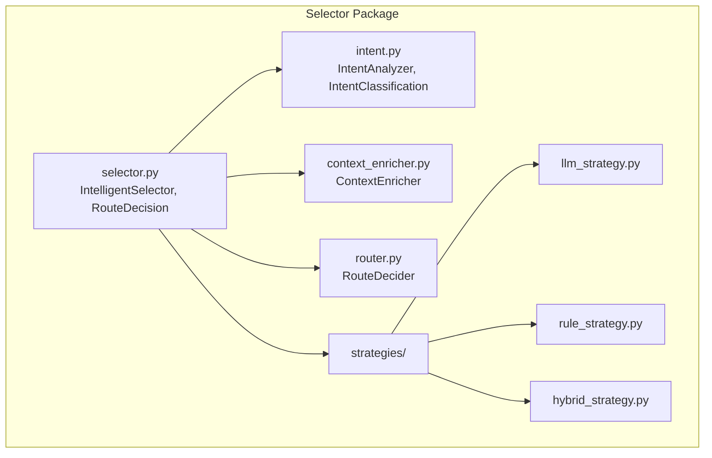
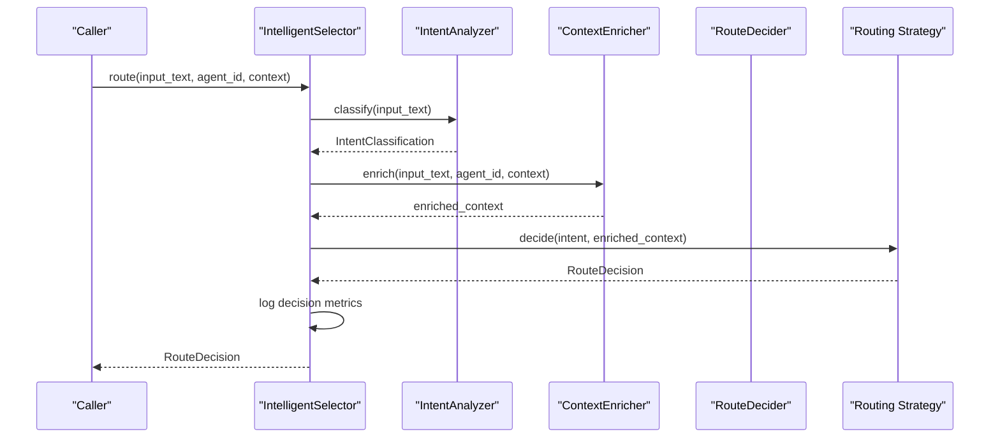
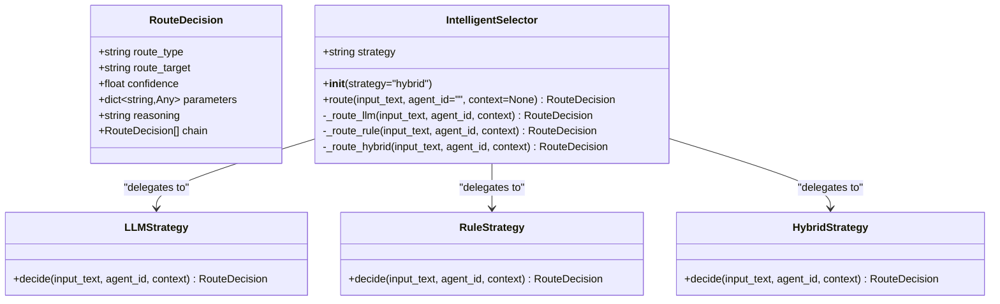
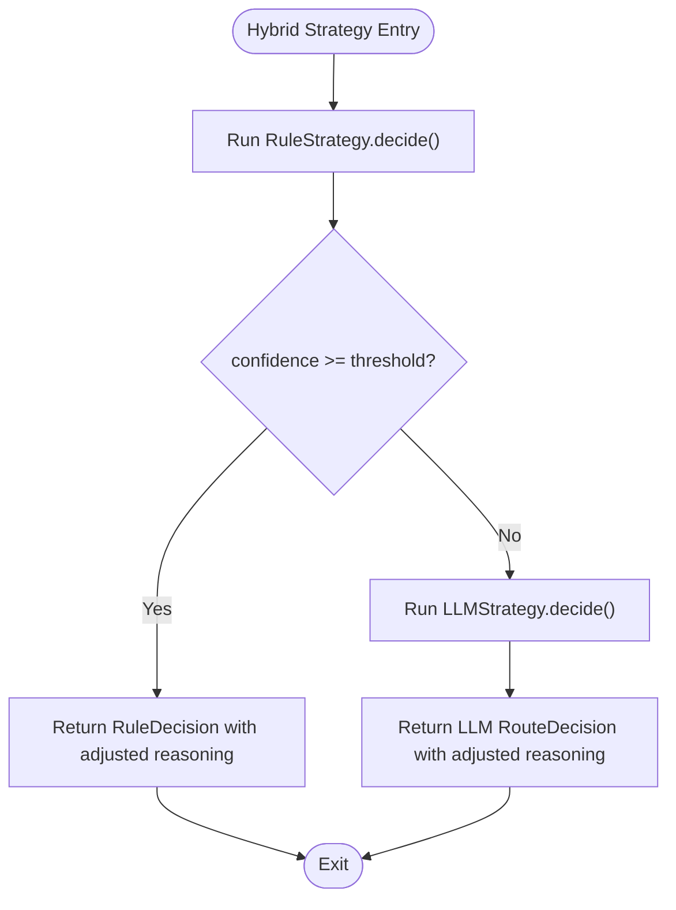
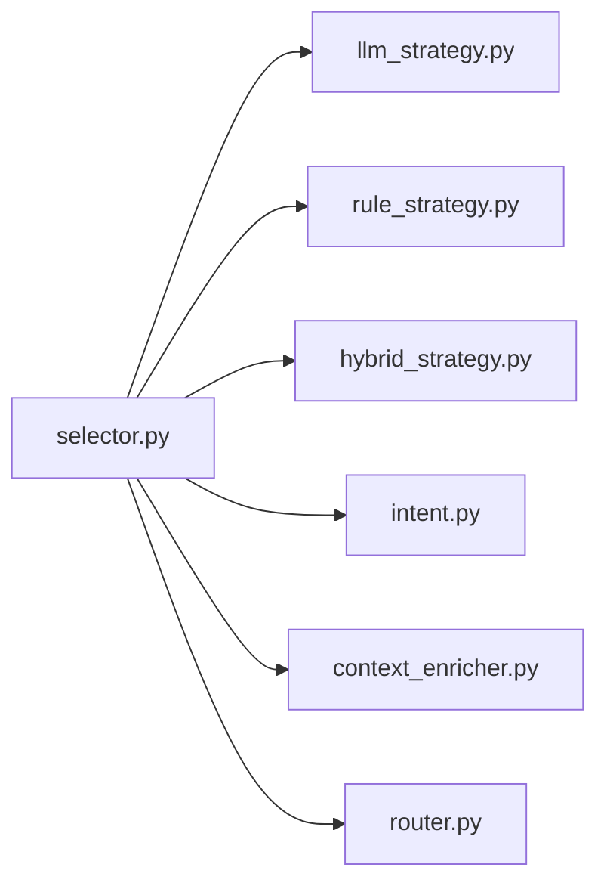

# Selector Core Architecture

<cite>
**Referenced Files in This Document**
- [selector.py](file://python/src/resolvenet/selector/selector.py)
- [router.py](file://python/src/resolvenet/selector/router.py)
- [context_enricher.py](file://python/src/resolvenet/selector/context_enricher.py)
- [intent.py](file://python/src/resolvenet/selector/intent.py)
- [llm_strategy.py](file://python/src/resolvenet/selector/strategies/llm_strategy.py)
- [rule_strategy.py](file://python/src/resolvenet/selector/strategies/rule_strategy.py)
- [hybrid_strategy.py](file://python/src/resolvenet/selector/strategies/hybrid_strategy.py)
- [__init__.py](file://python/src/resolvenet/selector/__init__.py)
- [intelligent-selector.md](file://docs/architecture/intelligent-selector.md)
- [test_selector.py](file://python/tests/unit/test_selector.py)
</cite>

## Table of Contents
1. [Introduction](#introduction)
2. [Project Structure](#project-structure)
3. [Core Components](#core-components)
4. [Architecture Overview](#architecture-overview)
5. [Detailed Component Analysis](#detailed-component-analysis)
6. [Dependency Analysis](#dependency-analysis)
7. [Performance Considerations](#performance-considerations)
8. [Troubleshooting Guide](#troubleshooting-guide)
9. [Conclusion](#conclusion)
10. [Appendices](#appendices)

## Introduction
This document explains the Intelligent Selector core architecture: the RouteDecision data model, the IntelligentSelector orchestrator, the three-stage routing pipeline (intent analysis, context enrichment, route decision), the strategy pattern implementation supporting pluggable routing strategies, and the logging and decision tracking mechanisms. It also covers the relationship between selector components and their role in the overall system architecture.

## Project Structure
The Intelligent Selector lives in the Python package under python/src/resolvenet/selector. The core module exports the main orchestrator class, while supporting modules implement intent analysis, context enrichment, route decision, and pluggable strategies.

**Diagram sources**
- [selector.py:1-100](file://python/src/resolvenet/selector/selector.py#L1-L100)
- [intent.py:1-39](file://python/src/resolvenet/selector/intent.py#L1-L39)
- [context_enricher.py:1-47](file://python/src/resolvenet/selector/context_enricher.py#L1-L47)
- [router.py:1-40](file://python/src/resolvenet/selector/router.py#L1-L40)
- [llm_strategy.py:1-44](file://python/src/resolvenet/selector/strategies/llm_strategy.py#L1-L44)
- [rule_strategy.py:1-77](file://python/src/resolvenet/selector/strategies/rule_strategy.py#L1-L77)
- [hybrid_strategy.py:1-42](file://python/src/resolvenet/selector/strategies/hybrid_strategy.py#L1-L42)

**Section sources**
- [selector.py:1-100](file://python/src/resolvenet/selector/selector.py#L1-L100)
- [__init__.py:1-6](file://python/src/resolvenet/selector/__init__.py#L1-L6)
- [intelligent-selector.md:1-18](file://docs/architecture/intelligent-selector.md#L1-L18)

## Core Components
- RouteDecision: The canonical decision model returned by routing strategies and the selector. It carries routing metadata and optional chaining support.
- IntelligentSelector: The orchestrator implementing the three-stage pipeline and delegating to pluggable strategies.
- Strategies: Pluggable implementations for routing decisions via rule-based, LLM-based, or hybrid approaches.
- Supporting modules: IntentAnalyzer, ContextEnricher, and RouteDecider define the intent classification, context augmentation, and final decision-making abstractions.

Key responsibilities:
- RouteDecision: Standardized output shape for routing decisions.
- IntelligentSelector: Pipeline orchestration, strategy selection, and logging.
- Strategies: Concrete decision-making logic with a shared interface.
- Intent/Context/Router: Stage-specific responsibilities for intent classification, context enrichment, and final routing decision.

**Section sources**
- [selector.py:13-22](file://python/src/resolvenet/selector/selector.py#L13-L22)
- [selector.py:24-100](file://python/src/resolvenet/selector/selector.py#L24-L100)
- [intent.py:8-39](file://python/src/resolvenet/selector/intent.py#L8-L39)
- [context_enricher.py:8-47](file://python/src/resolvenet/selector/context_enricher.py#L8-L47)
- [router.py:10-40](file://python/src/resolvenet/selector/router.py#L10-L40)

## Architecture Overview
The Intelligent Selector follows a staged pipeline:
1. Intent Analysis: Classify the user intent and associated confidence.
2. Context Enrichment: Augment the request with agent memory, capabilities, history, and available resources.
3. Route Decision: Choose among FTA, Skill, RAG, Multi-step, or Direct execution paths.

The selector delegates to pluggable strategies that encapsulate decision logic. Logging captures routing decisions with strategy and outcome metrics.

**Diagram sources**
- [selector.py:43-72](file://python/src/resolvenet/selector/selector.py#L43-L72)
- [intent.py:24-38](file://python/src/resolvenet/selector/intent.py#L24-L38)
- [context_enricher.py:16-46](file://python/src/resolvenet/selector/context_enricher.py#L16-L46)
- [router.py:17-39](file://python/src/resolvenet/selector/router.py#L17-L39)
- [llm_strategy.py:33-43](file://python/src/resolvenet/selector/strategies/llm_strategy.py#L33-L43)
- [rule_strategy.py:35-76](file://python/src/resolvenet/selector/strategies/rule_strategy.py#L35-L76)
- [hybrid_strategy.py:27-41](file://python/src/resolvenet/selector/strategies/hybrid_strategy.py#L27-L41)

## Detailed Component Analysis

### RouteDecision Data Model
RouteDecision is a Pydantic model representing a single routing decision or a chain of decisions. Its fields include:
- route_type: One of the supported route categories (FTA, Skill, RAG, Multi, Direct).
- route_target: Optional identifier for the specific target (e.g., a skill name or workflow ID).
- confidence: Numeric confidence score for the decision.
- parameters: Arbitrary key-value parameters for downstream execution.
- reasoning: Human-readable explanation of the decision rationale.
- chain: Optional list of nested RouteDecision entries for multi-step routing.

Usage examples:
- Creating a direct response decision with high confidence and reasoning.
- Building a chained decision for multi-step workflows.
- Attaching parameters for downstream execution (e.g., skill arguments).

**Section sources**
- [selector.py:13-22](file://python/src/resolvenet/selector/selector.py#L13-L22)

### IntelligentSelector Class Design
IntelligentSelector orchestrates the three-stage routing pipeline:
- Initialization: Accepts a strategy parameter selecting among "llm", "rule", or "hybrid".
- route method: Public API accepting input_text, agent_id, and context, returning a RouteDecision.
- Strategy dispatch: Chooses the active strategy and delegates decision-making.
- Logging: Emits structured logs with strategy, route_type, target, and confidence.

Three-stage process:
1. Intent Analysis: Implemented by IntentAnalyzer (placeholder today).
2. Context Enrichment: Implemented by ContextEnricher (placeholder today).
3. Route Decision: Implemented by RouteDecider (placeholder today).

Strategy pattern:
- _route_llm: Delegates to LLMStrategy.
- _route_rule: Delegates to RuleStrategy.
- _route_hybrid: Delegates to HybridStrategy.

**Diagram sources**
- [selector.py:13-22](file://python/src/resolvenet/selector/selector.py#L13-L22)
- [selector.py:24-100](file://python/src/resolvenet/selector/selector.py#L24-L100)
- [llm_strategy.py:10-44](file://python/src/resolvenet/selector/strategies/llm_strategy.py#L10-L44)
- [rule_strategy.py:11-77](file://python/src/resolvenet/selector/strategies/rule_strategy.py#L11-L77)
- [hybrid_strategy.py:12-42](file://python/src/resolvenet/selector/strategies/hybrid_strategy.py#L12-L42)

**Section sources**
- [selector.py:24-100](file://python/src/resolvenet/selector/selector.py#L24-L100)

### Strategy Pattern Implementation
The selector supports pluggable routing strategies:
- RuleStrategy: Pattern-based matching for known intents with fixed confidence thresholds.
- LLMStrategy: Prompt-driven classification using an LLM with structured JSON output.
- HybridStrategy: Applies RuleStrategy first; if confidence meets threshold, returns rule decision; otherwise falls back to LLMStrategy.

**Diagram sources**
- [hybrid_strategy.py:27-41](file://python/src/resolvenet/selector/strategies/hybrid_strategy.py#L27-L41)
- [rule_strategy.py:35-76](file://python/src/resolvenet/selector/strategies/rule_strategy.py#L35-L76)
- [llm_strategy.py:33-43](file://python/src/resolvenet/selector/strategies/llm_strategy.py#L33-L43)

**Section sources**
- [rule_strategy.py:11-77](file://python/src/resolvenet/selector/strategies/rule_strategy.py#L11-L77)
- [llm_strategy.py:10-44](file://python/src/resolvenet/selector/strategies/llm_strategy.py#L10-L44)
- [hybrid_strategy.py:12-42](file://python/src/resolvenet/selector/strategies/hybrid_strategy.py#L12-L42)

### Route Method Signature and Parameters
- route(input_text: str, agent_id: str = "", context: dict[str, Any] | None = None) -> RouteDecision
- Purpose: Entrypoint for routing a user request through the selector pipeline.
- Behavior: Selects strategy, executes decision logic, logs metrics, and returns a RouteDecision.

Integration points:
- Strategy selection via strategy parameter during initialization.
- Context propagation to enrichment and decision stages.
- Logging via structured logger with decision attributes.

**Section sources**
- [selector.py:43-72](file://python/src/resolvenet/selector/selector.py#L43-L72)

### Logging Integration and Decision Tracking
- Structured logging: The selector emits an info-level log containing strategy, route_type, target, and confidence.
- Decision tracking: RouteDecision fields (route_type, route_target, confidence, reasoning) capture decision provenance and outcomes.
- Chain support: RouteDecision.chain enables multi-step routing tracking.

**Section sources**
- [selector.py:62-70](file://python/src/resolvenet/selector/selector.py#L62-L70)
- [selector.py:13-22](file://python/src/resolvenet/selector/selector.py#L13-L22)

### Examples
- Selector initialization:
  - Using default hybrid strategy.
  - Explicitly selecting rule or llm strategies.
- RouteDecision creation:
  - Direct response with confidence and reasoning.
  - Skill routing with a target and parameters.
  - Chained decisions for multi-step workflows.

Validation:
- Unit tests confirm strategy selection and decision bounds.

**Section sources**
- [test_selector.py:8-29](file://python/tests/unit/test_selector.py#L8-L29)
- [selector.py:35-42](file://python/src/resolvenet/selector/selector.py#L35-L42)
- [rule_strategy.py:44-76](file://python/src/resolvenet/selector/strategies/rule_strategy.py#L44-L76)
- [llm_strategy.py:39-43](file://python/src/resolvenet/selector/strategies/llm_strategy.py#L39-L43)

## Dependency Analysis
The selector composes several modules with clear separation of concerns:
- selector.py depends on strategy implementations and defines the public API.
- strategies are independent and interchangeable.
- intent.py and context_enricher.py are placeholders today but integrate conceptually into the pipeline.
- router.py provides a placeholder decider that will evolve into a production routing engine.

**Diagram sources**
- [selector.py:24-100](file://python/src/resolvenet/selector/selector.py#L24-L100)
- [llm_strategy.py:10-44](file://python/src/resolvenet/selector/strategies/llm_strategy.py#L10-L44)
- [rule_strategy.py:11-77](file://python/src/resolvenet/selector/strategies/rule_strategy.py#L11-L77)
- [hybrid_strategy.py:12-42](file://python/src/resolvenet/selector/strategies/hybrid_strategy.py#L12-L42)
- [intent.py:17-39](file://python/src/resolvenet/selector/intent.py#L17-L39)
- [context_enricher.py:8-47](file://python/src/resolvenet/selector/context_enricher.py#L8-L47)
- [router.py:10-40](file://python/src/resolvenet/selector/router.py#L10-L40)

**Section sources**
- [selector.py:24-100](file://python/src/resolvenet/selector/selector.py#L24-L100)

## Performance Considerations
- Strategy selection: Hybrid strategy prioritizes fast-path rules for known patterns; fallback to LLM ensures coverage for ambiguous inputs.
- Confidence thresholds: HybridStrategy uses a configurable threshold to avoid unnecessary LLM calls.
- Context enrichment: Placeholder implementations should be optimized to fetch only necessary data to minimize latency.
- Logging overhead: Structured logging adds minimal overhead; ensure log levels are tuned for production.

## Troubleshooting Guide
Common issues and remedies:
- Unexpected route_type: Verify strategy selection and confidence thresholds in HybridStrategy.
- Low confidence decisions: Adjust rule patterns or enable LLM fallback.
- Missing targets: Ensure route_target is populated by strategies or decider when applicable.
- Logging gaps: Confirm logger configuration and that route method is invoked.

Validation references:
- Unit tests demonstrate strategy behavior and decision bounds.

**Section sources**
- [test_selector.py:8-29](file://python/tests/unit/test_selector.py#L8-L29)
- [hybrid_strategy.py:21-41](file://python/src/resolvenet/selector/strategies/hybrid_strategy.py#L21-L41)

## Conclusion
The Intelligent Selector provides a modular, extensible routing framework. RouteDecision offers a unified output model, while the strategy pattern enables flexible routing logic. The staged pipeline—intent analysis, context enrichment, and route decision—supports both deterministic and LLM-driven routing. Logging and decision tracking facilitate observability and debugging. As placeholders mature into production implementations, the selector will become a robust meta-router for orchestrating diverse subsystems.

## Appendices
- Supported route types and strategies are documented in the architecture guide.

**Section sources**
- [intelligent-selector.md:1-18](file://docs/architecture/intelligent-selector.md#L1-L18)