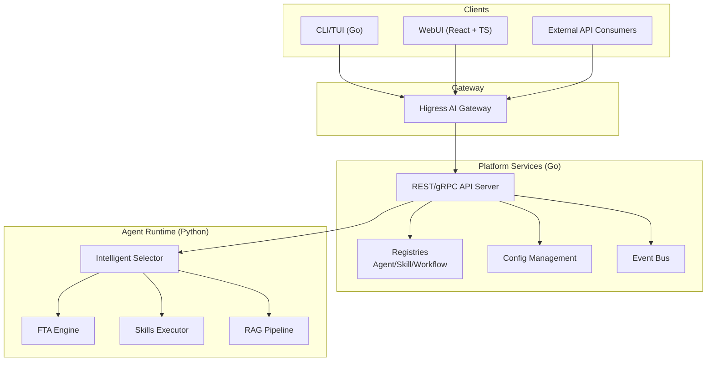
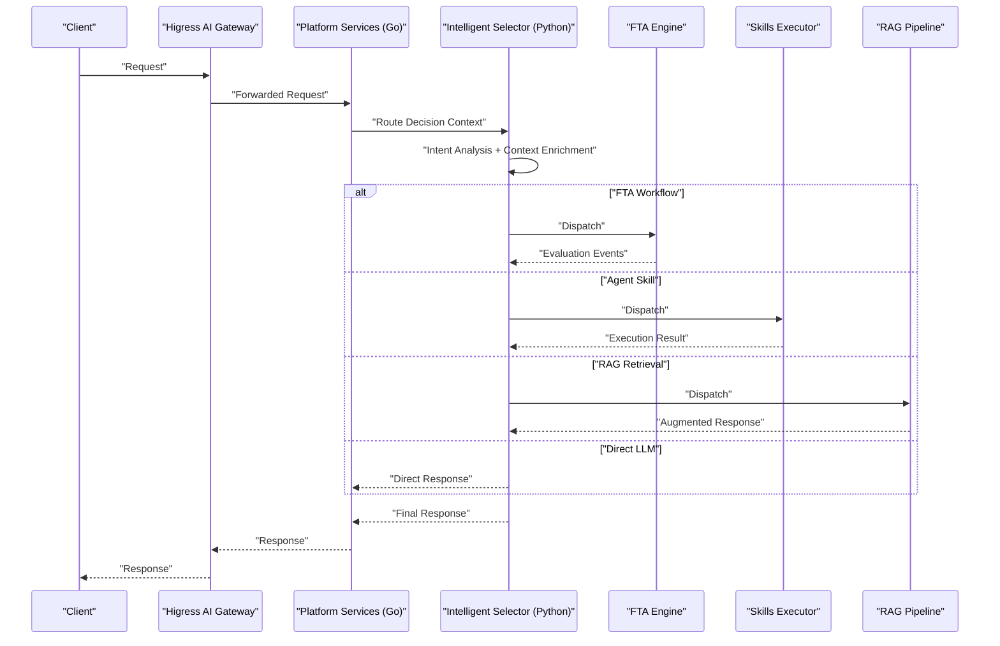
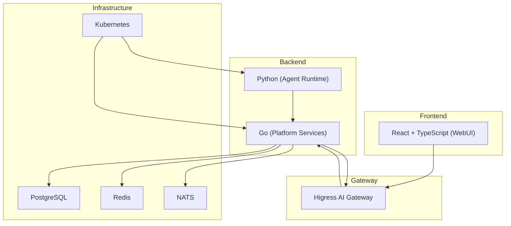

# Introduction and Overview

<cite>
**Referenced Files in This Document**
- [README.md](file://README.md)
- [docs/architecture/overview.md](file://docs/architecture/overview.md)
- [cmd/resolvenet-server/main.go](file://cmd/resolvenet-server/main.go)
- [pkg/server/server.go](file://pkg/server/server.go)
- [pkg/gateway/client.go](file://pkg/gateway/client.go)
- [configs/resolvenet.yaml](file://configs/resolvenet.yaml)
- [python/src/resolvenet/agent/mega.py](file://python/src/resolvenet/agent/mega.py)
- [python/src/resolvenet/selector/router.py](file://python/src/resolvenet/selector/router.py)
- [python/src/resolvenet/rag/pipeline.py](file://python/src/resolvenet/rag/pipeline.py)
- [python/src/resolvenet/fta/engine.py](file://python/src/resolvenet/fta/engine.py)
- [python/src/resolvenet/llm/provider.py](file://python/src/resolvenet/llm/provider.py)
- [web/src/App.tsx](file://web/src/App.tsx)
- [deploy/docker/platform.Dockerfile](file://deploy/docker/platform.Dockerfile)
</cite>

## Table of Contents
1. [Introduction](#introduction)
2. [Project Structure](#project-structure)
3. [Core Components](#core-components)
4. [Architecture Overview](#architecture-overview)
5. [Technology Stack Overview](#technology-stack-overview)
6. [Key Benefits](#key-benefits)
7. [Target Audience and Use Cases](#target-audience-and-use-cases)
8. [Conclusion](#conclusion)

## Introduction
ResolveNet is a CNCF-grade open-source Mega Agent platform designed to unify three pillars of intelligent automation under a single, adaptive routing layer:
- Agent Skills: Extensible, sandboxed plugins that execute tasks across diverse domains
- Fault Tree Analysis (FTA) Workflows: Structured, logic-driven reasoning engines for risk assessment and decision-making
- Retrieval-Augmented Generation (RAG): Context-aware knowledge retrieval and augmentation for grounded responses

Built on AgentScope for agent orchestration and Higress for AI gateway capabilities, ResolveNet provides an intelligent routing layer that steers user requests to the most suitable execution path—FTA workflows, agent skills, RAG retrieval, or direct LLM responses—based on intent analysis and contextual enrichment.

This platform targets organizations seeking a cloud-native, multi-modal, and extensible solution for building intelligent agents that can reason, act, and learn from structured workflows and unstructured knowledge.

**Section sources**
- [README.md:10-184](file://README.md#L10-L184)

## Project Structure
ResolveNet is organized into distinct layers that reflect separation of concerns and cloud-native deployment patterns:
- Platform Services (Go): REST/gRPC API server, registries, configuration management, and event bus
- Agent Runtime (Python): Agent execution engine, Intelligent Selector, FTA/Skills/RAG subsystems
- CLI/TUI (Go): Command-line interface and terminal dashboard for local development and operations
- WebUI (React + TypeScript): Management console with visual editors for FTA workflows and resource management
- Gateway (Higress): AI gateway for authentication, rate limiting, model routing, and route rules
- Deployment: Docker images, Docker Compose, and Helm charts for containerized and Kubernetes-native deployments

**Diagram sources**
- [README.md:14-46](file://README.md#L14-L46)
- [docs/architecture/overview.md:3-16](file://docs/architecture/overview.md#L3-L16)

**Section sources**
- [README.md:116-139](file://README.md#L116-L139)

## Core Components
ResolveNet’s core components work together to deliver unified intelligence:

- Platform Services (Go)
  - Provides REST and gRPC APIs, manages registries, configuration, and eventing
  - Starts both HTTP and gRPC servers and handles graceful shutdown
  - Exposes health checks and reflection for diagnostics

- Agent Runtime (Python)
  - MegaAgent orchestrates requests through the Intelligent Selector
  - Intelligent Selector analyzes intent, enriches context, and decides routing
  - FTA Engine executes structured workflows with gates and basic events
  - RAG Pipeline ingests, indexes, retrieves, and augments responses
  - LLM Provider abstraction enables multi-provider compatibility

- CLI/TUI (Go)
  - Full command-line tooling for agent lifecycle, skill management, workflow creation, and RAG operations
  - Interactive terminal dashboard for operational visibility

- WebUI (React + TypeScript)
  - Management console with routes for agents, skills, workflows, and RAG collections
  - Visual FTA designer and playground for experimentation

- Gateway (Higress)
  - Integrates with the platform to enforce authentication, rate limits, and model routing
  - Provides admin API connectivity for dynamic route management

**Section sources**
- [pkg/server/server.go:19-104](file://pkg/server/server.go#L19-L104)
- [cmd/resolvenet-server/main.go:16-55](file://cmd/resolvenet-server/main.go#L16-L55)
- [python/src/resolvenet/agent/mega.py:13-74](file://python/src/resolvenet/agent/mega.py#L13-L74)
- [python/src/resolvenet/selector/router.py:10-40](file://python/src/resolvenet/selector/router.py#L10-L40)
- [python/src/resolvenet/fta/engine.py:14-83](file://python/src/resolvenet/fta/engine.py#L14-L83)
- [python/src/resolvenet/rag/pipeline.py:11-75](file://python/src/resolvenet/rag/pipeline.py#L11-L75)
- [python/src/resolvenet/llm/provider.py:27-77](file://python/src/resolvenet/llm/provider.py#L27-L77)
- [web/src/App.tsx:17-37](file://web/src/App.tsx#L17-L37)
- [pkg/gateway/client.go:9-31](file://pkg/gateway/client.go#L9-L31)

## Architecture Overview
ResolveNet’s architecture centers on an intelligent routing layer that evaluates incoming requests and selects the optimal execution path. The flow begins at the Higress AI gateway, which authenticates and routes traffic to the Platform Services. From there, the Intelligent Selector determines whether to invoke FTA workflows, agent skills, RAG retrieval, or a direct LLM response. The Agent Runtime executes the chosen path and returns results back through the gateway to the client.

**Diagram sources**
- [README.md:14-46](file://README.md#L14-L46)
- [python/src/resolvenet/agent/mega.py:32-74](file://python/src/resolvenet/agent/mega.py#L32-L74)
- [python/src/resolvenet/selector/router.py:17-40](file://python/src/resolvenet/selector/router.py#L17-L40)
- [python/src/resolvenet/fta/engine.py:24-83](file://python/src/resolvenet/fta/engine.py#L24-L83)
- [python/src/resolvenet/rag/pipeline.py:28-75](file://python/src/resolvenet/rag/pipeline.py#L28-L75)

## Technology Stack Overview
ResolveNet leverages a modern, cloud-native stack to enable scalability, operability, and extensibility:
- Backend: Go for platform services, offering robust HTTP/gRPC servers, configuration management, and deployment-ready binaries
- Runtime: Python for agent orchestration, with AgentScope integration for agent lifecycle and multi-modal capabilities
- Frontend: React + TypeScript for a responsive WebUI with routing, forms, and visual editors
- Gateway: Higress for AI gateway features including authentication, rate limiting, and model routing
- Storage and Messaging: PostgreSQL, Redis, and NATS for persistence, caching, and eventing
- Observability: OpenTelemetry instrumentation and optional metrics export
- Packaging: Docker images and Helm charts for containerized and Kubernetes-native deployments

**Diagram sources**
- [README.md:141-149](file://README.md#L141-L149)
- [configs/resolvenet.yaml:3-34](file://configs/resolvenet.yaml#L3-L34)
- [deploy/docker/platform.Dockerfile:1-26](file://deploy/docker/platform.Dockerfile#L1-L26)

**Section sources**
- [README.md:6-9](file://README.md#L6-L9)
- [README.md:141-149](file://README.md#L141-L149)
- [configs/resolvenet.yaml:3-34](file://configs/resolvenet.yaml#L3-L34)
- [deploy/docker/platform.Dockerfile:1-26](file://deploy/docker/platform.Dockerfile#L1-L26)

## Key Benefits
ResolveNet delivers tangible advantages for teams building intelligent agents and automated workflows:

- LLM-powered Meta-Routing
  - Intelligent Selector analyzes intent and enriches context to choose the best execution path among FTA, Skills, RAG, or direct LLM responses
  - Enables adaptive, scenario-aware routing that improves accuracy and reduces unnecessary compute

- Chinese LLM Support
  - First-class integrations with Qwen, Wenxin (ERNIE), and Zhipu (GLM)
  - OpenAI-compatible provider abstraction allows seamless extension to other providers

- Cloud-Native Deployment
  - Container-first design with Docker images and Helm charts
  - Kubernetes-native with service discovery, health checks, and observability
  - Development-friendly Docker Compose for local iteration

- Multi-Modal Interfaces
  - CLI/TUI for developers and operators
  - WebUI with visual FTA designer and resource management
  - REST/gRPC APIs for external integrations

- Unified Agent Ecosystem
  - Agent Skills with sandboxed execution and manifest-based configuration
  - FTA Workflows for structured, logic-driven reasoning
  - RAG Pipeline for knowledge-intensive tasks with vector indexing and retrieval

**Section sources**
- [README.md:48-58](file://README.md#L48-L58)
- [python/src/resolvenet/llm/provider.py:27-77](file://python/src/resolvenet/llm/provider.py#L27-L77)
- [python/src/resolvenet/agent/mega.py:13-74](file://python/src/resolvenet/agent/mega.py#L13-L74)
- [python/src/resolvenet/selector/router.py:10-40](file://python/src/resolvenet/selector/router.py#L10-L40)
- [python/src/resolvenet/rag/pipeline.py:11-75](file://python/src/resolvenet/rag/pipeline.py#L11-L75)
- [python/src/resolvenet/fta/engine.py:14-83](file://python/src/resolvenet/fta/engine.py#L14-L83)

## Target Audience and Use Cases
ResolveNet is ideal for:
- Organizations building intelligent agents that require structured reasoning, skill-based actions, and knowledge-grounded responses
- Teams needing a CNCF-grade platform for cloud-native deployment and multi-modal interfaces
- Developers and operators who want unified tooling for agent lifecycle, workflow design, and RAG operations

Common use cases include:
- Risk assessment and incident analysis using FTA workflows
- Automated task execution via agent skills (code execution, file operations, web search)
- Knowledge-intensive Q&A powered by RAG pipelines
- Multi-modal conversational agents that adapt their response strategy based on intent

**Section sources**
- [README.md:10-184](file://README.md#L10-L184)

## Conclusion
ResolveNet unifies Agent Skills, Fault Tree Analysis, and Retrieval-Augmented Generation under a single, intelligent routing layer. Its CNCF-grade architecture, cloud-native tooling, and multi-modal interfaces make it a powerful foundation for building scalable, extensible intelligent agents. Whether you are designing structured reasoning workflows, automating tasks with skills, or grounding conversations with RAG, ResolveNet provides the components and interfaces to bring your vision to life.

[No sources needed since this section summarizes without analyzing specific files]