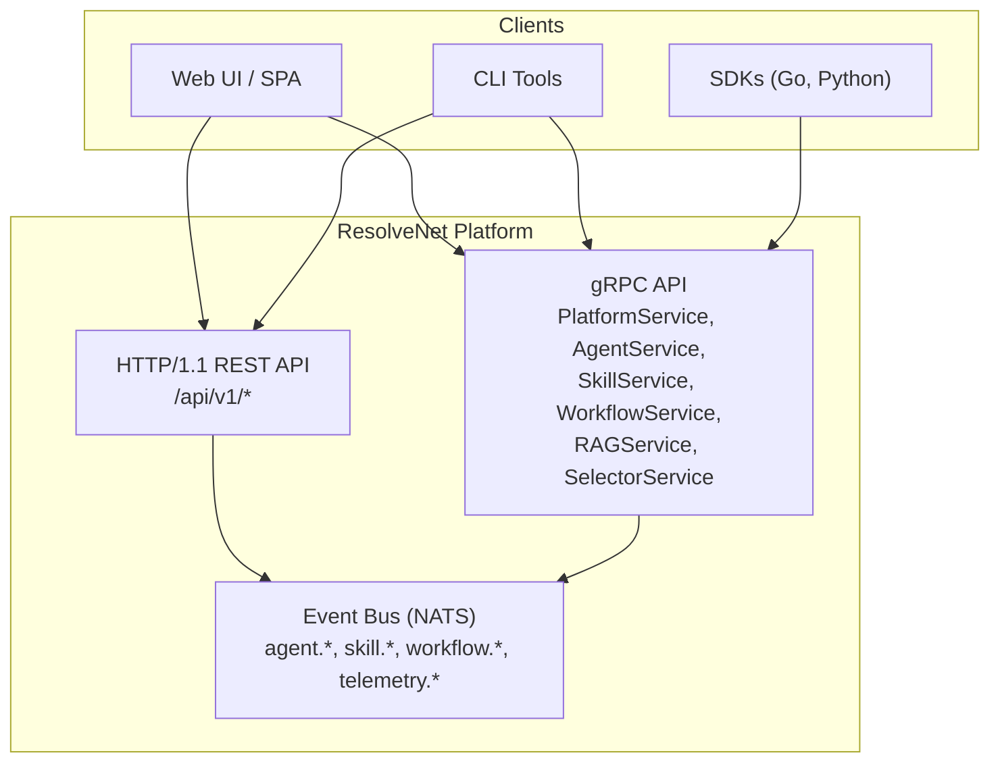
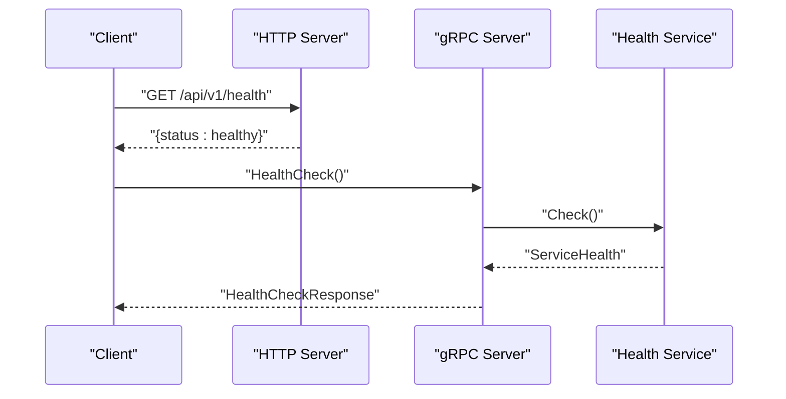
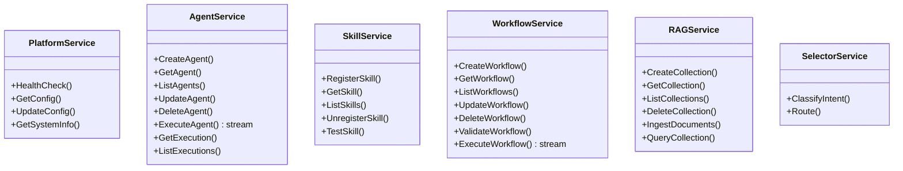
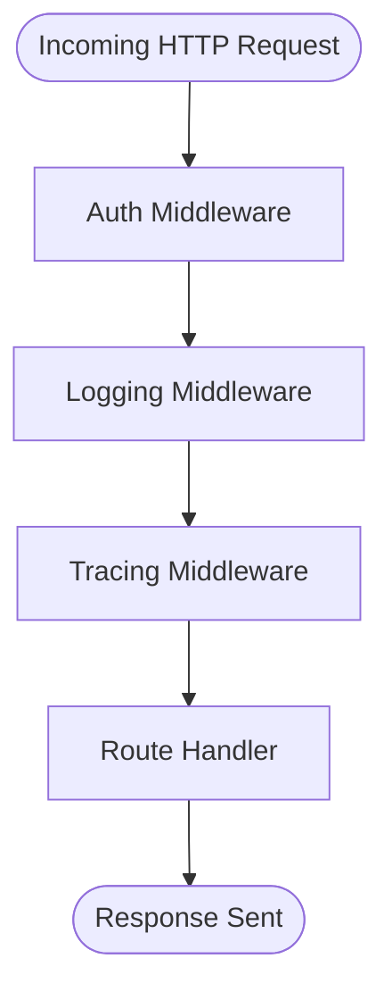
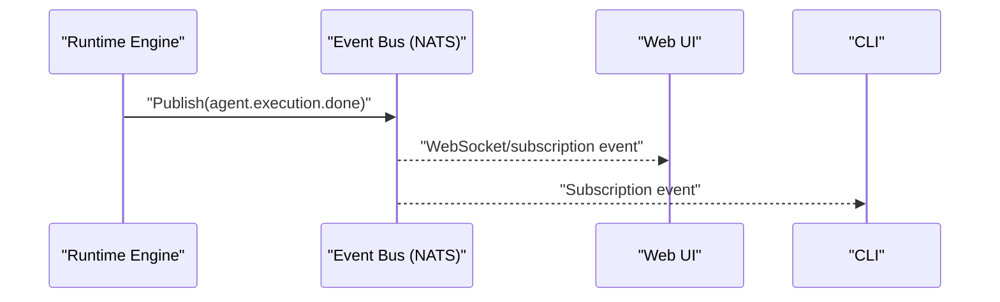
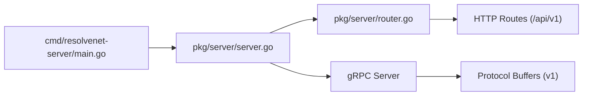

# API Layer and Endpoints

<cite>
**Referenced Files in This Document**
- [main.go](file://cmd/resolvenet-server/main.go)
- [router.go](file://pkg/server/router.go)
- [server.go](file://pkg/server/server.go)
- [auth.go](file://pkg/server/middleware/auth.go)
- [logging.go](file://pkg/server/middleware/logging.go)
- [tracing.go](file://pkg/server/middleware/tracing.go)
- [platform.proto](file://api/proto/resolvenet/v1/platform.proto)
- [agent.proto](file://api/proto/resolvenet/v1/agent.proto)
- [skill.proto](file://api/proto/resolvenet/v1/skill.proto)
- [workflow.proto](file://api/proto/resolvenet/v1/workflow.proto)
- [rag.proto](file://api/proto/resolvenet/v1/rag.proto)
- [selector.proto](file://api/proto/resolvenet/v1/selector.proto)
- [common.proto](file://api/proto/resolvenet/v1/common.proto)
- [resolvenet.yaml](file://configs/resolvenet.yaml)
- [nginx.conf](file://deploy/docker/nginx.conf)
- [event.go](file://pkg/event/event.go)
- [nats.go](file://pkg/event/nats.go)
</cite>

## Table of Contents
1. [Introduction](#introduction)
2. [Project Structure](#project-structure)
3. [Core Components](#core-components)
4. [Architecture Overview](#architecture-overview)
5. [Detailed Component Analysis](#detailed-component-analysis)
6. [Dependency Analysis](#dependency-analysis)
7. [Performance Considerations](#performance-considerations)
8. [Troubleshooting Guide](#troubleshooting-guide)
9. [Conclusion](#conclusion)
10. [Appendices](#appendices)

## Introduction
This document describes the unified API layer of ResolveNet, covering:
- REST endpoints (HTTP/1.1) with HTTP methods, URL patterns, request/response schemas, and current stub implementations
- gRPC services defined via Protocol Buffers for strongly typed cross-language communication
- Middleware stack for authentication, logging, and distributed tracing
- Real-time event streaming via an event bus (NATS) and conceptual WebSocket considerations
- Examples of API usage patterns for agent management, skill registration, workflow execution, and system monitoring
- Error handling, status codes, and response formatting
- Rate limiting, security considerations, and CORS configuration
- API versioning strategy, backward compatibility, and deprecation policies
- Client SDK usage guidance and integration patterns
- Performance optimization tips, pagination strategies, and bulk operation handling

## Project Structure
ResolveNet exposes:
- An HTTP/1.1 REST API with versioned paths under /api/v1
- A gRPC API with health checks and reflection enabled
- Protocol Buffer service definitions for agents, skills, workflows, RAG, selectors, and platform services
- A configuration-driven server with optional gateway and telemetry integration
- An event bus (NATS) for asynchronous notifications and potential WebSocket bridging

**Diagram sources**
- [router.go:10-55](file://pkg/server/router.go#L10-L55)
- [server.go:34-49](file://pkg/server/server.go#L34-L49)
- [platform.proto:9-15](file://api/proto/resolvenet/v1/platform.proto#L9-L15)
- [agent.proto:11-29](file://api/proto/resolvenet/v1/agent.proto#L11-L29)
- [skill.proto:10-17](file://api/proto/resolvenet/v1/skill.proto#L10-L17)
- [workflow.proto:11-20](file://api/proto/resolvenet/v1/workflow.proto#L11-L20)
- [rag.proto:10-18](file://api/proto/resolvenet/v1/rag.proto#L10-L18)
- [selector.proto:10-14](file://api/proto/resolvenet/v1/selector.proto#L10-L14)
- [nats.go:8-39](file://pkg/event/nats.go#L8-L39)

**Section sources**
- [main.go:16-55](file://cmd/resolvenet-server/main.go#L16-L55)
- [server.go:27-52](file://pkg/server/server.go#L27-L52)
- [router.go:10-55](file://pkg/server/router.go#L10-L55)

## Core Components
- HTTP REST server with versioned routes under /api/v1
- gRPC server with health service and reflection
- Protocol Buffer service definitions for platform, agent, skill, workflow, RAG, and selector domains
- Middleware stack for authentication, logging, and tracing
- Event bus (NATS) for asynchronous notifications

Key responsibilities:
- REST: Exposes CRUD and operational endpoints for agents, skills, workflows, RAG collections, and system info
- gRPC: Provides strongly typed RPCs for the same domains plus streaming execution results
- Middleware: Authentication (placeholder), logging, and tracing (placeholder)
- Events: Publishes and subscribes to domain-specific events

**Section sources**
- [router.go:10-55](file://pkg/server/router.go#L10-L55)
- [server.go:34-49](file://pkg/server/server.go#L34-L49)
- [auth.go:8-17](file://pkg/server/middleware/auth.go#L8-L17)
- [logging.go:19-37](file://pkg/server/middleware/logging.go#L19-L37)
- [tracing.go:7-18](file://pkg/server/middleware/tracing.go#L7-L18)
- [platform.proto:9-61](file://api/proto/resolvenet/v1/platform.proto#L9-L61)
- [agent.proto:11-177](file://api/proto/resolvenet/v1/agent.proto#L11-L177)
- [skill.proto:10-101](file://api/proto/resolvenet/v1/skill.proto#L10-L101)
- [workflow.proto:11-145](file://api/proto/resolvenet/v1/workflow.proto#L11-L145)
- [rag.proto:10-99](file://api/proto/resolvenet/v1/rag.proto#L10-L99)
- [selector.proto:10-40](file://api/proto/resolvenet/v1/selector.proto#L10-L40)

## Architecture Overview
The API layer integrates HTTP and gRPC with a shared Protocol Buffer schema. The server initializes both transports and registers health and reflection for diagnostics. Clients can choose REST or gRPC depending on their needs.

**Diagram sources**
- [router.go:57-67](file://pkg/server/router.go#L57-L67)
- [server.go:34-42](file://pkg/server/server.go#L34-L42)
- [platform.proto:10-14](file://api/proto/resolvenet/v1/platform.proto#L10-L14)

## Detailed Component Analysis

### REST API Endpoints
All REST endpoints are under /api/v1 and return JSON. Current handlers are stubs; production implementations will replace them.

- System
  - GET /api/v1/health → {"status":"healthy"}
  - GET /api/v1/system/info → includes version, commit, build date

- Agent Management
  - GET /api/v1/agents → list agents (stub returns empty list)
  - POST /api/v1/agents → create agent (stub 501 Not Implemented)
  - GET /api/v1/agents/{id} → get agent (stub 404 Not Found)
  - PUT /api/v1/agents/{id} → update agent (stub 501 Not Implemented)
  - DELETE /api/v1/agents/{id} → delete agent (stub 501 Not Implemented)
  - POST /api/v1/agents/{id}/execute → execute agent (stub 501 Not Implemented)

- Skill Registration
  - GET /api/v1/skills → list skills (stub returns empty list)
  - POST /api/v1/skills → register skill (stub 501 Not Implemented)
  - GET /api/v1/skills/{name} → get skill (stub 404 Not Found)
  - DELETE /api/v1/skills/{name} → unregister skill (stub 501 Not Implemented)

- Workflow Execution
  - GET /api/v1/workflows → list workflows (stub returns empty list)
  - POST /api/v1/workflows → create workflow (stub 501 Not Implemented)
  - GET /api/v1/workflows/{id} → get workflow (stub 404 Not Found)
  - PUT /api/v1/workflows/{id} → update workflow (stub 501 Not Implemented)
  - DELETE /api/v1/workflows/{id} → delete workflow (stub 501 Not Implemented)
  - POST /api/v1/workflows/{id}/validate → validate workflow (stub 501 Not Implemented)
  - POST /api/v1/workflows/{id}/execute → execute workflow (stub 501 Not Implemented)

- RAG Operations
  - GET /api/v1/rag/collections → list collections (stub returns empty list)
  - POST /api/v1/rag/collections → create collection (stub 501 Not Implemented)
  - DELETE /api/v1/rag/collections/{id} → delete collection (stub 501 Not Implemented)
  - POST /api/v1/rag/collections/{id}/ingest → ingest documents (stub 501 Not Implemented)
  - POST /api/v1/rag/collections/{id}/query → query collection (stub 501 Not Implemented)

- Model Catalog
  - GET /api/v1/models → list models (stub returns empty list)
  - POST /api/v1/models → add model (stub 501 Not Implemented)

- Configuration
  - GET /api/v1/config → get config (stub 501 Not Implemented)
  - PUT /api/v1/config → update config (stub 501 Not Implemented)

Response format:
- JSON body with consistent keys per endpoint
- Status codes reflect outcome (200 OK, 404 Not Found, 501 Not Implemented)

**Section sources**
- [router.go:10-55](file://pkg/server/router.go#L10-L55)
- [router.go:57-182](file://pkg/server/router.go#L57-L182)

### gRPC Services and Protocol Buffers
The gRPC API is defined in Protocol Buffers and includes:
- PlatformService: health checks, system info, configuration get/update
- AgentService: agent lifecycle, execution, and execution history
- SkillService: skill registration, retrieval, listing, unregistration, testing
- WorkflowService: workflow lifecycle, validation, and streaming execution events
- RAGService: collection lifecycle and ingestion/query
- SelectorService: intent classification and routing decisions

Common patterns:
- PaginationRequest/PaginationResponse for list APIs
- ResourceMeta and ResourceStatus for resource metadata and state
- Streaming RPCs for long-running operations (agent execution, workflow execution)

**Diagram sources**
- [platform.proto:9-61](file://api/proto/resolvenet/v1/platform.proto#L9-L61)
- [agent.proto:11-177](file://api/proto/resolvenet/v1/agent.proto#L11-L177)
- [skill.proto:10-101](file://api/proto/resolvenet/v1/skill.proto#L10-L101)
- [workflow.proto:11-145](file://api/proto/resolvenet/v1/workflow.proto#L11-L145)
- [rag.proto:10-99](file://api/proto/resolvenet/v1/rag.proto#L10-L99)
- [selector.proto:10-40](file://api/proto/resolvenet/v1/selector.proto#L10-L40)

**Section sources**
- [platform.proto:9-61](file://api/proto/resolvenet/v1/platform.proto#L9-L61)
- [agent.proto:11-177](file://api/proto/resolvenet/v1/agent.proto#L11-L177)
- [skill.proto:10-101](file://api/proto/resolvenet/v1/skill.proto#L10-L101)
- [workflow.proto:11-145](file://api/proto/resolvenet/v1/workflow.proto#L11-L145)
- [rag.proto:10-99](file://api/proto/resolvenet/v1/rag.proto#L10-L99)
- [selector.proto:10-40](file://api/proto/resolvenet/v1/selector.proto#L10-L40)
- [common.proto:9-49](file://api/proto/resolvenet/v1/common.proto#L9-L49)

### Middleware Stack
- Authentication: Placeholder middleware (no-op) intended for JWT or API key validation
- Logging: Wraps response writer to capture status code and logs method, path, status, duration, remote address
- Tracing: Placeholder middleware for OpenTelemetry span creation

**Diagram sources**
- [auth.go:8-17](file://pkg/server/middleware/auth.go#L8-L17)
- [logging.go:19-37](file://pkg/server/middleware/logging.go#L19-L37)
- [tracing.go:7-18](file://pkg/server/middleware/tracing.go#L7-L18)

**Section sources**
- [auth.go:8-17](file://pkg/server/middleware/auth.go#L8-L17)
- [logging.go:19-37](file://pkg/server/middleware/logging.go#L19-L37)
- [tracing.go:7-18](file://pkg/server/middleware/tracing.go#L7-L18)

### Real-Time Event Streaming
ResolveNet uses an event bus (NATS) to publish domain events (e.g., agent lifecycle, execution, skill registration, workflow events, telemetry). While HTTP/gRPC are pull/push oriented, the event bus enables push-style notifications suitable for WebSocket bridging.

**Diagram sources**
- [nats.go:27-39](file://pkg/event/nats.go#L27-L39)
- [event.go:7-22](file://pkg/event/event.go#L7-L22)

**Section sources**
- [nats.go:8-39](file://pkg/event/nats.go#L8-L39)
- [event.go:7-22](file://pkg/event/event.go#L7-L22)

### API Usage Patterns

- Agent Management
  - Create an agent via REST POST /api/v1/agents or gRPC AgentService.CreateAgent
  - Retrieve, update, delete via respective endpoints/RPCs
  - Execute via POST /api/v1/agents/{id}/execute or AgentService.ExecuteAgent (streaming)

- Skill Registration
  - Register a skill via REST POST /api/v1/skills or gRPC SkillService.RegisterSkill
  - Test a skill via REST POST /api/v1/skills/{name}/test or SkillService.TestSkill

- Workflow Execution
  - Define and validate a workflow via REST or gRPC
  - Execute via REST POST /api/v1/workflows/{id}/execute or WorkflowService.ExecuteWorkflow (streaming)

- System Monitoring
  - Health check via GET /api/v1/health
  - System info via GET /api/v1/system/info
  - PlatformService.GetSystemInfo for gRPC clients

**Section sources**
- [router.go:18-47](file://pkg/server/router.go#L18-L47)
- [agent.proto:12-28](file://api/proto/resolvenet/v1/agent.proto#L12-L28)
- [skill.proto:11-16](file://api/proto/resolvenet/v1/skill.proto#L11-L16)
- [workflow.proto:12-19](file://api/proto/resolvenet/v1/workflow.proto#L12-L19)
- [platform.proto:10-14](file://api/proto/resolvenet/v1/platform.proto#L10-L14)

### Error Handling, Status Codes, and Response Formatting
- REST
  - 200 OK for successful operations
  - 404 Not Found for missing resources (e.g., agent not found)
  - 501 Not Implemented for unimplemented endpoints
  - JSON bodies with consistent keys per endpoint
- gRPC
  - Standard gRPC status codes (OK, NotFound, Unimplemented, etc.)
  - Use of ErrorDetail for structured error metadata in common.proto

**Section sources**
- [router.go:79-82](file://pkg/server/router.go#L79-L82)
- [router.go:104-107](file://pkg/server/router.go#L104-L107)
- [router.go:121-124](file://pkg/server/router.go#L121-L124)
- [router.go:154-156](file://pkg/server/router.go#L154-L156)
- [router.go:170-176](file://pkg/server/router.go#L170-L176)
- [common.proto:21-26](file://api/proto/resolvenet/v1/common.proto#L21-L26)

### Rate Limiting, Security, and CORS
- Rate limiting: Not implemented in the current codebase
- Authentication: Placeholder middleware; implement JWT or API key validation
- CORS: CORS configuration is supported via configuration file; enable and customize allowed origins/methods/headers
- TLS/Transport security: Configure server addresses and reverse proxy TLS termination as needed

**Section sources**
- [auth.go:8-17](file://pkg/server/middleware/auth.go#L8-L17)
- [resolvenet.yaml:61-75](file://configs/resolvenet.yaml#L61-L75)
- [nginx.conf:11-16](file://deploy/docker/nginx.conf#L11-L16)

### API Versioning, Backward Compatibility, and Deprecation
- Versioning strategy: REST endpoints are under /api/v1; gRPC services are versioned in package resolvenet.v1
- Backward compatibility: Keep field numbers stable, avoid removing fields, add new fields with new tags
- Deprecation policy: Mark fields as reserved, introduce new versions, and maintain old versions during transition period

**Section sources**
- [router.go:12-16](file://pkg/server/router.go#L12-L16)
- [platform.proto:3](file://api/proto/resolvenet/v1/platform.proto#L3)
- [agent.proto:3](file://api/proto/resolvenet/v1/agent.proto#L3)
- [skill.proto:3](file://api/proto/resolvenet/v1/skill.proto#L3)
- [workflow.proto:3](file://api/proto/resolvenet/v1/workflow.proto#L3)
- [rag.proto:3](file://api/proto/resolvenet/v1/rag.proto#L3)
- [selector.proto:3](file://api/proto/resolvenet/v1/selector.proto#L3)

### Client SDK Usage and Integration Patterns
- Go: Use generated gRPC stubs from the .proto files
- Python: Use the provided Python runtime and SDK modules for agent, skill, and runtime orchestration
- REST: Construct HTTP requests to /api/v1 endpoints and parse JSON responses
- gRPC: Use the generated client stubs to call RPCs; leverage streaming for execution results

**Section sources**
- [agent.proto:5](file://api/proto/resolvenet/v1/agent.proto#L5)
- [skill.proto:5](file://api/proto/resolvenet/v1/skill.proto#L5)
- [workflow.proto:5](file://api/proto/resolvenet/v1/workflow.proto#L5)
- [rag.proto:5](file://api/proto/resolvenet/v1/rag.proto#L5)
- [selector.proto:5](file://api/proto/resolvenet/v1/selector.proto#L5)
- [platform.proto:5](file://api/proto/resolvenet/v1/platform.proto#L5)

## Dependency Analysis
The server composes HTTP and gRPC transports, registers health and reflection, and wires the REST routes. Protocol Buffer definitions define the canonical API contracts.

**Diagram sources**
- [main.go:30-34](file://cmd/resolvenet-server/main.go#L30-L34)
- [server.go:27-52](file://pkg/server/server.go#L27-L52)
- [router.go:11-55](file://pkg/server/router.go#L11-L55)

**Section sources**
- [main.go:30-34](file://cmd/resolvenet-server/main.go#L30-L34)
- [server.go:27-52](file://pkg/server/server.go#L27-L52)
- [router.go:11-55](file://pkg/server/router.go#L11-L55)

## Performance Considerations
- Pagination: Use PaginationRequest/PaginationResponse consistently across list APIs to limit payload sizes
- Bulk operations: Prefer batch ingestion for RAG documents; implement server-side batching where feasible
- Streaming: Use gRPC streaming for long-running executions to reduce polling overhead
- Caching: Cache frequently accessed metadata (e.g., system info) at the edge or in front proxies
- Compression: Enable gzip/deflate at the reverse proxy level for REST responses
- Concurrency: Tune server timeouts and worker pools according to workload characteristics

[No sources needed since this section provides general guidance]

## Troubleshooting Guide
- Health checks: Verify GET /api/v1/health returns healthy; confirm gRPC health service responds
- Logging: Inspect logs emitted by the logging middleware for method/path/status/duration
- Tracing: Enable tracing middleware to capture spans for observability
- Events: Confirm NATS bus initialization and subscriptions; ensure event topics match expectations
- CORS: Validate allowed origins/methods/headers in configuration and reverse proxy

**Section sources**
- [router.go:57-67](file://pkg/server/router.go#L57-L67)
- [logging.go:28-34](file://pkg/server/middleware/logging.go#L28-L34)
- [nats.go:17-25](file://pkg/event/nats.go#L17-L25)
- [resolvenet.yaml:61-75](file://configs/resolvenet.yaml#L61-L75)
- [nginx.conf:11-16](file://deploy/docker/nginx.conf#L11-L16)

## Conclusion
ResolveNet’s unified API layer combines REST and gRPC with Protocol Buffer-defined contracts, a configurable server, and an event bus for real-time updates. While many REST handlers are currently stubs, the gRPC services and middleware foundation provide a strong base for building production-grade integrations. Implement authentication, rate limiting, and robust error handling to secure and scale the API.

[No sources needed since this section summarizes without analyzing specific files]

## Appendices

### REST Endpoint Reference
- System
  - GET /api/v1/health → {"status":"healthy"}
  - GET /api/v1/system/info → {version, commit, build_date}

- Agent
  - GET /api/v1/agents → list
  - POST /api/v1/agents → create
  - GET /api/v1/agents/{id} → get
  - PUT /api/v1/agents/{id} → update
  - DELETE /api/v1/agents/{id} → delete
  - POST /api/v1/agents/{id}/execute → execute

- Skill
  - GET /api/v1/skills → list
  - POST /api/v1/skills → register
  - GET /api/v1/skills/{name} → get
  - DELETE /api/v1/skills/{name} → unregister

- Workflow
  - GET /api/v1/workflows → list
  - POST /api/v1/workflows → create
  - GET /api/v1/workflows/{id} → get
  - PUT /api/v1/workflows/{id} → update
  - DELETE /api/v1/workflows/{id} → delete
  - POST /api/v1/workflows/{id}/validate → validate
  - POST /api/v1/workflows/{id}/execute → execute

- RAG
  - GET /api/v1/rag/collections → list
  - POST /api/v1/rag/collections → create
  - DELETE /api/v1/rag/collections/{id} → delete
  - POST /api/v1/rag/collections/{id}/ingest → ingest
  - POST /api/v1/rag/collections/{id}/query → query

- Models
  - GET /api/v1/models → list
  - POST /api/v1/models → add

- Config
  - GET /api/v1/config → get
  - PUT /api/v1/config → update

**Section sources**
- [router.go:18-55](file://pkg/server/router.go#L18-L55)

### gRPC Service Reference
- PlatformService: HealthCheck, GetConfig, UpdateConfig, GetSystemInfo
- AgentService: CreateAgent, GetAgent, ListAgents, UpdateAgent, DeleteAgent, ExecuteAgent (stream), GetExecution, ListExecutions
- SkillService: RegisterSkill, GetSkill, ListSkills, UnregisterSkill, TestSkill
- WorkflowService: CreateWorkflow, GetWorkflow, ListWorkflows, UpdateWorkflow, DeleteWorkflow, ValidateWorkflow, ExecuteWorkflow (stream)
- RAGService: CreateCollection, GetCollection, ListCollections, DeleteCollection, IngestDocuments, QueryCollection
- SelectorService: ClassifyIntent, Route

**Section sources**
- [platform.proto:9-61](file://api/proto/resolvenet/v1/platform.proto#L9-L61)
- [agent.proto:11-177](file://api/proto/resolvenet/v1/agent.proto#L11-L177)
- [skill.proto:10-101](file://api/proto/resolvenet/v1/skill.proto#L10-L101)
- [workflow.proto:11-145](file://api/proto/resolvenet/v1/workflow.proto#L11-L145)
- [rag.proto:10-99](file://api/proto/resolvenet/v1/rag.proto#L10-L99)
- [selector.proto:10-40](file://api/proto/resolvenet/v1/selector.proto#L10-L40)