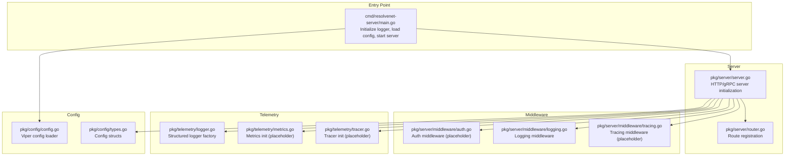
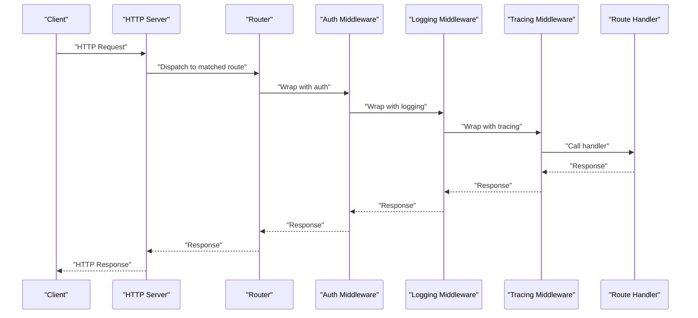
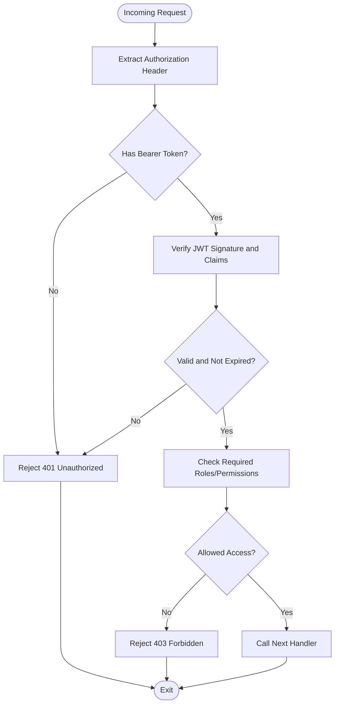
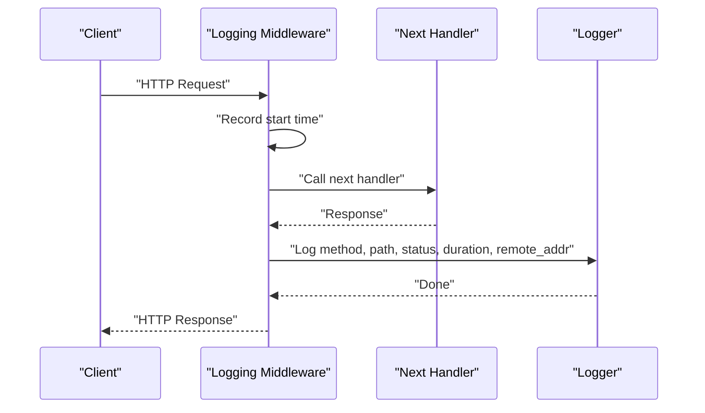
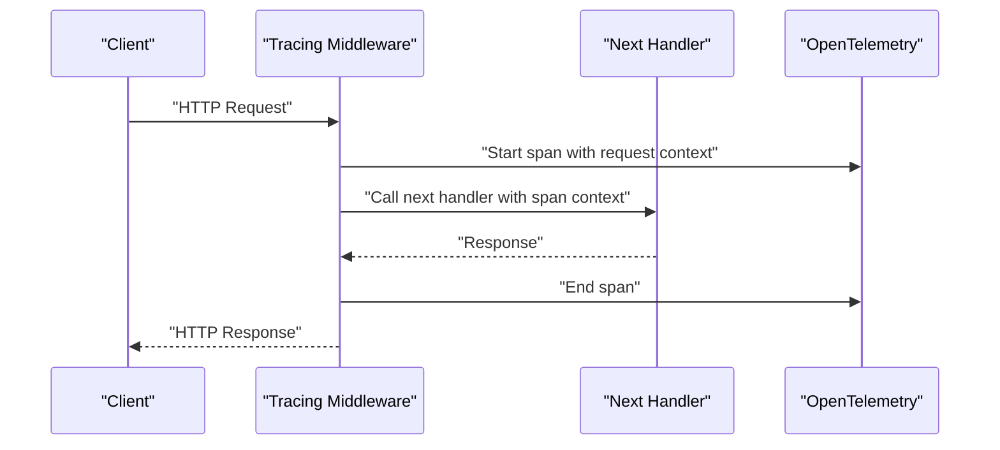
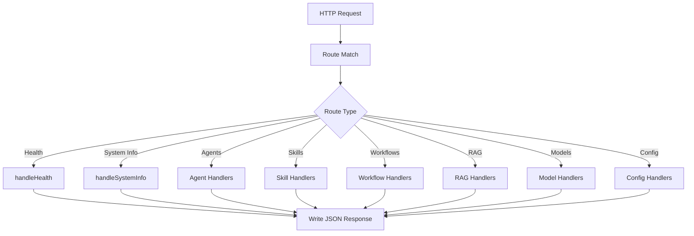
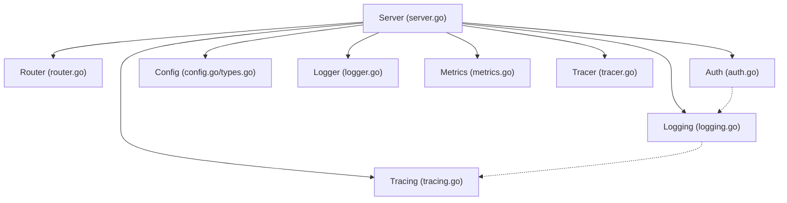
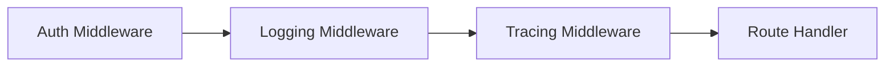

# Middleware and Security

<cite>
**Referenced Files in This Document**
- [auth.go](file://pkg/server/middleware/auth.go)
- [logging.go](file://pkg/server/middleware/logging.go)
- [tracing.go](file://pkg/server/middleware/tracing.go)
- [router.go](file://pkg/server/router.go)
- [server.go](file://pkg/server/server.go)
- [config.go](file://pkg/config/config.go)
- [types.go](file://pkg/config/types.go)
- [logger.go](file://pkg/telemetry/logger.go)
- [metrics.go](file://pkg/telemetry/metrics.go)
- [tracer.go](file://pkg/telemetry/tracer.go)
- [main.go](file://cmd/resolvenet-server/main.go)
</cite>

## Table of Contents
1. [Introduction](#introduction)
2. [Project Structure](#project-structure)
3. [Core Components](#core-components)
4. [Architecture Overview](#architecture-overview)
5. [Detailed Component Analysis](#detailed-component-analysis)
6. [Dependency Analysis](#dependency-analysis)
7. [Performance Considerations](#performance-considerations)
8. [Troubleshooting Guide](#troubleshooting-guide)
9. [Conclusion](#conclusion)
10. [Appendices](#appendices)

## Introduction
This document provides comprehensive middleware and security documentation for ResolveNet’s API layer. It covers the current state of authentication, logging, and tracing middleware, along with guidance for implementing robust security controls such as role-based access control, session management, security headers, CORS, input validation, rate limiting, IP whitelisting, and request throttling. It also explains middleware ordering, error propagation, and patterns for developing custom middleware, while addressing security best practices, vulnerability mitigation, and compliance considerations.

## Project Structure
The HTTP API layer is implemented in Go with a small set of middleware packages under the server module. The HTTP server is initialized with a multiplexer and routes are registered for health checks, system info, agents, skills, workflows, RAG collections, models, and configuration endpoints. Configuration is loaded via Viper and supports environment variable overrides.

**Diagram sources**
- [main.go:16-56](file://cmd/resolvenet-server/main.go#L16-L56)
- [server.go:27-52](file://pkg/server/server.go#L27-L52)
- [router.go:10-55](file://pkg/server/router.go#L10-L55)
- [auth.go:8-17](file://pkg/server/middleware/auth.go#L8-L17)
- [logging.go:19-37](file://pkg/server/middleware/logging.go#L19-L37)
- [tracing.go:7-18](file://pkg/server/middleware/tracing.go#L7-L18)
- [logger.go:8-36](file://pkg/telemetry/logger.go#L8-L36)
- [metrics.go:7-12](file://pkg/telemetry/metrics.go#L7-L12)
- [tracer.go:8-21](file://pkg/telemetry/tracer.go#L8-L21)
- [config.go:10-62](file://pkg/config/config.go#L10-L62)
- [types.go:3-70](file://pkg/config/types.go#L3-L70)

**Section sources**
- [main.go:16-56](file://cmd/resolvenet-server/main.go#L16-L56)
- [server.go:27-52](file://pkg/server/server.go#L27-L52)
- [router.go:10-55](file://pkg/server/router.go#L10-L55)
- [config.go:10-62](file://pkg/config/config.go#L10-L62)
- [types.go:3-70](file://pkg/config/types.go#L3-L70)

## Core Components
- Authentication middleware: Placeholder for token validation and role-based access control.
- Logging middleware: Structured request/response logging with timing and remote address.
- Tracing middleware: Placeholder for OpenTelemetry span creation.
- HTTP routing: REST endpoints for health, system info, agents, skills, workflows, RAG, models, and configuration.
- Configuration: Viper-based configuration with environment variable overrides.
- Telemetry: Logger factory, metrics init placeholder, tracer init placeholder.

Security and middleware capabilities are currently placeholders and require implementation to meet production-grade requirements.

**Section sources**
- [auth.go:8-17](file://pkg/server/middleware/auth.go#L8-L17)
- [logging.go:19-37](file://pkg/server/middleware/logging.go#L19-L37)
- [tracing.go:7-18](file://pkg/server/middleware/tracing.go#L7-L18)
- [router.go:10-55](file://pkg/server/router.go#L10-L55)
- [config.go:10-62](file://pkg/config/config.go#L10-L62)
- [types.go:3-70](file://pkg/config/types.go#L3-L70)
- [logger.go:8-36](file://pkg/telemetry/logger.go#L8-L36)
- [metrics.go:7-12](file://pkg/telemetry/metrics.go#L7-L12)
- [tracer.go:8-21](file://pkg/telemetry/tracer.go#L8-L21)

## Architecture Overview
The HTTP server is initialized with a multiplexer and routes are registered. Middleware is applied around handlers to provide cross-cutting concerns such as authentication, logging, and tracing. The server supports graceful shutdown and runs both HTTP and gRPC servers concurrently.

**Diagram sources**
- [server.go:44-49](file://pkg/server/server.go#L44-L49)
- [router.go:10-55](file://pkg/server/router.go#L10-L55)
- [auth.go:8-17](file://pkg/server/middleware/auth.go#L8-L17)
- [logging.go:19-37](file://pkg/server/middleware/logging.go#L19-L37)
- [tracing.go:7-18](file://pkg/server/middleware/tracing.go#L7-L18)

## Detailed Component Analysis

### Authentication Middleware
Current state:
- The authentication middleware is a placeholder that forwards all requests without validation.
- It accepts a logger and returns a standard HTTP middleware wrapper.

Recommended implementation pattern:
- Token extraction from Authorization header (Bearer scheme).
- JWT verification using a configured signing key or JWKS endpoint.
- Role-based access control by inspecting claims and enforcing policies per route.
- Session management via secure, HttpOnly cookies with SameSite and Secure flags when applicable.
- Integration with external identity providers (OIDC) for centralized authentication.

**Diagram sources**
- [auth.go:8-17](file://pkg/server/middleware/auth.go#L8-L17)

**Section sources**
- [auth.go:8-17](file://pkg/server/middleware/auth.go#L8-L17)

### Logging Middleware
Current state:
- Wraps the response writer to capture the status code.
- Logs method, path, status, duration, and remote address after the request completes.

Recommended enhancements:
- Add correlation ID propagation to support distributed tracing.
- Include request body size and user agent for richer audit trails.
- Enforce sensitive field redaction (e.g., tokens, passwords).
- Support structured fields for downstream SIEM ingestion.

**Diagram sources**
- [logging.go:19-37](file://pkg/server/middleware/logging.go#L19-L37)

**Section sources**
- [logging.go:9-17](file://pkg/server/middleware/logging.go#L9-L17)
- [logging.go:19-37](file://pkg/server/middleware/logging.go#L19-L37)

### Tracing Middleware
Current state:
- The tracing middleware is a placeholder that does not create OpenTelemetry spans.
- Telemetry components provide placeholders for tracer and metrics initialization.

Recommended implementation pattern:
- Create an OpenTelemetry span per request with operation name derived from the route path.
- Propagate correlation IDs via context to downstream services.
- Record attributes such as HTTP method, URL, status code, and remote address.
- Integrate with exporters (e.g., OTLP) for observability backends.

**Diagram sources**
- [tracing.go:7-18](file://pkg/server/middleware/tracing.go#L7-L18)
- [tracer.go:8-21](file://pkg/telemetry/tracer.go#L8-L21)

**Section sources**
- [tracing.go:7-18](file://pkg/server/middleware/tracing.go#L7-L18)
- [tracer.go:8-21](file://pkg/telemetry/tracer.go#L8-L21)

### HTTP Routing and Handlers
Current state:
- Routes include health, system info, agents, skills, workflows, RAG collections, models, and configuration.
- Handlers return stubbed responses (200 OK for listing, 501 Not Implemented for mutations, 404 Not Found for missing resources).

Security and validation considerations:
- Implement input validation for all endpoints (path params, query params, JSON bodies).
- Enforce strict content-type and length limits.
- Sanitize and validate user inputs to prevent injection attacks.

**Diagram sources**
- [router.go:10-55](file://pkg/server/router.go#L10-L55)
- [router.go:57-182](file://pkg/server/router.go#L57-L182)

**Section sources**
- [router.go:10-55](file://pkg/server/router.go#L10-L55)
- [router.go:57-182](file://pkg/server/router.go#L57-L182)

### Configuration and Environment
Current state:
- Viper loads configuration from files and environment variables with a prefix.
- Defaults are set for server addresses, database, Redis, NATS, runtime, gateway, and telemetry.

Security and operational considerations:
- Keep secrets out of config files; rely on environment variables or secret managers.
- Use strong defaults for ports and enable SSL/TLS in production.
- Centralize configuration for observability (service name, OTLP endpoint).

**Section sources**
- [config.go:10-62](file://pkg/config/config.go#L10-L62)
- [types.go:3-70](file://pkg/config/types.go#L3-L70)

### Telemetry and Observability
Current state:
- Logger factory supports JSON and text formats with configurable levels.
- Metrics and tracer initialization are placeholders.

Recommendations:
- Initialize OpenTelemetry tracer with a configured exporter (OTLP) and service name from config.
- Expose Prometheus-compatible metrics and instrument HTTP handlers.
- Ensure correlation IDs propagate across services for end-to-end tracing.

**Section sources**
- [logger.go:8-36](file://pkg/telemetry/logger.go#L8-L36)
- [metrics.go:7-12](file://pkg/telemetry/metrics.go#L7-L12)
- [tracer.go:8-21](file://pkg/telemetry/tracer.go#L8-L21)

## Dependency Analysis
The HTTP server composes middleware and routes, while configuration and telemetry are injected. The current middleware stack is minimal and needs enhancement for security and observability.

**Diagram sources**
- [server.go:27-52](file://pkg/server/server.go#L27-L52)
- [router.go:10-55](file://pkg/server/router.go#L10-L55)
- [auth.go:8-17](file://pkg/server/middleware/auth.go#L8-L17)
- [logging.go:19-37](file://pkg/server/middleware/logging.go#L19-L37)
- [tracing.go:7-18](file://pkg/server/middleware/tracing.go#L7-L18)
- [config.go:10-62](file://pkg/config/config.go#L10-L62)
- [types.go:3-70](file://pkg/config/types.go#L3-L70)
- [logger.go:8-36](file://pkg/telemetry/logger.go#L8-L36)
- [metrics.go:7-12](file://pkg/telemetry/metrics.go#L7-L12)
- [tracer.go:8-21](file://pkg/telemetry/tracer.go#L8-L21)

**Section sources**
- [server.go:27-52](file://pkg/server/server.go#L27-L52)
- [router.go:10-55](file://pkg/server/router.go#L10-L55)
- [auth.go:8-17](file://pkg/server/middleware/auth.go#L8-L17)
- [logging.go:19-37](file://pkg/server/middleware/logging.go#L19-L37)
- [tracing.go:7-18](file://pkg/server/middleware/tracing.go#L7-L18)
- [config.go:10-62](file://pkg/config/config.go#L10-L62)
- [types.go:3-70](file://pkg/config/types.go#L3-L70)
- [logger.go:8-36](file://pkg/telemetry/logger.go#L8-L36)
- [metrics.go:7-12](file://pkg/telemetry/metrics.go#L7-L12)
- [tracer.go:8-21](file://pkg/telemetry/tracer.go#L8-L21)

## Performance Considerations
- Minimize allocations in middleware (avoid unnecessary copies of request/response data).
- Use buffered logging and asynchronous exporters for telemetry to reduce latency.
- Apply circuit breakers and timeouts for upstream dependencies (database, Redis, NATS).
- Enable compression for large payloads where appropriate.
- Monitor slow endpoints and hotspots via tracing and metrics.

## Troubleshooting Guide
Common issues and mitigations:
- Authentication failures: Verify token format, expiration, and issuer. Check role claims and permissions.
- Missing correlation IDs: Ensure tracing middleware wraps all handlers and propagates context.
- High latency: Profile slow handlers, check database and cache performance, and review network round-trips.
- Configuration errors: Validate environment variables and config file paths; confirm defaults are acceptable for local development.

Operational tips:
- Use structured logs with correlation IDs for end-to-end debugging.
- Instrument critical paths with metrics and traces.
- Implement health checks and readiness probes for autoscaling.

**Section sources**
- [logging.go:19-37](file://pkg/server/middleware/logging.go#L19-L37)
- [tracer.go:8-21](file://pkg/telemetry/tracer.go#L8-L21)
- [metrics.go:7-12](file://pkg/telemetry/metrics.go#L7-L12)

## Conclusion
ResolveNet’s API layer currently provides a foundation with placeholder middleware for authentication, logging, and tracing. To achieve production-grade security and observability, implement robust token validation and RBAC, enhance logging with correlation IDs and redaction, integrate OpenTelemetry for distributed tracing, and add comprehensive input validation, rate limiting, and CORS controls. Adopt security best practices, enforce least privilege, and maintain compliance through proper configuration management and audit logging.

## Appendices

### Middleware Ordering Recommendations
- Authentication first: Validate identity and roles before proceeding.
- Logging second: Capture pre/post execution details with correlation IDs.
- Tracing last: Wrap the entire chain to ensure full visibility.
- Error handling: Place error middleware after logging/tracing to capture failures.

**Diagram sources**
- [auth.go:8-17](file://pkg/server/middleware/auth.go#L8-L17)
- [logging.go:19-37](file://pkg/server/middleware/logging.go#L19-L37)
- [tracing.go:7-18](file://pkg/server/middleware/tracing.go#L7-L18)

### Security Headers and CORS
- Security headers: Strict-Transport-Security, Content-Security-Policy, X-Frame-Options, X-Content-Type-Options, Referrer-Policy.
- CORS: Configure allowed origins, methods, headers, and credentials; validate origin dynamically.
- Rate limiting: Apply per-IP and per-route limits with leaky bucket or token bucket algorithms.
- IP whitelisting: Maintain allowlists for trusted networks and blocklisted IPs.
- Request throttling: Use sliding window counters and integrate with Redis for distributed state.

[No sources needed since this section provides general guidance]

### Input Validation Patterns
- Validate all inputs: path params, query params, headers, and JSON bodies.
- Use schema validation libraries and enforce size limits.
- Sanitize inputs to prevent injection and ensure data integrity.

[No sources needed since this section provides general guidance]

### Error Propagation and Custom Middleware Development
- Propagate errors with context and correlation IDs.
- Build middleware using the standard http.Handler signature and composition pattern.
- Keep middleware single-purpose and reusable across routes.

[No sources needed since this section provides general guidance]