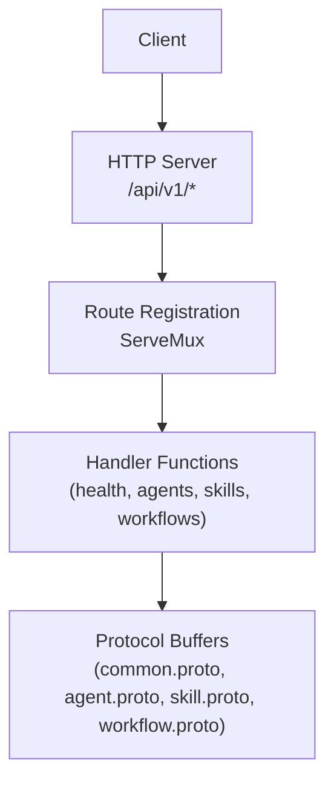
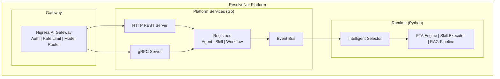
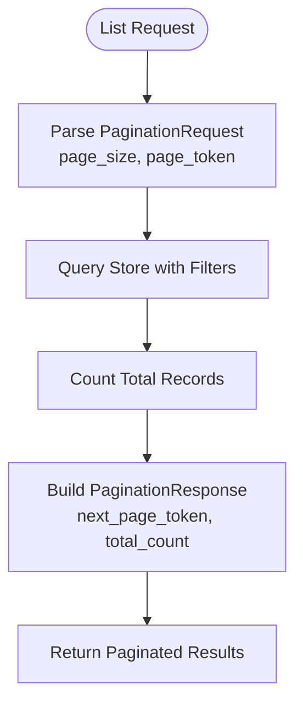
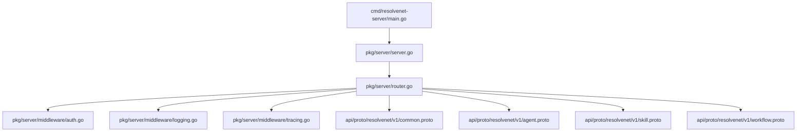

# REST API Endpoints

<cite>
**Referenced Files in This Document**
- [main.go](file://cmd/resolvenet-server/main.go)
- [router.go](file://pkg/server/router.go)
- [server.go](file://pkg/server/server.go)
- [auth.go](file://pkg/server/middleware/auth.go)
- [logging.go](file://pkg/server/middleware/logging.go)
- [tracing.go](file://pkg/server/middleware/tracing.go)
- [common.proto](file://api/proto/resolvenet/v1/common.proto)
- [agent.proto](file://api/proto/resolvenet/v1/agent.proto)
- [skill.proto](file://api/proto/resolvenet/v1/skill.proto)
- [workflow.proto](file://api/proto/resolvenet/v1/workflow.proto)
- [resolvenet.yaml](file://configs/resolvenet.yaml)
- [config.go](file://pkg/config/config.go)
- [README.md](file://README.md)
</cite>

## Table of Contents
1. [Introduction](#introduction)
2. [Project Structure](#project-structure)
3. [Core Components](#core-components)
4. [Architecture Overview](#architecture-overview)
5. [Detailed Component Analysis](#detailed-component-analysis)
6. [Dependency Analysis](#dependency-analysis)
7. [Performance Considerations](#performance-considerations)
8. [Troubleshooting Guide](#troubleshooting-guide)
9. [Conclusion](#conclusion)
10. [Appendices](#appendices)

## Introduction
This document provides comprehensive REST API documentation for ResolveNet’s HTTP endpoints. It covers the health check, agent management, skill registration, and workflow operations exposed under the /api/v1 path. For each endpoint, we describe HTTP methods, path parameters, request/response schemas derived from protocol buffers, typical HTTP status codes, and operational notes such as pagination, filtering, and sorting. Authentication, rate limiting, and error response formats are documented with current implementation status and guidance for future enhancements.

ResolveNet exposes a dual-stack server: an HTTP REST API and a gRPC API. The HTTP server registers REST routes and serves JSON responses, while the gRPC server provides streaming and richer typed APIs for internal services.

**Section sources**
- [README.md:10-46](file://README.md#L10-L46)
- [server.go:27-52](file://pkg/server/server.go#L27-L52)

## Project Structure
The HTTP REST API is implemented in the server package and registered via a ServeMux. The API versioning strategy uses the /api/v1 prefix. Middleware supports logging and placeholder authentication/tracing. Protocol buffer definitions define request/response schemas and pagination structures.

**Diagram sources**
- [router.go:11-55](file://pkg/server/router.go#L11-L55)
- [server.go:44-49](file://pkg/server/server.go#L44-L49)

**Section sources**
- [router.go:11-55](file://pkg/server/router.go#L11-L55)
- [server.go:44-49](file://pkg/server/server.go#L44-L49)

## Core Components
- HTTP Server: Initializes both HTTP and gRPC servers, registers REST routes, and handles graceful shutdown.
- Route Registration: Maps HTTP verbs and paths to handler functions.
- Handler Functions: Implement REST endpoints and return JSON responses.
- Middleware: Provides logging and placeholder authentication/tracing.
- Protocol Buffers: Define request/response schemas, pagination, and resource metadata.

**Section sources**
- [server.go:27-52](file://pkg/server/server.go#L27-L52)
- [router.go:11-55](file://pkg/server/router.go#L11-L55)
- [auth.go:8-17](file://pkg/server/middleware/auth.go#L8-L17)
- [logging.go:19-37](file://pkg/server/middleware/logging.go#L19-L37)
- [tracing.go:7-18](file://pkg/server/middleware/tracing.go#L7-L18)

## Architecture Overview
The HTTP server listens on the configured address and exposes REST endpoints under /api/v1. Handlers currently return stubbed responses. Pagination and filtering are defined in common.proto and used by agent, skill, and workflow endpoints.

**Diagram sources**
- [README.md:22-46](file://README.md#L22-L46)
- [server.go:34-42](file://pkg/server/server.go#L34-L42)

## Detailed Component Analysis

### API Versioning and Base URL
- Base URL: /api/v1
- Versioning strategy: Path-based versioning with /api/v1 prefix. The platform also exposes a gRPC health service for internal use.

**Section sources**
- [router.go:12-16](file://pkg/server/router.go#L12-L16)
- [server.go:34-42](file://pkg/server/server.go#L34-L42)

### Health Check: GET /api/v1/health
- Purpose: Basic health probe for liveness/readiness.
- Response: JSON object indicating health status.
- Typical Status Codes: 200 OK

Response schema
- status: string (value indicates health state)

Example response
- {"status":"healthy"}

curl example
- curl -i http://localhost:8080/api/v1/health

Notes
- No authentication required in current implementation.

**Section sources**
- [router.go:57-59](file://pkg/server/router.go#L57-L59)

### System Info: GET /api/v1/system/info
- Purpose: Returns platform versioning and build metadata.
- Response: JSON object containing version, commit, and build date.
- Typical Status Codes: 200 OK

Response schema
- version: string
- commit: string
- build_date: string

curl example
- curl -i http://localhost:8080/api/v1/system/info

**Section sources**
- [router.go:61-67](file://pkg/server/router.go#L61-L67)

### Agent Management: GET/POST /api/v1/agents and CRUD variants
Endpoints
- GET /api/v1/agents
- POST /api/v1/agents
- GET /api/v1/agents/{id}
- PUT /api/v1/agents/{id}
- DELETE /api/v1/agents/{id}
- POST /api/v1/agents/{id}/execute

Current handler behavior
- GET /api/v1/agents: returns empty list with total count.
- POST /api/v1/agents: returns 501 Not Implemented.
- GET /api/v1/agents/{id}: returns 404 Not Found with error details.
- PUT /api/v1/agents/{id}: returns 501 Not Implemented.
- DELETE /api/v1/agents/{id}: returns 501 Not Implemented.
- POST /api/v1/agents/{id}/execute: returns 501 Not Implemented.

Path parameters
- id: string (agent identifier)

Pagination, filtering, and sorting
- Pagination: supported via common.proto PaginationRequest/PaginationResponse.
- Filtering: supported via agent-specific filters in ListAgentsRequest.
- Sorting: not defined in current stub; consult future agent handler implementations.

Request/response schemas (derived from agent.proto)
- CreateAgentRequest: Agent
- GetAgentRequest: id: string
- ListAgentsRequest: pagination: PaginationRequest, type_filter: AgentType, status_filter: ResourceStatus
- ListAgentsResponse: agents: Agent[], pagination: PaginationResponse
- UpdateAgentRequest: Agent
- DeleteAgentRequest: id: string
- ExecuteAgentRequest: agent_id: string, input: string, conversation_id: string, context: Struct

Agent schema (Agent)
- meta: ResourceMeta
- type: AgentType
- config: AgentConfig
- status: ResourceStatus

AgentConfig schema
- model_id: string
- system_prompt: string
- skill_names: string[]
- workflow_id: string
- rag_collection_id: string
- parameters: Struct
- selector_config: SelectorConfig

SelectorConfig schema
- strategy: string ("llm", "rule", "hybrid")
- rules: Struct
- selector_model_id: string

Resource metadata (ResourceMeta)
- id: string
- name: string
- description: string
- labels: map<string,string>
- annotations: map<string,string>
- created_at: timestamp
- updated_at: timestamp
- created_by: string
- version: int64

Common pagination (PaginationRequest/PaginationResponse)
- PaginationRequest: page_size: int32, page_token: string
- PaginationResponse: next_page_token: string, total_count: int32

Typical status codes
- 200 OK (success)
- 404 Not Found (resource not found)
- 501 Not Implemented (endpoint not yet implemented)

curl examples
- List agents: curl -i http://localhost:8080/api/v1/agents
- Get agent: curl -i http://localhost:8080/api/v1/agents/{id}
- Create agent: curl -X POST -i http://localhost:8080/api/v1/agents
- Update agent: curl -X PUT -i http://localhost:8080/api/v1/agents/{id}
- Delete agent: curl -X DELETE -i http://localhost:8080/api/v1/agents/{id}
- Execute agent: curl -X POST -i http://localhost:8080/api/v1/agents/{id}/execute

Notes
- Filtering and sorting are defined in the protobuf but not implemented in handlers yet.
- Pagination response includes next_page_token and total_count.

**Section sources**
- [router.go:18-24](file://pkg/server/router.go#L18-L24)
- [router.go:71-94](file://pkg/server/router.go#L71-L94)
- [agent.proto:42-47](file://api/proto/resolvenet/v1/agent.proto#L42-L47)
- [agent.proto:49-58](file://api/proto/resolvenet/v1/agent.proto#L49-L58)
- [agent.proto:60-65](file://api/proto/resolvenet/v1/agent.proto#L60-L65)
- [agent.proto:76-85](file://api/proto/resolvenet/v1/agent.proto#L76-L85)
- [common.proto:9-19](file://api/proto/resolvenet/v1/common.proto#L9-L19)
- [common.proto:28-39](file://api/proto/resolvenet/v1/common.proto#L28-L39)

### Skill Registration: GET/POST/DELETE /api/v1/skills and GET by name
Endpoints
- GET /api/v1/skills
- POST /api/v1/skills
- GET /api/v1/skills/{name}
- DELETE /api/v1/skills/{name}

Current handler behavior
- GET /api/v1/skills: returns empty list with total count.
- POST /api/v1/skills: returns 501 Not Implemented.
- GET /api/v1/skills/{name}: returns 404 Not Found with error details.
- DELETE /api/v1/skills/{name}: returns 501 Not Implemented.

Path parameters
- name: string (skill name)

Pagination and filtering
- Pagination: supported via common.proto PaginationRequest/PaginationResponse.
- Filtering: not defined in current stub; consult future skill handler implementations.

Request/response schemas (derived from skill.proto)
- RegisterSkillRequest: Skill
- GetSkillRequest: name: string
- ListSkillsRequest: pagination: PaginationRequest
- ListSkillsResponse: skills: Skill[], pagination: PaginationResponse
- UnregisterSkillRequest: name: string
- UnregisterSkillResponse: {}

Skill schema (Skill)
- meta: ResourceMeta
- version: string
- author: string
- manifest: SkillManifest
- source_type: SkillSourceType
- source_uri: string
- status: ResourceStatus

SkillManifest schema
- entry_point: string
- inputs: SkillParameter[]
- outputs: SkillParameter[]
- dependencies: string[]
- permissions: SkillPermissions

SkillParameter schema
- name: string
- type: string
- description: string
- required: bool
- default_value: Value

SkillPermissions schema
- network_access: bool
- file_system_read: bool
- file_system_write: bool
- allowed_hosts: string[]
- max_memory_mb: int64
- max_cpu_seconds: int64
- timeout_seconds: int64

Typical status codes
- 200 OK (success)
- 404 Not Found (resource not found)
- 501 Not Implemented (endpoint not yet implemented)

curl examples
- List skills: curl -i http://localhost:8080/api/v1/skills
- Get skill: curl -i http://localhost:8080/api/v1/skills/{name}
- Register skill: curl -X POST -i http://localhost:8080/api/v1/skills
- Unregister skill: curl -X DELETE -i http://localhost:8080/api/v1/skills/{name}

Notes
- Pagination response includes next_page_token and total_count.

**Section sources**
- [router.go:26-31](file://pkg/server/router.go#L26-L31)
- [router.go:96-111](file://pkg/server/router.go#L96-L111)
- [skill.proto:19-28](file://api/proto/resolvenet/v1/skill.proto#L19-L28)
- [skill.proto:38-45](file://api/proto/resolvenet/v1/skill.proto#L38-L45)
- [skill.proto:47-53](file://api/proto/resolvenet/v1/skill.proto#L47-L53)
- [skill.proto:55-63](file://api/proto/resolvenet/v1/skill.proto#L55-L63)
- [skill.proto:65-81](file://api/proto/resolvenet/v1/skill.proto#L65-L81)
- [common.proto:9-19](file://api/proto/resolvenet/v1/common.proto#L9-L19)

### Workflow Operations: GET/POST/PUT/DELETE /api/v1/workflows and validation/execution
Endpoints
- GET /api/v1/workflows
- POST /api/v1/workflows
- GET /api/v1/workflows/{id}
- PUT /api/v1/workflows/{id}
- DELETE /api/v1/workflows/{id}
- POST /api/v1/workflows/{id}/validate
- POST /api/v1/workflows/{id}/execute

Current handler behavior
- GET /api/v1/workflows: returns empty list with total count.
- POST /api/v1/workflows: returns 501 Not Implemented.
- GET /api/v1/workflows/{id}: returns 404 Not Found with error details.
- PUT /api/v1/workflows/{id}: returns 501 Not Implemented.
- DELETE /api/v1/workflows/{id}: returns 501 Not Implemented.
- POST /api/v1/workflows/{id}/validate: returns 501 Not Implemented.
- POST /api/v1/workflows/{id}/execute: returns 501 Not Implemented.

Path parameters
- id: string (workflow identifier)

Pagination and filtering
- Pagination: supported via common.proto PaginationRequest/PaginationResponse.
- Filtering: not defined in current stub; consult future workflow handler implementations.

Request/response schemas (derived from workflow.proto)
- CreateWorkflowRequest: Workflow
- GetWorkflowRequest: id: string
- ListWorkflowsRequest: pagination: PaginationRequest
- ListWorkflowsResponse: workflows: Workflow[], pagination: PaginationResponse
- UpdateWorkflowRequest: Workflow
- DeleteWorkflowRequest: id: string
- DeleteWorkflowResponse: {}
- ValidateWorkflowRequest: tree: FaultTree
- ValidateWorkflowResponse: valid: bool, errors: string[], warnings: string[]
- ExecuteWorkflowRequest: workflow_id: string, context: Struct

Workflow schema (Workflow)
- meta: ResourceMeta
- tree: FaultTree
- status: WorkflowStatus

FaultTree schema
- top_event_id: string
- events: FTAEvent[]
- gates: FTAGate[]

FTAEvent schema
- id: string
- name: string
- description: string
- type: FTAEventType
- evaluator: string
- parameters: Struct

FTAGate schema
- id: string
- name: string
- type: FTAGateType
- input_ids: string[]
- output_id: string
- k_value: int32

WorkflowEvent schema (streamed)
- workflow_id: string
- execution_id: string
- type: WorkflowEventType
- node_id: string
- message: string
- data: Struct
- timestamp: timestamp

Typical status codes
- 200 OK (success)
- 404 Not Found (resource not found)
- 501 Not Implemented (endpoint not yet implemented)

curl examples
- List workflows: curl -i http://localhost:8080/api/v1/workflows
- Get workflow: curl -i http://localhost:8080/api/v1/workflows/{id}
- Create workflow: curl -X POST -i http://localhost:8080/api/v1/workflows
- Update workflow: curl -X PUT -i http://localhost:8080/api/v1/workflows/{id}
- Delete workflow: curl -X DELETE -i http://localhost:8080/api/v1/workflows/{id}
- Validate workflow: curl -X POST -i http://localhost:8080/api/v1/workflows/{id}/validate
- Execute workflow: curl -X POST -i http://localhost:8080/api/v1/workflows/{id}/execute

Notes
- Pagination response includes next_page_token and total_count.
- Validation returns structured feedback with validity, errors, and warnings.
- Execution is streamed via WorkflowEvent messages.

**Section sources**
- [router.go:32-40](file://pkg/server/router.go#L32-L40)
- [router.go:113-140](file://pkg/server/router.go#L113-L140)
- [workflow.proto:22-27](file://api/proto/resolvenet/v1/workflow.proto#L22-L27)
- [workflow.proto:36-41](file://api/proto/resolvenet/v1/workflow.proto#L36-L41)
- [workflow.proto:43-51](file://api/proto/resolvenet/v1/workflow.proto#L43-L51)
- [workflow.proto:62-70](file://api/proto/resolvenet/v1/workflow.proto#L62-L70)
- [workflow.proto:81-90](file://api/proto/resolvenet/v1/workflow.proto#L81-L90)
- [workflow.proto:103-145](file://api/proto/resolvenet/v1/workflow.proto#L103-L145)
- [common.proto:9-19](file://api/proto/resolvenet/v1/common.proto#L9-L19)

### Error Response Format
All endpoints return JSON error objects when encountering issues. Current stub handlers return a generic error payload with an error message and, for GET by identifier, include the requested identifier.

Common error response
- error: string (description of the error)
- Additional fields may include identifiers (e.g., id, name) depending on the endpoint.

Example error responses
- {"error":"not implemented"}
- {"error":"agent not found","id":"{id}"}
- {"error":"skill not found","name":"{name}"}

**Section sources**
- [router.go:75-77](file://pkg/server/router.go#L75-L77)
- [router.go:84-86](file://pkg/server/router.go#L84-L86)
- [router.go:88-90](file://pkg/server/router.go#L88-L90)
- [router.go:100-102](file://pkg/server/router.go#L100-L102)
- [router.go:109-111](file://pkg/server/router.go#L109-L111)
- [router.go:117-119](file://pkg/server/router.go#L117-L119)
- [router.go:126-128](file://pkg/server/router.go#L126-L128)
- [router.go:130-132](file://pkg/server/router.go#L130-L132)
- [router.go:134-136](file://pkg/server/router.go#L134-L136)
- [router.go:138-140](file://pkg/server/router.go#L138-L140)
- [router.go:104-107](file://pkg/server/router.go#L104-L107)
- [router.go:121-124](file://pkg/server/router.go#L121-L124)

### Authentication and Authorization
- Current implementation: Authentication middleware exists but is a placeholder that does not enforce any credentials. All requests are permitted.
- Future implementation: Integrate JWT or API key validation in the Auth middleware.

Recommendations
- Add bearer token validation for production deployments.
- Scope tokens to specific actions (e.g., read-only vs. write).
- Consider integrating with the gateway for centralized auth.

**Section sources**
- [auth.go:8-17](file://pkg/server/middleware/auth.go#L8-L17)

### Rate Limiting
- Current implementation: No rate limiting middleware is applied to the HTTP server.
- Future implementation: Integrate a rate-limiting middleware or rely on the gateway for traffic shaping.

**Section sources**
- [router.go:11-55](file://pkg/server/router.go#L11-L55)

### Logging and Observability
- Logging middleware: Captures method, path, status, duration, and remote address for each request.
- Tracing middleware: Placeholder for OpenTelemetry spans.
- Telemetry configuration: Available in the configuration file for enabling metrics and OTLP export.

**Section sources**
- [logging.go:19-37](file://pkg/server/middleware/logging.go#L19-L37)
- [tracing.go:7-18](file://pkg/server/middleware/tracing.go#L7-L18)
- [resolvenet.yaml:29-34](file://configs/resolvenet.yaml#L29-L34)

### Pagination Patterns
- PaginationRequest: page_size, page_token
- PaginationResponse: next_page_token, total_count
- Used by ListAgents, ListSkills, and ListWorkflows endpoints.

**Diagram sources**
- [common.proto:9-19](file://api/proto/resolvenet/v1/common.proto#L9-L19)
- [agent.proto:76-85](file://api/proto/resolvenet/v1/agent.proto#L76-L85)
- [skill.proto:74-81](file://api/proto/resolvenet/v1/skill.proto#L74-L81)
- [workflow.proto:112-119](file://api/proto/resolvenet/v1/workflow.proto#L112-L119)

### Filtering and Sorting
- Filtering: Defined in ListAgentsRequest (type_filter, status_filter) and similar patterns in skills/workflows.
- Sorting: Not defined in current stubs; consult future handler implementations for supported sort fields.

**Section sources**
- [agent.proto:76-80](file://api/proto/resolvenet/v1/agent.proto#L76-L80)

### Backward Compatibility Considerations
- API versioning: /api/v1 ensures stable surface area for clients.
- Protocol buffers: Adding fields as optional preserves backward compatibility; avoid removing or renaming fields.
- Pagination: Next-page token enables seamless evolution of pagination semantics.

**Section sources**
- [router.go:12-16](file://pkg/server/router.go#L12-L16)
- [common.proto:9-19](file://api/proto/resolvenet/v1/common.proto#L9-L19)

## Dependency Analysis
The HTTP server composes middleware and registers routes. Handlers are currently stubbed and return JSON responses. Protocol buffer definitions provide the canonical request/response schemas.

**Diagram sources**
- [main.go:16-34](file://cmd/resolvenet-server/main.go#L16-L34)
- [server.go:27-52](file://pkg/server/server.go#L27-L52)
- [router.go:11-55](file://pkg/server/router.go#L11-L55)
- [auth.go:8-17](file://pkg/server/middleware/auth.go#L8-L17)
- [logging.go:19-37](file://pkg/server/middleware/logging.go#L19-L37)
- [tracing.go:7-18](file://pkg/server/middleware/tracing.go#L7-L18)
- [common.proto:9-19](file://api/proto/resolvenet/v1/common.proto#L9-L19)
- [agent.proto:42-47](file://api/proto/resolvenet/v1/agent.proto#L42-L47)
- [skill.proto:19-28](file://api/proto/resolvenet/v1/skill.proto#L19-L28)
- [workflow.proto:22-27](file://api/proto/resolvenet/v1/workflow.proto#L22-L27)

**Section sources**
- [main.go:16-34](file://cmd/resolvenet-server/main.go#L16-L34)
- [server.go:27-52](file://pkg/server/server.go#L27-L52)
- [router.go:11-55](file://pkg/server/router.go#L11-L55)

## Performance Considerations
- Pagination: Use page_size and page_token to limit response sizes and enable cursor-based navigation.
- Filtering: Apply filters early in queries to reduce result sets.
- Streaming: Workflow execution is streamed; clients should process events incrementally.
- Logging overhead: Enable structured logging in production for observability without impacting latency.

[No sources needed since this section provides general guidance]

## Troubleshooting Guide
Common issues and resolutions
- 404 Not Found: Indicates missing resource by id/name. Verify path parameter correctness.
- 501 Not Implemented: Endpoint not yet implemented in handlers. Expect full implementation in later releases.
- Health probe failures: Confirm HTTP server is listening on the configured address.

Operational tips
- Use logging middleware output to correlate client requests with server-side processing.
- For gateway-enabled deployments, ensure authentication and rate limiting are configured upstream.

**Section sources**
- [router.go:75-77](file://pkg/server/router.go#L75-L77)
- [router.go:84-86](file://pkg/server/router.go#L84-L86)
- [router.go:88-90](file://pkg/server/router.go#L88-L90)
- [router.go:100-102](file://pkg/server/router.go#L100-L102)
- [router.go:109-111](file://pkg/server/router.go#L109-L111)
- [router.go:117-119](file://pkg/server/router.go#L117-L119)
- [router.go:126-128](file://pkg/server/router.go#L126-L128)
- [router.go:130-132](file://pkg/server/router.go#L130-L132)
- [router.go:134-136](file://pkg/server/router.go#L134-L136)
- [router.go:138-140](file://pkg/server/router.go#L138-L140)
- [router.go:104-107](file://pkg/server/router.go#L104-L107)
- [router.go:121-124](file://pkg/server/router.go#L121-L124)

## Conclusion
ResolveNet’s /api/v1 REST endpoints provide a stable foundation for agent, skill, and workflow management. Current handlers return stubbed responses, enabling clients to prepare for future implementations. Protocol buffer schemas define robust request/response structures, pagination, and resource metadata. Authentication, rate limiting, and advanced observability are placeholders for future integration with the gateway and middleware stack.

[No sources needed since this section summarizes without analyzing specific files]

## Appendices

### Configuration Reference
- HTTP server address: server.http_addr
- gRPC server address: server.grpc_addr
- Database, Redis, NATS, runtime, and telemetry settings are available in the configuration file.

Environment variable overrides follow RESOLVENET_<SECTION>_<KEY> naming.

**Section sources**
- [resolvenet.yaml:3-34](file://configs/resolvenet.yaml#L3-L34)
- [config.go:14-31](file://pkg/config/config.go#L14-L31)