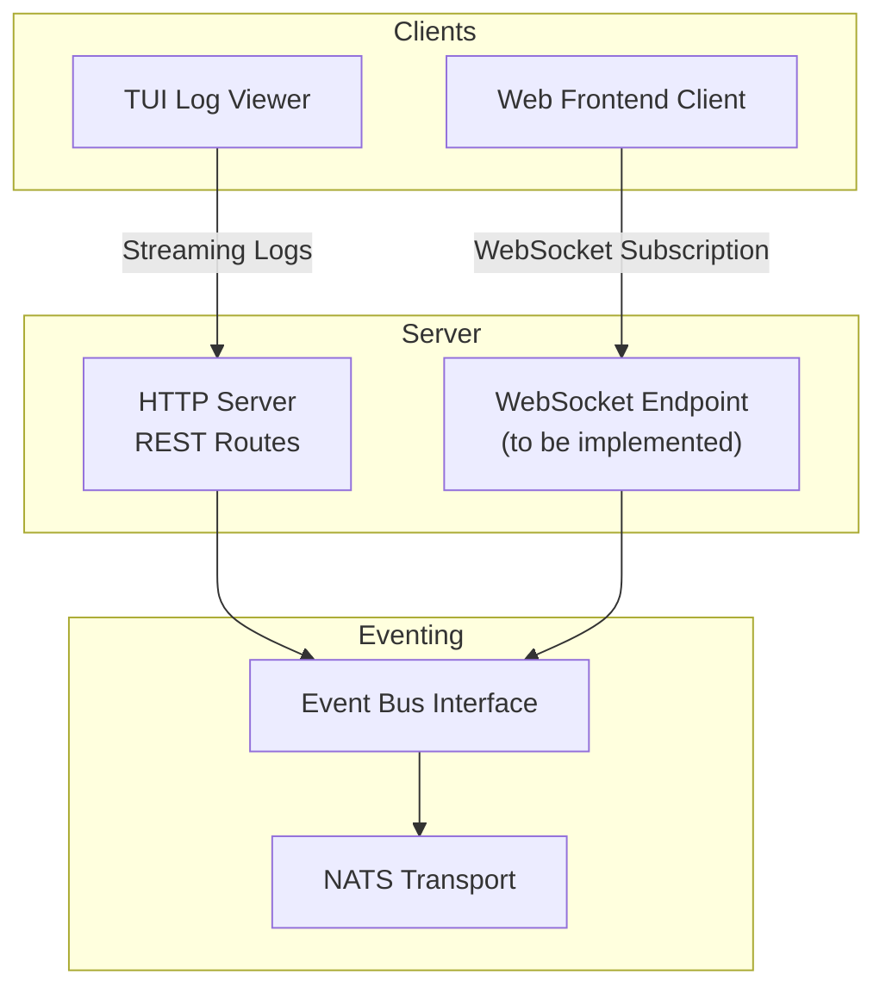
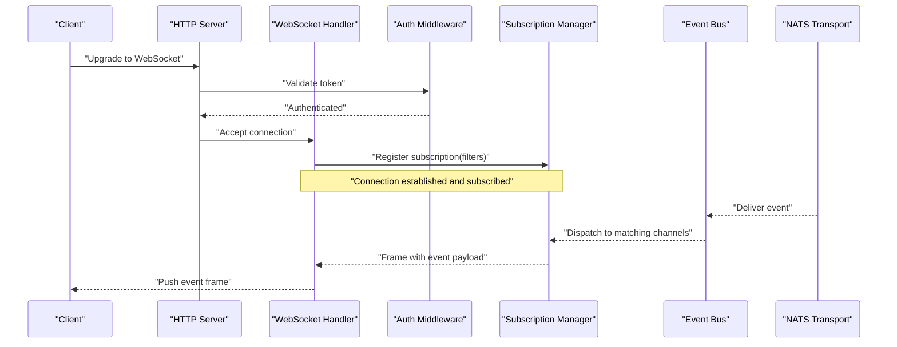
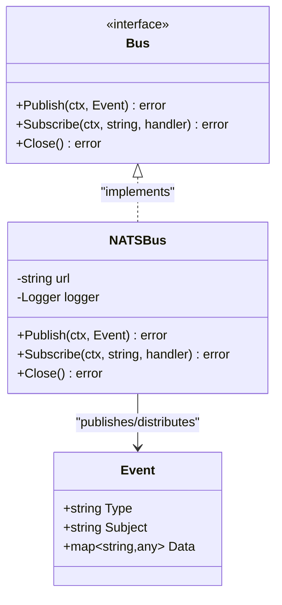
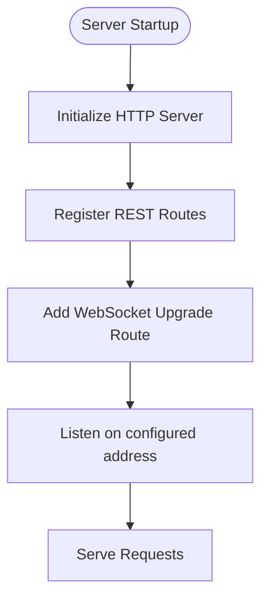
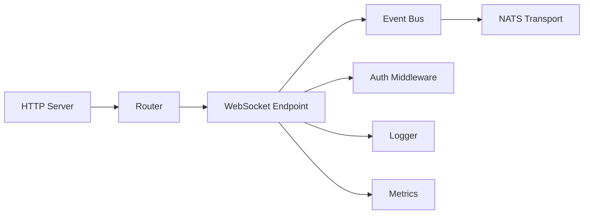

# WebSocket Streaming

<cite>
**Referenced Files in This Document**
- [event.go](file://pkg/event/event.go)
- [nats.go](file://pkg/event/nats.go)
- [router.go](file://pkg/server/router.go)
- [server.go](file://pkg/server/server.go)
- [client.ts](file://web/src/api/client.ts)
- [app.ts](file://web/src/stores/app.ts)
- [log_viewer.go](file://internal/tui/views/log_viewer.go)
- [logger.go](file://pkg/telemetry/logger.go)
- [metrics.go](file://pkg/telemetry/metrics.go)
- [main.go](file://cmd/resolvenet-server/main.go)
</cite>

## Table of Contents
1. [Introduction](#introduction)
2. [Project Structure](#project-structure)
3. [Core Components](#core-components)
4. [Architecture Overview](#architecture-overview)
5. [Detailed Component Analysis](#detailed-component-analysis)
6. [Dependency Analysis](#dependency-analysis)
7. [Performance Considerations](#performance-considerations)
8. [Troubleshooting Guide](#troubleshooting-guide)
9. [Conclusion](#conclusion)

## Introduction
This document describes WebSocket streaming for ResolveNet’s real-time event system. It covers connection establishment, authentication, subscription patterns, event types, message formats, and client-side implementation guidance. It also documents broadcasting patterns, channel management, performance considerations, security, rate limiting, and connection lifecycle management.

Note: The current codebase exposes an event bus abstraction and NATS transport scaffolding, and the HTTP server routes. WebSocket endpoints and streaming are not present in the current repository snapshot. The guidance below therefore focuses on how to integrate WebSocket streaming on top of the existing event bus and HTTP server.

## Project Structure
The WebSocket streaming capability would be layered on top of:
- An HTTP server exposing REST endpoints and a future WebSocket endpoint
- An event bus abstraction and NATS transport for event distribution
- A frontend client that consumes real-time updates

**Diagram sources**
- [server.go:19-52](file://pkg/server/server.go#L19-L52)
- [router.go:11-55](file://pkg/server/router.go#L11-L55)
- [event.go:7-22](file://pkg/event/event.go#L7-L22)
- [nats.go:8-45](file://pkg/event/nats.go#L8-L45)
- [log_viewer.go:3-16](file://internal/tui/views/log_viewer.go#L3-L16)

**Section sources**
- [server.go:19-52](file://pkg/server/server.go#L19-L52)
- [router.go:11-55](file://pkg/server/router.go#L11-L55)
- [event.go:7-22](file://pkg/event/event.go#L7-L22)
- [nats.go:8-45](file://pkg/event/nats.go#L8-L45)
- [log_viewer.go:3-16](file://internal/tui/views/log_viewer.go#L3-L16)

## Core Components
- Event bus abstraction defines publish/subscribe semantics and event shape
- NATS transport is the planned event delivery mechanism
- HTTP server exposes REST endpoints and hosts the WebSocket endpoint
- Frontend client consumes REST and WebSocket streams
- Telemetry provides logging and metrics hooks

Key responsibilities:
- Event bus: define event envelope and subscription contract
- NATS transport: connect to NATS JetStream and deliver events
- HTTP server: host REST and WebSocket endpoints
- Frontend: establish WebSocket connections, parse messages, manage subscriptions and reconnections
- Telemetry: instrument logging and metrics for streaming operations

**Section sources**
- [event.go:7-22](file://pkg/event/event.go#L7-L22)
- [nats.go:8-45](file://pkg/event/nats.go#L8-L45)
- [server.go:19-52](file://pkg/server/server.go#L19-L52)
- [router.go:11-55](file://pkg/server/router.go#L11-L55)
- [logger.go:8-35](file://pkg/telemetry/logger.go#L8-L35)
- [metrics.go:7-12](file://pkg/telemetry/metrics.go#L7-L12)

## Architecture Overview
WebSocket streaming would be implemented as follows:
- A WebSocket upgrade endpoint on the HTTP server
- Authentication middleware validates tokens and binds user/session context
- Subscription manager maintains per-connection channels and filters
- Event publisher emits events to the bus; NATS transport delivers to subscribers
- Clients receive event frames and update UI state accordingly

**Diagram sources**
- [server.go:44-51](file://pkg/server/server.go#L44-L51)
- [router.go:11-55](file://pkg/server/router.go#L11-L55)
- [event.go:7-22](file://pkg/event/event.go#L7-L22)
- [nats.go:8-45](file://pkg/event/nats.go#L8-L45)

## Detailed Component Analysis

### Event Bus and Message Model
The event envelope carries type, subject, and data. The bus interface supports publish and subscribe operations.

**Diagram sources**
- [event.go:7-22](file://pkg/event/event.go#L7-L22)
- [nats.go:8-45](file://pkg/event/nats.go#L8-L45)

Message format and payload structure:
- Envelope fields:
  - type: event discriminator (e.g., agent.execution.progress, workflow.status.changed, system.notification)
  - subject: resource identifier (e.g., agent ID, workflow ID)
  - data: structured payload (e.g., progress percentage, status value, notification content)
- Filtering:
  - Subscribe by type and/or subject
  - Optional client-side filters for fine-grained consumption

Subscription patterns:
- Subscribe to all events of a type (e.g., agent.*)
- Subscribe to a specific subject (e.g., agent.{id})
- Combine type and subject filters for targeted streams

**Section sources**
- [event.go:7-22](file://pkg/event/event.go#L7-L22)
- [nats.go:8-45](file://pkg/event/nats.go#L8-L45)

### HTTP Server and Routing
The HTTP server initializes REST routes and can host the WebSocket endpoint. The router registers health and system info endpoints, and numerous resource endpoints. A WebSocket endpoint would be added alongside these.

**Diagram sources**
- [server.go:27-52](file://pkg/server/server.go#L27-L52)
- [router.go:11-55](file://pkg/server/router.go#L11-L55)

Operational notes:
- Graceful shutdown stops HTTP and gRPC servers
- Health endpoint confirms service readiness
- System info endpoint exposes version/build metadata

**Section sources**
- [server.go:54-103](file://pkg/server/server.go#L54-L103)
- [router.go:57-67](file://pkg/server/router.go#L57-L67)
- [main.go:36-52](file://cmd/resolvenet-server/main.go#L36-L52)

### Client-Side Implementation Guidance
Frontend client:
- REST client for bootstrap and non-streaming operations
- WebSocket client for real-time updates:
  - Establish connection with authentication headers/tokens
  - Send subscription messages with type and subject filters
  - Parse incoming frames and update UI state
  - Implement exponential backoff and retry on disconnect
  - Track connection state and re-subscribe after reconnect

TUI streaming:
- The TUI log viewer follows a streaming pattern suitable for inspiration
- Maintain a bounded buffer and auto-follow mode for live logs

**Section sources**
- [client.ts:1-85](file://web/src/api/client.ts#L1-L85)
- [app.ts:1-15](file://web/src/stores/app.ts#L1-L15)
- [log_viewer.go:3-16](file://internal/tui/views/log_viewer.go#L3-L16)

### Event Types and Payloads
Proposed event categories:
- Agent execution progress
  - type: agent.execution.progress
  - subject: agent ID
  - data: progress percentage, step, timestamps, optional error
- Workflow status changes
  - type: workflow.status.changed
  - subject: workflow ID
  - data: previousStatus, newStatus, timestamps, optional error
- System notifications
  - type: system.notification
  - subject: optional resource ID or global
  - data: severity, title, message, related links, timestamps

Filtering options:
- Subscribe by type (wildcards supported by transport)
- Filter by subject (resource ID)
- Combine filters for targeted feeds

**Section sources**
- [event.go:7-22](file://pkg/event/event.go#L7-L22)

### Broadcasting Patterns and Channel Management
- Broadcast to all subscribers of a type or subject
- Fan-out to multiple channels per connection
- Channel scoping by tenant/user/session for isolation
- Cleanup on close and idle timeouts

**Section sources**
- [nats.go:27-39](file://pkg/event/nats.go#L27-L39)

## Dependency Analysis
The WebSocket streaming layer depends on:
- HTTP server for hosting and routing
- Event bus for event distribution
- NATS transport for scalable pub/sub
- Telemetry for observability

**Diagram sources**
- [server.go:44-51](file://pkg/server/server.go#L44-L51)
- [router.go:11-55](file://pkg/server/router.go#L11-L55)
- [event.go:14-22](file://pkg/event/event.go#L14-L22)
- [nats.go:8-45](file://pkg/event/nats.go#L8-L45)
- [logger.go:8-35](file://pkg/telemetry/logger.go#L8-L35)
- [metrics.go:7-12](file://pkg/telemetry/metrics.go#L7-L12)

**Section sources**
- [server.go:19-52](file://pkg/server/server.go#L19-L52)
- [router.go:11-55](file://pkg/server/router.go#L11-L55)
- [event.go:14-22](file://pkg/event/event.go#L14-L22)
- [nats.go:8-45](file://pkg/event/nats.go#L8-L45)
- [logger.go:8-35](file://pkg/telemetry/logger.go#L8-L35)
- [metrics.go:7-12](file://pkg/telemetry/metrics.go#L7-L12)

## Performance Considerations
- Backpressure and buffering:
  - Limit per-connection queue depth
  - Drop late events or mark staleness in data
- Compression:
  - Compress frames for high-volume streams
- Rate limiting:
  - Per-connection and per-type limits
  - Burst windows and sustained rates
- Scaling:
  - Horizontal scaling of WebSocket instances behind a load balancer
  - Sticky sessions if stateful subscriptions are required
- Latency:
  - Keep-alive pings and heartbeat intervals
  - Efficient serialization (binary vs JSON) for dense payloads

[No sources needed since this section provides general guidance]

## Troubleshooting Guide
Common issues and remedies:
- Connection failures:
  - Verify WebSocket endpoint availability and TLS termination
  - Check authentication middleware and token validity
- Over-subscription:
  - Validate subscription messages and deduplicate filters
- Memory pressure:
  - Monitor queue sizes and enforce limits
- Observability:
  - Use structured logs and metrics around connection lifecycle, throughput, and errors

Instrumentation hooks:
- Logger for connection events, errors, and throughput
- Metrics for connection count, message rates, and latency

**Section sources**
- [logger.go:8-35](file://pkg/telemetry/logger.go#L8-L35)
- [metrics.go:7-12](file://pkg/telemetry/metrics.go#L7-L12)

## Conclusion
WebSocket streaming in ResolveNet can be integrated by extending the HTTP server with a WebSocket endpoint, wiring it to the event bus and NATS transport, and implementing robust client-side handling for authentication, subscriptions, and reconnection. The event envelope and subscription model enable flexible, filterable streams for agent progress, workflow status, and system notifications. With proper rate limiting, monitoring, and scaling, the system can support high-volume real-time updates reliably.