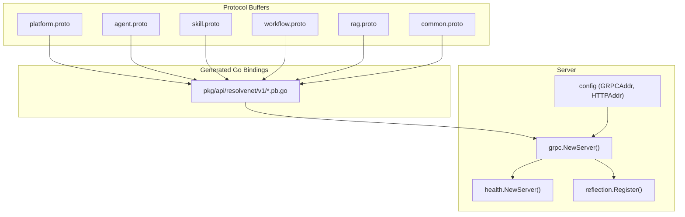
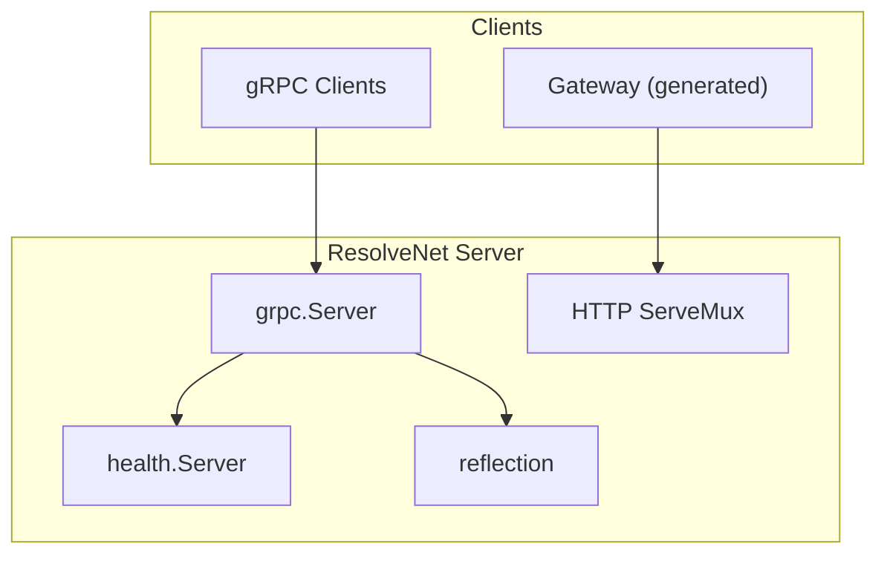
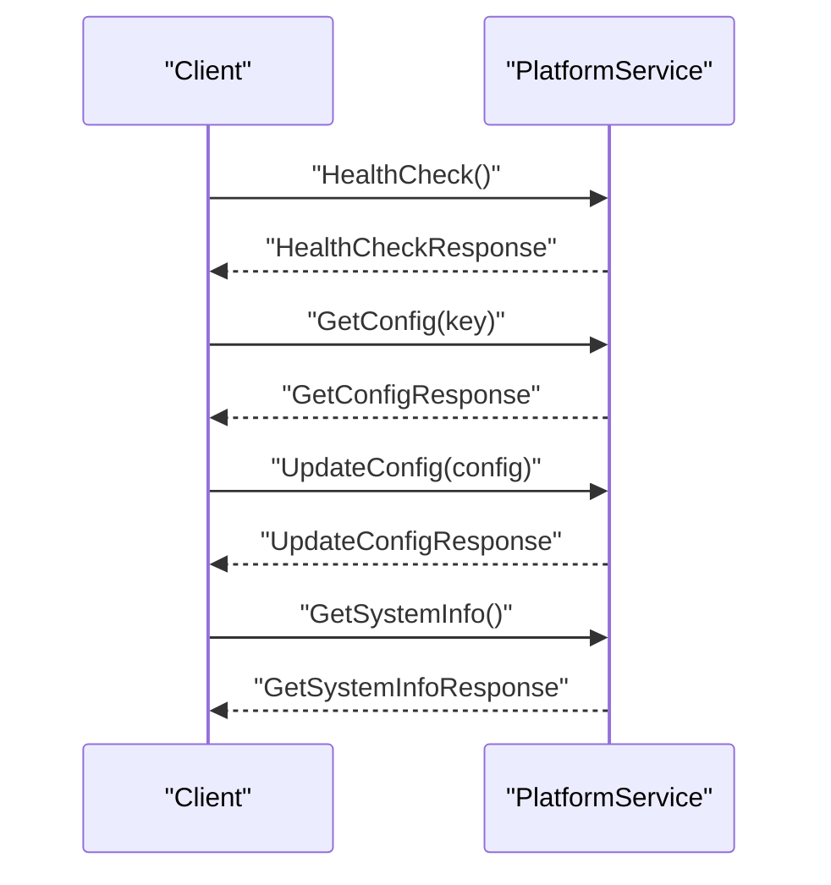
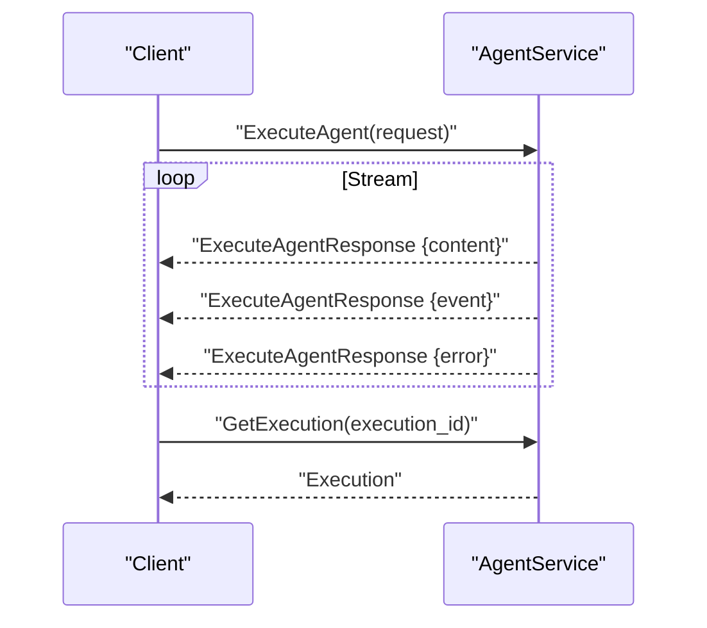
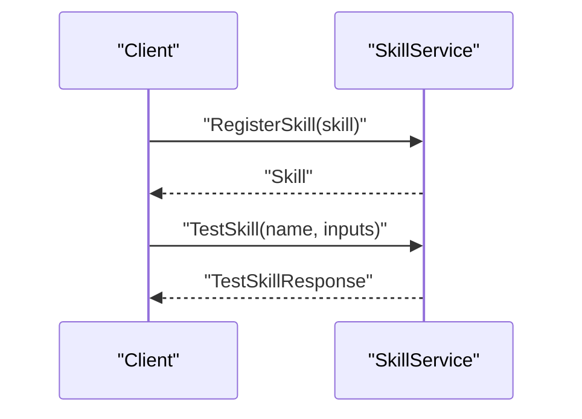
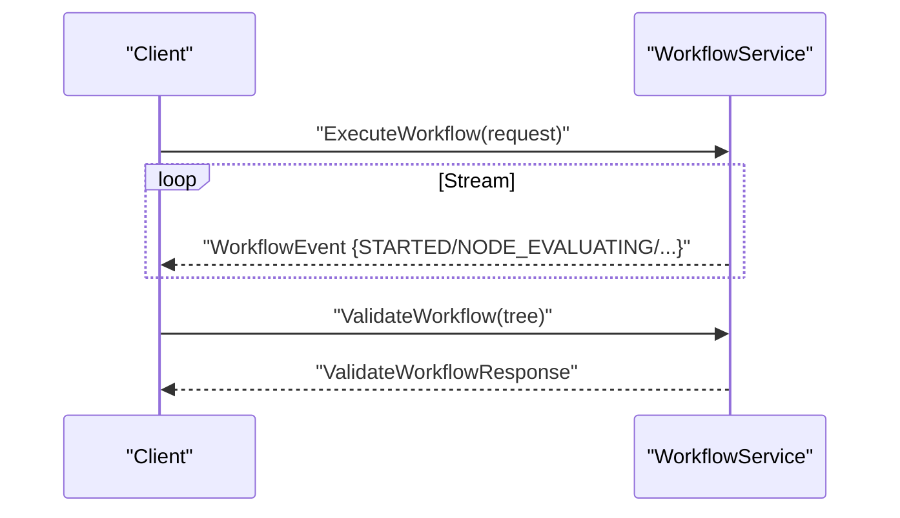
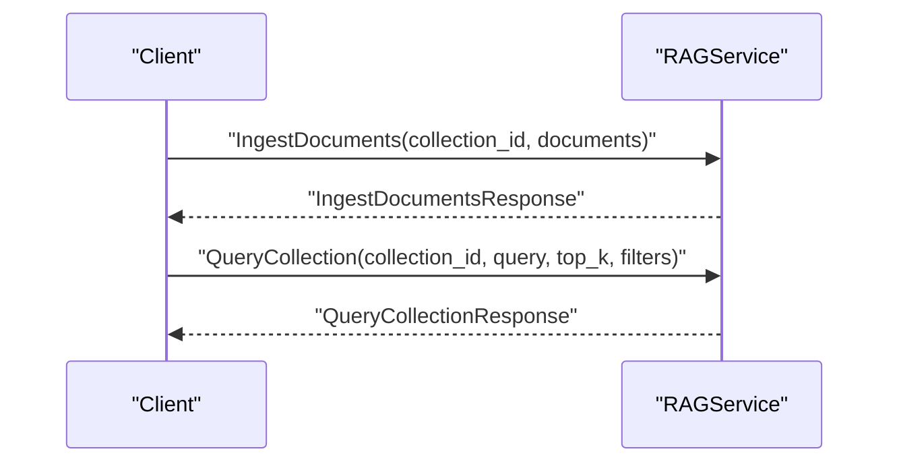
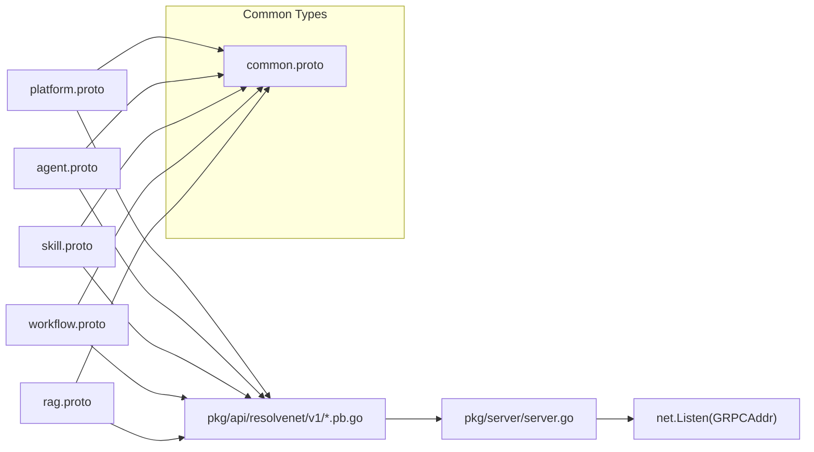

# gRPC Services

<cite>
**Referenced Files in This Document**
- [platform.proto](file://api/proto/resolvenet/v1/platform.proto)
- [agent.proto](file://api/proto/resolvenet/v1/agent.proto)
- [skill.proto](file://api/proto/resolvenet/v1/skill.proto)
- [workflow.proto](file://api/proto/resolvenet/v1/workflow.proto)
- [rag.proto](file://api/proto/resolvenet/v1/rag.proto)
- [common.proto](file://api/proto/resolvenet/v1/common.proto)
- [server.go](file://pkg/server/server.go)
- [router.go](file://pkg/server/router.go)
- [auth.go](file://pkg/server/middleware/auth.go)
- [config.go](file://pkg/config/config.go)
- [types.go](file://pkg/config/types.go)
- [buf.gen.yaml](file://tools/buf/buf.gen.yaml)
- [main.go](file://cmd/resolvenet-server/main.go)
- [main.go](file://cmd/resolvenet-cli/main.go)
</cite>

## Table of Contents
1. [Introduction](#introduction)
2. [Project Structure](#project-structure)
3. [Core Components](#core-components)
4. [Architecture Overview](#architecture-overview)
5. [Detailed Component Analysis](#detailed-component-analysis)
6. [Dependency Analysis](#dependency-analysis)
7. [Performance Considerations](#performance-considerations)
8. [Troubleshooting Guide](#troubleshooting-guide)
9. [Conclusion](#conclusion)
10. [Appendices](#appendices)

## Introduction
This document provides comprehensive gRPC service documentation for ResolveNet’s Protocol Buffer-defined services. It covers the service definitions for PlatformService, AgentService, SkillService, WorkflowService, and RAGService, including method signatures, request/response message types, streaming patterns, and Protocol Buffer schema semantics. It also explains connection management, authentication considerations, performance optimization techniques, bidirectional streaming capabilities, and gRPC-specific error handling and retry strategies.

## Project Structure
ResolveNet organizes its gRPC service definitions under the Protocol Buffer directory and generates Go bindings via Buf. The server initializes a gRPC server, registers health and reflection services, and exposes REST endpoints for HTTP clients. Configuration controls gRPC and HTTP listener addresses.

**Diagram sources**
- [platform.proto:1-61](file://api/proto/resolvenet/v1/platform.proto#L1-L61)
- [agent.proto:1-177](file://api/proto/resolvenet/v1/agent.proto#L1-L177)
- [skill.proto:1-101](file://api/proto/resolvenet/v1/skill.proto#L1-L101)
- [workflow.proto:1-145](file://api/proto/resolvenet/v1/workflow.proto#L1-L145)
- [rag.proto:1-99](file://api/proto/resolvenet/v1/rag.proto#L1-L99)
- [common.proto:1-49](file://api/proto/resolvenet/v1/common.proto#L1-L49)
- [server.go:28-52](file://pkg/server/server.go#L28-L52)
- [config.go:14-32](file://pkg/config/config.go#L14-L32)

**Section sources**
- [platform.proto:1-61](file://api/proto/resolvenet/v1/platform.proto#L1-L61)
- [agent.proto:1-177](file://api/proto/resolvenet/v1/agent.proto#L1-L177)
- [skill.proto:1-101](file://api/proto/resolvenet/v1/skill.proto#L1-L101)
- [workflow.proto:1-145](file://api/proto/resolvenet/v1/workflow.proto#L1-L145)
- [rag.proto:1-99](file://api/proto/resolvenet/v1/rag.proto#L1-L99)
- [common.proto:1-49](file://api/proto/resolvenet/v1/common.proto#L1-L49)
- [server.go:28-52](file://pkg/server/server.go#L28-L52)
- [config.go:14-32](file://pkg/config/config.go#L14-L32)

## Core Components
This section summarizes each gRPC service, its methods, and notable streaming patterns.

- PlatformService
  - Methods: HealthCheck, GetConfig, UpdateConfig, GetSystemInfo
  - Streaming: None
  - Typical use: Health probes, system diagnostics, configuration retrieval and updates

- AgentService
  - Methods: CreateAgent, GetAgent, ListAgents, UpdateAgent, DeleteAgent, ExecuteAgent, GetExecution, ListExecutions
  - Streaming: ExecuteAgent returns stream ExecuteAgentResponse
  - Notable types: Agent, Execution, ExecutionEvent, ExecutionError, RouteDecision

- SkillService
  - Methods: RegisterSkill, GetSkill, ListSkills, UnregisterSkill, TestSkill
  - Streaming: None
  - Notable types: Skill, SkillManifest, SkillParameter, SkillPermissions

- WorkflowService
  - Methods: CreateWorkflow, GetWorkflow, ListWorkflows, UpdateWorkflow, DeleteWorkflow, ValidateWorkflow, ExecuteWorkflow
  - Streaming: ExecuteWorkflow returns stream WorkflowEvent
  - Notable types: Workflow, FaultTree, FTAEvent, FTAGate, WorkflowEvent

- RAGService
  - Methods: CreateCollection, GetCollection, ListCollections, DeleteCollection, IngestDocuments, QueryCollection
  - Streaming: None
  - Notable types: Collection, Document, RetrievedChunk, ChunkConfig

Validation rules and constraints observed in the schema:
- ResourceMeta.id and name are required identifiers for all resources.
- PaginationRequest.page_size and PaginationRequest.page_token are used consistently across list APIs.
- Enums such as HealthStatus, ResourceStatus, AgentType, ExecutionStatus, RouteType, WorkflowStatus, FTAEventType, FTAGateType define strict value sets.
- Struct and Value types are used for flexible configuration and dynamic data interchange.

**Section sources**
- [platform.proto:9-15](file://api/proto/resolvenet/v1/platform.proto#L9-L15)
- [agent.proto:11-29](file://api/proto/resolvenet/v1/agent.proto#L11-L29)
- [skill.proto:10-17](file://api/proto/resolvenet/v1/skill.proto#L10-L17)
- [workflow.proto:11-20](file://api/proto/resolvenet/v1/workflow.proto#L11-L20)
- [rag.proto:10-18](file://api/proto/resolvenet/v1/rag.proto#L10-L18)
- [common.proto:9-49](file://api/proto/resolvenet/v1/common.proto#L9-L49)

## Architecture Overview
The gRPC server is initialized with health checking and reflection enabled. The server listens on the configured gRPC address and serves both gRPC and HTTP traffic. Health and reflection simplify client discovery and diagnostics.

**Diagram sources**
- [server.go:28-52](file://pkg/server/server.go#L28-L52)
- [buf.gen.yaml:1-14](file://tools/buf/buf.gen.yaml#L1-L14)

**Section sources**
- [server.go:28-52](file://pkg/server/server.go#L28-L52)
- [buf.gen.yaml:1-14](file://tools/buf/buf.gen.yaml#L1-L14)

## Detailed Component Analysis

### PlatformService
- Methods and signatures
  - HealthCheck(HealthCheckRequest) returns (HealthCheckResponse)
  - GetConfig(GetConfigRequest) returns (GetConfigResponse)
  - UpdateConfig(UpdateConfigRequest) returns (UpdateConfigResponse)
  - GetSystemInfo(GetSystemInfoRequest) returns (GetSystemInfoResponse)
- Streaming: None
- Message types
  - HealthCheckResponse: overall ServiceHealth, components map<string, ServiceHealth>
  - ServiceHealth: status HealthStatus, message string
  - GetConfigRequest: key string
  - GetConfigResponse: config google.protobuf.Struct
  - UpdateConfigRequest: config google.protobuf.Struct
  - GetSystemInfoResponse: version, commit, build_date, go_version, platform
- Validation rules
  - GetConfigRequest.key: empty means “all config”
  - HealthStatus enum defines allowed values

**Diagram sources**
- [platform.proto:9-15](file://api/proto/resolvenet/v1/platform.proto#L9-L15)

**Section sources**
- [platform.proto:9-61](file://api/proto/resolvenet/v1/platform.proto#L9-L61)

### AgentService
- Methods and signatures
  - CreateAgent(CreateAgentRequest) returns (Agent)
  - GetAgent(GetAgentRequest) returns (Agent)
  - ListAgents(ListAgentsRequest) returns (ListAgentsResponse)
  - UpdateAgent(UpdateAgentRequest) returns (Agent)
  - DeleteAgent(DeleteAgentRequest) returns (DeleteAgentResponse)
  - ExecuteAgent(ExecuteAgentRequest) returns (stream ExecuteAgentResponse)
  - GetExecution(GetExecutionRequest) returns (Execution)
  - ListExecutions(ListExecutionsRequest) returns (ListExecutionsResponse)
- Streaming: ExecuteAgent returns a stream of ExecuteAgentResponse
- Message types
  - Agent: meta ResourceMeta, type AgentType, config AgentConfig, status ResourceStatus
  - AgentConfig: model_id, system_prompt, skill_names, workflow_id, rag_collection_id, parameters, selector_config
  - ExecuteAgentRequest: agent_id, input, conversation_id, context
  - ExecuteAgentResponse: oneof { content string | event ExecutionEvent | error ExecutionError }
  - ExecutionEvent: type, message, data Struct, timestamp Timestamp
  - ExecutionError: code, message
  - Execution: id, agent_id, input, output, status ExecutionStatus, route_decision RouteDecision, trace_id, timestamps, duration_ms
  - RouteDecision: route_type RouteType, route_target, confidence, parameters Struct, chain
- Validation rules
  - AgentType enum restricts agent kinds
  - ExecutionStatus enum defines lifecycle states
  - PaginationRequest used for ListAgents and ListExecutions

**Diagram sources**
- [agent.proto:11-29](file://api/proto/resolvenet/v1/agent.proto#L11-L29)

**Section sources**
- [agent.proto:11-177](file://api/proto/resolvenet/v1/agent.proto#L11-L177)
- [common.proto:9-49](file://api/proto/resolvenet/v1/common.proto#L9-L49)

### SkillService
- Methods and signatures
  - RegisterSkill(RegisterSkillRequest) returns (Skill)
  - GetSkill(GetSkillRequest) returns (Skill)
  - ListSkills(ListSkillsRequest) returns (ListSkillsResponse)
  - UnregisterSkill(UnregisterSkillRequest) returns (UnregisterSkillResponse)
  - TestSkill(TestSkillRequest) returns (TestSkillResponse)
- Streaming: None
- Message types
  - Skill: meta ResourceMeta, version, author, manifest SkillManifest, source_type, source_uri, status
  - SkillManifest: entry_point, inputs SkillParameter[], outputs SkillParameter[], dependencies, permissions SkillPermissions
  - SkillParameter: name, type, description, required, default_value
  - SkillPermissions: network_access, file_system_read, file_system_write, allowed_hosts, max_memory_mb, max_cpu_seconds, timeout_seconds
  - TestSkillRequest: name, inputs Struct
  - TestSkillResponse: outputs Struct, logs, duration_ms, success, error_message

**Diagram sources**
- [skill.proto:10-17](file://api/proto/resolvenet/v1/skill.proto#L10-L17)

**Section sources**
- [skill.proto:10-101](file://api/proto/resolvenet/v1/skill.proto#L10-L101)
- [common.proto:9-49](file://api/proto/resolvenet/v1/common.proto#L9-L49)

### WorkflowService
- Methods and signatures
  - CreateWorkflow(CreateWorkflowRequest) returns (Workflow)
  - GetWorkflow(GetWorkflowRequest) returns (Workflow)
  - ListWorkflows(ListWorkflowsRequest) returns (ListWorkflowsResponse)
  - UpdateWorkflow(UpdateWorkflowRequest) returns (Workflow)
  - DeleteWorkflow(DeleteWorkflowRequest) returns (DeleteWorkflowResponse)
  - ValidateWorkflow(ValidateWorkflowRequest) returns (ValidateWorkflowResponse)
  - ExecuteWorkflow(ExecuteWorkflowRequest) returns (stream WorkflowEvent)
- Streaming: ExecuteWorkflow returns a stream of WorkflowEvent
- Message types
  - Workflow: meta ResourceMeta, tree FaultTree, status WorkflowStatus
  - FaultTree: top_event_id, events FTAEvent[], gates FTAGate[]
  - FTAEvent: id, name, description, type FTAEventType, evaluator, parameters Struct
  - FTAGate: id, name, type FTAGateType, input_ids, output_id, k_value
  - WorkflowEvent: workflow_id, execution_id, type WorkflowEventType, node_id, message, data Struct, timestamp Timestamp
  - ValidateWorkflowRequest: tree FaultTree
  - ValidateWorkflowResponse: valid bool, errors string[], warnings string[]
- Validation rules
  - WorkflowStatus enum defines lifecycle states
  - FTAEventType and FTAGateType enums define allowed values

**Diagram sources**
- [workflow.proto:11-20](file://api/proto/resolvenet/v1/workflow.proto#L11-L20)

**Section sources**
- [workflow.proto:11-145](file://api/proto/resolvenet/v1/workflow.proto#L11-L145)
- [common.proto:9-49](file://api/proto/resolvenet/v1/common.proto#L9-L49)

### RAGService
- Methods and signatures
  - CreateCollection(CreateCollectionRequest) returns (Collection)
  - GetCollection(GetCollectionRequest) returns (Collection)
  - ListCollections(ListCollectionsRequest) returns (ListCollectionsResponse)
  - DeleteCollection(DeleteCollectionRequest) returns (DeleteCollectionResponse)
  - IngestDocuments(IngestDocumentsRequest) returns (IngestDocumentsResponse)
  - QueryCollection(QueryCollectionRequest) returns (QueryCollectionResponse)
- Streaming: None
- Message types
  - Collection: meta ResourceMeta, embedding_model, chunk_config ChunkConfig, document_count, vector_count, status
  - ChunkConfig: strategy ("fixed","sentence","semantic"), chunk_size, chunk_overlap
  - Document: id, title, content, content_type, metadata
  - RetrievedChunk: document_id, document_title, content, score, metadata
  - IngestDocumentsRequest: collection_id, documents Document[]
  - IngestDocumentsResponse: documents_processed, chunks_created, errors string[]
  - QueryCollectionRequest: collection_id, query, top_k, filters Struct
  - QueryCollectionResponse: chunks RetrievedChunk[]

**Diagram sources**
- [rag.proto:10-18](file://api/proto/resolvenet/v1/rag.proto#L10-L18)

**Section sources**
- [rag.proto:10-99](file://api/proto/resolvenet/v1/rag.proto#L10-L99)
- [common.proto:9-49](file://api/proto/resolvenet/v1/common.proto#L9-L49)

## Dependency Analysis
The gRPC services share common message types defined in common.proto. Generated Go bindings are produced by Buf and placed under pkg/api. The server composes gRPC and HTTP servers, enabling dual-mode operation.

**Diagram sources**
- [common.proto:1-49](file://api/proto/resolvenet/v1/common.proto#L1-L49)
- [platform.proto:1-61](file://api/proto/resolvenet/v1/platform.proto#L1-L61)
- [agent.proto:1-177](file://api/proto/resolvenet/v1/agent.proto#L1-L177)
- [skill.proto:1-101](file://api/proto/resolvenet/v1/skill.proto#L1-L101)
- [workflow.proto:1-145](file://api/proto/resolvenet/v1/workflow.proto#L1-L145)
- [rag.proto:1-99](file://api/proto/resolvenet/v1/rag.proto#L1-L99)
- [server.go:63-72](file://pkg/server/server.go#L63-L72)
- [buf.gen.yaml:1-14](file://tools/buf/buf.gen.yaml#L1-L14)

**Section sources**
- [common.proto:1-49](file://api/proto/resolvenet/v1/common.proto#L1-L49)
- [server.go:63-72](file://pkg/server/server.go#L63-L72)
- [buf.gen.yaml:1-14](file://tools/buf/buf.gen.yaml#L1-L14)

## Performance Considerations
- Connection pooling and keepalive
  - Configure keepalive and connection pool sizes on the client to reduce handshake overhead.
- Streaming efficiency
  - For ExecuteAgent and ExecuteWorkflow, batch small content frames and emit periodic ExecutionEvent/WorkflowEvent updates to minimize latency.
- Backpressure and flow control
  - Use server-side flow control and client-side buffering to avoid overwhelming clients during high-throughput streams.
- Compression
  - Enable compression on the gRPC channel for large payloads (e.g., QueryCollectionResponse with many RetrievedChunk entries).
- Pagination
  - Use PaginationRequest.page_size and PaginationResponse.next_page_token to limit payload sizes for list operations.
- Health and reflection
  - Keep reflection enabled only in development; disable in production to reduce attack surface.

[No sources needed since this section provides general guidance]

## Troubleshooting Guide
- Health checks
  - Use the gRPC health service to probe liveness and readiness.
- Logging and shutdown
  - The server logs startup and shutdown events and performs graceful stop of the gRPC server.
- Authentication
  - HTTP middleware currently allows all requests; implement JWT or API key validation before exposing to untrusted networks.
- Configuration
  - Verify GRPCAddr and HTTPAddr in configuration; ensure ports are open and not conflicting.

**Section sources**
- [server.go:63-72](file://pkg/server/server.go#L63-L72)
- [server.go:93-96](file://pkg/server/server.go#L93-L96)
- [auth.go:8-17](file://pkg/server/middleware/auth.go#L8-L17)
- [config.go:14-32](file://pkg/config/config.go#L14-L32)

## Conclusion
ResolveNet’s gRPC services provide a robust foundation for managing agents, skills, workflows, and RAG operations. The schema enforces strong typing and validation, while streaming methods enable real-time execution feedback. The server integrates health and reflection for diagnostics, and configuration supports flexible deployment. Extend authentication and observability for production-grade reliability.

[No sources needed since this section summarizes without analyzing specific files]

## Appendices

### Client Implementation Patterns
- Initialization
  - Create a gRPC client with target address set to the configured gRPC endpoint.
  - Optionally enable TLS and credentials for secure connections.
- Method calls
  - Use context with timeouts for all RPCs.
  - For streaming methods, read from the stream until completion or error.
- Error handling
  - Inspect gRPC status codes and convert to application-level errors.
  - Log trace IDs from Execution or Workflow responses for correlation.
- Retry and circuit breaker
  - Apply exponential backoff for transient failures.
  - Use circuit breaker patterns to prevent cascading failures under sustained errors.

[No sources needed since this section provides general guidance]

### gRPC Error Codes and Strategies
- Common codes
  - NotFound: resource not found (e.g., GetAgent, GetSkill, GetWorkflow, GetCollection)
  - InvalidArgument: malformed request (e.g., missing required fields)
  - DeadlineExceeded: request exceeded configured timeout
  - Unavailable: server temporarily unable to serve
- Retry strategies
  - Idempotent operations: retry with jittered exponential backoff
  - Non-idempotent operations: avoid automatic retries; surface to user
- Circuit breaker patterns
  - Track failure rate and latency; open circuit on thresholds; reset after success window

[No sources needed since this section provides general guidance]