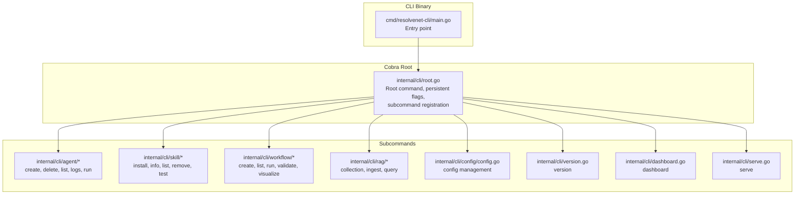
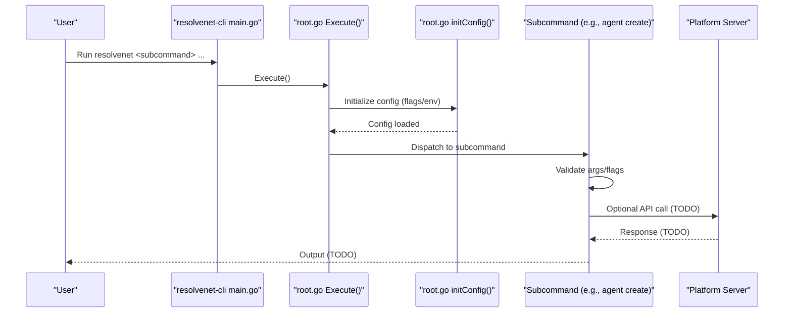
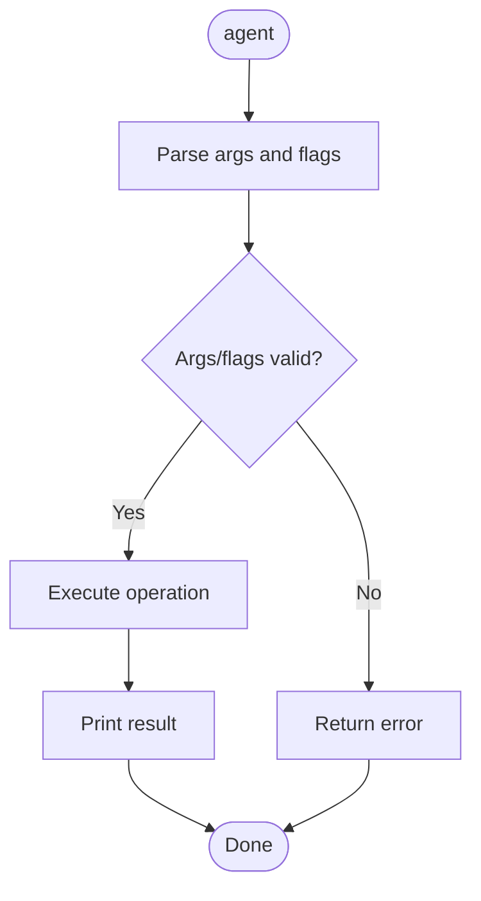
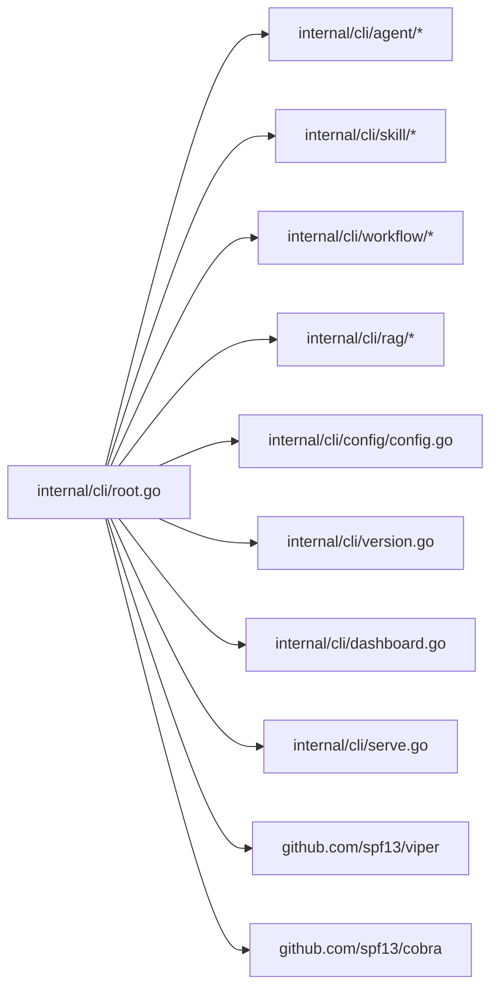

# CLI Command Structure

<cite>
**Referenced Files in This Document**
- [root.go](file://internal/cli/root.go)
- [main.go](file://cmd/resolvenet-cli/main.go)
- [create.go](file://internal/cli/agent/create.go)
- [delete.go](file://internal/cli/agent/delete.go)
- [list.go](file://internal/cli/agent/list.go)
- [logs.go](file://internal/cli/agent/logs.go)
- [run.go](file://internal/cli/agent/run.go)
- [install.go](file://internal/cli/skill/install.go)
- [info.go](file://internal/cli/skill/info.go)
- [list.go](file://internal/cli/skill/list.go)
- [remove.go](file://internal/cli/skill/remove.go)
- [test.go](file://internal/cli/skill/test.go)
- [create.go](file://internal/cli/workflow/create.go)
- [list.go](file://internal/cli/workflow/list.go)
- [run.go](file://internal/cli/workflow/run.go)
- [collection.go](file://internal/cli/rag/collection.go)
- [ingest.go](file://internal/cli/rag/ingest.go)
- [query.go](file://internal/cli/rag/query.go)
- [config.go](file://internal/cli/config/config.go)
- [version.go](file://internal/cli/version.go)
- [dashboard.go](file://internal/cli/dashboard.go)
- [serve.go](file://internal/cli/serve.go)
- [resolvenet.yaml](file://configs/resolvenet.yaml)
- [runtime.yaml](file://configs/runtime.yaml)
- [models.yaml](file://configs/models.yaml)
- [agent-example.yaml](file://configs/examples/agent-example.yaml)
- [skill-example.yaml](file://configs/examples/skill-example.yaml)
- [workflow-fta-example.yaml](file://configs/examples/workflow-fta-example.yaml)
</cite>

## Table of Contents
1. [Introduction](#introduction)
2. [Project Structure](#project-structure)
3. [Core Components](#core-components)
4. [Architecture Overview](#architecture-overview)
5. [Detailed Component Analysis](#detailed-component-analysis)
6. [Dependency Analysis](#dependency-analysis)
7. [Performance Considerations](#performance-considerations)
8. [Troubleshooting Guide](#troubleshooting-guide)
9. [Conclusion](#conclusion)
10. [Appendices](#appendices)

## Introduction
This document describes the CLI command structure of ResolveNet, built with Cobra. It covers the root command configuration, persistent flags, subcommand organization, and the command execution flow. It also documents command categories (agent management, skill operations, workflow management, RAG operations, configuration management), parameter validation, error handling patterns, and integration with the platform server. Practical workflows and configuration system integration are included, along with debugging tips and shell completion guidance.

## Project Structure
The CLI is implemented under internal/cli with a root command that registers subcommands for agent, skill, workflow, RAG, configuration, version, dashboard, and serve commands. The CLI binary entrypoint lives under cmd/resolvenet-cli.

**Diagram sources**
- [main.go:1-14](file://cmd/resolvenet-cli/main.go#L1-L14)
- [root.go:1-72](file://internal/cli/root.go#L1-L72)
- [create.go:1-49](file://internal/cli/agent/create.go#L1-L49)
- [install.go:1-41](file://internal/cli/skill/install.go#L1-L41)
- [create.go:1-45](file://internal/cli/workflow/create.go#L1-L45)
- [collection.go](file://internal/cli/rag/collection.go)
- [config.go](file://internal/cli/config/config.go)
- [version.go](file://internal/cli/version.go)
- [dashboard.go](file://internal/cli/dashboard.go)
- [serve.go](file://internal/cli/serve.go)

**Section sources**
- [main.go:1-14](file://cmd/resolvenet-cli/main.go#L1-L14)
- [root.go:1-72](file://internal/cli/root.go#L1-L72)

## Core Components
- Root command: Defines the CLI name, help text, and registers persistent flags and subcommands.
- Persistent flags: Config file location and server address; server address is bound to configuration.
- Subcommands: Agent, skill, workflow, RAG, config, version, dashboard, serve.

Key behaviors:
- Execution starts at the CLI entrypoint, which invokes the root command’s Execute method.
- Configuration initialization supports explicit config file or default home directory path with automatic environment variable binding.

**Section sources**
- [root.go:19-52](file://internal/cli/root.go#L19-L52)
- [root.go:54-71](file://internal/cli/root.go#L54-L71)
- [main.go:9-13](file://cmd/resolvenet-cli/main.go#L9-L13)

## Architecture Overview
The CLI composes a hierarchical command tree. The root command initializes configuration and registers subcommands. Each subcommand defines its own flags and argument validation. Commands currently print messages and include TODO comments indicating future integration with the platform server.

**Diagram sources**
- [main.go:9-13](file://cmd/resolvenet-cli/main.go#L9-L13)
- [root.go:29-52](file://internal/cli/root.go#L29-L52)
- [root.go:54-71](file://internal/cli/root.go#L54-L71)
- [create.go:14-22](file://internal/cli/agent/create.go#L14-L22)

## Detailed Component Analysis

### Root Command and Configuration
- Root command sets the CLI name and help text.
- Registers persistent flags: config file path and server address.
- Binds the server flag to configuration for seamless viper integration.
- Initializes configuration using either an explicit file or default home directory path, with automatic environment variable binding.

Practical usage:
- Set server address via flag or environment variable RESOLVENET_SERVER.
- Provide a custom config file via --config or RESOLVENET_CONFIG.

**Section sources**
- [root.go:19-26](file://internal/cli/root.go#L19-L26)
- [root.go:36-41](file://internal/cli/root.go#L36-L41)
- [root.go:54-71](file://internal/cli/root.go#L54-L71)

### Agent Management Commands
Agent commands support lifecycle operations:
- create: Creates an agent with type, model, prompt, and optional YAML file.
- list: Lists agents with filtering by type/status and output format selection.
- run: Starts an interactive session with an agent.
- logs: Streams agent execution logs with follow and tail options.
- delete: Removes an agent by identifier.

Validation and flags:
- Argument counts enforced per command.
- Flags include type, model, prompt, file, follow, tail, conversation, and output format.

Execution flow:
- Parse arguments and flags.
- Print formatted messages; future implementation will integrate with the platform server.

**Diagram sources**
- [create.go:14-22](file://internal/cli/agent/create.go#L14-L22)
- [list.go:14-25](file://internal/cli/agent/list.go#L14-L25)
- [run.go:15-22](file://internal/cli/agent/run.go#L15-L22)
- [logs.go:14-24](file://internal/cli/agent/logs.go#L14-L24)
- [delete.go:14-18](file://internal/cli/agent/delete.go#L14-L18)

**Section sources**
- [create.go:9-31](file://internal/cli/agent/create.go#L9-L31)
- [list.go:9-28](file://internal/cli/agent/list.go#L9-L28)
- [run.go:9-28](file://internal/cli/agent/run.go#L9-L28)
- [logs.go:9-27](file://internal/cli/agent/logs.go#L9-L27)
- [delete.go:9-21](file://internal/cli/agent/delete.go#L9-L21)

### Skill Operations
Skill commands enable skill lifecycle management:
- install: Installs a skill from a source (local path, git, registry).
- list: Lists installed skills.
- info: Shows details for a named skill.
- test: Runs an isolated test for a skill.
- remove: Uninstalls a skill by name.

Validation and flags:
- Exact positional argument requirements per command.
- No flags defined in current implementations; future versions may add flags.

Execution flow:
- Parse arguments.
- Print formatted messages; future implementation will integrate with the platform server.

**Section sources**
- [install.go:26-40](file://internal/cli/skill/install.go#L26-L40)
- [list.go:9-22](file://internal/cli/skill/list.go#L9-L22)
- [info.go:9-21](file://internal/cli/skill/info.go#L9-L21)
- [test.go:9-21](file://internal/cli/skill/test.go#L9-L21)
- [remove.go:9-21](file://internal/cli/skill/remove.go#L9-L21)

### Workflow Management
Workflow commands manage Fault Tree Analysis (FTA) workflows:
- create: Creates a workflow from a YAML definition file (required).
- list: Lists workflows.
- run: Executes a workflow.
- validate: Validates workflow definition (placeholder).
- visualize: Visualizes workflow (placeholder).

Validation and flags:
- create requires a file flag.
- Other commands enforce argument counts.

Execution flow:
- Parse arguments and flags.
- Print formatted messages; future implementation will integrate with the platform server.

**Section sources**
- [create.go:26-44](file://internal/cli/workflow/create.go#L26-L44)
- [list.go:9-22](file://internal/cli/workflow/list.go#L9-L22)
- [run.go:9-21](file://internal/cli/workflow/run.go#L9-L21)

### RAG Operations
RAG commands support collection management, document ingestion, and querying:
- collection: Manages RAG collections (placeholder).
- ingest: Ingests documents into a collection (placeholder).
- query: Queries a collection (placeholder).

Execution flow:
- Placeholder implementations print messages; future implementation will integrate with the platform server.

**Section sources**
- [collection.go](file://internal/cli/rag/collection.go)
- [ingest.go](file://internal/cli/rag/ingest.go)
- [query.go](file://internal/cli/rag/query.go)

### Configuration Management
Configuration commands provide:
- config: Manages configuration (placeholder).

Execution flow:
- Placeholder implementations print messages; future implementation will integrate with the platform server.

**Section sources**
- [config.go](file://internal/cli/config/config.go)

### Additional Commands
- version: Prints version information.
- dashboard: Opens the dashboard (placeholder).
- serve: Starts the CLI server mode (placeholder).

Execution flow:
- Placeholder implementations print messages; future implementation will integrate with the platform server.

**Section sources**
- [version.go](file://internal/cli/version.go)
- [dashboard.go](file://internal/cli/dashboard.go)
- [serve.go](file://internal/cli/serve.go)

## Dependency Analysis
The CLI depends on Cobra for command parsing and Viper for configuration. The root command registers subcommands that encapsulate their own flags and validation. There are no circular dependencies among command packages.

**Diagram sources**
- [root.go:10-14](file://internal/cli/root.go#L10-L14)
- [root.go:44-51](file://internal/cli/root.go#L44-L51)
- [root.go:34-41](file://internal/cli/root.go#L34-L41)

**Section sources**
- [root.go:10-14](file://internal/cli/root.go#L10-L14)
- [root.go:34-41](file://internal/cli/root.go#L34-L41)

## Performance Considerations
- Command dispatch is O(1) after Cobra parses arguments.
- Current implementations print messages synchronously; future server integrations should leverage streaming APIs to avoid blocking.
- Consider batching list operations and adding pagination flags for agent, skill, and workflow listings.

## Troubleshooting Guide
Common issues and resolutions:
- Configuration not loading:
  - Verify the config file path or default home directory path exists.
  - Ensure environment variables RESOLVENET_SERVER and RESOLVENET_CONFIG are set correctly.
- Server connectivity:
  - Confirm the platform server address matches the configured value.
  - Check network access and firewall settings.
- Flag precedence:
  - Command-line flags override environment variables; environment variables override config file values.
- Debugging:
  - Use verbose output flags if added later.
  - Enable debug logging in the platform server for deeper insights.

**Section sources**
- [root.go:54-71](file://internal/cli/root.go#L54-L71)
- [root.go:36-41](file://internal/cli/root.go#L36-L41)

## Conclusion
ResolveNet’s CLI is structured around a root command with persistent configuration and a set of subcommands organized by domain (agent, skill, workflow, RAG, configuration). While current implementations are placeholders, the architecture supports straightforward integration with the platform server. Users can configure the CLI via flags, environment variables, and config files, and the command tree provides a clear path for extending functionality.

## Appendices

### Command Categories and Examples
- Agent lifecycle:
  - Create: resolvenet agent create NAME --type TYPE --model MODEL
  - List: resolvenet agent list --type TYPE --status STATUS --output FORMAT
  - Run: resolvenet agent run ID --conversation CONVERSATION
  - Logs: resolvenet agent logs ID --follow --tail COUNT
  - Delete: resolvenet agent delete ID
- Skill operations:
  - Install: resolvenet skill install SOURCE
  - List: resolvenet skill list
  - Info: resolvenet skill info NAME
  - Test: resolvenet skill test NAME
  - Remove: resolvenet skill remove NAME
- Workflow management:
  - Create: resolvenet workflow create NAME --file FILE
  - List: resolvenet workflow list
  - Run: resolvenet workflow run ID
  - Validate: resolvenet workflow validate ID
  - Visualize: resolvenet workflow visualize ID
- RAG operations:
  - Collection: resolvenet rag collection ACTION
  - Ingest: resolvenet rag ingest COLLECTION
  - Query: resolvenet rag query COLLECTION "QUERY"
- Configuration management:
  - resolvenet config ACTION

### Configuration System Integration
- Default config path: $HOME/.resolvenet/config.yaml
- Environment variables:
  - RESOLVENET_SERVER for server address
  - RESOLVENET_CONFIG for config file path
- Example configuration files:
  - resolvenet.yaml, runtime.yaml, models.yaml
  - Example artifacts: agent-example.yaml, skill-example.yaml, workflow-fta-example.yaml

**Section sources**
- [root.go:54-71](file://internal/cli/root.go#L54-L71)
- [resolvenet.yaml](file://configs/resolvenet.yaml)
- [runtime.yaml](file://configs/runtime.yaml)
- [models.yaml](file://configs/models.yaml)
- [agent-example.yaml](file://configs/examples/agent-example.yaml)
- [skill-example.yaml](file://configs/examples/skill-example.yaml)
- [workflow-fta-example.yaml](file://configs/examples/workflow-fta-example.yaml)

### Shell Completion Setup
- Cobra supports generating shell completions for bash, zsh, fish, and powershell.
- To enable, add a completion subcommand to the root and generate completion scripts using the generated command.

[No sources needed since this section provides general guidance]