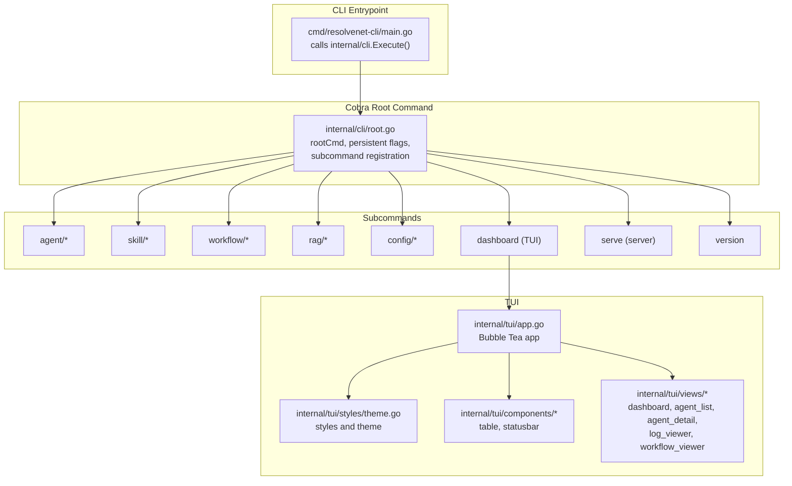
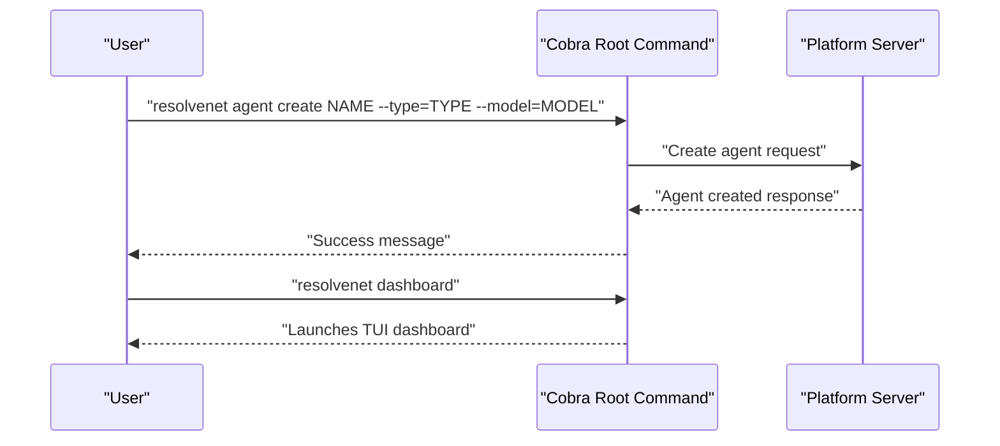
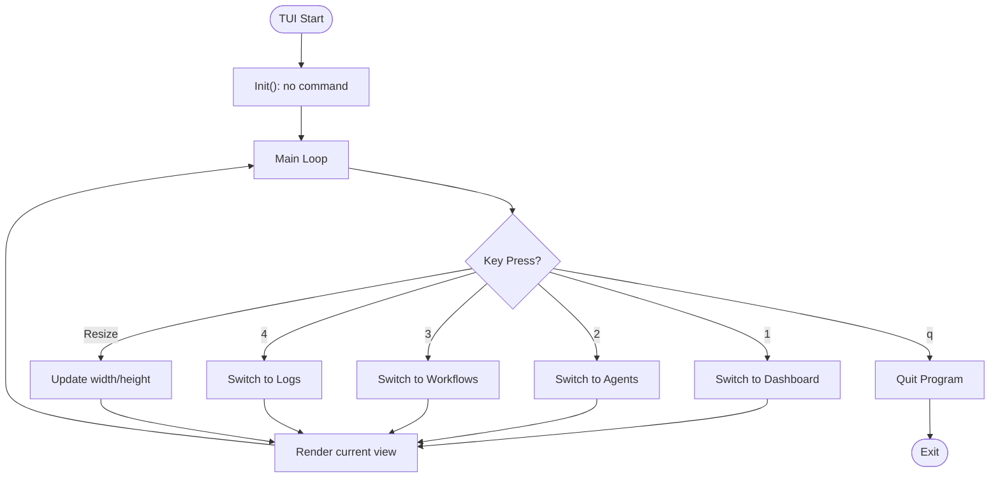
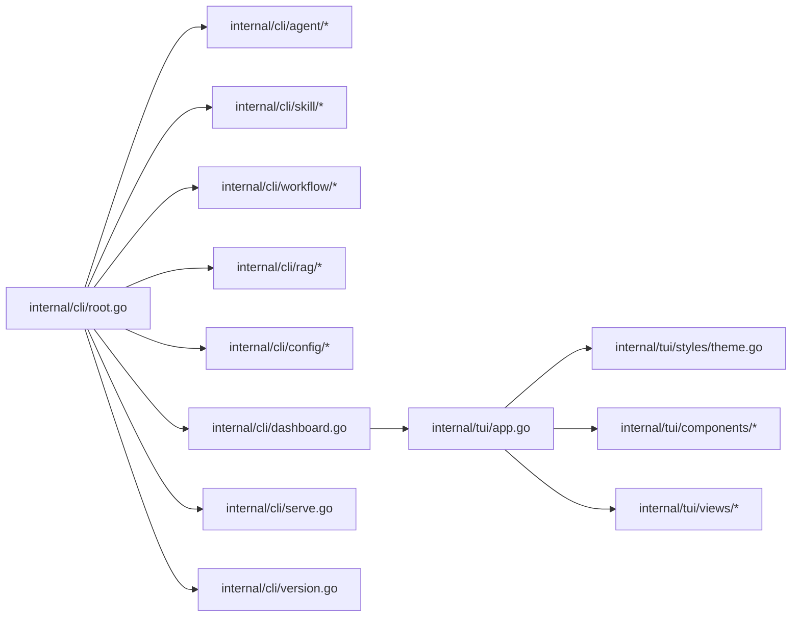

# CLI/TUI Interface

<cite>
**Referenced Files in This Document**
- [main.go](file://cmd/resolvenet-cli/main.go)
- [root.go](file://internal/cli/root.go)
- [dashboard.go](file://internal/cli/dashboard.go)
- [version.go](file://internal/cli/version.go)
- [serve.go](file://internal/cli/serve.go)
- [agent/create.go](file://internal/cli/agent/create.go)
- [agent/list.go](file://internal/cli/agent/list.go)
- [agent/run.go](file://internal/cli/agent/run.go)
- [agent/delete.go](file://internal/cli/agent/delete.go)
- [agent/logs.go](file://internal/cli/agent/logs.go)
- [skill/install.go](file://internal/cli/skill/install.go)
- [skill/list.go](file://internal/cli/skill/list.go)
- [skill/info.go](file://internal/cli/skill/info.go)
- [skill/test.go](file://internal/cli/skill/test.go)
- [skill/remove.go](file://internal/cli/skill/remove.go)
- [workflow/create.go](file://internal/cli/workflow/create.go)
- [workflow/list.go](file://internal/cli/workflow/list.go)
- [workflow/run.go](file://internal/cli/workflow/run.go)
- [workflow/validate.go](file://internal/cli/workflow/validate.go)
- [workflow/visualize.go](file://internal/cli/workflow/visualize.go)
- [rag/collection.go](file://internal/cli/rag/collection.go)
- [rag/ingest.go](file://internal/cli/rag/ingest.go)
- [rag/query.go](file://internal/cli/rag/query.go)
- [config/config.go](file://internal/cli/config/config.go)
- [app.go](file://internal/tui/app.go)
- [theme.go](file://internal/tui/styles/theme.go)
- [table.go](file://internal/tui/components/table.go)
- [statusbar.go](file://internal/tui/components/statusbar.go)
- [dashboard_view.go](file://internal/tui/views/dashboard.go)
- [agent_list.go](file://internal/tui/views/agent_list.go)
- [agent_detail.go](file://internal/tui/views/agent_detail.go)
- [log_viewer.go](file://internal/tui/views/log_viewer.go)
- [workflow_viewer.go](file://internal/tui/views/workflow_viewer.go)
</cite>

## Table of Contents
1. [Introduction](#introduction)
2. [Project Structure](#project-structure)
3. [Core Components](#core-components)
4. [Architecture Overview](#architecture-overview)
5. [Detailed Component Analysis](#detailed-component-analysis)
6. [Dependency Analysis](#dependency-analysis)
7. [Performance Considerations](#performance-considerations)
8. [Troubleshooting Guide](#troubleshooting-guide)
9. [Conclusion](#conclusion)
10. [Appendices](#appendices)

## Introduction
This document describes the CLI/TUI interface components of ResolveNet. It covers the Cobra-based command structure (root command, persistent flags, and subcommand organization), the interactive TUI dashboard built with the Bubble Tea framework, and the terminal styling system. It also documents command categories (agent management, skill operations, workflow execution, RAG operations, and configuration management), provides practical CLI workflows, and outlines integration with the platform server, error handling patterns, terminal compatibility, performance optimization for large datasets, and accessibility considerations.

## Project Structure
The CLI entrypoint delegates to the internal CLI package, which constructs the root command and registers subcommands for agents, skills, workflows, RAG, configuration, version, dashboard, and server commands. The TUI package provides a Bubble Tea application with styling, reusable components, and views.

**Diagram sources**
- [main.go:1-14](file://cmd/resolvenet-cli/main.go#L1-L14)
- [root.go:1-72](file://internal/cli/root.go#L1-L72)
- [app.go:1-102](file://internal/tui/app.go#L1-L102)
- [theme.go:1-47](file://internal/tui/styles/theme.go#L1-L47)

**Section sources**
- [main.go:1-14](file://cmd/resolvenet-cli/main.go#L1-L14)
- [root.go:1-72](file://internal/cli/root.go#L1-L72)

## Core Components
- Root command and persistent flags: Defines global flags (configuration file path and server address) and registers subcommands.
- Subcommand groups: Agent, Skill, Workflow, RAG, Config, Version, Dashboard, Serve.
- TUI application: Bubble Tea program with styled views, keyboard navigation, and responsive layout.
- Terminal styling system: Centralized theme constants and Lip Gloss styles for consistent visuals.
- Reusable components: Table and status bar components for consistent rendering.
- Views: Dashboard overview, agent listing/detail, logs viewer, and workflow viewer.

**Section sources**
- [root.go:19-52](file://internal/cli/root.go#L19-L52)
- [app.go:20-94](file://internal/tui/app.go#L20-L94)
- [theme.go:7-46](file://internal/tui/styles/theme.go#L7-L46)
- [table.go:3-21](file://internal/tui/components/table.go#L3-L21)
- [statusbar.go:12-22](file://internal/tui/components/statusbar.go#L12-L22)

## Architecture Overview
The CLI orchestrates operations against the platform server. The TUI provides a terminal-native dashboard for monitoring and navigation. Commands are organized by domain, and the root command centralizes configuration and server connectivity.

**Diagram sources**
- [root.go:36-51](file://internal/cli/root.go#L36-L51)
- [agent/create.go:9-31](file://internal/cli/agent/create.go#L9-L31)

## Detailed Component Analysis

### Root Command and Persistent Flags
- Root command defines the CLI identity and long description.
- Persistent flags include:
  - config: Path to configuration file (defaults to user home directory).
  - server: Platform server address (default localhost:8080).
- Initialization loads configuration from file or environment and binds flags to Viper.
- Subcommands registered include agent, skill, workflow, rag, config, version, dashboard, and serve.

Practical implications:
- Global server address is available to all commands via Viper.
- Configuration precedence supports environment variables with RESOLVENET_ prefix.

**Section sources**
- [root.go:19-72](file://internal/cli/root.go#L19-L72)

### Agent Management Commands
- Group: agent
- Subcommands:
  - create: Creates an agent with type, model, prompt, and optional YAML file.
  - list: Lists agents with filtering and output formats.
  - run: Executes an agent by ID.
  - delete: Removes an agent by ID.
  - logs: Streams or fetches agent logs.

Typical usage patterns:
- Create an agent with defaults, then run it, and finally inspect logs.
- List agents filtered by type or status, and export in JSON/YAML.

**Section sources**
- [agent/create.go:9-48](file://internal/cli/agent/create.go#L9-L48)
- [agent/list.go:9-28](file://internal/cli/agent/list.go#L9-L28)
- [agent/run.go](file://internal/cli/agent/run.go)
- [agent/delete.go](file://internal/cli/agent/delete.go)
- [agent/logs.go](file://internal/cli/agent/logs.go)

### Skill Operations
- Group: skill
- Subcommands:
  - install: Installs a skill from a source (local path, git, registry).
  - list: Lists installed skills.
  - info: Shows metadata for a skill.
  - test: Tests a skill.
  - remove: Removes a skill.

Operational notes:
- Installation accepts a single positional argument for the source.
- Listing supports filtering and output formats.

**Section sources**
- [skill/install.go:9-40](file://internal/cli/skill/install.go#L9-L40)
- [skill/list.go:9-22](file://internal/cli/skill/list.go#L9-L22)
- [skill/info.go](file://internal/cli/skill/info.go)
- [skill/test.go](file://internal/cli/skill/test.go)
- [skill/remove.go](file://internal/cli/skill/remove.go)

### Workflow Execution
- Group: workflow
- Subcommands:
  - create: Creates a workflow definition.
  - list: Lists workflows.
  - run: Executes a workflow by ID.
  - validate: Validates workflow syntax.
  - visualize: Renders workflow visualization.

Operational notes:
- Run expects a workflow ID and will stream execution via gRPC in future.
- List and visualize provide discovery and inspection capabilities.

**Section sources**
- [workflow/create.go](file://internal/cli/workflow/create.go)
- [workflow/list.go:9-22](file://internal/cli/workflow/list.go#L9-L22)
- [workflow/run.go:9-21](file://internal/cli/workflow/run.go#L9-L21)
- [workflow/validate.go](file://internal/cli/workflow/validate.go)
- [workflow/visualize.go](file://internal/cli/workflow/visualize.go)

### RAG Operations
- Group: rag
- Subcommands:
  - collection: Manages collections.
  - ingest: Ingests documents into a collection.
  - query: Queries a collection.

Operational notes:
- These commands provide foundational RAG management and retrieval capabilities.

**Section sources**
- [rag/collection.go](file://internal/cli/rag/collection.go)
- [rag/ingest.go](file://internal/cli/rag/ingest.go)
- [rag/query.go](file://internal/cli/rag/query.go)

### Configuration Management
- Group: config
- Subcommands:
  - set: Sets a configuration key-value pair and writes to disk.
  - get: Retrieves a configuration value.
  - view: Prints all configuration keys and values.
  - init: Initializes default configuration.

Integration:
- Uses Viper for configuration loading, environment binding, and persistence.

**Section sources**
- [config/config.go:10-84](file://internal/cli/config/config.go#L10-L84)

### Version and Serve Commands
- version: Prints version information.
- serve: Starts the platform server (not covered in depth here).

**Section sources**
- [version.go](file://internal/cli/version.go)
- [serve.go](file://internal/cli/serve.go)

### TUI Dashboard and Navigation
- Application model:
  - Tracks current view, terminal dimensions, and quitting state.
  - Keyboard navigation: 1–4 switch views, q quits.
- Views:
  - Dashboard: System status, active agents, running workflows, loaded skills.
  - Agent list/detail: Placeholder content for now.
  - Logs viewer: Placeholder content for now.
  - Workflow viewer: Placeholder content for now.
- Styling:
  - Centralized theme with primary/secondary colors, status styles, and borders.
  - Lip Gloss styles for titles, subtitles, labels, and status indicators.

**Diagram sources**
- [app.go:40-94](file://internal/tui/app.go#L40-L94)

**Section sources**
- [app.go:20-94](file://internal/tui/app.go#L20-L94)
- [theme.go:7-46](file://internal/tui/styles/theme.go#L7-L46)
- [dashboard_view.go:3-16](file://internal/tui/views/dashboard.go#L3-L16)

### Terminal Styling System and Components
- Theme:
  - Color palette: primary, secondary, success, warning, error, muted, background.
  - Typography: title, subtitle, label styles.
  - Status styles: healthy, error, warning.
  - Layout: rounded border styling with padding.
- Components:
  - Table: reusable headers, rows, and cursor.
  - Status Bar: styled bar with configurable width and text.

Usage:
- Views compose Lip Gloss styles from the theme for consistent appearance.
- Components encapsulate rendering logic for reuse.

**Section sources**
- [theme.go:7-46](file://internal/tui/styles/theme.go#L7-L46)
- [table.go:3-21](file://internal/tui/components/table.go#L3-L21)
- [statusbar.go:12-22](file://internal/tui/components/statusbar.go#L12-L22)

### Practical CLI Workflows
Below are representative workflows. Replace placeholders with actual values as needed.

- Agent creation and lifecycle
  - Create an agent: resolvenet agent create my-agent --type=mega --model=qwen-plus
  - List agents: resolvenet agent list
  - Run an agent: resolvenet agent run AGENT_ID
  - View logs: resolvenet agent logs AGENT_ID

- Skill management
  - Install a skill: resolvenet skill install ./skills/my-skill
  - List skills: resolvenet skill list
  - Remove a skill: resolvenet skill remove my-skill

- Workflow execution
  - List workflows: resolvenet workflow list
  - Run a workflow: resolvenet workflow run WORKFLOW_ID

- System monitoring
  - Launch dashboard: resolvenet dashboard
  - Configure server address globally: resolvenet --server=HOST:PORT config set server HOST:PORT

- Configuration management
  - Set a key: resolvenet config set key value
  - Get a key: resolvenet config get key
  - View all: resolvenet config view
  - Initialize defaults: resolvenet config init

Note: Some commands currently print placeholder messages and are marked with TODO comments indicating future integration with the platform server.

**Section sources**
- [agent/create.go:9-31](file://internal/cli/agent/create.go#L9-L31)
- [agent/list.go:9-28](file://internal/cli/agent/list.go#L9-L28)
- [agent/run.go:9-21](file://internal/cli/agent/run.go#L9-L21)
- [agent/logs.go](file://internal/cli/agent/logs.go)
- [skill/install.go:26-40](file://internal/cli/skill/install.go#L26-L40)
- [skill/list.go:9-22](file://internal/cli/skill/list.go#L9-L22)
- [skill/remove.go](file://internal/cli/skill/remove.go)
- [workflow/list.go:9-22](file://internal/cli/workflow/list.go#L9-L22)
- [workflow/run.go:9-21](file://internal/cli/workflow/run.go#L9-L21)
- [config/config.go:25-83](file://internal/cli/config/config.go#L25-L83)
- [dashboard.go:9-21](file://internal/cli/dashboard.go#L9-L21)

## Dependency Analysis
- CLI depends on Cobra for command parsing and Viper for configuration.
- TUI depends on Bubble Tea for the reactive model and Lip Gloss for styling.
- Root command aggregates subcommands from domain packages.
- TUI components depend on the shared theme module.

**Diagram sources**
- [root.go:43-51](file://internal/cli/root.go#L43-L51)
- [app.go:1-102](file://internal/tui/app.go#L1-L102)
- [theme.go:1-47](file://internal/tui/styles/theme.go#L1-L47)

**Section sources**
- [root.go:43-51](file://internal/cli/root.go#L43-L51)

## Performance Considerations
- TUI rendering:
  - Minimize allocations in the View loop; reuse styles and precompute widths.
  - Paginate or virtualize large lists in views to avoid rendering overhead.
- Data fetching:
  - Batch requests to the platform server; cache results per session.
  - Stream updates for logs and status to reduce polling frequency.
- Large datasets:
  - Use lazy rendering for tables; render visible rows only.
  - Implement incremental updates and debounced refreshes.
- Terminal compatibility:
  - Respect terminal size via WindowSizeMsg; adjust layouts dynamically.
  - Test fallbacks for terminals without UTF-8 support.

[No sources needed since this section provides general guidance]

## Troubleshooting Guide
- Configuration issues:
  - Verify config file path and permissions; check environment variable overrides.
  - Use resolvenet config view to inspect effective settings.
- Server connectivity:
  - Confirm server flag or environment variable RESOLVENET_SERVER.
  - Validate network reachability and TLS settings if applicable.
- TUI rendering problems:
  - Resize terminal window; ensure sufficient width/height.
  - Try disabling alternate screen mode if issues persist.
- Command errors:
  - Use verbose output where supported; check for missing arguments.
  - Re-run with debug logging if available.

**Section sources**
- [root.go:54-71](file://internal/cli/root.go#L54-L71)
- [config/config.go:60-83](file://internal/cli/config/config.go#L60-L83)
- [app.go:57-60](file://internal/tui/app.go#L57-L60)

## Conclusion
ResolveNet’s CLI/TUI interface combines a robust Cobra-based command structure with a modern Bubble Tea TUI. The root command centralizes configuration and server connectivity, while domain-specific subcommands enable agent, skill, workflow, and RAG operations. The TUI provides a responsive, styled dashboard with navigable views and reusable components. Future work includes integrating commands with the platform server, implementing streaming updates, and expanding view coverage.

[No sources needed since this section summarizes without analyzing specific files]

## Appendices

### Command Reference Summary
- Agent: create, list, run, delete, logs
- Skill: install, list, info, test, remove
- Workflow: create, list, run, validate, visualize
- RAG: collection, ingest, query
- Config: set, get, view, init
- Other: version, dashboard, serve

**Section sources**
- [agent/create.go:33-48](file://internal/cli/agent/create.go#L33-L48)
- [skill/install.go:9-24](file://internal/cli/skill/install.go#L9-L24)
- [workflow/list.go:9-22](file://internal/cli/workflow/list.go#L9-L22)
- [rag/collection.go](file://internal/cli/rag/collection.go)
- [config/config.go:10-23](file://internal/cli/config/config.go#L10-L23)