# TUI Interactive Dashboard

<cite>
**Referenced Files in This Document**
- [app.go](file://internal/tui/app.go)
- [table.go](file://internal/tui/components/table.go)
- [statusbar.go](file://internal/tui/components/statusbar.go)
- [theme.go](file://internal/tui/styles/theme.go)
- [dashboard.go](file://internal/tui/views/dashboard.go)
- [agent_list.go](file://internal/tui/views/agent_list.go)
- [agent_detail.go](file://internal/tui/views/agent_detail.go)
- [log_viewer.go](file://internal/tui/views/log_viewer.go)
- [workflow_viewer.go](file://internal/tui/views/workflow_viewer.go)
- [dashboard.go](file://internal/cli/dashboard.go)
- [root.go](file://internal/cli/root.go)
- [README.md](file://README.md)
</cite>

## Table of Contents
1. [Introduction](#introduction)
2. [Project Structure](#project-structure)
3. [Core Components](#core-components)
4. [Architecture Overview](#architecture-overview)
5. [Detailed Component Analysis](#detailed-component-analysis)
6. [Dependency Analysis](#dependency-analysis)
7. [Performance Considerations](#performance-considerations)
8. [Troubleshooting Guide](#troubleshooting-guide)
9. [Conclusion](#conclusion)
10. [Appendices](#appendices)

## Introduction
This document describes the TUI interactive dashboard built with the Bubble Tea framework. It explains the application architecture, main loop, view management, state handling, and the layout system with real-time status updates. It also documents the specialized views (dashboard overview, agent list, agent detail, log viewer, workflow visualization), custom UI components (table, status bar, theme), keyboard navigation, and integration points with platform services. Terminal compatibility, performance optimization, debugging, testing, and accessibility considerations are included to guide robust development and operation of the terminal-based application.

## Project Structure
The TUI module resides under internal/tui and is organized by concerns:
- Application model and program lifecycle: internal/tui/app.go
- Reusable UI components: internal/tui/components/table.go, internal/tui/components/statusbar.go
- Visual theme definitions: internal/tui/styles/theme.go
- View models for specialized screens: internal/tui/views/dashboard.go, internal/tui/views/agent_list.go, internal/tui/views/agent_detail.go, internal/tui/views/log_viewer.go, internal/tui/views/workflow_viewer.go
- CLI integration: internal/cli/dashboard.go, internal/cli/root.go
- Project overview and CLI usage: README.md

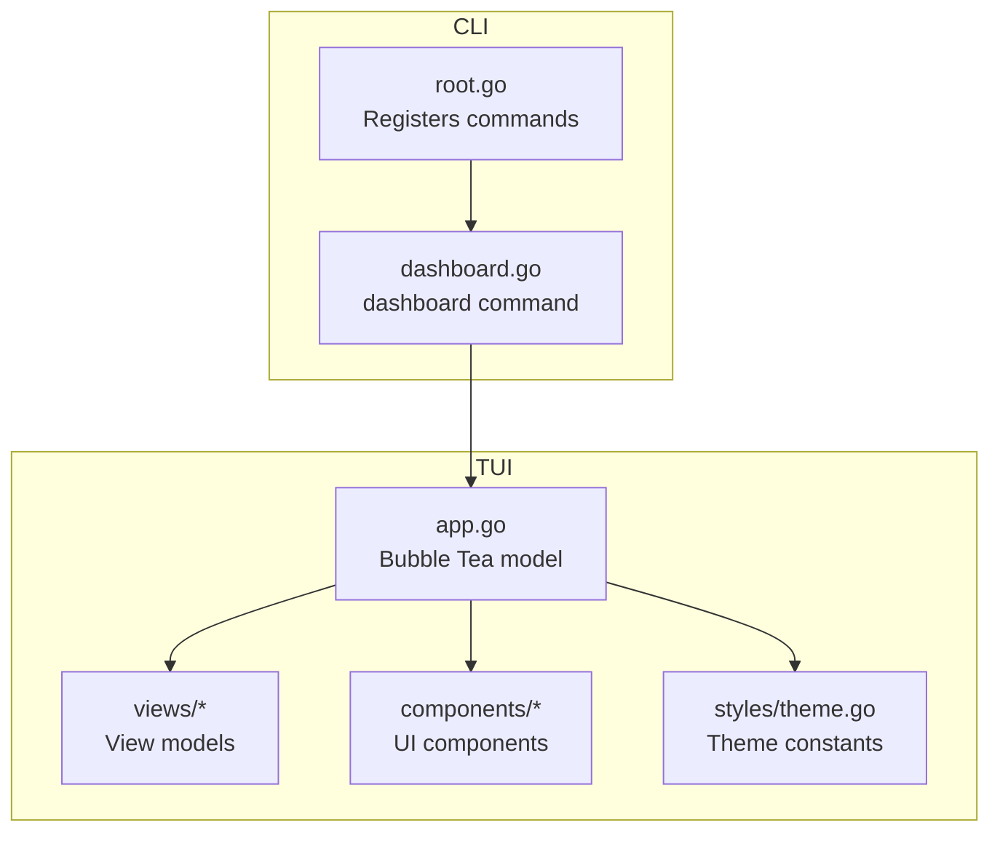

**Diagram sources**
- [root.go:19-52](file://internal/cli/root.go#L19-L52)
- [dashboard.go:9-21](file://internal/cli/dashboard.go#L9-L21)
- [app.go:20-33](file://internal/tui/app.go#L20-L33)
- [dashboard.go:3-9](file://internal/tui/views/dashboard.go#L3-L9)
- [agent_list.go:3-6](file://internal/tui/views/agent_list.go#L3-L6)
- [agent_detail.go:3-12](file://internal/tui/views/agent_detail.go#L3-L12)
- [log_viewer.go:3-8](file://internal/tui/views/log_viewer.go#L3-L8)
- [workflow_viewer.go:3-7](file://internal/tui/views/workflow_viewer.go#L3-L7)
- [table.go:3-8](file://internal/tui/components/table.go#L3-L8)
- [statusbar.go:12-21](file://internal/tui/components/statusbar.go#L12-L21)
- [theme.go:7-46](file://internal/tui/styles/theme.go#L7-L46)

**Section sources**
- [README.md:116-139](file://README.md#L116-L139)
- [root.go:19-52](file://internal/cli/root.go#L19-L52)
- [dashboard.go:9-21](file://internal/cli/dashboard.go#L9-L21)
- [app.go:20-33](file://internal/tui/app.go#L20-L33)

## Core Components
- Application model and loop
  - Model holds current view identifier, terminal dimensions, and quitting flag.
  - Update handles key messages to switch views and window resize messages to update dimensions.
  - View renders the title, status bar, current view content, and footer controls.
  - Run initializes the Bubble Tea program with alternate screen enabled.
- View models
  - DashboardView: system metrics and status.
  - AgentListView: list of agents with item metadata.
  - AgentDetailView: detailed agent profile and execution metrics.
  - LogViewerView: streaming log lines with follow mode and max line limit.
  - WorkflowViewerView: FTA workflow tree representation.
- UI components
  - Table: generic header/row renderer with cursor support.
  - StatusBar: styled status bar with width-aware rendering.
- Theme system
  - Centralized color palette and text/style helpers for consistent visuals.

**Section sources**
- [app.go:20-94](file://internal/tui/app.go#L20-L94)
- [dashboard.go:3-16](file://internal/tui/views/dashboard.go#L3-L16)
- [agent_list.go:3-14](file://internal/tui/views/agent_list.go#L3-L14)
- [agent_detail.go:3-12](file://internal/tui/views/agent_detail.go#L3-L12)
- [log_viewer.go:3-16](file://internal/tui/views/log_viewer.go#L3-L16)
- [workflow_viewer.go:3-7](file://internal/tui/views/workflow_viewer.go#L3-L7)
- [table.go:3-21](file://internal/tui/components/table.go#L3-L21)
- [statusbar.go:12-21](file://internal/tui/components/statusbar.go#L12-L21)
- [theme.go:7-46](file://internal/tui/styles/theme.go#L7-L46)

## Architecture Overview
The TUI follows a Bubble Tea model-view-update architecture:
- The Model manages state and reacts to messages.
- Views render content based on current state and view models.
- Components encapsulate reusable UI elements.
- Theme provides consistent styling.
- CLI registers the dashboard command and delegates to the TUI runner.

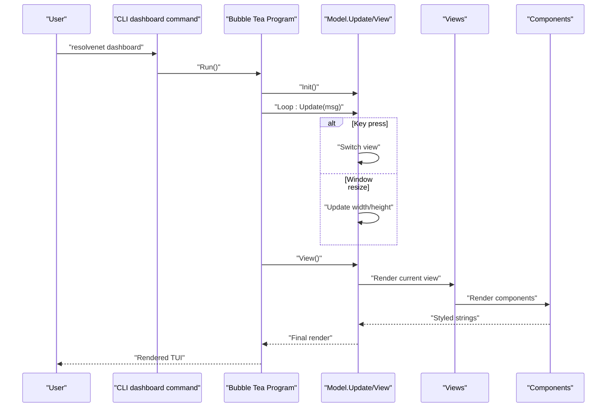

**Diagram sources**
- [dashboard.go:9-21](file://internal/cli/dashboard.go#L9-L21)
- [app.go:35-94](file://internal/tui/app.go#L35-L94)
- [dashboard.go:3-16](file://internal/tui/views/dashboard.go#L3-L16)
- [agent_list.go:3-14](file://internal/tui/views/agent_list.go#L3-L14)
- [agent_detail.go:3-12](file://internal/tui/views/agent_detail.go#L3-L12)
- [log_viewer.go:3-16](file://internal/tui/views/log_viewer.go#L3-L16)
- [workflow_viewer.go:3-7](file://internal/tui/views/workflow_viewer.go#L3-L7)
- [table.go:3-21](file://internal/tui/components/table.go#L3-L21)
- [statusbar.go:12-21](file://internal/tui/components/statusbar.go#L12-L21)

## Detailed Component Analysis

### Application Loop and State Handling
- Initialization: No startup command is returned; the program starts immediately.
- Update:
  - Key messages switch the current view among dashboard, agents, workflows, logs.
  - Quit keys trigger a quit command.
  - Window size messages update terminal dimensions for responsive rendering.
- View:
  - Renders title, status line, current view content, and footer controls.
  - Uses Lip Gloss styles for consistent typography and spacing.

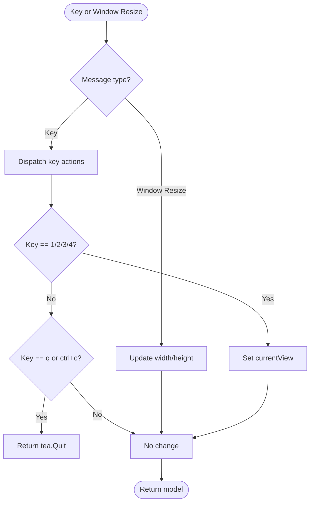

**Diagram sources**
- [app.go:40-63](file://internal/tui/app.go#L40-L63)

**Section sources**
- [app.go:35-94](file://internal/tui/app.go#L35-L94)

### Dashboard Overview View
- Purpose: Display system-wide metrics and status.
- Data model: Active agents, running workflows, loaded skills, and system status.
- Rendering: Uses theme styles for consistent presentation.

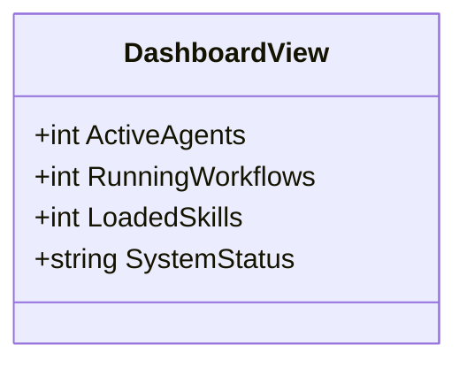

**Diagram sources**
- [dashboard.go:3-16](file://internal/tui/views/dashboard.go#L3-L16)

**Section sources**
- [dashboard.go:3-16](file://internal/tui/views/dashboard.go#L3-L16)
- [theme.go:18-46](file://internal/tui/styles/theme.go#L18-L46)

### Agent List Management
- Purpose: Present a tabular list of agents with ID, name, type, and status.
- Data model: Slice of AgentItem entries.
- Rendering: Intended to be paired with the Table component for cursor navigation and scrolling.

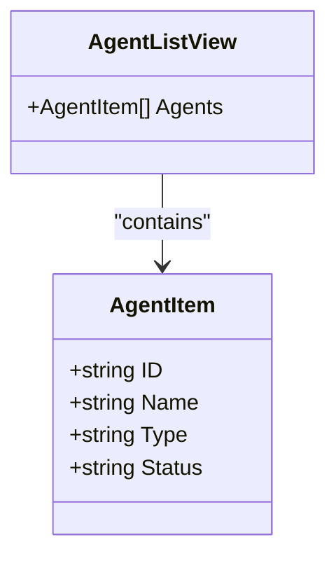

**Diagram sources**
- [agent_list.go:3-14](file://internal/tui/views/agent_list.go#L3-L14)

**Section sources**
- [agent_list.go:3-14](file://internal/tui/views/agent_list.go#L3-L14)
- [table.go:3-21](file://internal/tui/components/table.go#L3-L21)

### Agent Detail Inspection
- Purpose: Show detailed information for a selected agent.
- Data model: Agent identity, type, status, model, skills, and execution count.

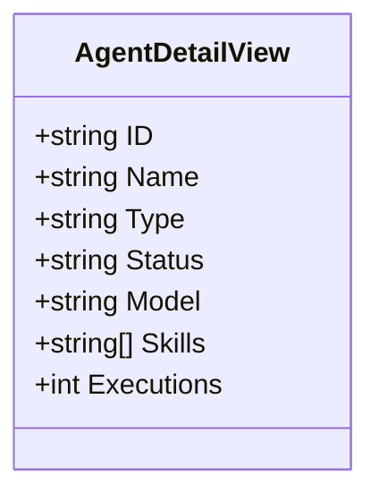

**Diagram sources**
- [agent_detail.go:3-12](file://internal/tui/views/agent_detail.go#L3-L12)

**Section sources**
- [agent_detail.go:3-12](file://internal/tui/views/agent_detail.go#L3-L12)

### Log Viewer with Real-Time Updates
- Purpose: Stream and follow log lines with configurable limits.
- Data model: Lines buffer, maximum line count, and follow toggle.
- Rendering: Intended to scroll to latest entries when following.

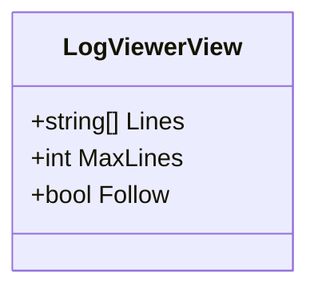

**Diagram sources**
- [log_viewer.go:3-16](file://internal/tui/views/log_viewer.go#L3-L16)

**Section sources**
- [log_viewer.go:3-16](file://internal/tui/views/log_viewer.go#L3-L16)

### Workflow Execution Visualization
- Purpose: Visualize an FTA-style workflow tree for a given workflow ID.
- Data model: Workflow identifier and tree data representation.

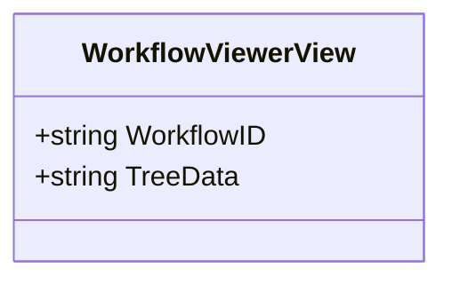

**Diagram sources**
- [workflow_viewer.go:3-7](file://internal/tui/views/workflow_viewer.go#L3-L7)

**Section sources**
- [workflow_viewer.go:3-7](file://internal/tui/views/workflow_viewer.go#L3-L7)

### Custom UI Components

#### Table Component
- Purpose: Generic table with headers, rows, and cursor position.
- Operations: Add rows, maintain cursor index.

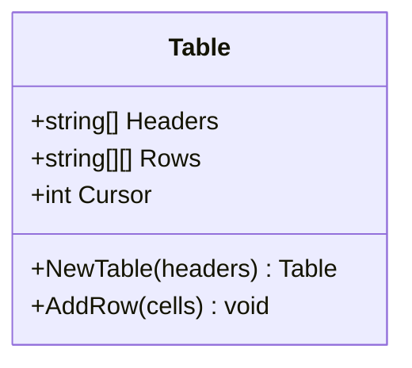

**Diagram sources**
- [table.go:3-21](file://internal/tui/components/table.go#L3-L21)

**Section sources**
- [table.go:3-21](file://internal/tui/components/table.go#L3-L21)

#### Status Bar Component
- Purpose: Render a styled status bar at the bottom of the terminal.
- Styling: Uses theme colors and width-aware padding.

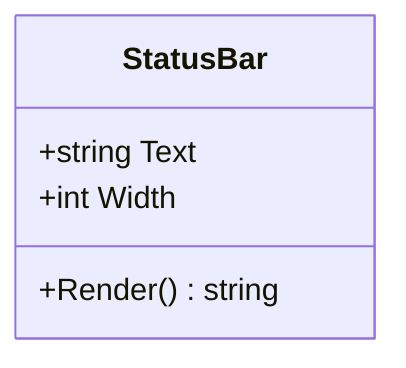

**Diagram sources**
- [statusbar.go:12-21](file://internal/tui/components/statusbar.go#L12-L21)

**Section sources**
- [statusbar.go:12-21](file://internal/tui/components/statusbar.go#L12-L21)
- [theme.go:7-46](file://internal/tui/styles/theme.go#L7-L46)

#### Theme System
- Purpose: Centralize color tokens and Lip Gloss styles for consistent UI.
- Includes primary/secondary colors, status styles, and layout borders.

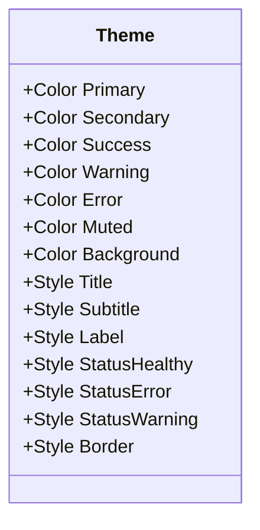

**Diagram sources**
- [theme.go:7-46](file://internal/tui/styles/theme.go#L7-L46)

**Section sources**
- [theme.go:7-46](file://internal/tui/styles/theme.go#L7-L46)

### Keyboard Navigation Patterns
- View switching: Press 1, 2, 3, 4 to navigate between dashboard, agents, workflows, logs.
- Quit: Press q or Ctrl+C to exit the application.
- Responsive sizing: Window resize updates width and height for adaptive layouts.

**Section sources**
- [app.go:40-63](file://internal/tui/app.go#L40-L63)

### Mouse Interaction Support
- Current implementation does not enable mouse handling in the Bubble Tea program initialization.
- To add mouse support, configure the program with mouse settings and handle mouse messages in Update.

**Section sources**
- [app.go:96-101](file://internal/tui/app.go#L96-L101)

### Accessibility Features for Screen Readers
- The current implementation focuses on styled text rendering and does not include explicit ARIA attributes or focus management.
- Recommendations:
  - Announce view transitions and status changes.
  - Provide focus indicators for interactive elements.
  - Use semantic separators and headings for readability.

[No sources needed since this section provides general guidance]

## Dependency Analysis
- CLI depends on the TUI module to launch the interactive dashboard.
- The TUI model depends on view models, components, and theme for rendering.
- There is no runtime dependency on platform services within the TUI module; data would be fetched from the platform via APIs/services elsewhere in the codebase.

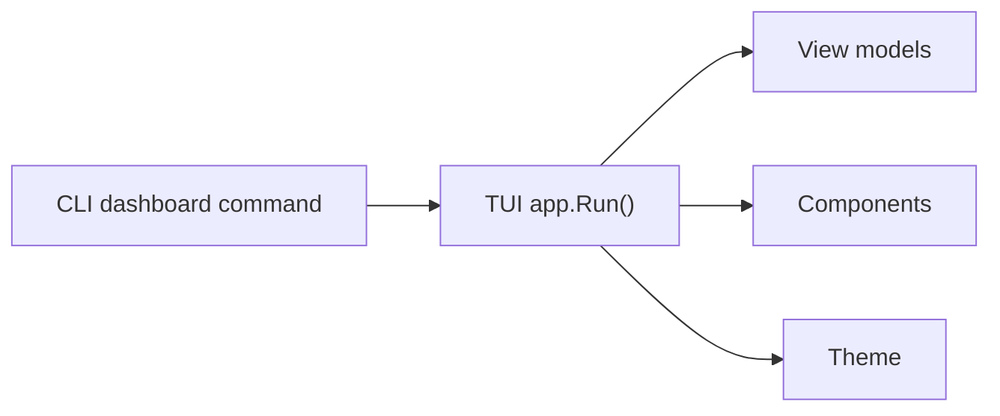

**Diagram sources**
- [dashboard.go:9-21](file://internal/cli/dashboard.go#L9-L21)
- [app.go:96-101](file://internal/tui/app.go#L96-L101)
- [dashboard.go:3-16](file://internal/tui/views/dashboard.go#L3-L16)
- [agent_list.go:3-14](file://internal/tui/views/agent_list.go#L3-L14)
- [agent_detail.go:3-12](file://internal/tui/views/agent_detail.go#L3-L12)
- [log_viewer.go:3-16](file://internal/tui/views/log_viewer.go#L3-L16)
- [workflow_viewer.go:3-7](file://internal/tui/views/workflow_viewer.go#L3-L7)
- [table.go:3-21](file://internal/tui/components/table.go#L3-L21)
- [statusbar.go:12-21](file://internal/tui/components/statusbar.go#L12-L21)
- [theme.go:7-46](file://internal/tui/styles/theme.go#L7-L46)

**Section sources**
- [root.go:19-52](file://internal/cli/root.go#L19-L52)
- [dashboard.go:9-21](file://internal/cli/dashboard.go#L9-L21)
- [app.go:96-101](file://internal/tui/app.go#L96-L101)

## Performance Considerations
- Large datasets:
  - Use bounded buffers for logs and tables (as suggested by LogViewerView.MaxLines).
  - Paginate or virtualize long lists; avoid re-rendering unchanged rows.
- Rendering:
  - Minimize string concatenation in View; precompute static parts.
  - Use Lip Gloss styles efficiently; cache computed styles when possible.
- Message throughput:
  - Debounce frequent updates (e.g., terminal resize) to reduce redraw frequency.
- Memory:
  - Truncate history arrays when exceeding thresholds.
  - Avoid retaining references to previous view data after switching.

[No sources needed since this section provides general guidance]

## Troubleshooting Guide
- TUI does not start:
  - Verify the CLI dashboard command is registered and invoked.
  - Ensure the TUI Run function is called from the CLI handler.
- Keys not responding:
  - Confirm key strings match the expected values in Update.
  - Check terminal compatibility and locale settings.
- Incorrect sizing:
  - Ensure WindowSizeMsg is handled and width/height are updated.
- Visual artifacts:
  - Validate theme colors and Lip Gloss styles.
  - Test with different terminal emulators and color depths.

**Section sources**
- [root.go:19-52](file://internal/cli/root.go#L19-L52)
- [dashboard.go:9-21](file://internal/cli/dashboard.go#L9-L21)
- [app.go:40-63](file://internal/tui/app.go#L40-L63)
- [app.go:96-101](file://internal/tui/app.go#L96-L101)
- [theme.go:7-46](file://internal/tui/styles/theme.go#L7-L46)

## Conclusion
The TUI dashboard leverages Bubble Tea for a responsive, keyboard-driven terminal interface. The modular design separates state, views, components, and theme, enabling maintainable growth. While the current implementation provides foundational building blocks, extending it with platform service integration, mouse support, and accessibility features will deliver a production-ready terminal experience.

[No sources needed since this section summarizes without analyzing specific files]

## Appendices

### Terminal Compatibility Considerations
- Alternate screen buffer: Enabled via program configuration to prevent cluttering the shell history.
- Color support: Use theme-defined colors for consistent rendering across terminals.
- Font and emoji: Some terminals may require enabling Unicode and emoji support.

**Section sources**
- [app.go:96-101](file://internal/tui/app.go#L96-L101)
- [theme.go:7-46](file://internal/tui/styles/theme.go#L7-L46)

### Debugging Approaches
- Logging: Add structured logs during Update and View to trace state changes.
- Dry-run rendering: Print computed strings to verify layout logic.
- Isolate components: Temporarily replace complex views with minimal placeholders.

[No sources needed since this section provides general guidance]

### Component Testing Strategies
- Unit tests for view models and components:
  - Validate data structures and rendering outputs.
- Integration tests for the model:
  - Simulate key and window resize messages; assert state transitions and rendering segments.
- End-to-end tests:
  - Use Bubble Tea’s test harness to drive the program and capture rendered output.

[No sources needed since this section provides general guidance]