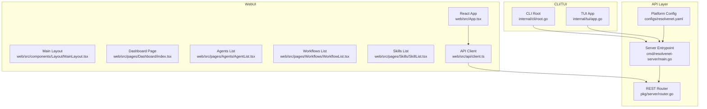
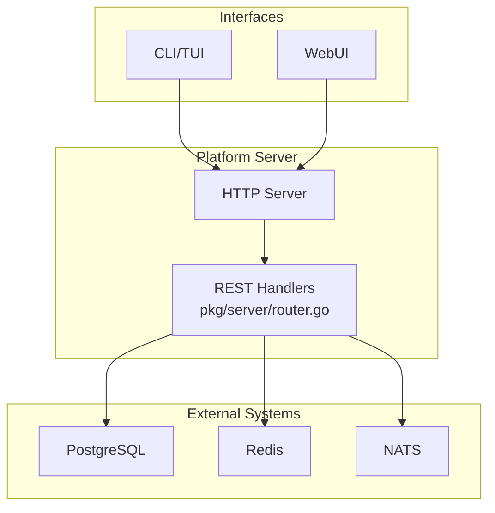
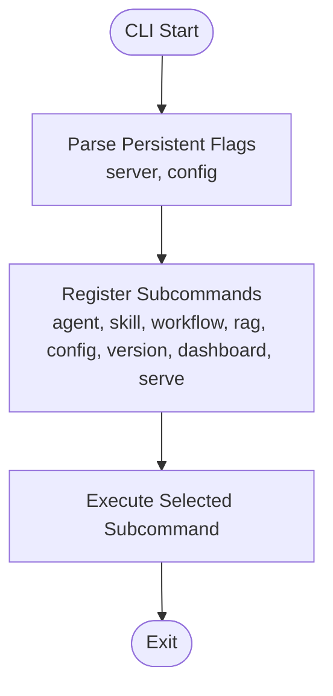
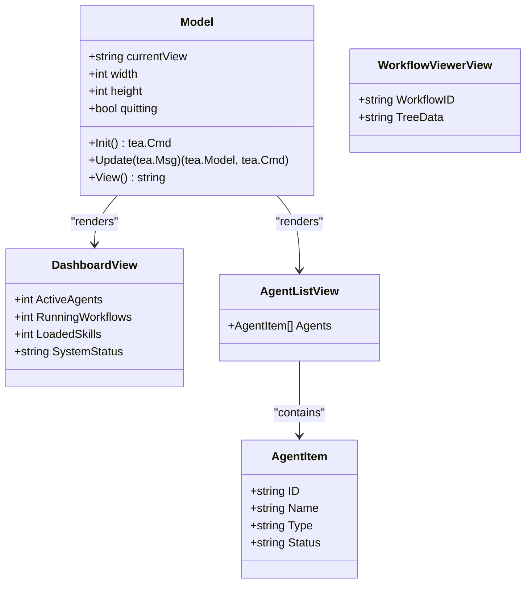
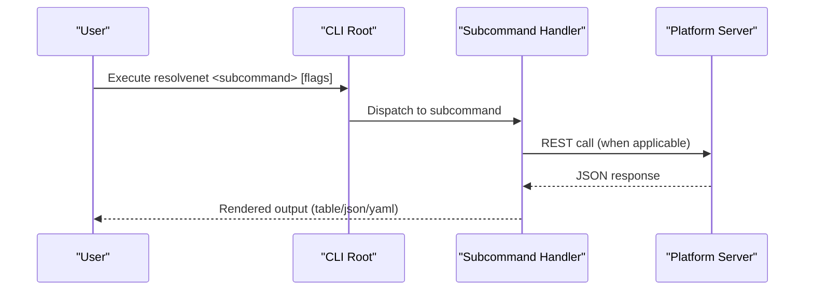
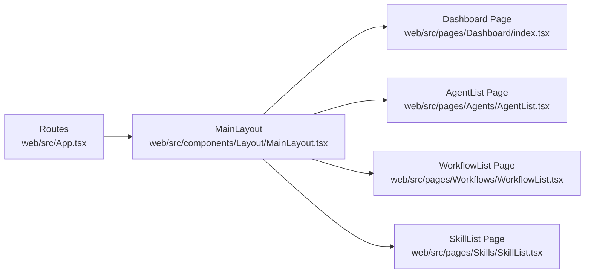
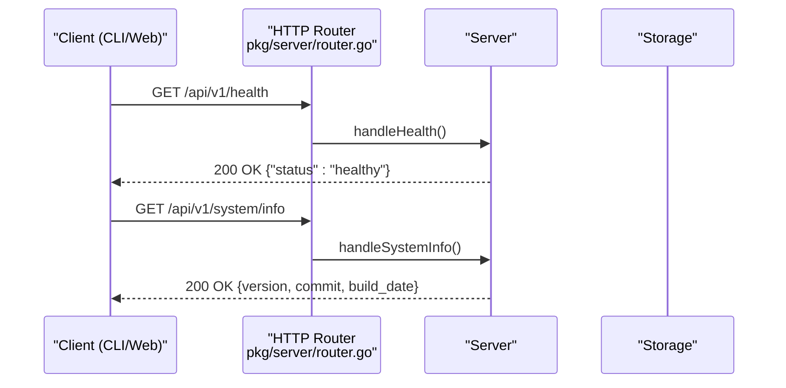
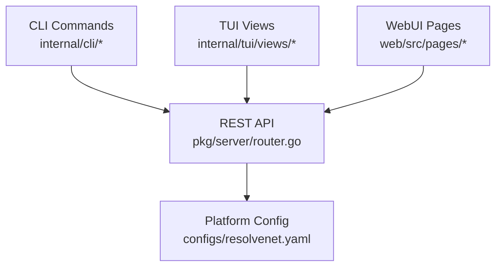
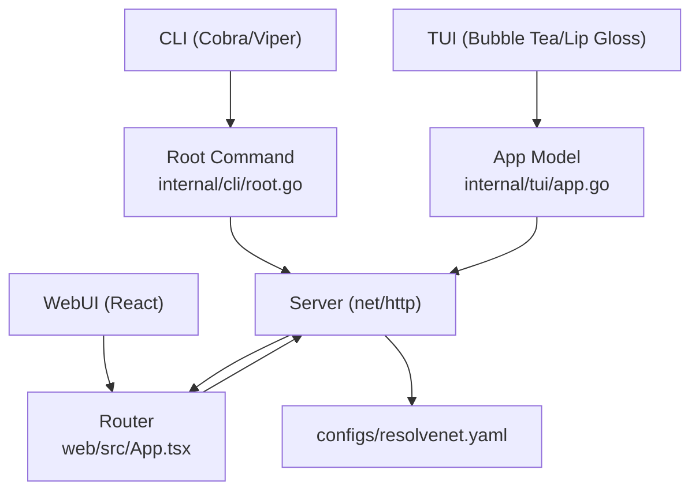

# Multi-Modal Interfaces

<cite>
**Referenced Files in This Document**
- [main.go](file://cmd/resolvenet-cli/main.go)
- [root.go](file://internal/cli/root.go)
- [dashboard.go](file://internal/cli/dashboard.go)
- [serve.go](file://internal/cli/serve.go)
- [agent_list.go](file://internal/cli/agent/list.go)
- [workflow_list.go](file://internal/cli/workflow/list.go)
- [skill_list.go](file://internal/cli/skill/list.go)
- [app.go](file://internal/tui/app.go)
- [dashboard.go](file://internal/tui/views/dashboard.go)
- [agent_list.go](file://internal/tui/views/agent_list.go)
- [workflow_viewer.go](file://internal/tui/views/workflow_viewer.go)
- [main.go](file://cmd/resolvenet-server/main.go)
- [router.go](file://pkg/server/router.go)
- [client.ts](file://web/src/api/client.ts)
- [App.tsx](file://web/src/App.tsx)
- [MainLayout.tsx](file://web/src/components/Layout/MainLayout.tsx)
- [index.tsx](file://web/src/pages/Dashboard/index.tsx)
- [AgentList.tsx](file://web/src/pages/Agents/AgentList.tsx)
- [WorkflowList.tsx](file://web/src/pages/Workflows/WorkflowList.tsx)
- [SkillList.tsx](file://web/src/pages/Skills/SkillList.tsx)
- [resolvenet.yaml](file://configs/resolvenet.yaml)
</cite>

## Table of Contents
1. [Introduction](#introduction)
2. [Project Structure](#project-structure)
3. [Core Components](#core-components)
4. [Architecture Overview](#architecture-overview)
5. [Detailed Component Analysis](#detailed-component-analysis)
6. [Dependency Analysis](#dependency-analysis)
7. [Performance Considerations](#performance-considerations)
8. [Troubleshooting Guide](#troubleshooting-guide)
9. [Conclusion](#conclusion)
10. [Appendices](#appendices)

## Introduction
This document describes ResolveNet’s multi-modal user interfaces: CLI/TUI, WebUI, and the API layer. It explains command structure and interactive terminal dashboards, the React-based WebUI with dashboard, agent management, FTA workflow editor, skill registry, and workflow management, and the API layer with REST endpoints, health checks, and future WebSocket streaming. It also covers UX design principles, navigation patterns, integration between interfaces and backend services, accessibility and responsive design considerations, terminal compatibility, troubleshooting, and performance optimization.

## Project Structure
ResolveNet organizes its interfaces across three primary modes:
- CLI/TUI: Implemented with Cobra for CLI commands and Bubble Tea for TUI, located under cmd/resolvenet-cli and internal/cli, internal/tui.
- WebUI: Built with React and TypeScript, routed via react-router-dom, under web/src.
- API Layer: Exposed via Go net/http with REST endpoints, under pkg/server.

**Diagram sources**
- [root.go:19-52](file://internal/cli/root.go#L19-L52)
- [app.go:20-33](file://internal/tui/app.go#L20-L33)
- [App.tsx:1-38](file://web/src/App.tsx#L1-L38)
- [MainLayout.tsx:9-21](file://web/src/components/Layout/MainLayout.tsx#L9-L21)
- [index.tsx:10-43](file://web/src/pages/Dashboard/index.tsx#L10-L43)
- [AgentList.tsx:4-40](file://web/src/pages/Agents/AgentList.tsx#L4-L40)
- [WorkflowList.tsx:4-22](file://web/src/pages/Workflows/WorkflowList.tsx#L4-L22)
- [SkillList.tsx:1-11](file://web/src/pages/Skills/SkillList.tsx#L1-L11)
- [client.ts:1-85](file://web/src/api/client.ts#L1-L85)
- [main.go:16-55](file://cmd/resolvenet-server/main.go#L16-L55)
- [router.go:11-55](file://pkg/server/router.go#L11-L55)
- [resolvenet.yaml:3-27](file://configs/resolvenet.yaml#L3-L27)

**Section sources**
- [main.go:9-13](file://cmd/resolvenet-cli/main.go#L9-L13)
- [root.go:19-52](file://internal/cli/root.go#L19-L52)
- [app.go:20-33](file://internal/tui/app.go#L20-L33)
- [App.tsx:17-37](file://web/src/App.tsx#L17-L37)
- [MainLayout.tsx:9-21](file://web/src/components/Layout/MainLayout.tsx#L9-L21)
- [client.ts:1-85](file://web/src/api/client.ts#L1-L85)
- [main.go:16-55](file://cmd/resolvenet-server/main.go#L16-L55)
- [router.go:11-55](file://pkg/server/router.go#L11-L55)
- [resolvenet.yaml:3-27](file://configs/resolvenet.yaml#L3-L27)

## Core Components
- CLI/TUI
  - CLI entrypoint delegates to Cobra root command with persistent flags and subcommands for agent, skill, workflow, RAG, config, version, dashboard, and serve.
  - TUI app defines a Model with keyboard navigation and view switching, with placeholder views for dashboard, agents, workflows, and logs.
- WebUI
  - React app with routes for dashboard, agents, skills, workflows, RAG, playground, and settings, wrapped in a main layout with sidebar and header.
  - API client encapsulates REST calls to the platform API.
- API Layer
  - REST endpoints for health, system info, agents, skills, workflows, RAG collections, models, and config.
  - Health endpoint returns a simple status payload.

**Section sources**
- [root.go:19-52](file://internal/cli/root.go#L19-L52)
- [dashboard.go:9-21](file://internal/cli/dashboard.go#L9-L21)
- [serve.go:9-21](file://internal/cli/serve.go#L9-L21)
- [agent_list.go:9-28](file://internal/cli/agent/list.go#L9-L28)
- [workflow_list.go:9-22](file://internal/cli/workflow/list.go#L9-L22)
- [skill_list.go:9-22](file://internal/cli/skill/list.go#L9-L22)
- [app.go:20-33](file://internal/tui/app.go#L20-L33)
- [dashboard.go:4-16](file://internal/tui/views/dashboard.go#L4-L16)
- [agent_list.go:4-14](file://internal/tui/views/agent_list.go#L4-L14)
- [workflow_viewer.go:4-7](file://internal/tui/views/workflow_viewer.go#L4-L7)
- [App.tsx:17-37](file://web/src/App.tsx#L17-L37)
- [MainLayout.tsx:9-21](file://web/src/components/Layout/MainLayout.tsx#L9-L21)
- [client.ts:20-48](file://web/src/api/client.ts#L20-L48)
- [router.go:11-55](file://pkg/server/router.go#L11-L55)

## Architecture Overview
ResolveNet’s interfaces share a unified backend:
- CLI/TUI communicate with the platform server via REST endpoints.
- WebUI communicates with the same REST endpoints.
- The server exposes health and system info endpoints and stubs for resource management.

**Diagram sources**
- [router.go:11-55](file://pkg/server/router.go#L11-L55)
- [resolvenet.yaml:7-27](file://configs/resolvenet.yaml#L7-L27)

## Detailed Component Analysis

### CLI Command Structure
The CLI root command initializes configuration and registers subcommands. Persistent flags include server address and config file location. Subcommands include agent, skill, workflow, RAG, config, version, dashboard, and serve.

**Diagram sources**
- [root.go:33-52](file://internal/cli/root.go#L33-L52)

**Section sources**
- [root.go:19-52](file://internal/cli/root.go#L19-L52)

### Interactive Dashboard (Bubble Tea TUI)
The TUI app defines a Model with current view, width, height, and quitting state. Keyboard controls switch views (dashboard, agents, workflows, logs) and quit the program. Views render placeholder content with a styled header and status bar.

**Diagram sources**
- [app.go:21-33](file://internal/tui/app.go#L21-L33)
- [dashboard.go:4-16](file://internal/tui/views/dashboard.go#L4-L16)
- [agent_list.go:4-14](file://internal/tui/views/agent_list.go#L4-L14)
- [workflow_viewer.go:4-7](file://internal/tui/views/workflow_viewer.go#L4-L7)

**Section sources**
- [app.go:20-94](file://internal/tui/app.go#L20-L94)
- [dashboard.go:4-16](file://internal/tui/views/dashboard.go#L4-L16)
- [agent_list.go:4-14](file://internal/tui/views/agent_list.go#L4-L14)
- [workflow_viewer.go:4-7](file://internal/tui/views/workflow_viewer.go#L4-L7)

### Terminal-Based Management Capabilities (CLI)
CLI subcommands provide management actions:
- Agent list supports filtering by type/status and output formats.
- Workflow list and Skill list provide listing capabilities.
- Serve launches platform services locally (placeholder).
- Dashboard opens the TUI dashboard (placeholder).

**Diagram sources**
- [root.go:44-51](file://internal/cli/root.go#L44-L51)
- [agent_list.go:9-28](file://internal/cli/agent/list.go#L9-L28)
- [workflow_list.go:9-22](file://internal/cli/workflow/list.go#L9-L22)
- [skill_list.go:9-22](file://internal/cli/skill/list.go#L9-L22)
- [serve.go:9-21](file://internal/cli/serve.go#L9-L21)
- [dashboard.go:9-21](file://internal/cli/dashboard.go#L9-L21)

**Section sources**
- [agent_list.go:9-28](file://internal/cli/agent/list.go#L9-L28)
- [workflow_list.go:9-22](file://internal/cli/workflow/list.go#L9-L22)
- [skill_list.go:9-22](file://internal/cli/skill/list.go#L9-L22)
- [serve.go:9-21](file://internal/cli/serve.go#L9-L21)
- [dashboard.go:9-21](file://internal/cli/dashboard.go#L9-L21)

### WebUI Navigation and Pages
The WebUI uses react-router-dom for navigation. The main layout includes a sidebar and header. Pages include:
- Dashboard: system stats cards and recent activity placeholders.
- Agents: list with create action.
- Workflows: list with designer action.
- Skills: list with installation guidance.
- RAG: documents and collections.
- Playground and Settings.

**Diagram sources**
- [App.tsx:17-37](file://web/src/App.tsx#L17-L37)
- [MainLayout.tsx:9-21](file://web/src/components/Layout/MainLayout.tsx#L9-L21)
- [index.tsx:10-43](file://web/src/pages/Dashboard/index.tsx#L10-L43)
- [AgentList.tsx:4-40](file://web/src/pages/Agents/AgentList.tsx#L4-L40)
- [WorkflowList.tsx:4-22](file://web/src/pages/Workflows/WorkflowList.tsx#L4-L22)
- [SkillList.tsx:1-11](file://web/src/pages/Skills/SkillList.tsx#L1-L11)

**Section sources**
- [App.tsx:17-37](file://web/src/App.tsx#L17-L37)
- [MainLayout.tsx:9-21](file://web/src/components/Layout/MainLayout.tsx#L9-L21)
- [index.tsx:10-43](file://web/src/pages/Dashboard/index.tsx#L10-L43)
- [AgentList.tsx:4-40](file://web/src/pages/Agents/AgentList.tsx#L4-L40)
- [WorkflowList.tsx:4-22](file://web/src/pages/Workflows/WorkflowList.tsx#L4-L22)
- [SkillList.tsx:1-11](file://web/src/pages/Skills/SkillList.tsx#L1-L11)

### API Layer: REST Endpoints and Health Checks
The server registers REST endpoints for health, system info, agents, skills, workflows, RAG collections, models, and config. Health returns a simple status payload.

**Diagram sources**
- [router.go:11-67](file://pkg/server/router.go#L11-L67)

**Section sources**
- [router.go:11-67](file://pkg/server/router.go#L11-L67)

### Integration Patterns Between Interfaces and Backend
- CLI/TUI: Issue REST requests to the platform server; TUI currently prints placeholder messages while CLI subcommands are placeholders awaiting implementation.
- WebUI: Uses the API client to call REST endpoints and renders page components.
- Server: Reads configuration from resolvenet.yaml for addresses and services.

**Diagram sources**
- [root.go:44-51](file://internal/cli/root.go#L44-L51)
- [router.go:11-55](file://pkg/server/router.go#L11-L55)
- [client.ts:20-48](file://web/src/api/client.ts#L20-L48)
- [resolvenet.yaml:3-27](file://configs/resolvenet.yaml#L3-L27)

**Section sources**
- [root.go:44-51](file://internal/cli/root.go#L44-L51)
- [router.go:11-55](file://pkg/server/router.go#L11-L55)
- [client.ts:20-48](file://web/src/api/client.ts#L20-L48)
- [resolvenet.yaml:3-27](file://configs/resolvenet.yaml#L3-L27)

### User Experience Design Principles and Navigation Patterns
- Consistency: All interfaces expose similar resources (agents, skills, workflows, RAG) with consistent naming and navigation patterns.
- Progressive Disclosure: CLI provides concise output formats; WebUI offers detailed pages; TUI focuses on essential controls.
- Accessibility: WebUI uses semantic HTML and Tailwind classes; ensure focus management and keyboard navigation in TUI.
- Responsive Design: WebUI employs responsive grid layouts; verify rendering on small terminals for TUI.

[No sources needed since this section provides general guidance]

### Examples of Common Workflows Across Interfaces
- Launch local platform services
  - CLI: Use the serve command (placeholder) to start services locally; production deployments use the server binary.
  - Server: Loads configuration and starts HTTP server with signal handling for graceful shutdown.
- List agents
  - CLI: agent list with filters and output formats.
  - WebUI: Navigate to Agents page; view list and create actions.
  - TUI: Switch to agents view (placeholder).
- List workflows
  - CLI: workflow list (placeholder).
  - WebUI: Navigate to Workflows page; use designer action.
  - TUI: Switch to workflows view (placeholder).
- List skills
  - CLI: skill list (placeholder).
  - WebUI: Navigate to Skills page; install via CLI per guidance.
  - TUI: Placeholder view.

**Section sources**
- [serve.go:9-21](file://internal/cli/serve.go#L9-L21)
- [main.go:16-55](file://cmd/resolvenet-server/main.go#L16-L55)
- [agent_list.go:9-28](file://internal/cli/agent/list.go#L9-L28)
- [AgentList.tsx:4-40](file://web/src/pages/Agents/AgentList.tsx#L4-L40)
- [workflow_list.go:9-22](file://internal/cli/workflow/list.go#L9-L22)
- [WorkflowList.tsx:4-22](file://web/src/pages/Workflows/WorkflowList.tsx#L4-L22)
- [skill_list.go:9-22](file://internal/cli/skill/list.go#L9-L22)
- [SkillList.tsx:1-11](file://web/src/pages/Skills/SkillList.tsx#L1-L11)
- [app.go:44-56](file://internal/tui/app.go#L44-L56)

## Dependency Analysis
- CLI depends on Cobra and Viper for configuration and command parsing.
- TUI depends on Bubble Tea and Lip Gloss for rendering and styling.
- WebUI depends on React, react-router-dom, and Tailwind CSS.
- Server depends on net/http and exposes REST endpoints; configuration is loaded from resolvenet.yaml.

**Diagram sources**
- [root.go:3-15](file://internal/cli/root.go#L3-L15)
- [app.go:3-8](file://internal/tui/app.go#L3-L8)
- [App.tsx:1-3](file://web/src/App.tsx#L1-L3)
- [main.go:3-14](file://cmd/resolvenet-server/main.go#L3-L14)
- [resolvenet.yaml:3-27](file://configs/resolvenet.yaml#L3-L27)

**Section sources**
- [root.go:3-15](file://internal/cli/root.go#L3-L15)
- [app.go:3-8](file://internal/tui/app.go#L3-L8)
- [App.tsx:1-3](file://web/src/App.tsx#L1-L3)
- [main.go:3-14](file://cmd/resolvenet-server/main.go#L3-L14)
- [resolvenet.yaml:3-27](file://configs/resolvenet.yaml#L3-L27)

## Performance Considerations
- CLI output formats: Prefer JSON/YAML for machine consumption; use table for human readability.
- WebUI pagination and virtualization: Implement for large lists (agents, workflows, skills).
- TUI rendering: Minimize redraws; batch updates and throttle resize events.
- API caching: Cache static metadata (skills, models) where appropriate.
- Network efficiency: Use efficient JSON marshalling/unmarshalling; avoid redundant requests.

[No sources needed since this section provides general guidance]

## Troubleshooting Guide
- CLI cannot connect to server
  - Verify server flag and configuration file path; confirm platform server is reachable.
- WebUI health check fails
  - Call the health endpoint and inspect response; ensure server is running and listening on configured address.
- TUI does not render properly
  - Resize terminal window; ensure UTF-8 locale; verify terminal supports alternate screen buffer.
- Server startup errors
  - Check configuration loading; review logs for configuration parse errors; validate database/redis/nats connectivity.

**Section sources**
- [root.go:36-41](file://internal/cli/root.go#L36-L41)
- [router.go:57-67](file://pkg/server/router.go#L57-L67)
- [app.go:57-60](file://internal/tui/app.go#L57-L60)
- [main.go:24-28](file://cmd/resolvenet-server/main.go#L24-L28)

## Conclusion
ResolveNet’s multi-modal interfaces provide complementary ways to manage agents, skills, workflows, and RAG resources. The CLI/TUI offer efficient terminal-based control, the WebUI delivers a modern browser experience, and the API layer ensures consistent access patterns. As implementation progresses, integrating CLI/TUI with REST endpoints, enhancing WebUI interactivity, and preparing for WebSocket streaming will further strengthen the platform’s usability and developer experience.

## Appendices
- Configuration locations and defaults
  - CLI configuration path resolution and environment variable binding.
  - Platform server configuration for HTTP/GRPC addresses, database, Redis, NATS, runtime, gateway, and telemetry.

**Section sources**
- [root.go:54-71](file://internal/cli/root.go#L54-L71)
- [resolvenet.yaml:3-34](file://configs/resolvenet.yaml#L3-L34)