# Agent Management Interface

<cite>
**Referenced Files in This Document**
- [AgentList.tsx](file://web/src/pages/Agents/AgentList.tsx)
- [AgentDetail.tsx](file://web/src/pages/Agents/AgentDetail.tsx)
- [AgentCreate.tsx](file://web/src/pages/Agents/AgentCreate.tsx)
- [useAgents.ts](file://web/src/hooks/useAgents.ts)
- [client.ts](file://web/src/api/client.ts)
- [router.go](file://pkg/server/router.go)
- [server.go](file://pkg/server/server.go)
- [agent.proto](file://api/proto/resolvenet/v1/agent.proto)
- [agent.go](file://pkg/registry/agent.go)
- [agent_list.go](file://internal/tui/views/agent_list.go)
- [agent_detail.go](file://internal/tui/views/agent_detail.go)
- [app.go](file://internal/tui/app.go)
- [create.go](file://internal/cli/agent/create.go)
- [list.go](file://internal/cli/agent/list.go)
</cite>

## Table of Contents
1. [Introduction](#introduction)
2. [Project Structure](#project-structure)
3. [Core Components](#core-components)
4. [Architecture Overview](#architecture-overview)
5. [Detailed Component Analysis](#detailed-component-analysis)
6. [Dependency Analysis](#dependency-analysis)
7. [Performance Considerations](#performance-considerations)
8. [Troubleshooting Guide](#troubleshooting-guide)
9. [Conclusion](#conclusion)
10. [Appendices](#appendices)

## Introduction
This document describes the agent management interface system, covering the frontend pages for listing, creating, and viewing agents, the backend REST/gRPC APIs, and the state management patterns used. It explains how the UI integrates with the backend agent API, outlines current capabilities and gaps, and provides guidance for implementing filtering, sorting, bulk operations, real-time updates, and execution monitoring.

## Project Structure
The agent management interface spans three primary areas:
- Frontend (React + TanStack Query): Pages for listing, creating, and viewing agents; API client and hooks.
- Backend (Go): HTTP server with REST endpoints and gRPC service definitions for agent lifecycle and execution.
- CLI/TUI: Command-line and terminal interfaces for agent operations.

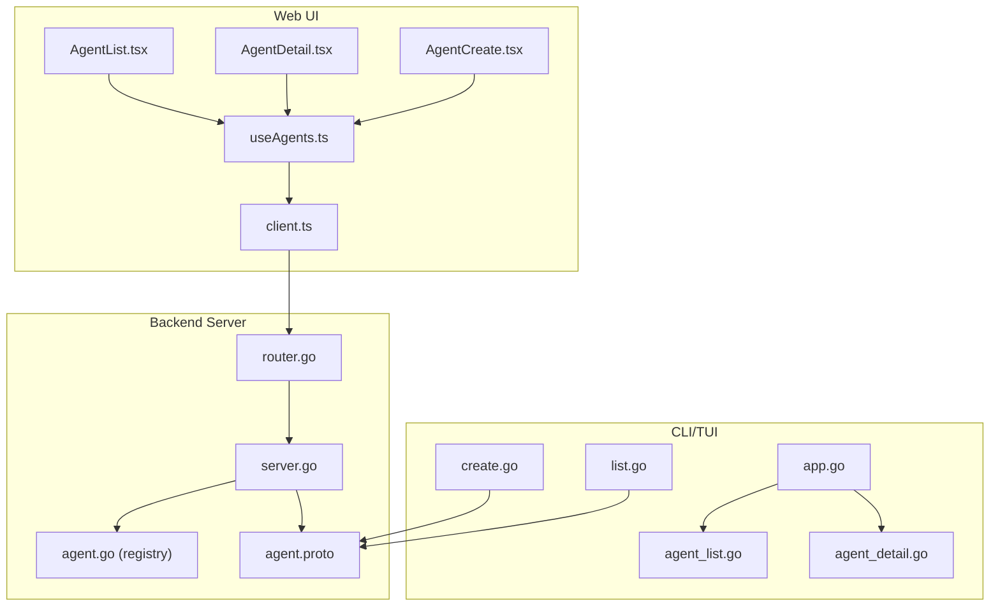

**Diagram sources**
- [AgentList.tsx:1-41](file://web/src/pages/Agents/AgentList.tsx#L1-L41)
- [AgentDetail.tsx:1-29](file://web/src/pages/Agents/AgentDetail.tsx#L1-L29)
- [AgentCreate.tsx:1-90](file://web/src/pages/Agents/AgentCreate.tsx#L1-L90)
- [useAgents.ts:1-29](file://web/src/hooks/useAgents.ts#L1-L29)
- [client.ts:1-85](file://web/src/api/client.ts#L1-L85)
- [router.go:1-183](file://pkg/server/router.go#L1-L183)
- [server.go:1-104](file://pkg/server/server.go#L1-L104)
- [agent.proto:1-177](file://api/proto/resolvenet/v1/agent.proto#L1-L177)
- [agent.go:1-103](file://pkg/registry/agent.go#L1-L103)
- [create.go:1-49](file://internal/cli/agent/create.go#L1-L49)
- [list.go:1-29](file://internal/cli/agent/list.go#L1-L29)
- [app.go:1-102](file://internal/tui/app.go#L1-L102)
- [agent_list.go:1-15](file://internal/tui/views/agent_list.go#L1-L15)
- [agent_detail.go:1-13](file://internal/tui/views/agent_detail.go#L1-L13)

**Section sources**
- [AgentList.tsx:1-41](file://web/src/pages/Agents/AgentList.tsx#L1-L41)
- [AgentDetail.tsx:1-29](file://web/src/pages/Agents/AgentDetail.tsx#L1-L29)
- [AgentCreate.tsx:1-90](file://web/src/pages/Agents/AgentCreate.tsx#L1-L90)
- [useAgents.ts:1-29](file://web/src/hooks/useAgents.ts#L1-L29)
- [client.ts:1-85](file://web/src/api/client.ts#L1-L85)
- [router.go:1-183](file://pkg/server/router.go#L1-L183)
- [server.go:1-104](file://pkg/server/server.go#L1-L104)
- [agent.proto:1-177](file://api/proto/resolvenet/v1/agent.proto#L1-L177)
- [agent.go:1-103](file://pkg/registry/agent.go#L1-L103)
- [create.go:1-49](file://internal/cli/agent/create.go#L1-L49)
- [list.go:1-29](file://internal/cli/agent/list.go#L1-L29)
- [app.go:1-102](file://internal/tui/app.go#L1-L102)
- [agent_list.go:1-15](file://internal/tui/views/agent_list.go#L1-L15)
- [agent_detail.go:1-13](file://internal/tui/views/agent_detail.go#L1-L13)

## Core Components
- Agent listing page: Displays agents in a table with action links to create and view details.
- Agent detail view: Shows configuration, status, and execution history placeholders.
- Agent creation form: Collects name, type, model, and optional system prompt; submits via API.
- API client and hooks: TanStack Query-based hooks for listing, fetching, and creating agents.
- Backend routes: REST endpoints for agent CRUD and execution; stubbed handlers.
- Protocol buffers: gRPC service definitions for agent lifecycle and streaming execution events.
- Registry: In-memory agent registry abstraction for storage and listing.
- CLI/TUI: Terminal-based agent operations and navigation.

**Section sources**
- [AgentList.tsx:1-41](file://web/src/pages/Agents/AgentList.tsx#L1-L41)
- [AgentDetail.tsx:1-29](file://web/src/pages/Agents/AgentDetail.tsx#L1-L29)
- [AgentCreate.tsx:1-90](file://web/src/pages/Agents/AgentCreate.tsx#L1-L90)
- [useAgents.ts:1-29](file://web/src/hooks/useAgents.ts#L1-L29)
- [client.ts:1-85](file://web/src/api/client.ts#L1-L85)
- [router.go:18-24](file://pkg/server/router.go#L18-L24)
- [agent.proto:11-29](file://api/proto/resolvenet/v1/agent.proto#L11-L29)
- [agent.go:21-28](file://pkg/registry/agent.go#L21-L28)

## Architecture Overview
The system follows a clear separation of concerns:
- Web UI uses React and TanStack Query to fetch and mutate agent data via REST endpoints.
- Backend exposes REST endpoints and gRPC services defined in protobuf.
- The server initializes both HTTP and gRPC servers and registers routes.
- The agent registry provides an abstraction for storing and retrieving agent definitions.

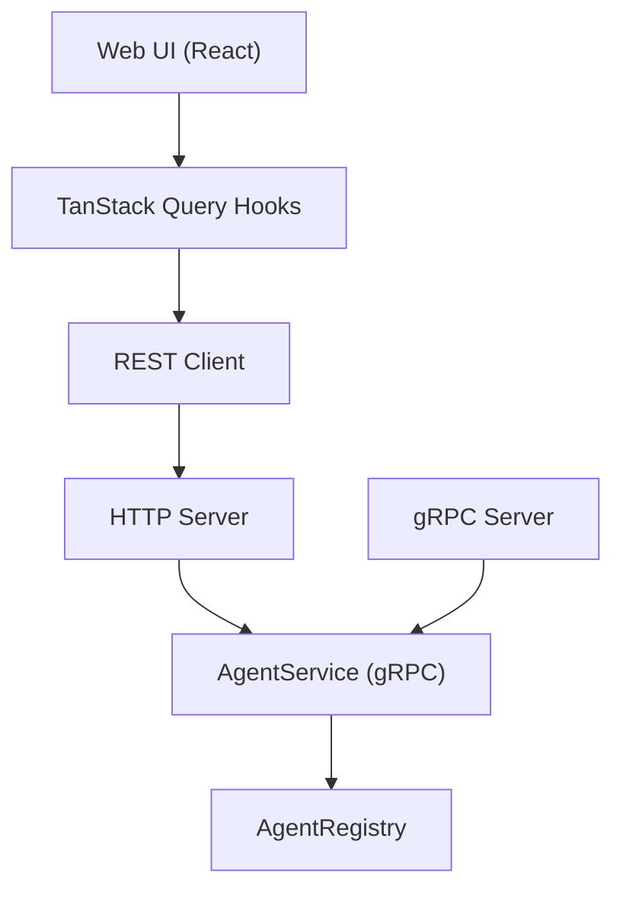

**Diagram sources**
- [client.ts:20-48](file://web/src/api/client.ts#L20-L48)
- [router.go:11-55](file://pkg/server/router.go#L11-L55)
- [server.go:27-52](file://pkg/server/server.go#L27-L52)
- [agent.proto:11-29](file://api/proto/resolvenet/v1/agent.proto#L11-L29)
- [agent.go:21-28](file://pkg/registry/agent.go#L21-L28)

## Detailed Component Analysis

### Agent Listing Page
- Purpose: Present agents in a tabular format with a link to create new agents.
- Features: Placeholder table with headers for Name, Type, Model, Status, and Actions.
- Navigation: Link to the creation page.

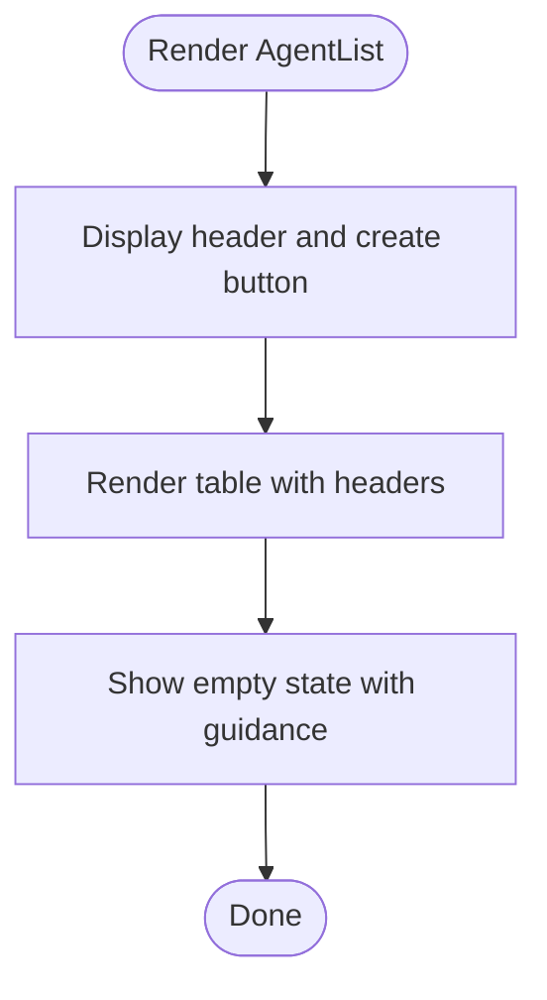

**Diagram sources**
- [AgentList.tsx:4-40](file://web/src/pages/Agents/AgentList.tsx#L4-L40)

**Section sources**
- [AgentList.tsx:1-41](file://web/src/pages/Agents/AgentList.tsx#L1-L41)

### Agent Detail View
- Purpose: Show agent configuration, status, and execution history.
- Current state: Displays placeholder content for configuration, status, and execution history.

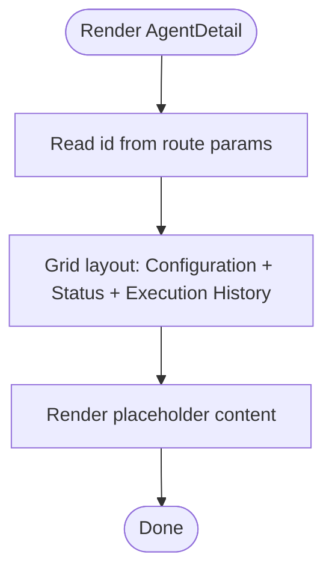

**Diagram sources**
- [AgentDetail.tsx:3-28](file://web/src/pages/Agents/AgentDetail.tsx#L3-L28)

**Section sources**
- [AgentDetail.tsx:1-29](file://web/src/pages/Agents/AgentDetail.tsx#L1-L29)

### Agent Creation Form
- Purpose: Allow users to define a new agent with name, type, model, and optional system prompt.
- State: Uses React local state for form fields.
- Submission: Prevents default submission and navigates to the agent list after submission (placeholder behavior).

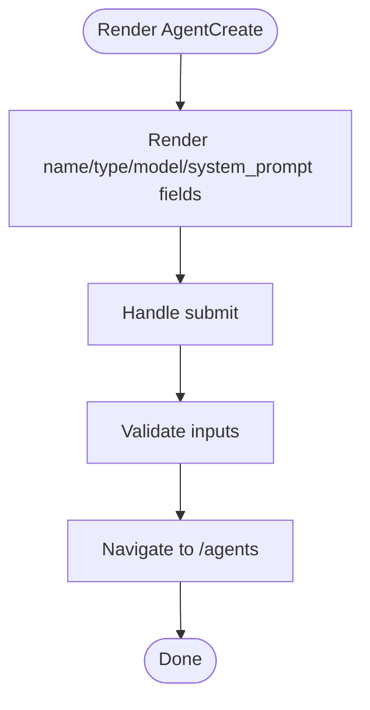

**Diagram sources**
- [AgentCreate.tsx:4-89](file://web/src/pages/Agents/AgentCreate.tsx#L4-L89)

**Section sources**
- [AgentCreate.tsx:1-90](file://web/src/pages/Agents/AgentCreate.tsx#L1-L90)

### API Client and State Management
- API client: Provides typed functions for listing, getting, creating, and deleting agents; handles errors by throwing on non-OK responses.
- Hooks:
  - useAgents: Fetches the list of agents.
  - useAgent: Fetches a single agent by ID.
  - useCreateAgent: Mutation to create an agent and invalidate queries to refresh the list.

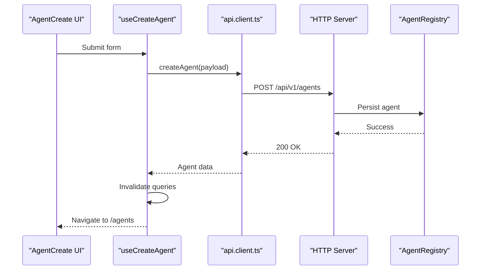

**Diagram sources**
- [AgentCreate.tsx:10-14](file://web/src/pages/Agents/AgentCreate.tsx#L10-L14)
- [useAgents.ts:19-28](file://web/src/hooks/useAgents.ts#L19-L28)
- [client.ts:27-30](file://web/src/api/client.ts#L27-L30)
- [router.go:75-77](file://pkg/server/router.go#L75-L77)
- [agent.go:43-53](file://pkg/registry/agent.go#L43-L53)

**Section sources**
- [client.ts:1-85](file://web/src/api/client.ts#L1-L85)
- [useAgents.ts:1-29](file://web/src/hooks/useAgents.ts#L1-L29)

### Backend REST Routes and Handlers
- Routes: GET/POST/GET/PUT/DELETE for agents and POST for agent execution.
- Handlers: Currently stubbed; return appropriate status codes and messages.

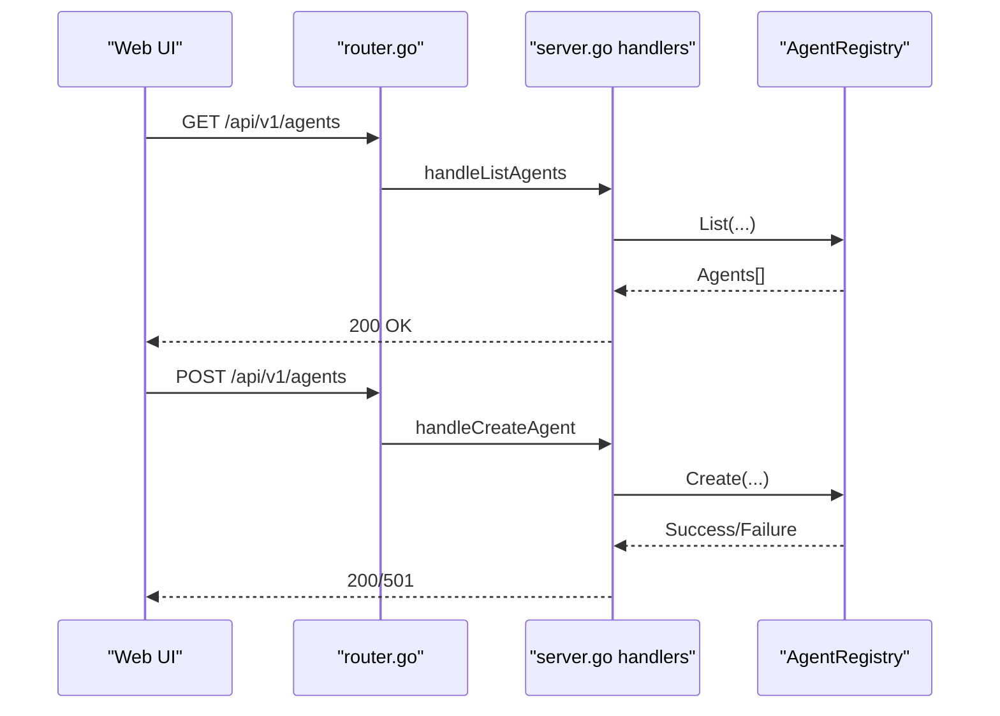

**Diagram sources**
- [router.go:18-24](file://pkg/server/router.go#L18-L24)
- [server.go:54-103](file://pkg/server/server.go#L54-L103)
- [agent.go:66-74](file://pkg/registry/agent.go#L66-L74)

**Section sources**
- [router.go:18-94](file://pkg/server/router.go#L18-L94)
- [server.go:54-103](file://pkg/server/server.go#L54-L103)

### gRPC Agent Service
- Service: AgentService defines RPCs for creating, retrieving, listing, updating, deleting agents, and streaming execution results.
- Execution: ExecuteAgent returns a stream of ExecuteAgentResponse containing content, events, or errors.

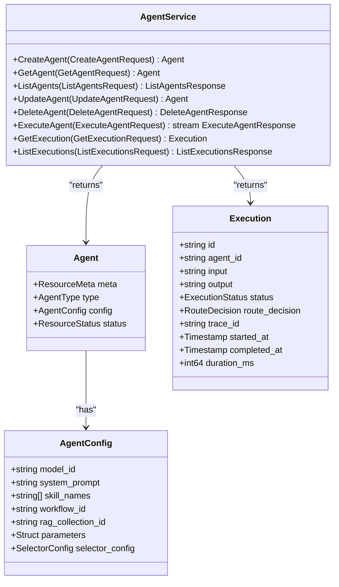

**Diagram sources**
- [agent.proto:11-177](file://api/proto/resolvenet/v1/agent.proto#L11-L177)

**Section sources**
- [agent.proto:11-177](file://api/proto/resolvenet/v1/agent.proto#L11-L177)

### Agent Registry Abstraction
- Purpose: Provide a uniform interface for agent storage and retrieval.
- Methods: Create, Get, List, Update, Delete.
- Implementation: InMemoryAgentRegistry demonstrates concurrency-safe operations.

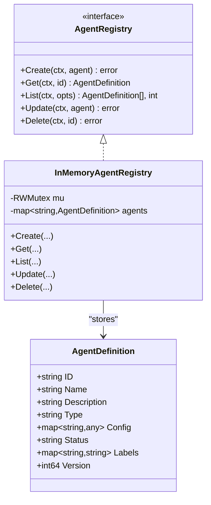

**Diagram sources**
- [agent.go:21-102](file://pkg/registry/agent.go#L21-L102)

**Section sources**
- [agent.go:1-103](file://pkg/registry/agent.go#L1-L103)

### CLI and TUI Integration
- CLI: Agent commands for create, list, run, delete, and logs; supports filtering and output formats.
- TUI: Navigation between dashboard, agents, workflows, and logs; displays basic counts and states.

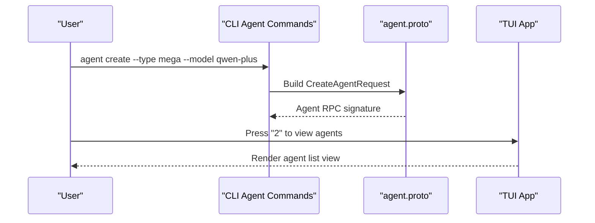

**Diagram sources**
- [create.go:9-31](file://internal/cli/agent/create.go#L9-L31)
- [list.go:9-28](file://internal/cli/agent/list.go#L9-L28)
- [agent.proto:68-95](file://api/proto/resolvenet/v1/agent.proto#L68-L95)
- [app.go:48-56](file://internal/tui/app.go#L48-L56)

**Section sources**
- [create.go:1-49](file://internal/cli/agent/create.go#L1-L49)
- [list.go:1-29](file://internal/cli/agent/list.go#L1-L29)
- [app.go:1-102](file://internal/tui/app.go#L1-L102)

## Dependency Analysis
- Frontend depends on the API client and TanStack Query for data fetching and mutations.
- Backend routes depend on handler implementations that will interact with the agent registry.
- gRPC service definitions define the contract for agent lifecycle and execution streaming.
- CLI/TUI depend on protobuf definitions for command signatures and TUI rendering.

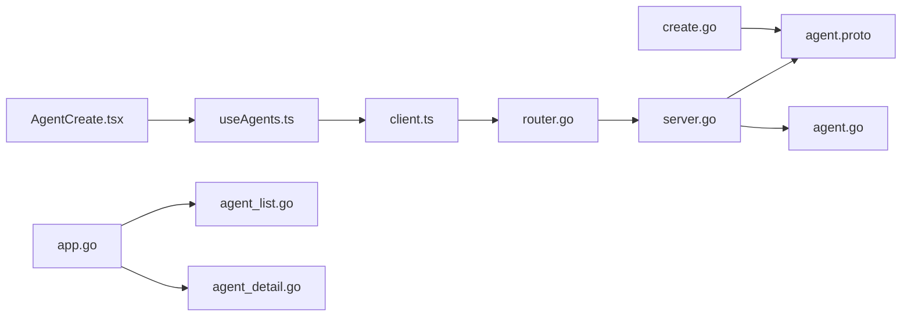

**Diagram sources**
- [AgentCreate.tsx:1-90](file://web/src/pages/Agents/AgentCreate.tsx#L1-L90)
- [useAgents.ts:1-29](file://web/src/hooks/useAgents.ts#L1-L29)
- [client.ts:1-85](file://web/src/api/client.ts#L1-L85)
- [router.go:1-183](file://pkg/server/router.go#L1-L183)
- [server.go:1-104](file://pkg/server/server.go#L1-L104)
- [agent.proto:1-177](file://api/proto/resolvenet/v1/agent.proto#L1-L177)
- [agent.go:1-103](file://pkg/registry/agent.go#L1-L103)
- [create.go:1-49](file://internal/cli/agent/create.go#L1-L49)
- [app.go:1-102](file://internal/tui/app.go#L1-L102)
- [agent_list.go:1-15](file://internal/tui/views/agent_list.go#L1-L15)
- [agent_detail.go:1-13](file://internal/tui/views/agent_detail.go#L1-L13)

**Section sources**
- [client.ts:1-85](file://web/src/api/client.ts#L1-L85)
- [router.go:1-183](file://pkg/server/router.go#L1-L183)
- [server.go:1-104](file://pkg/server/server.go#L1-L104)
- [agent.proto:1-177](file://api/proto/resolvenet/v1/agent.proto#L1-L177)
- [agent.go:1-103](file://pkg/registry/agent.go#L1-L103)
- [create.go:1-49](file://internal/cli/agent/create.go#L1-L49)
- [app.go:1-102](file://internal/tui/app.go#L1-L102)

## Performance Considerations
- API caching: Use TanStack Query’s built-in caching and invalidation to minimize redundant network calls.
- Pagination and filtering: Implement pagination and filter parameters in the backend to reduce payload sizes.
- Streaming execution: Use gRPC streaming for long-running executions to avoid timeouts and improve responsiveness.
- Concurrency: Ensure registry operations are thread-safe; the in-memory implementation uses RWMutex.

## Troubleshooting Guide
- Network errors: The API client throws on non-OK responses; catch and display user-friendly messages.
- Not implemented handlers: Several backend handlers currently return 501 or 404; implement business logic to resolve.
- Authentication: The auth middleware is a placeholder; integrate JWT or API key validation.
- Execution monitoring: The execution endpoint is stubbed; implement streaming and event handling.

**Section sources**
- [client.ts:12-18](file://web/src/api/client.ts#L12-L18)
- [router.go:75-94](file://pkg/server/router.go#L75-L94)
- [server.go:9-17](file://pkg/server/server.go#L9-L17)

## Conclusion
The agent management interface consists of a functional frontend scaffold integrated with a REST client and TanStack Query, backed by stubbed backend handlers and a protobuf-defined gRPC service. The in-memory agent registry provides a foundation for persistence. To reach full functionality, implement backend handlers, add filtering/sorting/pagination, enable real-time updates, and expand the detail view with execution history and performance metrics.

## Appendices

### User Workflows
- Creating an agent:
  - Fill the form in the creation page.
  - Submit triggers a mutation that posts to the backend.
  - On success, the list query is invalidated and refreshed.
- Viewing an agent:
  - Navigate to the detail page; load agent data by ID.
  - Display configuration, status, and execution history placeholders.
- Monitoring and troubleshooting:
  - Use the CLI/TUI to inspect agent states and logs.
  - Integrate execution streaming to observe live updates.

### Backend API Definitions
- REST endpoints:
  - GET /api/v1/agents
  - POST /api/v1/agents
  - GET /api/v1/agents/{id}
  - PUT /api/v1/agents/{id}
  - DELETE /api/v1/agents/{id}
  - POST /api/v1/agents/{id}/execute
- gRPC service:
  - AgentService with Create/Get/List/Update/Delete/Execute and execution streaming.

**Section sources**
- [router.go:18-24](file://pkg/server/router.go#L18-L24)
- [agent.proto:11-29](file://api/proto/resolvenet/v1/agent.proto#L11-L29)