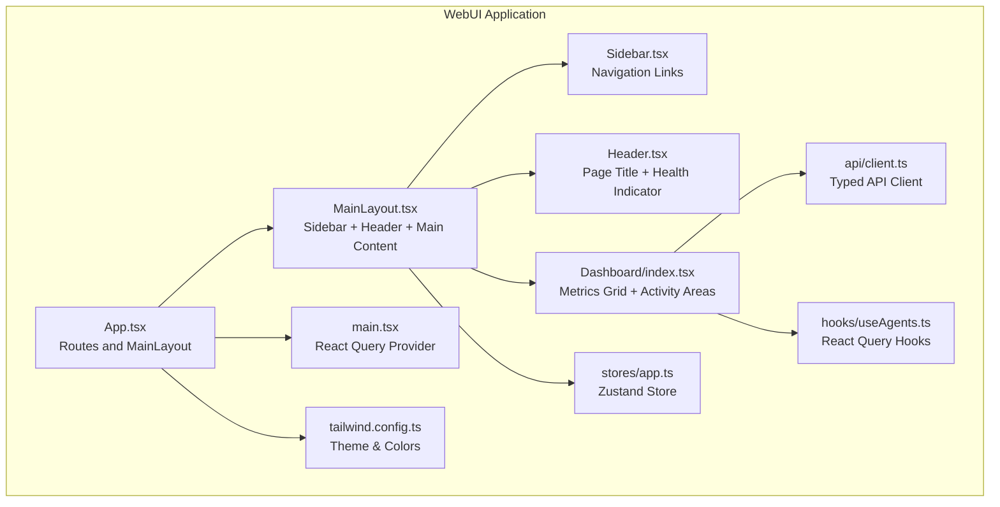
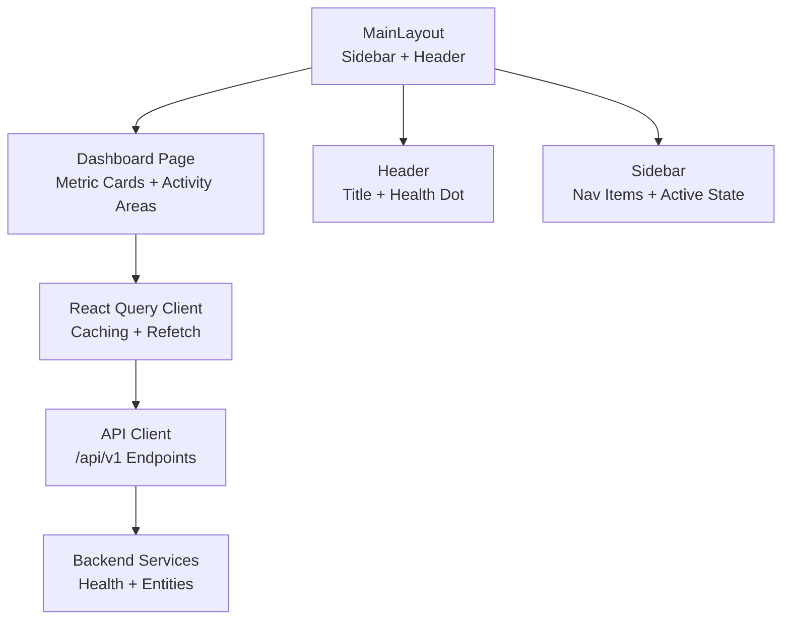
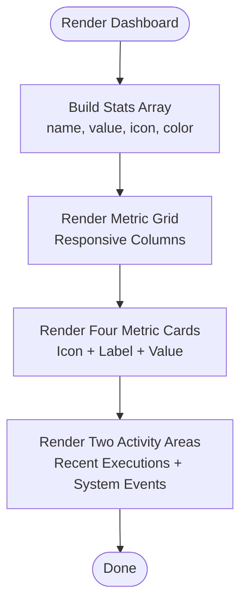
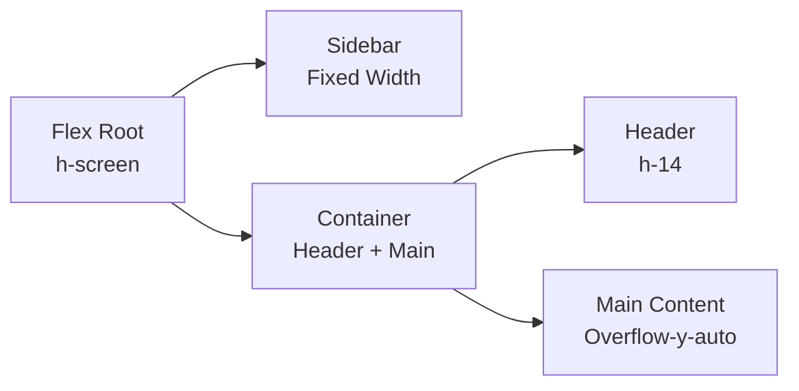
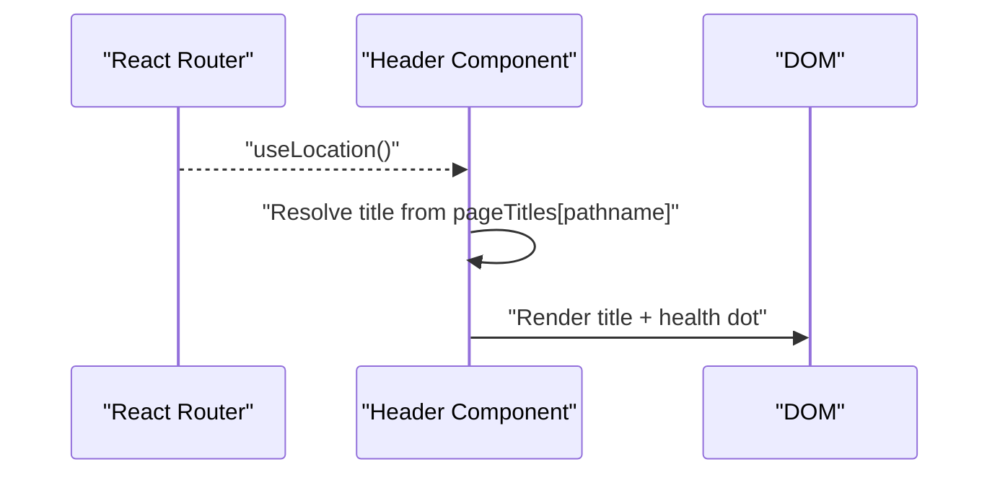
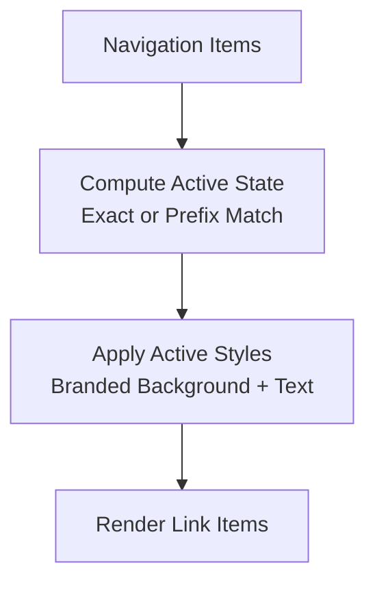
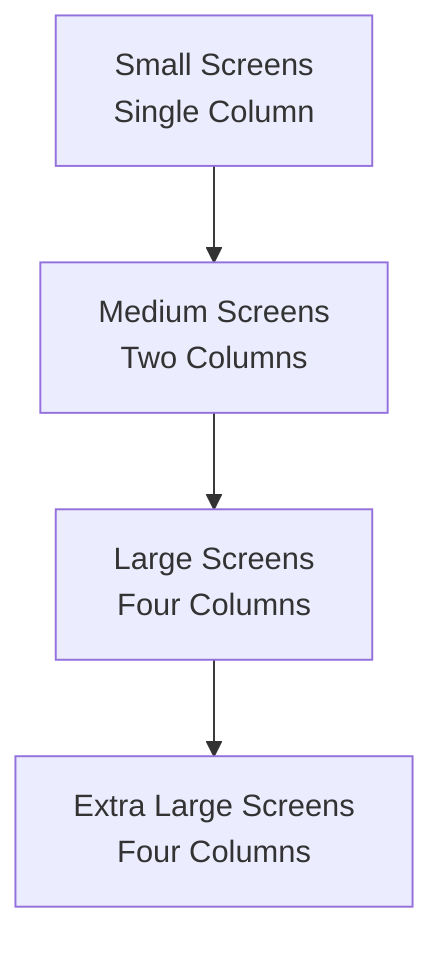
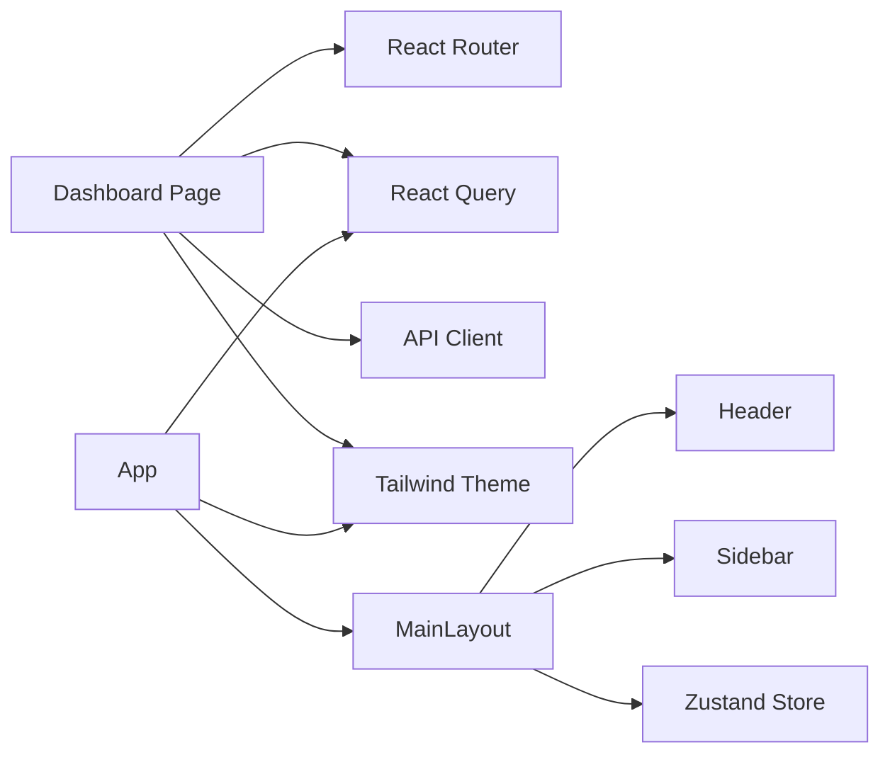

# Dashboard Overview

<cite>
**Referenced Files in This Document**
- [web/src/pages/Dashboard/index.tsx](file://web/src/pages/Dashboard/index.tsx)
- [web/src/components/Layout/MainLayout.tsx](file://web/src/components/Layout/MainLayout.tsx)
- [web/src/components/Layout/Header.tsx](file://web/src/components/Layout/Header.tsx)
- [web/src/components/Layout/Sidebar.tsx](file://web/src/components/Layout/Sidebar.tsx)
- [web/src/stores/app.ts](file://web/src/stores/app.ts)
- [web/src/api/client.ts](file://web/src/api/client.ts)
- [web/src/hooks/useAgents.ts](file://web/src/hooks/useAgents.ts)
- [web/src/App.tsx](file://web/src/App.tsx)
- [web/src/main.tsx](file://web/src/main.tsx)
- [web/tailwind.config.ts](file://web/tailwind.config.ts)
- [web/src/types/index.ts](file://web/src/types/index.ts)
- [web/package.json](file://web/package.json)
</cite>

## Table of Contents
1. [Introduction](#introduction)
2. [Project Structure](#project-structure)
3. [Core Components](#core-components)
4. [Architecture Overview](#architecture-overview)
5. [Detailed Component Analysis](#detailed-component-analysis)
6. [Dependency Analysis](#dependency-analysis)
7. [Performance Considerations](#performance-considerations)
8. [Troubleshooting Guide](#troubleshooting-guide)
9. [Conclusion](#conclusion)
10. [Appendices](#appendices)

## Introduction
This document describes the WebUI dashboard overview page, focusing on the main layout, system health indicators, recent activity feeds, and key performance metrics display. It explains the header navigation components, sidebar organization, and responsive design patterns. It also documents real-time data visualization components, metric cards, and system status indicators, along with examples of dashboard widgets, filtering capabilities, and interactive elements. The document covers integration with backend APIs for real-time data updates, WebSocket connections for live monitoring, caching strategies for performance optimization, accessibility features, mobile responsiveness, and user customization options.

## Project Structure
The dashboard is part of a React application structured around a main layout composed of a sidebar and header, with routes configured to render the dashboard page. The dashboard page currently renders metric cards and placeholder areas for recent executions and system events. Data fetching is handled via a typed API client and React Query, while global state is managed with Zustand. Styling leverages Tailwind CSS with a custom primary color palette.

**Diagram sources**
- [web/src/App.tsx:17-37](file://web/src/App.tsx#L17-L37)
- [web/src/components/Layout/MainLayout.tsx:9-21](file://web/src/components/Layout/MainLayout.tsx#L9-L21)
- [web/src/components/Layout/Sidebar.tsx:22-56](file://web/src/components/Layout/Sidebar.tsx#L22-L56)
- [web/src/components/Layout/Header.tsx:14-29](file://web/src/components/Layout/Header.tsx#L14-L29)
- [web/src/pages/Dashboard/index.tsx:10-43](file://web/src/pages/Dashboard/index.tsx#L10-L43)
- [web/src/api/client.ts:20-48](file://web/src/api/client.ts#L20-L48)
- [web/src/hooks/useAgents.ts:4-28](file://web/src/hooks/useAgents.ts#L4-L28)
- [web/src/stores/app.ts:10-15](file://web/src/stores/app.ts#L10-L15)
- [web/src/main.tsx:8-15](file://web/src/main.tsx#L8-L15)
- [web/tailwind.config.ts:3-19](file://web/tailwind.config.ts#L3-L19)

**Section sources**
- [web/src/App.tsx:17-37](file://web/src/App.tsx#L17-L37)
- [web/src/components/Layout/MainLayout.tsx:9-21](file://web/src/components/Layout/MainLayout.tsx#L9-L21)
- [web/src/components/Layout/Sidebar.tsx:22-56](file://web/src/components/Layout/Sidebar.tsx#L22-L56)
- [web/src/components/Layout/Header.tsx:14-29](file://web/src/components/Layout/Header.tsx#L14-L29)
- [web/src/pages/Dashboard/index.tsx:10-43](file://web/src/pages/Dashboard/index.tsx#L10-L43)
- [web/src/api/client.ts:20-48](file://web/src/api/client.ts#L20-L48)
- [web/src/hooks/useAgents.ts:4-28](file://web/src/hooks/useAgents.ts#L4-L28)
- [web/src/stores/app.ts:10-15](file://web/src/stores/app.ts#L10-L15)
- [web/src/main.tsx:8-15](file://web/src/main.tsx#L8-L15)
- [web/tailwind.config.ts:3-19](file://web/tailwind.config.ts#L3-L19)

## Core Components
- Dashboard page: Renders four metric cards for Active Agents, Loaded Skills, Workflows, and RAG Collections, plus two grid areas for Recent Executions and System Events. The metrics currently display placeholder values and icons with color-coded accents.
- Main layout: Provides a two-column layout with a fixed-width sidebar and a scrollable main content area containing the header and page content.
- Header: Displays the current page title derived from routing and a system health indicator with a status dot.
- Sidebar: Contains navigation links for Dashboard, Agents, Skills, Workflows, RAG, Playground, and Settings, with active-state highlighting based on the current route.
- API client: Defines typed endpoints for health, agents, skills, workflows, RAG collections, and system info.
- React Query integration: Centralized caching and background refetching for API data, with a default stale window and retry policy.
- Zustand store: Manages global UI state such as sidebar visibility and selected agent ID.
- Tailwind theme: Extends the default color palette with a primary brand color for active states and highlights.

**Section sources**
- [web/src/pages/Dashboard/index.tsx:3-8](file://web/src/pages/Dashboard/index.tsx#L3-L8)
- [web/src/pages/Dashboard/index.tsx:10-43](file://web/src/pages/Dashboard/index.tsx#L10-L43)
- [web/src/components/Layout/MainLayout.tsx:9-21](file://web/src/components/Layout/MainLayout.tsx#L9-L21)
- [web/src/components/Layout/Header.tsx:14-29](file://web/src/components/Layout/Header.tsx#L14-L29)
- [web/src/components/Layout/Sidebar.tsx:22-56](file://web/src/components/Layout/Sidebar.tsx#L22-L56)
- [web/src/api/client.ts:20-48](file://web/src/api/client.ts#L20-L48)
- [web/src/main.tsx:8-15](file://web/src/main.tsx#L8-L15)
- [web/src/stores/app.ts:10-15](file://web/src/stores/app.ts#L10-L15)
- [web/tailwind.config.ts:3-19](file://web/tailwind.config.ts#L3-L19)

## Architecture Overview
The dashboard follows a layered architecture:
- Presentation layer: React components for layout, header, sidebar, and dashboard page.
- Data access layer: Typed API client encapsulating HTTP requests to backend endpoints.
- State management: React Query for caching and synchronization; Zustand for lightweight UI state.
- Styling: Tailwind CSS with a custom primary color for branding and active states.

**Diagram sources**
- [web/src/pages/Dashboard/index.tsx:10-43](file://web/src/pages/Dashboard/index.tsx#L10-L43)
- [web/src/components/Layout/MainLayout.tsx:9-21](file://web/src/components/Layout/MainLayout.tsx#L9-L21)
- [web/src/components/Layout/Header.tsx:14-29](file://web/src/components/Layout/Header.tsx#L14-L29)
- [web/src/components/Layout/Sidebar.tsx:22-56](file://web/src/components/Layout/Sidebar.tsx#L22-L56)
- [web/src/main.tsx:8-15](file://web/src/main.tsx#L8-L15)
- [web/src/api/client.ts:20-48](file://web/src/api/client.ts#L20-L48)

## Detailed Component Analysis

### Dashboard Page
The dashboard page organizes metrics into a responsive grid and allocates space for recent executions and system events. The metrics array defines card metadata including label, value, icon, and color class. The layout uses Tailwind’s responsive grid to stack on small screens and expand to four columns on larger screens.

**Diagram sources**
- [web/src/pages/Dashboard/index.tsx:3-8](file://web/src/pages/Dashboard/index.tsx#L3-L8)
- [web/src/pages/Dashboard/index.tsx:10-43](file://web/src/pages/Dashboard/index.tsx#L10-L43)

**Section sources**
- [web/src/pages/Dashboard/index.tsx:3-8](file://web/src/pages/Dashboard/index.tsx#L3-L8)
- [web/src/pages/Dashboard/index.tsx:10-43](file://web/src/pages/Dashboard/index.tsx#L10-L43)

### Main Layout
The main layout composes the sidebar and header into a full-height flex container, with the main content area scrolling independently. This pattern ensures consistent navigation and header behavior across pages.

**Diagram sources**
- [web/src/components/Layout/MainLayout.tsx:9-21](file://web/src/components/Layout/MainLayout.tsx#L9-L21)

**Section sources**
- [web/src/components/Layout/MainLayout.tsx:9-21](file://web/src/components/Layout/MainLayout.tsx#L9-L21)

### Header Navigation
The header derives the page title from the current route and displays a system health indicator with a green dot and label. This provides immediate feedback on system status.

**Diagram sources**
- [web/src/components/Layout/Header.tsx:14-29](file://web/src/components/Layout/Header.tsx#L14-L29)

**Section sources**
- [web/src/components/Layout/Header.tsx:3-12](file://web/src/components/Layout/Header.tsx#L3-L12)
- [web/src/components/Layout/Header.tsx:14-29](file://web/src/components/Layout/Header.tsx#L14-L29)

### Sidebar Organization
The sidebar defines navigation items with icons and routes. Active state is computed based on exact match or prefix match for nested routes. The active item receives a branded background and text color.

**Diagram sources**
- [web/src/components/Layout/Sidebar.tsx:22-56](file://web/src/components/Layout/Sidebar.tsx#L22-L56)

**Section sources**
- [web/src/components/Layout/Sidebar.tsx:12-20](file://web/src/components/Layout/Sidebar.tsx#L12-L20)
- [web/src/components/Layout/Sidebar.tsx:32-49](file://web/src/components/Layout/Sidebar.tsx#L32-L49)

### Responsive Design Patterns
The dashboard uses Tailwind’s responsive utilities to adapt the metric grid to different screen sizes. The layout remains consistent across breakpoints, ensuring usability on mobile devices.

**Diagram sources**
- [web/src/pages/Dashboard/index.tsx:13](file://web/src/pages/Dashboard/index.tsx#L13)

**Section sources**
- [web/src/pages/Dashboard/index.tsx:13](file://web/src/pages/Dashboard/index.tsx#L13)

### Real-Time Data Visualization and Metrics
- Current state: The dashboard renders metric cards with placeholder values. There is no active WebSocket connection or live chart rendering in the dashboard page.
- Backend integration: The API client exposes health and entity endpoints suitable for populating metrics and activity feeds. React Query manages caching and refetching.
- Recommendations for enhancement:
  - Introduce WebSocket subscriptions for live metrics and events.
  - Add chart libraries for time-series visualization.
  - Implement polling fallback if WebSocket is unavailable.
  - Use React Query’s background refetching to keep metrics fresh.

**Section sources**
- [web/src/pages/Dashboard/index.tsx:3-8](file://web/src/pages/Dashboard/index.tsx#L3-L8)
- [web/src/api/client.ts:20-48](file://web/src/api/client.ts#L20-L48)
- [web/src/main.tsx:8-15](file://web/src/main.tsx#L8-L15)

### Filtering Capabilities and Interactive Elements
- Filtering: No filtering UI exists on the dashboard page. Filtering could be introduced for recent executions or system events using dropdowns or keyword inputs.
- Interactivity: Clicking navigation items switches routes and updates the active state in the sidebar. The header title updates accordingly.

**Section sources**
- [web/src/components/Layout/Sidebar.tsx:32-49](file://web/src/components/Layout/Sidebar.tsx#L32-L49)
- [web/src/components/Layout/Header.tsx:14-16](file://web/src/components/Layout/Header.tsx#L14-L16)

### Accessibility Features
- Semantic structure: The header uses a heading element for the title, and navigation items are anchor-based.
- Focus and keyboard navigation: Standard anchor elements support keyboard navigation.
- Color contrast: The theme uses sufficient contrast for text and backgrounds; ensure icons maintain adequate contrast against backgrounds.
- ARIA roles: Consider adding role attributes for landmarks and navigation regions if needed.

**Section sources**
- [web/src/components/Layout/Header.tsx:18-27](file://web/src/components/Layout/Header.tsx#L18-L27)
- [web/src/components/Layout/Sidebar.tsx:36-47](file://web/src/components/Layout/Sidebar.tsx#L36-L47)

### Mobile Responsiveness
- The layout adapts to smaller screens with a single-column metric grid and a fixed header and sidebar. On mobile, the sidebar remains visible, but navigation items can be collapsed using the Zustand store if desired.
- Consider adding a mobile-friendly sidebar toggle controlled by the store to improve usability on small screens.

**Section sources**
- [web/src/pages/Dashboard/index.tsx:13](file://web/src/pages/Dashboard/index.tsx#L13)
- [web/src/stores/app.ts:10-15](file://web/src/stores/app.ts#L10-L15)

### User Customization Options
- Current options: The dashboard does not expose customization controls. The sidebar store exposes a toggle for sidebar visibility, which can be wired into a UI control.
- Suggestions:
  - Allow users to reorder or hide metric cards.
  - Provide date range selectors for activity feeds.
  - Enable dark/light mode toggles aligned with the existing theme.

**Section sources**
- [web/src/stores/app.ts:10-15](file://web/src/stores/app.ts#L10-L15)

## Dependency Analysis
The dashboard depends on React Router for navigation, React Query for data fetching and caching, and Tailwind for styling. The API client centralizes endpoint definitions, and the Zustand store provides lightweight UI state.

**Diagram sources**
- [web/src/pages/Dashboard/index.tsx:10-43](file://web/src/pages/Dashboard/index.tsx#L10-L43)
- [web/src/App.tsx:17-37](file://web/src/App.tsx#L17-L37)
- [web/src/components/Layout/MainLayout.tsx:9-21](file://web/src/components/Layout/MainLayout.tsx#L9-L21)
- [web/src/components/Layout/Header.tsx:14-29](file://web/src/components/Layout/Header.tsx#L14-L29)
- [web/src/components/Layout/Sidebar.tsx:22-56](file://web/src/components/Layout/Sidebar.tsx#L22-L56)
- [web/src/api/client.ts:20-48](file://web/src/api/client.ts#L20-L48)
- [web/src/main.tsx:8-15](file://web/src/main.tsx#L8-L15)
- [web/src/stores/app.ts:10-15](file://web/src/stores/app.ts#L10-L15)
- [web/tailwind.config.ts:3-19](file://web/tailwind.config.ts#L3-L19)

**Section sources**
- [web/src/App.tsx:17-37](file://web/src/App.tsx#L17-L37)
- [web/src/pages/Dashboard/index.tsx:10-43](file://web/src/pages/Dashboard/index.tsx#L10-L43)
- [web/src/api/client.ts:20-48](file://web/src/api/client.ts#L20-L48)
- [web/src/main.tsx:8-15](file://web/src/main.tsx#L8-L15)
- [web/src/stores/app.ts:10-15](file://web/src/stores/app.ts#L10-L15)
- [web/tailwind.config.ts:3-19](file://web/tailwind.config.ts#L3-L19)

## Performance Considerations
- Caching: React Query caches data with a default stale time and retry policy, reducing redundant network calls and improving perceived performance.
- Lazy loading: Consider lazy-loading heavy components or charts to minimize initial bundle size.
- Virtualization: For long activity lists, implement virtualized lists to avoid rendering overhead.
- Icons: Lucide icons are tree-shaken by bundlers; ensure only used icons are imported.
- Styling: Tailwind’s JIT compilation is configured; avoid generating unused utility classes to reduce CSS size.

**Section sources**
- [web/src/main.tsx:8-15](file://web/src/main.tsx#L8-L15)
- [web/package.json:15-23](file://web/package.json#L15-L23)

## Troubleshooting Guide
- Network errors: The API client throws descriptive errors when requests fail. Inspect the thrown error messages to diagnose backend connectivity issues.
- Data not updating: Verify React Query’s cache configuration and ensure queries are not disabled. Confirm that mutations invalidate appropriate query keys.
- Sidebar state: If sidebar visibility appears inconsistent, check the Zustand store’s toggle function and ensure it is invoked correctly.
- Health indicator: If the header health dot does not reflect system status, confirm the health endpoint is reachable and returning expected data.

**Section sources**
- [web/src/api/client.ts:12-18](file://web/src/api/client.ts#L12-L18)
- [web/src/main.tsx:8-15](file://web/src/main.tsx#L8-L15)
- [web/src/stores/app.ts:10-15](file://web/src/stores/app.ts#L10-L15)

## Conclusion
The dashboard overview page establishes a solid foundation with a responsive grid of metric cards, a fixed header with system health status, and a navigable sidebar. While the current implementation focuses on static placeholders, the underlying architecture supports seamless integration with backend APIs, caching via React Query, and future enhancements such as real-time updates, interactive widgets, and user customization.

## Appendices
- Types: The codebase defines shared types for agents, skills, workflows, and related structures, enabling type-safe integrations with the dashboard components.

**Section sources**
- [web/src/types/index.ts:1-72](file://web/src/types/index.ts#L1-L72)