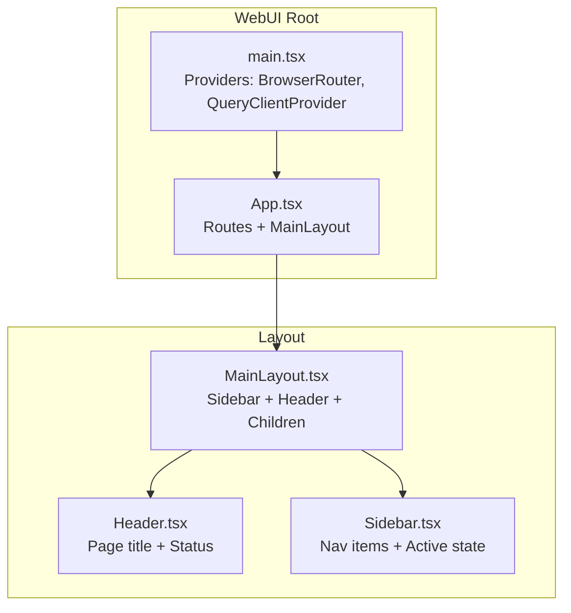
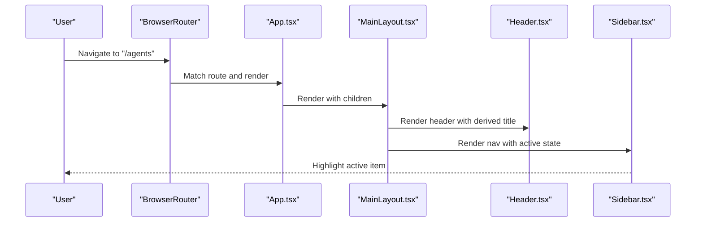
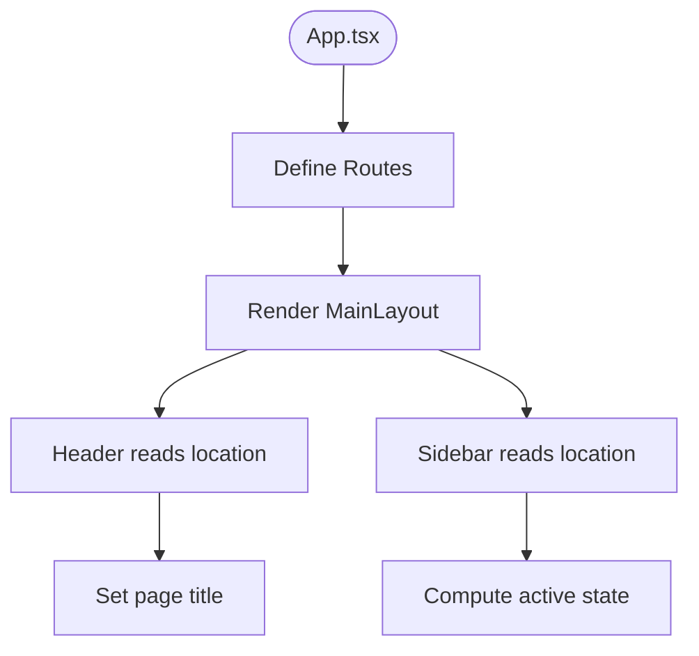
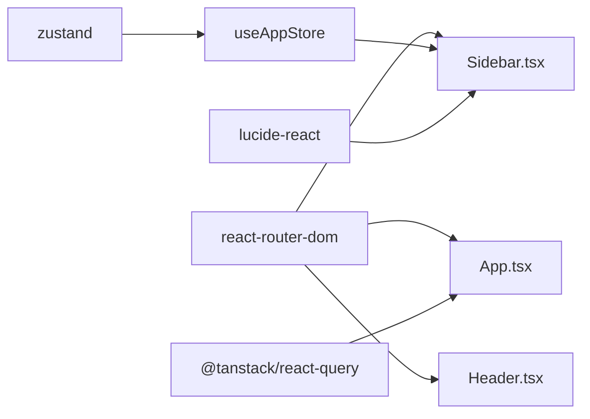

# Navigation and Layout System

<cite>
**Referenced Files in This Document**
- [MainLayout.tsx](file://web/src/components/Layout/MainLayout.tsx)
- [Header.tsx](file://web/src/components/Layout/Header.tsx)
- [Sidebar.tsx](file://web/src/components/Layout/Sidebar.tsx)
- [app.ts](file://web/src/stores/app.ts)
- [App.tsx](file://web/src/App.tsx)
- [main.tsx](file://web/src/main.tsx)
- [tailwind.config.ts](file://web/tailwind.config.ts)
- [index.css](file://web/src/index.css)
- [package.json](file://web/package.json)
- [vite.config.ts](file://web/vite.config.ts)
</cite>

## Table of Contents
1. [Introduction](#introduction)
2. [Project Structure](#project-structure)
3. [Core Components](#core-components)
4. [Architecture Overview](#architecture-overview)
5. [Detailed Component Analysis](#detailed-component-analysis)
6. [Dependency Analysis](#dependency-analysis)
7. [Performance Considerations](#performance-considerations)
8. [Troubleshooting Guide](#troubleshooting-guide)
9. [Conclusion](#conclusion)

## Introduction
This document explains the WebUI navigation and layout system built with React and integrated with React Router. It covers the MainLayout component structure, responsive design patterns, component composition, and the Header and Sidebar components. It also documents routing integration, breadcrumb navigation approaches, accessibility features, styling and theme management, state management for layout preferences, and performance optimization techniques for smooth navigation experiences.

## Project Structure
The WebUI layout is composed of three primary layout components:
- MainLayout: orchestrates the overall page structure and hosts routed content.
- Header: displays the current page title and system status.
- Sidebar: renders the navigation menu with active-state highlighting.

Routing is configured at the application root and wrapped by the layout. Global state for layout preferences is managed via a lightweight store.

**Diagram sources**
- [main.tsx:17-25](file://web/src/main.tsx#L17-L25)
- [App.tsx:17-37](file://web/src/App.tsx#L17-L37)
- [MainLayout.tsx:9-21](file://web/src/components/Layout/MainLayout.tsx#L9-L21)
- [Header.tsx:14-29](file://web/src/components/Layout/Header.tsx#L14-L29)
- [Sidebar.tsx:22-56](file://web/src/components/Layout/Sidebar.tsx#L22-L56)

**Section sources**
- [main.tsx:17-25](file://web/src/main.tsx#L17-L25)
- [App.tsx:17-37](file://web/src/App.tsx#L17-L37)
- [MainLayout.tsx:9-21](file://web/src/components/Layout/MainLayout.tsx#L9-L21)
- [Header.tsx:14-29](file://web/src/components/Layout/Header.tsx#L14-L29)
- [Sidebar.tsx:22-56](file://web/src/components/Layout/Sidebar.tsx#L22-L56)

## Core Components
- MainLayout: Provides a two-column layout with a fixed-width sidebar and a scrollable content area. It composes Header and Sidebar and renders the current route’s content.
- Header: Uses React Router’s useLocation to derive a human-friendly page title and displays a system health indicator.
- Sidebar: Renders a static navigation list with Lucide icons, active-state highlighting based on pathname, and a small footer.

Key behaviors:
- Responsive sizing is handled via Tailwind utilities; the sidebar width is fixed and the content area is flexible.
- Active state is computed per route segment to support nested routes under shared prefixes.

**Section sources**
- [MainLayout.tsx:9-21](file://web/src/components/Layout/MainLayout.tsx#L9-L21)
- [Header.tsx:14-29](file://web/src/components/Layout/Header.tsx#L14-L29)
- [Sidebar.tsx:22-56](file://web/src/components/Layout/Sidebar.tsx#L22-L56)

## Architecture Overview
The layout system integrates React Router for navigation and Zustand for minimal global state. Providers wrap the application to enable routing and caching. The MainLayout composes Header and Sidebar and delegates page rendering to the routed children.

**Diagram sources**
- [main.tsx:17-25](file://web/src/main.tsx#L17-L25)
- [App.tsx:17-37](file://web/src/App.tsx#L17-L37)
- [MainLayout.tsx:9-21](file://web/src/components/Layout/MainLayout.tsx#L9-L21)
- [Header.tsx:14-29](file://web/src/components/Layout/Header.tsx#L14-L29)
- [Sidebar.tsx:22-56](file://web/src/components/Layout/Sidebar.tsx#L22-L56)

## Detailed Component Analysis

### MainLayout Component
Responsibilities:
- Establishes the page container with a fixed-height viewport.
- Places the Sidebar on the left and a flex column for Header and main content area.
- Ensures the main content area is scrollable and padded.

Composition:
- Imports and composes Sidebar and Header.
- Receives children from React Router and renders them inside the main content area.

Accessibility and semantics:
- Uses semantic header and main elements.
- Content area is scrollable to prevent layout shifts.

Performance:
- Minimal re-renders; layout is stable across route changes.

**Section sources**
- [MainLayout.tsx:9-21](file://web/src/components/Layout/MainLayout.tsx#L9-L21)

### Header Component
Responsibilities:
- Derives the page title from the current location.
- Displays a system status indicator.

Implementation details:
- Uses a mapping of pathnames to titles.
- Applies backdrop blur and dark theme styling.

Accessibility:
- Uses a heading element for the title.
- Status indicator uses a dot to convey state.

**Section sources**
- [Header.tsx:14-29](file://web/src/components/Layout/Header.tsx#L14-L29)

### Sidebar Component
Responsibilities:
- Renders a vertical navigation menu with icons.
- Computes active state based on the current location.
- Displays branding and a version footer.

Active state logic:
- Exact match for the root path.
- Prefix-based match for nested routes (e.g., "/agents/new" activates "Agents").

Styling:
- Fixed width sidebar with dark theme background.
- Hover and active states use theme-aware colors.

Icons:
- Icons are imported from lucide-react and sized consistently.

**Section sources**
- [Sidebar.tsx:22-56](file://web/src/components/Layout/Sidebar.tsx#L22-L56)

### Routing Integration
- Routes are declared in App.tsx and wrapped by MainLayout.
- React Router DOM provides navigation primitives and location state.
- The Header reads location to compute the page title.
- The Sidebar computes active state from location.

**Diagram sources**
- [App.tsx:17-37](file://web/src/App.tsx#L17-L37)
- [Header.tsx:14-29](file://web/src/components/Layout/Header.tsx#L14-L29)
- [Sidebar.tsx:22-56](file://web/src/components/Layout/Sidebar.tsx#L22-L56)

**Section sources**
- [App.tsx:17-37](file://web/src/App.tsx#L17-L37)
- [Header.tsx:14-29](file://web/src/components/Layout/Header.tsx#L14-L29)
- [Sidebar.tsx:22-56](file://web/src/components/Layout/Sidebar.tsx#L22-L56)

### Breadcrumb Navigation
Current implementation:
- Breadcrumbs are not implemented in the layout. The Header derives a single-page title from the current route.

Recommended approach:
- Introduce a breadcrumb component that builds segments from the current pathname.
- Use a mapping or pattern-based approach to translate route segments into human-readable labels.
- Place breadcrumbs above the main content area within MainLayout.

Note: This section describes a conceptual enhancement; no existing code implements breadcrumbs.

### Mobile Navigation Patterns
Current implementation:
- The layout does not include a mobile-specific navigation pattern (e.g., drawer or hamburger menu).

Responsive strategy:
- Use a mobile-first breakpoint approach with Tailwind utilities.
- Add a mobile toggle to show/hide the Sidebar while preserving the Header.
- Consider collapsing the Sidebar into a drawer on smaller screens and restoring it on larger screens.

Note: This section describes conceptual enhancements; no existing code implements mobile navigation.

### Accessibility Features
Observed:
- Semantic header and main elements in MainLayout.
- Text contrast and dark theme applied via Tailwind.
- Status indicator uses a dot to communicate state.

Recommendations:
- Add keyboard navigation support for the Sidebar links.
- Include focus-visible styles for interactive elements.
- Provide skip-to-content links for keyboard users.
- Ensure sufficient color contrast for active and hover states.

### Styling System and Theme Management
Theme and styling:
- Tailwind CSS is configured with a custom primary palette.
- Base, components, and utilities layers are included.
- Body applies dark theme colors and a system-safe font stack.

Primary color usage:
- The Sidebar active state leverages the primary palette for highlights.
- The Header and Sidebar use gray-scale backgrounds aligned with the dark theme.

Customization examples:
- Extend the primary palette in Tailwind config for brand consistency.
- Add spacing utilities or typography scales as needed.
- Introduce a compact mode by adjusting padding and icon sizes.

**Section sources**
- [tailwind.config.ts:3-19](file://web/tailwind.config.ts#L3-L19)
- [index.css:5-8](file://web/src/index.css#L5-L8)
- [Sidebar.tsx:39-43](file://web/src/components/Layout/Sidebar.tsx#L39-L43)

### State Management for Layout Preferences
Current state:
- A Zustand store exposes a boolean flag to toggle the sidebar visibility and a selected agent ID.
- Sidebar visibility defaults to open.

Usage:
- Consumers can call the toggle function to switch the sidebar state.
- The store can be extended to persist preferences in localStorage or sessionStorage.

Integration points:
- Wrap the layout with a component that reads the store and conditionally renders the Sidebar.
- Apply a CSS class to the layout container to adjust widths when collapsed.

**Section sources**
- [app.ts:10-15](file://web/src/stores/app.ts#L10-L15)
- [Sidebar.tsx:22-56](file://web/src/components/Layout/Sidebar.tsx#L22-L56)

## Dependency Analysis
External libraries and their roles:
- React Router DOM: routing and location state.
- lucide-react: navigation icons.
- Zustand: lightweight global state for layout preferences.
- TanStack React Query: caching and data fetching (not directly part of layout but affects perceived performance).

**Diagram sources**
- [package.json:15-23](file://web/package.json#L15-L23)
- [App.tsx:17-37](file://web/src/App.tsx#L17-L37)
- [Header.tsx:14-29](file://web/src/components/Layout/Header.tsx#L14-L29)
- [Sidebar.tsx:22-56](file://web/src/components/Layout/Sidebar.tsx#L22-L56)
- [app.ts:10-15](file://web/src/stores/app.ts#L10-L15)

**Section sources**
- [package.json:15-23](file://web/package.json#L15-L23)
- [main.tsx:17-25](file://web/src/main.tsx#L17-L25)
- [App.tsx:17-37](file://web/src/App.tsx#L17-L37)

## Performance Considerations
- Keep the layout structure shallow to minimize re-renders during navigation.
- Use React Router’s lazy loading for heavy route components.
- Debounce or memoize expensive computations in Header and Sidebar.
- Prefer CSS transitions for layout toggles (e.g., sidebar collapse) to avoid layout thrashing.
- Enable React Query caching to reduce network latency and improve perceived performance.

## Troubleshooting Guide
Common issues and resolutions:
- Active state not updating after navigation:
  - Verify that the Sidebar reads the current location and recomputes active state.
  - Confirm that nested routes use prefix-based matching for active highlighting.
- Header title not reflecting the current page:
  - Ensure the pathname exists in the title mapping or provide a fallback label.
- Sidebar not visible on small screens:
  - Implement a mobile toggle and adjust layout widths with Tailwind utilities.
- State not persisting across reloads:
  - Persist the sidebarOpen flag in localStorage and hydrate the store on mount.

**Section sources**
- [Sidebar.tsx:32-34](file://web/src/components/Layout/Sidebar.tsx#L32-L34)
- [Header.tsx:15-16](file://web/src/components/Layout/Header.tsx#L15-L16)
- [app.ts:10-15](file://web/src/stores/app.ts#L10-L15)

## Conclusion
The WebUI navigation and layout system centers on a clean, composable structure: MainLayout coordinates Header and Sidebar, React Router provides routing and location state, and a minimal Zustand store manages layout preferences. The styling system leverages Tailwind with a cohesive dark theme and a custom primary palette. While breadcrumbs and mobile navigation are not currently implemented, the architecture supports straightforward enhancements to meet modern UX expectations. Performance can be further optimized through React Router lazy loading and React Query caching.