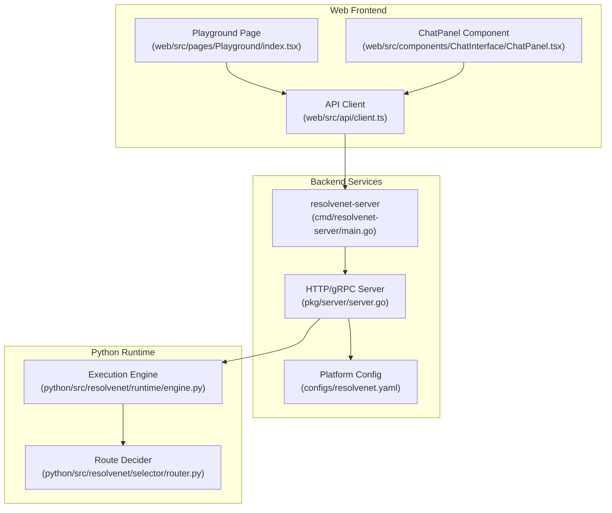
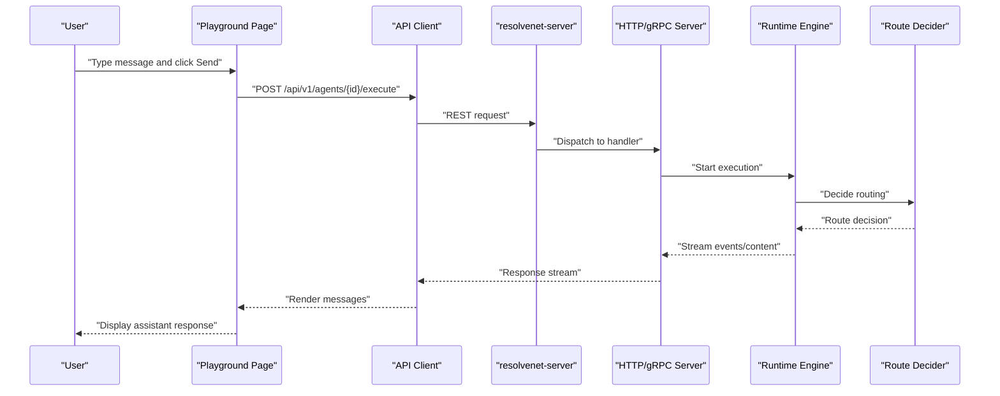
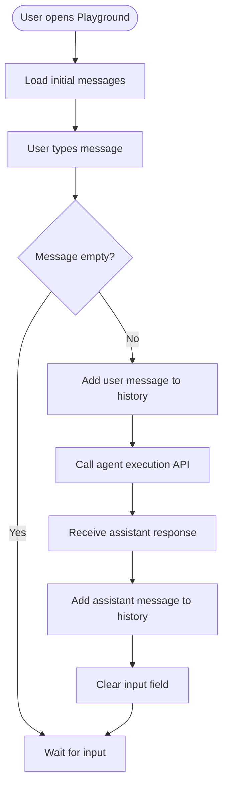
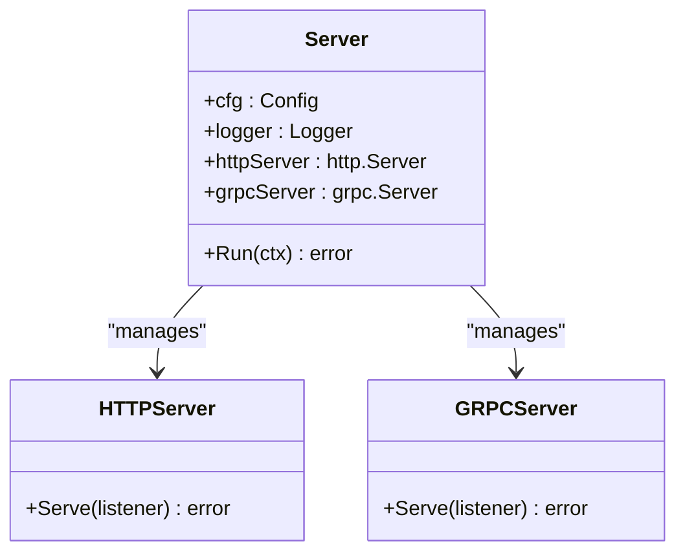
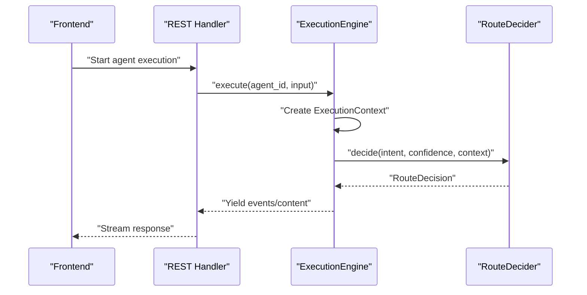
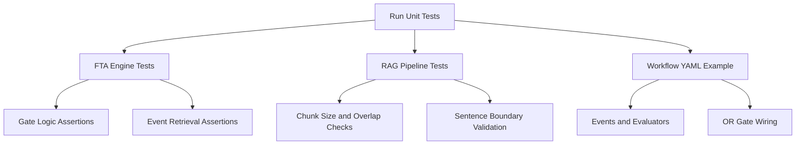
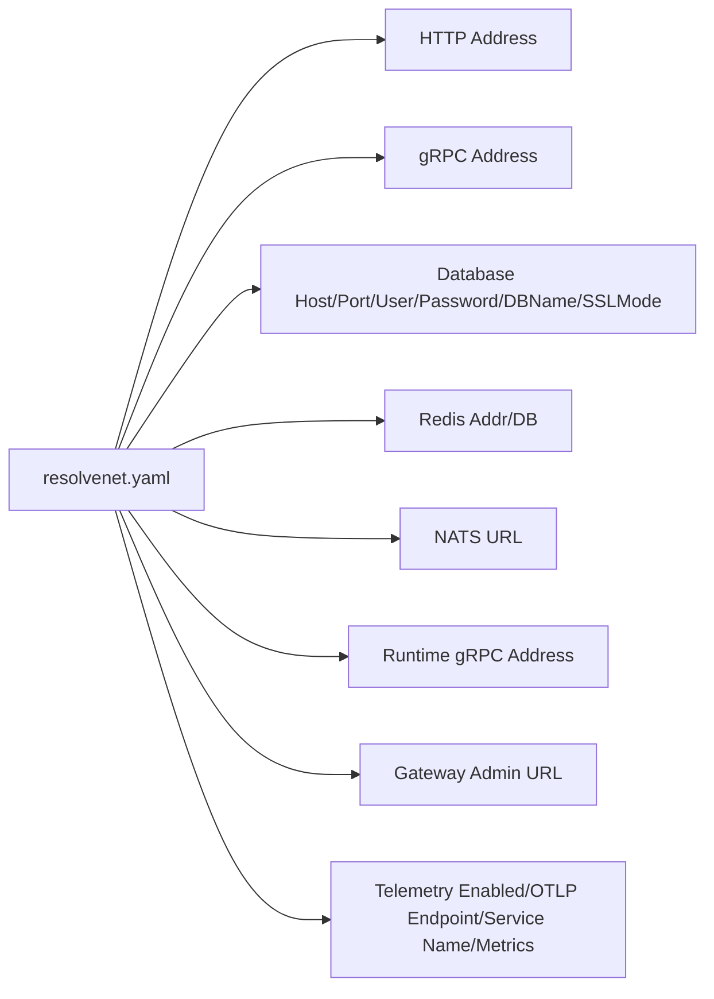
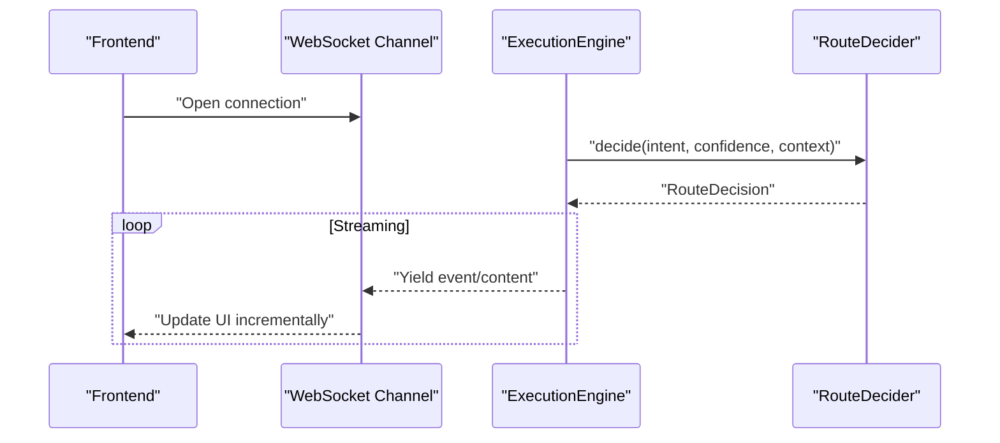
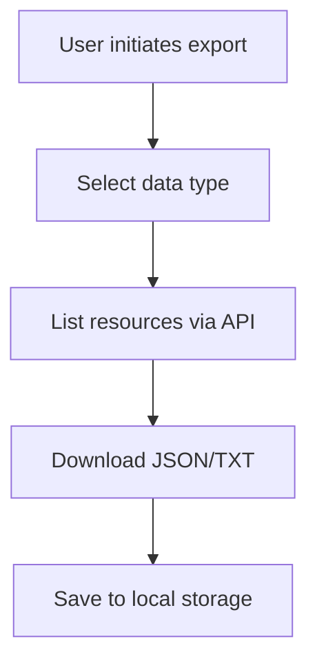
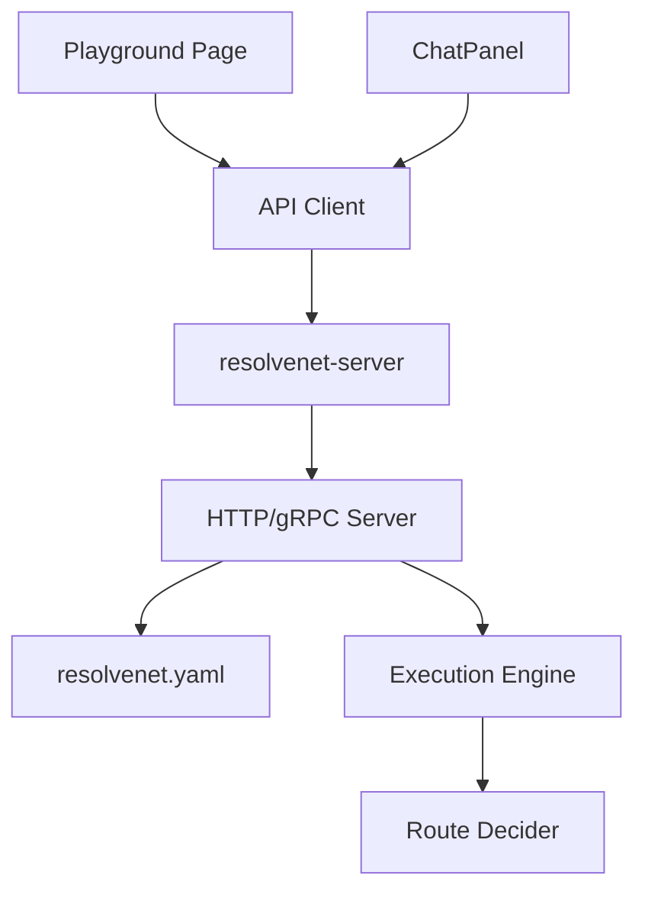

# Playground and Testing Environment

<cite>
**Referenced Files in This Document**
- [index.tsx](file://web/src/pages/Playground/index.tsx)
- [ChatPanel.tsx](file://web/src/components/ChatInterface/ChatPanel.tsx)
- [client.ts](file://web/src/api/client.ts)
- [resolvenet.yaml](file://configs/resolvenet.yaml)
- [workflow-fta-example.yaml](file://configs/examples/workflow-fta-example.yaml)
- [main.go](file://cmd/resolvenet-server/main.go)
- [server.go](file://pkg/server/server.go)
- [platform.proto](file://api/proto/resolvenet/v1/platform.proto)
- [engine.py](file://python/src/resolvenet/runtime/engine.py)
- [router.py](file://python/src/resolvenet/selector/router.py)
- [test_fta_engine.py](file://python/tests/unit/test_fta_engine.py)
- [test_rag_pipeline.py](file://python/tests/unit/test_rag_pipeline.py)
</cite>

## Table of Contents
1. [Introduction](#introduction)
2. [Project Structure](#project-structure)
3. [Core Components](#core-components)
4. [Architecture Overview](#architecture-overview)
5. [Detailed Component Analysis](#detailed-component-analysis)
6. [Dependency Analysis](#dependency-analysis)
7. [Performance Considerations](#performance-considerations)
8. [Troubleshooting Guide](#troubleshooting-guide)
9. [Conclusion](#conclusion)
10. [Appendices](#appendices)

## Introduction
This document describes the playground and testing environment for interactive experimentation with ResolveNet capabilities. It covers the chat interface component with message history and conversation management, outlines testing scenarios for FTA analysis, skill execution, and RAG queries, documents configuration options and parameter tuning, and explains integration with backend services, WebSocket connections for real-time responses, and data export capabilities. It also provides user workflows for experimentation, testing new configurations, and validating system behavior in a safe testing environment.

## Project Structure
The playground and testing environment spans frontend React components, backend HTTP/gRPC services, Python runtime and selector logic, and configuration files. The frontend provides two chat experiences: a minimal page-level playground and a reusable ChatPanel component. Backend services expose REST endpoints and gRPC APIs, while Python modules implement execution orchestration and routing decisions.

**Diagram sources**
- [index.tsx:1-66](file://web/src/pages/Playground/index.tsx#L1-L66)
- [ChatPanel.tsx:1-68](file://web/src/components/ChatInterface/ChatPanel.tsx#L1-L68)
- [client.ts:1-85](file://web/src/api/client.ts#L1-L85)
- [main.go:1-56](file://cmd/resolvenet-server/main.go#L1-L56)
- [server.go:1-104](file://pkg/server/server.go#L1-L104)
- [resolvenet.yaml:1-34](file://configs/resolvenet.yaml#L1-L34)
- [engine.py:1-89](file://python/src/resolvenet/runtime/engine.py#L1-L89)
- [router.py:1-40](file://python/src/resolvenet/selector/router.py#L1-L40)

**Section sources**
- [index.tsx:1-66](file://web/src/pages/Playground/index.tsx#L1-L66)
- [ChatPanel.tsx:1-68](file://web/src/components/ChatInterface/ChatPanel.tsx#L1-L68)
- [client.ts:1-85](file://web/src/api/client.ts#L1-L85)
- [main.go:1-56](file://cmd/resolvenet-server/main.go#L1-L56)
- [server.go:1-104](file://pkg/server/server.go#L1-L104)
- [resolvenet.yaml:1-34](file://configs/resolvenet.yaml#L1-L34)

## Core Components
- Playground page: Minimal chat UI with message history and send button, intended for quick experimentation.
- ChatPanel component: Reusable chat panel with agent-aware placeholder and disabled state when no agent is selected.
- API client: Centralized REST client with typed endpoints for agents, skills, workflows, RAG collections, and system info.
- Backend server: Starts HTTP and gRPC servers, registers health checks and reflection, and exposes REST routes.
- Runtime engine: Orchestrates agent execution, generates execution IDs, and streams events/content; placeholders indicate routing to FTA, Skills, or RAG.
- Route decider: Makes routing decisions based on intent and context; currently defaults to direct LLM response.

**Section sources**
- [index.tsx:1-66](file://web/src/pages/Playground/index.tsx#L1-L66)
- [ChatPanel.tsx:1-68](file://web/src/components/ChatInterface/ChatPanel.tsx#L1-L68)
- [client.ts:1-85](file://web/src/api/client.ts#L1-L85)
- [server.go:1-104](file://pkg/server/server.go#L1-L104)
- [engine.py:1-89](file://python/src/resolvenet/runtime/engine.py#L1-L89)
- [router.py:1-40](file://python/src/resolvenet/selector/router.py#L1-L40)

## Architecture Overview
The playground integrates with backend services through REST endpoints. The backend server exposes both HTTP REST and gRPC APIs. The runtime engine orchestrates agent execution and emits streaming events. Routing logic determines whether to process via FTA, Skills, RAG, or a direct response.

**Diagram sources**
- [index.tsx:1-66](file://web/src/pages/Playground/index.tsx#L1-L66)
- [client.ts:1-85](file://web/src/api/client.ts#L1-L85)
- [main.go:1-56](file://cmd/resolvenet-server/main.go#L1-L56)
- [server.go:1-104](file://pkg/server/server.go#L1-L104)
- [engine.py:1-89](file://python/src/resolvenet/runtime/engine.py#L1-L89)
- [router.py:1-40](file://python/src/resolvenet/selector/router.py#L1-L40)

## Detailed Component Analysis

### Chat Interface Component
The chat interface supports message history rendering and conversation management. It maintains a list of messages with roles and content, and handles sending messages either via button click or Enter key. The component is designed to integrate with an agent execution API and can be disabled when no agent is selected.

**Diagram sources**
- [index.tsx:1-66](file://web/src/pages/Playground/index.tsx#L1-L66)
- [ChatPanel.tsx:1-68](file://web/src/components/ChatInterface/ChatPanel.tsx#L1-L68)

**Section sources**
- [index.tsx:1-66](file://web/src/pages/Playground/index.tsx#L1-L66)
- [ChatPanel.tsx:1-68](file://web/src/components/ChatInterface/ChatPanel.tsx#L1-L68)

### Backend Server and API Exposure
The backend server initializes gRPC and HTTP servers, registers health checks and reflection, and starts both servers concurrently. The REST client defines endpoints for health, agents, skills, workflows, RAG collections, and system info. These endpoints enable the frontend to discover and interact with platform services.

**Diagram sources**
- [server.go:1-104](file://pkg/server/server.go#L1-L104)

**Section sources**
- [server.go:1-104](file://pkg/server/server.go#L1-L104)
- [client.ts:1-85](file://web/src/api/client.ts#L1-L85)

### Runtime Execution and Routing
The runtime engine creates an execution context, yields execution events, and streams content. Routing is delegated to the route decider, which currently defaults to a direct response. This design allows future integration with FTA, Skills, and RAG subsystems.

**Diagram sources**
- [engine.py:1-89](file://python/src/resolvenet/runtime/engine.py#L1-L89)
- [router.py:1-40](file://python/src/resolvenet/selector/router.py#L1-L40)

**Section sources**
- [engine.py:1-89](file://python/src/resolvenet/runtime/engine.py#L1-L89)
- [router.py:1-40](file://python/src/resolvenet/selector/router.py#L1-L40)

### Testing Scenarios and Validation Tools
- FTA analysis: Unit tests validate gate logic (AND, OR, voting) and fault tree operations, ensuring correct evaluation of basic events and event retrieval.
- RAG pipeline: Unit tests validate chunking strategies (fixed and sentence) to ensure proper document segmentation.
- Workflow logic: Example FTA workflow demonstrates event definitions, evaluator references, and gate wiring for root cause analysis.

**Diagram sources**
- [test_fta_engine.py:1-40](file://python/tests/unit/test_fta_engine.py#L1-L40)
- [test_rag_pipeline.py:1-19](file://python/tests/unit/test_rag_pipeline.py#L1-L19)
- [workflow-fta-example.yaml:1-50](file://configs/examples/workflow-fta-example.yaml#L1-L50)

**Section sources**
- [test_fta_engine.py:1-40](file://python/tests/unit/test_fta_engine.py#L1-L40)
- [test_rag_pipeline.py:1-19](file://python/tests/unit/test_rag_pipeline.py#L1-L19)
- [workflow-fta-example.yaml:1-50](file://configs/examples/workflow-fta-example.yaml#L1-L50)

### Configuration Options and Parameter Tuning
The platform configuration defines network addresses for HTTP and gRPC, database and Redis connection details, NATS URL, runtime gRPC address, gateway admin URL, and telemetry settings. These options control service discovery, persistence, messaging, and observability.

**Diagram sources**
- [resolvenet.yaml:1-34](file://configs/resolvenet.yaml#L1-L34)

**Section sources**
- [resolvenet.yaml:1-34](file://configs/resolvenet.yaml#L1-L34)

### Real-Time Responses and WebSocket Connections
The current frontend chat components render messages synchronously after API responses. Real-time streaming would require WebSocket support in the backend and corresponding frontend handlers to receive incremental updates. The runtime engine yields events and content, which can be adapted to stream over WebSockets.

**Diagram sources**
- [engine.py:1-89](file://python/src/resolvenet/runtime/engine.py#L1-L89)
- [router.py:1-40](file://python/src/resolvenet/selector/router.py#L1-L40)

**Section sources**
- [engine.py:1-89](file://python/src/resolvenet/runtime/engine.py#L1-L89)
- [router.py:1-40](file://python/src/resolvenet/selector/router.py#L1-L40)

### Data Export Capabilities
The API client exposes system info and resource listing endpoints suitable for exporting metadata and state snapshots. For exporting conversation histories or execution artifacts, extend the API to include export endpoints and implement corresponding handlers in the backend.

**Diagram sources**
- [client.ts:1-85](file://web/src/api/client.ts#L1-L85)

**Section sources**
- [client.ts:1-85](file://web/src/api/client.ts#L1-L85)

## Dependency Analysis
The frontend depends on the backend REST API for agent execution and resource discovery. The backend server depends on configuration for network and service settings. The runtime engine and route decider encapsulate execution logic and routing decisions, respectively.

**Diagram sources**
- [index.tsx:1-66](file://web/src/pages/Playground/index.tsx#L1-L66)
- [ChatPanel.tsx:1-68](file://web/src/components/ChatInterface/ChatPanel.tsx#L1-L68)
- [client.ts:1-85](file://web/src/api/client.ts#L1-L85)
- [main.go:1-56](file://cmd/resolvenet-server/main.go#L1-L56)
- [server.go:1-104](file://pkg/server/server.go#L1-L104)
- [resolvenet.yaml:1-34](file://configs/resolvenet.yaml#L1-L34)
- [engine.py:1-89](file://python/src/resolvenet/runtime/engine.py#L1-L89)
- [router.py:1-40](file://python/src/resolvenet/selector/router.py#L1-L40)

**Section sources**
- [index.tsx:1-66](file://web/src/pages/Playground/index.tsx#L1-L66)
- [ChatPanel.tsx:1-68](file://web/src/components/ChatInterface/ChatPanel.tsx#L1-L68)
- [client.ts:1-85](file://web/src/api/client.ts#L1-L85)
- [main.go:1-56](file://cmd/resolvenet-server/main.go#L1-L56)
- [server.go:1-104](file://pkg/server/server.go#L1-L104)
- [resolvenet.yaml:1-34](file://configs/resolvenet.yaml#L1-L34)
- [engine.py:1-89](file://python/src/resolvenet/runtime/engine.py#L1-L89)
- [router.py:1-40](file://python/src/resolvenet/selector/router.py#L1-L40)

## Performance Considerations
- Minimize payload sizes by streaming incremental content and limiting message history length.
- Use efficient chunking strategies for RAG ingestion to balance recall and latency.
- Tune routing thresholds to reduce unnecessary subsystem invocations.
- Monitor backend health and resource utilization via telemetry and system info endpoints.

## Troubleshooting Guide
- Health checks: Use the platform service health endpoint to verify service availability and component statuses.
- System info: Retrieve version and build metadata to confirm deployment consistency.
- Network connectivity: Verify HTTP and gRPC addresses configured in the platform configuration.
- Execution errors: Inspect runtime engine logs for execution IDs and error messages during agent runs.

**Section sources**
- [platform.proto:1-61](file://api/proto/resolvenet/v1/platform.proto#L1-L61)
- [client.ts:1-85](file://web/src/api/client.ts#L1-L85)
- [resolvenet.yaml:1-34](file://configs/resolvenet.yaml#L1-L34)
- [engine.py:1-89](file://python/src/resolvenet/runtime/engine.py#L1-L89)

## Conclusion
The playground and testing environment provide a foundation for interactive experimentation with ResolveNet’s capabilities. The frontend chat components offer immediate feedback loops, while backend services and Python runtime modules enable extensible execution and routing. By leveraging configuration options, unit tests, and structured workflows, users can safely validate system behavior, evaluate agent performance, and iterate on routing strategies and parameter tuning.

## Appendices
- Example FTA workflow demonstrates event definitions, evaluator references, and gate wiring for root cause analysis.
- Unit tests for FTA and RAG validate core logic and chunking strategies, supporting reliable experimentation.

**Section sources**
- [workflow-fta-example.yaml:1-50](file://configs/examples/workflow-fta-example.yaml#L1-L50)
- [test_fta_engine.py:1-40](file://python/tests/unit/test_fta_engine.py#L1-L40)
- [test_rag_pipeline.py:1-19](file://python/tests/unit/test_rag_pipeline.py#L1-L19)