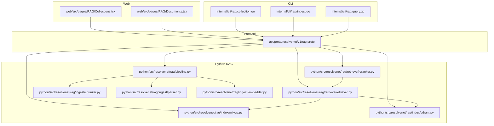
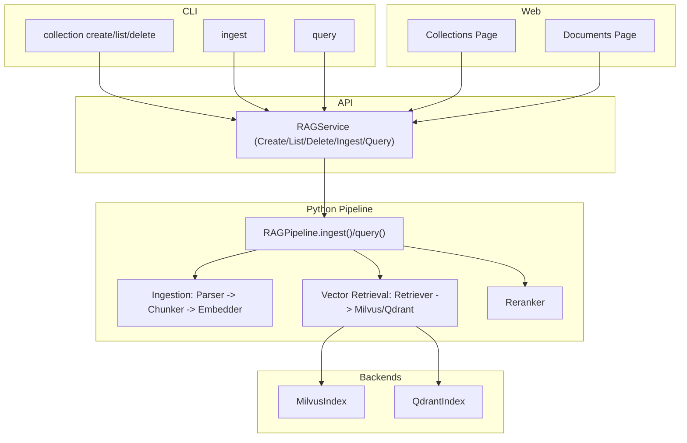
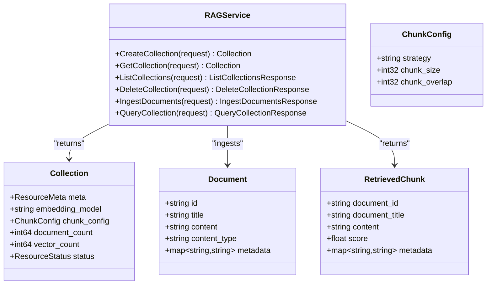
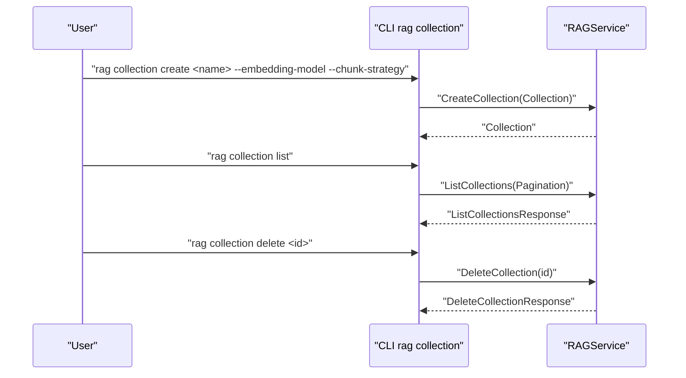
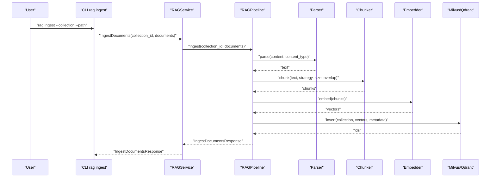
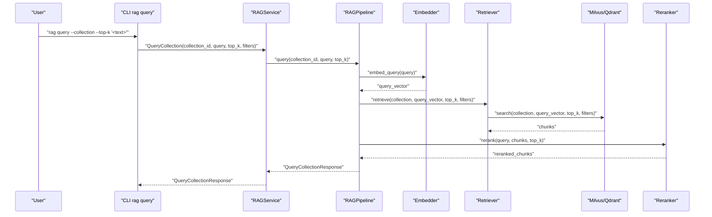
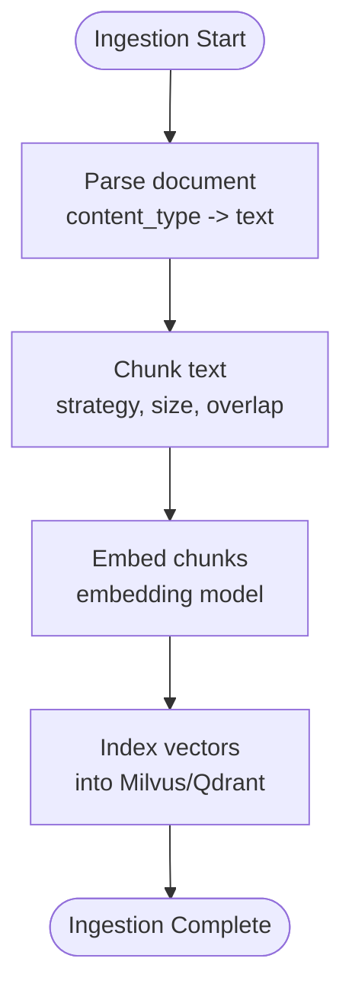
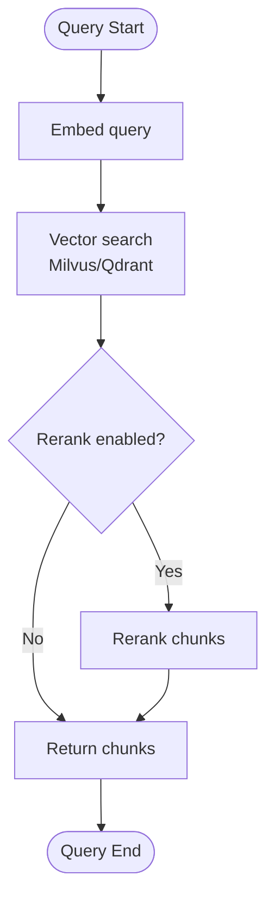
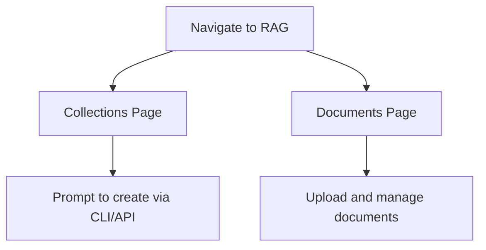
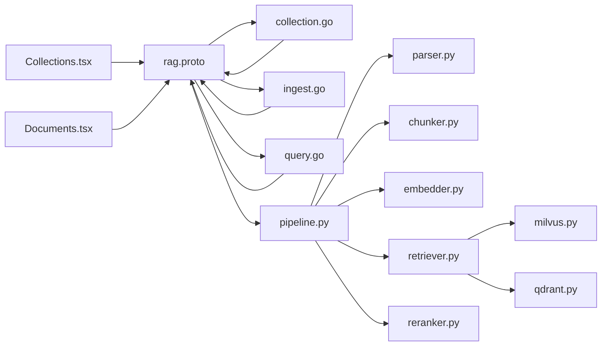

# RAG Management System

<cite>
**Referenced Files in This Document**
- [rag.proto](file://api/proto/resolvenet/v1/rag.proto)
- [collection.go](file://internal/cli/rag/collection.go)
- [ingest.go](file://internal/cli/rag/ingest.go)
- [query.go](file://internal/cli/rag/query.go)
- [pipeline.py](file://python/src/resolvenet/rag/pipeline.py)
- [milvus.py](file://python/src/resolvenet/rag/index/milvus.py)
- [qdrant.py](file://python/src/resolvenet/rag/index/qdrant.py)
- [chunker.py](file://python/src/resolvenet/rag/ingest/chunker.py)
- [parser.py](file://python/src/resolvenet/rag/ingest/parser.py)
- [embedder.py](file://python/src/resolvenet/rag/ingest/embedder.py)
- [retriever.py](file://python/src/resolvenet/rag/retrieve/retriever.py)
- [reranker.py](file://python/src/resolvenet/rag/retrieve/reranker.py)
- [Collections.tsx](file://web/src/pages/RAG/Collections.tsx)
- [Documents.tsx](file://web/src/pages/RAG/Documents.tsx)
</cite>

## Table of Contents
1. [Introduction](#introduction)
2. [Project Structure](#project-structure)
3. [Core Components](#core-components)
4. [Architecture Overview](#architecture-overview)
5. [Detailed Component Analysis](#detailed-component-analysis)
6. [Dependency Analysis](#dependency-analysis)
7. [Performance Considerations](#performance-considerations)
8. [Troubleshooting Guide](#troubleshooting-guide)
9. [Conclusion](#conclusion)
10. [Appendices](#appendices)

## Introduction
This document describes the Retrieval-Augmented Generation (RAG) management system, focusing on:
- Collections management: creation, listing, deletion, and monitoring of vector databases and document repositories
- Document management: upload, parsing, chunking, embedding, and indexing
- Collection configuration: embedding model selection and retrieval parameters
- Real-time ingestion progress tracking, validation, and error handling
- Integration with backend RAG services, file upload handling, and performance optimization for large document sets
- User workflows for building knowledge bases, managing document collections, and optimizing retrieval performance

The system is composed of:
- Protocol definitions for RAG service operations
- CLI commands for collection and ingestion management
- Python RAG pipeline orchestrating ingestion and retrieval
- Vector backends (Milvus and Qdrant)
- Ingestion modules for parsing, chunking, and embedding
- Retrieval modules for vector search and reranking

## Project Structure
The RAG system spans protocol buffers, Go CLI, Python ingestion and retrieval logic, and a React frontend.

**Diagram sources**
- [rag.proto:10-99](file://api/proto/resolvenet/v1/rag.proto#L10-L99)
- [collection.go:9-31](file://internal/cli/rag/collection.go#L9-L31)
- [ingest.go:9-27](file://internal/cli/rag/ingest.go#L9-L27)
- [query.go:9-29](file://internal/cli/rag/query.go#L9-L29)
- [pipeline.py:11-75](file://python/src/resolvenet/rag/pipeline.py#L11-L75)
- [retriever.py:11-42](file://python/src/resolvenet/rag/retrieve/retriever.py#L11-L42)
- [reranker.py:11-41](file://python/src/resolvenet/rag/retrieve/reranker.py#L11-L41)
- [milvus.py:11-54](file://python/src/resolvenet/rag/index/milvus.py#L11-L54)
- [qdrant.py:11-52](file://python/src/resolvenet/rag/index/qdrant.py#L11-L52)
- [chunker.py:6-73](file://python/src/resolvenet/rag/ingest/chunker.py#L6-L73)
- [parser.py:8-49](file://python/src/resolvenet/rag/ingest/parser.py#L8-L49)
- [embedder.py:11-49](file://python/src/resolvenet/rag/ingest/embedder.py#L11-L49)
- [Collections.tsx:1-13](file://web/src/pages/RAG/Collections.tsx#L1-L13)
- [Documents.tsx:1-13](file://web/src/pages/RAG/Documents.tsx#L1-L13)

**Section sources**
- [rag.proto:10-99](file://api/proto/resolvenet/v1/rag.proto#L10-L99)
- [collection.go:9-80](file://internal/cli/rag/collection.go#L9-L80)
- [ingest.go:9-28](file://internal/cli/rag/ingest.go#L9-L28)
- [query.go:9-30](file://internal/cli/rag/query.go#L9-L30)
- [pipeline.py:11-75](file://python/src/resolvenet/rag/pipeline.py#L11-L75)
- [milvus.py:11-54](file://python/src/resolvenet/rag/index/milvus.py#L11-L54)
- [qdrant.py:11-52](file://python/src/resolvenet/rag/index/qdrant.py#L11-L52)
- [chunker.py:6-73](file://python/src/resolvenet/rag/ingest/chunker.py#L6-L73)
- [parser.py:8-49](file://python/src/resolvenet/rag/ingest/parser.py#L8-L49)
- [embedder.py:11-49](file://python/src/resolvenet/rag/ingest/embedder.py#L11-L49)
- [retriever.py:11-42](file://python/src/resolvenet/rag/retrieve/retriever.py#L11-L42)
- [reranker.py:11-41](file://python/src/resolvenet/rag/retrieve/reranker.py#L11-L41)
- [Collections.tsx:1-13](file://web/src/pages/RAG/Collections.tsx#L1-L13)
- [Documents.tsx:1-13](file://web/src/pages/RAG/Documents.tsx#L1-L13)

## Core Components
- Protocol service and messages define the RAG API contract for creating/deleting collections, ingesting documents, and querying collections.
- CLI provides commands to manage collections and documents and to query collections.
- Python RAG pipeline orchestrates ingestion and retrieval, delegating to ingestion and retrieval modules.
- Vector backends (Milvus and Qdrant) provide persistence and similarity search.
- Ingestion modules handle parsing, chunking, and embedding.
- Retrieval modules perform vector search and optional reranking.

Key responsibilities:
- Collections management: create, list, delete, monitor status and counts
- Document ingestion: parse, chunk, embed, index, track progress and errors
- Retrieval: embed query, search vectors, optionally rerank, return ranked chunks
- Frontend pages expose collection and document management surfaces

**Section sources**
- [rag.proto:10-99](file://api/proto/resolvenet/v1/rag.proto#L10-L99)
- [collection.go:33-80](file://internal/cli/rag/collection.go#L33-L80)
- [ingest.go:9-28](file://internal/cli/rag/ingest.go#L9-L28)
- [query.go:9-30](file://internal/cli/rag/query.go#L9-L30)
- [pipeline.py:11-75](file://python/src/resolvenet/rag/pipeline.py#L11-L75)
- [milvus.py:11-54](file://python/src/resolvenet/rag/index/milvus.py#L11-L54)
- [qdrant.py:11-52](file://python/src/resolvenet/rag/index/qdrant.py#L11-L52)
- [chunker.py:6-73](file://python/src/resolvenet/rag/ingest/chunker.py#L6-L73)
- [parser.py:8-49](file://python/src/resolvenet/rag/ingest/parser.py#L8-L49)
- [embedder.py:11-49](file://python/src/resolvenet/rag/ingest/embedder.py#L11-L49)
- [retriever.py:11-42](file://python/src/resolvenet/rag/retrieve/retriever.py#L11-L42)
- [reranker.py:11-41](file://python/src/resolvenet/rag/retrieve/reranker.py#L11-L41)
- [Collections.tsx:1-13](file://web/src/pages/RAG/Collections.tsx#L1-L13)
- [Documents.tsx:1-13](file://web/src/pages/RAG/Documents.tsx#L1-L13)

## Architecture Overview
The RAG system follows a layered architecture:
- API layer: gRPC service definitions for RAG operations
- CLI layer: commands to create/list/delete collections, ingest documents, and query
- Python pipeline layer: orchestration of ingestion and retrieval
- Ingestion layer: parsing, chunking, embedding
- Retrieval layer: vector search and reranking
- Vector backends: Milvus and Qdrant
- Web UI: surfaces for collections and documents

**Diagram sources**
- [rag.proto:10-99](file://api/proto/resolvenet/v1/rag.proto#L10-L99)
- [collection.go:33-80](file://internal/cli/rag/collection.go#L33-L80)
- [ingest.go:9-28](file://internal/cli/rag/ingest.go#L9-L28)
- [query.go:9-30](file://internal/cli/rag/query.go#L9-L30)
- [pipeline.py:11-75](file://python/src/resolvenet/rag/pipeline.py#L11-L75)
- [milvus.py:11-54](file://python/src/resolvenet/rag/index/milvus.py#L11-L54)
- [qdrant.py:11-52](file://python/src/resolvenet/rag/index/qdrant.py#L11-L52)
- [retriever.py:11-42](file://python/src/resolvenet/rag/retrieve/retriever.py#L11-L42)
- [reranker.py:11-41](file://python/src/resolvenet/rag/retrieve/reranker.py#L11-L41)
- [Collections.tsx:1-13](file://web/src/pages/RAG/Collections.tsx#L1-L13)
- [Documents.tsx:1-13](file://web/src/pages/RAG/Documents.tsx#L1-L13)

## Detailed Component Analysis

### Protocol and Service Layer
- Service methods: CreateCollection, GetCollection, ListCollections, DeleteCollection, IngestDocuments, QueryCollection
- Messages: Collection, ChunkConfig, Document, RetrievedChunk, and request/response messages
- Defines embedding model, chunking configuration, document metadata, and retrieval results

**Diagram sources**
- [rag.proto:10-99](file://api/proto/resolvenet/v1/rag.proto#L10-L99)

**Section sources**
- [rag.proto:10-99](file://api/proto/resolvenet/v1/rag.proto#L10-L99)

### Collections Management (CLI)
- collection create: creates a collection with configurable embedding model and chunking strategy
- collection list: lists collections with basic stats
- collection delete: deletes a collection by ID

**Diagram sources**
- [collection.go:33-80](file://internal/cli/rag/collection.go#L33-L80)
- [rag.proto:10-99](file://api/proto/resolvenet/v1/rag.proto#L10-L99)

**Section sources**
- [collection.go:33-80](file://internal/cli/rag/collection.go#L33-L80)
- [rag.proto:55-77](file://api/proto/resolvenet/v1/rag.proto#L55-L77)

### Document Ingestion (CLI and Pipeline)
- ingest command: uploads documents from a path into a target collection
- Python pipeline: orchestrates ingestion steps and returns processed counts and errors

**Diagram sources**
- [ingest.go:9-28](file://internal/cli/rag/ingest.go#L9-L28)
- [rag.proto:78-87](file://api/proto/resolvenet/v1/rag.proto#L78-L87)
- [pipeline.py:28-51](file://python/src/resolvenet/rag/pipeline.py#L28-L51)
- [parser.py:21-32](file://python/src/resolvenet/rag/ingest/parser.py#L21-L32)
- [chunker.py:25-72](file://python/src/resolvenet/rag/ingest/chunker.py#L25-L72)
- [embedder.py:23-48](file://python/src/resolvenet/rag/ingest/embedder.py#L23-L48)
- [milvus.py:30-36](file://python/src/resolvenet/rag/index/milvus.py#L30-L36)
- [qdrant.py:29-35](file://python/src/resolvenet/rag/index/qdrant.py#L29-L35)

**Section sources**
- [ingest.go:9-28](file://internal/cli/rag/ingest.go#L9-L28)
- [rag.proto:78-87](file://api/proto/resolvenet/v1/rag.proto#L78-L87)
- [pipeline.py:28-51](file://python/src/resolvenet/rag/pipeline.py#L28-L51)
- [parser.py:21-32](file://python/src/resolvenet/rag/ingest/parser.py#L21-L32)
- [chunker.py:25-72](file://python/src/resolvenet/rag/ingest/chunker.py#L25-L72)
- [embedder.py:23-48](file://python/src/resolvenet/rag/ingest/embedder.py#L23-L48)
- [milvus.py:30-36](file://python/src/resolvenet/rag/index/milvus.py#L30-L36)
- [qdrant.py:29-35](file://python/src/resolvenet/rag/index/qdrant.py#L29-L35)

### Query and Retrieval
- query command: queries a collection with top-k results and optional filters
- Python pipeline: embeds query and retrieves chunks, optionally reranks

**Diagram sources**
- [query.go:9-30](file://internal/cli/rag/query.go#L9-L30)
- [rag.proto:89-98](file://api/proto/resolvenet/v1/rag.proto#L89-L98)
- [pipeline.py:53-74](file://python/src/resolvenet/rag/pipeline.py#L53-L74)
- [embedder.py:38-48](file://python/src/resolvenet/rag/ingest/embedder.py#L38-L48)
- [retriever.py:21-41](file://python/src/resolvenet/rag/retrieve/retriever.py#L21-L41)
- [milvus.py:38-48](file://python/src/resolvenet/rag/index/milvus.py#L38-L48)
- [qdrant.py:37-47](file://python/src/resolvenet/rag/index/qdrant.py#L37-L47)
- [reranker.py:21-40](file://python/src/resolvenet/rag/retrieve/reranker.py#L21-L40)

**Section sources**
- [query.go:9-30](file://internal/cli/rag/query.go#L9-L30)
- [rag.proto:89-98](file://api/proto/resolvenet/v1/rag.proto#L89-L98)
- [pipeline.py:53-74](file://python/src/resolvenet/rag/pipeline.py#L53-L74)
- [embedder.py:38-48](file://python/src/resolvenet/rag/ingest/embedder.py#L38-L48)
- [retriever.py:21-41](file://python/src/resolvenet/rag/retrieve/retriever.py#L21-L41)
- [milvus.py:38-48](file://python/src/resolvenet/rag/index/milvus.py#L38-L48)
- [qdrant.py:37-47](file://python/src/resolvenet/rag/index/qdrant.py#L37-L47)
- [reranker.py:21-40](file://python/src/resolvenet/rag/retrieve/reranker.py#L21-L40)

### Ingestion Pipeline Modules
- Parser: converts supported content types to plain text
- Chunker: splits text into overlapping chunks using fixed or sentence strategies
- Embedder: generates dense vectors for chunks and queries

**Diagram sources**
- [parser.py:21-48](file://python/src/resolvenet/rag/ingest/parser.py#L21-L48)
- [chunker.py:25-72](file://python/src/resolvenet/rag/ingest/chunker.py#L25-L72)
- [embedder.py:23-48](file://python/src/resolvenet/rag/ingest/embedder.py#L23-L48)
- [milvus.py:30-36](file://python/src/resolvenet/rag/index/milvus.py#L30-L36)
- [qdrant.py:29-35](file://python/src/resolvenet/rag/index/qdrant.py#L29-L35)

**Section sources**
- [parser.py:8-49](file://python/src/resolvenet/rag/ingest/parser.py#L8-L49)
- [chunker.py:6-73](file://python/src/resolvenet/rag/ingest/chunker.py#L6-L73)
- [embedder.py:11-49](file://python/src/resolvenet/rag/ingest/embedder.py#L11-L49)

### Retrieval Pipeline Modules
- Retriever: performs vector search against Milvus or Qdrant
- Reranker: optionally reranks results using a cross-encoder model

**Diagram sources**
- [embedder.py:38-48](file://python/src/resolvenet/rag/ingest/embedder.py#L38-L48)
- [retriever.py:21-41](file://python/src/resolvenet/rag/retrieve/retriever.py#L21-L41)
- [milvus.py:38-48](file://python/src/resolvenet/rag/index/milvus.py#L38-L48)
- [qdrant.py:37-47](file://python/src/resolvenet/rag/index/qdrant.py#L37-L47)
- [reranker.py:21-40](file://python/src/resolvenet/rag/retrieve/reranker.py#L21-L40)

**Section sources**
- [retriever.py:11-42](file://python/src/resolvenet/rag/retrieve/retriever.py#L11-L42)
- [reranker.py:11-41](file://python/src/resolvenet/rag/retrieve/reranker.py#L11-L41)
- [milvus.py:11-54](file://python/src/resolvenet/rag/index/milvus.py#L11-L54)
- [qdrant.py:11-52](file://python/src/resolvenet/rag/index/qdrant.py#L11-L52)

### Frontend Pages
- Collections page: displays empty state indicating no collections created yet
- Documents page: placeholder for upload and management

**Diagram sources**
- [Collections.tsx:1-13](file://web/src/pages/RAG/Collections.tsx#L1-L13)
- [Documents.tsx:1-13](file://web/src/pages/RAG/Documents.tsx#L1-L13)

**Section sources**
- [Collections.tsx:1-13](file://web/src/pages/RAG/Collections.tsx#L1-L13)
- [Documents.tsx:1-13](file://web/src/pages/RAG/Documents.tsx#L1-L13)

## Dependency Analysis
- Protocol defines the API contract consumed by CLI and Python pipeline
- CLI depends on protocol messages for requests and responses
- Python pipeline composes ingestion and retrieval modules
- Vector backends are pluggable and selected by configuration
- Frontend pages depend on API availability

**Diagram sources**
- [rag.proto:10-99](file://api/proto/resolvenet/v1/rag.proto#L10-L99)
- [collection.go:33-80](file://internal/cli/rag/collection.go#L33-L80)
- [ingest.go:9-28](file://internal/cli/rag/ingest.go#L9-L28)
- [query.go:9-30](file://internal/cli/rag/query.go#L9-L30)
- [pipeline.py:11-75](file://python/src/resolvenet/rag/pipeline.py#L11-L75)
- [parser.py:8-49](file://python/src/resolvenet/rag/ingest/parser.py#L8-L49)
- [chunker.py:6-73](file://python/src/resolvenet/rag/ingest/chunker.py#L6-L73)
- [embedder.py:11-49](file://python/src/resolvenet/rag/ingest/embedder.py#L11-L49)
- [retriever.py:11-42](file://python/src/resolvenet/rag/retrieve/retriever.py#L11-L42)
- [milvus.py:11-54](file://python/src/resolvenet/rag/index/milvus.py#L11-L54)
- [qdrant.py:11-52](file://python/src/resolvenet/rag/index/qdrant.py#L11-L52)
- [reranker.py:11-41](file://python/src/resolvenet/rag/retrieve/reranker.py#L11-L41)
- [Collections.tsx:1-13](file://web/src/pages/RAG/Collections.tsx#L1-L13)
- [Documents.tsx:1-13](file://web/src/pages/RAG/Documents.tsx#L1-L13)

**Section sources**
- [rag.proto:10-99](file://api/proto/resolvenet/v1/rag.proto#L10-L99)
- [collection.go:33-80](file://internal/cli/rag/collection.go#L33-L80)
- [ingest.go:9-28](file://internal/cli/rag/ingest.go#L9-L28)
- [query.go:9-30](file://internal/cli/rag/query.go#L9-L30)
- [pipeline.py:11-75](file://python/src/resolvenet/rag/pipeline.py#L11-L75)
- [milvus.py:11-54](file://python/src/resolvenet/rag/index/milvus.py#L11-L54)
- [qdrant.py:11-52](file://python/src/resolvenet/rag/index/qdrant.py#L11-L52)
- [chunker.py:6-73](file://python/src/resolvenet/rag/ingest/chunker.py#L6-L73)
- [parser.py:8-49](file://python/src/resolvenet/rag/ingest/parser.py#L8-L49)
- [embedder.py:11-49](file://python/src/resolvenet/rag/ingest/embedder.py#L11-L49)
- [retriever.py:11-42](file://python/src/resolvenet/rag/retrieve/retriever.py#L11-L42)
- [reranker.py:11-41](file://python/src/resolvenet/rag/retrieve/reranker.py#L11-L41)
- [Collections.tsx:1-13](file://web/src/pages/RAG/Collections.tsx#L1-L13)
- [Documents.tsx:1-13](file://web/src/pages/RAG/Documents.tsx#L1-L13)

## Performance Considerations
- Chunking strategy and overlap: tune chunk size and overlap to balance recall and cost
- Embedding model: choose models appropriate for language and performance needs
- Vector backend selection: Milvus and Qdrant offer different trade-offs; configure host/port appropriately
- Batch sizes: process documents in batches during ingestion to optimize throughput
- Reranking cost: apply reranking selectively to reduce latency for large top_k
- Indexing: ensure proper indexing parameters and periodic maintenance for large datasets
- Network and storage: colocate services and vector databases for low-latency operations

[No sources needed since this section provides general guidance]

## Troubleshooting Guide
Common issues and resolutions:
- Collection creation fails: verify embedding model and chunk configuration compatibility
- Ingestion errors: check document parsing support and chunk limits; review returned errors
- Query returns no results: adjust top_k, filters, or embedding model; verify vector backend connectivity
- Performance degradation: reduce chunk size, limit top_k, or switch to lighter reranking model

**Section sources**
- [rag.proto:78-87](file://api/proto/resolvenet/v1/rag.proto#L78-L87)
- [pipeline.py:42-51](file://python/src/resolvenet/rag/pipeline.py#L42-L51)

## Conclusion
The RAG management system provides a modular framework for building knowledge bases:
- Collections are configured with embedding models and chunking strategies
- Documents are parsed, chunked, embedded, and indexed into vector backends
- Queries leverage vector search with optional reranking
- CLI and Web UI enable operational workflows
- Extensibility allows adding new parsers, chunkers, backends, and rerankers

[No sources needed since this section summarizes without analyzing specific files]

## Appendices

### Example Workflows
- Create a collection:
  - Use the CLI to create a collection specifying embedding model and chunking strategy
  - Verify collection status and counts via list
- Upload documents:
  - Use the CLI ingest command targeting the collection and document path
  - Monitor progress and errors in the response
- Configure retrieval:
  - Set top_k and filters for queries
  - Optionally enable reranking for higher precision
- Test search:
  - Issue a query via CLI or integrate with the API
  - Review returned chunks and scores

**Section sources**
- [collection.go:33-80](file://internal/cli/rag/collection.go#L33-L80)
- [ingest.go:9-28](file://internal/cli/rag/ingest.go#L9-L28)
- [query.go:9-30](file://internal/cli/rag/query.go#L9-L30)
- [rag.proto:78-98](file://api/proto/resolvenet/v1/rag.proto#L78-L98)