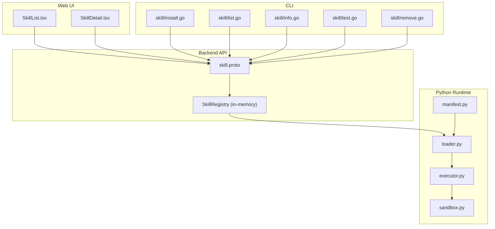
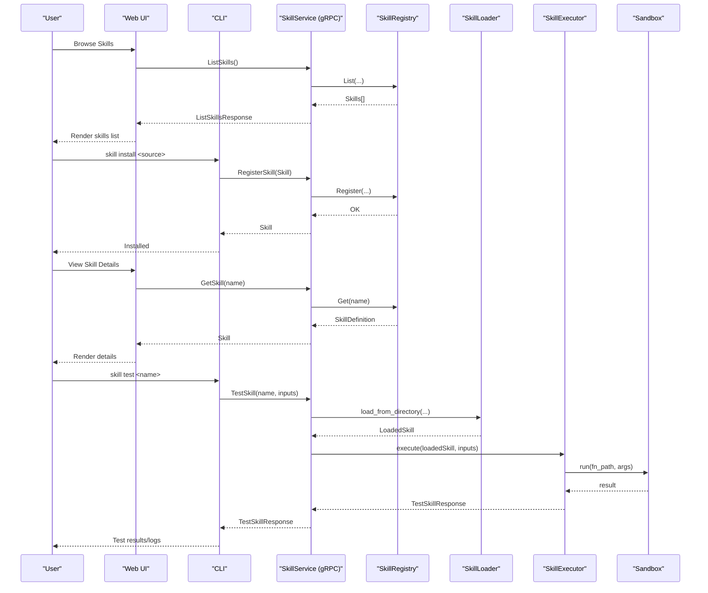
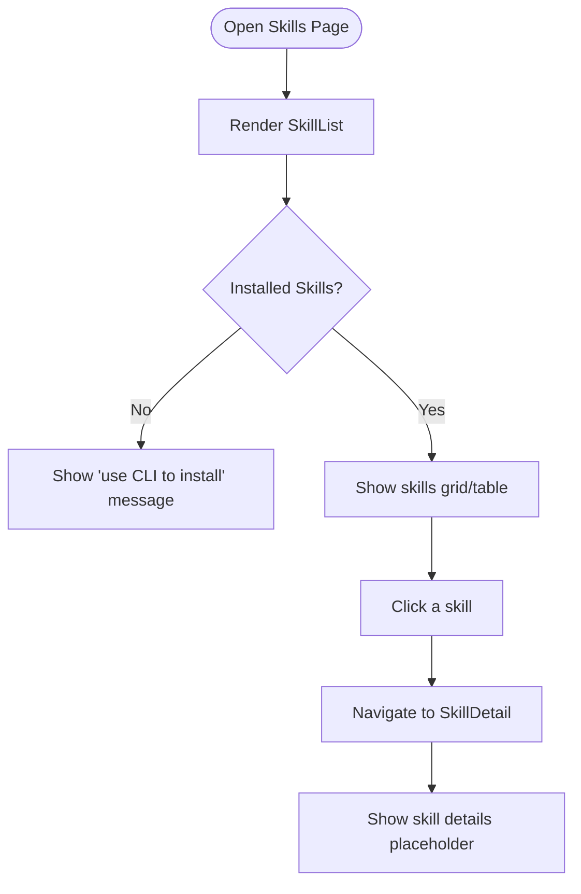
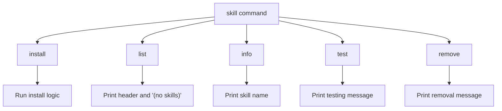
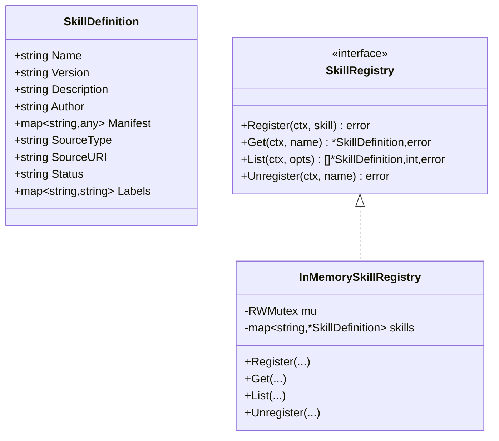
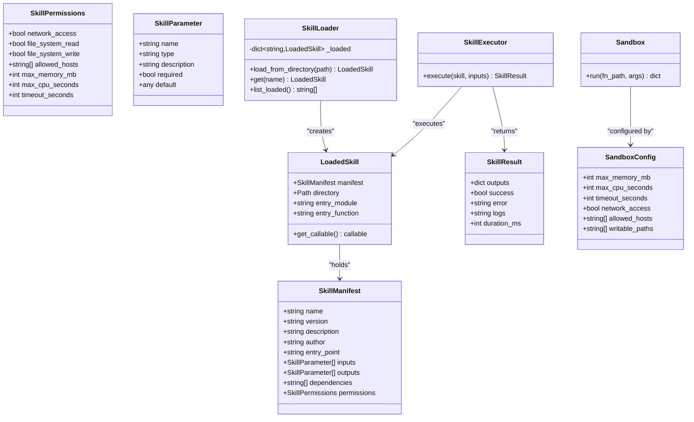
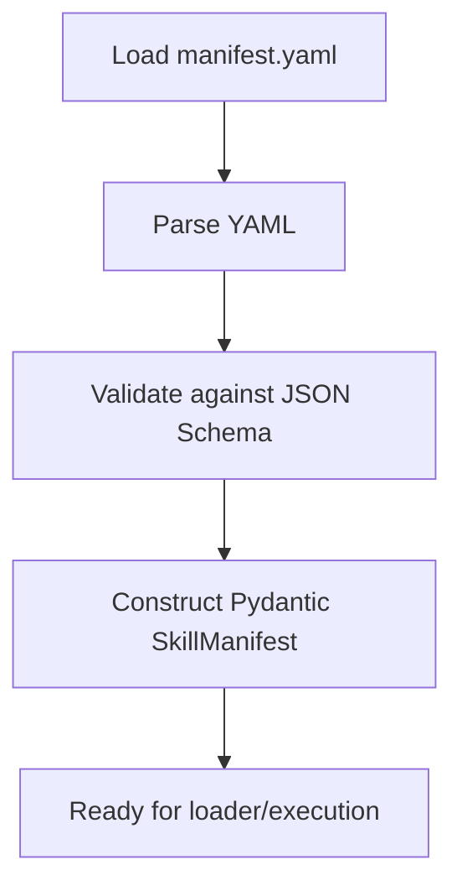
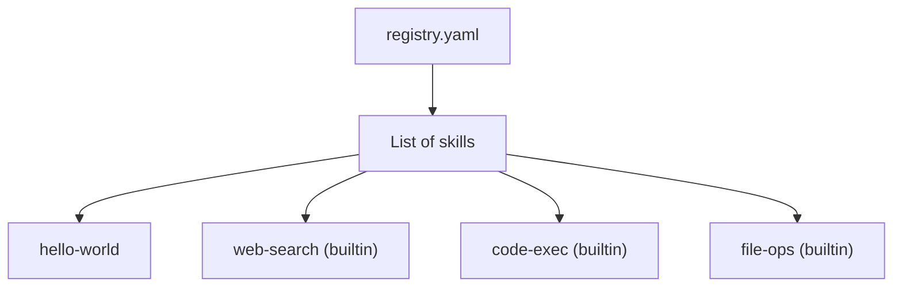
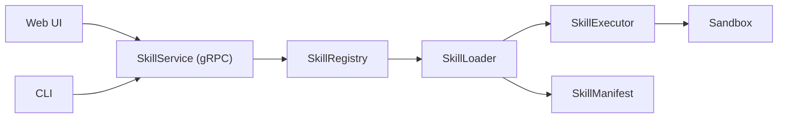

# Skills Registry Management

<cite>
**Referenced Files in This Document**
- [web/src/pages/Skills/SkillList.tsx](file://web/src/pages/Skills/SkillList.tsx)
- [web/src/pages/Skills/SkillDetail.tsx](file://web/src/pages/Skills/SkillDetail.tsx)
- [internal/cli/skill/install.go](file://internal/cli/skill/install.go)
- [internal/cli/skill/list.go](file://internal/cli/skill/list.go)
- [internal/cli/skill/info.go](file://internal/cli/skill/info.go)
- [internal/cli/skill/test.go](file://internal/cli/skill/test.go)
- [internal/cli/skill/remove.go](file://internal/cli/skill/remove.go)
- [pkg/registry/skill.go](file://pkg/registry/skill.go)
- [api/proto/resolvenet/v1/skill.proto](file://api/proto/resolvenet/v1/skill.proto)
- [skills/registry.yaml](file://skills/registry.yaml)
- [python/src/resolvenet/skills/manifest.py](file://python/src/resolvenet/skills/manifest.py)
- [python/src/resolvenet/skills/loader.py](file://python/src/resolvenet/skills/loader.py)
- [python/src/resolvenet/skills/executor.py](file://python/src/resolvenet/skills/executor.py)
- [python/src/resolvenet/skills/sandbox.py](file://python/src/resolvenet/skills/sandbox.py)
- [api/jsonschema/skill-manifest.schema.json](file://api/jsonschema/skill-manifest.schema.json)
</cite>

## Table of Contents
1. [Introduction](#introduction)
2. [Project Structure](#project-structure)
3. [Core Components](#core-components)
4. [Architecture Overview](#architecture-overview)
5. [Detailed Component Analysis](#detailed-component-analysis)
6. [Dependency Analysis](#dependency-analysis)
7. [Performance Considerations](#performance-considerations)
8. [Troubleshooting Guide](#troubleshooting-guide)
9. [Conclusion](#conclusion)
10. [Appendices](#appendices)

## Introduction
This document describes the skills registry management interface in the ResolveNet ecosystem. It covers the skills listing and detail views, CLI workflows for installation and management, backend skill registry APIs, manifest-based validation, sandboxed execution, and the integration points between the frontend Web UI and backend services. It also outlines user workflows for discovering, installing, configuring, and monitoring skills.

## Project Structure
The skills registry spans frontend UI pages, CLI commands, backend gRPC service definitions, Python skill loader and executor, and a skill manifest schema.

**Diagram sources**
- [web/src/pages/Skills/SkillList.tsx:1-11](file://web/src/pages/Skills/SkillList.tsx#L1-L11)
- [web/src/pages/Skills/SkillDetail.tsx:1-15](file://web/src/pages/Skills/SkillDetail.tsx#L1-L15)
- [internal/cli/skill/install.go:1-41](file://internal/cli/skill/install.go#L1-L41)
- [internal/cli/skill/list.go:1-23](file://internal/cli/skill/list.go#L1-L23)
- [internal/cli/skill/info.go:1-22](file://internal/cli/skill/info.go#L1-L22)
- [internal/cli/skill/test.go:1-22](file://internal/cli/skill/test.go#L1-L22)
- [internal/cli/skill/remove.go:1-22](file://internal/cli/skill/remove.go#L1-L22)
- [pkg/registry/skill.go:1-80](file://pkg/registry/skill.go#L1-L80)
- [api/proto/resolvenet/v1/skill.proto:1-101](file://api/proto/resolvenet/v1/skill.proto#L1-L101)
- [python/src/resolvenet/skills/manifest.py:1-59](file://python/src/resolvenet/skills/manifest.py#L1-L59)
- [python/src/resolvenet/skills/loader.py:1-90](file://python/src/resolvenet/skills/loader.py#L1-L90)
- [python/src/resolvenet/skills/executor.py:1-85](file://python/src/resolvenet/skills/executor.py#L1-L85)
- [python/src/resolvenet/skills/sandbox.py:1-56](file://python/src/resolvenet/skills/sandbox.py#L1-L56)

**Section sources**
- [web/src/pages/Skills/SkillList.tsx:1-11](file://web/src/pages/Skills/SkillList.tsx#L1-L11)
- [web/src/pages/Skills/SkillDetail.tsx:1-15](file://web/src/pages/Skills/SkillDetail.tsx#L1-L15)
- [internal/cli/skill/install.go:1-41](file://internal/cli/skill/install.go#L1-L41)
- [internal/cli/skill/list.go:1-23](file://internal/cli/skill/list.go#L1-L23)
- [internal/cli/skill/info.go:1-22](file://internal/cli/skill/info.go#L1-L22)
- [internal/cli/skill/test.go:1-22](file://internal/cli/skill/test.go#L1-L22)
- [internal/cli/skill/remove.go:1-22](file://internal/cli/skill/remove.go#L1-L22)
- [pkg/registry/skill.go:1-80](file://pkg/registry/skill.go#L1-L80)
- [api/proto/resolvenet/v1/skill.proto:1-101](file://api/proto/resolvenet/v1/skill.proto#L1-L101)
- [python/src/resolvenet/skills/manifest.py:1-59](file://python/src/resolvenet/skills/manifest.py#L1-L59)
- [python/src/resolvenet/skills/loader.py:1-90](file://python/src/resolvenet/skills/loader.py#L1-L90)
- [python/src/resolvenet/skills/executor.py:1-85](file://python/src/resolvenet/skills/executor.py#L1-L85)
- [python/src/resolvenet/skills/sandbox.py:1-56](file://python/src/resolvenet/skills/sandbox.py#L1-L56)

## Core Components
- Web UI pages for skills listing and detail views.
- CLI commands for installing, listing, retrieving info, testing, and removing skills.
- Backend gRPC service for registering, listing, fetching, unregistering, and testing skills.
- In-memory skill registry abstraction for development and testing.
- Python skill loader, manifest parser, executor, and sandbox for runtime execution.
- Skill manifest JSON Schema and Pydantic models for validation and typing.

**Section sources**
- [web/src/pages/Skills/SkillList.tsx:1-11](file://web/src/pages/Skills/SkillList.tsx#L1-L11)
- [web/src/pages/Skills/SkillDetail.tsx:1-15](file://web/src/pages/Skills/SkillDetail.tsx#L1-L15)
- [internal/cli/skill/install.go:1-41](file://internal/cli/skill/install.go#L1-L41)
- [internal/cli/skill/list.go:1-23](file://internal/cli/skill/list.go#L1-L23)
- [internal/cli/skill/info.go:1-22](file://internal/cli/skill/info.go#L1-L22)
- [internal/cli/skill/test.go:1-22](file://internal/cli/skill/test.go#L1-L22)
- [internal/cli/skill/remove.go:1-22](file://internal/cli/skill/remove.go#L1-L22)
- [pkg/registry/skill.go:1-80](file://pkg/registry/skill.go#L1-L80)
- [api/proto/resolvenet/v1/skill.proto:1-101](file://api/proto/resolvenet/v1/skill.proto#L1-L101)
- [python/src/resolvenet/skills/manifest.py:1-59](file://python/src/resolvenet/skills/manifest.py#L1-L59)
- [python/src/resolvenet/skills/loader.py:1-90](file://python/src/resolvenet/skills/loader.py#L1-L90)
- [python/src/resolvenet/skills/executor.py:1-85](file://python/src/resolvenet/skills/executor.py#L1-L85)
- [python/src/resolvenet/skills/sandbox.py:1-56](file://python/src/resolvenet/skills/sandbox.py#L1-L56)
- [api/jsonschema/skill-manifest.schema.json:1-74](file://api/jsonschema/skill-manifest.schema.json#L1-L74)

## Architecture Overview
The skills registry integrates a Web UI, CLI, and backend service. The CLI and Web UI communicate with the backend via gRPC. Skills are represented by manifests and loaded at runtime. Execution occurs in a sandboxed environment with resource and permission controls.

**Diagram sources**
- [api/proto/resolvenet/v1/skill.proto:10-17](file://api/proto/resolvenet/v1/skill.proto#L10-L17)
- [pkg/registry/skill.go:22-28](file://pkg/registry/skill.go#L22-L28)
- [python/src/resolvenet/skills/loader.py:15-66](file://python/src/resolvenet/skills/loader.py#L15-L66)
- [python/src/resolvenet/skills/executor.py:14-67](file://python/src/resolvenet/skills/executor.py#L14-L67)
- [python/src/resolvenet/skills/sandbox.py:23-55](file://python/src/resolvenet/skills/sandbox.py#L23-L55)
- [internal/cli/skill/install.go:26-38](file://internal/cli/skill/install.go#L26-L38)
- [internal/cli/skill/test.go:9-21](file://internal/cli/skill/test.go#L9-L21)

## Detailed Component Analysis

### Web UI: Skills Listing and Detail Views
- The listing page displays a placeholder indicating no skills are installed and suggests using the CLI to install skills.
- The detail view reads the skill name from the route params and renders a placeholder for detailed information.

**Diagram sources**
- [web/src/pages/Skills/SkillList.tsx:1-11](file://web/src/pages/Skills/SkillList.tsx#L1-L11)
- [web/src/pages/Skills/SkillDetail.tsx:1-15](file://web/src/pages/Skills/SkillDetail.tsx#L1-L15)

**Section sources**
- [web/src/pages/Skills/SkillList.tsx:1-11](file://web/src/pages/Skills/SkillList.tsx#L1-L11)
- [web/src/pages/Skills/SkillDetail.tsx:1-15](file://web/src/pages/Skills/SkillDetail.tsx#L1-L15)

### CLI: Skills Management Commands
- Install: Registers a skill from a source (local path, git, OCI, registry).
- List: Lists installed skills (placeholder output).
- Info: Retrieves skill details by name (placeholder).
- Test: Executes a skill in isolation (placeholder).
- Remove: Unregisters/removes a skill by name (placeholder).

**Diagram sources**
- [internal/cli/skill/install.go:1-41](file://internal/cli/skill/install.go#L1-L41)
- [internal/cli/skill/list.go:1-23](file://internal/cli/skill/list.go#L1-L23)
- [internal/cli/skill/info.go:1-22](file://internal/cli/skill/info.go#L1-L22)
- [internal/cli/skill/test.go:1-22](file://internal/cli/skill/test.go#L1-L22)
- [internal/cli/skill/remove.go:1-22](file://internal/cli/skill/remove.go#L1-L22)

**Section sources**
- [internal/cli/skill/install.go:1-41](file://internal/cli/skill/install.go#L1-L41)
- [internal/cli/skill/list.go:1-23](file://internal/cli/skill/list.go#L1-L23)
- [internal/cli/skill/info.go:1-22](file://internal/cli/skill/info.go#L1-L22)
- [internal/cli/skill/test.go:1-22](file://internal/cli/skill/test.go#L1-L22)
- [internal/cli/skill/remove.go:1-22](file://internal/cli/skill/remove.go#L1-L22)

### Backend: Skill Registry and gRPC API
- SkillDefinition captures metadata, manifest, source type/URI, and status.
- SkillRegistry interface defines register, get, list, unregister operations.
- InMemorySkillRegistry provides a development-friendly implementation.
- SkillService gRPC service exposes RegisterSkill, GetSkill, ListSkills, UnregisterSkill, TestSkill RPCs.

**Diagram sources**
- [pkg/registry/skill.go:9-28](file://pkg/registry/skill.go#L9-L28)
- [pkg/registry/skill.go:30-80](file://pkg/registry/skill.go#L30-L80)

**Section sources**
- [pkg/registry/skill.go:1-80](file://pkg/registry/skill.go#L1-L80)
- [api/proto/resolvenet/v1/skill.proto:10-17](file://api/proto/resolvenet/v1/skill.proto#L10-L17)

### Python Runtime: Manifest, Loader, Executor, Sandbox
- SkillManifest validates and parses skill metadata, parameters, dependencies, and permissions.
- SkillLoader discovers and loads skills from directories, imports entry points, and caches loaded instances.
- SkillExecutor executes loaded skills, measures duration, and aggregates results or errors.
- SandboxConfig and Sandbox define resource limits, network policies, and filesystem restrictions; current implementation logs a placeholder.

**Diagram sources**
- [python/src/resolvenet/skills/manifest.py:11-44](file://python/src/resolvenet/skills/manifest.py#L11-L44)
- [python/src/resolvenet/skills/loader.py:15-90](file://python/src/resolvenet/skills/loader.py#L15-L90)
- [python/src/resolvenet/skills/executor.py:14-85](file://python/src/resolvenet/skills/executor.py#L14-L85)
- [python/src/resolvenet/skills/sandbox.py:11-56](file://python/src/resolvenet/skills/sandbox.py#L11-L56)

**Section sources**
- [python/src/resolvenet/skills/manifest.py:1-59](file://python/src/resolvenet/skills/manifest.py#L1-L59)
- [python/src/resolvenet/skills/loader.py:1-90](file://python/src/resolvenet/skills/loader.py#L1-L90)
- [python/src/resolvenet/skills/executor.py:1-85](file://python/src/resolvenet/skills/executor.py#L1-L85)
- [python/src/resolvenet/skills/sandbox.py:1-56](file://python/src/resolvenet/skills/sandbox.py#L1-L56)

### Skill Manifest Validation and Schema
- The JSON Schema enforces required fields (name, version, entry_point), semantic versioning, parameter types, and permissions defaults.
- The Python Pydantic model mirrors the schema for runtime validation and typed access.

**Diagram sources**
- [api/jsonschema/skill-manifest.schema.json:1-74](file://api/jsonschema/skill-manifest.schema.json#L1-L74)
- [python/src/resolvenet/skills/manifest.py:47-59](file://python/src/resolvenet/skills/manifest.py#L47-L59)

**Section sources**
- [api/jsonschema/skill-manifest.schema.json:1-74](file://api/jsonschema/skill-manifest.schema.json#L1-L74)
- [python/src/resolvenet/skills/manifest.py:1-59](file://python/src/resolvenet/skills/manifest.py#L1-L59)

### Community Skill Registry
- The registry file enumerates community skills, including built-in skills and example skills with metadata and paths.

**Diagram sources**
- [skills/registry.yaml:1-24](file://skills/registry.yaml#L1-L24)

**Section sources**
- [skills/registry.yaml:1-24](file://skills/registry.yaml#L1-L24)

## Dependency Analysis
- Frontend depends on the backend gRPC service for listing, fetching, and testing skills.
- CLI commands depend on the backend gRPC service for registration and testing.
- Backend registry abstraction decouples storage from service logic.
- Python loader depends on manifest validation; executor and sandbox encapsulate runtime safety.

**Diagram sources**
- [api/proto/resolvenet/v1/skill.proto:10-17](file://api/proto/resolvenet/v1/skill.proto#L10-L17)
- [pkg/registry/skill.go:22-28](file://pkg/registry/skill.go#L22-L28)
- [python/src/resolvenet/skills/loader.py:15-66](file://python/src/resolvenet/skills/loader.py#L15-L66)
- [python/src/resolvenet/skills/executor.py:14-67](file://python/src/resolvenet/skills/executor.py#L14-L67)
- [python/src/resolvenet/skills/sandbox.py:23-55](file://python/src/resolvenet/skills/sandbox.py#L23-L55)
- [python/src/resolvenet/skills/manifest.py:33-44](file://python/src/resolvenet/skills/manifest.py#L33-L44)

**Section sources**
- [api/proto/resolvenet/v1/skill.proto:1-101](file://api/proto/resolvenet/v1/skill.proto#L1-L101)
- [pkg/registry/skill.go:1-80](file://pkg/registry/skill.go#L1-L80)
- [python/src/resolvenet/skills/loader.py:1-90](file://python/src/resolvenet/skills/loader.py#L1-L90)
- [python/src/resolvenet/skills/executor.py:1-85](file://python/src/resolvenet/skills/executor.py#L1-L85)
- [python/src/resolvenet/skills/sandbox.py:1-56](file://python/src/resolvenet/skills/sandbox.py#L1-L56)
- [python/src/resolvenet/skills/manifest.py:1-59](file://python/src/resolvenet/skills/manifest.py#L1-L59)

## Performance Considerations
- Execution timing: The executor measures duration in milliseconds to capture performance characteristics.
- Resource limits: Sandbox configuration defines CPU seconds, memory MB, and timeouts to prevent resource exhaustion.
- Manifest validation: Early validation prevents runtime failures due to malformed manifests.
- Caching: The loader caches loaded skills by name to avoid repeated imports during execution.

[No sources needed since this section provides general guidance]

## Troubleshooting Guide
- No skills installed: The Web UI lists page indicates no skills are installed and suggests using the CLI.
- Placeholder outputs: CLI list/info/test/remove commands currently print placeholders; implement backend integration to surface real data.
- Sandbox not implemented: The sandbox returns a placeholder status; implement subprocess isolation with resource limits and network restrictions.
- Execution errors: The executor wraps exceptions and records error messages and durations; inspect logs and error fields for diagnostics.

**Section sources**
- [web/src/pages/Skills/SkillList.tsx:5-7](file://web/src/pages/Skills/SkillList.tsx#L5-L7)
- [internal/cli/skill/list.go:14-20](file://internal/cli/skill/list.go#L14-L20)
- [internal/cli/skill/info.go:14-19](file://internal/cli/skill/info.go#L14-L19)
- [internal/cli/skill/test.go:14-19](file://internal/cli/skill/test.go#L14-L19)
- [internal/cli/skill/remove.go:14-19](file://internal/cli/skill/remove.go#L14-L19)
- [python/src/resolvenet/skills/sandbox.py:45-55](file://python/src/resolvenet/skills/sandbox.py#L45-L55)
- [python/src/resolvenet/skills/executor.py:57-66](file://python/src/resolvenet/skills/executor.py#L57-L66)

## Conclusion
The skills registry management interface integrates a Web UI, CLI, and backend gRPC service with a Python runtime stack that validates manifests, loads skills, and executes them in a sandboxed environment. While several components are placeholders, the architecture supports future development of real-time installation progress, dependency resolution, and comprehensive skill lifecycle management.

[No sources needed since this section summarizes without analyzing specific files]

## Appendices

### User Workflows
- Discovering skills: Browse the skills list in the Web UI or review the community registry file.
- Installing skills: Use the CLI install command with a source (local path, git, OCI, registry).
- Configuring skill parameters: Define inputs in the skill manifest; the executor validates and runs with provided inputs.
- Monitoring skill performance: Inspect execution duration and logs returned by the executor; configure resource limits via sandbox settings.

[No sources needed since this section provides general guidance]