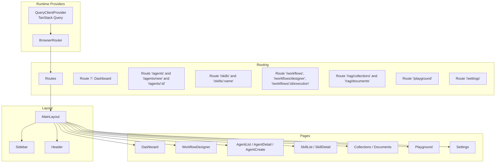
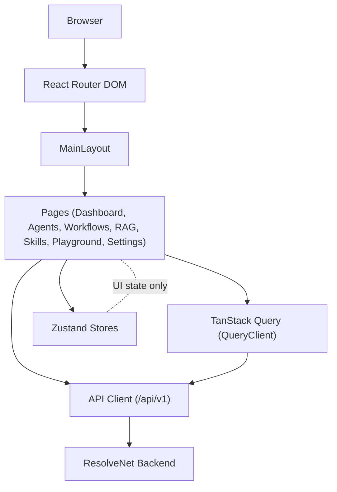
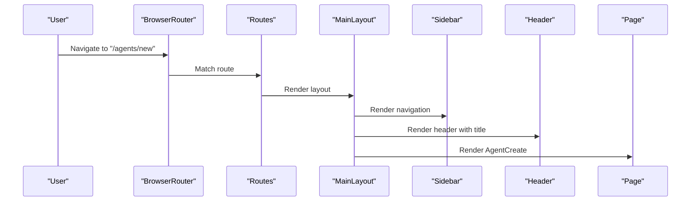
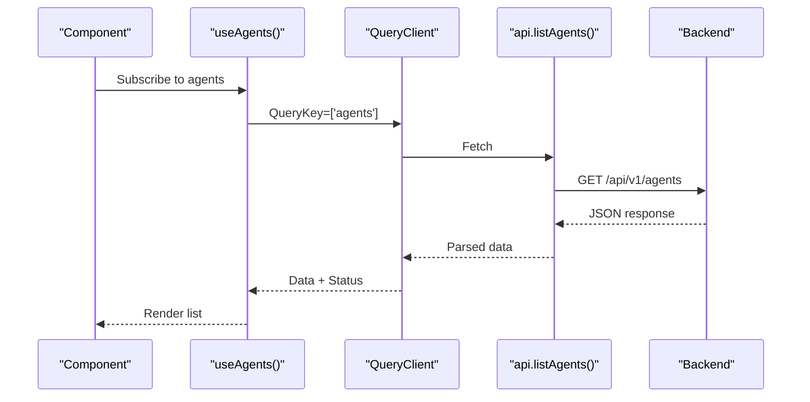
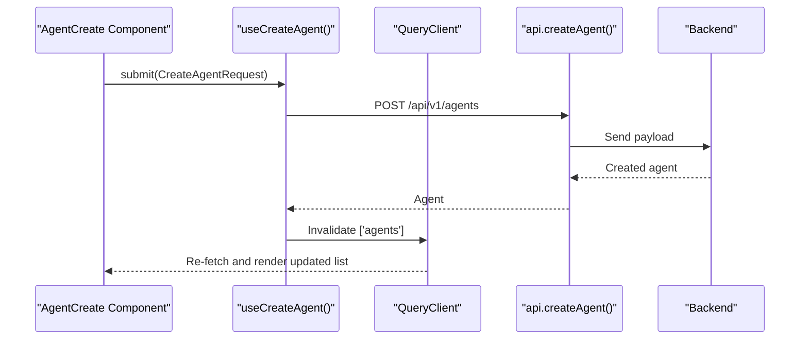
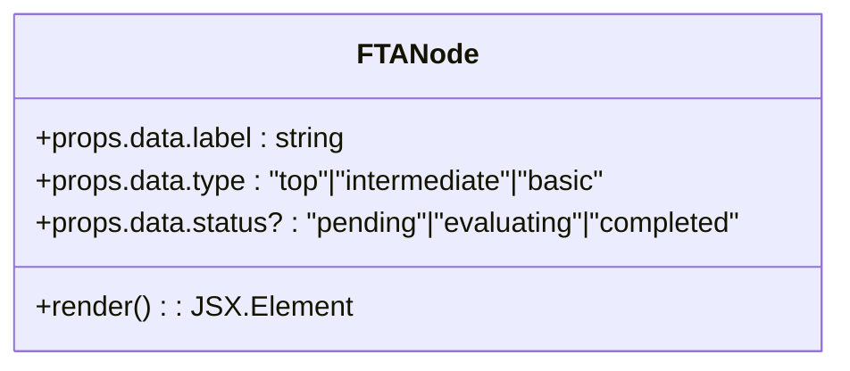
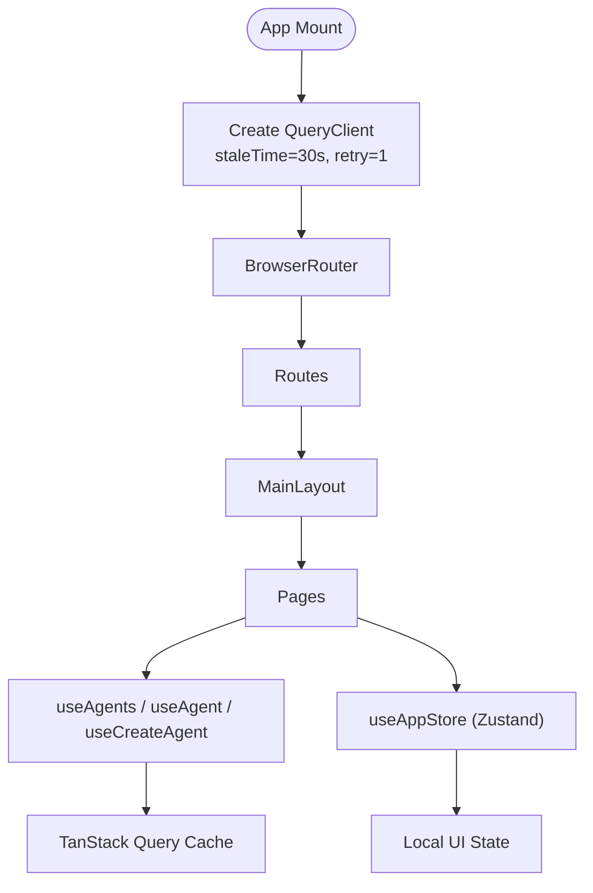
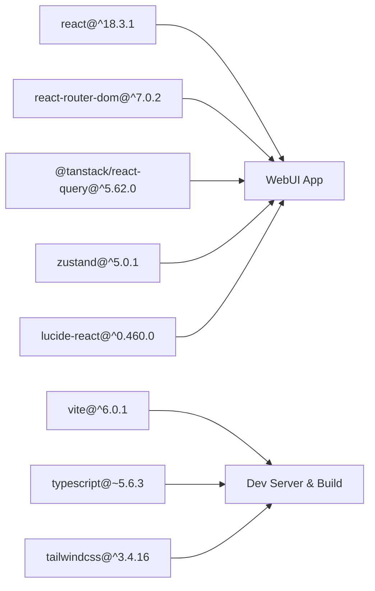

# WebUI Management Console

<cite>
**Referenced Files in This Document**
- [web/src/main.tsx](file://web/src/main.tsx)
- [web/src/App.tsx](file://web/src/App.tsx)
- [web/src/components/Layout/MainLayout.tsx](file://web/src/components/Layout/MainLayout.tsx)
- [web/src/components/Layout/Header.tsx](file://web/src/components/Layout/Header.tsx)
- [web/src/components/Layout/Sidebar.tsx](file://web/src/components/Layout/Sidebar.tsx)
- [web/src/pages/Dashboard/index.tsx](file://web/src/pages/Dashboard/index.tsx)
- [web/src/pages/Workflows/WorkflowDesigner.tsx](file://web/src/pages/Workflows/WorkflowDesigner.tsx)
- [web/src/components/TreeEditor/FTANode.tsx](file://web/src/components/TreeEditor/FTANode.tsx)
- [web/src/api/client.ts](file://web/src/api/client.ts)
- [web/src/hooks/useAgents.ts](file://web/src/hooks/useAgents.ts)
- [web/src/stores/app.ts](file://web/src/stores/app.ts)
- [web/src/types/index.ts](file://web/src/types/index.ts)
- [web/package.json](file://web/package.json)
- [web/tsconfig.json](file://web/tsconfig.json)
- [web/vite.config.ts](file://web/vite.config.ts)
</cite>

## Table of Contents
1. [Introduction](#introduction)
2. [Project Structure](#project-structure)
3. [Core Components](#core-components)
4. [Architecture Overview](#architecture-overview)
5. [Detailed Component Analysis](#detailed-component-analysis)
6. [Dependency Analysis](#dependency-analysis)
7. [Performance Considerations](#performance-considerations)
8. [Troubleshooting Guide](#troubleshooting-guide)
9. [Conclusion](#conclusion)
10. [Appendices](#appendices)

## Introduction
This document describes the React-based WebUI management console for the ResolveNet platform. It covers the application architecture built with React 18 and TypeScript, component structure, routing, state management patterns, and integration with the backend API. It also documents the main pages (dashboard, agents, FTA workflow designer, playground, RAG collections, skills registry), real-time data synchronization via TanStack Query, local state management with Zustand, UI design principles, accessibility, and common user workflows.

## Project Structure
The WebUI is a Vite-powered React 18 application with TypeScript. It uses Tailwind CSS for styling, Lucide icons for UI icons, and integrates TanStack Query for caching and mutations. Routing is handled by React Router DOM v7. The project follows a feature-based organization under web/src with dedicated folders for pages, components, hooks, stores, and types.

**Diagram sources**
- [web/src/main.tsx:8-25](file://web/src/main.tsx#L8-L25)
- [web/src/App.tsx:17-37](file://web/src/App.tsx#L17-L37)
- [web/src/components/Layout/MainLayout.tsx:9-21](file://web/src/components/Layout/MainLayout.tsx#L9-L21)
- [web/src/components/Layout/Sidebar.tsx:22-56](file://web/src/components/Layout/Sidebar.tsx#L22-L56)
- [web/src/components/Layout/Header.tsx:14-29](file://web/src/components/Layout/Header.tsx#L14-L29)

**Section sources**
- [web/src/main.tsx:1-26](file://web/src/main.tsx#L1-L26)
- [web/src/App.tsx:1-38](file://web/src/App.tsx#L1-L38)
- [web/package.json:15-42](file://web/package.json#L15-L42)
- [web/vite.config.ts:1-22](file://web/vite.config.ts#L1-L22)

## Core Components
- Application bootstrap initializes TanStack Query with a default stale time and retry policy, wraps the app in a router, and renders the root App component.
- App defines routes for all major sections: dashboard, agents, skills, workflows, RAG, playground, and settings.
- MainLayout composes Sidebar and Header and provides a scrollable content area for routed pages.
- API client encapsulates HTTP requests to the backend with a base path and shared JSON handling.
- TanStack Query hooks manage agent data fetching, caching, and mutations.
- Zustand store manages lightweight UI state such as sidebar visibility and selected agent ID.
- Types define domain models for agents, skills, workflows, RAG collections, and FTA structures.

**Section sources**
- [web/src/main.tsx:8-25](file://web/src/main.tsx#L8-L25)
- [web/src/App.tsx:17-37](file://web/src/App.tsx#L17-L37)
- [web/src/components/Layout/MainLayout.tsx:9-21](file://web/src/components/Layout/MainLayout.tsx#L9-L21)
- [web/src/api/client.ts:20-48](file://web/src/api/client.ts#L20-L48)
- [web/src/hooks/useAgents.ts:4-28](file://web/src/hooks/useAgents.ts#L4-L28)
- [web/src/stores/app.ts:10-15](file://web/src/stores/app.ts#L10-L15)
- [web/src/types/index.ts:1-72](file://web/src/types/index.ts#L1-L72)

## Architecture Overview
The WebUI uses a layered architecture:
- Presentation Layer: React components organized by pages and shared layout components.
- State Layer: TanStack Query for remote data and Zustand for local UI state.
- Service Layer: API client module abstracting HTTP calls to the backend.
- Routing Layer: React Router DOM v7 orchestrates navigation and nested layouts.

**Diagram sources**
- [web/src/main.tsx:8-25](file://web/src/main.tsx#L8-L25)
- [web/src/App.tsx:17-37](file://web/src/App.tsx#L17-L37)
- [web/src/components/Layout/MainLayout.tsx:9-21](file://web/src/components/Layout/MainLayout.tsx#L9-L21)
- [web/src/api/client.ts:1-18](file://web/src/api/client.ts#L1-L18)

## Detailed Component Analysis

### Routing and Navigation
- The App component defines routes for:
  - Dashboard, Agents (list, create, detail), Skills (list, detail), Workflows (list, designer, execution), RAG (collections, documents), Playground, and Settings.
- MainLayout composes Sidebar and Header and provides a content area for routes.
- Sidebar highlights the active route and links to each section.
- Header displays the current page title derived from the route.

**Diagram sources**
- [web/src/App.tsx:17-37](file://web/src/App.tsx#L17-L37)
- [web/src/components/Layout/MainLayout.tsx:9-21](file://web/src/components/Layout/MainLayout.tsx#L9-L21)
- [web/src/components/Layout/Sidebar.tsx:22-56](file://web/src/components/Layout/Sidebar.tsx#L22-L56)
- [web/src/components/Layout/Header.tsx:14-29](file://web/src/components/Layout/Header.tsx#L14-L29)

**Section sources**
- [web/src/App.tsx:17-37](file://web/src/App.tsx#L17-L37)
- [web/src/components/Layout/MainLayout.tsx:9-21](file://web/src/components/Layout/MainLayout.tsx#L9-L21)
- [web/src/components/Layout/Sidebar.tsx:22-56](file://web/src/components/Layout/Sidebar.tsx#L22-L56)
- [web/src/components/Layout/Header.tsx:14-29](file://web/src/components/Layout/Header.tsx#L14-L29)

### Dashboard Overview
- The dashboard presents summary cards for system metrics and recent activity areas.
- It uses a responsive grid layout and placeholder content for recent executions and system events.

**Section sources**
- [web/src/pages/Dashboard/index.tsx:10-43](file://web/src/pages/Dashboard/index.tsx#L10-L43)

### Agent Management
- Agent list, detail, and creation are supported by TanStack Query hooks and the API client.
- useAgents provides paginated agent listings.
- useAgent fetches a single agent by ID with lazy enabling.
- useCreateAgent performs mutation and invalidates agent cache on success.
- The API client exposes endpoints for listing, retrieving, creating, and deleting agents.

**Diagram sources**
- [web/src/hooks/useAgents.ts:4-9](file://web/src/hooks/useAgents.ts#L4-L9)
- [web/src/api/client.ts:24-30](file://web/src/api/client.ts#L24-L30)

**Diagram sources**
- [web/src/hooks/useAgents.ts:19-28](file://web/src/hooks/useAgents.ts#L19-L28)
- [web/src/api/client.ts:27-30](file://web/src/api/client.ts#L27-L30)

**Section sources**
- [web/src/hooks/useAgents.ts:4-28](file://web/src/hooks/useAgents.ts#L4-L28)
- [web/src/api/client.ts:24-30](file://web/src/api/client.ts#L24-L30)

### FTA Workflow Designer
- The designer page declares a container for a visual editor and includes placeholder content indicating drag-and-drop functionality.
- The FTA node component renders nodes with type and status-specific styling and memoization for performance.

**Diagram sources**
- [web/src/components/TreeEditor/FTANode.tsx:11-36](file://web/src/components/TreeEditor/FTANode.tsx#L11-L36)

**Section sources**
- [web/src/pages/Workflows/WorkflowDesigner.tsx:3-24](file://web/src/pages/Workflows/WorkflowDesigner.tsx#L3-L24)
- [web/src/components/TreeEditor/FTANode.tsx:11-36](file://web/src/components/TreeEditor/FTANode.tsx#L11-L36)

### RAG Collections Management
- The API client exposes a listing endpoint for RAG collections.
- The collections page is registered in routing and can leverage TanStack Query for data fetching.

**Section sources**
- [web/src/api/client.ts:40-41](file://web/src/api/client.ts#L40-L41)
- [web/src/App.tsx:30-31](file://web/src/App.tsx#L30-L31)

### Skills Registry
- The API client exposes a listing endpoint for skills.
- The skills list and detail pages are registered in routing and can be wired to TanStack Query.

**Section sources**
- [web/src/api/client.ts:32-33](file://web/src/api/client.ts#L32-L33)
- [web/src/App.tsx:25-26](file://web/src/App.tsx#L25-L26)

### Playground
- The playground route is registered and can host interactive chat or experimentation UI.

**Section sources**
- [web/src/App.tsx:32-33](file://web/src/App.tsx#L32-L33)

### Settings
- The settings route is registered for configuration and preferences.

**Section sources**
- [web/src/App.tsx:33-34](file://web/src/App.tsx#L33-L34)

### State Management Patterns
- TanStack Query:
  - Queries: ['agents'], ['agents', id]
  - Mutations: createAgent
  - Cache invalidation: after successful create, invalidate agent list
- Zustand:
  - UI store: sidebarOpen, selectedAgentId, actions to toggle and select

**Diagram sources**
- [web/src/main.tsx:8-15](file://web/src/main.tsx#L8-L15)
- [web/src/hooks/useAgents.ts:4-28](file://web/src/hooks/useAgents.ts#L4-L28)
- [web/src/stores/app.ts:10-15](file://web/src/stores/app.ts#L10-L15)

**Section sources**
- [web/src/main.tsx:8-15](file://web/src/main.tsx#L8-L15)
- [web/src/hooks/useAgents.ts:4-28](file://web/src/hooks/useAgents.ts#L4-L28)
- [web/src/stores/app.ts:10-15](file://web/src/stores/app.ts#L10-L15)

### Backend API Integration
- Base path: /api/v1
- Methods:
  - Health check
  - Agents: list, get, create, delete
  - Skills: list
  - Workflows: list
  - RAG Collections: list
  - System info
- Error handling: Non-OK responses throw an error with a message extracted from the body or status text.

**Section sources**
- [web/src/api/client.ts:1-18](file://web/src/api/client.ts#L1-L18)
- [web/src/api/client.ts:20-48](file://web/src/api/client.ts#L20-L48)

### UI Component Library and Design Principles
- Icons: Lucide React
- Styling: Tailwind CSS with a dark theme and glass-like header
- Responsive layout: Grid and flex utilities for adaptive content areas
- Accessibility: Semantic HTML and focus-friendly navigation; ensure keyboard navigation and screen reader support when extending components

**Section sources**
- [web/package.json:15-22](file://web/package.json#L15-L22)
- [web/src/components/Layout/Header.tsx:18-27](file://web/src/components/Layout/Header.tsx#L18-L27)
- [web/src/components/Layout/Sidebar.tsx:26-50](file://web/src/components/Layout/Sidebar.tsx#L26-L50)
- [web/src/pages/Dashboard/index.tsx:13-28](file://web/src/pages/Dashboard/index.tsx#L13-L28)

## Dependency Analysis
- Runtime dependencies include React 18, React Router DOM v7, TanStack React Query v5, Zustand v5, and Lucide React.
- Build and dev dependencies include Vite, TypeScript, Tailwind CSS, ESLint, and Vitest.
- Aliasing: Path alias @ resolves to src for clean imports.

**Diagram sources**
- [web/package.json:15-42](file://web/package.json#L15-L42)

**Section sources**
- [web/package.json:15-42](file://web/package.json#L15-L42)
- [web/tsconfig.json:1-26](file://web/tsconfig.json#L1-L26)
- [web/vite.config.ts:7-11](file://web/vite.config.ts#L7-L11)

## Performance Considerations
- TanStack Query defaults:
  - Stale time: 30 seconds to balance freshness and network usage
  - Retry attempts: 1 to avoid excessive retries on transient failures
- Memoized components: FTANode uses memoization to prevent unnecessary re-renders.
- Lazy loading: Enable route-based code splitting via React.lazy and Suspense for heavy pages.
- Virtualization: For large lists (agents, workflows), consider virtualizing rows.
- Image and asset optimization: Compress assets and defer non-critical resources.
- Bundle analysis: Use Vite’s analyzer plugin to inspect bundle composition.

**Section sources**
- [web/src/main.tsx:8-15](file://web/src/main.tsx#L8-L15)
- [web/src/components/TreeEditor/FTANode.tsx:36](file://web/src/components/TreeEditor/FTANode.tsx#L36)

## Troubleshooting Guide
- Network errors:
  - Verify the proxy configuration in development to forward /api to the backend service.
  - Confirm the API base path and endpoint correctness.
- Query errors:
  - TanStack Query throws on non-OK responses; catch and surface user-friendly messages.
  - Use queryClient.resetQueries or refetch to recover from transient failures.
- Local state issues:
  - Zustand store updates are synchronous; ensure actions are pure and idempotent.
- Routing issues:
  - Ensure routes match the intended paths and nested layouts are applied consistently.

**Section sources**
- [web/vite.config.ts:14-19](file://web/vite.config.ts#L14-L19)
- [web/src/api/client.ts:12-18](file://web/src/api/client.ts#L12-L18)
- [web/src/stores/app.ts:10-15](file://web/src/stores/app.ts#L10-L15)

## Conclusion
The WebUI management console leverages modern React 18 and TypeScript with a clean separation of concerns. Routing, layout, and state management are clearly structured, enabling scalable development. TanStack Query handles remote data efficiently, while Zustand manages lightweight UI state. The design system emphasizes responsiveness and accessibility, and the API client provides a consistent contract to the backend. Extending pages, adding new routes, and integrating additional domain models follows established patterns.

## Appendices

### Common User Workflows

- Designing Fault Trees
  - Navigate to the workflow designer page.
  - Use drag-and-drop to add events and gates; visualize the FTA structure.
  - Save or export the tree using future integrations.

- Managing Agent Configurations
  - List agents, view details, and create new agents using the form.
  - On creation, the agent list cache is invalidated and refreshed automatically.

- Executing Workflows
  - Browse workflows, open the execution view, and trigger runs.
  - Observe live updates via polling or WebSocket subscriptions (future enhancement).

- Monitoring System Performance
  - Use the dashboard to track system metrics and recent activity.
  - Integrate charts and real-time indicators as needed.

[No sources needed since this section provides general guidance]