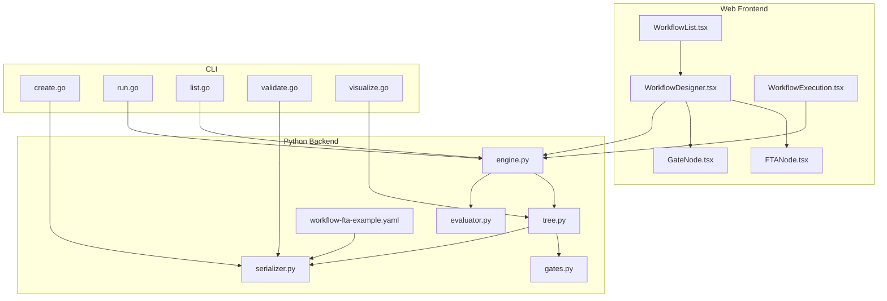
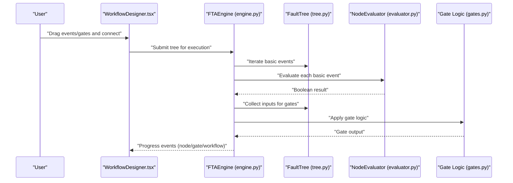
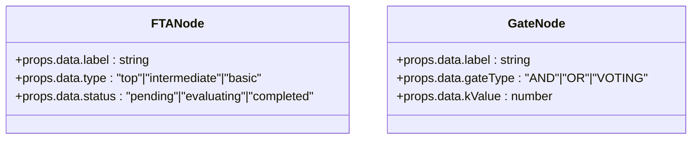
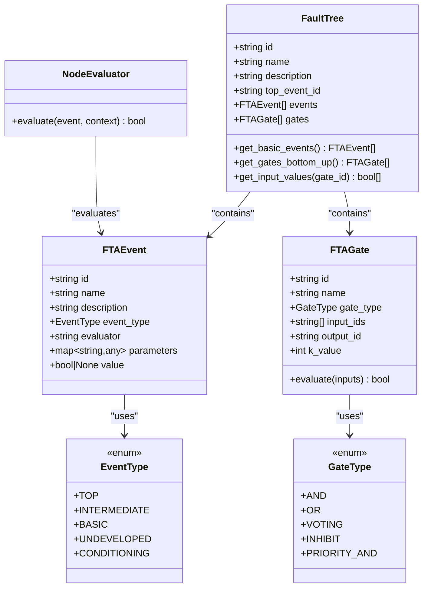
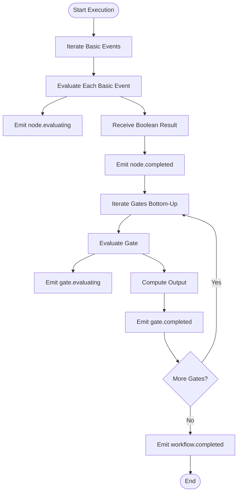
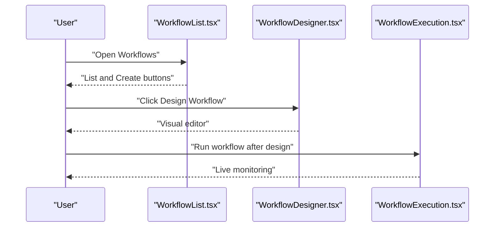
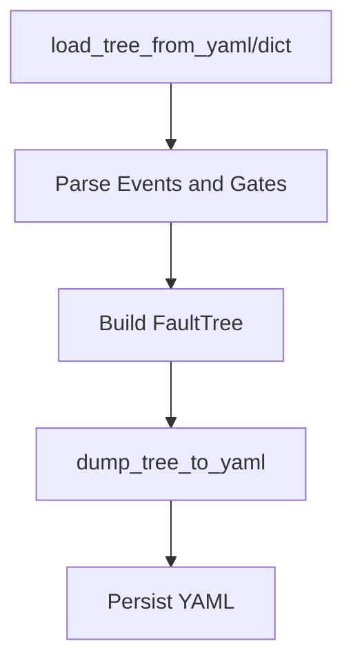
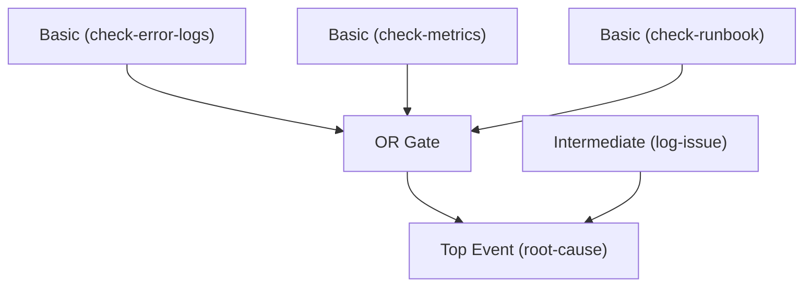
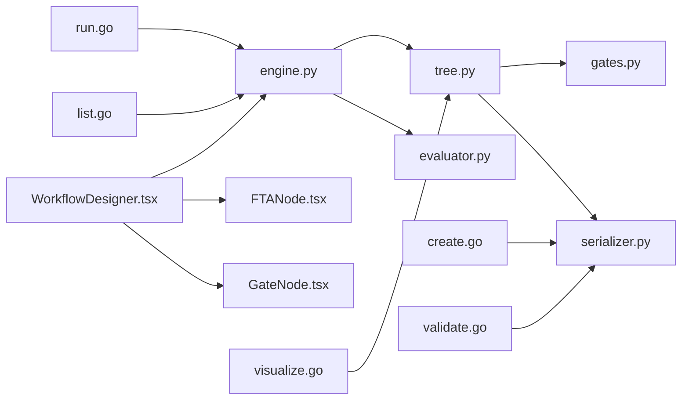

# Workflow Designer and Editor

<cite>
**Referenced Files in This Document**
- [WorkflowDesigner.tsx](file://web/src/pages/Workflows/WorkflowDesigner.tsx)
- [FTANode.tsx](file://web/src/components/TreeEditor/FTANode.tsx)
- [GateNode.tsx](file://web/src/components/TreeEditor/GateNode.tsx)
- [WorkflowList.tsx](file://web/src/pages/Workflows/WorkflowList.tsx)
- [WorkflowExecution.tsx](file://web/src/pages/Workflows/WorkflowExecution.tsx)
- [engine.py](file://python/src/resolvenet/fta/engine.py)
- [tree.py](file://python/src/resolvenet/fta/tree.py)
- [gates.py](file://python/src/resolvenet/fta/gates.py)
- [evaluator.py](file://python/src/resolvenet/fta/evaluator.py)
- [serializer.py](file://python/src/resolvenet/fta/serializer.py)
- [workflow-fta-example.yaml](file://configs/examples/workflow-fta-example.yaml)
- [create.go](file://internal/cli/workflow/create.go)
- [run.go](file://internal/cli/workflow/run.go)
- [list.go](file://internal/cli/workflow/list.go)
- [validate.go](file://internal/cli/workflow/validate.go)
- [visualize.go](file://internal/cli/workflow/visualize.go)
</cite>

## Table of Contents
1. [Introduction](#introduction)
2. [Project Structure](#project-structure)
3. [Core Components](#core-components)
4. [Architecture Overview](#architecture-overview)
5. [Detailed Component Analysis](#detailed-component-analysis)
6. [Dependency Analysis](#dependency-analysis)
7. [Performance Considerations](#performance-considerations)
8. [Troubleshooting Guide](#troubleshooting-guide)
9. [Conclusion](#conclusion)
10. [Appendices](#appendices)

## Introduction
This document describes the Fault Tree Analysis (FTA) workflow designer and editor system. It covers the drag-and-drop interface for building fault trees, node types (events and gates), connection patterns, workflow list management, execution monitoring, and real-time progress tracking. It also documents the tree editor components (FTANode and GateNode), node manipulation, validation rules, and serialization. The document explains the workflow execution interface with step-by-step progress, result visualization, and error reporting, and provides examples for designing complex fault trees, configuring gate parameters, and validating workflow logic. Finally, it outlines integration with the backend FTA engine, real-time collaboration features, and data persistence patterns, along with user workflows for designing, testing, and deploying FTA workflows.

## Project Structure
The FTA system spans frontend React components for the designer/editor and backend Python modules for execution and persistence. The CLI provides workflow lifecycle commands.

**Diagram sources**
- [WorkflowDesigner.tsx:1-25](file://web/src/pages/Workflows/WorkflowDesigner.tsx#L1-L25)
- [FTANode.tsx:1-37](file://web/src/components/TreeEditor/FTANode.tsx#L1-L37)
- [GateNode.tsx:1-27](file://web/src/components/TreeEditor/GateNode.tsx#L1-L27)
- [WorkflowList.tsx:1-23](file://web/src/pages/Workflows/WorkflowList.tsx#L1-L23)
- [WorkflowExecution.tsx:1-17](file://web/src/pages/Workflows/WorkflowExecution.tsx#L1-L17)
- [engine.py:1-83](file://python/src/resolvenet/fta/engine.py#L1-L83)
- [tree.py:1-120](file://python/src/resolvenet/fta/tree.py#L1-L120)
- [evaluator.py:1-74](file://python/src/resolvenet/fta/evaluator.py#L1-L74)
- [gates.py:1-29](file://python/src/resolvenet/fta/gates.py#L1-L29)
- [serializer.py:1-113](file://python/src/resolvenet/fta/serializer.py#L1-L113)
- [workflow-fta-example.yaml:1-50](file://configs/examples/workflow-fta-example.yaml#L1-L50)
- [create.go:1-45](file://internal/cli/workflow/create.go#L1-L45)
- [run.go:1-22](file://internal/cli/workflow/run.go#L1-L22)
- [list.go:1-23](file://internal/cli/workflow/list.go#L1-L23)
- [validate.go:1-24](file://internal/cli/workflow/validate.go#L1-L24)
- [visualize.go:1-27](file://internal/cli/workflow/visualize.go#L1-L27)

**Section sources**
- [WorkflowDesigner.tsx:1-25](file://web/src/pages/Workflows/WorkflowDesigner.tsx#L1-L25)
- [WorkflowList.tsx:1-23](file://web/src/pages/Workflows/WorkflowList.tsx#L1-L23)
- [WorkflowExecution.tsx:1-17](file://web/src/pages/Workflows/WorkflowExecution.tsx#L1-L17)
- [engine.py:1-83](file://python/src/resolvenet/fta/engine.py#L1-L83)
- [tree.py:1-120](file://python/src/resolvenet/fta/tree.py#L1-L120)
- [serializer.py:1-113](file://python/src/resolvenet/fta/serializer.py#L1-L113)
- [workflow-fta-example.yaml:1-50](file://configs/examples/workflow-fta-example.yaml#L1-L50)
- [create.go:1-45](file://internal/cli/workflow/create.go#L1-L45)
- [run.go:1-22](file://internal/cli/workflow/run.go#L1-L22)
- [list.go:1-23](file://internal/cli/workflow/list.go#L1-L23)
- [validate.go:1-24](file://internal/cli/workflow/validate.go#L1-L24)
- [visualize.go:1-27](file://internal/cli/workflow/visualize.go#L1-L27)

## Core Components
- Frontend designer/editor:
  - FTANode renders event nodes with type and status styling.
  - GateNode renders logical gates with type and optional k-value.
  - WorkflowDesigner integrates the visual editor area.
- Backend execution engine:
  - FTAEngine orchestrates evaluation and yields progress events.
  - FaultTree encapsulates events, gates, and traversal helpers.
  - NodeEvaluator resolves basic events via skills, RAG, LLM, or defaults.
  - Gate logic is implemented in gates.py and used by FaultTree.
  - Serializer loads and dumps YAML definitions to/from FaultTree.

**Section sources**
- [FTANode.tsx:1-37](file://web/src/components/TreeEditor/FTANode.tsx#L1-L37)
- [GateNode.tsx:1-27](file://web/src/components/TreeEditor/GateNode.tsx#L1-L27)
- [WorkflowDesigner.tsx:1-25](file://web/src/pages/Workflows/WorkflowDesigner.tsx#L1-L25)
- [engine.py:14-83](file://python/src/resolvenet/fta/engine.py#L14-L83)
- [tree.py:30-120](file://python/src/resolvenet/fta/tree.py#L30-L120)
- [evaluator.py:13-74](file://python/src/resolvenet/fta/evaluator.py#L13-L74)
- [gates.py:6-29](file://python/src/resolvenet/fta/gates.py#L6-L29)
- [serializer.py:12-113](file://python/src/resolvenet/fta/serializer.py#L12-L113)

## Architecture Overview
The system separates concerns across frontend and backend:
- Frontend handles visualization and user interaction (drag-and-drop, node editing).
- Backend executes FTA workflows and streams progress events.
- Persistence is handled via YAML serialization/deserialization.
- CLI supports lifecycle operations (create, run, list, validate, visualize).

**Diagram sources**
- [WorkflowDesigner.tsx:1-25](file://web/src/pages/Workflows/WorkflowDesigner.tsx#L1-L25)
- [engine.py:24-83](file://python/src/resolvenet/fta/engine.py#L24-L83)
- [tree.py:82-120](file://python/src/resolvenet/fta/tree.py#L82-L120)
- [evaluator.py:23-74](file://python/src/resolvenet/fta/evaluator.py#L23-L74)
- [gates.py:6-29](file://python/src/resolvenet/fta/gates.py#L6-L29)

## Detailed Component Analysis

### Frontend: Tree Editor Components
- FTANode
  - Purpose: Render event nodes with type and status indicators.
  - Props: label, type (top, intermediate, basic), optional status (pending, evaluating, completed).
  - Styling: Uses color-coded borders and backgrounds per type/status.
- GateNode
  - Purpose: Render logical gates with symbol and type.
  - Props: label, gateType (AND, OR, VOTING), optional kValue.
  - Rendering: Displays gate symbol and type label.

**Diagram sources**
- [FTANode.tsx:3-9](file://web/src/components/TreeEditor/FTANode.tsx#L3-L9)
- [GateNode.tsx:3-9](file://web/src/components/TreeEditor/GateNode.tsx#L3-L9)

**Section sources**
- [FTANode.tsx:1-37](file://web/src/components/TreeEditor/FTANode.tsx#L1-L37)
- [GateNode.tsx:1-27](file://web/src/components/TreeEditor/GateNode.tsx#L1-L27)

### Backend: Fault Tree Data Model and Evaluation
- Event Types and Gate Types
  - EventType enumerates supported event categories.
  - GateType enumerates supported logical gates.
- FTAEvent
  - Fields: id, name, description, event_type, evaluator, parameters, value.
  - Used to represent leaf/basic events.
- FTAGate
  - Fields: id, name, gate_type, input_ids, output_id, k_value.
  - Methods: evaluate(inputs) applies gate logic.
- FaultTree
  - Fields: id, name, description, top_event_id, events[], gates[].
  - Helpers: get_basic_events(), get_gates_bottom_up(), get_input_values().
- Gate Logic
  - and_gate, or_gate, voting_gate, inhibit_gate, priority_and_gate.
- NodeEvaluator
  - Resolves basic events via skill, rag, llm, or defaults.
- Serialization
  - load_tree_from_yaml/dict and dump_tree_to_yaml convert between YAML and FaultTree.

**Diagram sources**
- [tree.py:10-120](file://python/src/resolvenet/fta/tree.py#L10-L120)
- [gates.py:6-29](file://python/src/resolvenet/fta/gates.py#L6-L29)
- [evaluator.py:13-74](file://python/src/resolvenet/fta/evaluator.py#L13-L74)

**Section sources**
- [tree.py:10-120](file://python/src/resolvenet/fta/tree.py#L10-L120)
- [gates.py:6-29](file://python/src/resolvenet/fta/gates.py#L6-L29)
- [evaluator.py:13-74](file://python/src/resolvenet/fta/evaluator.py#L13-L74)
- [serializer.py:12-113](file://python/src/resolvenet/fta/serializer.py#L12-L113)

### Execution Engine and Progress Streaming
- FTAEngine.execute
  - Iterates basic events and yields node.evaluating/node.completed events.
  - Iterates gates bottom-up and yields gate.evaluating/gate.completed events.
  - Yields workflow.started and workflow.completed events.
- Bottom-up ordering
  - get_gates_bottom_up currently returns reversed gates; a topological sort is noted as TODO.

**Diagram sources**
- [engine.py:24-83](file://python/src/resolvenet/fta/engine.py#L24-L83)
- [tree.py:103-120](file://python/src/resolvenet/fta/tree.py#L103-L120)

**Section sources**
- [engine.py:14-83](file://python/src/resolvenet/fta/engine.py#L14-L83)
- [tree.py:82-120](file://python/src/resolvenet/fta/tree.py#L82-L120)

### Workflow List Management and Execution Monitoring
- WorkflowList
  - Provides a link to the designer page and indicates empty state.
- WorkflowExecution
  - Shows execution monitoring placeholder with live highlighting.
- CLI Commands
  - create: creates a workflow from a YAML file.
  - run: executes a workflow (streaming gRPC planned).
  - list: lists workflows (placeholder).
  - validate: validates a workflow definition (placeholder).
  - visualize: renders a tree in the terminal (ASCII placeholder).

**Diagram sources**
- [WorkflowList.tsx:4-22](file://web/src/pages/Workflows/WorkflowList.tsx#L4-L22)
- [WorkflowDesigner.tsx:3-24](file://web/src/pages/Workflows/WorkflowDesigner.tsx#L3-L24)
- [WorkflowExecution.tsx:3-16](file://web/src/pages/Workflows/WorkflowExecution.tsx#L3-L16)

**Section sources**
- [WorkflowList.tsx:1-23](file://web/src/pages/Workflows/WorkflowList.tsx#L1-L23)
- [WorkflowExecution.tsx:1-17](file://web/src/pages/Workflows/WorkflowExecution.tsx#L1-L17)
- [create.go:26-44](file://internal/cli/workflow/create.go#L26-L44)
- [run.go:9-21](file://internal/cli/workflow/run.go#L9-L21)
- [list.go:9-22](file://internal/cli/workflow/list.go#L9-L22)
- [validate.go:9-23](file://internal/cli/workflow/validate.go#L9-L23)
- [visualize.go:9-26](file://internal/cli/workflow/visualize.go#L9-L26)

### Validation Rules and Serialization
- Validation
  - Validate command prints “Workflow is valid.” (placeholder).
  - Serialization ensures presence of required fields and correct enums.
- Serialization
  - load_tree_from_yaml/dict parses YAML into FaultTree.
  - dump_tree_to_yaml serializes FaultTree to YAML.

**Diagram sources**
- [serializer.py:12-113](file://python/src/resolvenet/fta/serializer.py#L12-L113)
- [tree.py:30-91](file://python/src/resolvenet/fta/tree.py#L30-L91)

**Section sources**
- [validate.go:9-23](file://internal/cli/workflow/validate.go#L9-L23)
- [serializer.py:12-113](file://python/src/resolvenet/fta/serializer.py#L12-L113)
- [tree.py:30-91](file://python/src/resolvenet/fta/tree.py#L30-L91)

### Examples: Designing Complex Fault Trees and Configuring Gates
- Example YAML structure demonstrates:
  - Top-level top event.
  - Intermediate and basic events.
  - Basic events with evaluators and parameters.
  - Logical OR gate connecting multiple inputs to the top event.
- Gate configuration:
  - AND/OR/VOTING gates with optional k_value for VOTING.
  - Inputs and outputs define connectivity.

**Diagram sources**
- [workflow-fta-example.yaml:9-50](file://configs/examples/workflow-fta-example.yaml#L9-L50)
- [tree.py:44-53](file://python/src/resolvenet/fta/tree.py#L44-L53)

**Section sources**
- [workflow-fta-example.yaml:1-50](file://configs/examples/workflow-fta-example.yaml#L1-L50)
- [tree.py:44-53](file://python/src/resolvenet/fta/tree.py#L44-L53)

## Dependency Analysis
- Frontend depends on:
  - FTANode and GateNode for rendering.
  - FTAEngine for execution orchestration.
- Backend depends on:
  - FaultTree for structure.
  - NodeEvaluator for basic event resolution.
  - Gate logic for propagation.
  - Serializer for persistence.
- CLI depends on:
  - Serializer for loading definitions.
  - Engine for execution.

**Diagram sources**
- [WorkflowDesigner.tsx:1-25](file://web/src/pages/Workflows/WorkflowDesigner.tsx#L1-L25)
- [FTANode.tsx:1-37](file://web/src/components/TreeEditor/FTANode.tsx#L1-L37)
- [GateNode.tsx:1-27](file://web/src/components/TreeEditor/GateNode.tsx#L1-L27)
- [engine.py:1-83](file://python/src/resolvenet/fta/engine.py#L1-L83)
- [tree.py:1-120](file://python/src/resolvenet/fta/tree.py#L1-L120)
- [evaluator.py:1-74](file://python/src/resolvenet/fta/evaluator.py#L1-L74)
- [gates.py:1-29](file://python/src/resolvenet/fta/gates.py#L1-L29)
- [serializer.py:1-113](file://python/src/resolvenet/fta/serializer.py#L1-L113)
- [create.go:1-45](file://internal/cli/workflow/create.go#L1-L45)
- [run.go:1-22](file://internal/cli/workflow/run.go#L1-L22)
- [list.go:1-23](file://internal/cli/workflow/list.go#L1-L23)
- [validate.go:1-24](file://internal/cli/workflow/validate.go#L1-L24)
- [visualize.go:1-27](file://internal/cli/workflow/visualize.go#L1-L27)

**Section sources**
- [engine.py:14-83](file://python/src/resolvenet/fta/engine.py#L14-L83)
- [tree.py:82-120](file://python/src/resolvenet/fta/tree.py#L82-L120)
- [serializer.py:12-113](file://python/src/resolvenet/fta/serializer.py#L12-L113)

## Performance Considerations
- Evaluation order:
  - Basic events are evaluated first; gates are processed bottom-up.
  - get_gates_bottom_up currently uses a reversed list; a topological sort would improve correctness and performance for large trees.
- Asynchronous streaming:
  - Execution yields progress events incrementally, enabling responsive UI updates.
- Gate logic:
  - Simple boolean operations; performance is dominated by external evaluations (skills/RAG/LLM).
- Serialization:
  - YAML parsing/serialization is straightforward; consider caching parsed trees for repeated runs.

[No sources needed since this section provides general guidance]

## Troubleshooting Guide
- Empty workflow list:
  - The list view indicates no workflows; use the designer to create one.
- Execution monitoring:
  - Execution page shows a placeholder; ensure backend is configured to stream events.
- Validation:
  - Validate command prints a success message; ensure YAML conforms to schema.
- YAML parsing:
  - Serialization expects required fields; missing fields will cause parse errors.
- Gate evaluation:
  - If gates appear stuck, verify input connections and event values.

**Section sources**
- [WorkflowList.tsx:17-19](file://web/src/pages/Workflows/WorkflowList.tsx#L17-L19)
- [WorkflowExecution.tsx:9-13](file://web/src/pages/Workflows/WorkflowExecution.tsx#L9-L13)
- [validate.go:14-20](file://internal/cli/workflow/validate.go#L14-L20)
- [serializer.py:26-70](file://python/src/resolvenet/fta/serializer.py#L26-L70)

## Conclusion
The FTA workflow designer and editor system combines a React-based visual editor with a robust Python execution engine. The frontend provides intuitive drag-and-drop editing with styled nodes, while the backend performs asynchronous evaluation and streams progress events. Serialization enables persistence via YAML, and the CLI supports lifecycle operations. Future enhancements include improved gate ordering, real-time collaboration hooks, and full backend integration for streaming execution and collaborative editing.

[No sources needed since this section summarizes without analyzing specific files]

## Appendices

### User Workflows
- Designing:
  - Open the designer, drag events and gates, connect inputs/outputs, configure gate parameters (e.g., VOTING k-value).
- Testing:
  - Save the workflow, validate the definition, and run locally or via CLI.
- Deploying:
  - Persist the YAML, integrate with backend execution, and monitor progress in the execution UI.

[No sources needed since this section provides general guidance]