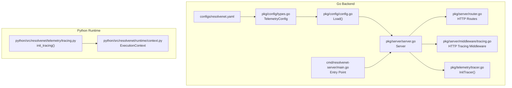
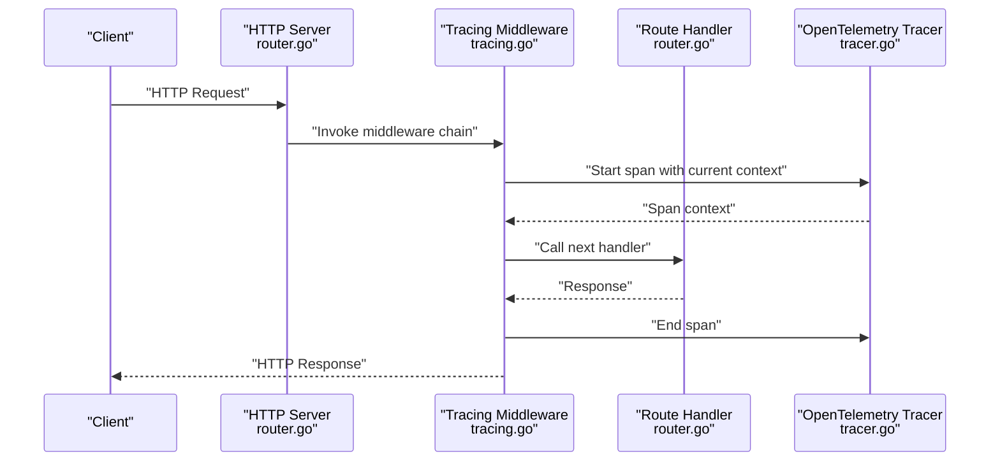
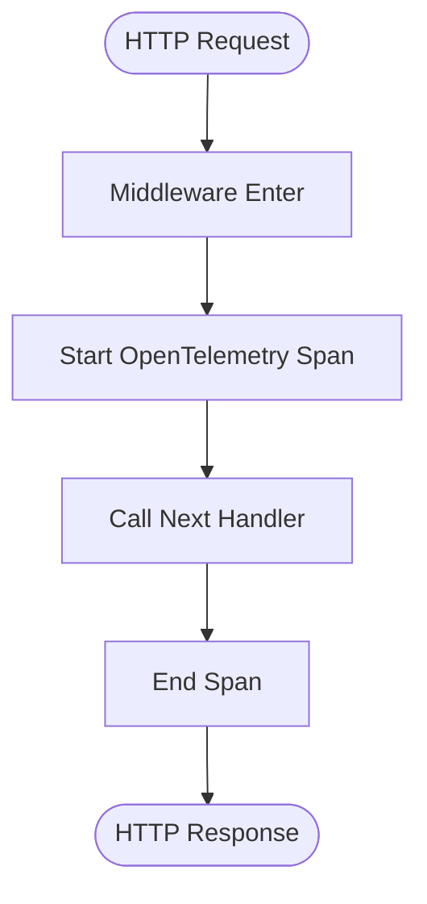
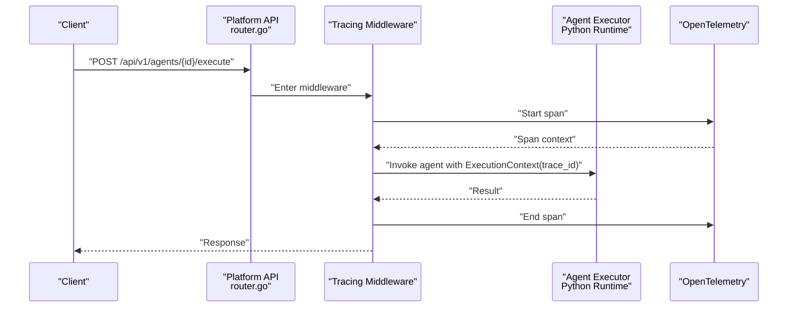
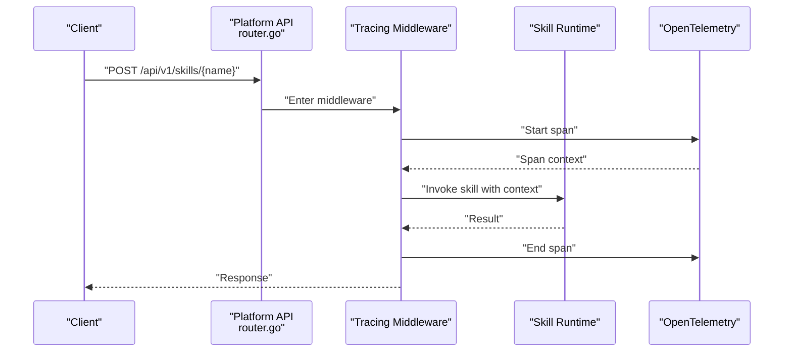
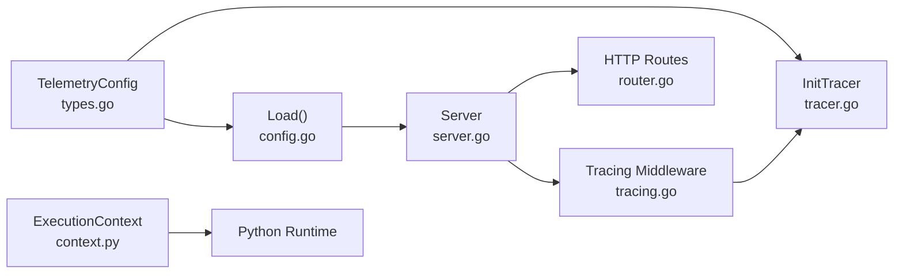

# Distributed Tracing

<cite>
**Referenced Files in This Document**
- [tracer.go](file://pkg/telemetry/tracer.go)
- [tracing.go](file://pkg/server/middleware/tracing.go)
- [resolvenet.yaml](file://configs/resolvenet.yaml)
- [types.go](file://pkg/config/types.go)
- [config.go](file://pkg/config/config.go)
- [server.go](file://pkg/server/server.go)
- [router.go](file://pkg/server/router.go)
- [main.go](file://cmd/resolvenet-server/main.go)
- [tracing.py](file://python/src/resolvenet/telemetry/tracing.py)
- [context.py](file://python/src/resolvenet/runtime/context.py)
</cite>

## Table of Contents
1. [Introduction](#introduction)
2. [Project Structure](#project-structure)
3. [Core Components](#core-components)
4. [Architecture Overview](#architecture-overview)
5. [Detailed Component Analysis](#detailed-component-analysis)
6. [Dependency Analysis](#dependency-analysis)
7. [Performance Considerations](#performance-considerations)
8. [Troubleshooting Guide](#troubleshooting-guide)
9. [Conclusion](#conclusion)
10. [Appendices](#appendices)

## Introduction
This document describes ResolveNet’s distributed tracing implementation using OpenTelemetry. It explains how trace context propagates across microservices via HTTP headers and gRPC metadata, how spans are created for incoming requests, internal processing, and outbound calls, and how to configure tracing across development, staging, and production environments. It also covers integration points for automatic instrumentation of HTTP handlers and gRPC services, trace visualization guidance, and operational practices for retention, performance, and troubleshooting.

## Project Structure
ResolveNet’s tracing-related code is primarily located under:
- Go backend: pkg/telemetry for tracer initialization, pkg/server/middleware for HTTP tracing middleware, pkg/config for configuration, and cmd/resolvenet-server for process entry point.
- Python runtime: python/src/resolvenet/telemetry for tracing setup and python/src/resolvenet/runtime/context.py for trace context propagation into agent execution.

**Diagram sources**
- [resolvenet.yaml:29-34](file://configs/resolvenet.yaml#L29-L34)
- [types.go:63-69](file://pkg/config/types.go#L63-L69)
- [config.go:11-62](file://pkg/config/config.go#L11-L62)
- [server.go:27-52](file://pkg/server/server.go#L27-L52)
- [router.go:11-55](file://pkg/server/router.go#L11-L55)
- [tracing.go:7-18](file://pkg/server/middleware/tracing.go#L7-L18)
- [tracer.go:8-21](file://pkg/telemetry/tracer.go#L8-L21)
- [main.go:16-55](file://cmd/resolvenet-server/main.go#L16-L55)
- [tracing.py:10-25](file://python/src/resolvenet/telemetry/tracing.py#L10-L25)
- [context.py:18-32](file://python/src/resolvenet/runtime/context.py#L18-L32)

**Section sources**
- [resolvenet.yaml:1-34](file://configs/resolvenet.yaml#L1-L34)
- [types.go:63-69](file://pkg/config/types.go#L63-L69)
- [config.go:11-62](file://pkg/config/config.go#L11-L62)
- [server.go:27-52](file://pkg/server/server.go#L27-L52)
- [router.go:11-55](file://pkg/server/router.go#L11-L55)
- [tracing.go:7-18](file://pkg/server/middleware/tracing.go#L7-L18)
- [tracer.go:8-21](file://pkg/telemetry/tracer.go#L8-L21)
- [main.go:16-55](file://cmd/resolvenet-server/main.go#L16-L55)
- [tracing.py:10-25](file://python/src/resolvenet/telemetry/tracing.py#L10-L25)
- [context.py:18-32](file://python/src/resolvenet/runtime/context.py#L18-L32)

## Core Components
- Telemetry configuration: TelemetryConfig defines whether tracing is enabled, the OTLP endpoint, service name, and metrics toggle.
- Tracer initialization: InitTracer is the placeholder for initializing the OpenTelemetry tracer provider and exporter.
- HTTP tracing middleware: Tracing middleware wraps HTTP handlers to create spans around request processing.
- Server wiring: The Server composes HTTP and gRPC servers and registers routes and middleware.
- Python runtime tracing: Python tracing setup and runtime context carry trace identifiers into agent execution.

Key responsibilities:
- Centralized configuration via YAML and environment variables.
- Automatic HTTP span creation and context propagation.
- OTLP export configuration for trace ingestion.

**Section sources**
- [types.go:63-69](file://pkg/config/types.go#L63-L69)
- [tracer.go:8-21](file://pkg/telemetry/tracer.go#L8-L21)
- [tracing.go:7-18](file://pkg/server/middleware/tracing.go#L7-L18)
- [server.go:27-52](file://pkg/server/server.go#L27-L52)
- [router.go:11-55](file://pkg/server/router.go#L11-L55)
- [resolvenet.yaml:29-34](file://configs/resolvenet.yaml#L29-L34)
- [tracing.py:10-25](file://python/src/resolvenet/telemetry/tracing.py#L10-L25)
- [context.py:18-32](file://python/src/resolvenet/runtime/context.py#L18-L32)

## Architecture Overview
The tracing architecture integrates OpenTelemetry across HTTP and gRPC boundaries. Incoming requests create spans, propagate context to downstream services, and export spans to an OTLP collector. The Python runtime carries trace context into agent execution.

**Diagram sources**
- [router.go:11-55](file://pkg/server/router.go#L11-L55)
- [tracing.go:7-18](file://pkg/server/middleware/tracing.go#L7-L18)
- [tracer.go:8-21](file://pkg/telemetry/tracer.go#L8-L21)

## Detailed Component Analysis

### Telemetry Configuration and Initialization
- TelemetryConfig exposes:
  - enabled: enable/disable tracing
  - otlp_endpoint: OTLP exporter endpoint
  - service_name: service name for traces
  - metrics_enabled: enable metrics alongside traces
- InitTracer is the hook to initialize the OpenTelemetry tracer provider and exporter. Currently a placeholder with TODO comments indicating OTLP exporter and tracer provider setup.
- Python runtime tracing provides init_tracing to set up tracing in the Python agent runtime.

Implementation notes:
- Configuration loading supports environment variable overrides via Viper with RESOLVENET_ prefix and dot-to-underscore replacement.
- The Go server does not currently wire InitTracer into the startup flow; this is an extension point for enabling OTLP export.

**Section sources**
- [types.go:63-69](file://pkg/config/types.go#L63-L69)
- [config.go:11-62](file://pkg/config/config.go#L11-L62)
- [resolvenet.yaml:29-34](file://configs/resolvenet.yaml#L29-L34)
- [tracer.go:8-21](file://pkg/telemetry/tracer.go#L8-L21)
- [tracing.py:10-25](file://python/src/resolvenet/telemetry/tracing.py#L10-L25)

### HTTP Tracing Middleware
- Tracing middleware wraps http.Handler to create spans per request.
- Current implementation contains TODO comments indicating span creation and context propagation.
- Integration point: apply middleware around route handlers to automatically instrument HTTP endpoints.

**Diagram sources**
- [tracing.go:7-18](file://pkg/server/middleware/tracing.go#L7-L18)

**Section sources**
- [tracing.go:7-18](file://pkg/server/middleware/tracing.go#L7-L18)
- [router.go:11-55](file://pkg/server/router.go#L11-L55)

### Server Wiring and Endpoint Registration
- Server composes HTTP and gRPC servers, registers health and reflection for gRPC, and mounts HTTP routes.
- HTTP routes include health, system info, agents, skills, workflows, RAG, models, and config endpoints.
- Middleware application is the extension point to wrap handlers with tracing.

Operational note:
- The server does not currently attach the tracing middleware; this is an implementation gap to be addressed.

**Section sources**
- [server.go:27-52](file://pkg/server/server.go#L27-L52)
- [router.go:11-55](file://pkg/server/router.go#L11-L55)

### Trace Context Propagation Across Microservices
- HTTP: Use OpenTelemetry HTTP propagators to extract/insert trace context in HTTP headers for cross-service propagation.
- gRPC: Use OpenTelemetry gRPC propagators to inject/extract context in gRPC metadata for inter-service calls.
- Python runtime: ExecutionContext supports carrying trace_id into agent execution, ensuring continuity across service boundaries.

Guidance:
- Ensure all outbound HTTP and gRPC calls propagate context using the respective propagators.
- For Python agent runtime, pass ExecutionContext (with trace_id) to agent execution contexts.

**Section sources**
- [context.py:18-32](file://python/src/resolvenet/runtime/context.py#L18-L32)

### Span Creation Patterns
- Incoming request: Create a span at the HTTP entrypoint with operation name derived from the route path.
- Internal processing: Create child spans for database queries, cache operations, and external service calls.
- Outbound service calls: Start spans for upstream gRPC or HTTP calls; propagate context using appropriate propagators.

Note:
- Current middleware and tracer implementations are placeholders. Implementations should follow these patterns once OTLP initialization and middleware wiring are enabled.

**Section sources**
- [tracing.go:7-18](file://pkg/server/middleware/tracing.go#L7-L18)
- [tracer.go:8-21](file://pkg/telemetry/tracer.go#L8-L21)

### Trace Sampling Strategies and Configuration
Sampling is configured via OpenTelemetry SDK configuration. Recommended strategies:
- Development: Head-based probability sampling at higher rate (e.g., 1.0) for local debugging.
- Staging: Lower probability sampling (e.g., 0.1–0.5) to balance visibility and cost.
- Production: Tail-based sampling with adaptive rates and dynamic sampling to reduce overhead while preserving valuable traces.

Environment-specific configuration:
- Use RESOLVENET_TELEMETRY_ENABLED, RESOLVENET_TELEMETRY_OTLP_ENDPOINT, RESOLVENET_TELEMETRY_SERVICE_NAME, and RESOLVENET_TELEMETRY_METRICS_ENABLED to override defaults.

**Section sources**
- [resolvenet.yaml:29-34](file://configs/resolvenet.yaml#L29-L34)
- [config.go:11-62](file://pkg/config/config.go#L11-L62)

### Integration with Tracing Middleware and gRPC Services
- HTTP: Apply Tracing middleware around route handlers to auto-instrument endpoints.
- gRPC: Use OpenTelemetry gRPC interceptors to create spans for inbound/outbound calls and propagate context.
- Exporter: Configure OTLP exporter with endpoint from TelemetryConfig.

Current state:
- Middleware and tracer initialization are placeholders. Implement OTLP exporter and middleware wiring to enable automatic instrumentation.

**Section sources**
- [tracing.go:7-18](file://pkg/server/middleware/tracing.go#L7-L18)
- [tracer.go:8-21](file://pkg/telemetry/tracer.go#L8-L21)
- [types.go:63-69](file://pkg/config/types.go#L63-L69)

### Trace Visualization and Correlation
- Tools: Jaeger, Zipkin, or Tempo with Loki for correlated logs.
- Correlation: Use trace_id and span_id to correlate logs, metrics, and traces.
- Performance analysis: Identify slow spans, hotspots, and cross-service latency.

Recommendations:
- Ensure consistent service_name across services.
- Use standardized attributes for operations, resource types, and error codes.

[No sources needed since this section provides general guidance]

### Example Workflows and Span Hierarchies

#### Agent Execution Workflow

**Diagram sources**
- [router.go:24](file://pkg/server/router.go#L24)
- [tracing.go:7-18](file://pkg/server/middleware/tracing.go#L7-L18)
- [context.py:18-32](file://python/src/resolvenet/runtime/context.py#L18-L32)

#### Skill Invocation Workflow

**Diagram sources**
- [router.go:29](file://pkg/server/router.go#L29)
- [tracing.go:7-18](file://pkg/server/middleware/tracing.go#L7-L18)

## Dependency Analysis
- Configuration dependency: TelemetryConfig drives tracer initialization and exporter endpoint selection.
- Server dependency: HTTP routes and middleware are the integration points for tracing.
- Python runtime dependency: ExecutionContext carries trace_id into agent execution.

**Diagram sources**
- [types.go:63-69](file://pkg/config/types.go#L63-L69)
- [tracer.go:8-21](file://pkg/telemetry/tracer.go#L8-L21)
- [config.go:11-62](file://pkg/config/config.go#L11-L62)
- [server.go:27-52](file://pkg/server/server.go#L27-L52)
- [router.go:11-55](file://pkg/server/router.go#L11-L55)
- [tracing.go:7-18](file://pkg/server/middleware/tracing.go#L7-L18)
- [context.py:18-32](file://python/src/resolvenet/runtime/context.py#L18-L32)

**Section sources**
- [types.go:63-69](file://pkg/config/types.go#L63-L69)
- [tracer.go:8-21](file://pkg/telemetry/tracer.go#L8-L21)
- [config.go:11-62](file://pkg/config/config.go#L11-L62)
- [server.go:27-52](file://pkg/server/server.go#L27-L52)
- [router.go:11-55](file://pkg/server/router.go#L11-L55)
- [tracing.go:7-18](file://pkg/server/middleware/tracing.go#L7-L18)
- [context.py:18-32](file://python/src/resolvenet/runtime/context.py#L18-L32)

## Performance Considerations
- Sampling: Prefer lower sampling rates in high-throughput environments; use adaptive or tail-based sampling.
- Batch export: Use batch span processors to reduce network overhead.
- Attribute limits: Avoid excessive attributes; keep span attributes concise and meaningful.
- Avoid deep nesting: Limit span depth for long-running workflows to maintain readability and reduce overhead.
- Resource detection: Configure resource attributes to minimize cardinality.

[No sources needed since this section provides general guidance]

## Troubleshooting Guide
- No traces appear:
  - Verify TelemetryConfig.enabled and OTLP endpoint correctness.
  - Confirm InitTracer is invoked during server startup.
  - Check exporter connectivity to the OTLP endpoint.
- Inconsistent trace correlation:
  - Ensure HTTP and gRPC propagators are consistently applied on both sides of service calls.
  - Validate that trace_id is present in ExecutionContext for Python runtime.
- High overhead:
  - Reduce sampling rate or enable adaptive sampling.
  - Review span count and duration; remove unnecessary spans.
- Middleware not instrumenting:
  - Confirm middleware is applied around route handlers.
  - Check for early returns or errors preventing span end.

**Section sources**
- [resolvenet.yaml:29-34](file://configs/resolvenet.yaml#L29-L34)
- [tracer.go:8-21](file://pkg/telemetry/tracer.go#L8-L21)
- [tracing.go:7-18](file://pkg/server/middleware/tracing.go#L7-L18)
- [context.py:18-32](file://python/src/resolvenet/runtime/context.py#L18-L32)

## Conclusion
ResolveNet’s tracing foundation is present in configuration and placeholder implementations. To achieve full distributed tracing:
- Wire InitTracer with OTLP exporter and enable telemetry via configuration.
- Apply HTTP tracing middleware and gRPC interceptors.
- Propagate context across HTTP and gRPC boundaries.
- Configure sampling and exporters per environment.
- Visualize traces with Jaeger/Zipkin and correlate with logs and metrics.

[No sources needed since this section summarizes without analyzing specific files]

## Appendices

### Environment Setup Guidance
- Development:
  - Enable telemetry and set a local OTLP endpoint.
  - Use high sampling rate for comprehensive local debugging.
- Staging:
  - Moderate sampling rate; validate trace quality and cost.
- Production:
  - Enable tail-based or adaptive sampling; monitor overhead and retention policies.

**Section sources**
- [resolvenet.yaml:29-34](file://configs/resolvenet.yaml#L29-L34)
- [config.go:11-62](file://pkg/config/config.go#L11-L62)