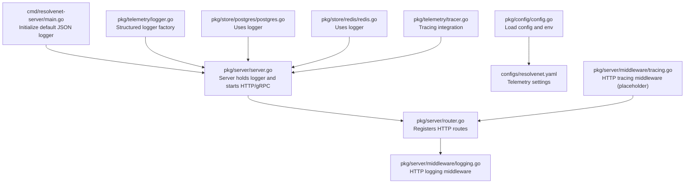
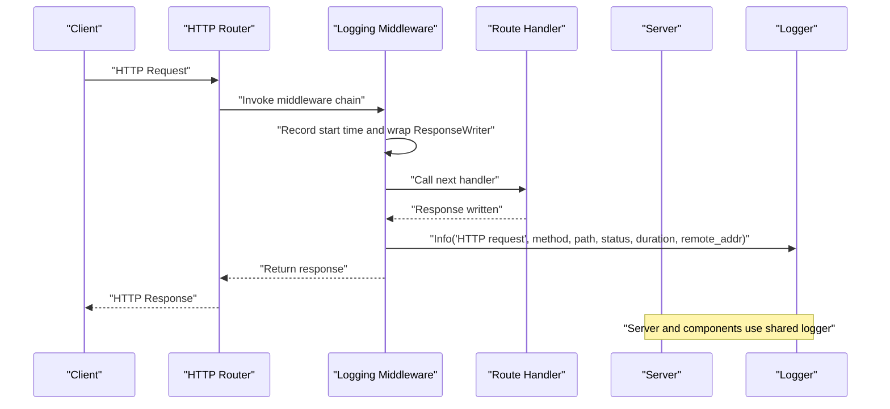
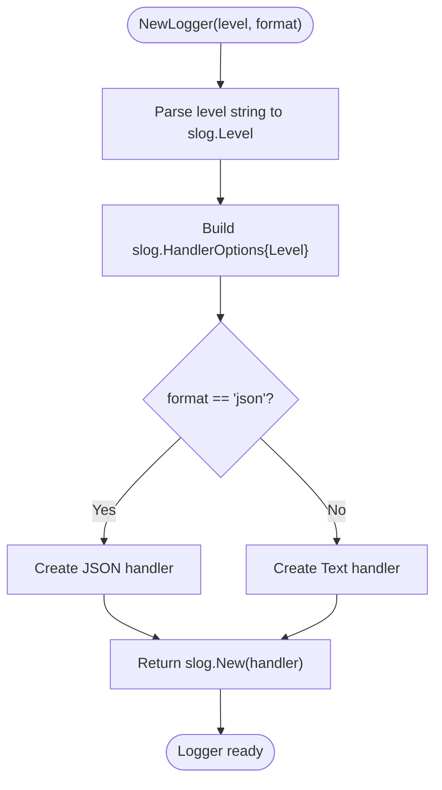
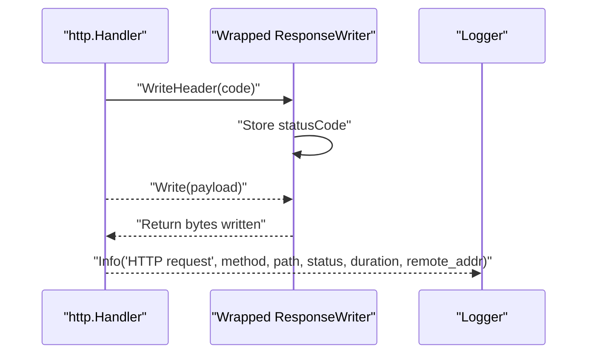
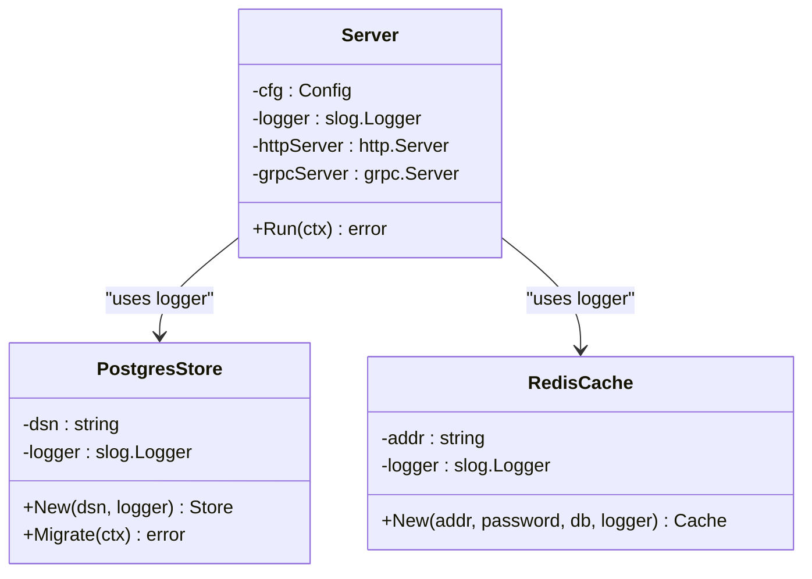
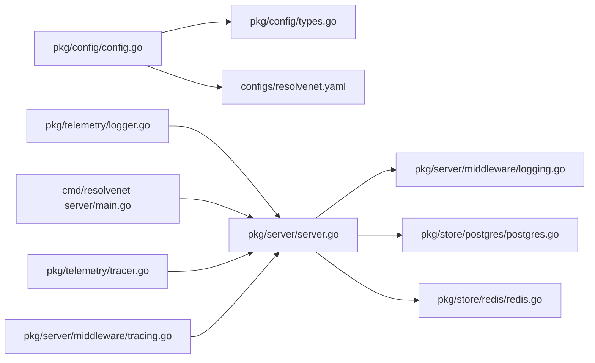

# Logging Architecture

<cite>
**Referenced Files in This Document**
- [logger.go](file://pkg/telemetry/logger.go)
- [logging.go](file://pkg/server/middleware/logging.go)
- [main.go](file://cmd/resolvenet-server/main.go)
- [server.go](file://pkg/server/server.go)
- [router.go](file://pkg/server/router.go)
- [config.go](file://pkg/config/config.go)
- [types.go](file://pkg/config/types.go)
- [resolvenet.yaml](file://configs/resolvenet.yaml)
- [postgres.go](file://pkg/store/postgres/postgres.go)
- [redis.go](file://pkg/store/redis/redis.go)
- [tracer.go](file://pkg/telemetry/tracer.go)
- [tracing.go](file://pkg/server/middleware/tracing.go)
- [context.py](file://python/src/resolvenet/runtime/context.py)
- [logs.go](file://internal/cli/agent/logs.go)
- [log_viewer.go](file://internal/tui/views/log_viewer.go)
</cite>

## Table of Contents
1. [Introduction](#introduction)
2. [Project Structure](#project-structure)
3. [Core Components](#core-components)
4. [Architecture Overview](#architecture-overview)
5. [Detailed Component Analysis](#detailed-component-analysis)
6. [Dependency Analysis](#dependency-analysis)
7. [Performance Considerations](#performance-considerations)
8. [Troubleshooting Guide](#troubleshooting-guide)
9. [Conclusion](#conclusion)

## Introduction
This document describes ResolveNet’s logging architecture built on Go’s slog package. It covers structured logging with configurable levels (debug, info, warn, error), dual format support (JSON and text), environment-aware formatting, and the HTTP logging middleware that records request metadata. It also outlines correlation and tracing concepts, log aggregation and rotation strategies, and operational guidance for high-throughput systems.

## Project Structure
The logging architecture spans several layers:
- Application entrypoint initializes a default structured logger.
- Server initialization composes HTTP and gRPC servers with shared logger instances.
- Middleware wraps HTTP handlers to emit structured request logs.
- Telemetry utilities provide a factory for slog loggers with level and format selection.
- Storage components accept a logger instance and emit structured events.
- Configuration supports telemetry settings and environment overrides.

**Diagram sources**
- [main.go:16-20](file://cmd/resolvenet-server/main.go#L16-L20)
- [server.go:27-52](file://pkg/server/server.go#L27-L52)
- [router.go:11-55](file://pkg/server/router.go#L11-L55)
- [logging.go:19-37](file://pkg/server/middleware/logging.go#L19-L37)
- [logger.go:8-35](file://pkg/telemetry/logger.go#L8-L35)
- [config.go:11-62](file://pkg/config/config.go#L11-L62)
- [resolvenet.yaml:29-34](file://configs/resolvenet.yaml#L29-L34)
- [postgres.go:16-25](file://pkg/store/postgres/postgres.go#L16-L25)
- [redis.go:15-24](file://pkg/store/redis/redis.go#L15-L24)
- [tracer.go:8-21](file://pkg/telemetry/tracer.go#L8-L21)
- [tracing.go:7-18](file://pkg/server/middleware/tracing.go#L7-L18)

**Section sources**
- [main.go:16-20](file://cmd/resolvenet-server/main.go#L16-L20)
- [server.go:27-52](file://pkg/server/server.go#L27-L52)
- [router.go:11-55](file://pkg/server/router.go#L11-L55)
- [logging.go:19-37](file://pkg/server/middleware/logging.go#L19-L37)
- [logger.go:8-35](file://pkg/telemetry/logger.go#L8-L35)
- [config.go:11-62](file://pkg/config/config.go#L11-L62)
- [resolvenet.yaml:29-34](file://configs/resolvenet.yaml#L29-L34)
- [postgres.go:16-25](file://pkg/store/postgres/postgres.go#L16-L25)
- [redis.go:15-24](file://pkg/store/redis/redis.go#L15-L24)
- [tracer.go:8-21](file://pkg/telemetry/tracer.go#L8-L21)
- [tracing.go:7-18](file://pkg/server/middleware/tracing.go#L7-L18)

## Core Components
- Structured logger factory: Creates slog loggers with configurable level and format (JSON/text).
- HTTP logging middleware: Wraps handlers to record method, path, status, duration, and remote address.
- Default logger initialization: Sets a global default logger at process startup.
- Server composition: Passes logger to HTTP/gRPC servers and storage components.
- Configuration: Supports telemetry settings and environment variable overrides.

Key implementation references:
- Logger factory: [logger.go:8-35](file://pkg/telemetry/logger.go#L8-L35)
- HTTP logging middleware: [logging.go:19-37](file://pkg/server/middleware/logging.go#L19-L37)
- Default logger setup: [main.go:16-20](file://cmd/resolvenet-server/main.go#L16-L20)
- Server logger usage: [server.go:68-96](file://pkg/server/server.go#L68-L96)
- Storage logger usage: [postgres.go:23](file://pkg/store/postgres/postgres.go#L23), [redis.go:22](file://pkg/store/redis/redis.go#L22)

**Section sources**
- [logger.go:8-35](file://pkg/telemetry/logger.go#L8-L35)
- [logging.go:19-37](file://pkg/server/middleware/logging.go#L19-L37)
- [main.go:16-20](file://cmd/resolvenet-server/main.go#L16-L20)
- [server.go:68-96](file://pkg/server/server.go#L68-L96)
- [postgres.go:23](file://pkg/store/postgres/postgres.go#L23)
- [redis.go:22](file://pkg/store/redis/redis.go#L22)

## Architecture Overview
The logging architecture centers on structured, leveled logs emitted by the server and its subsystems. HTTP requests are instrumented by middleware that logs essential attributes. The logger factory enables environment-specific formatting (JSON for machine parsing, text for human readability). Telemetry and tracing are present as placeholders for distributed tracing and metrics.

**Diagram sources**
- [router.go:11-55](file://pkg/server/router.go#L11-L55)
- [logging.go:19-37](file://pkg/server/middleware/logging.go#L19-L37)
- [server.go:68-96](file://pkg/server/server.go#L68-L96)

## Detailed Component Analysis

### Structured Logger Factory
The logger factory builds a slog logger with:
- Level selection mapped from string to slog levels.
- Handler selection between JSON and text formats.
- Global default logger set at process start.

**Diagram sources**
- [logger.go:8-35](file://pkg/telemetry/logger.go#L8-L35)

**Section sources**
- [logger.go:8-35](file://pkg/telemetry/logger.go#L8-L35)
- [main.go:16-20](file://cmd/resolvenet-server/main.go#L16-L20)

### HTTP Logging Middleware
The middleware wraps the response writer to capture status code, measures request duration, and emits a structured log entry containing method, path, status, duration, and remote address.

**Diagram sources**
- [logging.go:9-37](file://pkg/server/middleware/logging.go#L9-L37)

**Section sources**
- [logging.go:19-37](file://pkg/server/middleware/logging.go#L19-L37)

### Server Composition and Logger Usage
The server composes HTTP and gRPC servers and logs lifecycle events using the shared logger. Storage components receive a logger and emit structured messages during initialization and operations.

**Diagram sources**
- [server.go:20-52](file://pkg/server/server.go#L20-L52)
- [postgres.go:10-25](file://pkg/store/postgres/postgres.go#L10-L25)
- [redis.go:8-24](file://pkg/store/redis/redis.go#L8-L24)

**Section sources**
- [server.go:27-52](file://pkg/server/server.go#L27-L52)
- [server.go:68-96](file://pkg/server/server.go#L68-L96)
- [postgres.go:16-25](file://pkg/store/postgres/postgres.go#L16-L25)
- [redis.go:15-24](file://pkg/store/redis/redis.go#L15-L24)

### Correlation ID Tracking and Request Context
- Correlation identifiers are not currently injected into logs or propagated across service boundaries in the analyzed code.
- Tracing is represented via placeholder middleware and context data structures. The Python runtime context includes a trace_id field, indicating a concept for cross-service trace correlation.

Recommendations:
- Introduce a correlation ID field in log records and propagate it via HTTP headers or context.
- Use OpenTelemetry tracing to populate trace_id and span_id in logs for end-to-end visibility.

**Section sources**
- [tracing.go:7-18](file://pkg/server/middleware/tracing.go#L7-L18)
- [context.py:21-34](file://python/src/resolvenet/runtime/context.py#L21-L34)

### Configuration and Environment Integration
- Configuration loading supports environment variables with a prefix and dot-to-underscore replacement.
- Telemetry settings include flags for enabling telemetry and specifying an OTLP endpoint and service name.

Operational guidance:
- Use environment variables to override logging level and format.
- Align telemetry settings with your centralized observability backend.

**Section sources**
- [config.go:11-62](file://pkg/config/config.go#L11-L62)
- [resolvenet.yaml:29-34](file://configs/resolvenet.yaml#L29-L34)
- [types.go:63-70](file://pkg/config/types.go#L63-L70)

### CLI and TUI Log Streaming
- CLI command exists to stream agent execution logs with follow and tail options.
- TUI includes a log viewer component designed to display streaming log output.

**Section sources**
- [logs.go:9-28](file://internal/cli/agent/logs.go#L9-L28)
- [log_viewer.go:1-16](file://internal/tui/views/log_viewer.go#L1-L16)

## Dependency Analysis
The logging architecture exhibits low coupling and clear separation of concerns:
- The server depends on the logger factory and passes the logger to subsystems.
- Middleware depends only on slog and standard library HTTP primitives.
- Configuration and YAML files provide environment-driven settings.

**Diagram sources**
- [config.go:11-62](file://pkg/config/config.go#L11-L62)
- [types.go:4-12](file://pkg/config/types.go#L4-L12)
- [resolvenet.yaml:29-34](file://configs/resolvenet.yaml#L29-L34)
- [logger.go:8-35](file://pkg/telemetry/logger.go#L8-L35)
- [server.go:27-52](file://pkg/server/server.go#L27-L52)
- [logging.go:19-37](file://pkg/server/middleware/logging.go#L19-L37)
- [postgres.go:16-25](file://pkg/store/postgres/postgres.go#L16-L25)
- [redis.go:15-24](file://pkg/store/redis/redis.go#L15-L24)
- [main.go:16-20](file://cmd/resolvenet-server/main.go#L16-L20)
- [tracer.go:8-21](file://pkg/telemetry/tracer.go#L8-L21)
- [tracing.go:7-18](file://pkg/server/middleware/tracing.go#L7-L18)

**Section sources**
- [config.go:11-62](file://pkg/config/config.go#L11-L62)
- [types.go:4-12](file://pkg/config/types.go#L4-L12)
- [resolvenet.yaml:29-34](file://configs/resolvenet.yaml#L29-L34)
- [logger.go:8-35](file://pkg/telemetry/logger.go#L8-L35)
- [server.go:27-52](file://pkg/server/server.go#L27-L52)
- [logging.go:19-37](file://pkg/server/middleware/logging.go#L19-L37)
- [postgres.go:16-25](file://pkg/store/postgres/postgres.go#L16-L25)
- [redis.go:15-24](file://pkg/store/redis/redis.go#L15-L24)
- [main.go:16-20](file://cmd/resolvenet-server/main.go#L16-L20)
- [tracer.go:8-21](file://pkg/telemetry/tracer.go#L8-L21)
- [tracing.go:7-18](file://pkg/server/middleware/tracing.go#L7-L18)

## Performance Considerations
- Prefer JSON format in containerized or centralized logging environments for efficient parsing and indexing.
- Use appropriate log levels to reduce noise under normal conditions; enable debug selectively.
- Minimize expensive operations inside hot-path logging (e.g., avoid heavy formatting or external calls).
- Consider asynchronous logging or buffered handlers if throughput demands exceed synchronous I/O.
- Tune middleware overhead by avoiding unnecessary allocations in the hot path.

[No sources needed since this section provides general guidance]

## Troubleshooting Guide
Common log patterns and analysis techniques:
- HTTP request logs include method, path, status, duration, and remote address. Use these to correlate slow endpoints and frequent errors.
- Server lifecycle logs indicate listening addresses and graceful shutdown events.
- Storage initialization logs confirm successful setup and highlight migration outcomes.

Operational tips:
- Filter by level to isolate errors and warnings.
- Search by path or method to troubleshoot specific endpoints.
- Use duration fields to identify latency regressions.
- For production, integrate with a log aggregation system to centralize and index logs.

**Section sources**
- [logging.go:28-34](file://pkg/server/middleware/logging.go#L28-L34)
- [server.go:68-96](file://pkg/server/server.go#L68-L96)
- [postgres.go:23](file://pkg/store/postgres/postgres.go#L23)
- [redis.go:22](file://pkg/store/redis/redis.go#L22)

## Conclusion
ResolveNet’s logging architecture leverages Go’s slog for structured, configurable logging with dual format support. The HTTP middleware provides standardized request logging, while the server and storage components consistently use structured log entries. Correlation IDs and distributed tracing are not yet implemented but are clearly positioned for future development alongside telemetry settings. By aligning configuration with environment needs and integrating with centralized logging systems, teams can achieve robust observability and efficient troubleshooting.