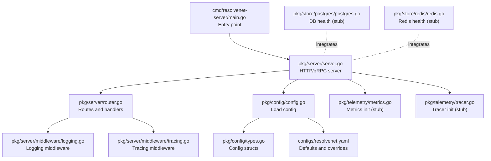
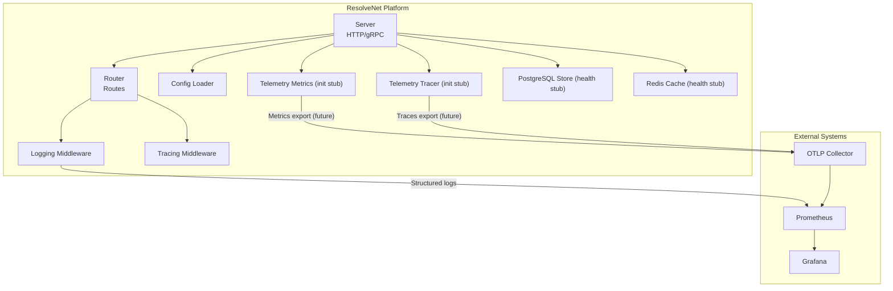
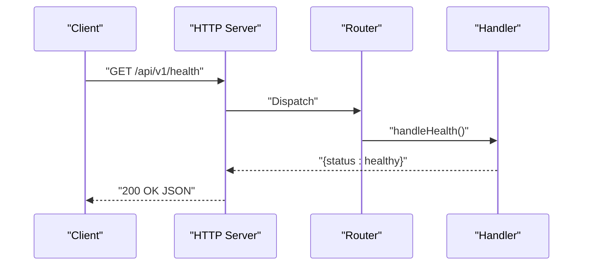
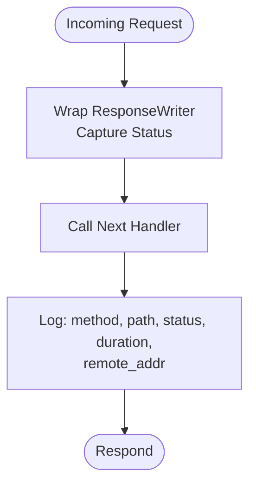
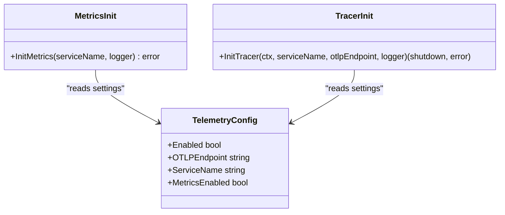
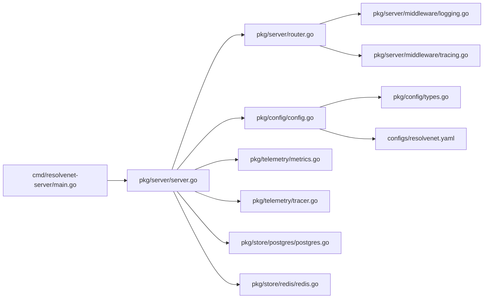

# Metrics Collection

<cite>
**Referenced Files in This Document**
- [cmd/resolvenet-server/main.go](file://cmd/resolvenet-server/main.go)
- [pkg/server/server.go](file://pkg/server/server.go)
- [pkg/server/router.go](file://pkg/server/router.go)
- [pkg/server/middleware/logging.go](file://pkg/server/middleware/logging.go)
- [pkg/server/middleware/tracing.go](file://pkg/server/middleware/tracing.go)
- [pkg/telemetry/metrics.go](file://pkg/telemetry/metrics.go)
- [pkg/telemetry/tracer.go](file://pkg/telemetry/tracer.go)
- [pkg/config/config.go](file://pkg/config/config.go)
- [pkg/config/types.go](file://pkg/config/types.go)
- [configs/resolvenet.yaml](file://configs/resolvenet.yaml)
- [pkg/store/postgres/postgres.go](file://pkg/store/postgres/postgres.go)
- [pkg/store/redis/redis.go](file://pkg/store/redis/redis.go)
- [docs/zh/deployment.md](file://docs/zh/deployment.md)
- [internal/tui/views/dashboard.go](file://internal/tui/views/dashboard.go)
</cite>

## Table of Contents
1. [Introduction](#introduction)
2. [Project Structure](#project-structure)
3. [Core Components](#core-components)
4. [Architecture Overview](#architecture-overview)
5. [Detailed Component Analysis](#detailed-component-analysis)
6. [Dependency Analysis](#dependency-analysis)
7. [Performance Considerations](#performance-considerations)
8. [Troubleshooting Guide](#troubleshooting-guide)
9. [Conclusion](#conclusion)
10. [Appendices](#appendices)

## Introduction
This document describes the metrics collection system for ResolveNet. It covers the current telemetry initialization surface, HTTP server health endpoints, and how metrics can be integrated for request latency, error rates, queue depths, and resource utilization. It also documents naming conventions, labels, and how PostgreSQL and Redis health checks fit into the observability picture. Guidance is included for exposing metrics via Prometheus-compatible endpoints, integrating with Grafana dashboards, establishing baselines, setting alerting thresholds, and extending the system with custom metrics.

## Project Structure
ResolveNet’s metrics and observability surface centers around:
- A production entrypoint that constructs the server and configuration
- An HTTP server with health and system endpoints
- Middleware for logging and tracing
- Telemetry initialization stubs for metrics and tracing
- Configuration enabling/disabling telemetry and selecting exporters
- Storage components with placeholder health checks

**Diagram sources**
- [cmd/resolvenet-server/main.go:1-56](file://cmd/resolvenet-server/main.go#L1-L56)
- [pkg/server/server.go:1-104](file://pkg/server/server.go#L1-L104)
- [pkg/server/router.go:1-183](file://pkg/server/router.go#L1-L183)
- [pkg/server/middleware/logging.go:1-38](file://pkg/server/middleware/logging.go#L1-L38)
- [pkg/server/middleware/tracing.go:1-19](file://pkg/server/middleware/tracing.go#L1-L19)
- [pkg/config/config.go:1-63](file://pkg/config/config.go#L1-L63)
- [pkg/config/types.go:1-70](file://pkg/config/types.go#L1-L70)
- [configs/resolvenet.yaml:1-34](file://configs/resolvenet.yaml#L1-L34)
- [pkg/telemetry/metrics.go:1-13](file://pkg/telemetry/metrics.go#L1-L13)
- [pkg/telemetry/tracer.go:1-22](file://pkg/telemetry/tracer.go#L1-L22)
- [pkg/store/postgres/postgres.go:1-45](file://pkg/store/postgres/postgres.go#L1-L45)
- [pkg/store/redis/redis.go:1-37](file://pkg/store/redis/redis.go#L1-L37)

**Section sources**
- [cmd/resolvenet-server/main.go:1-56](file://cmd/resolvenet-server/main.go#L1-L56)
- [pkg/server/server.go:1-104](file://pkg/server/server.go#L1-L104)
- [pkg/server/router.go:1-183](file://pkg/server/router.go#L1-L183)
- [pkg/server/middleware/logging.go:1-38](file://pkg/server/middleware/logging.go#L1-L38)
- [pkg/server/middleware/tracing.go:1-19](file://pkg/server/middleware/tracing.go#L1-L19)
- [pkg/config/config.go:1-63](file://pkg/config/config.go#L1-L63)
- [pkg/config/types.go:1-70](file://pkg/config/types.go#L1-L70)
- [configs/resolvenet.yaml:1-34](file://configs/resolvenet.yaml#L1-L34)
- [pkg/telemetry/metrics.go:1-13](file://pkg/telemetry/metrics.go#L1-L13)
- [pkg/telemetry/tracer.go:1-22](file://pkg/telemetry/tracer.go#L1-L22)
- [pkg/store/postgres/postgres.go:1-45](file://pkg/store/postgres/postgres.go#L1-L45)
- [pkg/store/redis/redis.go:1-37](file://pkg/store/redis/redis.go#L1-L37)

## Core Components
- HTTP server and routes expose health and system info endpoints.
- Logging middleware records method, path, status, duration, and remote address.
- Telemetry initialization stubs exist for metrics and tracing providers.
- Configuration supports enabling telemetry and selecting an OTLP endpoint/service name.
- Storage components provide placeholders for database and cache health checks.

Key responsibilities:
- Server orchestration and graceful shutdown
- Route registration and handler stubs
- Structured logging with timing and status
- Telemetry provider initialization (future work)
- Configuration-driven behavior for observability

**Section sources**
- [pkg/server/server.go:1-104](file://pkg/server/server.go#L1-L104)
- [pkg/server/router.go:1-183](file://pkg/server/router.go#L1-L183)
- [pkg/server/middleware/logging.go:1-38](file://pkg/server/middleware/logging.go#L1-L38)
- [pkg/telemetry/metrics.go:1-13](file://pkg/telemetry/metrics.go#L1-L13)
- [pkg/telemetry/tracer.go:1-22](file://pkg/telemetry/tracer.go#L1-L22)
- [pkg/config/config.go:1-63](file://pkg/config/config.go#L1-L63)
- [pkg/config/types.go:1-70](file://pkg/config/types.go#L1-L70)

## Architecture Overview
The metrics and observability architecture is currently centered on:
- HTTP server with logging middleware capturing request-level telemetry
- Telemetry provider initialization stubs for metrics and tracing
- Configuration enabling/disabling telemetry and selecting exporter settings
- Storage health checks as part of platform health

**Diagram sources**
- [pkg/server/server.go:1-104](file://pkg/server/server.go#L1-L104)
- [pkg/server/router.go:1-183](file://pkg/server/router.go#L1-L183)
- [pkg/server/middleware/logging.go:1-38](file://pkg/server/middleware/logging.go#L1-L38)
- [pkg/server/middleware/tracing.go:1-19](file://pkg/server/middleware/tracing.go#L1-L19)
- [pkg/telemetry/metrics.go:1-13](file://pkg/telemetry/metrics.go#L1-L13)
- [pkg/telemetry/tracer.go:1-22](file://pkg/telemetry/tracer.go#L1-L22)
- [pkg/store/postgres/postgres.go:1-45](file://pkg/store/postgres/postgres.go#L1-L45)
- [pkg/store/redis/redis.go:1-37](file://pkg/store/redis/redis.go#L1-L37)
- [pkg/config/config.go:1-63](file://pkg/config/config.go#L1-L63)

## Detailed Component Analysis

### HTTP Server and Routes
- The server registers gRPC health service and reflection.
- HTTP routes include health and system info endpoints.
- Handlers are currently stubbed; they return JSON responses.

**Diagram sources**
- [pkg/server/server.go:1-104](file://pkg/server/server.go#L1-L104)
- [pkg/server/router.go:1-183](file://pkg/server/router.go#L1-L183)

**Section sources**
- [pkg/server/server.go:1-104](file://pkg/server/server.go#L1-L104)
- [pkg/server/router.go:1-183](file://pkg/server/router.go#L1-L183)

### Logging Middleware
- Wraps the response writer to capture status code.
- Logs method, path, status, duration, and remote address.
- Provides a foundation for request latency and error rate metrics.

**Diagram sources**
- [pkg/server/middleware/logging.go:1-38](file://pkg/server/middleware/logging.go#L1-L38)

**Section sources**
- [pkg/server/middleware/logging.go:1-38](file://pkg/server/middleware/logging.go#L1-L38)

### Tracing Middleware
- Placeholder for OpenTelemetry span creation around HTTP requests.
- Intended to correlate logs and traces for request flows.

**Section sources**
- [pkg/server/middleware/tracing.go:1-19](file://pkg/server/middleware/tracing.go#L1-L19)

### Telemetry Initialization (Metrics and Tracing)
- Stubs exist for initializing metrics and tracer providers.
- Configuration supports enabling telemetry and specifying service name and OTLP endpoint.

**Diagram sources**
- [pkg/telemetry/metrics.go:1-13](file://pkg/telemetry/metrics.go#L1-L13)
- [pkg/telemetry/tracer.go:1-22](file://pkg/telemetry/tracer.go#L1-L22)
- [pkg/config/types.go:63-70](file://pkg/config/types.go#L63-L70)

**Section sources**
- [pkg/telemetry/metrics.go:1-13](file://pkg/telemetry/metrics.go#L1-L13)
- [pkg/telemetry/tracer.go:1-22](file://pkg/telemetry/tracer.go#L1-L22)
- [pkg/config/types.go:63-70](file://pkg/config/types.go#L63-L70)

### Configuration and Defaults
- Viper loads configuration from files and environment variables.
- Telemetry defaults include enabling metrics and setting service name.
- Environment variables use RESOLVENET_ prefix with dots replaced by underscores.

**Section sources**
- [pkg/config/config.go:1-63](file://pkg/config/config.go#L1-L63)
- [pkg/config/types.go:1-70](file://pkg/config/types.go#L1-L70)
- [configs/resolvenet.yaml:1-34](file://configs/resolvenet.yaml#L1-L34)

### Storage Health Checks
- PostgreSQL and Redis components include placeholder health checks.
- These can be extended to emit health metrics and integrate with platform health.

**Section sources**
- [pkg/store/postgres/postgres.go:1-45](file://pkg/store/postgres/postgres.go#L1-L45)
- [pkg/store/redis/redis.go:1-37](file://pkg/store/redis/redis.go#L1-L37)

### Built-in Metrics Coverage
Current coverage:
- Request latency and error rates can be derived from logging middleware logs.
- System info endpoint exposes version/build metadata for operational awareness.
- Platform health endpoint indicates liveness.

Future enhancements:
- Add Prometheus-compatible metrics endpoint and custom metric types (counters, gauges, histograms, summaries).
- Instrument request durations, error rates, queue depths, and resource utilization.
- Expose database and Redis health metrics via storage health checks.

**Section sources**
- [pkg/server/middleware/logging.go:1-38](file://pkg/server/middleware/logging.go#L1-L38)
- [pkg/server/router.go:57-67](file://pkg/server/router.go#L57-L67)
- [docs/zh/deployment.md:468-481](file://docs/zh/deployment.md#L468-L481)

### Metric Naming Conventions and Labels
Recommended conventions for future Prometheus metrics:
- Prefix: resolvenet_
- Scope: platform | agent | selector | runtime
- Types:
  - counters: resolvenet_{scope}_requests_total
  - histograms: resolvenet_{scope}_request_duration_seconds
  - gauges: resolvenet_{scope}_queue_depth
  - summaries: resolvenet_{scope}_request_duration_summary
- Labels:
  - method, path, status, version, commit, build_date, service_name, instance

These align with existing logged fields and configuration metadata.

**Section sources**
- [pkg/server/middleware/logging.go:1-38](file://pkg/server/middleware/logging.go#L1-L38)
- [pkg/config/types.go:63-70](file://pkg/config/types.go#L63-L70)
- [docs/zh/deployment.md:468-481](file://docs/zh/deployment.md#L468-L481)

### Integration with PostgreSQL and Redis
- Storage components include health check placeholders.
- Extend these to emit health metrics and integrate with platform health.
- Use labels such as db_instance, cache_type, and status for dimensional analysis.

**Section sources**
- [pkg/store/postgres/postgres.go:1-45](file://pkg/store/postgres/postgres.go#L1-L45)
- [pkg/store/redis/redis.go:1-37](file://pkg/store/redis/redis.go#L1-L37)

### Exposure Through Health Check Endpoints and Dashboards
- Health endpoint indicates platform liveness.
- System info endpoint provides version/build metadata for dashboards.
- Prometheus operator ServiceMonitor and Grafana dashboards are supported in deployment documentation.

**Section sources**
- [pkg/server/router.go:57-67](file://pkg/server/router.go#L57-L67)
- [docs/zh/deployment.md:451-496](file://docs/zh/deployment.md#L451-L496)

## Dependency Analysis

**Diagram sources**
- [cmd/resolvenet-server/main.go:1-56](file://cmd/resolvenet-server/main.go#L1-L56)
- [pkg/server/server.go:1-104](file://pkg/server/server.go#L1-L104)
- [pkg/server/router.go:1-183](file://pkg/server/router.go#L1-L183)
- [pkg/server/middleware/logging.go:1-38](file://pkg/server/middleware/logging.go#L1-L38)
- [pkg/server/middleware/tracing.go:1-19](file://pkg/server/middleware/tracing.go#L1-L19)
- [pkg/config/config.go:1-63](file://pkg/config/config.go#L1-L63)
- [pkg/config/types.go:1-70](file://pkg/config/types.go#L1-L70)
- [configs/resolvenet.yaml:1-34](file://configs/resolvenet.yaml#L1-L34)
- [pkg/telemetry/metrics.go:1-13](file://pkg/telemetry/metrics.go#L1-L13)
- [pkg/telemetry/tracer.go:1-22](file://pkg/telemetry/tracer.go#L1-L22)
- [pkg/store/postgres/postgres.go:1-45](file://pkg/store/postgres/postgres.go#L1-L45)
- [pkg/store/redis/redis.go:1-37](file://pkg/store/redis/redis.go#L1-L37)

**Section sources**
- [cmd/resolvenet-server/main.go:1-56](file://cmd/resolvenet-server/main.go#L1-L56)
- [pkg/server/server.go:1-104](file://pkg/server/server.go#L1-L104)
- [pkg/server/router.go:1-183](file://pkg/server/router.go#L1-L183)
- [pkg/server/middleware/logging.go:1-38](file://pkg/server/middleware/logging.go#L1-L38)
- [pkg/server/middleware/tracing.go:1-19](file://pkg/server/middleware/tracing.go#L1-L19)
- [pkg/config/config.go:1-63](file://pkg/config/config.go#L1-L63)
- [pkg/config/types.go:1-70](file://pkg/config/types.go#L1-L70)
- [configs/resolvenet.yaml:1-34](file://configs/resolvenet.yaml#L1-L34)
- [pkg/telemetry/metrics.go:1-13](file://pkg/telemetry/metrics.go#L1-L13)
- [pkg/telemetry/tracer.go:1-22](file://pkg/telemetry/tracer.go#L1-L22)
- [pkg/store/postgres/postgres.go:1-45](file://pkg/store/postgres/postgres.go#L1-L45)
- [pkg/store/redis/redis.go:1-37](file://pkg/store/redis/redis.go#L1-L37)

## Performance Considerations
- Use histograms for request latency to capture quantile distributions.
- Prefer low-cardinality labels to avoid metric cardinality explosion.
- Batch and sample metrics where appropriate to reduce overhead.
- Ensure exporters are configured for high throughput and backpressure handling.
- Monitor scrape intervals and retention policies to balance fidelity and cost.

[No sources needed since this section provides general guidance]

## Troubleshooting Guide
- Verify configuration loading and environment variable precedence.
- Confirm telemetry settings enable metrics and set a valid OTLP endpoint.
- Check server startup logs for HTTP/gRPC listener binding.
- Review logging middleware output for request patterns and errors.
- Validate storage health checks return expected statuses.

**Section sources**
- [pkg/config/config.go:1-63](file://pkg/config/config.go#L1-L63)
- [pkg/config/types.go:63-70](file://pkg/config/types.go#L63-L70)
- [pkg/server/server.go:54-103](file://pkg/server/server.go#L54-L103)
- [pkg/server/middleware/logging.go:1-38](file://pkg/server/middleware/logging.go#L1-L38)
- [pkg/store/postgres/postgres.go:27-31](file://pkg/store/postgres/postgres.go#L27-L31)
- [pkg/store/redis/redis.go:26-30](file://pkg/store/redis/redis.go#L26-L30)

## Conclusion
ResolveNet’s metrics and observability foundation is present in the HTTP server, logging middleware, and configuration system. The next steps involve implementing Prometheus-compatible metrics, instrumenting request latency and error rates, integrating database and cache health, and exposing metrics via a dedicated endpoint. With proper labeling and alerting thresholds, teams can establish baselines, monitor trends, and optimize system performance effectively.

[No sources needed since this section summarizes without analyzing specific files]

## Appendices

### A. Example Metric Queries
- Request rate (last 5 minutes): sum by (method, path) (rate(resolvenet_platform_requests_total[5m]))
- Error ratio: sum by (status) (rate(resolvenet_platform_requests_total{status=~"5.."}[5m])) / sum(rate(resolvenet_platform_requests_total[5m]))
- Latency p95/p99: histogram_quantile(0.95/0.99, sum by (le, method, path) (rate(resolvenet_platform_request_duration_seconds_bucket[5m])))
- Queue depth: increase(resolvenet_platform_queue_depth[5m])

[No sources needed since this section provides general guidance]

### B. Alerting Thresholds
- Error ratio: > 1% over 5 minutes
- P95 latency: > 500ms for APIs, > 2s for long-running operations
- Queue depth: sustained > N over 10 minutes
- Health: continuous failures for > 2 minutes

[No sources needed since this section provides general guidance]

### C. Establishing Performance Baselines
- Collect data during normal operation windows for 1–2 weeks.
- Compute daily percentiles for latency and error rates.
- Define SLOs aligned with user impact and capacity headroom.
- Reassess baselines quarterly or after major releases.

[No sources needed since this section provides general guidance]

### D. Adding Custom Metrics
- Define metric names and labels following the naming conventions.
- Instrument handlers and middleware to record events.
- Expose a Prometheus-compatible endpoint or configure an exporter.
- Add Grafana panels and alerts based on the new metrics.

[No sources needed since this section provides general guidance]

### E. Monitoring Dashboards
- Use deployment documentation guidance for Prometheus operator ServiceMonitor and Grafana dashboards.
- Include panels for request rate, latency, error ratios, and resource utilization.
- Add drill-down by method, path, and service version.

**Section sources**
- [docs/zh/deployment.md:451-496](file://docs/zh/deployment.md#L451-L496)

### F. TUI Dashboard View
- The TUI includes a dashboard view structure for system overview metrics.
- This complements external monitoring dashboards for local development visibility.

**Section sources**
- [internal/tui/views/dashboard.go:1-16](file://internal/tui/views/dashboard.go#L1-L16)