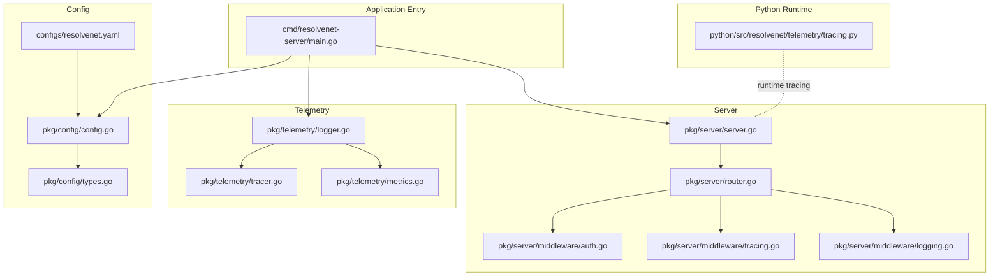
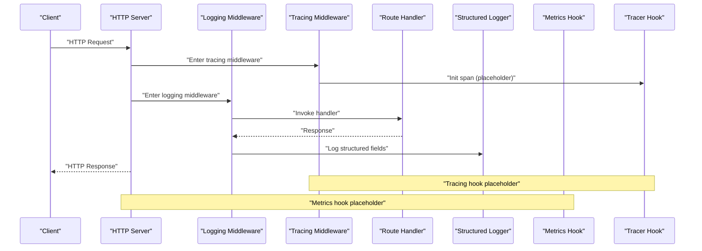
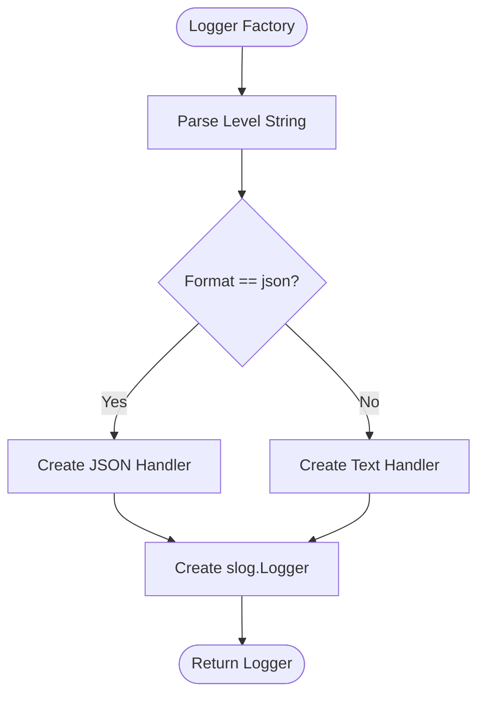
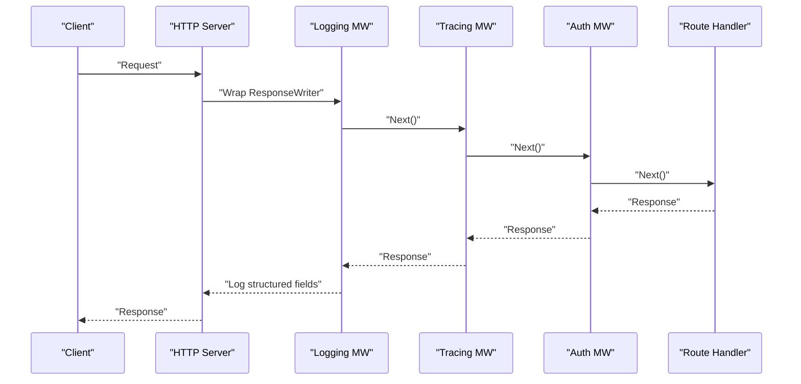
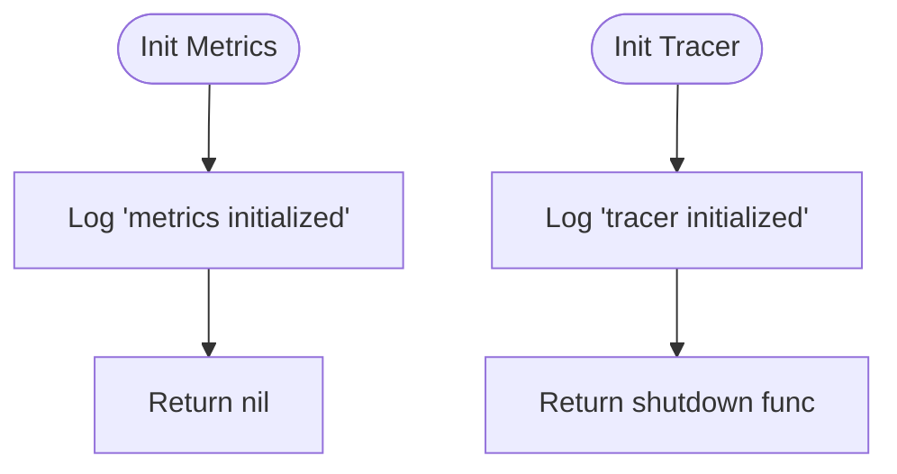
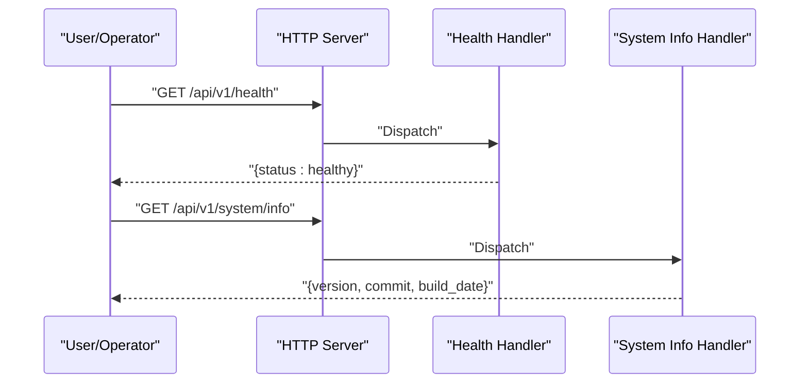
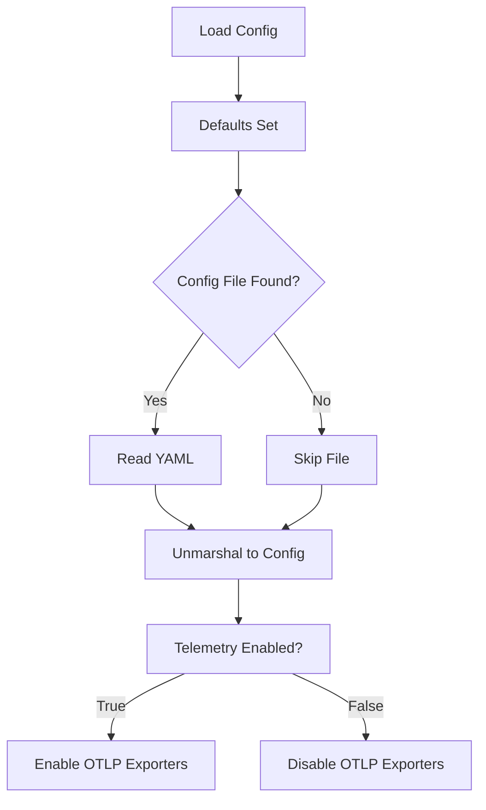
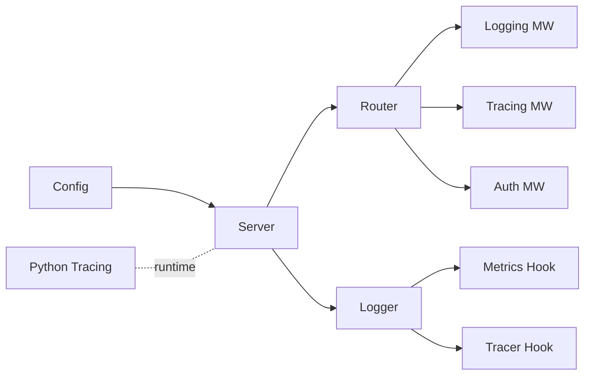

# Observability and Monitoring

<cite>
**Referenced Files in This Document**
- [logger.go](file://pkg/telemetry/logger.go)
- [metrics.go](file://pkg/telemetry/metrics.go)
- [tracer.go](file://pkg/telemetry/tracer.go)
- [logging.go](file://pkg/server/middleware/logging.go)
- [tracing.go](file://pkg/server/middleware/tracing.go)
- [auth.go](file://pkg/server/middleware/auth.go)
- [server.go](file://pkg/server/server.go)
- [router.go](file://pkg/server/router.go)
- [main.go](file://cmd/resolvenet-server/main.go)
- [resolvenet.yaml](file://configs/resolvenet.yaml)
- [config.go](file://pkg/config/config.go)
- [types.go](file://pkg/config/types.go)
- [tracing.py](file://python/src/resolvenet/telemetry/tracing.py)
</cite>

## Table of Contents
1. [Introduction](#introduction)
2. [Project Structure](#project-structure)
3. [Core Components](#core-components)
4. [Architecture Overview](#architecture-overview)
5. [Detailed Component Analysis](#detailed-component-analysis)
6. [Dependency Analysis](#dependency-analysis)
7. [Performance Considerations](#performance-considerations)
8. [Troubleshooting Guide](#troubleshooting-guide)
9. [Conclusion](#conclusion)
10. [Appendices](#appendices)

## Introduction
This document describes ResolveNet’s observability and monitoring capabilities as implemented in the codebase. It covers structured logging, log levels, correlation-ready HTTP middleware, metrics collection hooks, health endpoints, and distributed tracing foundations. It also outlines how to integrate OpenTelemetry exporters, configure telemetry via environment and YAML, and operate observability across deployment environments. Guidance is included for interpreting metrics, troubleshooting with logs and traces, and optimizing performance using observability insights.

## Project Structure
ResolveNet’s observability spans several layers:
- Application entrypoint initializes logging and loads configuration.
- HTTP server exposes health and system endpoints.
- Middleware stack injects logging and tracing scaffolding.
- Telemetry packages provide hooks for metrics and tracing initialization.
- Python runtime includes a tracing initializer for the agent runtime.

**Diagram sources**
- [main.go:16-56](file://cmd/resolvenet-server/main.go#L16-L56)
- [server.go:27-52](file://pkg/server/server.go#L27-L52)
- [router.go:10-55](file://pkg/server/router.go#L10-L55)
- [logging.go:19-37](file://pkg/server/middleware/logging.go#L19-L37)
- [tracing.go:7-18](file://pkg/server/middleware/tracing.go#L7-L18)
- [auth.go:8-17](file://pkg/server/middleware/auth.go#L8-L17)
- [logger.go:8-35](file://pkg/telemetry/logger.go#L8-L35)
- [metrics.go:7-12](file://pkg/telemetry/metrics.go#L7-L12)
- [tracer.go:8-21](file://pkg/telemetry/tracer.go#L8-L21)
- [config.go:10-62](file://pkg/config/config.go#L10-L62)
- [types.go:4-69](file://pkg/config/types.go#L4-L69)
- [resolvenet.yaml:1-34](file://configs/resolvenet.yaml#L1-L34)
- [tracing.py:10-25](file://python/src/resolvenet/telemetry/tracing.py#L10-L25)

**Section sources**
- [main.go:16-56](file://cmd/resolvenet-server/main.go#L16-L56)
- [server.go:27-52](file://pkg/server/server.go#L27-L52)
- [router.go:10-55](file://pkg/server/router.go#L10-L55)
- [logger.go:8-35](file://pkg/telemetry/logger.go#L8-L35)
- [metrics.go:7-12](file://pkg/telemetry/metrics.go#L7-L12)
- [tracer.go:8-21](file://pkg/telemetry/tracer.go#L8-L21)
- [config.go:10-62](file://pkg/config/config.go#L10-L62)
- [types.go:4-69](file://pkg/config/types.go#L4-L69)
- [resolvenet.yaml:1-34](file://configs/resolvenet.yaml#L1-L34)
- [tracing.py:10-25](file://python/src/resolvenet/telemetry/tracing.py#L10-L25)

## Core Components
- Structured logging: A configurable logger supports JSON and text formats with log levels.
- HTTP middleware: Wraps responses to capture status codes and durations; logs method, path, status, and remote address.
- Telemetry initialization: Hooks for OpenTelemetry metrics and tracer providers are present with placeholders for exporters.
- Health endpoints: Expose readiness and system info for monitoring and automation.
- Configuration: Centralized configuration supports telemetry toggles and OTLP endpoint settings.

**Section sources**
- [logger.go:8-35](file://pkg/telemetry/logger.go#L8-L35)
- [logging.go:19-37](file://pkg/server/middleware/logging.go#L19-L37)
- [metrics.go:7-12](file://pkg/telemetry/metrics.go#L7-L12)
- [tracer.go:8-21](file://pkg/telemetry/tracer.go#L8-L21)
- [router.go:57-67](file://pkg/server/router.go#L57-L67)
- [config.go:10-62](file://pkg/config/config.go#L10-L62)
- [types.go:63-69](file://pkg/config/types.go#L63-L69)

## Architecture Overview
The observability architecture integrates logging, middleware, and telemetry initialization around the HTTP server and gRPC health service. The configuration layer controls telemetry enablement and endpoints. The Python runtime includes a tracing initializer for agent-side telemetry.

**Diagram sources**
- [router.go:10-55](file://pkg/server/router.go#L10-L55)
- [logging.go:19-37](file://pkg/server/middleware/logging.go#L19-L37)
- [tracing.go:7-18](file://pkg/server/middleware/tracing.go#L7-L18)
- [logger.go:8-35](file://pkg/telemetry/logger.go#L8-L35)
- [metrics.go:7-12](file://pkg/telemetry/metrics.go#L7-L12)
- [tracer.go:8-21](file://pkg/telemetry/tracer.go#L8-L21)

## Detailed Component Analysis

### Structured Logging
- Logger factory supports debug, info, warn, error levels and JSON/text output formats.
- Default logger is set at process startup with JSON handler and info level.
- Middleware logs method, path, status, duration, and remote address per request.

**Diagram sources**
- [logger.go:8-35](file://pkg/telemetry/logger.go#L8-L35)
- [main.go:17-19](file://cmd/resolvenet-server/main.go#L17-L19)

**Section sources**
- [logger.go:8-35](file://pkg/telemetry/logger.go#L8-L35)
- [main.go:17-19](file://cmd/resolvenet-server/main.go#L17-L19)
- [logging.go:28-34](file://pkg/server/middleware/logging.go#L28-L34)

### HTTP Middleware Stack
- Logging middleware wraps the response writer to capture status code and measures request duration.
- Tracing middleware is present but currently a placeholder; it is intended to create spans and propagate context.
- Authentication middleware is present but currently a pass-through; it is intended to enforce auth before invoking downstream handlers.

**Diagram sources**
- [logging.go:19-37](file://pkg/server/middleware/logging.go#L19-L37)
- [tracing.go:7-18](file://pkg/server/middleware/tracing.go#L7-L18)
- [auth.go:8-17](file://pkg/server/middleware/auth.go#L8-L17)
- [router.go:10-55](file://pkg/server/router.go#L10-L55)

**Section sources**
- [logging.go:19-37](file://pkg/server/middleware/logging.go#L19-L37)
- [tracing.go:7-18](file://pkg/server/middleware/tracing.go#L7-L18)
- [auth.go:8-17](file://pkg/server/middleware/auth.go#L8-L17)

### Telemetry Initialization Hooks
- Metrics initialization is a placeholder that logs initialization and returns success.
- Tracer initialization is a placeholder that logs initialization and returns a shutdown function.
- Python runtime tracing initializer is present with a similar placeholder pattern.

**Diagram sources**
- [metrics.go:7-12](file://pkg/telemetry/metrics.go#L7-L12)
- [tracer.go:8-21](file://pkg/telemetry/tracer.go#L8-L21)
- [tracing.py:10-25](file://python/src/resolvenet/telemetry/tracing.py#L10-L25)

**Section sources**
- [metrics.go:7-12](file://pkg/telemetry/metrics.go#L7-L12)
- [tracer.go:8-21](file://pkg/telemetry/tracer.go#L8-L21)
- [tracing.py:10-25](file://python/src/resolvenet/telemetry/tracing.py#L10-L25)

### Health and System Endpoints
- Health endpoint returns a simple healthy status.
- System info endpoint returns version metadata.

**Diagram sources**
- [router.go:57-67](file://pkg/server/router.go#L57-L67)

**Section sources**
- [router.go:57-67](file://pkg/server/router.go#L57-L67)

### Configuration and Deployment
- Configuration supports telemetry toggles, OTLP endpoint, and service name.
- Defaults are loaded via Viper with environment variable overrides.
- Example YAML demonstrates telemetry block with enablement and endpoint settings.

**Diagram sources**
- [config.go:10-62](file://pkg/config/config.go#L10-L62)
- [types.go:63-69](file://pkg/config/types.go#L63-L69)
- [resolvenet.yaml:29-34](file://configs/resolvenet.yaml#L29-L34)

**Section sources**
- [config.go:10-62](file://pkg/config/config.go#L10-L62)
- [types.go:63-69](file://pkg/config/types.go#L63-L69)
- [resolvenet.yaml:29-34](file://configs/resolvenet.yaml#L29-L34)

## Dependency Analysis
- The HTTP server registers routes and relies on middleware for cross-cutting concerns.
- Telemetry hooks are decoupled from HTTP routing and can be wired in later.
- Configuration drives telemetry enablement and endpoint selection.

**Diagram sources**
- [server.go:27-52](file://pkg/server/server.go#L27-L52)
- [router.go:10-55](file://pkg/server/router.go#L10-L55)
- [logging.go:19-37](file://pkg/server/middleware/logging.go#L19-L37)
- [tracing.go:7-18](file://pkg/server/middleware/tracing.go#L7-L18)
- [auth.go:8-17](file://pkg/server/middleware/auth.go#L8-L17)
- [logger.go:8-35](file://pkg/telemetry/logger.go#L8-L35)
- [metrics.go:7-12](file://pkg/telemetry/metrics.go#L7-L12)
- [tracer.go:8-21](file://pkg/telemetry/tracer.go#L8-L21)
- [tracing.py:10-25](file://python/src/resolvenet/telemetry/tracing.py#L10-L25)

**Section sources**
- [server.go:27-52](file://pkg/server/server.go#L27-L52)
- [router.go:10-55](file://pkg/server/router.go#L10-L55)
- [logger.go:8-35](file://pkg/telemetry/logger.go#L8-L35)
- [metrics.go:7-12](file://pkg/telemetry/metrics.go#L7-L12)
- [tracer.go:8-21](file://pkg/telemetry/tracer.go#L8-L21)
- [tracing.py:10-25](file://python/src/resolvenet/telemetry/tracing.py#L10-L25)

## Performance Considerations
- Prefer JSON logging in containerized environments for structured log ingestion.
- Keep middleware overhead low; avoid expensive operations inside logging/tracing wrappers.
- Use sampling strategies for tracing in high-throughput environments; configure sampling ratios at the collector or SDK level.
- Tune metric cardinality to reduce storage costs; limit label explosion and use histograms for latency.
- Monitor gRPC health and HTTP readiness endpoints to gate traffic during startup/shutdown.

## Troubleshooting Guide
- Verify health endpoint responses to confirm liveness and readiness.
- Inspect structured logs for request method, path, status, and duration to identify slow endpoints.
- Confirm telemetry enablement via configuration and environment variables.
- If tracing appears inactive, ensure the tracing middleware is applied and exporters are configured.

**Section sources**
- [router.go:57-67](file://pkg/server/router.go#L57-L67)
- [logging.go:28-34](file://pkg/server/middleware/logging.go#L28-L34)
- [config.go:44-47](file://pkg/config/config.go#L44-L47)
- [resolvenet.yaml:29-34](file://configs/resolvenet.yaml#L29-L34)

## Conclusion
ResolveNet provides a solid foundation for observability with structured logging, middleware-based request logging, and telemetry initialization hooks. Health and system endpoints support operational checks. The configuration layer enables environment-aware telemetry enablement. To complete the observability story, integrate OpenTelemetry exporters for metrics and tracing, apply the tracing middleware, and define monitoring dashboards and alerts aligned with business KPIs.

## Appendices

### A. Telemetry Configuration Reference
- telemetry.enabled: Enable/disable telemetry exports.
- telemetry.otlp_endpoint: Target endpoint for OTLP exporter.
- telemetry.service_name: Service name for traces/metrics.
- telemetry.metrics_enabled: Toggle for metrics export.

**Section sources**
- [resolvenet.yaml:29-34](file://configs/resolvenet.yaml#L29-L34)
- [types.go:63-69](file://pkg/config/types.go#L63-L69)
- [config.go:29-31](file://pkg/config/config.go#L29-L31)

### B. Example Metric Interpretation
- Latency p50/p90: Use histogram buckets to observe tail latencies; rising p90 indicates backend pressure.
- Error rate: Count 5xx responses; sustained increases require deeper trace investigation.
- Throughput: Requests per second; correlate with resource utilization.

[No sources needed since this section provides general guidance]

### C. Deployment Guidance
- Docker/Kubernetes: Set RESOLVENET_TELEMETRY_ENABLED and RESOLVENET_TELEMETRY_OTLP_ENDPOINT via environment variables.
- Helm: Pass telemetry values through values.yaml to override defaults.
- Local development: Use JSON logging and disable telemetry; enable in staging/prod.

**Section sources**
- [config.go:44-47](file://pkg/config/config.go#L44-L47)
- [resolvenet.yaml:29-34](file://configs/resolvenet.yaml#L29-L34)