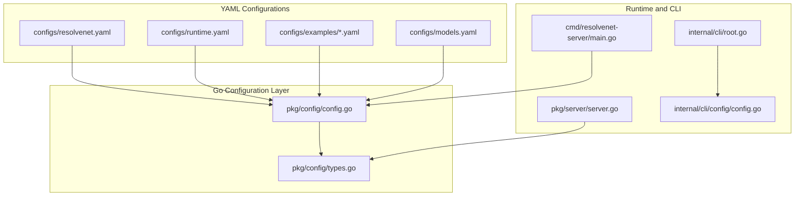
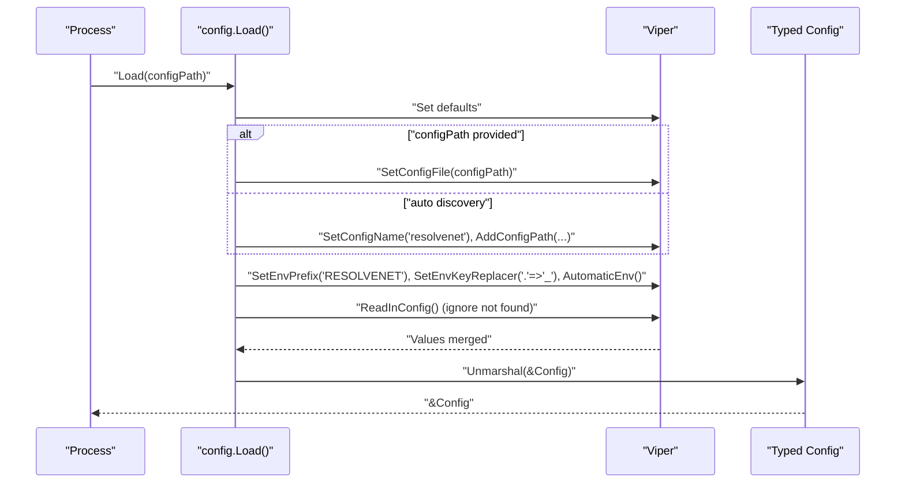
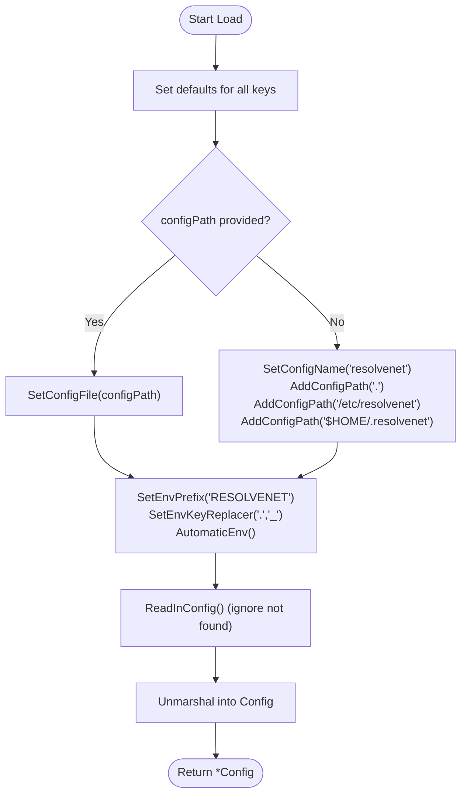
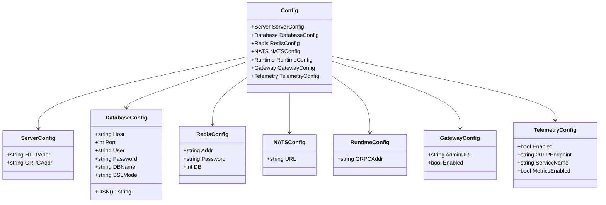
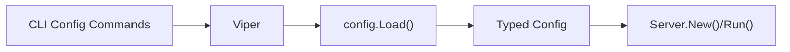

# Configuration Management

<cite>
**Referenced Files in This Document**
- [resolvenet.yaml](file://configs/resolvenet.yaml)
- [runtime.yaml](file://configs/runtime.yaml)
- [agent-example.yaml](file://configs/examples/agent-example.yaml)
- [skill-example.yaml](file://configs/examples/skill-example.yaml)
- [workflow-fta-example.yaml](file://configs/examples/workflow-fta-example.yaml)
- [models.yaml](file://configs/models.yaml)
- [config.go](file://pkg/config/config.go)
- [types.go](file://pkg/config/types.go)
- [server.go](file://pkg/server/server.go)
- [main.go](file://cmd/resolvenet-server/main.go)
- [root.go](file://internal/cli/root.go)
- [config_cli.go](file://internal/cli/config/config.go)
- [README.md](file://README.md)
- [SECURITY.md](file://SECURITY.md)
</cite>

## Table of Contents
1. [Introduction](#introduction)
2. [Project Structure](#project-structure)
3. [Core Components](#core-components)
4. [Architecture Overview](#architecture-overview)
5. [Detailed Component Analysis](#detailed-component-analysis)
6. [Dependency Analysis](#dependency-analysis)
7. [Performance Considerations](#performance-considerations)
8. [Troubleshooting Guide](#troubleshooting-guide)
9. [Conclusion](#conclusion)
10. [Appendices](#appendices)

## Introduction
This document describes the configuration management system of the ResolveNet platform. It explains how configuration is loaded hierarchically from YAML files with environment variable overrides, details configuration types and validation patterns, and outlines default value handling, type conversion, and error handling strategies. It also covers hot-reloading and runtime updates, security considerations for sensitive data, and configuration migration strategies. Finally, it clarifies the relationship between global platform configuration and service-specific settings.

## Project Structure
The configuration system spans:
- Global platform configuration YAML files
- Runtime configuration YAML files
- Example configuration files for agents, skills, and workflows
- Model registry configuration
- Go configuration loader and typed configuration structures
- CLI commands for configuration management
- Server initialization that consumes configuration

**Diagram sources**
- [resolvenet.yaml](file://configs/resolvenet.yaml)
- [runtime.yaml](file://configs/runtime.yaml)
- [agent-example.yaml](file://configs/examples/agent-example.yaml)
- [skill-example.yaml](file://configs/examples/skill-example.yaml)
- [workflow-fta-example.yaml](file://configs/examples/workflow-fta-example.yaml)
- [models.yaml](file://configs/models.yaml)
- [config.go](file://pkg/config/config.go)
- [types.go](file://pkg/config/types.go)
- [main.go](file://cmd/resolvenet-server/main.go)
- [server.go](file://pkg/server/server.go)
- [root.go](file://internal/cli/root.go)
- [config_cli.go](file://internal/cli/config/config.go)

**Section sources**
- [resolvenet.yaml](file://configs/resolvenet.yaml)
- [runtime.yaml](file://configs/runtime.yaml)
- [agent-example.yaml](file://configs/examples/agent-example.yaml)
- [skill-example.yaml](file://configs/examples/skill-example.yaml)
- [workflow-fta-example.yaml](file://configs/examples/workflow-fta-example.yaml)
- [models.yaml](file://configs/models.yaml)
- [config.go](file://pkg/config/config.go)
- [types.go](file://pkg/config/types.go)
- [main.go](file://cmd/resolvenet-server/main.go)
- [server.go](file://pkg/server/server.go)
- [root.go](file://internal/cli/root.go)
- [config_cli.go](file://internal/cli/config/config.go)

## Core Components
- Configuration loader: Viper-backed loader that sets defaults, loads YAML from multiple paths, applies environment variable overrides, and unmarshals into typed structs.
- Typed configuration: Strongly typed structs representing server, database, Redis, NATS, runtime, gateway, and telemetry settings.
- CLI configuration management: Commands to set, get, view, and initialize configuration via Viper.
- Server initialization: Loads configuration at startup and uses it to configure HTTP and gRPC servers.

Key behaviors:
- Hierarchical loading: Defaults → YAML files → environment variables.
- Environment variable mapping: RESOLVENET_<SECTION>_<KEY> with dots replaced by underscores.
- Unmarshaling: Uses mapstructure tags to bind YAML keys to struct fields.
- Error handling: Distinguishes missing config file vs. parse errors; wraps unmarshal errors.

**Section sources**
- [config.go](file://pkg/config/config.go)
- [types.go](file://pkg/config/types.go)
- [config_cli.go](file://internal/cli/config/config.go)
- [main.go](file://cmd/resolvenet-server/main.go)
- [server.go](file://pkg/server/server.go)

## Architecture Overview
The configuration architecture centers on Viper for sourcing and overriding configuration, and typed structs for safe consumption.

**Diagram sources**
- [config.go](file://pkg/config/config.go)

**Section sources**
- [config.go](file://pkg/config/config.go)

## Detailed Component Analysis

### Configuration Loading Pipeline
- Defaults: Hardcoded defaults for all supported keys.
- File discovery: If no explicit path is given, Viper searches current directory, system config path, and user home config path.
- Environment overrides: Keys are mapped from RESOLVENET_<SECTION>_<KEY> with dots converted to underscores.
- Unmarshal: Values are unmarshaled into strongly typed structs using mapstructure tags.

**Diagram sources**
- [config.go](file://pkg/config/config.go)

**Section sources**
- [config.go](file://pkg/config/config.go)

### Configuration Types and Validation Patterns
- Global platform configuration types include server, database, Redis, NATS, runtime, gateway, and telemetry.
- Validation patterns shown in documentation include CLI-based validation commands for platform, runtime, and model configurations.
- Type conversion is implicit via Viper/mapstructure; numeric and boolean conversions occur during unmarshal.

**Diagram sources**
- [types.go](file://pkg/config/types.go)

**Section sources**
- [types.go](file://pkg/config/types.go)

### Environment Variable Overrides and Mapping
- Prefix: RESOLVENET
- Dot-to-underscore replacement: server.http_addr becomes RESOLVENET_SERVER_HTTP_ADDR
- Automatic environment binding: Viper automatically merges environment values after file loading.

Examples of environment variable mappings:
- RESOLVENET_SERVER_HTTP_ADDR
- RESOLVENET_DATABASE_HOST
- RESOLVENET_RUNTIME_GRPC_ADDR

**Section sources**
- [config.go](file://pkg/config/config.go)
- [README.md](file://README.md)

### Default Value Handling
- All supported keys have defaults set in the loader, ensuring minimal configuration is required.
- Defaults include server addresses, database credentials, Redis settings, NATS URL, runtime gRPC address, gateway admin URL and enable flag, and telemetry toggles.

**Section sources**
- [config.go](file://pkg/config/config.go)

### Error Handling Strategies
- Missing config file: Ignored if not found; only parse errors return errors.
- Unmarshal errors: Wrapped with context for easier diagnosis.
- Server startup: Errors during configuration loading are logged and cause graceful exit.

**Section sources**
- [config.go](file://pkg/config/config.go)
- [main.go](file://cmd/resolvenet-server/main.go)

### Configuration Hot-Reloading and Runtime Updates
- Current implementation: Configuration is loaded at process startup and consumed by the server. There is no built-in hot-reload mechanism in the provided code.
- Recommended approach: Periodically re-read configuration via a dedicated reload endpoint or filesystem watcher and apply changes to running components (e.g., restart listeners, refresh clients) while preserving safety and consistency.

[No sources needed since this section provides general guidance]

### Relationship Between Global Configuration and Service-Specific Settings
- Global configuration (platform): Defines server endpoints, database, Redis, NATS, gateway, and telemetry.
- Runtime configuration: Defines runtime server address and agent pool/selector settings.
- Service-specific settings (examples): Agent, skill, and workflow configurations are separate YAML files intended for domain-level settings and are not part of the platform configuration loader.

**Section sources**
- [resolvenet.yaml](file://configs/resolvenet.yaml)
- [runtime.yaml](file://configs/runtime.yaml)
- [agent-example.yaml](file://configs/examples/agent-example.yaml)
- [skill-example.yaml](file://configs/examples/skill-example.yaml)
- [workflow-fta-example.yaml](file://configs/examples/workflow-fta-example.yaml)

### Configuration Examples
- Platform configuration: [resolvenet.yaml](file://configs/resolvenet.yaml)
- Runtime configuration: [runtime.yaml](file://configs/runtime.yaml)
- Agent definition: [agent-example.yaml](file://configs/examples/agent-example.yaml)
- Skill configuration: [skill-example.yaml](file://configs/examples/skill-example.yaml)
- Workflow FTA: [workflow-fta-example.yaml](file://configs/examples/workflow-fta-example.yaml)
- Model registry: [models.yaml](file://configs/models.yaml)

**Section sources**
- [resolvenet.yaml](file://configs/resolvenet.yaml)
- [runtime.yaml](file://configs/runtime.yaml)
- [agent-example.yaml](file://configs/examples/agent-example.yaml)
- [skill-example.yaml](file://configs/examples/skill-example.yaml)
- [workflow-fta-example.yaml](file://configs/examples/workflow-fta-example.yaml)
- [models.yaml](file://configs/models.yaml)

### CLI Configuration Management
- Commands: set, get, view, init.
- Persistence: Writes back to the Viper-configured location.
- Initialization: Placeholder for creating default configuration files.

**Section sources**
- [config_cli.go](file://internal/cli/config/config.go)
- [root.go](file://internal/cli/root.go)

## Dependency Analysis
- The server depends on the loaded configuration to start HTTP and gRPC listeners.
- The configuration loader depends on Viper for merging sources and unmarshaling into typed structs.
- CLI commands depend on Viper for reading/writing configuration.

**Diagram sources**
- [config.go](file://pkg/config/config.go)
- [types.go](file://pkg/config/types.go)
- [server.go](file://pkg/server/server.go)
- [config_cli.go](file://internal/cli/config/config.go)

**Section sources**
- [config.go](file://pkg/config/config.go)
- [types.go](file://pkg/config/types.go)
- [server.go](file://pkg/server/server.go)
- [config_cli.go](file://internal/cli/config/config.go)

## Performance Considerations
- Minimize repeated file reads: Load configuration once at startup.
- Avoid excessive environment variables: Keep overrides scoped to necessary keys.
- Prefer numeric and boolean environment variables over strings to reduce conversion overhead.

[No sources needed since this section provides general guidance]

## Troubleshooting Guide
Common issues and resolutions:
- Configuration file not found: Ensure the file exists in one of the discovered paths or provide an explicit path.
- Environment variable not applied: Verify the variable name uses the correct prefix and dot-to-underscore mapping.
- Unmarshal errors: Confirm YAML syntax and types match the expected struct fields.
- Server fails to start: Check resolved configuration values and network bindings.

**Section sources**
- [config.go](file://pkg/config/config.go)
- [main.go](file://cmd/resolvenet-server/main.go)

## Conclusion
The configuration management system uses a robust, layered approach: defaults, YAML files, and environment variable overrides, unified by Viper and strongly typed structs. While hot-reloading is not currently implemented, the architecture supports straightforward extension to support dynamic updates. Security best practices emphasize avoiding secret commits and validating inputs, with clear guidance in the security policy.

[No sources needed since this section summarizes without analyzing specific files]

## Appendices

### Configuration File Locations and Priority
- Current directory
- User home config directory
- System-wide config directory

**Section sources**
- [README.md](file://README.md)

### Security Considerations and Sensitive Data Handling
- Do not commit secrets; follow the security policy’s guidance.
- Keep dependencies updated and sanitize inputs.

**Section sources**
- [SECURITY.md](file://SECURITY.md)

### Configuration Migration Strategies
- Backward compatibility: Introduce new keys with defaults; deprecate old keys gradually.
- Validation: Use CLI validation commands to verify configuration correctness before deployment.
- Rollback: Maintain previous configuration versions alongside new ones.

**Section sources**
- [README.md](file://README.md)