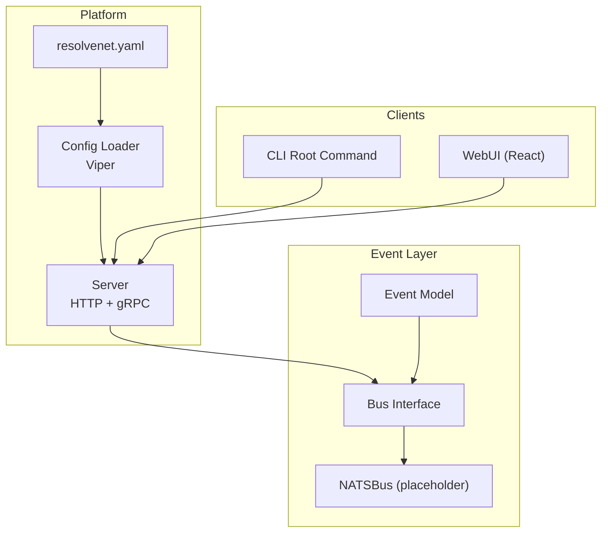
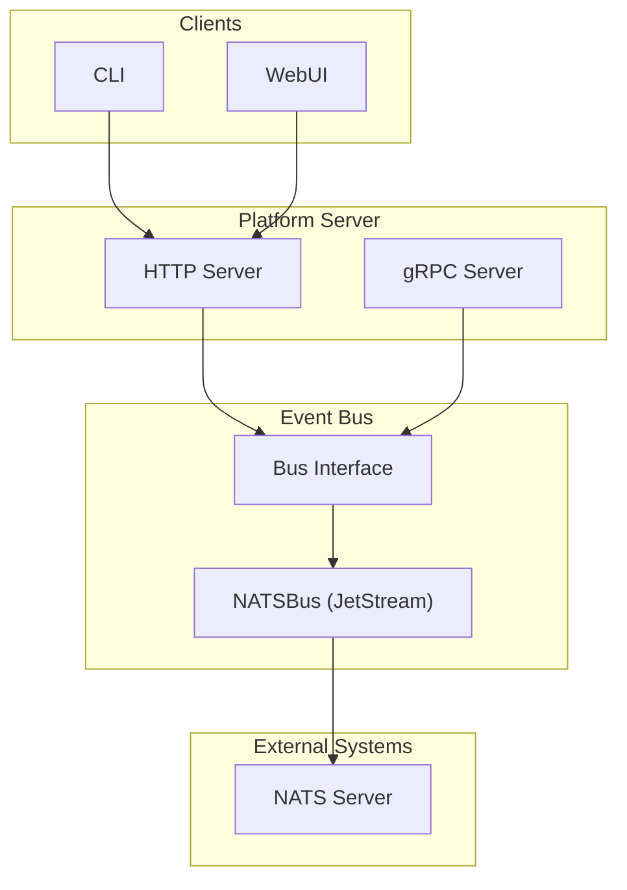
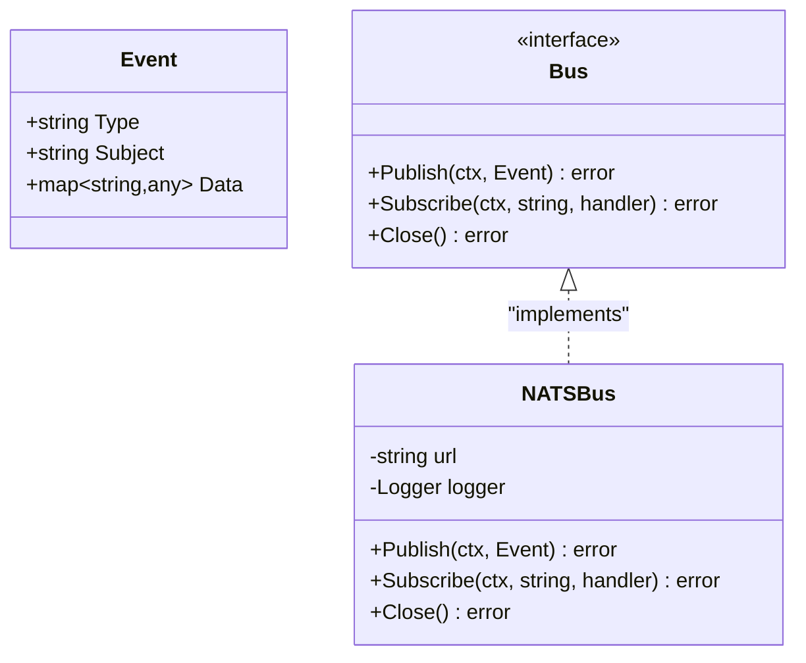
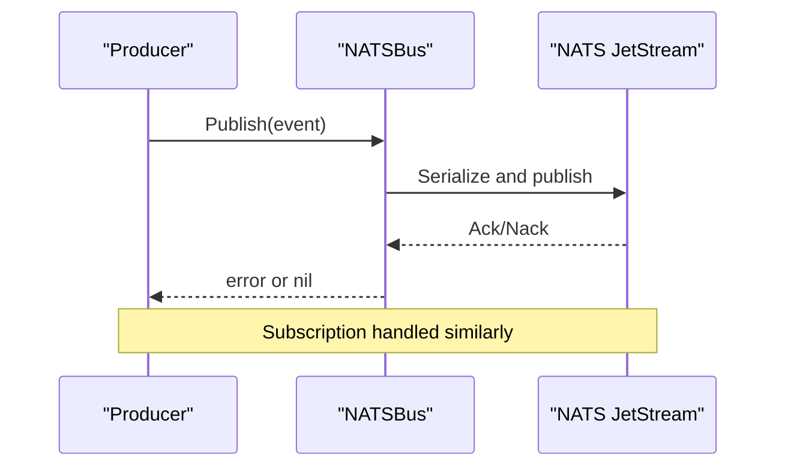
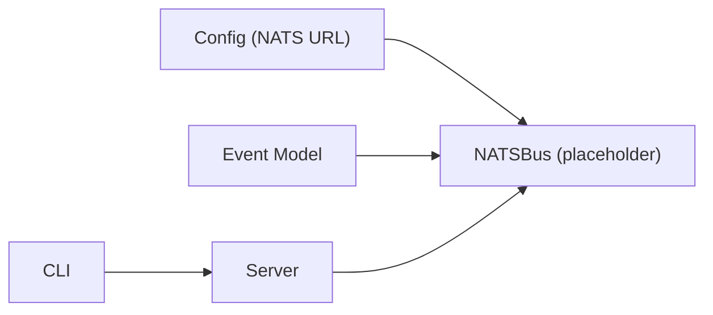
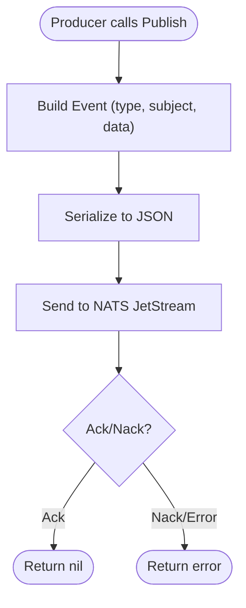
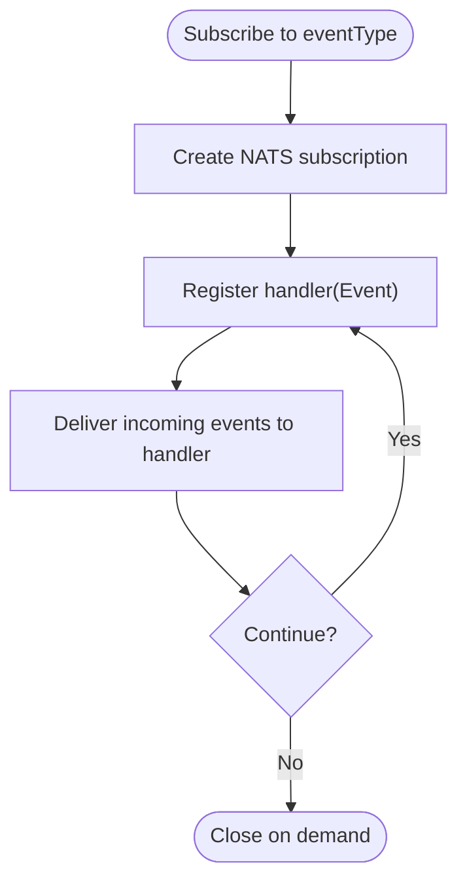

# Event Processing

<cite>
**Referenced Files in This Document**
- [event.go](file://pkg/event/event.go)
- [nats.go](file://pkg/event/nats.go)
- [types.go](file://pkg/config/types.go)
- [config.go](file://pkg/config/config.go)
- [resolvenet.yaml](file://configs/resolvenet.yaml)
- [server.go](file://pkg/server/server.go)
- [main.go](file://cmd/resolvenet-server/main.go)
- [main.go](file://cmd/resolvenet-cli/main.go)
- [root.go](file://internal/cli/root.go)
- [agent.proto](file://api/proto/resolvenet/v1/agent.proto)
- [workflow.proto](file://api/proto/resolvenet/v1/workflow.proto)
</cite>

## Table of Contents
1. [Introduction](#introduction)
2. [Project Structure](#project-structure)
3. [Core Components](#core-components)
4. [Architecture Overview](#architecture-overview)
5. [Detailed Component Analysis](#detailed-component-analysis)
6. [Dependency Analysis](#dependency-analysis)
7. [Performance Considerations](#performance-considerations)
8. [Troubleshooting Guide](#troubleshooting-guide)
9. [Conclusion](#conclusion)
10. [Appendices](#appendices)

## Introduction
This document describes the event processing system built on NATS messaging. It explains the event-driven architecture, message publishing and subscription patterns, event types and payload structures, serialization formats, NATS integration, connection management, error handling, routing and filtering, delivery guarantees, durability and retry mechanisms, dead letter queue handling, integration with real-time interfaces (WebUI and CLI), and operational monitoring and troubleshooting.

## Project Structure
The event processing system centers around a small but extensible event abstraction and a placeholder NATS-backed event bus. Configuration for NATS is provided via a dedicated configuration section and environment overrides. The platform server exposes HTTP and gRPC endpoints, while CLI commands provide operational interfaces.

**Diagram sources**
- [server.go:19-52](file://pkg/server/server.go#L19-L52)
- [config.go:10-62](file://pkg/config/config.go#L10-L62)
- [resolvenet.yaml:1-34](file://configs/resolvenet.yaml#L1-L34)
- [event.go:7-22](file://pkg/event/event.go#L7-L22)
- [nats.go:8-45](file://pkg/event/nats.go#L8-L45)
- [root.go:19-52](file://internal/cli/root.go#L19-L52)

**Section sources**
- [server.go:19-52](file://pkg/server/server.go#L19-L52)
- [config.go:10-62](file://pkg/config/config.go#L10-L62)
- [resolvenet.yaml:1-34](file://configs/resolvenet.yaml#L1-L34)
- [event.go:7-22](file://pkg/event/event.go#L7-L22)
- [nats.go:8-45](file://pkg/event/nats.go#L8-L45)
- [root.go:19-52](file://internal/cli/root.go#L19-L52)

## Core Components
- Event model: A generic event with type, subject, and structured data payload.
- Bus interface: Defines publish, subscribe, and close operations.
- NATSBus: Placeholder implementation indicating planned NATS JetStream integration.
- Configuration: NATS URL is configurable via YAML and environment variables.

Key implementation references:
- Event model and Bus interface: [event.go:7-22](file://pkg/event/event.go#L7-L22)
- NATSBus placeholder: [nats.go:8-45](file://pkg/event/nats.go#L8-L45)
- NATS configuration model: [types.go:47-50](file://pkg/config/types.go#L47-L50)
- Configuration loading and defaults: [config.go:10-62](file://pkg/config/config.go#L10-L62)
- Example NATS URL in default config: [resolvenet.yaml:19-21](file://configs/resolvenet.yaml#L19-L21)

**Section sources**
- [event.go:7-22](file://pkg/event/event.go#L7-L22)
- [nats.go:8-45](file://pkg/event/nats.go#L8-L45)
- [types.go:47-50](file://pkg/config/types.go#L47-L50)
- [config.go:10-62](file://pkg/config/config.go#L10-L62)
- [resolvenet.yaml:19-21](file://configs/resolvenet.yaml#L19-L21)

## Architecture Overview
The platform uses an event-driven architecture with NATS as the event bus. The server initializes HTTP and gRPC endpoints and can integrate an event bus for cross-service communication. CLI and WebUI interact with the server to produce and consume events indirectly through API calls.

**Diagram sources**
- [server.go:34-51](file://pkg/server/server.go#L34-L51)
- [event.go:14-22](file://pkg/event/event.go#L14-L22)
- [nats.go:8-14](file://pkg/event/nats.go#L8-L14)
- [resolvenet.yaml:19-21](file://configs/resolvenet.yaml#L19-L21)

## Detailed Component Analysis

### Event Model and Payloads
- Event fields:
  - Type: String discriminator for routing and filtering.
  - Subject: String identifier for scoping events.
  - Data: Structured map payload supporting arbitrary JSON-like content.
- Serialization: Events are represented as JSON with fields type, subject, and data.

References:
- Event struct: [event.go:7-12](file://pkg/event/event.go#L7-L12)

**Diagram sources**
- [event.go:7-22](file://pkg/event/event.go#L7-L22)
- [nats.go:8-45](file://pkg/event/nats.go#L8-L45)

**Section sources**
- [event.go:7-12](file://pkg/event/event.go#L7-L12)

### NATS Integration and Bus Lifecycle
- Initialization: Create NATSBus with URL and logger; placeholder indicates JetStream initialization is pending.
- Publishing: Serialize and publish events to NATS JetStream; logging indicates publish attempts.
- Subscribing: Register handlers for specific event types; logging confirms subscriptions.
- Closing: Disconnect from NATS; placeholder indicates cleanup is pending.

References:
- NATSBus creation and methods: [nats.go:16-45](file://pkg/event/nats.go#L16-L45)

**Diagram sources**
- [nats.go:27-39](file://pkg/event/nats.go#L27-L39)

**Section sources**
- [nats.go:16-45](file://pkg/event/nats.go#L16-L45)

### Configuration and Environment Integration
- NATS URL is configured under the nats section and loaded via Viper.
- Defaults are set for development; environment variables override keys using dot notation replacement.
- Example default URL is present in the sample configuration file.

References:
- NATS config model: [types.go:47-50](file://pkg/config/types.go#L47-L50)
- Config loading and defaults: [config.go:10-62](file://pkg/config/config.go#L10-L62)
- Sample NATS URL: [resolvenet.yaml:19-21](file://configs/resolvenet.yaml#L19-L21)

**Section sources**
- [types.go:47-50](file://pkg/config/types.go#L47-L50)
- [config.go:10-62](file://pkg/config/config.go#L10-L62)
- [resolvenet.yaml:19-21](file://configs/resolvenet.yaml#L19-L21)

### Server and Operational Interfaces
- Server initializes gRPC and HTTP servers, registers health checks, and supports graceful shutdown.
- CLI root command sets up persistent flags and subcommands; server entry point loads config and runs the server.

References:
- Server creation and run loop: [server.go:27-103](file://pkg/server/server.go#L27-L103)
- Server entry point: [main.go:16-55](file://cmd/resolvenet-server/main.go#L16-L55)
- CLI root command: [root.go:19-71](file://internal/cli/root.go#L19-L71)
- CLI entry point: [main.go:9-13](file://cmd/resolvenet-cli/main.go#L9-L13)

**Section sources**
- [server.go:27-103](file://pkg/server/server.go#L27-L103)
- [main.go:16-55](file://cmd/resolvenet-server/main.go#L16-L55)
- [root.go:19-71](file://internal/cli/root.go#L19-L71)
- [main.go:9-13](file://cmd/resolvenet-cli/main.go#L9-L13)

### Real-Time Interfaces: WebUI and CLI
- WebUI interacts with the platform via HTTP endpoints exposed by the server.
- CLI provides operational commands and connects to the platform server address via flags.

References:
- WebUI integration: implied by HTTP server exposure in server creation.
- CLI flags and subcommands: [root.go:36-51](file://internal/cli/root.go#L36-L51)

**Section sources**
- [server.go:44-51](file://pkg/server/server.go#L44-L51)
- [root.go:36-51](file://internal/cli/root.go#L36-L51)

### Event Types and Payloads from Protobuf Definitions
While the generic event model is used internally, the platform’s APIs define domain-specific event-like messages for streaming execution and workflow events. These inform the design of event types and payloads.

- Agent execution events include type, message, structured data, and timestamps.
- Workflow events include workflow identifiers, execution identifiers, node/gate events, and structured data.

References:
- Agent execution event: [agent.proto:112-117](file://api/proto/resolvenet/v1/agent.proto#L112-L117)
- Workflow event: [workflow.proto:81-90](file://api/proto/resolvenet/v1/workflow.proto#L81-L90)

**Section sources**
- [agent.proto:112-117](file://api/proto/resolvenet/v1/agent.proto#L112-L117)
- [workflow.proto:81-90](file://api/proto/resolvenet/v1/workflow.proto#L81-L90)

## Dependency Analysis
The event bus is currently a placeholder. The server depends on configuration for NATS URL, and the CLI provides operational controls. The following diagram shows current dependencies among the key components.

**Diagram sources**
- [types.go:47-50](file://pkg/config/types.go#L47-L50)
- [nats.go:8-14](file://pkg/event/nats.go#L8-L14)
- [event.go:7-12](file://pkg/event/event.go#L7-L12)
- [server.go:27-51](file://pkg/server/server.go#L27-L51)
- [root.go:19-52](file://internal/cli/root.go#L19-L52)

**Section sources**
- [types.go:47-50](file://pkg/config/types.go#L47-L50)
- [nats.go:8-14](file://pkg/event/nats.go#L8-L14)
- [event.go:7-12](file://pkg/event/event.go#L7-L12)
- [server.go:27-51](file://pkg/server/server.go#L27-L51)
- [root.go:19-52](file://internal/cli/root.go#L19-L52)

## Performance Considerations
- Throughput optimization:
  - Use JetStream durable consumers and stream subjects to scale horizontally.
  - Batch publishes where appropriate and leverage async acknowledgment modes.
  - Tune consumer pull sizes and prefetch limits.
- Latency reduction:
  - Keep payloads minimal; avoid embedding large binary data in event.Data.
  - Prefer compact subject naming to reduce parsing overhead.
- Backpressure:
  - Monitor JetStream stream and consumer lag; adjust consumer concurrency accordingly.
- Observability:
  - Enable metrics and traces for NATS JetStream and application layers.

[No sources needed since this section provides general guidance]

## Troubleshooting Guide
- NATS connectivity:
  - Verify NATS URL in configuration and environment variables.
  - Confirm NATS server availability and credentials.
- Logging:
  - NATSBus logs indicate initialization, publish attempts, and subscription registration.
  - Server logs show startup and shutdown events.
- Health and graceful shutdown:
  - Use gRPC health service and signal handling for controlled shutdown.

References:
- NATSBus logging: [nats.go:22-38](file://pkg/event/nats.go#L22-L38)
- Server logging and shutdown: [server.go:68-96](file://pkg/server/server.go#L68-L96)
- Server entry point logging: [main.go:22-28](file://cmd/resolvenet-server/main.go#L22-L28)

**Section sources**
- [nats.go:22-38](file://pkg/event/nats.go#L22-L38)
- [server.go:68-96](file://pkg/server/server.go#L68-L96)
- [main.go:22-28](file://cmd/resolvenet-server/main.go#L22-L28)

## Conclusion
The event processing system is designed around a clean event model and a Bus interface with a NATS-backed implementation in progress. Configuration supports NATS URL via YAML and environment variables. The server exposes HTTP and gRPC endpoints, while CLI and WebUI provide operational and user interfaces. As the NATSBus implementation advances, it will enable robust event routing, filtering, and delivery guarantees aligned with JetStream capabilities.

[No sources needed since this section summarizes without analyzing specific files]

## Appendices

### Event Publishing Flow

**Diagram sources**
- [nats.go:27-31](file://pkg/event/nats.go#L27-L31)
- [event.go:7-12](file://pkg/event/event.go#L7-L12)

### Event Subscription Flow

**Diagram sources**
- [nats.go:34-39](file://pkg/event/nats.go#L34-L39)

### Event Durability, Retry, and Dead Letter Queue
- Durability: JetStream streams and durable consumers persist messages and track delivery progress.
- Retries: Configure max deliveries and backoff policies on JetStream consumers.
- Dead-letter queues: Route unacknowledged messages after retries to a separate subject for inspection and reprocessing.

[No sources needed since this section provides general guidance]