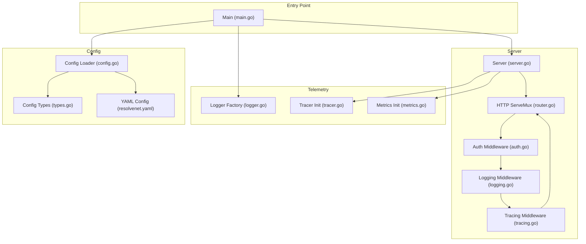
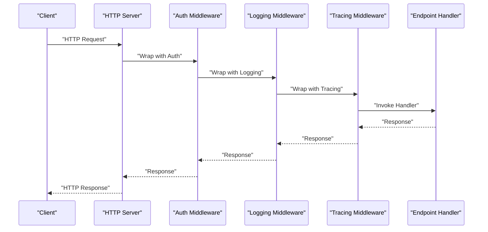
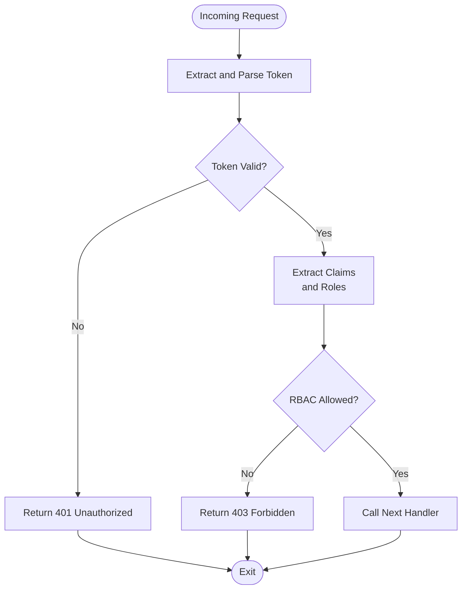
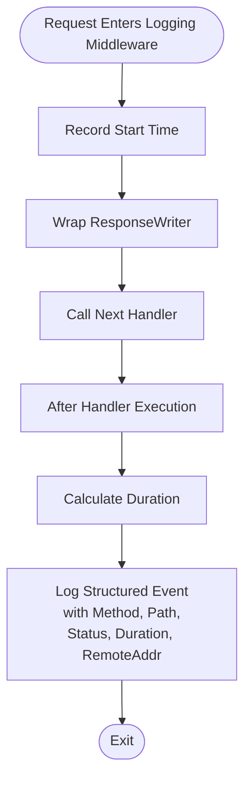
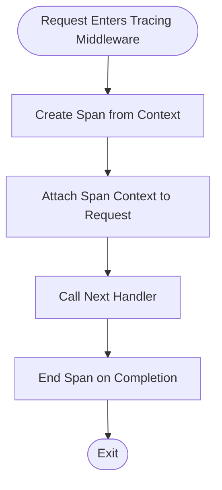
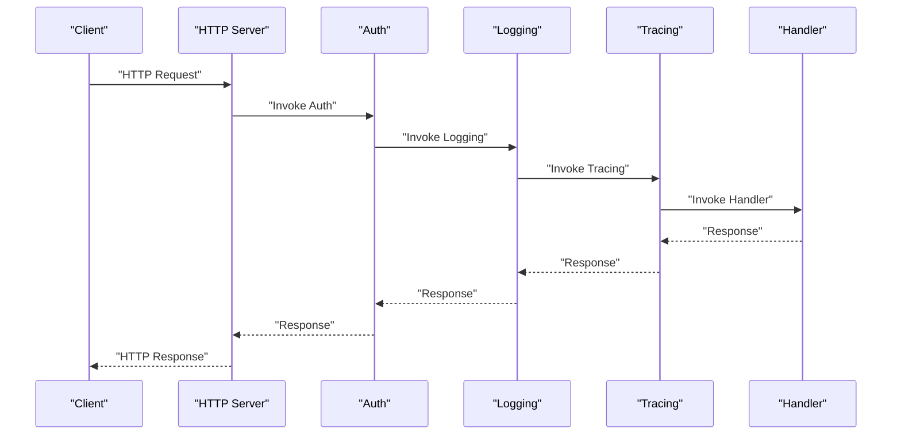
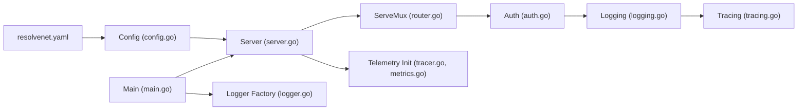

# Middleware Architecture

<cite>
**Referenced Files in This Document**
- [auth.go](file://pkg/server/middleware/auth.go)
- [logging.go](file://pkg/server/middleware/logging.go)
- [tracing.go](file://pkg/server/middleware/tracing.go)
- [router.go](file://pkg/server/router.go)
- [server.go](file://pkg/server/server.go)
- [logger.go](file://pkg/telemetry/logger.go)
- [tracer.go](file://pkg/telemetry/tracer.go)
- [metrics.go](file://pkg/telemetry/metrics.go)
- [main.go](file://cmd/resolvenet-server/main.go)
- [resolvenet.yaml](file://configs/resolvenet.yaml)
- [config.go](file://pkg/config/config.go)
- [types.go](file://pkg/config/types.go)
</cite>

## Table of Contents
1. [Introduction](#introduction)
2. [Project Structure](#project-structure)
3. [Core Components](#core-components)
4. [Architecture Overview](#architecture-overview)
5. [Detailed Component Analysis](#detailed-component-analysis)
6. [Dependency Analysis](#dependency-analysis)
7. [Performance Considerations](#performance-considerations)
8. [Troubleshooting Guide](#troubleshooting-guide)
9. [Conclusion](#conclusion)
10. [Appendices](#appendices)

## Introduction
This document explains the middleware architecture supporting authentication, logging, and tracing in the platform’s HTTP server. It covers the middleware chain implementation, request/response processing, error handling patterns, and the current state of each middleware component. It also documents how these middlewares relate to the overall request lifecycle, outlines security considerations, and provides guidance for extending the middleware stack with custom implementations.

## Project Structure
The middleware and telemetry components are organized under the server and telemetry packages, with configuration managed via Viper and YAML. The HTTP server registers REST endpoints and composes middleware around the request handler chain.

**Diagram sources**
- [server.go:44-49](file://pkg/server/server.go#L44-L49)
- [router.go:11-55](file://pkg/server/router.go#L11-L55)
- [auth.go:8-17](file://pkg/server/middleware/auth.go#L8-L17)
- [logging.go:19-37](file://pkg/server/middleware/logging.go#L19-L37)
- [tracing.go:7-18](file://pkg/server/middleware/tracing.go#L7-L18)
- [logger.go:8-35](file://pkg/telemetry/logger.go#L8-L35)
- [tracer.go:8-21](file://pkg/telemetry/tracer.go#L8-L21)
- [metrics.go:7-12](file://pkg/telemetry/metrics.go#L7-L12)
- [main.go:16-34](file://cmd/resolvenet-server/main.go#L16-L34)
- [config.go:10-62](file://pkg/config/config.go#L10-L62)
- [types.go:4-69](file://pkg/config/types.go#L4-L69)
- [resolvenet.yaml:1-34](file://configs/resolvenet.yaml#L1-L34)

**Section sources**
- [server.go:44-49](file://pkg/server/server.go#L44-L49)
- [router.go:11-55](file://pkg/server/router.go#L11-L55)
- [main.go:16-34](file://cmd/resolvenet-server/main.go#L16-L34)
- [config.go:10-62](file://pkg/config/config.go#L10-L62)
- [types.go:4-69](file://pkg/config/types.go#L4-L69)
- [resolvenet.yaml:1-34](file://configs/resolvenet.yaml#L1-L34)

## Core Components
- Authentication middleware: Validates authentication tokens and enforces role-based access control. Current implementation is a placeholder and passes through all requests.
- Logging middleware: Wraps the response writer to capture status codes, logs structured request metadata, and measures duration.
- Tracing middleware: Creates OpenTelemetry spans for distributed tracing. Current implementation is a placeholder and does not attach spans to the request context.

These middlewares are designed to be composed around the HTTP handler chain to provide cross-cutting concerns consistently across all endpoints.

**Section sources**
- [auth.go:8-17](file://pkg/server/middleware/auth.go#L8-L17)
- [logging.go:9-37](file://pkg/server/middleware/logging.go#L9-L37)
- [tracing.go:7-18](file://pkg/server/middleware/tracing.go#L7-L18)

## Architecture Overview
The HTTP server initializes a ServeMux and registers REST endpoints. The middleware chain is applied around the handler chain so that each request flows through authentication, logging, and tracing before reaching the endpoint handler. Telemetry initialization is performed during server startup.

**Diagram sources**
- [server.go:44-49](file://pkg/server/server.go#L44-L49)
- [router.go:11-55](file://pkg/server/router.go#L11-L55)
- [auth.go:8-17](file://pkg/server/middleware/auth.go#L8-L17)
- [logging.go:19-37](file://pkg/server/middleware/logging.go#L19-L37)
- [tracing.go:7-18](file://pkg/server/middleware/tracing.go#L7-L18)

## Detailed Component Analysis

### Authentication Middleware
Purpose:
- Enforce authentication and authorization policies.
- Extract identity and roles from tokens.
- Support role-based access control (RBAC) decisions.

Current state:
- Placeholder implementation that forwards all requests without validation.

Design pattern:
- Returns a higher-order function that wraps the next handler, enabling chaining.

Security considerations:
- Token validation must be implemented with secure parsing and signature verification.
- Prefer short-lived access tokens with refresh token rotation.
- Apply least privilege and enforce RBAC at the handler boundary.

Extensibility:
- Add token extraction from Authorization headers.
- Integrate with a token issuer (e.g., JWT) and validate claims.
- Implement RBAC checks against user roles and resource permissions.

**Diagram sources**
- [auth.go:8-17](file://pkg/server/middleware/auth.go#L8-L17)

**Section sources**
- [auth.go:8-17](file://pkg/server/middleware/auth.go#L8-L17)

### Logging Middleware
Purpose:
- Provide structured logging for every HTTP request.
- Capture method, path, status code, duration, and remote address.
- Wrap the response writer to record status code after handler execution.

Design pattern:
- ResponseWriter wrapper captures WriteHeader invocations.
- Logs after invoking the next handler to reflect final status code.

Audit trail:
- Structured logs enable downstream aggregation and filtering.
- Include request correlation identifiers (trace ID) when integrated with tracing.

**Diagram sources**
- [logging.go:9-37](file://pkg/server/middleware/logging.go#L9-L37)

**Section sources**
- [logging.go:9-37](file://pkg/server/middleware/logging.go#L9-L37)

### Tracing Middleware
Purpose:
- Create OpenTelemetry spans per request for distributed tracing.
- Propagate context to downstream services.

Current state:
- Placeholder implementation that does not create or attach spans.

Integration points:
- Initialize OpenTelemetry tracer and meter providers during server startup.
- Use the request context to create spans and set attributes.

**Diagram sources**
- [tracing.go:7-18](file://pkg/server/middleware/tracing.go#L7-L18)
- [tracer.go:8-21](file://pkg/telemetry/tracer.go#L8-L21)

**Section sources**
- [tracing.go:7-18](file://pkg/server/middleware/tracing.go#L7-L18)
- [tracer.go:8-21](file://pkg/telemetry/tracer.go#L8-L21)

### Request Lifecycle and Middleware Chain
The request lifecycle begins at the HTTP server, which delegates to the ServeMux. The middleware chain wraps the handler in the order: Auth → Logging → Tracing. Each middleware may modify or inspect the request/response and then call the next component. The final handler writes the response back through the chain.

**Diagram sources**
- [server.go:44-49](file://pkg/server/server.go#L44-L49)
- [router.go:11-55](file://pkg/server/router.go#L11-L55)
- [auth.go:8-17](file://pkg/server/middleware/auth.go#L8-L17)
- [logging.go:19-37](file://pkg/server/middleware/logging.go#L19-L37)
- [tracing.go:7-18](file://pkg/server/middleware/tracing.go#L7-L18)

**Section sources**
- [server.go:44-49](file://pkg/server/server.go#L44-L49)
- [router.go:11-55](file://pkg/server/router.go#L11-L55)

## Dependency Analysis
The server composes the middleware chain around the ServeMux. Telemetry initialization is invoked during server construction. Configuration drives server addresses and telemetry toggles.

**Diagram sources**
- [server.go:44-49](file://pkg/server/server.go#L44-L49)
- [router.go:11-55](file://pkg/server/router.go#L11-L55)
- [auth.go:8-17](file://pkg/server/middleware/auth.go#L8-L17)
- [logging.go:19-37](file://pkg/server/middleware/logging.go#L19-L37)
- [tracing.go:7-18](file://pkg/server/middleware/tracing.go#L7-L18)
- [tracer.go:8-21](file://pkg/telemetry/tracer.go#L8-L21)
- [metrics.go:7-12](file://pkg/telemetry/metrics.go#L7-L12)
- [main.go:16-34](file://cmd/resolvenet-server/main.go#L16-L34)
- [logger.go:8-35](file://pkg/telemetry/logger.go#L8-L35)
- [config.go:10-62](file://pkg/config/config.go#L10-L62)
- [resolvenet.yaml:1-34](file://configs/resolvenet.yaml#L1-L34)

**Section sources**
- [server.go:44-49](file://pkg/server/server.go#L44-L49)
- [config.go:10-62](file://pkg/config/config.go#L10-L62)
- [resolvenet.yaml:1-34](file://configs/resolvenet.yaml#L1-L34)

## Performance Considerations
- Middleware overhead: Each middleware adds CPU and memory overhead. Keep middleware logic efficient and avoid heavy synchronous work inside the request path.
- Logging cost: Structured logging is generally lightweight but can become expensive under high throughput. Consider sampling or asynchronous logging.
- Tracing cost: Creating spans introduces overhead. Enable tracing selectively in production and tune export batching.
- ResponseWriter wrapping: Minimal overhead; ensure no unnecessary allocations in hot paths.
- Concurrency: The server runs HTTP and gRPC concurrently; middleware should be safe for concurrent use.

[No sources needed since this section provides general guidance]

## Troubleshooting Guide
Common issues and remedies:
- Authentication middleware not enforcing policies: Verify the placeholder is replaced with token validation and RBAC checks.
- Missing request correlation in logs: Integrate tracing middleware to populate trace IDs and propagate them to logs.
- Tracing not exporting: Ensure telemetry initialization is enabled and configured with a valid OTLP endpoint.
- Configuration not applied: Confirm environment variable prefixes and YAML paths match the configuration loader defaults and keys.

Operational checks:
- Validate server addresses and ports in configuration.
- Confirm telemetry settings (enabled, endpoint, service name).
- Review structured logs for errors and durations.

**Section sources**
- [resolvenet.yaml:29-34](file://configs/resolvenet.yaml#L29-L34)
- [config.go:10-62](file://pkg/config/config.go#L10-L62)
- [logger.go:8-35](file://pkg/telemetry/logger.go#L8-L35)
- [tracer.go:8-21](file://pkg/telemetry/tracer.go#L8-L21)

## Conclusion
The middleware architecture provides a clean separation of concerns for authentication, logging, and tracing. While the current implementation includes placeholders for token validation and tracing, the design supports straightforward extension to meet production-grade security and observability needs. Proper configuration and careful performance tuning will ensure reliable operation under real-world loads.

[No sources needed since this section summarizes without analyzing specific files]

## Appendices

### Middleware Configuration Examples
- Authentication: Configure token issuer, signing keys, and RBAC policy mappings.
- Logging: Choose JSON or text format and set minimum log level.
- Tracing: Enable telemetry, configure OTLP endpoint, and set service name.

**Section sources**
- [resolvenet.yaml:29-34](file://configs/resolvenet.yaml#L29-L34)
- [logger.go:8-35](file://pkg/telemetry/logger.go#L8-L35)
- [tracer.go:8-21](file://pkg/telemetry/tracer.go#L8-L21)

### Custom Middleware Development
Patterns:
- Higher-order function returning a handler that wraps the next handler.
- Preserve request context and headers.
- Minimize allocations and avoid blocking operations.
- Use structured logging for diagnostics.

Integration:
- Compose middleware around the ServeMux in the desired order.
- Initialize telemetry providers early in the server lifecycle.

**Section sources**
- [auth.go:8-17](file://pkg/server/middleware/auth.go#L8-L17)
- [logging.go:19-37](file://pkg/server/middleware/logging.go#L19-L37)
- [tracing.go:7-18](file://pkg/server/middleware/tracing.go#L7-L18)
- [server.go:44-49](file://pkg/server/server.go#L44-L49)