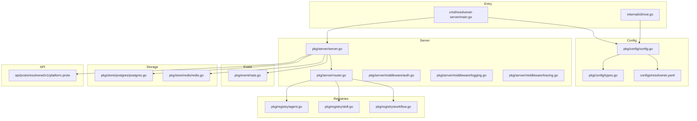
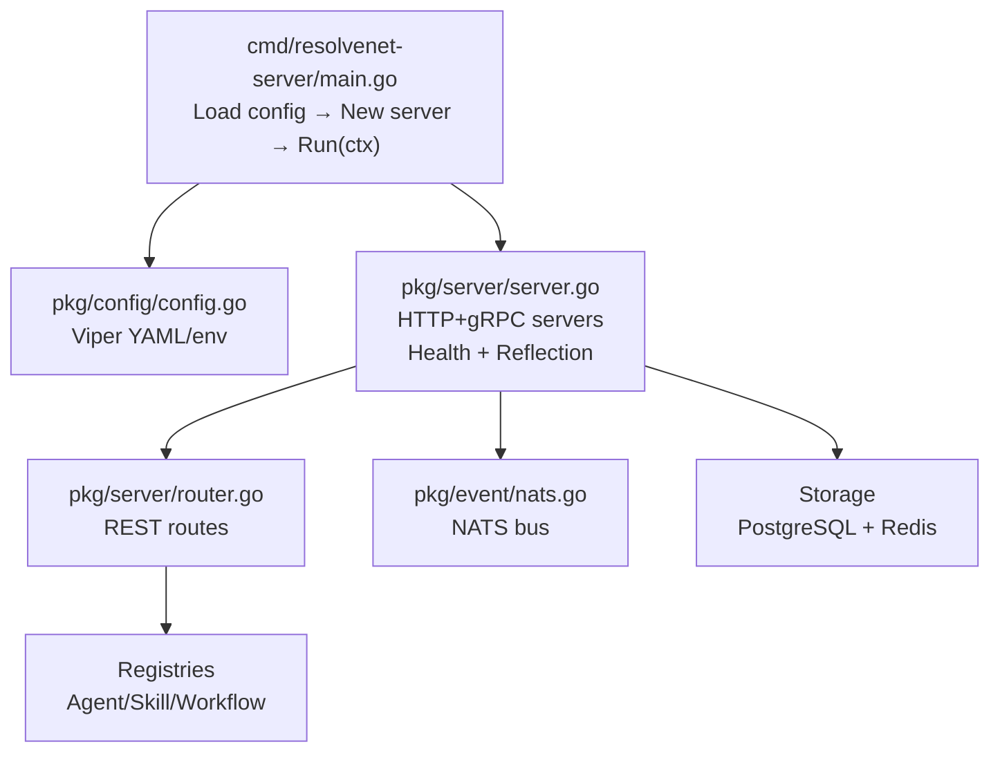
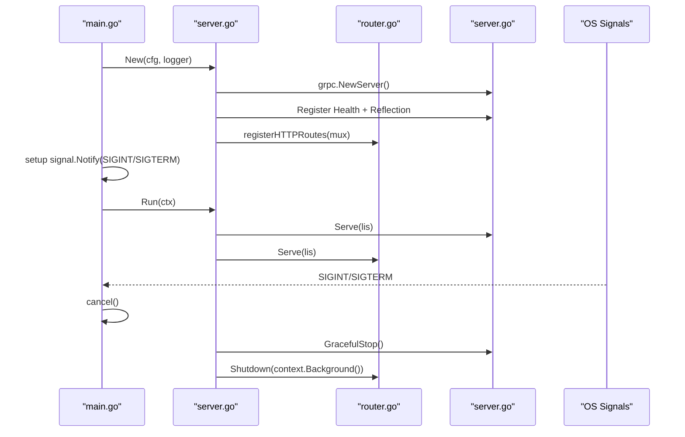
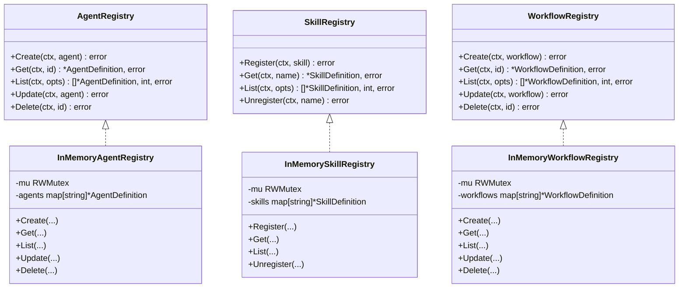
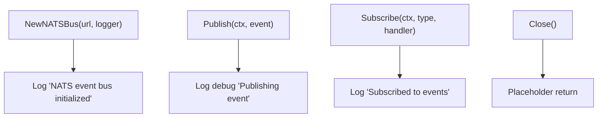
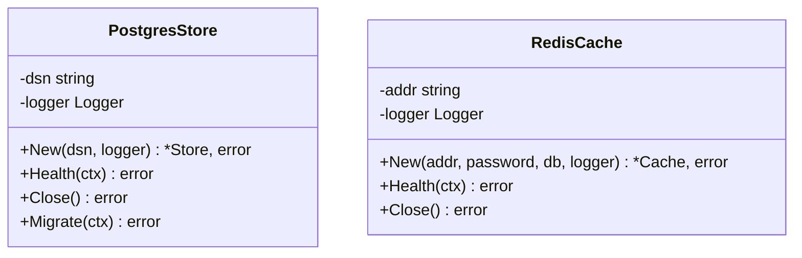
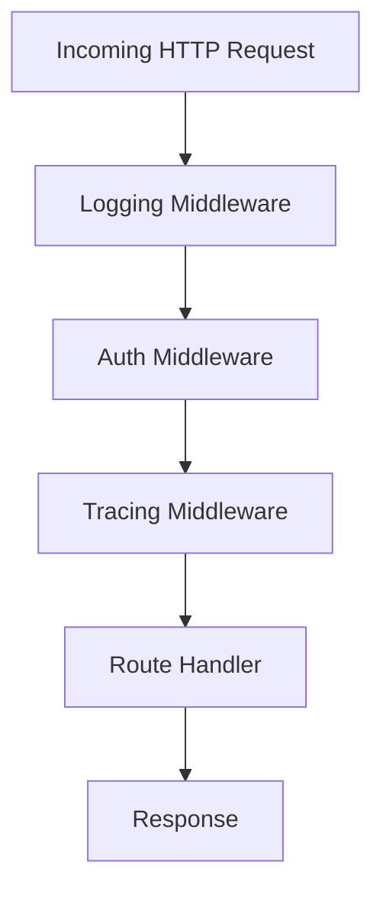
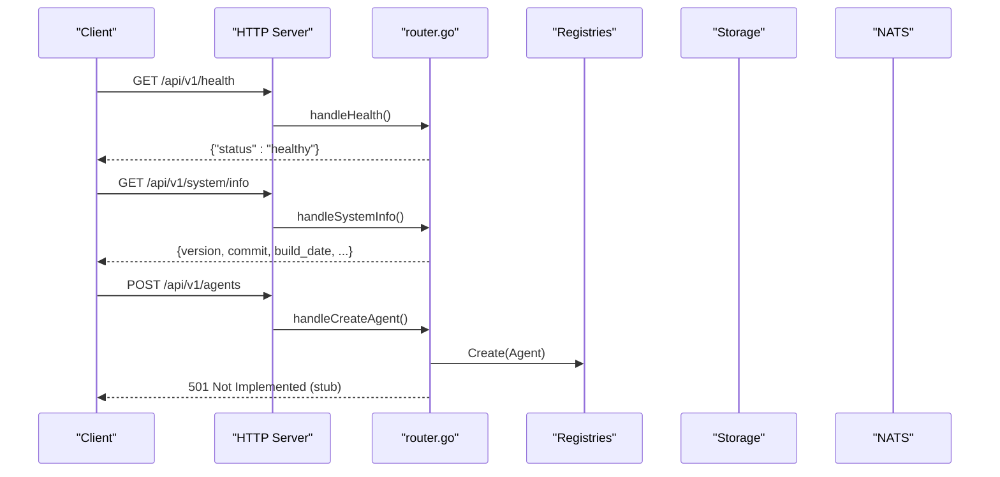
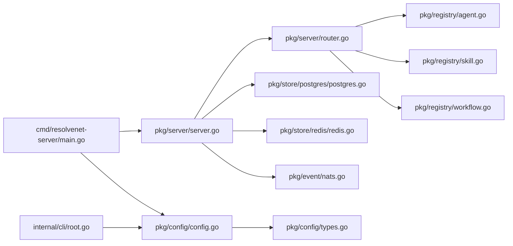

# Platform Services (Go)

<cite>
**Referenced Files in This Document**
- [main.go](file://cmd/resolvenet-server/main.go)
- [config.go](file://pkg/config/config.go)
- [types.go](file://pkg/config/types.go)
- [server.go](file://pkg/server/server.go)
- [router.go](file://pkg/server/router.go)
- [auth.go](file://pkg/server/middleware/auth.go)
- [logging.go](file://pkg/server/middleware/logging.go)
- [tracing.go](file://pkg/server/middleware/tracing.go)
- [agent.go](file://pkg/registry/agent.go)
- [skill.go](file://pkg/registry/skill.go)
- [workflow.go](file://pkg/registry/workflow.go)
- [nats.go](file://pkg/event/nats.go)
- [postgres.go](file://pkg/store/postgres/postgres.go)
- [redis.go](file://pkg/store/redis/redis.go)
- [platform.proto](file://api/proto/resolvenet/v1/platform.proto)
- [root.go](file://internal/cli/root.go)
- [resolvenet.yaml](file://configs/resolvenet.yaml)
</cite>

## Table of Contents
1. [Introduction](#introduction)
2. [Project Structure](#project-structure)
3. [Core Components](#core-components)
4. [Architecture Overview](#architecture-overview)
5. [Detailed Component Analysis](#detailed-component-analysis)
6. [Dependency Analysis](#dependency-analysis)
7. [Performance Considerations](#performance-considerations)
8. [Troubleshooting Guide](#troubleshooting-guide)
9. [Conclusion](#conclusion)
10. [Appendices](#appendices)

## Introduction
This document describes the Go-based platform services that power the ResolveNet Mega Agent platform. It covers the HTTP/gRPC server architecture with health checks and graceful shutdown, configuration management via hierarchical YAML and environment variables, registry systems for agents, skills, and workflows, event processing with NATS, the storage layer using PostgreSQL and Redis, middleware for authentication, logging, and tracing, API endpoints and schemas, integration patterns, and deployment considerations.

## Project Structure
The platform is organized into:
- Command entrypoints for the server and CLI
- Configuration subsystem with Viper-backed hierarchy
- HTTP/gRPC server with REST routes and gRPC health reflection
- Registry interfaces and in-memory implementations
- Event bus abstraction for NATS
- Storage abstractions for PostgreSQL and Redis
- Protocol buffers for gRPC APIs
- CLI commands for agent, skill, workflow, RAG, and configuration operations
- Helm/Kubernetes and Docker Compose artifacts for deployment



**Diagram sources**
- [main.go:1-56](file://cmd/resolvenet-server/main.go#L1-L56)
- [config.go:1-63](file://pkg/config/config.go#L1-L63)
- [types.go:1-70](file://pkg/config/types.go#L1-L70)
- [server.go:1-104](file://pkg/server/server.go#L1-L104)
- [router.go:1-183](file://pkg/server/router.go#L1-L183)
- [agent.go:1-103](file://pkg/registry/agent.go#L1-L103)
- [skill.go:1-80](file://pkg/registry/skill.go#L1-L80)
- [workflow.go:1-94](file://pkg/registry/workflow.go#L1-L94)
- [nats.go:1-46](file://pkg/event/nats.go#L1-L46)
- [postgres.go:1-45](file://pkg/store/postgres/postgres.go#L1-L45)
- [redis.go:1-37](file://pkg/store/redis/redis.go#L1-L37)
- [platform.proto:1-61](file://api/proto/resolvenet/v1/platform.proto#L1-L61)
- [root.go:1-72](file://internal/cli/root.go#L1-L72)
- [resolvenet.yaml:1-34](file://configs/resolvenet.yaml#L1-L34)

**Section sources**
- [main.go:1-56](file://cmd/resolvenet-server/main.go#L1-L56)
- [config.go:1-63](file://pkg/config/config.go#L1-L63)
- [types.go:1-70](file://pkg/config/types.go#L1-L70)
- [server.go:1-104](file://pkg/server/server.go#L1-L104)
- [router.go:1-183](file://pkg/server/router.go#L1-L183)
- [agent.go:1-103](file://pkg/registry/agent.go#L1-L103)
- [skill.go:1-80](file://pkg/registry/skill.go#L1-L80)
- [workflow.go:1-94](file://pkg/registry/workflow.go#L1-L94)
- [nats.go:1-46](file://pkg/event/nats.go#L1-L46)
- [postgres.go:1-45](file://pkg/store/postgres/postgres.go#L1-L45)
- [redis.go:1-37](file://pkg/store/redis/redis.go#L1-L37)
- [platform.proto:1-61](file://api/proto/resolvenet/v1/platform.proto#L1-L61)
- [root.go:1-72](file://internal/cli/root.go#L1-L72)
- [resolvenet.yaml:1-34](file://configs/resolvenet.yaml#L1-L34)

## Core Components
- HTTP/gRPC server with health checks and reflection
- Graceful shutdown on OS signals
- Hierarchical configuration from YAML and environment variables
- Registry interfaces for agents, skills, and workflows with in-memory implementations
- Event bus abstraction for NATS
- Storage abstractions for PostgreSQL and Redis
- Middleware stack for auth, logging, and tracing
- REST API routes and gRPC service definitions

**Section sources**
- [server.go:1-104](file://pkg/server/server.go#L1-L104)
- [router.go:1-183](file://pkg/server/router.go#L1-L183)
- [config.go:1-63](file://pkg/config/config.go#L1-L63)
- [types.go:1-70](file://pkg/config/types.go#L1-L70)
- [agent.go:1-103](file://pkg/registry/agent.go#L1-L103)
- [skill.go:1-80](file://pkg/registry/skill.go#L1-L80)
- [workflow.go:1-94](file://pkg/registry/workflow.go#L1-L94)
- [nats.go:1-46](file://pkg/event/nats.go#L1-L46)
- [postgres.go:1-45](file://pkg/store/postgres/postgres.go#L1-L45)
- [redis.go:1-37](file://pkg/store/redis/redis.go#L1-L37)
- [auth.go:1-18](file://pkg/server/middleware/auth.go#L1-L18)
- [logging.go:1-38](file://pkg/server/middleware/logging.go#L1-L38)
- [tracing.go:1-19](file://pkg/server/middleware/tracing.go#L1-L19)

## Architecture Overview
The platform initializes configuration, constructs the server, registers routes and gRPC services, and starts both HTTP and gRPC listeners. Shutdown is handled gracefully via context cancellation and OS signals. Middleware applies logging and placeholder auth/tracing. Registries and storage are abstracted behind interfaces. Events are published/subscribed via NATS.



**Diagram sources**
- [main.go:1-56](file://cmd/resolvenet-server/main.go#L1-L56)
- [config.go:1-63](file://pkg/config/config.go#L1-L63)
- [server.go:1-104](file://pkg/server/server.go#L1-L104)
- [router.go:1-183](file://pkg/server/router.go#L1-L183)
- [agent.go:1-103](file://pkg/registry/agent.go#L1-L103)
- [skill.go:1-80](file://pkg/registry/skill.go#L1-L80)
- [workflow.go:1-94](file://pkg/registry/workflow.go#L1-L94)
- [nats.go:1-46](file://pkg/event/nats.go#L1-L46)
- [postgres.go:1-45](file://pkg/store/postgres/postgres.go#L1-L45)
- [redis.go:1-37](file://pkg/store/redis/redis.go#L1-L37)

## Detailed Component Analysis

### HTTP/gRPC Server and Health Checks
- Creates gRPC server with health service and reflection enabled
- Starts HTTP server with REST routes
- Graceful shutdown via context and signal handling
- Health endpoint exposed on HTTP



**Diagram sources**
- [main.go:36-52](file://cmd/resolvenet-server/main.go#L36-L52)
- [server.go:27-103](file://pkg/server/server.go#L27-L103)
- [router.go:11-55](file://pkg/server/router.go#L11-L55)

**Section sources**
- [server.go:1-104](file://pkg/server/server.go#L1-L104)
- [router.go:11-55](file://pkg/server/router.go#L11-L55)
- [main.go:36-52](file://cmd/resolvenet-server/main.go#L36-L52)

### Configuration Management
- Defaults set for server, database, Redis, NATS, runtime, gateway, and telemetry
- Loads YAML from multiple paths and merges environment variables (RESOLVENET_ prefix, dot-to-underscore replacement)
- Unmarshals into strongly typed Config

```mermaid
flowchart TD
Start(["Load(configPath)"]) --> Defaults["Set defaults for server, db, redis, nats, runtime, gateway, telemetry"]
Defaults --> Paths{"configPath provided?"}
Paths --> |Yes| UseFile["SetConfigFile(configPath)"]
Paths --> |No| AddPaths["AddConfigPath('.')" + "AddConfigPath('/etc/resolvenet')" + "AddConfigPath('$HOME/.resolvenet')"]
UseFile --> Env["SetEnvPrefix('RESOLVENET'), SetEnvKeyReplacer('.','_'), AutomaticEnv()"]
AddPaths --> Env
Env --> Read["ReadInConfig() (ignore file-not-found)"]
Read --> Unmarshal["Unmarshal into Config"]
Unmarshal --> Done(["Return Config"])
```

**Diagram sources**
- [config.go:11-62](file://pkg/config/config.go#L11-L62)
- [types.go:3-70](file://pkg/config/types.go#L3-L70)
- [resolvenet.yaml:1-34](file://configs/resolvenet.yaml#L1-L34)

**Section sources**
- [config.go:1-63](file://pkg/config/config.go#L1-L63)
- [types.go:1-70](file://pkg/config/types.go#L1-L70)
- [resolvenet.yaml:1-34](file://configs/resolvenet.yaml#L1-L34)

### Registry Systems (Agents, Skills, Workflows)
- Interfaces define Create/List/Get/Update/Delete semantics
- In-memory implementations synchronize with mutexes
- Shared ListOptions for pagination/filtering



**Diagram sources**
- [agent.go:21-103](file://pkg/registry/agent.go#L21-L103)
- [skill.go:22-80](file://pkg/registry/skill.go#L22-L80)
- [workflow.go:19-94](file://pkg/registry/workflow.go#L19-L94)

**Section sources**
- [agent.go:1-103](file://pkg/registry/agent.go#L1-L103)
- [skill.go:1-80](file://pkg/registry/skill.go#L1-L80)
- [workflow.go:1-94](file://pkg/registry/workflow.go#L1-L94)

### Event Processing with NATS
- NATSBus exposes Publish, Subscribe, and Close
- Initialization logs URL; remaining methods are placeholders for JetStream integration



**Diagram sources**
- [nats.go:16-45](file://pkg/event/nats.go#L16-L45)

**Section sources**
- [nats.go:1-46](file://pkg/event/nats.go#L1-L46)

### Storage Layer (PostgreSQL and Redis)
- PostgreSQL store initializes DSN and logs; health/migrate/close are placeholders
- Redis cache initializes with addr/password/db; health/close are placeholders



**Diagram sources**
- [postgres.go:9-45](file://pkg/store/postgres/postgres.go#L9-L45)
- [redis.go:8-37](file://pkg/store/redis/redis.go#L8-L37)

**Section sources**
- [postgres.go:1-45](file://pkg/store/postgres/postgres.go#L1-L45)
- [redis.go:1-37](file://pkg/store/redis/redis.go#L1-L37)

### Middleware Architecture
- Logging middleware wraps ResponseWriter to capture status code and logs method/path/status/duration
- Auth middleware is a placeholder for token validation
- Tracing middleware is a placeholder for OpenTelemetry spans



**Diagram sources**
- [logging.go:19-37](file://pkg/server/middleware/logging.go#L19-L37)
- [auth.go:8-17](file://pkg/server/middleware/auth.go#L8-L17)
- [tracing.go:7-18](file://pkg/server/middleware/tracing.go#L7-L18)

**Section sources**
- [logging.go:1-38](file://pkg/server/middleware/logging.go#L1-L38)
- [auth.go:1-18](file://pkg/server/middleware/auth.go#L1-L18)
- [tracing.go:1-19](file://pkg/server/middleware/tracing.go#L1-L19)

### API Endpoints and Schemas
- REST routes include health, system info, agents, skills, workflows, RAG, models, and config
- gRPC service PlatformService defines health check, config retrieval/update, and system info



**Diagram sources**
- [router.go:11-183](file://pkg/server/router.go#L11-L183)

**Section sources**
- [router.go:1-183](file://pkg/server/router.go#L1-L183)
- [platform.proto:9-61](file://api/proto/resolvenet/v1/platform.proto#L9-L61)

### CLI Integration
- Root command supports config file selection and server address override
- Subcommands for agent, skill, workflow, RAG, config, version, dashboard, and serve

**Section sources**
- [root.go:1-72](file://internal/cli/root.go#L1-L72)

## Dependency Analysis
- Entry point depends on config and server
- Server depends on router, registries, storage, and event bus
- Config uses Viper and YAML/env
- Registries are independent interfaces
- Storage and event are external integrations (placeholders)



**Diagram sources**
- [main.go:1-56](file://cmd/resolvenet-server/main.go#L1-L56)
- [config.go:1-63](file://pkg/config/config.go#L1-L63)
- [types.go:1-70](file://pkg/config/types.go#L1-L70)
- [server.go:1-104](file://pkg/server/server.go#L1-L104)
- [router.go:1-183](file://pkg/server/router.go#L1-L183)
- [agent.go:1-103](file://pkg/registry/agent.go#L1-L103)
- [skill.go:1-80](file://pkg/registry/skill.go#L1-L80)
- [workflow.go:1-94](file://pkg/registry/workflow.go#L1-L94)
- [postgres.go:1-45](file://pkg/store/postgres/postgres.go#L1-L45)
- [redis.go:1-37](file://pkg/store/redis/redis.go#L1-L37)
- [nats.go:1-46](file://pkg/event/nats.go#L1-L46)
- [root.go:1-72](file://internal/cli/root.go#L1-L72)

**Section sources**
- [main.go:1-56](file://cmd/resolvenet-server/main.go#L1-L56)
- [config.go:1-63](file://pkg/config/config.go#L1-L63)
- [types.go:1-70](file://pkg/config/types.go#L1-L70)
- [server.go:1-104](file://pkg/server/server.go#L1-L104)
- [router.go:1-183](file://pkg/server/router.go#L1-L183)
- [agent.go:1-103](file://pkg/registry/agent.go#L1-L103)
- [skill.go:1-80](file://pkg/registry/skill.go#L1-L80)
- [workflow.go:1-94](file://pkg/registry/workflow.go#L1-L94)
- [postgres.go:1-45](file://pkg/store/postgres/postgres.go#L1-L45)
- [redis.go:1-37](file://pkg/store/redis/redis.go#L1-L37)
- [nats.go:1-46](file://pkg/event/nats.go#L1-L46)
- [root.go:1-72](file://internal/cli/root.go#L1-L72)

## Performance Considerations
- Use production-ready gRPC interceptors and HTTP middleware in place of current placeholders
- Implement connection pooling for PostgreSQL and Redis
- Add circuit breakers and retries for NATS operations
- Apply rate limiting and request timeouts in middleware
- Use structured logging with sampling and leveled sinks
- Enable OpenTelemetry tracing and metrics for latency profiling

## Troubleshooting Guide
- Configuration precedence: file overrides default; environment variables override file; keys use RESOLVENET_ prefix with dots replaced by underscores
- Health checks: gRPC health service registered; HTTP health endpoint returns status
- Graceful shutdown: SIGINT/SIGTERM triggers server shutdown; ensure long-running tasks respect context cancellation
- Storage placeholders: implement actual health checks and migrations before production
- NATS placeholders: implement JetStream publish/subscribe and proper error handling

**Section sources**
- [config.go:44-47](file://pkg/config/config.go#L44-L47)
- [server.go:90-102](file://pkg/server/server.go#L90-L102)
- [router.go:57-67](file://pkg/server/router.go#L57-L67)
- [postgres.go:27-44](file://pkg/store/postgres/postgres.go#L27-L44)
- [redis.go:26-36](file://pkg/store/redis/redis.go#L26-L36)
- [nats.go:27-45](file://pkg/event/nats.go#L27-L45)

## Conclusion
The platform provides a modular foundation with clear separation of concerns: configuration, server, registries, storage, and events. While many integrations are currently placeholders, the architecture supports incremental implementation of production-grade features including robust storage, NATS JetStream, and comprehensive middleware.

## Appendices

### Deployment Considerations
- Docker images and compose files are provided for platform, runtime, and web UI
- Kubernetes manifests and Helm charts are included for orchestration
- Ensure NATS, PostgreSQL, and Redis are provisioned and reachable
- Configure environment variables for sensitive settings (RESOLVENET_DATABASE_PASSWORD, RESOLVENET_REDIS_PASSWORD)

**Section sources**
- [resolvenet.yaml:1-34](file://configs/resolvenet.yaml#L1-L34)