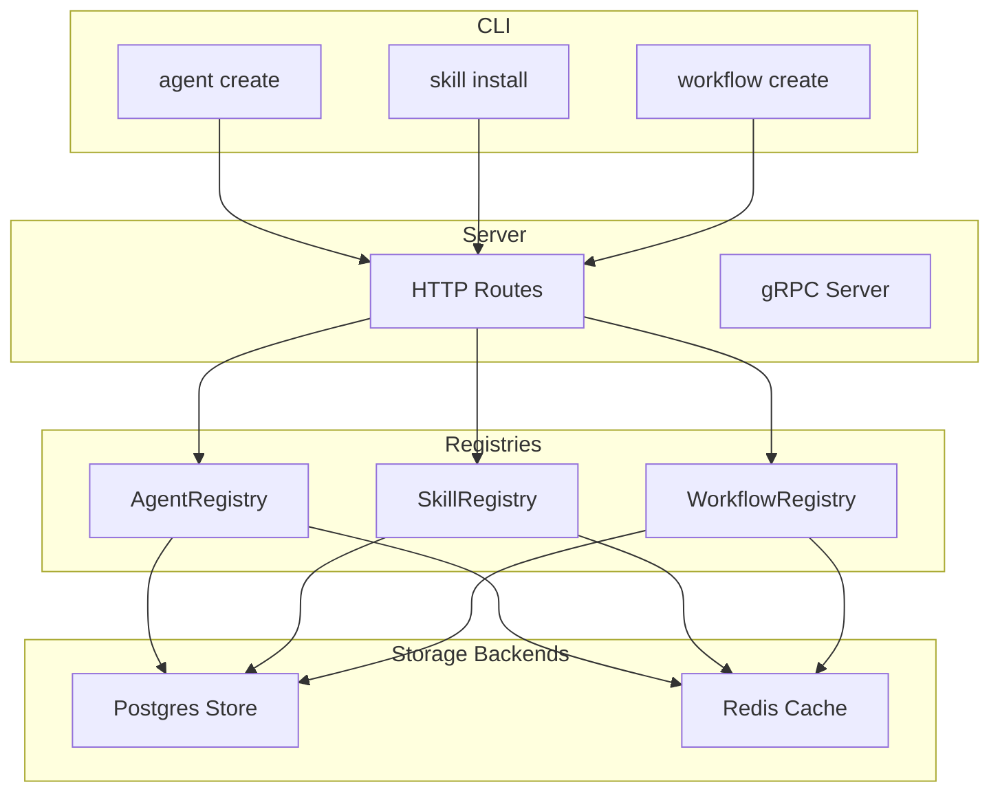
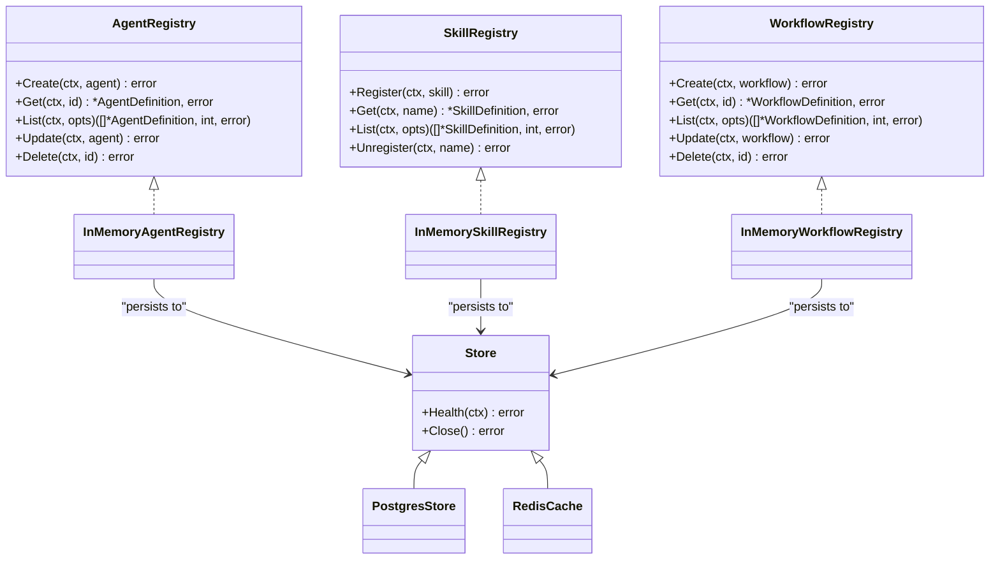
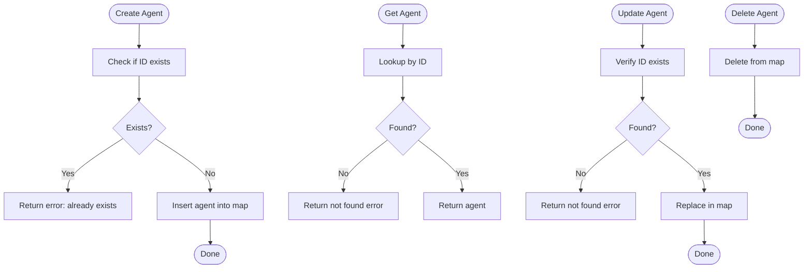
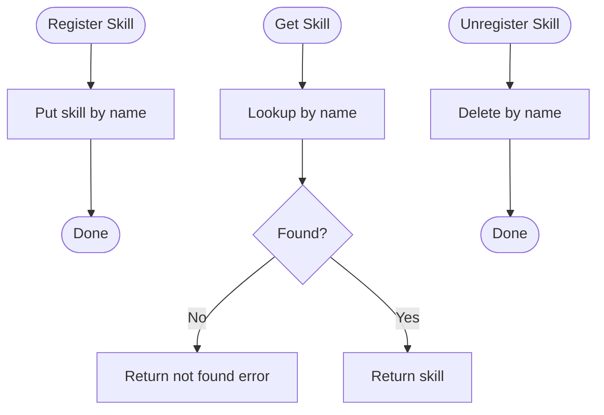
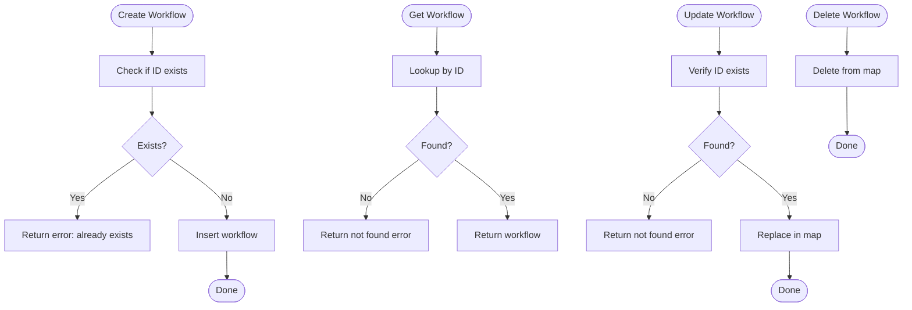
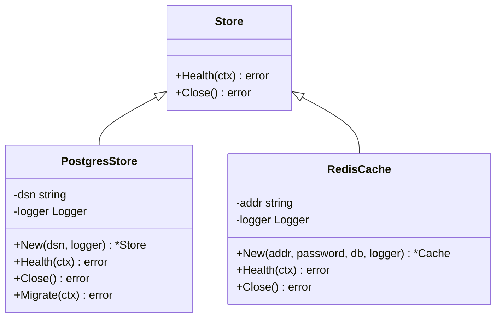
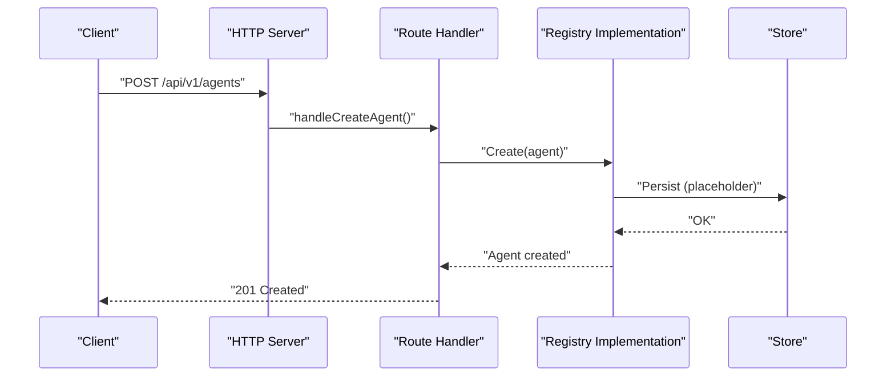
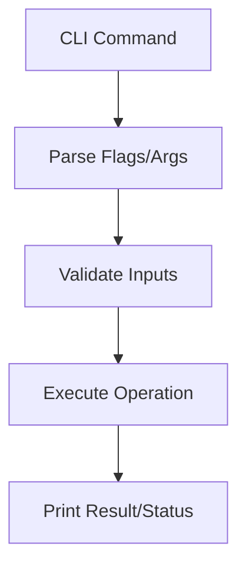
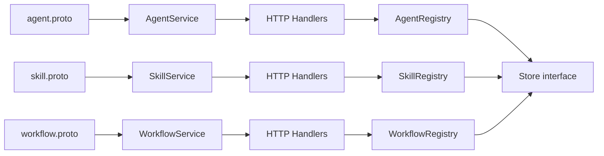

# Registry Systems

<cite>
**Referenced Files in This Document**
- [pkg/registry/agent.go](file://pkg/registry/agent.go)
- [pkg/registry/skill.go](file://pkg/registry/skill.go)
- [pkg/registry/workflow.go](file://pkg/registry/workflow.go)
- [pkg/store/store.go](file://pkg/store/store.go)
- [pkg/store/postgres/postgres.go](file://pkg/store/postgres/postgres.go)
- [pkg/store/redis/redis.go](file://pkg/store/redis/redis.go)
- [pkg/server/router.go](file://pkg/server/router.go)
- [pkg/server/server.go](file://pkg/server/server.go)
- [api/proto/resolvenet/v1/agent.proto](file://api/proto/resolvenet/v1/agent.proto)
- [api/proto/resolvenet/v1/skill.proto](file://api/proto/resolvenet/v1/skill.proto)
- [api/proto/resolvenet/v1/workflow.proto](file://api/proto/resolvenet/v1/workflow.proto)
- [internal/cli/agent/create.go](file://internal/cli/agent/create.go)
- [internal/cli/skill/install.go](file://internal/cli/skill/install.go)
- [internal/cli/workflow/create.go](file://internal/cli/workflow/create.go)
- [configs/examples/agent-example.yaml](file://configs/examples/agent-example.yaml)
- [configs/examples/skill-example.yaml](file://configs/examples/skill-example.yaml)
- [configs/examples/workflow-fta-example.yaml](file://configs/examples/workflow-fta-example.yaml)
</cite>

## Table of Contents
1. [Introduction](#introduction)
2. [Project Structure](#project-structure)
3. [Core Components](#core-components)
4. [Architecture Overview](#architecture-overview)
5. [Detailed Component Analysis](#detailed-component-analysis)
6. [Dependency Analysis](#dependency-analysis)
7. [Performance Considerations](#performance-considerations)
8. [Troubleshooting Guide](#troubleshooting-guide)
9. [Conclusion](#conclusion)
10. [Appendices](#appendices)

## Introduction
This document describes the registry systems that manage agents, skills, and workflows in the platform. It covers the registry architecture, CRUD operations, resource lifecycle management, validation mechanisms, uniqueness constraints, dependency resolution, storage backends, indexing strategies, query optimization, synchronization, conflict resolution, consistency guarantees, integration patterns, and performance considerations. The content is derived from the repository’s Go packages, protocol buffers, CLI commands, and example configurations.

## Project Structure
The registry subsystem is organized around three primary registries (agents, skills, workflows) with in-memory implementations suitable for development. HTTP/gRPC service endpoints are defined in protobuf and wired into a server that exposes REST endpoints. Storage backends (PostgreSQL and Redis) are defined as interfaces and stub implementations. CLI commands demonstrate intended usage patterns for creating and managing resources.

**Diagram sources**
- [pkg/server/router.go:10-55](file://pkg/server/router.go#L10-L55)
- [pkg/server/server.go:19-52](file://pkg/server/server.go#L19-L52)
- [pkg/registry/agent.go:21-28](file://pkg/registry/agent.go#L21-L28)
- [pkg/registry/skill.go:22-28](file://pkg/registry/skill.go#L22-L28)
- [pkg/registry/workflow.go:19-26](file://pkg/registry/workflow.go#L19-L26)
- [pkg/store/postgres/postgres.go:9-25](file://pkg/store/postgres/postgres.go#L9-L25)
- [pkg/store/redis/redis.go:8-24](file://pkg/store/redis/redis.go#L8-L24)
- [internal/cli/agent/create.go:9-31](file://internal/cli/agent/create.go#L9-L31)
- [internal/cli/skill/install.go:26-40](file://internal/cli/skill/install.go#L26-L40)
- [internal/cli/workflow/create.go:26-44](file://internal/cli/workflow/create.go#L26-L44)

**Section sources**
- [pkg/server/router.go:10-55](file://pkg/server/router.go#L10-L55)
- [pkg/server/server.go:19-52](file://pkg/server/server.go#L19-L52)
- [pkg/registry/agent.go:21-28](file://pkg/registry/agent.go#L21-L28)
- [pkg/registry/skill.go:22-28](file://pkg/registry/skill.go#L22-L28)
- [pkg/registry/workflow.go:19-26](file://pkg/registry/workflow.go#L19-L26)
- [pkg/store/store.go:7-13](file://pkg/store/store.go#L7-L13)
- [pkg/store/postgres/postgres.go:9-25](file://pkg/store/postgres/postgres.go#L9-L25)
- [pkg/store/redis/redis.go:8-24](file://pkg/store/redis/redis.go#L8-L24)
- [internal/cli/agent/create.go:9-31](file://internal/cli/agent/create.go#L9-L31)
- [internal/cli/skill/install.go:26-40](file://internal/cli/skill/install.go#L26-L40)
- [internal/cli/workflow/create.go:26-44](file://internal/cli/workflow/create.go#L26-L44)

## Core Components
- Agent registry: Manages agent definitions with CRUD operations and list pagination/filtering. Uniqueness constraint on agent ID.
- Skill registry: Manages skill definitions with register/get/list/unregister operations. Names are used as keys.
- Workflow registry: Manages FTA workflow definitions with CRUD operations and list pagination/filtering. Uniqueness constraint on workflow ID.
- Storage backends: Generic store interface and stub implementations for PostgreSQL and Redis.
- Server: Exposes REST endpoints and gRPC services for registry operations.
- CLI: Provides commands to create agents, install skills, and create workflows.

Key implementation patterns:
- Interfaces define registry contracts for extensibility.
- In-memory implementations provide thread-safe operations using RWMutex.
- ListOptions support pagination and filters.
- Protobuf service definitions describe request/response shapes and enums.

**Section sources**
- [pkg/registry/agent.go:9-28](file://pkg/registry/agent.go#L9-L28)
- [pkg/registry/agent.go:30-103](file://pkg/registry/agent.go#L30-L103)
- [pkg/registry/skill.go:9-28](file://pkg/registry/skill.go#L9-L28)
- [pkg/registry/skill.go:30-80](file://pkg/registry/skill.go#L30-L80)
- [pkg/registry/workflow.go:9-26](file://pkg/registry/workflow.go#L9-L26)
- [pkg/registry/workflow.go:28-94](file://pkg/registry/workflow.go#L28-L94)
- [pkg/store/store.go:7-13](file://pkg/store/store.go#L7-L13)
- [pkg/store/postgres/postgres.go:9-44](file://pkg/store/postgres/postgres.go#L9-L44)
- [pkg/store/redis/redis.go:8-36](file://pkg/store/redis/redis.go#L8-L36)
- [pkg/server/router.go:10-55](file://pkg/server/router.go#L10-L55)
- [pkg/server/server.go:19-52](file://pkg/server/server.go#L19-L52)

## Architecture Overview
The registry architecture separates concerns across interfaces, implementations, storage backends, and service layers. The server registers HTTP routes and delegates to registry implementations. Protobuf services define the canonical API contracts. CLI commands demonstrate operational workflows.

**Diagram sources**
- [pkg/registry/agent.go:21-103](file://pkg/registry/agent.go#L21-L103)
- [pkg/registry/skill.go:22-80](file://pkg/registry/skill.go#L22-L80)
- [pkg/registry/workflow.go:19-94](file://pkg/registry/workflow.go#L19-L94)
- [pkg/store/store.go:7-13](file://pkg/store/store.go#L7-L13)
- [pkg/store/postgres/postgres.go:9-44](file://pkg/store/postgres/postgres.go#L9-L44)
- [pkg/store/redis/redis.go:8-36](file://pkg/store/redis/redis.go#L8-L36)

## Detailed Component Analysis

### Agent Registry
- Data model: AgentDefinition with ID, name, description, type, config, status, labels, and version.
- Operations: Create, Get, List, Update, Delete.
- Uniqueness: ID-based uniqueness enforced in Create.
- Concurrency: RWMutex ensures safe concurrent access.
- Pagination/Filtering: ListOptions supports page size, token, and filter map.

**Diagram sources**
- [pkg/registry/agent.go:43-53](file://pkg/registry/agent.go#L43-L53)
- [pkg/registry/agent.go:55-64](file://pkg/registry/agent.go#L55-L64)
- [pkg/registry/agent.go:77-87](file://pkg/registry/agent.go#L77-L87)
- [pkg/registry/agent.go:89-95](file://pkg/registry/agent.go#L89-L95)

**Section sources**
- [pkg/registry/agent.go:9-19](file://pkg/registry/agent.go#L9-L19)
- [pkg/registry/agent.go:21-28](file://pkg/registry/agent.go#L21-L28)
- [pkg/registry/agent.go:30-103](file://pkg/registry/agent.go#L30-L103)

### Skill Registry
- Data model: SkillDefinition with name, version, description, author, manifest, source type/URI, status, labels.
- Operations: Register, Get, List, Unregister.
- Uniqueness: Name-based key in the map.
- Concurrency: RWMutex protection.

**Diagram sources**
- [pkg/registry/skill.go:43-49](file://pkg/registry/skill.go#L43-L49)
- [pkg/registry/skill.go:51-60](file://pkg/registry/skill.go#L51-L60)
- [pkg/registry/skill.go:73-79](file://pkg/registry/skill.go#L73-L79)

**Section sources**
- [pkg/registry/skill.go:9-20](file://pkg/registry/skill.go#L9-L20)
- [pkg/registry/skill.go:22-28](file://pkg/registry/skill.go#L22-L28)
- [pkg/registry/skill.go:30-80](file://pkg/registry/skill.go#L30-L80)

### Workflow Registry
- Data model: WorkflowDefinition with ID, name, description, tree, status, version.
- Operations: Create, Get, List, Update, Delete.
- Uniqueness: ID-based uniqueness enforced in Create.
- Concurrency: RWMutex protection.

**Diagram sources**
- [pkg/registry/workflow.go:41-51](file://pkg/registry/workflow.go#L41-L51)
- [pkg/registry/workflow.go:53-62](file://pkg/registry/workflow.go#L53-L62)
- [pkg/registry/workflow.go:75-85](file://pkg/registry/workflow.go#L75-L85)
- [pkg/registry/workflow.go:87-93](file://pkg/registry/workflow.go#L87-L93)

**Section sources**
- [pkg/registry/workflow.go:9-17](file://pkg/registry/workflow.go#L9-L17)
- [pkg/registry/workflow.go:19-26](file://pkg/registry/workflow.go#L19-L26)
- [pkg/registry/workflow.go:28-94](file://pkg/registry/workflow.go#L28-L94)

### Storage Backends
- Store interface: Health and Close methods for lifecycle management.
- PostgreSQL store: DSN-based initialization, placeholder health check, migration stub.
- Redis cache: Address/password/db initialization, placeholder health check.

**Diagram sources**
- [pkg/store/store.go:7-13](file://pkg/store/store.go#L7-L13)
- [pkg/store/postgres/postgres.go:9-44](file://pkg/store/postgres/postgres.go#L9-L44)
- [pkg/store/redis/redis.go:8-36](file://pkg/store/redis/redis.go#L8-L36)

**Section sources**
- [pkg/store/store.go:7-13](file://pkg/store/store.go#L7-L13)
- [pkg/store/postgres/postgres.go:9-44](file://pkg/store/postgres/postgres.go#L9-L44)
- [pkg/store/redis/redis.go:8-36](file://pkg/store/redis/redis.go#L8-L36)

### Server and API Contracts
- HTTP routes: REST endpoints for agents, skills, workflows, RAG, models, and config.
- gRPC server: Health service and reflection enabled.
- Protobuf services: Define canonical request/response messages, enums, and streaming responses for execution.

**Diagram sources**
- [pkg/server/router.go:18-24](file://pkg/server/router.go#L18-L24)
- [pkg/server/router.go:75-77](file://pkg/server/router.go#L75-L77)
- [pkg/server/server.go:54-103](file://pkg/server/server.go#L54-L103)

**Section sources**
- [pkg/server/router.go:10-55](file://pkg/server/router.go#L10-L55)
- [pkg/server/server.go:19-52](file://pkg/server/server.go#L19-L52)
- [api/proto/resolvenet/v1/agent.proto:11-29](file://api/proto/resolvenet/v1/agent.proto#L11-L29)
- [api/proto/resolvenet/v1/skill.proto:10-17](file://api/proto/resolvenet/v1/skill.proto#L10-L17)
- [api/proto/resolvenet/v1/workflow.proto:11-20](file://api/proto/resolvenet/v1/workflow.proto#L11-L20)

### CLI Integration Patterns
- Agent create: Demonstrates flags for type, model, prompt, and file.
- Skill install: Demonstrates installing from various sources.
- Workflow create: Demonstrates creating from a YAML definition file.

**Diagram sources**
- [internal/cli/agent/create.go:9-31](file://internal/cli/agent/create.go#L9-L31)
- [internal/cli/skill/install.go:26-40](file://internal/cli/skill/install.go#L26-L40)
- [internal/cli/workflow/create.go:26-44](file://internal/cli/workflow/create.go#L26-L44)

**Section sources**
- [internal/cli/agent/create.go:9-31](file://internal/cli/agent/create.go#L9-L31)
- [internal/cli/skill/install.go:26-40](file://internal/cli/skill/install.go#L26-L40)
- [internal/cli/workflow/create.go:26-44](file://internal/cli/workflow/create.go#L26-L44)

## Dependency Analysis
- Coupling: Registries depend on the Store interface, enabling pluggable persistence.
- Cohesion: Each registry encapsulates its own data model and operations.
- External dependencies: gRPC, reflection, health service, slog logging, and HTTP mux.
- Potential circular dependencies: None observed among the analyzed files.

**Diagram sources**
- [api/proto/resolvenet/v1/agent.proto:11-29](file://api/proto/resolvenet/v1/agent.proto#L11-L29)
- [api/proto/resolvenet/v1/skill.proto:10-17](file://api/proto/resolvenet/v1/skill.proto#L10-L17)
- [api/proto/resolvenet/v1/workflow.proto:11-20](file://api/proto/resolvenet/v1/workflow.proto#L11-L20)
- [pkg/server/router.go:18-39](file://pkg/server/router.go#L18-L39)
- [pkg/registry/agent.go:21-28](file://pkg/registry/agent.go#L21-L28)
- [pkg/registry/skill.go:22-28](file://pkg/registry/skill.go#L22-L28)
- [pkg/registry/workflow.go:19-26](file://pkg/registry/workflow.go#L19-L26)
- [pkg/store/store.go:7-13](file://pkg/store/store.go#L7-L13)

**Section sources**
- [api/proto/resolvenet/v1/agent.proto:11-29](file://api/proto/resolvenet/v1/agent.proto#L11-L29)
- [api/proto/resolvenet/v1/skill.proto:10-17](file://api/proto/resolvenet/v1/skill.proto#L10-L17)
- [api/proto/resolvenet/v1/workflow.proto:11-20](file://api/proto/resolvenet/v1/workflow.proto#L11-L20)
- [pkg/server/router.go:18-39](file://pkg/server/router.go#L18-L39)
- [pkg/registry/agent.go:21-28](file://pkg/registry/agent.go#L21-L28)
- [pkg/registry/skill.go:22-28](file://pkg/registry/skill.go#L22-L28)
- [pkg/registry/workflow.go:19-26](file://pkg/registry/workflow.go#L19-L26)
- [pkg/store/store.go:7-13](file://pkg/store/store.go#L7-L13)

## Performance Considerations
- Concurrency: RWMutex-based in-memory registries provide safe concurrent reads/writes; consider reader-writer scaling for high-read workloads.
- Pagination: ListOptions enable pagination; implement server-side cursor-based pagination for large datasets.
- Indexing: Current in-memory maps are O(n) for list; consider maintaining sorted indices or auxiliary maps for filters.
- Caching: Redis cache can reduce load on the primary store; implement cache-aside or write-through patterns with TTLs.
- Query optimization: Add indexes on frequently filtered fields (type, status, labels) when moving to persistent storage.
- Storage migrations: Implement schema migrations and maintain backward compatibility for evolving resource models.
- gRPC vs REST: Use gRPC for high-throughput internal calls; REST for external integrations with JSON.

[No sources needed since this section provides general guidance]

## Troubleshooting Guide
Common issues and resolutions:
- Not found errors: Ensure correct ID/name is used; verify resource creation succeeded.
- Uniqueness violations: Check for duplicate IDs/names before Create/Register.
- Health checks: Implement and monitor Store.Health and Cache.Health to detect connectivity issues.
- Migration failures: Confirm migration steps and rollback procedures before applying schema changes.
- CLI operation placeholders: Integrate with actual server endpoints to complete operations.

**Section sources**
- [pkg/registry/agent.go:47-48](file://pkg/registry/agent.go#L47-L48)
- [pkg/registry/skill.go:47](file://pkg/registry/skill.go#L47)
- [pkg/registry/workflow.go:45-46](file://pkg/registry/workflow.go#L45-L46)
- [pkg/store/postgres/postgres.go:27-31](file://pkg/store/postgres/postgres.go#L27-L31)
- [pkg/store/redis/redis.go:26-30](file://pkg/store/redis/redis.go#L26-L30)
- [pkg/store/postgres/postgres.go:39-44](file://pkg/store/postgres/postgres.go#L39-L44)

## Conclusion
The registry systems provide a clean separation of concerns with well-defined interfaces and in-memory implementations suitable for development. The server exposes REST and gRPC APIs aligned with protobuf contracts. Storage backends are abstracted behind a generic Store interface, enabling future persistence and caching strategies. The CLI demonstrates intended operational workflows. To move to production, implement persistent storage with migrations, robust health checks, caching, and pagination/indexing for performance.

[No sources needed since this section summarizes without analyzing specific files]

## Appendices

### Resource Definitions and Examples
- Agent example: Demonstrates agent configuration including model, system prompt, skill names, and selector configuration.
- Skill example: Demonstrates skill metadata, source type/URI, manifest entry point, inputs, and permissions.
- Workflow FTA example: Demonstrates fault tree structure with events, gates, evaluators, and parameters.

**Section sources**
- [configs/examples/agent-example.yaml:1-18](file://configs/examples/agent-example.yaml#L1-L18)
- [configs/examples/skill-example.yaml:1-23](file://configs/examples/skill-example.yaml#L1-L23)
- [configs/examples/workflow-fta-example.yaml:1-50](file://configs/examples/workflow-fta-example.yaml#L1-L50)

### API Endpoints Summary
- Agents: List, Create, Get, Update, Delete, Execute.
- Skills: List, Register, Get, Unregister, Test.
- Workflows: List, Create, Get, Update, Delete, Validate, Execute.

**Section sources**
- [pkg/server/router.go:18-39](file://pkg/server/router.go#L18-L39)