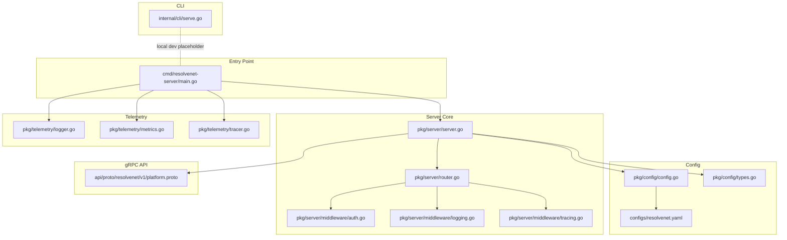
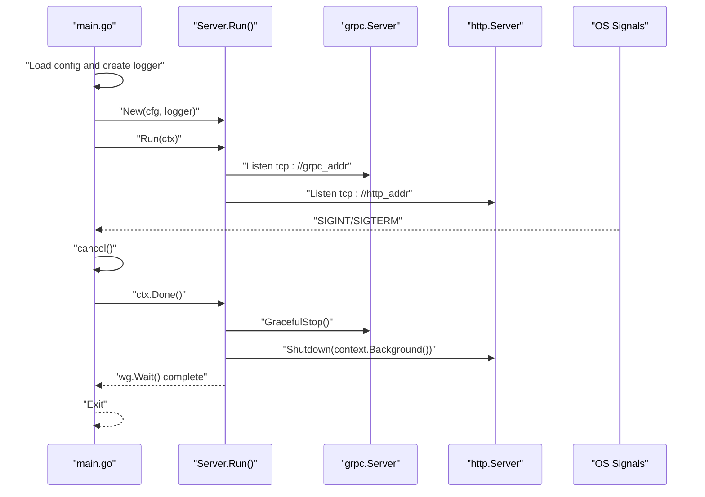
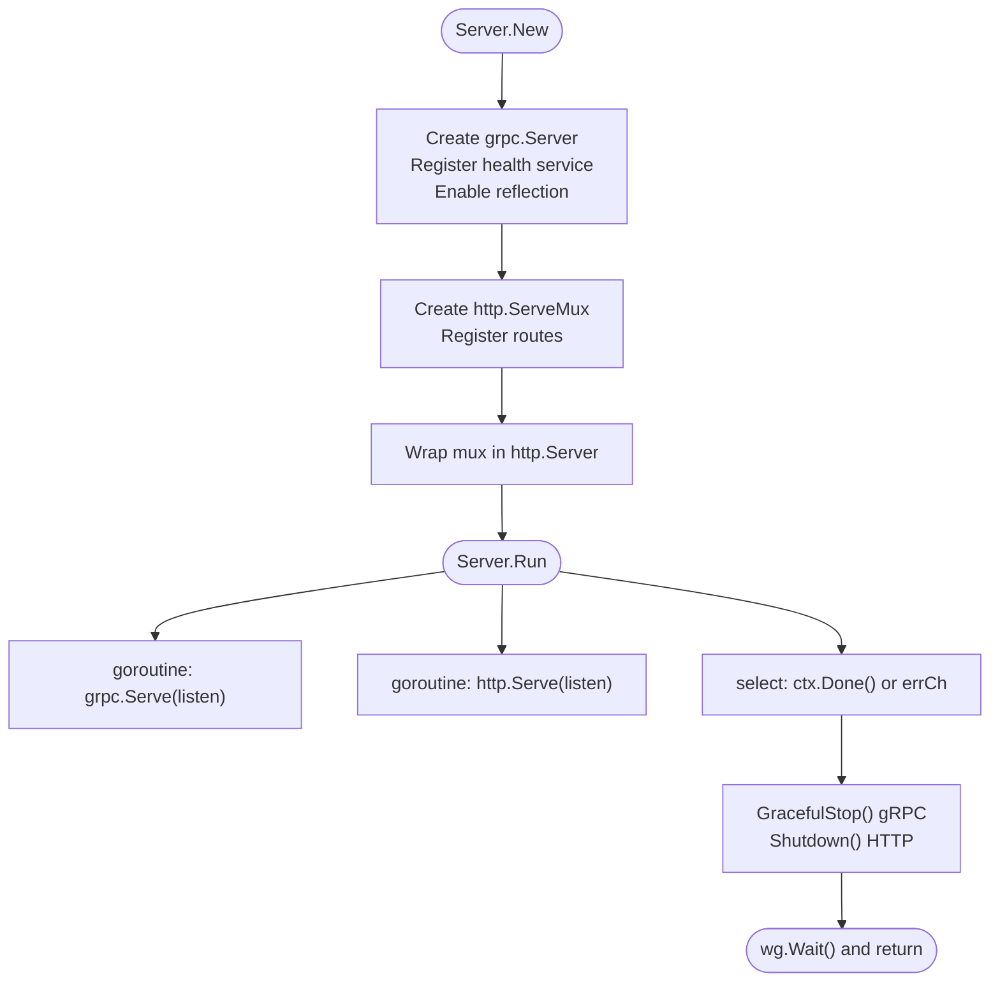
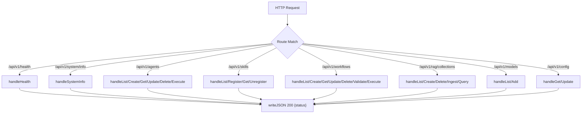
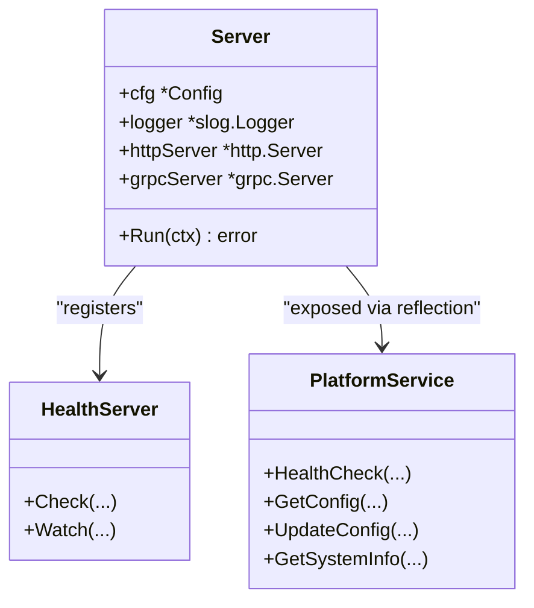
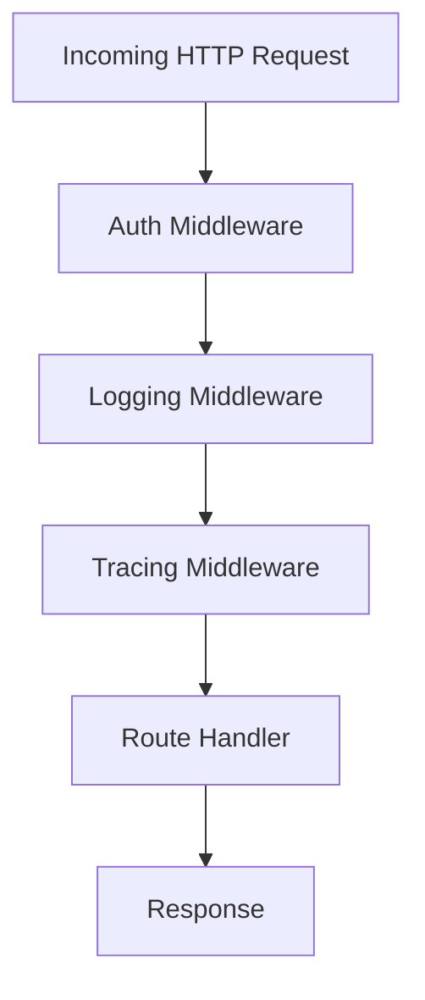
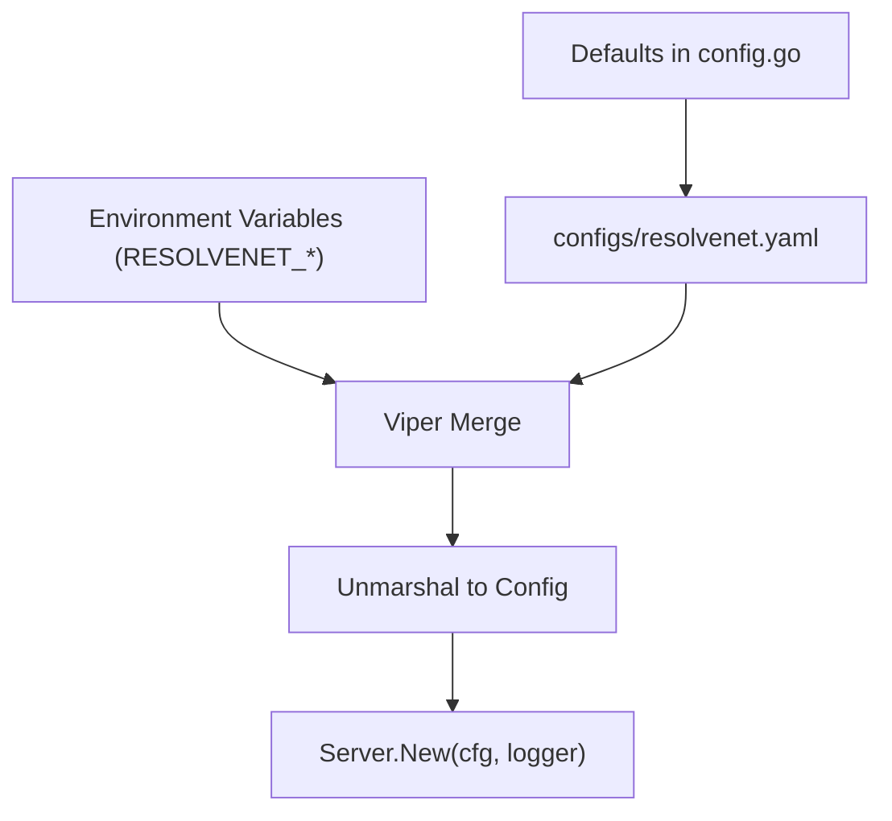
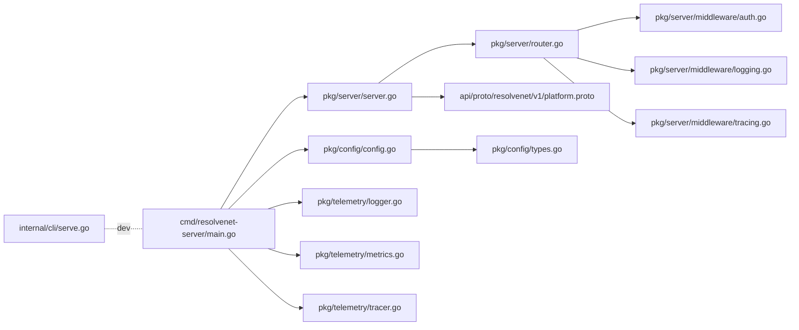

# Server Architecture

<cite>
**Referenced Files in This Document**
- [cmd/resolvenet-server/main.go](file://cmd/resolvenet-server/main.go)
- [pkg/server/server.go](file://pkg/server/server.go)
- [pkg/server/router.go](file://pkg/server/router.go)
- [pkg/server/middleware/auth.go](file://pkg/server/middleware/auth.go)
- [pkg/server/middleware/logging.go](file://pkg/server/middleware/logging.go)
- [pkg/server/middleware/tracing.go](file://pkg/server/middleware/tracing.go)
- [pkg/config/config.go](file://pkg/config/config.go)
- [pkg/config/types.go](file://pkg/config/types.go)
- [configs/resolvenet.yaml](file://configs/resolvenet.yaml)
- [api/proto/resolvenet/v1/platform.proto](file://api/proto/resolvenet/v1/platform.proto)
- [internal/cli/serve.go](file://internal/cli/serve.go)
- [pkg/telemetry/logger.go](file://pkg/telemetry/logger.go)
- [pkg/telemetry/metrics.go](file://pkg/telemetry/metrics.go)
- [pkg/telemetry/tracer.go](file://pkg/telemetry/tracer.go)
</cite>

## Table of Contents
1. [Introduction](#introduction)
2. [Project Structure](#project-structure)
3. [Core Components](#core-components)
4. [Architecture Overview](#architecture-overview)
5. [Detailed Component Analysis](#detailed-component-analysis)
6. [Dependency Analysis](#dependency-analysis)
7. [Performance Considerations](#performance-considerations)
8. [Troubleshooting Guide](#troubleshooting-guide)
9. [Conclusion](#conclusion)
10. [Appendices](#appendices)

## Introduction
This document describes the Go server architecture that runs both HTTP REST APIs and gRPC services concurrently. It explains server initialization, graceful shutdown, health checking via gRPC health service, reflection support, HTTP route registration, middleware integration, lifecycle management, error handling, logging, and operational monitoring. It also covers performance considerations, resource management, and deployment patterns.

## Project Structure
The server is implemented under the pkg/server package and orchestrated by the command-line entry point in cmd/resolvenet-server. Configuration is loaded via pkg/config and validated against a YAML schema. gRPC service definitions live under api/proto/resolvenet/v1.

**Diagram sources**
- [cmd/resolvenet-server/main.go:1-56](file://cmd/resolvenet-server/main.go#L1-L56)
- [pkg/server/server.go:1-104](file://pkg/server/server.go#L1-L104)
- [pkg/server/router.go:1-183](file://pkg/server/router.go#L1-L183)
- [pkg/server/middleware/auth.go:1-18](file://pkg/server/middleware/auth.go#L1-L18)
- [pkg/server/middleware/logging.go:1-38](file://pkg/server/middleware/logging.go#L1-L38)
- [pkg/server/middleware/tracing.go:1-19](file://pkg/server/middleware/tracing.go#L1-L19)
- [pkg/config/config.go:1-63](file://pkg/config/config.go#L1-L63)
- [pkg/config/types.go:1-70](file://pkg/config/types.go#L1-L70)
- [configs/resolvenet.yaml:1-34](file://configs/resolvenet.yaml#L1-L34)
- [api/proto/resolvenet/v1/platform.proto:1-61](file://api/proto/resolvenet/v1/platform.proto#L1-L61)
- [internal/cli/serve.go:1-22](file://internal/cli/serve.go#L1-L22)
- [pkg/telemetry/logger.go:1-36](file://pkg/telemetry/logger.go#L1-L36)
- [pkg/telemetry/metrics.go:1-13](file://pkg/telemetry/metrics.go#L1-L13)
- [pkg/telemetry/tracer.go:1-22](file://pkg/telemetry/tracer.go#L1-L22)

**Section sources**
- [cmd/resolvenet-server/main.go:16-55](file://cmd/resolvenet-server/main.go#L16-L55)
- [pkg/server/server.go:27-52](file://pkg/server/server.go#L27-L52)
- [pkg/config/config.go:10-62](file://pkg/config/config.go#L10-L62)
- [configs/resolvenet.yaml:1-34](file://configs/resolvenet.yaml#L1-L34)

## Core Components
- Dual-server orchestration: The Server type composes an HTTP server and a gRPC server, initializing both during construction and running them concurrently.
- gRPC health service and reflection: Health service is registered and reflection is enabled for interactive debugging.
- HTTP REST routing: Routes are registered on a ServeMux and mapped to handler methods on the Server.
- Middleware stack: Authentication, logging, and tracing middleware are defined for HTTP handlers.
- Configuration: Viper-backed configuration supports defaults, file loading, and environment overrides.
- Telemetry: Structured logging, metrics, and tracer initialization are provided as telemetry helpers.

**Section sources**
- [pkg/server/server.go:19-52](file://pkg/server/server.go#L19-L52)
- [pkg/server/router.go:10-55](file://pkg/server/router.go#L10-L55)
- [pkg/server/middleware/auth.go:8-17](file://pkg/server/middleware/auth.go#L8-L17)
- [pkg/server/middleware/logging.go:19-37](file://pkg/server/middleware/logging.go#L19-L37)
- [pkg/server/middleware/tracing.go:7-18](file://pkg/server/middleware/tracing.go#L7-L18)
- [pkg/config/config.go:10-62](file://pkg/config/config.go#L10-L62)
- [pkg/config/types.go:14-70](file://pkg/config/types.go#L14-L70)
- [pkg/telemetry/logger.go:8-35](file://pkg/telemetry/logger.go#L8-L35)
- [pkg/telemetry/metrics.go:7-12](file://pkg/telemetry/metrics.go#L7-L12)
- [pkg/telemetry/tracer.go:8-21](file://pkg/telemetry/tracer.go#L8-L21)

## Architecture Overview
The server follows a dual-stack design:
- HTTP REST API: Served by net/http with a ServeMux and custom handlers.
- gRPC API: Served by grpc.Server with health service and reflection enabled.
- Concurrency: Both servers are started in separate goroutines and coordinated via a WaitGroup and channel-based error propagation.
- Graceful shutdown: On cancellation, gRPC server performs graceful stop and HTTP server is shut down gracefully.

**Diagram sources**
- [cmd/resolvenet-server/main.go:16-55](file://cmd/resolvenet-server/main.go#L16-L55)
- [pkg/server/server.go:54-103](file://pkg/server/server.go#L54-L103)

## Detailed Component Analysis

### Server Initialization and Lifecycle
- Construction: gRPC server is created, health service registered, and reflection enabled. HTTP server is created with a ServeMux and routes registered.
- Running: Servers are started concurrently. Errors are propagated via a buffered error channel. On context cancellation, graceful shutdown is initiated for both servers.

**Diagram sources**
- [pkg/server/server.go:27-52](file://pkg/server/server.go#L27-L52)
- [pkg/server/server.go:54-103](file://pkg/server/server.go#L54-L103)

**Section sources**
- [pkg/server/server.go:27-52](file://pkg/server/server.go#L27-L52)
- [pkg/server/server.go:54-103](file://pkg/server/server.go#L54-L103)

### HTTP REST API and Route Registration
- Routes include health, system info, agents, skills, workflows, RAG collections, models, and config endpoints.
- Handlers currently return stub responses; they are intended to be wired to business logic later.
- JSON responses are written via a shared encoder utility.

**Diagram sources**
- [pkg/server/router.go:10-55](file://pkg/server/router.go#L10-L55)
- [pkg/server/router.go:57-176](file://pkg/server/router.go#L57-L176)

**Section sources**
- [pkg/server/router.go:10-55](file://pkg/server/router.go#L10-L55)
- [pkg/server/router.go:57-176](file://pkg/server/router.go#L57-L176)

### gRPC Health Service and Reflection
- Health service: A health server is created and registered with the gRPC server. This enables standard health checks.
- Reflection: Reflection is enabled to allow interactive exploration of services (e.g., grpcurl).
- gRPC service definitions: The platform proto defines service methods for health, config, and system info.

**Diagram sources**
- [pkg/server/server.go:34-42](file://pkg/server/server.go#L34-L42)
- [api/proto/resolvenet/v1/platform.proto:9-61](file://api/proto/resolvenet/v1/platform.proto#L9-L61)

**Section sources**
- [pkg/server/server.go:34-42](file://pkg/server/server.go#L34-L42)
- [api/proto/resolvenet/v1/platform.proto:9-61](file://api/proto/resolvenet/v1/platform.proto#L9-L61)

### Middleware Integration
- Authentication middleware: Placeholder for token validation; currently passes through.
- Logging middleware: Wraps response writer to capture status code and logs method, path, status, duration, and remote address.
- Tracing middleware: Placeholder for OpenTelemetry spans.

**Diagram sources**
- [pkg/server/middleware/auth.go:8-17](file://pkg/server/middleware/auth.go#L8-L17)
- [pkg/server/middleware/logging.go:19-37](file://pkg/server/middleware/logging.go#L19-L37)
- [pkg/server/middleware/tracing.go:7-18](file://pkg/server/middleware/tracing.go#L7-L18)

**Section sources**
- [pkg/server/middleware/auth.go:8-17](file://pkg/server/middleware/auth.go#L8-L17)
- [pkg/server/middleware/logging.go:19-37](file://pkg/server/middleware/logging.go#L19-L37)
- [pkg/server/middleware/tracing.go:7-18](file://pkg/server/middleware/tracing.go#L7-L18)

### Configuration and Deployment
- Defaults: HTTP and gRPC addresses are defaulted; database, Redis, NATS, runtime, gateway, and telemetry settings are configured with sensible defaults.
- File and environment: Configuration is loaded from a YAML file and environment variables with a RESOLVENET_ prefix.
- Deployment: The YAML file shows typical production defaults for HTTP and gRPC ports.

**Diagram sources**
- [pkg/config/config.go:14-47](file://pkg/config/config.go#L14-L47)
- [configs/resolvenet.yaml:1-34](file://configs/resolvenet.yaml#L1-L34)
- [pkg/config/types.go:14-70](file://pkg/config/types.go#L14-L70)

**Section sources**
- [pkg/config/config.go:10-62](file://pkg/config/config.go#L10-L62)
- [pkg/config/types.go:14-70](file://pkg/config/types.go#L14-L70)
- [configs/resolvenet.yaml:1-34](file://configs/resolvenet.yaml#L1-L34)

### Telemetry and Observability
- Logger: Structured logging with JSON or text handlers and configurable levels.
- Metrics: Placeholder for OTLP metrics initialization.
- Tracer: Placeholder for OTLP tracer initialization with a shutdown hook.

**Section sources**
- [pkg/telemetry/logger.go:8-35](file://pkg/telemetry/logger.go#L8-L35)
- [pkg/telemetry/metrics.go:7-12](file://pkg/telemetry/metrics.go#L7-L12)
- [pkg/telemetry/tracer.go:8-21](file://pkg/telemetry/tracer.go#L8-L21)

## Dependency Analysis
The server composes several subsystems:
- Entry point depends on configuration and server creation.
- Server depends on configuration types and gRPC libraries.
- Router depends on version metadata and exposes HTTP handlers.
- Middleware packages are HTTP middleware factories.
- CLI provides a development command placeholder.
- Telemetry packages provide logging and tracing helpers.

**Diagram sources**
- [cmd/resolvenet-server/main.go:11-13](file://cmd/resolvenet-server/main.go#L11-L13)
- [pkg/server/server.go:3-17](file://pkg/server/server.go#L3-L17)
- [pkg/server/router.go:3-8](file://pkg/server/router.go#L3-L8)
- [pkg/server/middleware/auth.go:3-6](file://pkg/server/middleware/auth.go#L3-L6)
- [pkg/server/middleware/logging.go:3-7](file://pkg/server/middleware/logging.go#L3-L7)
- [pkg/server/middleware/tracing.go:3-5](file://pkg/server/middleware/tracing.go#L3-L5)
- [pkg/config/config.go:3-8](file://pkg/config/config.go#L3-L8)
- [pkg/config/types.go:3-12](file://pkg/config/types.go#L3-L12)
- [pkg/telemetry/logger.go:3-6](file://pkg/telemetry/logger.go#L3-L6)
- [pkg/telemetry/metrics.go:3-5](file://pkg/telemetry/metrics.go#L3-L5)
- [pkg/telemetry/tracer.go:3-6](file://pkg/telemetry/tracer.go#L3-L6)
- [api/proto/resolvenet/v1/platform.proto:1-6](file://api/proto/resolvenet/v1/platform.proto#L1-L6)
- [internal/cli/serve.go:3-7](file://internal/cli/serve.go#L3-L7)

**Section sources**
- [cmd/resolvenet-server/main.go:11-13](file://cmd/resolvenet-server/main.go#L11-L13)
- [pkg/server/server.go:3-17](file://pkg/server/server.go#L3-L17)
- [pkg/server/router.go:3-8](file://pkg/server/router.go#L3-L8)
- [pkg/server/middleware/auth.go:3-6](file://pkg/server/middleware/auth.go#L3-L6)
- [pkg/server/middleware/logging.go:3-7](file://pkg/server/middleware/logging.go#L3-L7)
- [pkg/server/middleware/tracing.go:3-5](file://pkg/server/middleware/tracing.go#L3-L5)
- [pkg/config/config.go:3-8](file://pkg/config/config.go#L3-L8)
- [pkg/config/types.go:3-12](file://pkg/config/types.go#L3-L12)
- [pkg/telemetry/logger.go:3-6](file://pkg/telemetry/logger.go#L3-L6)
- [pkg/telemetry/metrics.go:3-5](file://pkg/telemetry/metrics.go#L3-L5)
- [pkg/telemetry/tracer.go:3-6](file://pkg/telemetry/tracer.go#L3-L6)
- [api/proto/resolvenet/v1/platform.proto:1-6](file://api/proto/resolvenet/v1/platform.proto#L1-L6)
- [internal/cli/serve.go:3-7](file://internal/cli/serve.go#L3-L7)

## Performance Considerations
- Concurrency: Running HTTP and gRPC on separate goroutines prevents head-of-line blocking and improves throughput.
- Graceful shutdown: Ensures in-flight requests complete cleanly and resources are released.
- Resource management: Use context cancellation to propagate shutdown signals promptly.
- Logging overhead: Structured logging is efficient; avoid excessive allocations in hot paths.
- Middleware placement: Place logging middleware early to capture accurate timings.

[No sources needed since this section provides general guidance]

## Troubleshooting Guide
- Startup failures: Check configuration loading and server listen errors; errors are propagated via the error channel and logged.
- Shutdown issues: Verify graceful stop completes and HTTP shutdown does not return unexpected errors.
- Health checks: Confirm gRPC health service is reachable and reflection is enabled for debugging.
- Logging: Ensure logger is set at the entry point and middleware captures request metrics.

**Section sources**
- [cmd/resolvenet-server/main.go:17-20](file://cmd/resolvenet-server/main.go#L17-L20)
- [pkg/server/server.go:63-86](file://pkg/server/server.go#L63-L86)
- [pkg/server/server.go:92-96](file://pkg/server/server.go#L92-L96)

## Conclusion
The server architecture provides a robust, concurrent foundation for both HTTP REST and gRPC workloads. It integrates health checking, reflection, structured logging, and placeholders for authentication, tracing, and metrics. The design emphasizes graceful lifecycle management, clear separation of concerns, and straightforward deployment patterns.

[No sources needed since this section summarizes without analyzing specific files]

## Appendices

### Example Startup Sequence
- Load configuration from file and environment.
- Create logger with JSON handler.
- Build server with gRPC health service and reflection.
- Register HTTP routes.
- Start both servers concurrently.
- Wait for context cancellation or error.

**Section sources**
- [cmd/resolvenet-server/main.go:24-34](file://cmd/resolvenet-server/main.go#L24-L34)
- [pkg/server/server.go:27-52](file://pkg/server/server.go#L27-L52)
- [pkg/server/server.go:54-103](file://pkg/server/server.go#L54-L103)

### Graceful Termination Flow
- Receive SIGINT/SIGTERM.
- Cancel context.
- Trigger graceful stop for gRPC server.
- Perform HTTP server shutdown.
- Wait for goroutines to finish.

**Section sources**
- [cmd/resolvenet-server/main.go:39-47](file://cmd/resolvenet-server/main.go#L39-L47)
- [pkg/server/server.go:90-102](file://pkg/server/server.go#L90-L102)

### Operational Monitoring
- HTTP health endpoint: GET /api/v1/health returns a simple status payload.
- System info endpoint: GET /api/v1/system/info returns version and build metadata.
- gRPC health service: Standard health checks via gRPC.
- Reflection: Enable interactive inspection of services.

**Section sources**
- [pkg/server/router.go:12-16](file://pkg/server/router.go#L12-L16)
- [pkg/server/router.go:61-67](file://pkg/server/router.go#L61-L67)
- [pkg/server/server.go:37-42](file://pkg/server/server.go#L37-L42)

### Deployment Patterns
- Production: Use the resolvenet-server binary with configuration file and environment variables.
- Development: Use the serve CLI command for local development; the binary is preferred for production.

**Section sources**
- [internal/cli/serve.go:9-21](file://internal/cli/serve.go#L9-L21)
- [configs/resolvenet.yaml:3-5](file://configs/resolvenet.yaml#L3-L5)