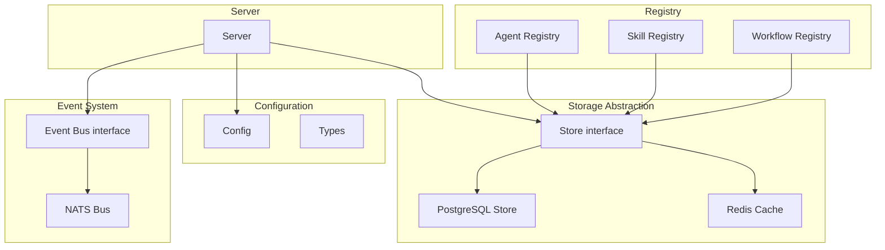
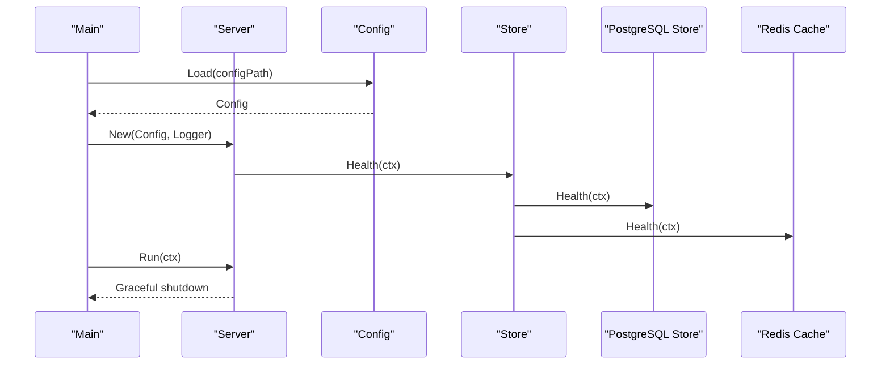
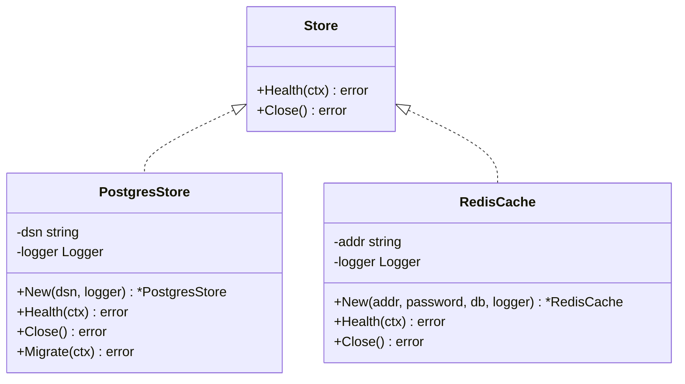
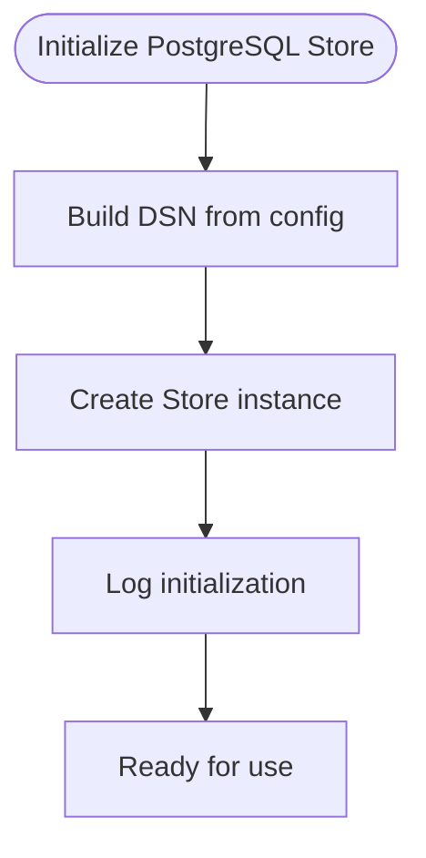
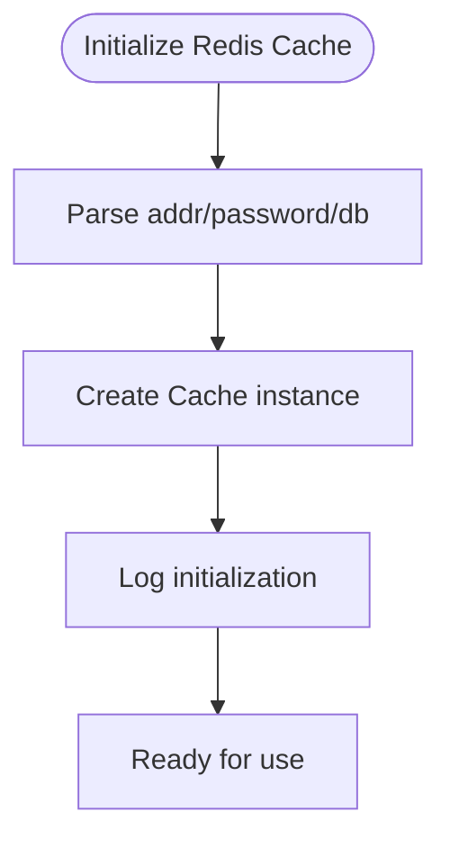
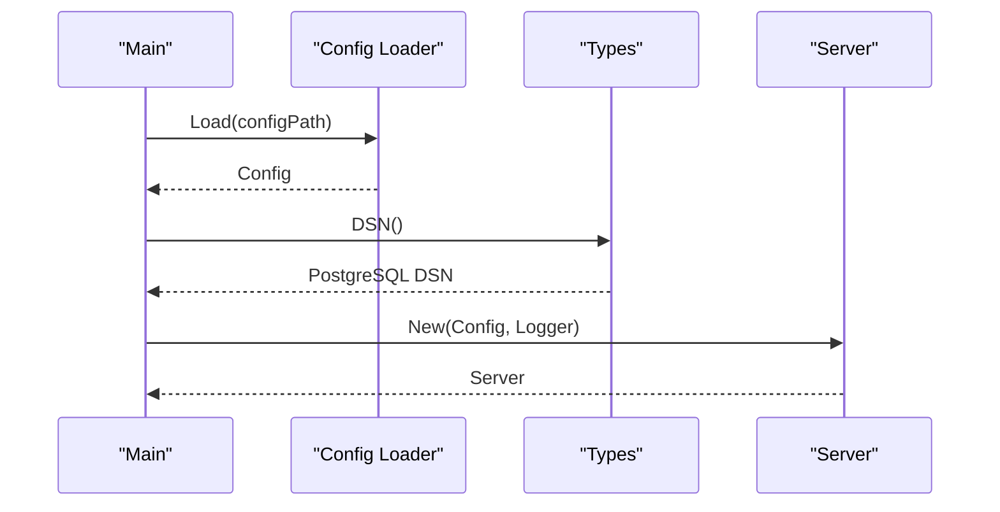
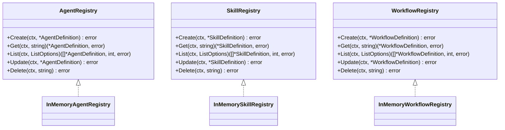
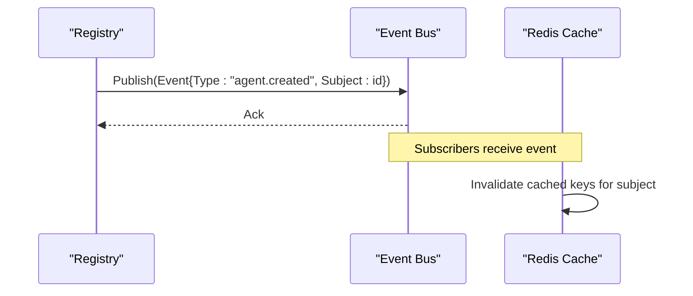
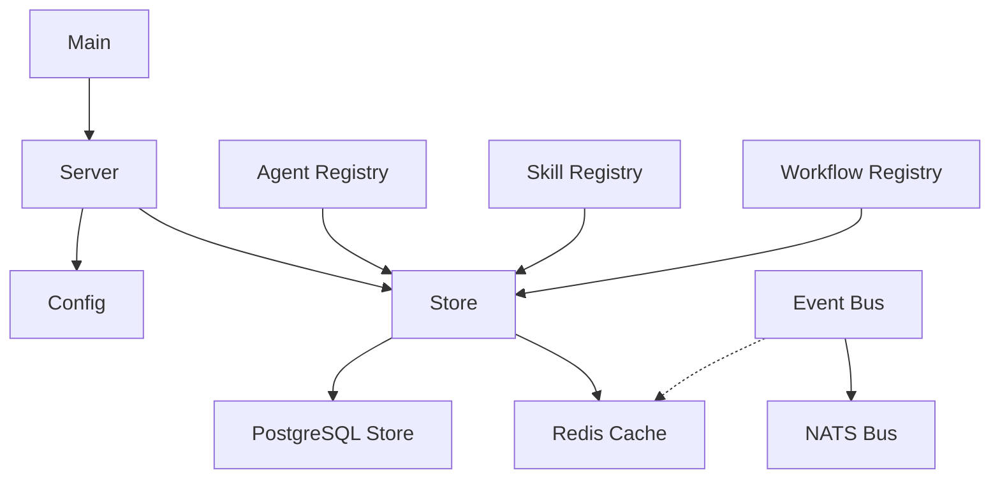

# Storage Layer

<cite>
**Referenced Files in This Document**
- [store.go](file://pkg/store/store.go)
- [postgres.go](file://pkg/store/postgres/postgres.go)
- [redis.go](file://pkg/store/redis/redis.go)
- [config.go](file://pkg/config/config.go)
- [types.go](file://pkg/config/types.go)
- [server.go](file://pkg/server/server.go)
- [main.go](file://cmd/resolvenet-server/main.go)
- [event.go](file://pkg/event/event.go)
- [nats.go](file://pkg/event/nats.go)
- [agent.go](file://pkg/registry/agent.go)
- [skill.go](file://pkg/registry/skill.go)
- [workflow.go](file://pkg/registry/workflow.go)
- [runbook-db.md](file://docs/demo/demo/rag/documents/runbook-db.md)
</cite>

## Table of Contents
1. [Introduction](#introduction)
2. [Project Structure](#project-structure)
3. [Core Components](#core-components)
4. [Architecture Overview](#architecture-overview)
5. [Detailed Component Analysis](#detailed-component-analysis)
6. [Dependency Analysis](#dependency-analysis)
7. [Performance Considerations](#performance-considerations)
8. [Troubleshooting Guide](#troubleshooting-guide)
9. [Conclusion](#conclusion)

## Introduction
This document describes the storage layer architecture of the platform, focusing on the dual-storage approach using PostgreSQL for persistent state and Redis for caching. It explains the storage abstraction layer, interface definitions, and implementation patterns. It also covers database schema design considerations, indexing strategies, and query optimization directions; Redis caching patterns, cache invalidation strategies, and distributed cache management; examples of storage operations, transaction handling, and data consistency patterns; performance optimization, connection pooling, and scaling considerations; and integration with registry systems and event processing for maintaining system state.

## Project Structure
The storage layer is organized around a small set of Go packages:
- pkg/store: Defines the storage abstraction and concrete implementations for PostgreSQL and Redis.
- pkg/config: Provides configuration structures and helpers for database, Redis, NATS, and other subsystems.
- pkg/server: Initializes and runs the platform services and integrates configuration.
- pkg/event: Defines the event bus abstraction and a NATS-backed implementation.
- pkg/registry: Defines registry interfaces and in-memory implementations for agents, skills, and workflows.

**Diagram sources**
- [server.go:19-52](file://pkg/server/server.go#L19-L52)
- [store.go:7-13](file://pkg/store/store.go#L7-L13)
- [postgres.go:9-25](file://pkg/store/postgres/postgres.go#L9-L25)
- [redis.go:8-24](file://pkg/store/redis/redis.go#L8-L24)
- [config.go:10-62](file://pkg/config/config.go#L10-L62)
- [types.go:3-70](file://pkg/config/types.go#L3-L70)
- [event.go:14-22](file://pkg/event/event.go#L14-L22)
- [nats.go:8-25](file://pkg/event/nats.go#L8-L25)
- [agent.go:21-28](file://pkg/registry/agent.go#L21-L28)
- [skill.go:21-28](file://pkg/registry/skill.go#L21-L28)
- [workflow.go:19-26](file://pkg/registry/workflow.go#L19-L26)

**Section sources**
- [server.go:19-52](file://pkg/server/server.go#L19-L52)
- [store.go:7-13](file://pkg/store/store.go#L7-L13)
- [postgres.go:9-25](file://pkg/store/postgres/postgres.go#L9-L25)
- [redis.go:8-24](file://pkg/store/redis/redis.go#L8-L24)
- [config.go:10-62](file://pkg/config/config.go#L10-L62)
- [types.go:3-70](file://pkg/config/types.go#L3-L70)
- [event.go:14-22](file://pkg/event/event.go#L14-L22)
- [nats.go:8-25](file://pkg/event/nats.go#L8-L25)
- [agent.go:21-28](file://pkg/registry/agent.go#L21-L28)
- [skill.go:21-28](file://pkg/registry/skill.go#L21-L28)
- [workflow.go:19-26](file://pkg/registry/workflow.go#L19-L26)

## Core Components
- Storage Abstraction
  - The Store interface defines the contract for health checks and resource cleanup. Concrete implementations include PostgreSQL and Redis.
- PostgreSQL Store
  - Implements initialization, health checks, close, and migration scaffolding. Uses a DSN derived from configuration.
- Redis Cache
  - Implements initialization, health checks, and close scaffolding for caching operations.
- Configuration
  - Provides typed configuration for server, database, Redis, NATS, runtime, gateway, and telemetry.
- Event System
  - The Bus interface defines publish/subscribe semantics; NATSBus is a placeholder implementation.
- Registry Systems
  - Interfaces for Agent, Skill, and Workflow registries define CRUD operations and are intended to operate against persistent storage.

**Section sources**
- [store.go:7-13](file://pkg/store/store.go#L7-L13)
- [postgres.go:9-44](file://pkg/store/postgres/postgres.go#L9-L44)
- [redis.go:8-36](file://pkg/store/redis/redis.go#L8-L36)
- [types.go:20-45](file://pkg/config/types.go#L20-L45)
- [config.go:10-62](file://pkg/config/config.go#L10-L62)
- [event.go:14-22](file://pkg/event/event.go#L14-L22)
- [nats.go:8-45](file://pkg/event/nats.go#L8-L45)
- [agent.go:21-28](file://pkg/registry/agent.go#L21-L28)
- [skill.go:21-28](file://pkg/registry/skill.go#L21-L28)
- [workflow.go:19-26](file://pkg/registry/workflow.go#L19-L26)

## Architecture Overview
The platform initializes configuration, constructs the server, and prepares subsystems. The storage layer is represented by the Store abstraction and its implementations. Registry systems consume the Store interface to persist and retrieve state. Events are published via the Bus interface and can be used to trigger cache invalidation or synchronization.

**Diagram sources**
- [main.go:16-56](file://cmd/resolvenet-server/main.go#L16-L56)
- [server.go:27-52](file://pkg/server/server.go#L27-L52)
- [config.go:10-62](file://pkg/config/config.go#L10-L62)
- [store.go:7-13](file://pkg/store/store.go#L7-L13)
- [postgres.go:27-31](file://pkg/store/postgres/postgres.go#L27-L31)
- [redis.go:26-30](file://pkg/store/redis/redis.go#L26-L30)

## Detailed Component Analysis

### Storage Abstraction Layer
The abstraction layer defines a minimal interface for storage operations, enabling interchangeable implementations.

**Diagram sources**
- [store.go:7-13](file://pkg/store/store.go#L7-L13)
- [postgres.go:9-25](file://pkg/store/postgres/postgres.go#L9-L25)
- [redis.go:8-24](file://pkg/store/redis/redis.go#L8-L24)

**Section sources**
- [store.go:7-13](file://pkg/store/store.go#L7-L13)
- [postgres.go:9-25](file://pkg/store/postgres/postgres.go#L9-L25)
- [redis.go:8-24](file://pkg/store/redis/redis.go#L8-L24)

### PostgreSQL Store Implementation
- Initialization: Creates a PostgreSQL store with a DSN and logger.
- Health: Placeholder for connection verification.
- Close: Placeholder for releasing resources.
- Migration: Placeholder for schema migrations.

**Diagram sources**
- [postgres.go:16-25](file://pkg/store/postgres/postgres.go#L16-L25)
- [types.go:30-38](file://pkg/config/types.go#L30-L38)

**Section sources**
- [postgres.go:9-44](file://pkg/store/postgres/postgres.go#L9-L44)
- [types.go:20-38](file://pkg/config/types.go#L20-L38)

### Redis Cache Implementation
- Initialization: Creates a Redis cache with address, password, and database index.
- Health: Placeholder for connectivity checks.
- Close: Placeholder for releasing the client.

**Diagram sources**
- [redis.go:15-24](file://pkg/store/redis/redis.go#L15-L24)
- [types.go:40-45](file://pkg/config/types.go#L40-L45)

**Section sources**
- [redis.go:8-36](file://pkg/store/redis/redis.go#L8-L36)
- [types.go:40-45](file://pkg/config/types.go#L40-L45)

### Configuration and Integration
- Configuration loading sets defaults for database host/port/user/password/dbname/sslmode, Redis address and database, NATS URL, and other service settings.
- The DSN builder composes a PostgreSQL connection string from configuration values.
- The server is constructed with configuration and logging, and runs both HTTP and gRPC servers.

**Diagram sources**
- [config.go:10-62](file://pkg/config/config.go#L10-L62)
- [types.go:30-38](file://pkg/config/types.go#L30-L38)
- [server.go:27-52](file://pkg/server/server.go#L27-L52)
- [main.go:24-34](file://cmd/resolvenet-server/main.go#L24-L34)

**Section sources**
- [config.go:10-62](file://pkg/config/config.go#L10-L62)
- [types.go:20-45](file://pkg/config/types.go#L20-L45)
- [server.go:27-52](file://pkg/server/server.go#L27-L52)
- [main.go:24-34](file://cmd/resolvenet-server/main.go#L24-L34)

### Registry Systems and Persistence Patterns
- Registry interfaces define Create, Get, List, Update, and Delete operations for agents, skills, and workflows.
- In-memory implementations are provided for development and testing.
- Persistent implementations would use the Store interface to perform durable operations.

**Diagram sources**
- [agent.go:21-41](file://pkg/registry/agent.go#L21-L41)
- [skill.go:21-41](file://pkg/registry/skill.go#L21-L41)
- [workflow.go:19-40](file://pkg/registry/workflow.go#L19-L40)

**Section sources**
- [agent.go:21-93](file://pkg/registry/agent.go#L21-L93)
- [skill.go:21-93](file://pkg/registry/skill.go#L21-L93)
- [workflow.go:19-93](file://pkg/registry/workflow.go#L19-L93)

### Event Processing and Cache Invalidation
- The Bus interface defines Publish and Subscribe operations and Close for resource cleanup.
- NATSBus is a placeholder implementation that logs publish/subscribe actions.
- Event-driven cache invalidation can be implemented by subscribing to registry updates and evicting stale keys.

**Diagram sources**
- [event.go:14-22](file://pkg/event/event.go#L14-L22)
- [nats.go:16-39](file://pkg/event/nats.go#L16-L39)
- [redis.go:8-24](file://pkg/store/redis/redis.go#L8-L24)

**Section sources**
- [event.go:7-22](file://pkg/event/event.go#L7-L22)
- [nats.go:8-45](file://pkg/event/nats.go#L8-L45)
- [redis.go:8-36](file://pkg/store/redis/redis.go#L8-L36)

## Dependency Analysis
- The server depends on configuration to construct gRPC and HTTP servers.
- The storage layer is currently abstracted behind interfaces with placeholder implementations.
- Registry systems depend on storage abstractions to persist state.
- Event bus is decoupled from storage and can coordinate cache invalidation.

**Diagram sources**
- [main.go:16-56](file://cmd/resolvenet-server/main.go#L16-L56)
- [server.go:27-52](file://pkg/server/server.go#L27-L52)
- [config.go:10-62](file://pkg/config/config.go#L10-L62)
- [store.go:7-13](file://pkg/store/store.go#L7-L13)
- [postgres.go:9-25](file://pkg/store/postgres/postgres.go#L9-L25)
- [redis.go:8-24](file://pkg/store/redis/redis.go#L8-L24)
- [agent.go:21-28](file://pkg/registry/agent.go#L21-L28)
- [skill.go:21-28](file://pkg/registry/skill.go#L21-L28)
- [workflow.go:19-26](file://pkg/registry/workflow.go#L19-L26)
- [event.go:14-22](file://pkg/event/event.go#L14-L22)
- [nats.go:8-25](file://pkg/event/nats.go#L8-L25)

**Section sources**
- [main.go:16-56](file://cmd/resolvenet-server/main.go#L16-L56)
- [server.go:27-52](file://pkg/server/server.go#L27-L52)
- [config.go:10-62](file://pkg/config/config.go#L10-L62)
- [store.go:7-13](file://pkg/store/store.go#L7-L13)
- [postgres.go:9-25](file://pkg/store/postgres/postgres.go#L9-L25)
- [redis.go:8-24](file://pkg/store/redis/redis.go#L8-L24)
- [agent.go:21-28](file://pkg/registry/agent.go#L21-L28)
- [skill.go:21-28](file://pkg/registry/skill.go#L21-L28)
- [workflow.go:19-26](file://pkg/registry/workflow.go#L19-L26)
- [event.go:14-22](file://pkg/event/event.go#L14-L22)
- [nats.go:8-25](file://pkg/event/nats.go#L8-L25)

## Performance Considerations
- Connection Pooling
  - PostgreSQL: Use a connection pool library to manage connections efficiently. Monitor active connections and adjust pool size based on workload.
  - Redis: Configure client pool settings to avoid connection saturation and reduce latency.
- Query Optimization
  - Schema design should include appropriate primary keys, foreign keys, and indexes for frequent query patterns.
  - Normalize where beneficial; denormalize selectively for read-heavy workloads.
  - Use prepared statements and parameterized queries to prevent overhead and injection risks.
- Caching Strategies
  - Cache hotspots with short TTLs; use cache-aside pattern for consistency.
  - Implement cache invalidation on write operations via event bus.
- Scaling
  - Horizontal scaling: shard by entity ID ranges or use a consistent hashing strategy.
  - Vertical scaling: increase pool sizes and optimize slow queries.
- Observability
  - Track pool utilization, query latency, and cache hit rates.

[No sources needed since this section provides general guidance]

## Troubleshooting Guide
- Database Connectivity Issues
  - Symptoms: Cannot acquire connection from pool, connection timeouts, authentication failures.
  - Actions: Verify network connectivity, database service status, firewall/security group rules, and credentials.
  - Monitoring: Track active connections, wait times, and error rates.
- Redis Connectivity Issues
  - Symptoms: Unable to ping Redis, timeouts during operations.
  - Actions: Confirm Redis endpoint, authentication, and network reachability.
- Health Checks
  - Implement and monitor health endpoints for PostgreSQL and Redis to detect failures early.

**Section sources**
- [runbook-db.md:1-79](file://docs/demo/demo/rag/documents/runbook-db.md#L1-L79)
- [postgres.go:27-31](file://pkg/store/postgres/postgres.go#L27-L31)
- [redis.go:26-30](file://pkg/store/redis/redis.go#L26-L30)

## Conclusion
The storage layer is designed around a clean abstraction that supports PostgreSQL for persistence and Redis for caching. While current implementations are placeholders, the architecture enables straightforward integration of production-grade drivers, connection pools, migrations, and cache invalidation strategies. Registry systems and the event bus provide a foundation for maintaining system state consistently across components.